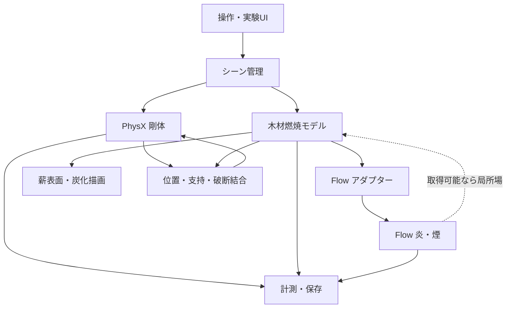

# 物理ベース・リアルタイム焚き火シミュレータ 設計文書

## 1. 文書情報

- 文書状態: 実装中・Phase 6A校正基盤完了
- 初版日: 2026-08-04
- 想定開発環境: Windows 11、NVIDIA RTX 3090（24 GB）、VS Code + Codex
- 開発リポジトリ（作成済み）: `C:\Users\junic\src\campfire-simulator`
- 初期開発で採用する実行基盤: NVIDIA Omniverse Kit
- 初期開発で採用する物理・描画要素: PhysX、NVIDIA Flow、RTX Renderer、OpenUSD
- 主な実装言語: Python（初期）、C++またはGPU実装（性能上必要になった箇所のみ）

この文書は、今後の調査と試作を通じて更新する「生きた設計文書」である。未確認事項を確定仕様として扱わず、`未決事項`、`仮説`、`検証済み`を区別して記録する。

---

## 2. プロジェクト概要

ユーザーがリアルタイムに薪を追加・移動でき、薪の形状、配置、温度、水分、空気の通りやすさなどに応じて燃焼状態が変化する、対話型の焚き火シミュレータを開発する。

目標は、防火工学用CFDの完全な再現でも、既製の炎パーティクルを薪に貼り付けるだけの視覚効果でもない。木材の加熱、乾燥、熱分解、気相燃焼、炭化、質量減少、支持喪失という主要な因果関係を保ちつつ、一般的なGPUで実時間動作する近似モデルを構築する。

### 2.1 中心となる体験

- ユーザーが薪をつかみ、焚き火へ追加できる。
- 薪は重力、衝突、摩擦に従って積み重なる。
- 火炎は単なる固定アニメーションではなく、燃料、温度、浮力、風、障害物に反応する。
- 細い薪は太い薪より着火しやすく、早く燃え尽きる。
- 湿った薪は着火しにくく、加熱初期に水分を失う。
- 薪を密に詰めると空気不足になり、適度な隙間があると燃えやすい。
- 新しい薪を載せると一時的に火勢が落ち、その後加熱されて着火する場合がある。
- 燃焼により薪が炭化・軽量化し、支持を失うと崩れる。
- 崩れによって通気が変わり、燃焼状態も変化する。

---

## 3. 目標と非目標

### 3.1 目標

1. RTX 3090級のGPUで、表示を原則30 fps以上に保つ。
2. 通常速度では、実時間1秒に対してシミュレーション時間も約1秒進む。
3. 薪の追加、移動、風の変更に数秒以内で火炎・煙が反応する。
4. 木材の乾燥、熱分解、炭化、残存質量を内部状態として保持する。
5. 定性的に妥当な比較ができる。
   - 乾燥薪と湿潤薪
   - 細薪と太薪
   - 井桁組み、並列配置、密集配置
   - 弱風、無風、強風
6. コード、物理モデル、パラメータ、検証シナリオを分離し、将来の差し替えを可能にする。
7. Codexがビルド、試験実行、ログ解析、画像確認を反復できる自動検証経路を用意する。

### 3.2 非目標

- 建築・消防・事故解析に使用できる工学精度の保証
- 詳細な燃焼化学、化学種ごとの反応、乱流燃焼の直接数値計算
- 木材の樹種・年輪・割れを初期版から完全に再現すること
- 任意形状の可燃物を初期版から扱うこと
- モバイル端末や非NVIDIA GPUへの初期対応
- 大規模な森林火災や室内火災のシミュレーション
- 完全な決定論的再現（GPU流体部分は実装により非決定的になり得る）

本シミュレータの結果は、現実の焚き火運用や火災安全判断には使用しない。

---

## 4. 成功条件

### 4.1 MVP成功条件

- アプリを起動すると、地面、初期薪、着火源が表示される。
- ユーザーが薪を追加し、PhysXによって自然に落下・積層する。
- 薪に追従する燃料・温度源からFlowの炎と煙が発生する。
- 薪表面温度が上昇し、着火条件を満たすと燃料放出が始まる。
- 着火源を除去しても、条件が整えば薪が一定時間自立燃焼する。
- 空気不足、低温、燃料枯渇のいずれかで火勢が落ちる。
- 乾燥薪と湿潤薪で、着火時間と燃焼曲線に明確な差が出る。
- 自動シナリオを実行すると、画像、CSV、ログが保存される。

### 4.2 MVP後の成功条件

- 薪の炭化領域が見た目と内部状態の両方に反映される。
- 質量・支持能力の低下により、薪が割れるか、複数セグメントへ移行する。
- 崩落後の通気変化が火勢に反映される。
- 実写実験またはFDS計算と、着火時間・質量減少・温度曲線を比較できる。

---

## 5. 基本設計方針

### 5.1 ハイブリッド物理モデル

すべてを単一の高解像度CFDで解くのではなく、現象ごとに異なる表現と更新周期を用いる。

| 現象 | 担当 | 表現 | 更新周期の初期目安 |
| --- | --- | --- | --- |
| 薪の落下・衝突・積層 | PhysX | 剛体・コライダー | 60 Hz |
| 木材内部の熱・水分・反応 | 独自燃焼モデル | 薪ローカル座標のセル | 5〜20 Hz |
| 炎・煙・浮力・風 | NVIDIA Flow | 疎3Dボクセル | 30〜60 Hzまたは性能依存 |
| 炭化・発光・表面変化 | 独自描画状態 | マテリアル属性・マスク | 10〜30 Hz |
| 統計・ログ出力 | 計測モジュール | CSV/JSON | 1〜10 Hz |

物理時間は固定タイムステップで進め、描画フレームレートの変動から可能な限り分離する。

### 5.2 権威状態の分離

- 木材の温度、水分、未燃木材、炭、灰、残存質量は独自燃焼モデルを正とする。
- 薪の位置・姿勢・速度はPhysXを正とする。
- 炎・煙・気体速度はFlowを正とする。
- USDはシーン構成と永続化の中心に使うが、高頻度・大容量のセル状態をすべてUSD属性として毎フレーム保存しない。

### 5.3 Flowへの依存を隔離する

Flowは `IFluidBackend` 相当の境界の内側に置く。木材燃焼モデルがFlow固有APIを直接呼ばない構造にする。

必要な抽象操作は次のとおり。

- 燃料・温度・煙・速度源の登録と更新
- 障害物の登録と姿勢更新
- シミュレーション開始・停止・ステップ実行
- 統計情報の取得
- 可能なら局所温度・速度・燃焼状態のサンプリング
- キャプチャまたはボリューム出力

Flowから薪への場の読み戻しが実用的でない場合、薪への熱流束は独自の近似モデルで計算する。この可能性を初期段階で必ず検証する。

---

## 6. システム構成



### 6.1 主要モジュール

#### App Shell

- Kitアプリの設定
- Extensionの読み込み
- ウィンドウ、メニュー、タイムライン
- 開発モードと利用者モードの切り替え

#### Scene Manager

- OpenUSD Stageの生成・読み込み・保存
- 薪、地面、石、着火源、風の生成
- シーン内IDと内部シミュレーションIDの対応付け

#### Log Factory

- 薪形状、寸法、密度、樹種プリセット、含水率の設定
- 表示メッシュ、PhysXコライダー、燃焼セルの同時生成
- 初期版では円柱または低ポリゴンの割薪を対象とする

#### Rigid Body Adapter

- PhysX剛体・コライダーの生成
- 摩擦、質量、重心、速度の取得
- 燃焼による質量変化の反映
- 支持喪失時のセグメント分割またはコライダー交換

#### Wood Combustion Solver

- 熱伝導
- 水分蒸発
- 熱分解ガスの生成
- 炭化
- 炭の酸化
- 質量・発熱量の更新
- Flowへ渡すEmitterサンプルの生成

#### Flow Adapter

- Flow Extensionの初期化
- Point/Sphere/Box/NanoVDB Emitterの選択
- 薪表面サンプルをFlow入力へ変換
- 動く薪への追従
- パラメータとFlowバージョン差の吸収

#### Visual State

- 温度に応じた赤熱
- 未燃、乾燥、焦げ、炭、灰のマテリアル遷移
- ノーマル、粗さ、色、発光の更新
- 初期版では形状を連続侵食せず、マスクと段階的メッシュ交換を優先する

#### Metrics and Capture

- 各薪と全体の温度、水分、各質量、発熱率
- Flowブロック数、GPU時間、描画fps
- 固定カメラからの画像・動画
- シナリオごとのCSV/JSON出力

---

## 7. 木材モデル

### 7.1 初期形状

MVPでは薪を概ね円柱または角を落とした直方体として扱う。任意メッシュ対応よりも、燃焼状態を安定して分割・計算できることを優先する。

円柱薪の初期セル構造案:

- 長さ方向: 24〜64分割
- 周方向: 12〜24分割
- 半径方向: 4〜12層
- 1本あたり: 約1,000〜10,000セル

セルは薪のローカル座標に固定し、薪が剛体として移動・回転しても内部配列を再ボクセル化しない。

### 7.2 セル状態

各セルは最低限、以下を持つ。

```text
temperature_K
moisture_mass
dry_wood_mass
volatile_potential
char_mass
ash_mass
oxygen_factor
surface_exposure
phase
```

`phase` の候補:

```text
WET_WOOD
DRY_WOOD
PYROLYZING
CHAR
ASH
DEPLETED
```

状態遷移は単一の閾値だけで決めず、反応速度と残存量から決める。ただしMVPでは、まず区分線形モデルで因果関係を成立させ、その後Arrhenius型反応速度へ置き換えられる設計にする。

### 7.3 熱収支

セル温度は概念的に次で更新する。

```text
蓄熱量の変化
  = 内部熱伝導
  + 周囲気体からの対流熱
  + 炎・高温物体からの放射熱
  + 炭酸化による発熱
  - 水分蒸発の潜熱
  - 熱分解に伴う吸熱
  - 周囲への放熱
```

初期版の熱源は次のように近似する。

- 内部熱伝導: 隣接セル間の有限差分
- 対流: 表面セル温度、周囲温度、局所風速に基づく係数モデル
- 放射: 炎領域または高温表面からの距離・遮蔽を使う近似
- 周囲温度: Flowから取得可能ならサンプリングし、不可なら独自の局所熱源モデルを使う

木材の熱伝導率は繊維方向と半径方向で異なるため、将来的に異方性を導入できる係数構造にする。

### 7.4 水分蒸発

- セル温度が沸点付近へ近づくと、水分蒸発が増える。
- 蒸発中は潜熱により温度上昇が抑制される。
- 蒸発水分は初期版では煙表示用の白色成分または追加の可視化源として扱える。
- 含水率は乾量基準または湿量基準のどちらを採用したか、データ定義で明示する。

### 7.5 熱分解と気相燃料

- 十分な温度へ達した乾燥木材は、熱分解ガスと炭へ変化する。
- 熱分解ガス量をFlowの `fuel` 入力へ変換する。
- 熱分解が起きても、酸素や温度が不足すれば周囲で完全燃焼しない。
- Flow内の気相燃焼量を直接取得できない場合、木材側の質量減少とFlow表示が乖離しないよう、Emitter投入量を木材側の放出量に厳密に従わせる。

### 7.6 炭化と炭燃焼

- 熱分解後に炭が残る。
- 炭化層は未燃木材への熱伝達を弱める。
- 炭は表面かつ酸素供給のある場所でゆっくり酸化し、発熱する。
- 炭の赤熱はFlow炎とは別に薪マテリアルの発光として描画する。
- 炭が失われると灰または空隙へ遷移する。

### 7.7 酸素供給の近似

MVPでは局所酸素濃度を厳密に解かず、次の要素から `oxygen_factor` を推定する。

- 表面が外気へ露出している割合
- 周辺薪による遮蔽
- 局所風速
- 上下方向の通気経路
- Flowから利用可能な燃焼・速度場

遮蔽判定にはPhysX Scene Queryまたは簡略レイキャストを使用する。完全密閉、薪同士の接触部、灰に埋もれた部分では値を低下させる。

---

## 8. Flowとの結合

### 8.1 Flowへ入力する値

薪表面セルから、少なくとも次を生成する。

- 位置
- 表面法線
- 燃料放出率
- 温度
- 煙生成率
- 初速度
- Emitter有効範囲

初速度は表面法線方向への弱い放出と、薪の剛体速度を組み合わせる。

### 8.2 Emitter方式の候補

1. Point Emitter
   - 表面セルと対応させやすい。
   - 動く薪や部分燃焼に向く。
   - 点数が多い場合の性能を検証する。
2. Sphere/Box Emitter
   - 初期試作が容易。
   - 細かな燃焼分布を表現しにくい。
3. NanoVDB Emitter
   - 複雑な分布をまとめて渡せる可能性がある。
   - 更新コストとAPIの複雑さを検証する。

MVPの最初はSphereまたはBoxで成立確認し、その後Point Emitterへ移行する。

### 8.3 未確認事項

以下はKit/Flowの対象バージョンで実測するまで未決とする。

- Flow場をCPUまたは独自GPUカーネルから局所サンプリングできるか。
- 読み戻しが毎フレーム可能な速度か。
- Flow障害物を移動薪へ追従させた場合のコストと安定性。
- 多数のPoint Emitterを動的更新した場合の上限。
- Flowの燃焼モデルが木材熱分解ガスの見た目に十分適合するか。
- Flow、PhysX、独自燃焼計算の時間同期方法。
- Flowを含む最終アプリの配布条件とパッケージサイズ。

### 8.4 読み戻し不可の場合

Flowを主に気相の移流・炎煙表示へ使い、薪への熱還流は独自近似にする。

- 各燃焼表面セルを放射・対流熱源として登録する。
- 周辺セルへの熱は距離、遮蔽、風向で配分する。
- Flowは同じ燃料放出量を受け取り、視覚的な炎・煙を生成する。
- 木材モデルとFlowは燃料放出量を共有するため、一方向結合でも大きな因果破綻を避ける。

---

## 9. 薪の剛体・崩壊モデル

### 9.1 初期版

- 薪1本を1剛体として扱う。
- コライダーは単純化した凸形状を用いる。
- 質量は残存木材・炭質量に応じて段階的に更新する。
- 見た目の侵食はマテリアルで表現し、コライダーは頻繁に変更しない。

### 9.2 分割版

薪を長さ方向の複数セグメントとして内部的に準備する。

- 健全時は拘束で1本の薪として動作する。
- 特定断面の残存支持率が閾値を下回ると拘束を解除する。
- 分割後は各部分が独立した剛体になる。
- 破断位置は燃焼状態に基づき、単なる乱数だけで決めない。

連続的なメッシュ侵食とコライダー再生成は高コスト・不安定になりやすいため、後期課題とする。

---

## 10. 描画設計

### 10.1 炎と煙

- Flowの温度、燃料、燃焼、煙チャンネルを利用する。
- 温度から炎色を決めるカラーマップを調整する。
- Bloom、露出、トーンマッピングを固定テスト条件として保存する。
- 画質比較時はカメラと露出を固定し、物理差と描画差を混同しない。

### 10.2 薪表面

表面状態から以下を補間する。

- 色: 木肌 → 乾燥 → 黒化 → 灰白色
- 粗さ: 木肌 → 炭化による変化
- 法線: 炭化・亀裂の細部表現
- 発光: 高温炭の赤熱
- マスク: 燃え尽きた領域の不可視化または段階的メッシュ交換

亀裂は初期版では手続きテクスチャと温度・炭化量のマスクで表現し、物理破壊との一致は分割時のみ保証する。

### 10.3 火の粉

火の粉はFlowとは別の軽量粒子系で扱う候補とする。発生率は炭燃焼率、薪の移動・崩落、局所上昇流に連動させる。

---

## 11. ユーザー操作

### 11.1 MVP操作

- 薪を追加
- 薪プリセットを選択
- 初期含水率を設定
- マウスで薪をつかんで移動・回転
- 着火源を配置・除去
- 風向・風速を変更
- 一時停止、再開、リセット
- 通常速度、低速、可能なら時間加速
- 温度・炭化・水分などのデバッグ表示切り替え

### 11.2 将来操作

- 火かき棒
- 薪割り
- 落ち葉、樹皮、着火材
- 薪の樹種と乾燥状態
- 雨、水、消火
- VR操作

---

## 12. 保存形式

### 12.1 シーン

- OpenUSD: 薪、地面、石、カメラ、照明、物理設定、ユーザー配置
- 独自属性: 薪ID、材質プリセット、初期含水率、燃焼モデルバージョン

### 12.2 高密度状態

- NPZまたは別のバイナリ形式: 木材セル配列
- JSON: メタデータ、シミュレーション時刻、乱数シード、各モジュールのバージョン
- CSV: 時系列計測結果

保存状態は完全なGPU流体場を含まない簡易チェックポイントと、必要ならFlow状態も含む完全チェックポイントを分ける。

### 12.3 再現性

保存する情報:

- アプリ・Extensionバージョン
- Kit、PhysX、Flowバージョン
- 物理・燃焼パラメータセットのハッシュ
- シナリオID
- 乱数シード
- 固定タイムステップ
- GPU、ドライバ情報

---

## 13. リポジトリ構成案

```text
campfire-simulator/
├─ AGENTS.md
├─ README.md
├─ DESIGN.md
├─ CHANGELOG.md
├─ repo.toml
├─ source/
│  ├─ apps/
│  │  └─ campfire.simulator.kit
│  └─ extensions/
│     ├─ campfire.app/
│     ├─ campfire.scene/
│     ├─ campfire.wood_model/
│     ├─ campfire.flow_adapter/
│     ├─ campfire.physx_adapter/
│     ├─ campfire.visuals/
│     ├─ campfire.metrics/
│     └─ campfire.tests/
├─ native/
│  └─ wood_solver/
├─ assets/
│  ├─ logs/
│  ├─ materials/
│  └─ scenarios/
├─ config/
│  ├─ materials/
│  ├─ rendering/
│  └─ simulation/
├─ scripts/
│  ├─ run_scenario.py
│  ├─ capture_scenario.py
│  ├─ compare_metrics.py
│  └─ export_report.py
├─ tests/
│  ├─ unit/
│  ├─ integration/
│  └─ scenarios/
└─ artifacts/
   └─ .gitkeep
```

`DESIGN.md` は本書をリポジトリ導入時に移したものとし、設計変更をコード変更と同じ履歴で管理する。

---

## 14. Codex向け開発・検証設計

### 14.1 原則

ユーザーがKitのGUIで手作業しないと検証できない機能を避ける。GUIのボタンが呼ぶ処理は、同じ引数でテストやコマンドからも呼べるサービス関数として実装する。

### 14.2 必須コマンド

実装開始時に、少なくとも次の単一コマンドを整備する。実際の名称はKit App Templateに合わせて確定する。

```powershell
# ビルド
.\repo.bat build

# 単体・Extensionテスト
.\repo.bat test

# 開発アプリ起動
.\repo.bat launch

# 固定シナリオ自動実行
.\scripts\run_scenario.ps1 dry_log_ignition

# 結果比較
.\scripts\compare_scenario.ps1 dry_log_ignition
```

`repo.bat test` が対象バージョンに存在するか、またはどのテストコマンドが正しいかは、プロジェクト生成後に確認して文書を更新する。

### 14.3 自動シナリオの出力

```text
artifacts/<scenario>/<run-id>/
├─ config.json
├─ kit.log
├─ metrics.csv
├─ summary.json
├─ frame_0000.png
├─ frame_0300.png
├─ frame_0900.png
└─ preview.mp4
```

### 14.4 Codexが判定できる条件

- プロセス終了コード
- ログ内エラー数
- NaN、発散、負質量の有無
- 平均・最大フレーム時間
- 着火までの時間
- 最大発熱率とその時刻
- 残存水分、木材、炭、灰の質量収支
- 画像差分と固定カメラの目視確認

視覚品質だけで合否を決めず、保存された物理量と不変条件を併用する。

### 14.5 AGENTS.mdへ記載する予定の要点

- GUI操作を要求する前に、ヘッドレスまたはスクリプト実行経路を探す。
- Flow・PhysX・Kitのバージョンを無断更新しない。
- 物理パラメータ変更は理由と比較結果を記録する。
- ゴールデン画像だけを物理正当性の証拠にしない。
- 単位をSIで統一し、無次元値と表示用倍率を区別する。
- 未確認APIを想像で実装せず、対象SDKのサンプルと実行結果で確認する。

---

## 15. テスト計画

### 15.1 単体テスト

- 熱伝導のみで全体エネルギーが不自然に増えない。
- 水分量、木材量、炭量、灰量が負にならない。
- 蒸発による質量減少と潜熱消費が対応する。
- 熱分解による木材減少量と、ガス・炭生成量が対応する。
- 座標変換後もEmitterが薪表面に残る。
- 薪が回転してもローカル燃焼セルが崩れない。

### 15.2 統合テスト

- 移動する薪にFlow Emitterと障害物が追従する。
- PhysXステップと燃焼ステップの時間が一致する。
- 薪を追加しても既存薪のIDと状態が保持される。
- 保存・再読込後に木材状態が許容誤差内で一致する。

### 15.3 標準シナリオ

| ID | 内容 | 主な確認項目 |
| --- | --- | --- |
| `single_dry_kindling` | 乾いた細薪1本 | 着火と燃え尽き |
| `single_wet_log` | 湿った太薪1本 | 蒸発、着火遅延 |
| `two_log_transfer` | 燃焼薪から未燃薪へ加熱 | 熱伝達と延焼 |
| `dense_stack` | 隙間の少ない積層 | 酸素不足 |
| `log_cabin_stack` | 井桁組み | 通気と安定燃焼 |
| `moving_burning_log` | 燃焼薪を移動 | 剛体・Emitter追従 |
| `collapse_reignition` | 支持喪失による崩落 | 通気変化と再燃 |
| `crosswind` | 横風 | 炎・煙の偏向、燃焼変化 |

### 15.4 不変条件

- 質量とエネルギーの生成・消失が、モデルで定義した源・吸収を除き説明可能である。
- セル温度、水分、各質量にNaNまたは無限大がない。
- シミュレーション時間が逆行しない。
- 薪IDはセグメント分割時を除き変化しない。
- 一時的な描画負荷低下が物理時間の暴走を起こさない。

---

## 16. 性能予算

初期目標値。実測後に更新する。

| 項目 | 目標 |
| --- | ---: |
| 表示 | 30 fps以上 |
| 1フレーム平均 | 33 ms以下 |
| PhysX | 2 ms以下 |
| 木材燃焼 | 4 ms以下 |
| Flow | 15 ms以下 |
| 描画 | 10 ms以下 |
| その他 | 2 ms以下 |
| 同時薪数 | MVP 20本、目標50本 |
| 木材セル総数 | MVP 100k以下、目標500k程度 |

Flow負荷は割り当てブロック数に強く依存するため、固定ボクセル解像度だけでなく、アクティブブロック数を計測する。

性能不足時の縮退順:

1. Flow更新頻度を下げ、描画で補間する。
2. Flowの解像度・最大ブロック数を下げる。
3. 木材の内部セル更新頻度を下げる。
4. 低活動セルを休眠させる。
5. 薪セルの空間解像度を適応的に下げる。
6. Python実装のホットスポットをC++またはGPUへ移す。

---

## 17. 開発フェーズと判断ゲート

### Phase 0: 環境成立確認

- `C:\Users\junic\src\campfire-simulator` をKitプロジェクト兼Gitリポジトリとして初期化
- Kit App TemplateからBase Editorを生成
- Windows上でビルド・起動
- 固定シーンを保存
- 固定カメラ画像を自動出力

完了条件: Codexがコマンドだけでビルドから画像出力まで実行できる。

### Phase 1: Flow技術スパイク

- 標準火炎を表示
- Emitterを動かす
- 剛体障害物との相互作用を確認
- Flow統計とGPU時間を記録
- 局所場の取得可否を調査・実測

判断ゲート:

- Flowを継続採用するか。
- 一方向結合か双方向結合か。
- Point Emitter、NanoVDB、単純Emitterのどれを採るか。

### Phase 2: 薪・剛体MVP

- 薪生成
- 追加、把持、落下、積層
- Emitter追従
- 基本UI

### Phase 3: 木材熱モデルMVP

- 熱伝導
- 蒸発
- 区分線形熱分解
- 炭化
- Flow燃料放出
- CSV計測

### Phase 4: 配置と通気

- 接触・遮蔽
- 酸素係数
- 風
- 標準積層シナリオ比較

### Phase 5: 崩壊

- 残存支持率
- セグメント拘束解除
- 質量・コライダー更新
- 崩落後の再燃

### Phase 6: 校正と品質向上

- FDSまたは実験データとの比較
- Arrhenius型反応モデルの検討
- マテリアル、火の粉、音響
- 性能最適化

### Phase 7: 製品化判断

- Kitのまま専用アプリ化
- Unreal等へ移植
- 独自Flowバックエンド開発
- 配布サイズ、ライセンス、対象GPU、UXを比較

---

## 18. リスク

| リスク | 影響 | 対応 |
| --- | --- | --- |
| Flow場を薪側から読めない・遅い | 双方向結合が困難 | 独自熱還流モデル、一方向結合 |
| Flow APIやExtensionの変更 | 保守負担 | Adapter隔離、バージョン固定 |
| Python木材計算が遅い | 実時間未達 | 配列化、Warp/C++/GPU移行 |
| 動的障害物がFlowを不安定化 | 薪移動時の破綻 | 簡略障害物、更新頻度制限 |
| 煙は自然だが燃焼量が不自然 | 見た目と物理の乖離 | 木材側を質量の権威状態にする |
| 連続形状侵食が高コスト | 崩壊表現が難しい | 段階メッシュ、事前セグメント |
| 物理パラメータが多すぎる | 調整不能 | 材料プリセット、感度分析、校正 |
| GPU流体の非決定性 | 回帰試験が不安定 | 数値許容範囲、統計・画像の併用 |
| Kit配布が重い | 一般向け製品化に不利 | 技術検証後に基盤を再評価 |
| 見た目調整が物理調整を汚染 | モデルの意味が失われる | 表示倍率と物理量を分離 |

---

## 19. 未決事項

### 19.1 優先度A: 実装開始前またはPhase 1で決定

- 使用するKit SDK、PhysX、Flowの固定バージョン
- Windowsネイティブ開発か、Linux開発か
- Flowの局所場読み戻しAPIと性能
- FlowとPhysXの動的障害物結合方法
- Kit App Templateの正しいテスト・ヘッドレス実行コマンド
- 最初の薪形状を円柱にするか割薪形状にするか
- シミュレーション単位系とUSD Stage単位

### 19.2 優先度B: 木材モデル実装時に決定

- 含水率の定義
- 樹種プリセットと物性値の出典
- 区分線形モデルからArrheniusモデルへ移る条件
- 放射熱の近似方法
- 酸素係数の計算法
- 炭化層の熱抵抗モデル

### 19.3 優先度C: MVP後

- 破断モデル
- 灰の物理表現
- 火の粉
- 音響
- VR
- 一般配布方法
- 非NVIDIA GPU対応

---

## 20. 参考実装・資料

### NVIDIA / Omniverse

- Omniverse Kit概要  
  https://docs.omniverse.nvidia.com/kit/docs/kit-manual/latest/guide/kit_overview.html
- Kit App Template  
  https://github.com/NVIDIA-Omniverse/kit-app-template
- Kit Editor Extensionチュートリアル  
  https://docs.omniverse.nvidia.com/kit/docs/kit-app-template/latest/docs/extending_editors.html
- NVIDIA Flow概要  
  https://nvidia-omniverse.github.io/PhysX/flow/index.html
- Flowのチャンネル  
  https://docs.omniverse.nvidia.com/extensions/latest/ext_fluid-dynamics/understanding.html
- Flow Emitter設定  
  https://docs.omniverse.nvidia.com/extensions/latest/ext_fluid-dynamics/settings.html
- PhysXリポジトリ  
  https://github.com/NVIDIA-Omniverse/PhysX

### 木材燃焼・火災シミュレーション

- Interactive Wood Combustion for Botanical Tree Models（部分実装）  
  https://github.com/art049/InteractiveWoodCombustion
- FlameForge: Combustion of Generalized Wooden Structures  
  https://arxiv.org/abs/2412.16735
- NIST Fire Dynamics Simulator  
  https://www.nist.gov/services-resources/software/fds-and-smokeview
- WebGLリアルタイム火炎の小規模実装  
  https://github.com/andrewkchan/fire-simulation

---

## 21. 設計判断ログ

設計変更時は以下の形式で追記する。

```text
### YYYY-MM-DD: 判断の題名

- 状態: 提案 / 採用 / 却下 / 保留 / 置換
- 背景:
- 選択肢:
- 判断:
- 根拠:
- 影響:
- 再検討条件:
```

### 2026-08-04: 初期開発基盤にOmniverse Kitを採用する

- 状態: 採用
- 背景: PhysX、Flow、RTX描画、OpenUSD、Python Extensionを同一環境で検証できる。
- 選択肢: Omniverse Kit、Unreal Engine、Unity、独自C++/GPU実装。
- 判断: Phase 0からMVPまではOmniverse Kitを開発・実行基盤として採用する。Flowを含む各要素の適否は、段階ごとの技術検証で個別に判断する。
- 根拠: 炎・煙のリアルタイム疎ボクセル流体と剛体を早期に組み合わせられる可能性が高い。
- 影響: 初期実装はKit Extension中心になる。ただし木材モデルはKit/Flowから分離する。
- 再検討条件: MVP後に一般配布へ進む場合、またはKit自体の性能・実装・配布上の制約でMVPを成立させられないことが判明した場合。Flowだけが要求を満たさない場合は、Kit全体を直ちに変更せず、まず流体バックエンドの差し替えを検討する。

### 2026-08-04: 木材状態を権威状態とする

- 状態: 採用
- 背景: Flowの炎表示だけを正とすると、木材質量・熱分解量との整合が保証できない。
- 判断: 木材の温度、水分、未燃物、炭、灰、質量は独自モデルを正とする。
- 影響: Flowは燃料放出量を木材モデルから受け取る。Flowからの熱帰還は利用可能性に応じて追加する。
- 再検討条件: 将来、気相と固相を一体で高速に解けるバックエンドへ移行する場合。

### 2026-08-04: Flowを一方向結合から継続採用する

- 状態: 採用
- 背景: Phase 1でFlow 110.0.0の火炎生成、移動Emitter、USD Physicsコライダー、統計取得、NanoVDB CPU読み戻しをRTX 3090上で検証した。
- 選択肢: Flowを継続して一方向結合、Flowを即座に双方向結合、別の流体バックエンドへ置換。
- 判断: MVPでは木材モデルを権威状態とし、燃料・温度・速度源をFlowへ渡す一方向結合から開始する。Sphere Emitterは成立確認用とし、薪表面の表現にはPoint Emitterを次段階で評価する。
- 根拠: 220 updateの実測で火炎描画とEmitter追従が成立し、active blockは最大154、ウォームアップ後のend-to-end更新は平均9.02 msだった。raw NanoVDBはCPUへ取得できたが、取得呼び出しだけで17.32 msを要し、世界座標の局所点へ変換するアダプターは未実装である。
- 影響: Phase 2と3はFlow場の毎フレーム読み戻しに依存しない。熱帰還は独自近似を先に用意し、NanoVDBアダプターの性能と妥当性が確認できた場合に補助入力として追加する。
- 再検討条件: Point Emitterの更新負荷が30 fps目標を超える場合、局所場アダプターが十分低遅延で成立する場合、またはFlowの配布・安定性制約がMVPを阻害する場合。

### 2026-08-04: 開発リポジトリの配置を確定する

- 状態: 採用
- 背景: ユーザーが従来から使用しているソース配置規約に合わせる。
- 判断: `C:\Users\junic\src\campfire-simulator` をKitプロジェクト兼Gitリポジトリのルートとする。
- 根拠: 十分に短いローカルパスであり、既存の開発運用とも整合する。
- 影響: このルート直下に `repo.bat`、`repo.toml`、`source/`、`DESIGN.md` などを置く。別のKit用親リポジトリやシンボリックリンクは作らない。
- 再検討条件: Kitのビルドまたはパッケージ作成で実際にパス長問題が発生した場合。その場合も、まず出力先の短縮を試し、必要な場合だけリポジトリを移動する。

---

## 22. 実装開始時にCodexへ渡す指示の骨子

実装開始時は、本書と対象リポジトリをCodexへ渡し、まずPhase 0だけを依頼する。

```text
DESIGN.mdを読み、未決事項と仮説を確定仕様として扱わないでください。
最初はPhase 0「環境成立確認」だけを実装してください。
対象ルートは C:\Users\junic\src\campfire-simulator です。このディレクトリをKitプロジェクト兼Gitリポジトリとして使用してください。

1. リポジトリと利用可能なKit SDKを調査する。
2. 対象バージョンを記録する。
3. Base Editorアプリと最小Extensionを作る。
4. コマンドラインからビルド・起動できるようにする。
5. 固定シーンを生成し、固定カメラ画像を自動保存する。
6. 再実行可能なテスト手順をREADME.mdへ記載する。
7. 実測した事実、未解決点、設計への影響をDESIGN.mdへ反映する。

GUIだけでしか実行できない手順を作らないでください。
Flowや木材燃焼モデルの本実装にはまだ着手しないでください。
既存のユーザー変更を保持し、ビルドとテスト結果を報告してください。
```

Phase 0完了後、結果を本書へ反映してからPhase 1を依頼する。

---

## 23. Phase 0 実測結果

### 2026-08-04: 環境成立確認を完了する

- 状態: 採用
- 対象環境: Windows 11 Pro 23H2、Intel Core i7-14700、約128 GB RAM、NVIDIA GeForce RTX 3090 24 GB、NVIDIA Driver 591.86。
- 基盤: NVIDIA Omniverse Kit App Template commit `483e364a4176f102f2d3c3aaf9f301a103d61d69`。
- 固定バージョン: Kit SDK `110.2.0+feature.342835.698af100.gl`、PhysX `110.1.1`、Warp `1.14.0`。FlowはPhase 0では依存関係へ追加せず、バージョンとAPIの適合確認をPhase 1へ残す。
- Stage単位: Z-up、`metersPerUnit = 1`、重力加速度 `9.81 m/s²`を採用した。
- 実装: Base Editorアプリ `campfire.simulator.kit` とPython Extension `campfire.app` を作成した。Extensionは地面、12個の石、4本の薪、着火位置マーカー、照明、固定カメラを決定的に生成する。
- 自動化: `scripts/run_phase0.bat`（本体は `run_phase0.ps1`）がウィンドウなしでアプリを起動し、`assets/scenes/phase0.usda`、1280×720 PNG、JSON要約を保存して終了する。バッチ入口によりPowerShell実行ポリシーの影響を避ける。
- 検証結果: `.\\repo.bat build` 成功、`.\\repo.bat test` で3テスト成功、ヘッドレスキャプチャ成功。SDK取得済みの実測では自動検証は約21秒で終了した。
- 非阻害警告: Intel内蔵GPUのスキップ、ローカルCache Server未接続、起動直後のmaterial library cache警告を確認した。画像キャプチャ後にFabricのinterface version警告も出るため、Phase 1で再確認する。いずれもPhase 0の終了コード、USD、画像、要約の生成は阻害しなかった。
- 判断: Phase 0の受け入れ条件を満たしたため、次はFlow単体のEmitterと固定カメラ出力を検証するPhase 1へ進める。ただし木材燃焼モデルとの結合はまだ行わない。
- 再検討条件: Phase 1でFlowの起動、局所場読み戻し、ヘッドレスキャプチャ、またはRTX 3090上の性能が成立しない場合。

---

## 24. Phase 1 実測結果

### 2026-08-04: Flow技術スパイクを完了する

- 状態: 採用
- 固定バージョン: Kit SDK `110.2.0`、Flow `110.0.0`、Flow USD schema `110.0.0`、PhysX `110.1.1`、NVIDIA Driver `591.86`。
- シーン: SI単位・Z-upのPhase 0シーンへ、半径`0.18 m`、温度`2.0`、燃料`0.8`の`FlowEmitterSphere`を追加した。Flow cell sizeは`0.025 m`。4本の薪には`PhysicsCollisionAPI`を適用し、Flow側の物理衝突を有効にした。
- 動的検証: Emitterをframe 70から140の間にx=`-0.18 m`から`0.18 m`へ移動し、frame 90と220を1280×720 PNGで保存した。両画像でFlow火炎を確認し、JSONで終点一致を検証した。
- Flow統計: 220 updateでactive blockは最終142、最大154、上限4096。ウォームアップ30 updateを除くend-to-end viewport updateは平均`9.022 ms`、p95 `11.4151 ms`、シミュレーション区間は`3.241 s`だった。
- GPU計測: `nvidia-smi`を250 ms間隔で92点記録した。アプリ起動から終了までの全GPU利用率は平均`19.49%`、最大`99%`、最大使用メモリ`7247 MiB`、利用率積分による活動時間推定`4482.5 ms`。これはFlowカーネル単体時間ではない。対象Flow APIからカーネル単体時間を取得できなかったため、値を推測しない。
- 局所場: CPU readbackを有効にすると、temperature / fuel / burn / smokeが各`1,948,592 words`、velocityが`1,432,312 words`のraw NanoVDBとして取得できた。取得呼び出しは`17.3153 ms`。divergenceは0 wordsだった。任意の世界座標一点を直接返す検証済みAPIは確認できず、NanoVDB座標変換・補間を担う専用アダプターが必要。
- 自動化: `scripts/run_phase1.bat`はウィンドウなしでFlowを220 update進め、2画像、USD、JSON、GPU CSVを生成し、active block、Emitter移動、4コライダー、画像寸法を検証する。
- 検証結果: `.\repo.bat build`成功、`.\repo.bat test`で5テスト成功、`.\scripts\run_phase1.bat -OutputDir .\artifacts\phase1\run4`成功。
- 非阻害警告: Phase 0からのFabric interface version警告が継続した。さらに`omni.flowusd`のPython node登録時に例外警告を確認したが、native Flowプリム、描画、統計、NanoVDB読み戻しは動作した。OmniGraph経路を採用する前に再確認する。
- 判断: Flowを継続採用し、MVPは木材からFlowへの一方向結合で進める。次はPhase 2「薪・剛体MVP」で、薪追加・把持・落下・積層とEmitter追従を実装する。

---

## 25. Phase 2 実測結果

### 2026-08-04: 薪・剛体MVPを完了する

- 状態: 採用
- 剛体表現: 1本の薪を半径`0.16 m`、長さ`1.8 m`の円柱1剛体として表し、`PhysicsCollisionAPI`、`PhysicsRigidBodyAPI`、`PhysicsMassAPI`を適用した。木材密度は`520 kg/m³`、算出質量は`75.2776 kg`。線形減衰`0.05 s⁻¹`、角減衰`0.20 s⁻¹`を採用した。
- 接触パラメータ: 静止摩擦`0.70`、動摩擦`0.55`、反発係数`0.10`。静止摩擦を動摩擦より高く、反発を低くすることで積層しやすい初期仮説とした。これらは対象木材の実測値ではなく、Phase 6で比較試験により校正する。
- 識別と操作: 各薪に永続IDを保存し、生成・移動・一覧取得を共通サービス化した。GUIの`Campfire Controls`は追加、追加薪の持ち上げ、リセットを提供し、ヘッドレス検証も同じサービスを呼ぶ。マウス拘束による自由把持は次の操作改善へ残した。
- 連成: Flow Emitter位置を、追跡対象薪の権威USD world transformへ毎step追従させ、z方向へ`0.12 m`オフセットした。Flowから木材状態への帰還には依存しない。
- 動的検証: 固定`1/60 s`で600 step（10秒）実行し、frame 30で5本目をz=`2.6 m`へ追加した。追加前4 ID、追加後5 IDを確認し、追加薪は`1.921298 m`落下して最終位置`(-0.449834, 0.851133, 0.678702) m`へ静止した。最終1秒の変位は`0.0 m`で、石囲い内かつ地面より上に残った。
- Emitter検証: 571 sampleの最大追従誤差は`0.0 m`。Flow active blockは最終204、最大214で、落下・積層中も火炎計算が継続した。
- 性能実測: 10秒の固定step区間は実時間`14.9405 s`。PhysX `simulate`は平均`0.1468 ms`、同期`fetch_results`とUSD transform更新は平均`15.4648 ms`、Flow・描画更新は平均`7.1089 ms`（p95 `9.0627 ms`）だった。合計の代表値は約`22.72 ms`で30 fps表示予算内だが、同期読み戻しを伴うこの検証経路では60 Hz実時間条件を満たさない。物理ソルバーではなくUSD同期が支配的であり、Phase 4の性能計測でGUI/Fabric経路と分離して再評価する。
- 自動化: `scripts/run_phase2.bat`は2枚の1280×720 PNG、USD、JSONを生成し、ID、落下量、静止、積層範囲、Emitter誤差、Flow active block、画像寸法を検査する。
- 検証結果: `.\repo.bat build`成功、`.\repo.bat test`で7テスト成功、`.\scripts\run_phase2.bat -OutputDir .\artifacts\phase2\run3`成功。既定Phaseと依存関係変更後の`.\scripts\run_phase0.bat -OutputDir .\artifacts\phase0\phase2-regression`も成功した。
- 非阻害警告: Phase 0からのFabric interface version警告とPhase 1からのFlow Python node登録警告が継続した。終了コード、剛体、Flow、USD、PNG、JSONの生成は阻害しなかった。
- 判断: Phase 2の受け入れ条件を満たした。次はPhase 3「木材熱モデル」で、温度・水分・未燃物・炭・灰・質量をFlowから独立した権威状態として実装する。

---

## 26. Phase 3 実測結果

### 2026-08-04: 木材熱モデルMVPを完了する

- 状態: 条件付き採用。因果関係と保存則は成立したが、Pythonセル更新の瞬間負荷は性能予算を超える。
- セル構造: 円柱薪ローカル座標に長さ24×周12×半径4=`1,152 cell/log`を固定した。セルは温度、水分、乾燥木材、揮発分ポテンシャル、炭、灰、酸素係数、表面露出、相を保持し、剛体移動による再ボクセル化を行わない。
- 更新: `0.2 s`（5 Hz）の陽的更新で、軸・周・半径方向の熱伝導、対流・放射放熱、水分蒸発の潜熱、区分線形熱分解、炭生成、表面炭酸化を計算する。含水率は乾量基準とした。
- 係数の扱い: 密度`520 kg/m³`、比熱`1700 J/(kg·K)`、軸方向熱伝導率`0.25 W/(m·K)`、半径方向`0.12 W/(m·K)`、蒸発開始`353.15 K`、熱分解開始`573.15 K`などはSI単位の初期仮説であり、対象樹種の校正値ではない。比較シナリオの外部熱流束`150 kW/m²`も因果確認用の強制入力である。
- 質量収支: `残存水分 + 木材 + 炭 + 灰 + 放出水蒸気 + 熱分解ガス + 炭酸化ガス`を初期質量と比較する。成功run2では乾燥・湿潤の両モデルで誤差`0.0 kg`、全セル有限、全質量非負だった。
- 永続化: version付きJSONを各薪の`campfire:combustionStateJson`へ保存し、同一セル数・時刻・質量で再読込できることをテストした。Flowは権威状態ではなく、木材側の熱分解ガス放出率を無次元fuelへ写像して受け取る。
- 乾湿比較: 乾量基準含水率12%と60%の同寸法薪を240秒加熱した。ガス放出率`1e-6 kg/s`を比較上の着火判定とすると、乾燥薪`66.2 s`、湿潤薪`166.4 s`で、湿潤薪は`100.2 s`遅れた。これは実験着火時刻の予測ではなく、モデルが水分蒸発の潜熱による遅延を生成することの確認値である。
- 最終状態: 乾燥薪は水分`4.6578 kg`、木材`43.6340 kg`、炭`6.72385 kg`、累積熱分解ガス`24.6820 kg`。湿潤薪は水分`24.3772 kg`、木材`73.2208 kg`、炭`0.447331 kg`、累積熱分解ガス`1.60426 kg`。Flow active blockは最大302で、木材由来fuel入力から火炎を描画した。
- 性能: 1,152セル×2本の木材stepは平均`24.8528 ms`、p95 `32.3393 ms`。5 Hzを60 Hzへ平均化すると約`2.07 ms/frame`だが、更新フレームのスパイクは木材予算`4 ms`を超える。Flow・描画awaitは平均`6.512 ms`だったが、成功run2全体は`253.1804 s`、runnerは`276.478 s`を要し、未計測のFlow/USD属性同期コストが大きい。配列化またはWarp化とアダプター計測を次の性能作業へ残す。
- 自動化: `scripts/run_phase3.bat`が1,200行の`wood_metrics.csv`、JSON、2枚の1280×720 PNG、最終USDを生成し、着火順、質量収支、非負・有限、ガス・炭生成、Flow稼働を判定する。
- 検証結果: `.\repo.bat build`成功、`.\repo.bat test`で12テスト成功、`.\scripts\run_phase3.bat -OutputDir .\artifacts\phase3\run2`成功、Phase 0回帰成功。可視化頻度をさらに下げたrun3は240秒のツール上限で中断し、成功結果には採用しなかった。残存KitプロセスはPIDを確認して停止した。
- 判断: Phase 3の物理的不変条件と乾湿差、状態永続化、一方向Flow入力は採用する。係数を実測予測へ使用せず、性能課題を保持したままPhase 4「配置と通気」へ進む。

---

## 27. Phase 4 実測結果

### 2026-08-04: 配置と通気MVPを完了する

- 状態: 条件付き採用。幾何近似として因果比較に使用し、局所酸素濃度の予測値とは扱わない。
- 通気近似: 円柱中心線間距離から接触を求め、接触数、薪方向の多様性、表面隙間、上方遮蔽、風速を0〜1の換気係数へ写像した。表面セルだけに酸素係数を与える。
- 熱帰還: 酸素係数から`0.55 + 0.45 × oxygen`の無次元熱帰還倍率を作る初期仮説とした。
- 比較: 6本の平行密積みは換気係数`0.494444`、酸素係数`0.419426`。4本の井桁組みは`0.744444`、`0.482422`だった。
- 燃焼差: 同一の192セル代表薪を180秒計算すると、井桁は`66.2 s`、密積みは`68.8 s`で着火した。累積熱分解ガスは井桁`3.130934 kg`、密積み`3.075903 kg`。両方の質量収支誤差は`0.0 kg`。
- 風: 3 m/s横風で密積みの酸素係数が上昇し、全係数が0〜1に収まることを単体テストした。
- 自動化: `scripts/run_phase4.bat`が比較USD、JSON、1280×720画像を生成し、酸素順、着火順、ガス放出、質量保存を判定する。run2の数値比較は`3.6068 s`で完了した。
- 判断: Phase 4の配置差は採用する。PhysX Scene Queryによる局所遮蔽、Flow速度場、係数校正は未実装のため、絶対値ではなく相対比較に限定する。次はPhase 5「崩壊」へ進む。

---

## 28. Phase 5 実測結果

### 2026-08-04: 支持喪失・崩落・再燃MVPを完了する

- 状態: 条件付き採用。木材状態から剛体崩落までの因果接続に使用し、破壊強度の予測値とは扱わない。
- 支持率: 12軸断面ごとに`(乾燥木材質量 + 0.12 × 炭質量) / 初期乾燥木材質量`を計算する。端面は有効な2分割を作らないため破断候補から除外し、内部最小値が`0.58`以下で支持喪失とした。炭強度係数と閾値は校正前の初期仮説である。
- 局所加熱: 木材熱モデルの外部熱流束を、従来の一様スカラーに加えてセル別配列でも受け取れるよう拡張した。中央2断面を優先して加熱し、240秒シナリオでは支持率`1.0`から`0.579516`へ低下して`164.2 s`で拘束を解除した。
- 分割と剛体: 1.8 mの上段薪を0.9 mの2円柱として事前準備し、健全時は`UsdPhysics.FixedJoint`で1本として拘束する。支持喪失時にJoint primを除去し、権威木材セルから各セグメントの残存質量を再集計し、`physics:mass`と円柱コライダー半径を段階更新した。
- 崩落: 固定`1/60 s`で260 step実行し、frame 30で拘束を解除した。解除後のセグメント変位は`0.515766 m`と`0.116972 m`、鉛直低下はそれぞれ`0.105026 m`と`0.106293 m`で、崩落前後を1280×720 PNGへ保存した。
- 再燃: 崩落前の酸素係数`0.30`を崩落後`0.82`へ変更し、新たな表面への熱帰還を増やした。崩落前10秒平均に対する崩落後の熱分解ガスピークは`5.233725倍`で、Flow active blockは最大`212`だった。この酸素変化はScene Query実測ではなく因果確認用の段階入力である。
- 保存則: 240秒後の残存質量は`54.194334 kg`。左右セグメント質量の和は残存質量と一致し、水蒸気・熱分解ガス・炭酸化ガスを含む質量収支誤差は`0.0 kg`だった。
- 性能: 30 stepのウォームアップ後を対象としたPhysX同期更新は平均`19.8454 ms`。数値燃焼、Flow、描画を含む全アプリ実行は約49秒だった。これは校正済み実時間性能値ではない。
- 自動化: `scripts/run_phase5.bat`が正規USD、最終USD、JSON、崩落前後2画像を生成し、支持閾値、Joint解除、剛体変位、質量・コライダー更新、再燃、質量保存、画像寸法を判定する。
- 制限: 任意位置での連続メッシュ破断、亀裂進展、破片生成、荷重応力解析は未実装。2セグメントと1拘束の段階モデルであり、係数を実木材の破断時刻・強度予測へ使用しない。
- 判断: Phase 5の因果接続を採用する。次はPhase 6「校正と品質向上」で、実験またはFDSとの比較、係数校正、見た目、性能を改善する。

---

## 29. Phase 6A 校正基盤 実測結果

### 2026-08-04: NIST合板データに対する再現可能な基準線を作る

- 状態: 校正基盤として採用。合板モデルの妥当性確認は未完了であり、Phase 6全体は継続中。
- 一次資料: NISTIR 7094「Structural Collapse Fire Tests: Single Story, Wood Frame Structures」（2004年3月）のTable 2、External 5 PLY Plywoodを使用した。公式PDFは `https://tsapps.nist.gov/publication/get_pdf.cfm?pub_id=101408`。試料は0.1 m角、水平設置、露出面以外を箔で被覆し、各熱流束3試料の平均である。
- 固定対象値: 35 kW/m²では持続着火`47.1 s`、平均質量減少速度`9.9 g/(s·m²)`、初期質量`64.7 g`、最終質量`16.8 g`。70 kW/m²では`7.7 s`、`14.4 g/(s·m²)`、`64.0 g`、`16.0 g`。
- アダプター: 権威木材グリッドが円柱形状のため、露出面積`0.01 m²`と初期湿潤質量を保つ薄い等価円柱へ写像した。含水率は乾量基準`0.08`を仮定し、片側軸端面だけへ入射熱流束を与える。これは5層構造、接着層、実厚さを直接表す試験片モデルではない。
- 着火・質量減少: 熱分解ガス放出率`1e-6 kg/s`以上を着火代理値とし、それ以降の水蒸気、熱分解ガス、炭酸化ガス放出率の平均を露出面積で除して平均質量減少速度とした。実験の火炎観測定義とは同一ではない。
- 探索: 放射吸収率`0.55, 0.70, 0.85, 1.00`、熱分解開始温度`520, 573.15, 620 K`、最大熱分解率`0.010, 0.025, 0.050 s⁻¹`の組み合わせを固定し、初期値との重複を除いた36候補を`dt=0.1 s`、600秒で評価した。目的関数は2熱流束×着火・質量減少の相対誤差RMSEである。
- 結果: 初期スコア`1.695906`から最良`1.303939`へ`23.1126%`改善した。最良候補は放射吸収率`1.0`、熱分解開始`520 K`、完全熱分解温度`720 K`、最大熱分解率`0.05 s⁻¹`だった。
- 残差: 最良候補の35 kW/m²は着火`62.0 s`、質量減少`9.2833 g/(s·m²)`、70 kW/m²は`27.4 s`、`8.7960 g/(s·m²)`。70 kW/m²の着火は観測より`19.7 s`遅く、質量減少も`5.6040 g/(s·m²)`低い。改善率を精度達成と解釈しない。
- 保存則: 最良2ケースの質量収支誤差の絶対値は最大`1.5266e-16 kg`で、全セル値は有限だった。35 kW/m²が70 kW/m²より遅く着火する順序も保持した。
- 成果物: `scripts/run_phase6.bat`が正規USD、校正反映済みUSD、1280×720 PNG、ブラウザ表示可能なSVG比較レポート、上位候補CSV、JSON要約を生成し、改善、探索数、着火順、有限値、質量保存、成果物寸法を判定する。
- 性能: 最終成功runで36候補の数値校正は`82.9284 s`。これはPythonの逐次探索時間であり、最適化済み性能値ではない。
- 検証: `.\repo.bat build`成功、`.\repo.bat test`で`24 / 24`成功、`.\scripts\run_phase6.bat`成功。生成SVGはEdgeヘッドレス描画で1200×680として目視確認した。
- 制限と次: 同じ2条件を係数探索と評価の両方に使い、独立ホールドアウトがない。次は試験片厚さ、層構造、水分、温度依存反応速度を明示し、追加熱流束または別試験をホールドアウトにしてからFDS比較、見た目、性能改善へ進む。
