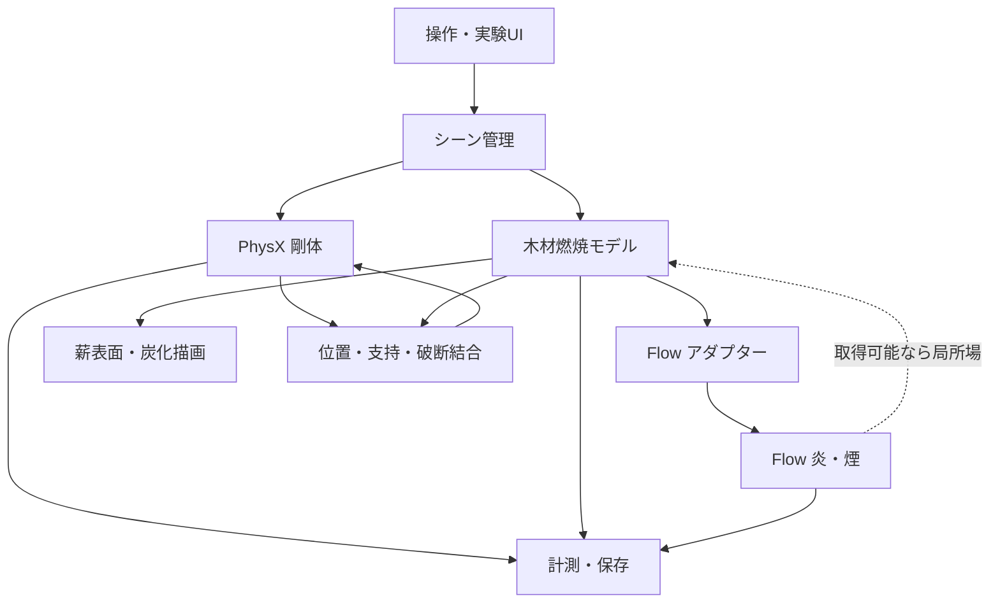

# 物理ベース・リアルタイム焚き火シミュレータ 設計文書

## 1. 文書情報

- 文書状態: 実装中・Phase 6AJ 採用後二層再プロファイル完了
- 初版日: 2026-08-04
- 想定開発環境: Windows 11、NVIDIA RTX 3090（24 GB）、VS Code + Codex
- 開発リポジトリ（作成済み）: `C:\Users\junic\src\campfire-simulator`
- 初期開発で採用する実行基盤: NVIDIA Omniverse Kit
- 初期開発で採用する物理・描画要素: PhysX、NVIDIA Flow、RTX Renderer、OpenUSD
- 主な実装言語: Python（初期）、C++またはGPU実装（性能上必要になった箇所のみ）

この文書は、今後の調査と試作を通じて更新する「生きた設計文書」である。未確認事項を確定仕様として扱わず、`未決事項`、`仮説`、`検証済み`を区別して記録する。

---

## 2. プロジェクト概要

ユーザーがリアルタイムに薪を追加・移動でき、薪の形状、配置、温度、水分、空気の通りやすさなどに応じて燃焼状態が変化する、対話型の焚き火シミュレータを開発する。

目標は、防火工学用CFDの完全な再現でも、既製の炎パーティクルを薪に貼り付けるだけの視覚効果でもない。木材の加熱、乾燥、熱分解、気相燃焼、炭化、質量減少、支持喪失という主要な因果関係を保ちつつ、一般的なGPUで実時間動作する近似モデルを構築する。

### 2.1 中心となる体験

- ユーザーが薪をつかみ、焚き火へ追加できる。
- 薪は重力、衝突、摩擦に従って積み重なる。
- 火炎は単なる固定アニメーションではなく、燃料、温度、浮力、風、障害物に反応する。
- 細い薪は太い薪より着火しやすく、早く燃え尽きる。
- 湿った薪は着火しにくく、加熱初期に水分を失う。
- 薪を密に詰めると空気不足になり、適度な隙間があると燃えやすい。
- 新しい薪を載せると一時的に火勢が落ち、その後加熱されて着火する場合がある。
- 燃焼により薪が炭化・軽量化し、支持を失うと崩れる。
- 崩れによって通気が変わり、燃焼状態も変化する。

---

## 3. 目標と非目標

### 3.1 目標

1. RTX 3090級のGPUで、表示を原則30 fps以上に保つ。
2. 通常速度では、実時間1秒に対してシミュレーション時間も約1秒進む。
3. 薪の追加、移動、風の変更に数秒以内で火炎・煙が反応する。
4. 木材の乾燥、熱分解、炭化、残存質量を内部状態として保持する。
5. 定性的に妥当な比較ができる。
   - 乾燥薪と湿潤薪
   - 細薪と太薪
   - 井桁組み、並列配置、密集配置
   - 弱風、無風、強風
6. コード、物理モデル、パラメータ、検証シナリオを分離し、将来の差し替えを可能にする。
7. Codexがビルド、試験実行、ログ解析、画像確認を反復できる自動検証経路を用意する。

### 3.2 非目標

- 建築・消防・事故解析に使用できる工学精度の保証
- 詳細な燃焼化学、化学種ごとの反応、乱流燃焼の直接数値計算
- 木材の樹種・年輪・割れを初期版から完全に再現すること
- 任意形状の可燃物を初期版から扱うこと
- モバイル端末や非NVIDIA GPUへの初期対応
- 大規模な森林火災や室内火災のシミュレーション
- 完全な決定論的再現（GPU流体部分は実装により非決定的になり得る）
- 実木材、実火炎、実験設備を使う試験の計画・実施・承認取得
- 実験値による定量校正や、工学用途に使える妥当性保証

本シミュレータの結果は、現実の焚き火運用や火災安全判断には使用しない。

---

## 4. 成功条件

### 4.1 MVP成功条件

- アプリを起動すると、地面、初期薪、着火源が表示される。
- ユーザーが薪を追加し、PhysXによって自然に落下・積層する。
- 薪に追従する燃料・温度源からFlowの炎と煙が発生する。
- 薪表面温度が上昇し、着火条件を満たすと燃料放出が始まる。
- 着火源を除去しても、条件が整えば薪が一定時間自立燃焼する。
- 空気不足、低温、燃料枯渇のいずれかで火勢が落ちる。
- 乾燥薪と湿潤薪で、着火時間と燃焼曲線に明確な差が出る。
- 自動シナリオを実行すると、画像、CSV、ログが保存される。

### 4.2 MVP後の成功条件

- 薪の炭化領域が見た目と内部状態の両方に反映される。
- 質量・支持能力の低下により、薪が割れるか、複数セグメントへ移行する。
- 崩落後の通気変化が火勢に反映される。
- 実写実験またはFDS計算と、着火時間・質量減少・温度曲線を比較できる。

---

## 5. 基本設計方針

### 5.1 ハイブリッド物理モデル

すべてを単一の高解像度CFDで解くのではなく、現象ごとに異なる表現と更新周期を用いる。

| 現象 | 担当 | 表現 | 更新周期の初期目安 |
| --- | --- | --- | --- |
| 薪の落下・衝突・積層 | PhysX | 剛体・コライダー | 60 Hz |
| 木材内部の熱・水分・反応 | 独自燃焼モデル | 薪ローカル座標のセル | 5〜20 Hz |
| 炎・煙・浮力・風 | NVIDIA Flow | 疎3Dボクセル | 30〜60 Hzまたは性能依存 |
| 炭化・発光・表面変化 | 独自描画状態 | マテリアル属性・マスク | 10〜30 Hz |
| 統計・ログ出力 | 計測モジュール | CSV/JSON | 1〜10 Hz |

物理時間は固定タイムステップで進め、描画フレームレートの変動から可能な限り分離する。

### 5.2 権威状態の分離

- 木材の温度、水分、未燃木材、炭、灰、残存質量は独自燃焼モデルを正とする。
- 薪の位置・姿勢・速度はPhysXを正とする。
- 炎・煙・気体速度はFlowを正とする。
- USDはシーン構成と永続化の中心に使うが、高頻度・大容量のセル状態をすべてUSD属性として毎フレーム保存しない。

### 5.3 Flowへの依存を隔離する

Flowは `IFluidBackend` 相当の境界の内側に置く。木材燃焼モデルがFlow固有APIを直接呼ばない構造にする。

必要な抽象操作は次のとおり。

- 燃料・温度・煙・速度源の登録と更新
- 障害物の登録と姿勢更新
- シミュレーション開始・停止・ステップ実行
- 統計情報の取得
- 可能なら局所温度・速度・燃焼状態のサンプリング
- キャプチャまたはボリューム出力

Flowから薪への場の読み戻しが実用的でない場合、薪への熱流束は独自の近似モデルで計算する。この可能性を初期段階で必ず検証する。

---

## 6. システム構成



### 6.1 主要モジュール

#### App Shell

- Kitアプリの設定
- Extensionの読み込み
- ウィンドウ、メニュー、タイムライン
- 開発モードと利用者モードの切り替え

#### Scene Manager

- OpenUSD Stageの生成・読み込み・保存
- 薪、地面、石、着火源、風の生成
- シーン内IDと内部シミュレーションIDの対応付け

#### Log Factory

- 薪形状、寸法、密度、樹種プリセット、含水率の設定
- 表示メッシュ、PhysXコライダー、燃焼セルの同時生成
- 初期版では円柱または低ポリゴンの割薪を対象とする

#### Rigid Body Adapter

- PhysX剛体・コライダーの生成
- 摩擦、質量、重心、速度の取得
- 燃焼による質量変化の反映
- 支持喪失時のセグメント分割またはコライダー交換

#### Wood Combustion Solver

- 熱伝導
- 水分蒸発
- 熱分解ガスの生成
- 炭化
- 炭の酸化
- 質量・発熱量の更新
- Flowへ渡すEmitterサンプルの生成

#### Flow Adapter

- Flow Extensionの初期化
- Point/Sphere/Box/NanoVDB Emitterの選択
- 薪表面サンプルをFlow入力へ変換
- 動く薪への追従
- パラメータとFlowバージョン差の吸収

#### Visual State

- 温度に応じた赤熱
- 未燃、乾燥、焦げ、炭、灰のマテリアル遷移
- ノーマル、粗さ、色、発光の更新
- 初期版では形状を連続侵食せず、マスクと段階的メッシュ交換を優先する

#### Metrics and Capture

- 各薪と全体の温度、水分、各質量、発熱率
- Flowブロック数、GPU時間、描画fps
- 固定カメラからの画像・動画
- シナリオごとのCSV/JSON出力

---

## 7. 木材モデル

### 7.1 初期形状

MVPでは薪を概ね円柱または角を落とした直方体として扱う。任意メッシュ対応よりも、燃焼状態を安定して分割・計算できることを優先する。

円柱薪の初期セル構造案:

- 長さ方向: 24〜64分割
- 周方向: 12〜24分割
- 半径方向: 4〜12層
- 1本あたり: 約1,000〜10,000セル

セルは薪のローカル座標に固定し、薪が剛体として移動・回転しても内部配列を再ボクセル化しない。

### 7.2 セル状態

各セルは最低限、以下を持つ。

```text
temperature_K
moisture_mass
dry_wood_mass
volatile_potential
char_mass
ash_mass
oxygen_factor
surface_exposure
phase
```

`phase` の候補:

```text
WET_WOOD
DRY_WOOD
PYROLYZING
CHAR
ASH
DEPLETED
```

状態遷移は単一の閾値だけで決めず、反応速度と残存量から決める。ただしMVPでは、まず区分線形モデルで因果関係を成立させ、その後Arrhenius型反応速度へ置き換えられる設計にする。

### 7.3 熱収支

セル温度は概念的に次で更新する。

```text
蓄熱量の変化
  = 内部熱伝導
  + 周囲気体からの対流熱
  + 炎・高温物体からの放射熱
  + 炭酸化による発熱
  - 水分蒸発の潜熱
  - 熱分解に伴う吸熱
  - 周囲への放熱
```

初期版の熱源は次のように近似する。

- 内部熱伝導: 隣接セル間の有限差分
- 対流: 表面セル温度、周囲温度、局所風速に基づく係数モデル
- 放射: 炎領域または高温表面からの距離・遮蔽を使う近似
- 周囲温度: Flowから取得可能ならサンプリングし、不可なら独自の局所熱源モデルを使う

木材の熱伝導率は繊維方向と半径方向で異なるため、将来的に異方性を導入できる係数構造にする。

### 7.4 水分蒸発

- セル温度が沸点付近へ近づくと、水分蒸発が増える。
- 蒸発中は潜熱により温度上昇が抑制される。
- 蒸発水分は初期版では煙表示用の白色成分または追加の可視化源として扱える。
- 含水率は乾量基準または湿量基準のどちらを採用したか、データ定義で明示する。

### 7.5 熱分解と気相燃料

- 十分な温度へ達した乾燥木材は、熱分解ガスと炭へ変化する。
- 熱分解ガス量をFlowの `fuel` 入力へ変換する。
- 熱分解が起きても、酸素や温度が不足すれば周囲で完全燃焼しない。
- Flow内の気相燃焼量を直接取得できない場合、木材側の質量減少とFlow表示が乖離しないよう、Emitter投入量を木材側の放出量に厳密に従わせる。

### 7.6 炭化と炭燃焼

- 熱分解後に炭が残る。
- 炭化層は未燃木材への熱伝達を弱める。
- 炭は表面かつ酸素供給のある場所でゆっくり酸化し、発熱する。
- 炭の赤熱はFlow炎とは別に薪マテリアルの発光として描画する。
- 炭が失われると灰または空隙へ遷移する。

### 7.7 酸素供給の近似

MVPでは局所酸素濃度を厳密に解かず、次の要素から `oxygen_factor` を推定する。

- 表面が外気へ露出している割合
- 周辺薪による遮蔽
- 局所風速
- 上下方向の通気経路
- Flowから利用可能な燃焼・速度場

遮蔽判定にはPhysX Scene Queryまたは簡略レイキャストを使用する。完全密閉、薪同士の接触部、灰に埋もれた部分では値を低下させる。

---

## 8. Flowとの結合

### 8.1 Flowへ入力する値

薪表面セルから、少なくとも次を生成する。

- 位置
- 表面法線
- 燃料放出率
- 温度
- 煙生成率
- 初速度
- Emitter有効範囲

初速度は表面法線方向への弱い放出と、薪の剛体速度を組み合わせる。

### 8.2 Emitter方式の候補

1. Point Emitter
   - 表面セルと対応させやすい。
   - 動く薪や部分燃焼に向く。
   - 点数が多い場合の性能を検証する。
2. Sphere/Box Emitter
   - 初期試作が容易。
   - 細かな燃焼分布を表現しにくい。
3. NanoVDB Emitter
   - 複雑な分布をまとめて渡せる可能性がある。
   - 更新コストとAPIの複雑さを検証する。

MVPの最初はSphereまたはBoxで成立確認し、その後Point Emitterへ移行する。

### 8.3 未確認事項

以下はKit/Flowの対象バージョンで実測するまで未決とする。

- Flow場をCPUまたは独自GPUカーネルから局所サンプリングできるか。
- 読み戻しが毎フレーム可能な速度か。
- Flow障害物を移動薪へ追従させた場合のコストと安定性。
- 多数のPoint Emitterを動的更新した場合の上限。
- Flowの燃焼モデルが木材熱分解ガスの見た目に十分適合するか。
- Flow、PhysX、独自燃焼計算の時間同期方法。
- Flowを含む最終アプリの配布条件とパッケージサイズ。

### 8.4 読み戻し不可の場合

Flowを主に気相の移流・炎煙表示へ使い、薪への熱還流は独自近似にする。

- 各燃焼表面セルを放射・対流熱源として登録する。
- 周辺セルへの熱は距離、遮蔽、風向で配分する。
- Flowは同じ燃料放出量を受け取り、視覚的な炎・煙を生成する。
- 木材モデルとFlowは燃料放出量を共有するため、一方向結合でも大きな因果破綻を避ける。

---

## 9. 薪の剛体・崩壊モデル

### 9.1 初期版

- 薪1本を1剛体として扱う。
- コライダーは単純化した凸形状を用いる。
- 質量は残存木材・炭質量に応じて段階的に更新する。
- 見た目の侵食はマテリアルで表現し、コライダーは頻繁に変更しない。

### 9.2 分割版

薪を長さ方向の複数セグメントとして内部的に準備する。

- 健全時は拘束で1本の薪として動作する。
- 特定断面の残存支持率が閾値を下回ると拘束を解除する。
- 分割後は各部分が独立した剛体になる。
- 破断位置は燃焼状態に基づき、単なる乱数だけで決めない。

連続的なメッシュ侵食とコライダー再生成は高コスト・不安定になりやすいため、後期課題とする。

---

## 10. 描画設計

### 10.1 炎と煙

- Flowの温度、燃料、燃焼、煙チャンネルを利用する。
- 温度から炎色を決めるカラーマップを調整する。
- Bloom、露出、トーンマッピングを固定テスト条件として保存する。
- 画質比較時はカメラと露出を固定し、物理差と描画差を混同しない。

### 10.2 薪表面

表面状態から以下を補間する。

- 色: 木肌 → 乾燥 → 黒化 → 灰白色
- 粗さ: 木肌 → 炭化による変化
- 法線: 炭化・亀裂の細部表現
- 発光: 高温炭の赤熱
- マスク: 燃え尽きた領域の不可視化または段階的メッシュ交換

亀裂は初期版では手続きテクスチャと温度・炭化量のマスクで表現し、物理破壊との一致は分割時のみ保証する。

### 10.3 火の粉

火の粉はFlowとは別の軽量粒子系で扱う候補とする。発生率は炭燃焼率、薪の移動・崩落、局所上昇流に連動させる。

---

## 11. ユーザー操作

### 11.1 MVP操作

- 薪を追加
- 薪プリセットを選択
- 初期含水率を設定
- マウスで薪をつかんで移動・回転
- 着火源を配置・除去
- 風向・風速を変更
- 一時停止、再開、リセット
- 通常速度、低速、可能なら時間加速
- 温度・炭化・水分などのデバッグ表示切り替え

### 11.2 将来操作

- 火かき棒
- 薪割り
- 落ち葉、樹皮、着火材
- 薪の樹種と乾燥状態
- 雨、水、消火
- VR操作

---

## 12. 保存形式

### 12.1 シーン

- OpenUSD: 薪、地面、石、カメラ、照明、物理設定、ユーザー配置
- 独自属性: 薪ID、材質プリセット、初期含水率、燃焼モデルバージョン

### 12.2 高密度状態

- NPZまたは別のバイナリ形式: 木材セル配列
- JSON: メタデータ、シミュレーション時刻、乱数シード、各モジュールのバージョン
- CSV: 時系列計測結果

保存状態は完全なGPU流体場を含まない簡易チェックポイントと、必要ならFlow状態も含む完全チェックポイントを分ける。

### 12.3 再現性

保存する情報:

- アプリ・Extensionバージョン
- Kit、PhysX、Flowバージョン
- 物理・燃焼パラメータセットのハッシュ
- シナリオID
- 乱数シード
- 固定タイムステップ
- GPU、ドライバ情報

---

## 13. リポジトリ構成案

```text
campfire-simulator/
├─ AGENTS.md
├─ README.md
├─ DESIGN.md
├─ CHANGELOG.md
├─ repo.toml
├─ source/
│  ├─ apps/
│  │  └─ campfire.simulator.kit
│  └─ extensions/
│     ├─ campfire.app/
│     ├─ campfire.scene/
│     ├─ campfire.wood_model/
│     ├─ campfire.flow_adapter/
│     ├─ campfire.physx_adapter/
│     ├─ campfire.visuals/
│     ├─ campfire.metrics/
│     └─ campfire.tests/
├─ native/
│  └─ wood_solver/
├─ assets/
│  ├─ logs/
│  ├─ materials/
│  └─ scenarios/
├─ config/
│  ├─ materials/
│  ├─ rendering/
│  └─ simulation/
├─ scripts/
│  ├─ run_scenario.py
│  ├─ capture_scenario.py
│  ├─ compare_metrics.py
│  └─ export_report.py
├─ tests/
│  ├─ unit/
│  ├─ integration/
│  └─ scenarios/
└─ artifacts/
   └─ .gitkeep
```

`DESIGN.md` は本書をリポジトリ導入時に移したものとし、設計変更をコード変更と同じ履歴で管理する。

---

## 14. Codex向け開発・検証設計

### 14.1 原則

ユーザーがKitのGUIで手作業しないと検証できない機能を避ける。GUIのボタンが呼ぶ処理は、同じ引数でテストやコマンドからも呼べるサービス関数として実装する。

### 14.2 必須コマンド

実装開始時に、少なくとも次の単一コマンドを整備する。実際の名称はKit App Templateに合わせて確定する。

```powershell
# ビルド
.\repo.bat build

# 単体・Extensionテスト
.\repo.bat test

# 開発アプリ起動
.\repo.bat launch

# 固定シナリオ自動実行
.\scripts\run_scenario.ps1 dry_log_ignition

# 結果比較
.\scripts\compare_scenario.ps1 dry_log_ignition
```

`repo.bat test` が対象バージョンに存在するか、またはどのテストコマンドが正しいかは、プロジェクト生成後に確認して文書を更新する。

### 14.3 自動シナリオの出力

```text
artifacts/<scenario>/<run-id>/
├─ config.json
├─ kit.log
├─ metrics.csv
├─ summary.json
├─ frame_0000.png
├─ frame_0300.png
├─ frame_0900.png
└─ preview.mp4
```

### 14.4 Codexが判定できる条件

- プロセス終了コード
- ログ内エラー数
- NaN、発散、負質量の有無
- 平均・最大フレーム時間
- 着火までの時間
- 最大発熱率とその時刻
- 残存水分、木材、炭、灰の質量収支
- 画像差分と固定カメラの目視確認

視覚品質だけで合否を決めず、保存された物理量と不変条件を併用する。

### 14.5 AGENTS.mdへ記載する予定の要点

- GUI操作を要求する前に、ヘッドレスまたはスクリプト実行経路を探す。
- Flow・PhysX・Kitのバージョンを無断更新しない。
- 物理パラメータ変更は理由と比較結果を記録する。
- ゴールデン画像だけを物理正当性の証拠にしない。
- 単位をSIで統一し、無次元値と表示用倍率を区別する。
- 未確認APIを想像で実装せず、対象SDKのサンプルと実行結果で確認する。

---

## 15. テスト計画

### 15.1 単体テスト

- 熱伝導のみで全体エネルギーが不自然に増えない。
- 水分量、木材量、炭量、灰量が負にならない。
- 蒸発による質量減少と潜熱消費が対応する。
- 熱分解による木材減少量と、ガス・炭生成量が対応する。
- 座標変換後もEmitterが薪表面に残る。
- 薪が回転してもローカル燃焼セルが崩れない。

### 15.2 統合テスト

- 移動する薪にFlow Emitterと障害物が追従する。
- PhysXステップと燃焼ステップの時間が一致する。
- 薪を追加しても既存薪のIDと状態が保持される。
- 保存・再読込後に木材状態が許容誤差内で一致する。

### 15.3 標準シナリオ

| ID | 内容 | 主な確認項目 |
| --- | --- | --- |
| `single_dry_kindling` | 乾いた細薪1本 | 着火と燃え尽き |
| `single_wet_log` | 湿った太薪1本 | 蒸発、着火遅延 |
| `two_log_transfer` | 燃焼薪から未燃薪へ加熱 | 熱伝達と延焼 |
| `dense_stack` | 隙間の少ない積層 | 酸素不足 |
| `log_cabin_stack` | 井桁組み | 通気と安定燃焼 |
| `moving_burning_log` | 燃焼薪を移動 | 剛体・Emitter追従 |
| `collapse_reignition` | 支持喪失による崩落 | 通気変化と再燃 |
| `crosswind` | 横風 | 炎・煙の偏向、燃焼変化 |

### 15.4 不変条件

- 質量とエネルギーの生成・消失が、モデルで定義した源・吸収を除き説明可能である。
- セル温度、水分、各質量にNaNまたは無限大がない。
- シミュレーション時間が逆行しない。
- 薪IDはセグメント分割時を除き変化しない。
- 一時的な描画負荷低下が物理時間の暴走を起こさない。

---

## 16. 性能予算

初期目標値。実測後に更新する。

| 項目 | 目標 |
| --- | ---: |
| 表示 | 30 fps以上 |
| 1フレーム平均 | 33 ms以下 |
| PhysX | 2 ms以下 |
| 木材燃焼 | 4 ms以下 |
| Flow | 15 ms以下 |
| 描画 | 10 ms以下 |
| その他 | 2 ms以下 |
| 同時薪数 | MVP 20本、目標50本 |
| 木材セル総数 | MVP 100k以下、目標500k程度 |

Flow負荷は割り当てブロック数に強く依存するため、固定ボクセル解像度だけでなく、アクティブブロック数を計測する。

性能不足時の縮退順:

1. Flow更新頻度を下げ、描画で補間する。
2. Flowの解像度・最大ブロック数を下げる。
3. 木材の内部セル更新頻度を下げる。
4. 低活動セルを休眠させる。
5. 薪セルの空間解像度を適応的に下げる。
6. Python実装のホットスポットをC++またはGPUへ移す。

---

## 17. 開発フェーズと判断ゲート

### Phase 0: 環境成立確認

- `C:\Users\junic\src\campfire-simulator` をKitプロジェクト兼Gitリポジトリとして初期化
- Kit App TemplateからBase Editorを生成
- Windows上でビルド・起動
- 固定シーンを保存
- 固定カメラ画像を自動出力

完了条件: Codexがコマンドだけでビルドから画像出力まで実行できる。

### Phase 1: Flow技術スパイク

- 標準火炎を表示
- Emitterを動かす
- 剛体障害物との相互作用を確認
- Flow統計とGPU時間を記録
- 局所場の取得可否を調査・実測

判断ゲート:

- Flowを継続採用するか。
- 一方向結合か双方向結合か。
- Point Emitter、NanoVDB、単純Emitterのどれを採るか。

### Phase 2: 薪・剛体MVP

- 薪生成
- 追加、把持、落下、積層
- Emitter追従
- 基本UI

### Phase 3: 木材熱モデルMVP

- 熱伝導
- 蒸発
- 区分線形熱分解
- 炭化
- Flow燃料放出
- CSV計測

### Phase 4: 配置と通気

- 接触・遮蔽
- 酸素係数
- 風
- 標準積層シナリオ比較

### Phase 5: 崩壊

- 残存支持率
- セグメント拘束解除
- 質量・コライダー更新
- 崩落後の再燃

### Phase 6: 校正と品質向上

- FDSまたは実験データとの比較
- Arrhenius型反応モデルの検討
- マテリアル、火の粉、音響
- 性能最適化

### Phase 7: 製品化判断

- Kitのまま専用アプリ化
- Unreal等へ移植
- 独自Flowバックエンド開発
- 配布サイズ、ライセンス、対象GPU、UXを比較

---

## 18. リスク

| リスク | 影響 | 対応 |
| --- | --- | --- |
| Flow場を薪側から読めない・遅い | 双方向結合が困難 | 独自熱還流モデル、一方向結合 |
| Flow APIやExtensionの変更 | 保守負担 | Adapter隔離、バージョン固定 |
| Python木材計算が遅い | 実時間未達 | 配列化、Warp/C++/GPU移行 |
| 動的障害物がFlowを不安定化 | 薪移動時の破綻 | 簡略障害物、更新頻度制限 |
| 煙は自然だが燃焼量が不自然 | 見た目と物理の乖離 | 木材側を質量の権威状態にする |
| 連続形状侵食が高コスト | 崩壊表現が難しい | 段階メッシュ、事前セグメント |
| 物理パラメータが多すぎる | 調整不能 | 材料プリセット、感度分析、校正 |
| GPU流体の非決定性 | 回帰試験が不安定 | 数値許容範囲、統計・画像の併用 |
| Kit配布が重い | 一般向け製品化に不利 | 技術検証後に基盤を再評価 |
| 見た目調整が物理調整を汚染 | モデルの意味が失われる | 表示倍率と物理量を分離 |

---

## 19. 未決事項

### 19.1 優先度A: 実装開始前またはPhase 1で決定

- 使用するKit SDK、PhysX、Flowの固定バージョン
- Windowsネイティブ開発か、Linux開発か
- Flowの局所場読み戻しAPIと性能
- FlowとPhysXの動的障害物結合方法
- Kit App Templateの正しいテスト・ヘッドレス実行コマンド
- 最初の薪形状を円柱にするか割薪形状にするか
- シミュレーション単位系とUSD Stage単位

### 19.2 優先度B: 木材モデル実装時に決定

- 含水率の定義
- 樹種プリセットと物性値の出典
- 区分線形モデルからArrheniusモデルへ移る条件
- 放射熱の近似方法
- 酸素係数の計算法
- 炭化層の熱抵抗モデル

### 19.3 優先度C: MVP後

- 破断モデル
- 灰の物理表現
- 火の粉
- 音響
- VR
- 一般配布方法
- 非NVIDIA GPU対応

---

## 20. 参考実装・資料

### NVIDIA / Omniverse

- Omniverse Kit概要  
  https://docs.omniverse.nvidia.com/kit/docs/kit-manual/latest/guide/kit_overview.html
- Kit App Template  
  https://github.com/NVIDIA-Omniverse/kit-app-template
- Kit Editor Extensionチュートリアル  
  https://docs.omniverse.nvidia.com/kit/docs/kit-app-template/latest/docs/extending_editors.html
- NVIDIA Flow概要  
  https://nvidia-omniverse.github.io/PhysX/flow/index.html
- Flowのチャンネル  
  https://docs.omniverse.nvidia.com/extensions/latest/ext_fluid-dynamics/understanding.html
- Flow Emitter設定  
  https://docs.omniverse.nvidia.com/extensions/latest/ext_fluid-dynamics/settings.html
- PhysXリポジトリ  
  https://github.com/NVIDIA-Omniverse/PhysX

### 木材燃焼・火災シミュレーション

- Interactive Wood Combustion for Botanical Tree Models（部分実装）  
  https://github.com/art049/InteractiveWoodCombustion
- FlameForge: Combustion of Generalized Wooden Structures  
  https://arxiv.org/abs/2412.16735
- NIST Fire Dynamics Simulator  
  https://www.nist.gov/services-resources/software/fds-and-smokeview
- WebGLリアルタイム火炎の小規模実装  
  https://github.com/andrewkchan/fire-simulation

---

## 21. 設計判断ログ

設計変更時は以下の形式で追記する。

```text
### YYYY-MM-DD: 判断の題名

- 状態: 提案 / 採用 / 却下 / 保留 / 置換
- 背景:
- 選択肢:
- 判断:
- 根拠:
- 影響:
- 再検討条件:
```

### 2026-08-04: 初期開発基盤にOmniverse Kitを採用する

- 状態: 採用
- 背景: PhysX、Flow、RTX描画、OpenUSD、Python Extensionを同一環境で検証できる。
- 選択肢: Omniverse Kit、Unreal Engine、Unity、独自C++/GPU実装。
- 判断: Phase 0からMVPまではOmniverse Kitを開発・実行基盤として採用する。Flowを含む各要素の適否は、段階ごとの技術検証で個別に判断する。
- 根拠: 炎・煙のリアルタイム疎ボクセル流体と剛体を早期に組み合わせられる可能性が高い。
- 影響: 初期実装はKit Extension中心になる。ただし木材モデルはKit/Flowから分離する。
- 再検討条件: MVP後に一般配布へ進む場合、またはKit自体の性能・実装・配布上の制約でMVPを成立させられないことが判明した場合。Flowだけが要求を満たさない場合は、Kit全体を直ちに変更せず、まず流体バックエンドの差し替えを検討する。

### 2026-08-04: 木材状態を権威状態とする

- 状態: 採用
- 背景: Flowの炎表示だけを正とすると、木材質量・熱分解量との整合が保証できない。
- 判断: 木材の温度、水分、未燃物、炭、灰、質量は独自モデルを正とする。
- 影響: Flowは燃料放出量を木材モデルから受け取る。Flowからの熱帰還は利用可能性に応じて追加する。
- 再検討条件: 将来、気相と固相を一体で高速に解けるバックエンドへ移行する場合。

### 2026-08-04: Flowを一方向結合から継続採用する

- 状態: 採用
- 背景: Phase 1でFlow 110.0.0の火炎生成、移動Emitter、USD Physicsコライダー、統計取得、NanoVDB CPU読み戻しをRTX 3090上で検証した。
- 選択肢: Flowを継続して一方向結合、Flowを即座に双方向結合、別の流体バックエンドへ置換。
- 判断: MVPでは木材モデルを権威状態とし、燃料・温度・速度源をFlowへ渡す一方向結合から開始する。Sphere Emitterは成立確認用とし、薪表面の表現にはPoint Emitterを次段階で評価する。
- 根拠: 220 updateの実測で火炎描画とEmitter追従が成立し、active blockは最大154、ウォームアップ後のend-to-end更新は平均9.02 msだった。raw NanoVDBはCPUへ取得できたが、取得呼び出しだけで17.32 msを要し、世界座標の局所点へ変換するアダプターは未実装である。
- 影響: Phase 2と3はFlow場の毎フレーム読み戻しに依存しない。熱帰還は独自近似を先に用意し、NanoVDBアダプターの性能と妥当性が確認できた場合に補助入力として追加する。
- 再検討条件: Point Emitterの更新負荷が30 fps目標を超える場合、局所場アダプターが十分低遅延で成立する場合、またはFlowの配布・安定性制約がMVPを阻害する場合。

### 2026-08-04: 開発リポジトリの配置を確定する

- 状態: 採用
- 背景: ユーザーが従来から使用しているソース配置規約に合わせる。
- 判断: `C:\Users\junic\src\campfire-simulator` をKitプロジェクト兼Gitリポジトリのルートとする。
- 根拠: 十分に短いローカルパスであり、既存の開発運用とも整合する。
- 影響: このルート直下に `repo.bat`、`repo.toml`、`source/`、`DESIGN.md` などを置く。別のKit用親リポジトリやシンボリックリンクは作らない。
- 再検討条件: Kitのビルドまたはパッケージ作成で実際にパス長問題が発生した場合。その場合も、まず出力先の短縮を試し、必要な場合だけリポジトリを移動する。

---

## 22. 実装開始時にCodexへ渡す指示の骨子

実装開始時は、本書と対象リポジトリをCodexへ渡し、まずPhase 0だけを依頼する。

```text
DESIGN.mdを読み、未決事項と仮説を確定仕様として扱わないでください。
最初はPhase 0「環境成立確認」だけを実装してください。
対象ルートは C:\Users\junic\src\campfire-simulator です。このディレクトリをKitプロジェクト兼Gitリポジトリとして使用してください。

1. リポジトリと利用可能なKit SDKを調査する。
2. 対象バージョンを記録する。
3. Base Editorアプリと最小Extensionを作る。
4. コマンドラインからビルド・起動できるようにする。
5. 固定シーンを生成し、固定カメラ画像を自動保存する。
6. 再実行可能なテスト手順をREADME.mdへ記載する。
7. 実測した事実、未解決点、設計への影響をDESIGN.mdへ反映する。

GUIだけでしか実行できない手順を作らないでください。
Flowや木材燃焼モデルの本実装にはまだ着手しないでください。
既存のユーザー変更を保持し、ビルドとテスト結果を報告してください。
```

Phase 0完了後、結果を本書へ反映してからPhase 1を依頼する。

---

## 23. Phase 0 実測結果

### 2026-08-04: 環境成立確認を完了する

- 状態: 採用
- 対象環境: Windows 11 Pro 23H2、Intel Core i7-14700、約128 GB RAM、NVIDIA GeForce RTX 3090 24 GB、NVIDIA Driver 591.86。
- 基盤: NVIDIA Omniverse Kit App Template commit `483e364a4176f102f2d3c3aaf9f301a103d61d69`。
- 固定バージョン: Kit SDK `110.2.0+feature.342835.698af100.gl`、PhysX `110.1.1`、Warp `1.14.0`。FlowはPhase 0では依存関係へ追加せず、バージョンとAPIの適合確認をPhase 1へ残す。
- Stage単位: Z-up、`metersPerUnit = 1`、重力加速度 `9.81 m/s²`を採用した。
- 実装: Base Editorアプリ `campfire.simulator.kit` とPython Extension `campfire.app` を作成した。Extensionは地面、12個の石、4本の薪、着火位置マーカー、照明、固定カメラを決定的に生成する。
- 自動化: `scripts/run_phase0.bat`（本体は `run_phase0.ps1`）がウィンドウなしでアプリを起動し、`assets/scenes/phase0.usda`、1280×720 PNG、JSON要約を保存して終了する。バッチ入口によりPowerShell実行ポリシーの影響を避ける。
- 検証結果: `.\\repo.bat build` 成功、`.\\repo.bat test` で3テスト成功、ヘッドレスキャプチャ成功。SDK取得済みの実測では自動検証は約21秒で終了した。
- 非阻害警告: Intel内蔵GPUのスキップ、ローカルCache Server未接続、起動直後のmaterial library cache警告を確認した。画像キャプチャ後にFabricのinterface version警告も出るため、Phase 1で再確認する。いずれもPhase 0の終了コード、USD、画像、要約の生成は阻害しなかった。
- 判断: Phase 0の受け入れ条件を満たしたため、次はFlow単体のEmitterと固定カメラ出力を検証するPhase 1へ進める。ただし木材燃焼モデルとの結合はまだ行わない。
- 再検討条件: Phase 1でFlowの起動、局所場読み戻し、ヘッドレスキャプチャ、またはRTX 3090上の性能が成立しない場合。

---

## 24. Phase 1 実測結果

### 2026-08-04: Flow技術スパイクを完了する

- 状態: 採用
- 固定バージョン: Kit SDK `110.2.0`、Flow `110.0.0`、Flow USD schema `110.0.0`、PhysX `110.1.1`、NVIDIA Driver `591.86`。
- シーン: SI単位・Z-upのPhase 0シーンへ、半径`0.18 m`、温度`2.0`、燃料`0.8`の`FlowEmitterSphere`を追加した。Flow cell sizeは`0.025 m`。4本の薪には`PhysicsCollisionAPI`を適用し、Flow側の物理衝突を有効にした。
- 動的検証: Emitterをframe 70から140の間にx=`-0.18 m`から`0.18 m`へ移動し、frame 90と220を1280×720 PNGで保存した。両画像でFlow火炎を確認し、JSONで終点一致を検証した。
- Flow統計: 220 updateでactive blockは最終142、最大154、上限4096。ウォームアップ30 updateを除くend-to-end viewport updateは平均`9.022 ms`、p95 `11.4151 ms`、シミュレーション区間は`3.241 s`だった。
- GPU計測: `nvidia-smi`を250 ms間隔で92点記録した。アプリ起動から終了までの全GPU利用率は平均`19.49%`、最大`99%`、最大使用メモリ`7247 MiB`、利用率積分による活動時間推定`4482.5 ms`。これはFlowカーネル単体時間ではない。対象Flow APIからカーネル単体時間を取得できなかったため、値を推測しない。
- 局所場: CPU readbackを有効にすると、temperature / fuel / burn / smokeが各`1,948,592 words`、velocityが`1,432,312 words`のraw NanoVDBとして取得できた。取得呼び出しは`17.3153 ms`。divergenceは0 wordsだった。任意の世界座標一点を直接返す検証済みAPIは確認できず、NanoVDB座標変換・補間を担う専用アダプターが必要。
- 自動化: `scripts/run_phase1.bat`はウィンドウなしでFlowを220 update進め、2画像、USD、JSON、GPU CSVを生成し、active block、Emitter移動、4コライダー、画像寸法を検証する。
- 検証結果: `.\repo.bat build`成功、`.\repo.bat test`で5テスト成功、`.\scripts\run_phase1.bat -OutputDir .\artifacts\phase1\run4`成功。
- 非阻害警告: Phase 0からのFabric interface version警告が継続した。さらに`omni.flowusd`のPython node登録時に例外警告を確認したが、native Flowプリム、描画、統計、NanoVDB読み戻しは動作した。OmniGraph経路を採用する前に再確認する。
- 判断: Flowを継続採用し、MVPは木材からFlowへの一方向結合で進める。次はPhase 2「薪・剛体MVP」で、薪追加・把持・落下・積層とEmitter追従を実装する。

---

## 25. Phase 2 実測結果

### 2026-08-04: 薪・剛体MVPを完了する

- 状態: 採用
- 剛体表現: 1本の薪を半径`0.16 m`、長さ`1.8 m`の円柱1剛体として表し、`PhysicsCollisionAPI`、`PhysicsRigidBodyAPI`、`PhysicsMassAPI`を適用した。木材密度は`520 kg/m³`、算出質量は`75.2776 kg`。線形減衰`0.05 s⁻¹`、角減衰`0.20 s⁻¹`を採用した。
- 接触パラメータ: 静止摩擦`0.70`、動摩擦`0.55`、反発係数`0.10`。静止摩擦を動摩擦より高く、反発を低くすることで積層しやすい初期仮説とした。これらは対象木材の実測値ではなく、Phase 6で比較試験により校正する。
- 識別と操作: 各薪に永続IDを保存し、生成・移動・一覧取得を共通サービス化した。GUIの`Campfire Controls`は追加、追加薪の持ち上げ、リセットを提供し、ヘッドレス検証も同じサービスを呼ぶ。マウス拘束による自由把持は次の操作改善へ残した。
- 連成: Flow Emitter位置を、追跡対象薪の権威USD world transformへ毎step追従させ、z方向へ`0.12 m`オフセットした。Flowから木材状態への帰還には依存しない。
- 動的検証: 固定`1/60 s`で600 step（10秒）実行し、frame 30で5本目をz=`2.6 m`へ追加した。追加前4 ID、追加後5 IDを確認し、追加薪は`1.921298 m`落下して最終位置`(-0.449834, 0.851133, 0.678702) m`へ静止した。最終1秒の変位は`0.0 m`で、石囲い内かつ地面より上に残った。
- Emitter検証: 571 sampleの最大追従誤差は`0.0 m`。Flow active blockは最終204、最大214で、落下・積層中も火炎計算が継続した。
- 性能実測: 10秒の固定step区間は実時間`14.9405 s`。PhysX `simulate`は平均`0.1468 ms`、同期`fetch_results`とUSD transform更新は平均`15.4648 ms`、Flow・描画更新は平均`7.1089 ms`（p95 `9.0627 ms`）だった。合計の代表値は約`22.72 ms`で30 fps表示予算内だが、同期読み戻しを伴うこの検証経路では60 Hz実時間条件を満たさない。物理ソルバーではなくUSD同期が支配的であり、Phase 4の性能計測でGUI/Fabric経路と分離して再評価する。
- 自動化: `scripts/run_phase2.bat`は2枚の1280×720 PNG、USD、JSONを生成し、ID、落下量、静止、積層範囲、Emitter誤差、Flow active block、画像寸法を検査する。
- 検証結果: `.\repo.bat build`成功、`.\repo.bat test`で7テスト成功、`.\scripts\run_phase2.bat -OutputDir .\artifacts\phase2\run3`成功。既定Phaseと依存関係変更後の`.\scripts\run_phase0.bat -OutputDir .\artifacts\phase0\phase2-regression`も成功した。
- 非阻害警告: Phase 0からのFabric interface version警告とPhase 1からのFlow Python node登録警告が継続した。終了コード、剛体、Flow、USD、PNG、JSONの生成は阻害しなかった。
- 判断: Phase 2の受け入れ条件を満たした。次はPhase 3「木材熱モデル」で、温度・水分・未燃物・炭・灰・質量をFlowから独立した権威状態として実装する。

---

## 26. Phase 3 実測結果

### 2026-08-04: 木材熱モデルMVPを完了する

- 状態: 条件付き採用。因果関係と保存則は成立したが、Pythonセル更新の瞬間負荷は性能予算を超える。
- セル構造: 円柱薪ローカル座標に長さ24×周12×半径4=`1,152 cell/log`を固定した。セルは温度、水分、乾燥木材、揮発分ポテンシャル、炭、灰、酸素係数、表面露出、相を保持し、剛体移動による再ボクセル化を行わない。
- 更新: `0.2 s`（5 Hz）の陽的更新で、軸・周・半径方向の熱伝導、対流・放射放熱、水分蒸発の潜熱、区分線形熱分解、炭生成、表面炭酸化を計算する。含水率は乾量基準とした。
- 係数の扱い: 密度`520 kg/m³`、比熱`1700 J/(kg·K)`、軸方向熱伝導率`0.25 W/(m·K)`、半径方向`0.12 W/(m·K)`、蒸発開始`353.15 K`、熱分解開始`573.15 K`などはSI単位の初期仮説であり、対象樹種の校正値ではない。比較シナリオの外部熱流束`150 kW/m²`も因果確認用の強制入力である。
- 質量収支: `残存水分 + 木材 + 炭 + 灰 + 放出水蒸気 + 熱分解ガス + 炭酸化ガス`を初期質量と比較する。成功run2では乾燥・湿潤の両モデルで誤差`0.0 kg`、全セル有限、全質量非負だった。
- 永続化: version付きJSONを各薪の`campfire:combustionStateJson`へ保存し、同一セル数・時刻・質量で再読込できることをテストした。Flowは権威状態ではなく、木材側の熱分解ガス放出率を無次元fuelへ写像して受け取る。
- 乾湿比較: 乾量基準含水率12%と60%の同寸法薪を240秒加熱した。ガス放出率`1e-6 kg/s`を比較上の着火判定とすると、乾燥薪`66.2 s`、湿潤薪`166.4 s`で、湿潤薪は`100.2 s`遅れた。これは実験着火時刻の予測ではなく、モデルが水分蒸発の潜熱による遅延を生成することの確認値である。
- 最終状態: 乾燥薪は水分`4.6578 kg`、木材`43.6340 kg`、炭`6.72385 kg`、累積熱分解ガス`24.6820 kg`。湿潤薪は水分`24.3772 kg`、木材`73.2208 kg`、炭`0.447331 kg`、累積熱分解ガス`1.60426 kg`。Flow active blockは最大302で、木材由来fuel入力から火炎を描画した。
- 性能: 1,152セル×2本の木材stepは平均`24.8528 ms`、p95 `32.3393 ms`。5 Hzを60 Hzへ平均化すると約`2.07 ms/frame`だが、更新フレームのスパイクは木材予算`4 ms`を超える。Flow・描画awaitは平均`6.512 ms`だったが、成功run2全体は`253.1804 s`、runnerは`276.478 s`を要し、未計測のFlow/USD属性同期コストが大きい。配列化またはWarp化とアダプター計測を次の性能作業へ残す。
- 自動化: `scripts/run_phase3.bat`が1,200行の`wood_metrics.csv`、JSON、2枚の1280×720 PNG、最終USDを生成し、着火順、質量収支、非負・有限、ガス・炭生成、Flow稼働を判定する。
- 検証結果: `.\repo.bat build`成功、`.\repo.bat test`で12テスト成功、`.\scripts\run_phase3.bat -OutputDir .\artifacts\phase3\run2`成功、Phase 0回帰成功。可視化頻度をさらに下げたrun3は240秒のツール上限で中断し、成功結果には採用しなかった。残存KitプロセスはPIDを確認して停止した。
- 判断: Phase 3の物理的不変条件と乾湿差、状態永続化、一方向Flow入力は採用する。係数を実測予測へ使用せず、性能課題を保持したままPhase 4「配置と通気」へ進む。

---

## 27. Phase 4 実測結果

### 2026-08-04: 配置と通気MVPを完了する

- 状態: 条件付き採用。幾何近似として因果比較に使用し、局所酸素濃度の予測値とは扱わない。
- 通気近似: 円柱中心線間距離から接触を求め、接触数、薪方向の多様性、表面隙間、上方遮蔽、風速を0〜1の換気係数へ写像した。表面セルだけに酸素係数を与える。
- 熱帰還: 酸素係数から`0.55 + 0.45 × oxygen`の無次元熱帰還倍率を作る初期仮説とした。
- 比較: 6本の平行密積みは換気係数`0.494444`、酸素係数`0.419426`。4本の井桁組みは`0.744444`、`0.482422`だった。
- 燃焼差: 同一の192セル代表薪を180秒計算すると、井桁は`66.2 s`、密積みは`68.8 s`で着火した。累積熱分解ガスは井桁`3.130934 kg`、密積み`3.075903 kg`。両方の質量収支誤差は`0.0 kg`。
- 風: 3 m/s横風で密積みの酸素係数が上昇し、全係数が0〜1に収まることを単体テストした。
- 自動化: `scripts/run_phase4.bat`が比較USD、JSON、1280×720画像を生成し、酸素順、着火順、ガス放出、質量保存を判定する。run2の数値比較は`3.6068 s`で完了した。
- 判断: Phase 4の配置差は採用する。PhysX Scene Queryによる局所遮蔽、Flow速度場、係数校正は未実装のため、絶対値ではなく相対比較に限定する。次はPhase 5「崩壊」へ進む。

---

## 28. Phase 5 実測結果

### 2026-08-04: 支持喪失・崩落・再燃MVPを完了する

- 状態: 条件付き採用。木材状態から剛体崩落までの因果接続に使用し、破壊強度の予測値とは扱わない。
- 支持率: 12軸断面ごとに`(乾燥木材質量 + 0.12 × 炭質量) / 初期乾燥木材質量`を計算する。端面は有効な2分割を作らないため破断候補から除外し、内部最小値が`0.58`以下で支持喪失とした。炭強度係数と閾値は校正前の初期仮説である。
- 局所加熱: 木材熱モデルの外部熱流束を、従来の一様スカラーに加えてセル別配列でも受け取れるよう拡張した。中央2断面を優先して加熱し、240秒シナリオでは支持率`1.0`から`0.579516`へ低下して`164.2 s`で拘束を解除した。
- 分割と剛体: 1.8 mの上段薪を0.9 mの2円柱として事前準備し、健全時は`UsdPhysics.FixedJoint`で1本として拘束する。支持喪失時にJoint primを除去し、権威木材セルから各セグメントの残存質量を再集計し、`physics:mass`と円柱コライダー半径を段階更新した。
- 崩落: 固定`1/60 s`で260 step実行し、frame 30で拘束を解除した。解除後のセグメント変位は`0.515766 m`と`0.116972 m`、鉛直低下はそれぞれ`0.105026 m`と`0.106293 m`で、崩落前後を1280×720 PNGへ保存した。
- 再燃: 崩落前の酸素係数`0.30`を崩落後`0.82`へ変更し、新たな表面への熱帰還を増やした。崩落前10秒平均に対する崩落後の熱分解ガスピークは`5.233725倍`で、Flow active blockは最大`212`だった。この酸素変化はScene Query実測ではなく因果確認用の段階入力である。
- 保存則: 240秒後の残存質量は`54.194334 kg`。左右セグメント質量の和は残存質量と一致し、水蒸気・熱分解ガス・炭酸化ガスを含む質量収支誤差は`0.0 kg`だった。
- 性能: 30 stepのウォームアップ後を対象としたPhysX同期更新は平均`19.8454 ms`。数値燃焼、Flow、描画を含む全アプリ実行は約49秒だった。これは校正済み実時間性能値ではない。
- 自動化: `scripts/run_phase5.bat`が正規USD、最終USD、JSON、崩落前後2画像を生成し、支持閾値、Joint解除、剛体変位、質量・コライダー更新、再燃、質量保存、画像寸法を判定する。
- 制限: 任意位置での連続メッシュ破断、亀裂進展、破片生成、荷重応力解析は未実装。2セグメントと1拘束の段階モデルであり、係数を実木材の破断時刻・強度予測へ使用しない。
- 判断: Phase 5の因果接続を採用する。次はPhase 6「校正と品質向上」で、実験またはFDSとの比較、係数校正、見た目、性能を改善する。

---

## 29. Phase 6A 校正基盤 実測結果

### 2026-08-04: NIST合板データに対する再現可能な基準線を作る

- 状態: 校正基盤として採用。合板モデルの妥当性確認は未完了であり、Phase 6全体は継続中。
- 一次資料: NISTIR 7094「Structural Collapse Fire Tests: Single Story, Wood Frame Structures」（2004年3月）のTable 2、External 5 PLY Plywoodを使用した。公式PDFは `https://tsapps.nist.gov/publication/get_pdf.cfm?pub_id=101408`。試料は0.1 m角、水平設置、露出面以外を箔で被覆し、各熱流束3試料の平均である。
- 固定対象値: 35 kW/m²では持続着火`47.1 s`、平均質量減少速度`9.9 g/(s·m²)`、初期質量`64.7 g`、最終質量`16.8 g`。70 kW/m²では`7.7 s`、`14.4 g/(s·m²)`、`64.0 g`、`16.0 g`。
- アダプター: 権威木材グリッドが円柱形状のため、露出面積`0.01 m²`と初期湿潤質量を保つ薄い等価円柱へ写像した。含水率は乾量基準`0.08`を仮定し、片側軸端面だけへ入射熱流束を与える。これは5層構造、接着層、実厚さを直接表す試験片モデルではない。
- 着火・質量減少: 熱分解ガス放出率`1e-6 kg/s`以上を着火代理値とし、それ以降の水蒸気、熱分解ガス、炭酸化ガス放出率の平均を露出面積で除して平均質量減少速度とした。実験の火炎観測定義とは同一ではない。
- 探索: 放射吸収率`0.55, 0.70, 0.85, 1.00`、熱分解開始温度`520, 573.15, 620 K`、最大熱分解率`0.010, 0.025, 0.050 s⁻¹`の組み合わせを固定し、初期値との重複を除いた36候補を`dt=0.1 s`、600秒で評価した。目的関数は2熱流束×着火・質量減少の相対誤差RMSEである。
- 結果: 初期スコア`1.695906`から最良`1.303939`へ`23.1126%`改善した。最良候補は放射吸収率`1.0`、熱分解開始`520 K`、完全熱分解温度`720 K`、最大熱分解率`0.05 s⁻¹`だった。
- 残差: 最良候補の35 kW/m²は着火`62.0 s`、質量減少`9.2833 g/(s·m²)`、70 kW/m²は`27.4 s`、`8.7960 g/(s·m²)`。70 kW/m²の着火は観測より`19.7 s`遅く、質量減少も`5.6040 g/(s·m²)`低い。改善率を精度達成と解釈しない。
- 保存則: 最良2ケースの質量収支誤差の絶対値は最大`1.5266e-16 kg`で、全セル値は有限だった。35 kW/m²が70 kW/m²より遅く着火する順序も保持した。
- 成果物: `scripts/run_phase6.bat`が正規USD、校正反映済みUSD、1280×720 PNG、ブラウザ表示可能なSVG比較レポート、上位候補CSV、JSON要約を生成し、改善、探索数、着火順、有限値、質量保存、成果物寸法を判定する。
- 性能: 最終成功runで36候補の数値校正は`82.9284 s`。これはPythonの逐次探索時間であり、最適化済み性能値ではない。
- 検証: `.\repo.bat build`成功、`.\repo.bat test`で`24 / 24`成功、`.\scripts\run_phase6.bat`成功。生成SVGはEdgeヘッドレス描画で1200×680として目視確認した。
- 制限と次: 同じ2条件を係数探索と評価の両方に使い、独立ホールドアウトがない。次は試験片厚さ、層構造、水分、温度依存反応速度を明示し、追加熱流束または別試験をホールドアウトにしてからFDS比較、見た目、性能改善へ進む。

---

## 30. Phase 6B 外部材料ホールドアウト 実測結果

### 2026-08-04: 合板で選んだ係数をOSBへ再調整なしで適用する

- 状態: 材料外挿のストレステストとして採用。合板内の独立妥当性確認ではない。
- 一次資料: NISTIR 7094 Table 2のExternal Oriented Strandboard平均値を使用した。35 kW/m²は持続着火`39.7 s`、平均質量減少速度`12.1 g/(s·m²)`、初期質量`76.4 g`、最終質量`17.0 g`。70 kW/m²は`10.6 s`、`16.9 g/(s·m²)`、`79.5 g`、`16.9 g`。公式PDFは `https://tsapps.nist.gov/publication/get_pdf.cfm?pub_id=101408`。
- 隔離: OSB値は36候補の順位付け、目的関数、最良係数の選択に使用しない。合板で選択済みの放射吸収率`1.0`、熱分解開始`520 K`、完全熱分解`720 K`、最大熱分解率`0.05 s⁻¹`をそのまま適用した。JSON、Python、PowerShellテストの3箇所で`used_for_parameter_selection=false`を検査する。
- 初期モデル: OSB相当質量を持つ等価円柱では、35 kW/m²着火`87.5 s`・質量減少`11.4079 g/(s·m²)`、70 kW/m²着火`40.5 s`・質量減少`11.1096 g/(s·m²)`となり、相対RMSEは`1.543293`だった。
- 合板校正値の外挿: 35 kW/m²着火`71.5 s`・質量減少`11.1409 g/(s·m²)`、70 kW/m²着火`33.7 s`・質量減少`11.0133 g/(s·m²)`となり、相対RMSEは`1.174557`へ`23.8928%`改善した。
- 残差の判断: 改善後も35 kW/m²着火は観測より`31.8 s`、70 kW/m²は`23.1 s`遅い。70 kW/m²の質量減少は`5.8867 g/(s·m²)`低い。合板校正値が誤差方向を改善したことは認めるが、OSB予測へ採用できる精度ではない。
- 保存則: 合板校正値を適用したOSB 2ケースの質量収支誤差の絶対値は最大`3.6083e-16 kg`で、全状態は有限、35 kW/m²が70 kW/m²より遅く着火する順序も保持した。
- 可視化と自動化: `holdout_report.svg`へ観測・初期・合板校正値を並べ、スコア変化と適用範囲を明記した。`scripts/run_phase6.bat`はホールドアウト未使用フラグ、係数一致、2ケース、有限値、質量保存、着火順、SVG生成を検査する。スコア改善そのものは合格条件にしない。
- 検証結果: `.\repo.bat build`成功、`.\repo.bat test`で`24 / 24`成功、`.\scripts\run_phase6.bat`成功。最終runの全36候補とホールドアウト評価を含む数値処理は`82.3793 s`だった。
- 次: Appendix Aの合板反復試験を固定した訓練・検証集合へ分け、同一材料内の再現性を評価する。その後、層構造、実厚さ、水分、温度依存反応速度を追加する。

---

## 31. Phase 6C 合板反復ホールドアウト 実測結果

### 2026-08-04: 同一材料の未使用反復試料へ再調整なしで適用する

- 状態: 同一材料・同一熱流束での再現性テストとして採用。新しい曝露条件への予測検証ではない。
- 一次資料と固定分割: NISTIR 7094 Appendix AのExternal 5 PLY Plywood反復値を使用した。35 kW/m²はSAMP.1=`40.71 s, 9.555 g/(s·m²)`、SAMP.2=`46.32 s, 9.897 g/(s·m²)`、SAMP.3=`54.23 s, 10.248 g/(s·m²)`、70 kW/m²はSAMP.1=`6.73 s, 14.742 g/(s·m²)`、SAMP.2=`9.76 s, 13.859 g/(s·m²)`、SAMP.3=`6.69 s, 14.741 g/(s·m²)`。公式PDFのAppendix A、PDFページ77–79・83–85に対応する。
- 隔離: 各熱流束のSAMP.1/2平均だけを36候補の選定対象とし、SAMP.3は検証終了まで目的関数から除外した。選定対象は35 kW/m²で着火`43.515 s`・質量減少`9.726 g/(s·m²)`、70 kW/m²で`8.245 s`・`14.3005 g/(s·m²)`。検証対象はそれぞれ`54.23 s`・`10.248 g/(s·m²)`、`6.69 s`・`14.741 g/(s·m²)`である。
- 選定結果: SAMP.1/2に対する相対RMSEは初期`1.519108`から最良`1.144667`へ`24.6487%`改善した。最良係数は放射吸収率`1.0`、熱分解開始`520 K`、完全熱分解`720 K`、最大熱分解率`0.05 s⁻¹`で、Table 2を使ったPhase 6Aの最良値と一致した。
- 未使用SAMP.3: 係数を再調整せず適用すると相対RMSEは初期`2.134331`から`1.672323`へ`21.6465%`改善した。35 kW/m²は着火`77.2 → 62.6 s`、質量減少`9.6359 → 9.4075 g/(s·m²)`、70 kW/m²は着火`35.0 → 28.9 s`、質量減少`9.3994 → 9.3349 g/(s·m²)`となった。
- 残差の判断: 改善後も70 kW/m²着火は観測より`22.21 s`遅く、質量減少は`5.4061 g/(s·m²)`低い。検証試料は各熱流束1点だけで、SAMP.1/2とSAMP.3の分割に対する不確かさを推定できない。改善率を予測精度達成とは扱わない。
- 保存則と自動化: 検証2ケースの質量収支誤差の絶対値は最大`8.3267e-17 kg`で、全状態は有限、着火順を保持した。`scripts/run_phase6.bat`は選定・検証IDの非重複、係数一致、再調整なし、有限値、質量保存、着火順、`replicate_holdout_report.svg`生成を検査する。
- 検証結果: `.\repo.bat build`成功、`.\repo.bat test`で`24 / 24`成功、`.\scripts\run_phase6.bat`成功。36候補、合板反復、OSB評価を含む数値処理は`95.6136 s`だった。生成SVGはEdgeヘッドレス描画で1200×680として目視確認した。
- 次: 等価円柱クーポンを、試験片の実厚さと5層構造を明示するモデルへ置き換え、温度依存の反応速度を導入する。追加熱流束または別試験を使う外部条件検証を準備してからFDS比較へ進む。

---

## 32. Phase 6D 5層平板試験片 実測結果

### 2026-08-04: 等価円柱を公称厚さと層構造を持つ平板へ置き換える

- 状態: 形状アダプターとして採用。公称厚の適用と等厚層は推定を含み、反応速度モデルの妥当性確認は未完了。
- 厚さの根拠: NISTIR 7094は屋根材を公称`12.7 mm (1/2 in)`の5層合板と記載し、コーン試験を「屋根に使った材料」のサンプルに対して実施している。個別コーン試料の厚さ測定値は報告していないため、元の屋根パネル公称厚をコーン試料へ適用することは推定としてデータとレポートへ明記した。
- 幾何: 幅`0.1 m`、奥行`0.1 m`、厚さ`0.0127 m`を5枚の等厚`0.00254 m`層へ分けた。木目方向は`0°/90°/0°/90°/0°`と仮定して記録するが、現段階の1次元厚さ方向伝熱では方向差を使用しない。側面・裏面は箔被覆とし、第1層の`0.01 m²`だけへ入射熱流束を与える。
- 質量と物性: 固定密度から質量を作らず、各試料の観測初期湿潤質量を5層へ等分し、乾量基準含水率`0.08`と公称体積から有効乾燥密度を逆算した。Table 2合板では35 kW/m²が`471.71 kg/m³`、70 kW/m²が`466.61 kg/m³`。接着層の厚さ・物性は報告されていないため明示的なセルを作らない。
- 熱伝導: 既存の権威木材状態と質量保存反応を再利用し、隣接層のコンダクタンスを`k A / Δx`で接続した。35 kW/m²の校正値による600秒後温度は加熱面から`861.8, 778.3, 696.4, 617.4, 563.9 K`、70 kW/m²は`1074.2, 1063.0, 1053.3, 1046.1, 1042.2 K`だった。
- 再校正: SAMP.1/2選定スコアは初期`0.399200`から最良`0.317994`へ`20.3423%`改善した。Table 2平均では`0.462525 → 0.361484`（`21.8454%`改善）。最良係数は放射吸収率`1.0`、熱分解開始`520 K`、完全熱分解`720 K`、最大熱分解率`0.05 s⁻¹`でPhase 6Cと同じだった。
- 合板ホールドアウト: 未使用SAMP.3は`0.625042 → 0.465157`（`25.5798%`改善）。35 kW/m²は観測着火`54.23 s`に対し`25.7 s`、質量減少`10.248`に対し`7.9461 g/(s·m²)`。70 kW/m²は`6.69 s`に対し`10.9 s`、`14.741`に対し`9.1815 g/(s·m²)`で、形状改善後も反応速度の系統誤差が残る。
- OSBストレステスト: OSBは公称12.7 mmの1層平板として質量を保持したが、合板係数の再調整なし適用は`3.331960 → 2.750849`に留まった。着火予測は35 kW/m²で`126.5 s`、70 kW/m²で`64.0 s`となり、観測`39.7 s`、`10.6 s`より大幅に遅い。OSBを単一均質層にしただけでは固有のストランド・バインダー反応を表せない。
- 保存則と自動化: 校正・両ホールドアウトの質量収支誤差は最大`3.8858e-16 kg`。`scripts/run_phase6.bat`は公称厚、5層、未報告接着層を作らないこと、合板・OSBのモデル種別、層温度数、有限値、質量保存、成果物を検査する。`layer_profile_report.svg`で5層の最終温度と仮定を表示する。
- 検証結果: `.\repo.bat build`成功、`.\repo.bat test`で`25 / 25`成功、`.\scripts\run_phase6.bat`成功。最終runの36候補とホールドアウトを含む数値処理は`56.6587 s`。生成SVGはEdgeヘッドレス描画で1200×680として目視確認した。
- 次: 区分線形の温度ランプを、出典付きの頻度因子・活性化エネルギー・反応次数を持つArrhenius反応へ置き換える。合板単板、接着層、OSBの物性を分離し、形状変更と反応変更の寄与を別々に比較する。

---

## 33. Phase 6E Arrhenius熱分解反応 実測結果

### 2026-08-04: 区分線形温度ランプを出典付き一次反応へ置き換える

- 状態: 見かけの単一段階Arrhenius反応として採用。木材の生成物別3並列反応を同時に解くモデルではなく、その前段として公開された各係数対を独立候補にした比較である。
- 反応式と単位: FDS Technical Reference Guideの反応速度式`k = A T^n exp(-E/(R T))`を採用し、`R = 8.31446261815324 J/(mol·K)`、反応次数`n = 0`、活性化エネルギー`E`は`J/mol`、一次反応の頻度因子`A`は`s⁻¹`とした。各時間ステップの反応率は`1 - exp(-k·dryness_factor·dt)`で評価し、既存の利用可能エネルギー上限と質量保存を維持する。既定値は旧`piecewise_linear`のままとし、過去フェーズの挙動を暗黙に変更しない。
- 一次文献: Thurner and Mann, “Kinetic Investigation of Wood Pyrolysis” (1981, DOI `10.1021/i200014a015`) は`300–400 °C`（`573.15–673.15 K`）の木材熱分解をガス・タール・チャーの3並列一次反応で整理している。報告値はガス`A=8.61e5 min⁻¹, E=88.6 kJ/mol`、タール`A=2.47e8 min⁻¹, E=112.7 kJ/mol`、チャー`A=4.43e7 min⁻¹, E=106.5 kJ/mol`。実装では`A`を60で割り、それぞれ`1.435e4`、`4.1166667e6`、`7.3833333e5 s⁻¹`へ変換した。
- 探索設計: 基準は未スケールのチャー係数とし、4放射吸収率×3文献係数対×4頻度因子倍率`0.25, 1, 4, 16`の48候補を固定順序で評価した。SAMP.1/2だけを選定に使用し、SAMP.3とOSBは再調整しないホールドアウトのまま保持した。
- 選定結果: 最良は放射吸収率`1.0`、タール枝`E=112.7 kJ/mol`、`A×16 = 6.5866667e7 s⁻¹`。SAMP.1/2選定スコアは`0.437563 → 0.343405`（`21.5187%`改善）、Table 2平均は`0.499083 → 0.421845`（`15.4760%`改善）だった。Table 2の着火は35 kW/m²で観測`47.1 s`に対し`32.2 s`、70 kW/m²で観測`7.7 s`に対し`12.9 s`。質量減少速度はそれぞれ観測`9.9, 14.4`に対し`7.1593, 10.3518 g/(s·m²)`だった。
- 合板ホールドアウト: 未使用SAMP.3は`0.652186 → 0.599149`（`8.1322%`改善）。35 kW/m²は観測`54.23 s, 10.248 g/(s·m²)`に対し`32.6 s, 7.1488 g/(s·m²)`、70 kW/m²は観測`6.69 s, 14.741 g/(s·m²)`に対し`13.7 s, 10.3825 g/(s·m²)`だった。選定集合より改善が小さく、一般化達成とは扱わない。
- OSBストレステスト: 合板で選んだ係数を再調整せず適用すると`3.331424 → 3.331413`で、改善率は約`0.00033%`に過ぎない。着火予測は35 kW/m²で`149.2 s`、70 kW/m²で`74.8 s`となり、観測`39.7 s`、`10.6 s`から大きく外れた。合板の見かけ反応だけではOSBのストランド・バインダー反応を表せないことを再確認した。
- 適用限界: 最良`A`が探索上限の`×16`へ達したため、係数が十分に同定されたとはいえない。文献の係数は生成物別の並列反応であり、単一総質量損失反応への転用は明示的な簡略化である。また、モデルは文献温度範囲`573.15–673.15 K`外へ外挿される。`kinetics_report.svg`は基準と選定反応の`400–800 K`速度曲線、係数、文献範囲を対数軸で表示する。
- 保存則と自動化: Table 2最良ケースの質量収支誤差は最大`1.6653e-16 kg`で、全状態は有限。`scripts/run_phase6.bat`は文献3経路、一次反応、48候補、正の`A/E`、選定・ホールドアウト分離、成果物を検査する。CSV列はパラメーター項目から動的に生成し、新しいArrhenius列を欠落させない。
- 障害記録: 最初のPhase 6E実行は数値評価完了後、旧固定CSV列に新しいArrhenius項目を渡したため出力時に停止した。列定義を動的生成へ修正し、ビルド後に全工程を再実行した。採用した数値と成果物は最終成功runだけから取得した。
- 検証結果: `.\repo.bat build`成功、`.\repo.bat test`で`26 / 26`成功、`.\scripts\run_phase6.bat`成功。48候補と両ホールドアウトを含む最終数値処理は`80.428 s`。生成`kinetics_report.svg`はEdgeヘッドレス描画で目視確認した。
- 次: ガス・タール・チャーの3並列反応を同時に進め、各反応の質量分率と生成物収率を明示する。合板の単板・接着層とOSBのストランド・バインダーの物性を分離し、見かけ係数倍率への依存を減らしてから追加熱流束またはFDSとの外部比較へ進む。

---

## 34. Phase 6F ガス・タール・チャー3並列反応 実測結果

### 2026-08-05: 公開3経路を同じ未反応木材に対する競合反応として解く

- 状態: 反応機構と生成物質量勘定として採用。校正精度の達成とは扱わず、合板構成材と二次反応の導入前段とする。
- 一次資料の再確認: DOE公開技術報告書`DOE/ET/20041-T2`（DOI `10.2172/6809951`）は、オーク鋸屑を窒素中・大気圧・`300–400 °C`で加熱し、ガス、タール、残渣の質量分率を時間測定したと記載する。対応するThurner–Mann論文（DOI `10.1021/i200014a015`）の質量基準一次反応係数、ガス`A=1.435e4 s⁻¹, E=88.6 kJ/mol`、タール`A=4.1166667e6 s⁻¹, E=112.7 kJ/mol`、チャー`A=7.3833333e5 s⁻¹, E=106.5 kJ/mol`を使用した。
- 競合反応: 各セルの同じ未反応乾燥木材質量`m_w`に対して`dm_i/dt = k_i m_w`を同時評価する。時間刻み内の総反応率は`1 - exp(-(k_g+k_t+k_c)·dryness·dt)`、生成物分率は`k_i / (k_g+k_t+k_c)`とした。したがって固定収率を別に仮定せず、温度履歴からガス・タール・一次チャー比が決まる。各経路は質量基準のlumped productとして`1 kg/kg`で勘定し、ガスとタールは放出、一次チャーは固体へ保持する。
- 互換性と保存: 既存の`pyrolysis_gas`はガス＋タールの総可燃性放出量として維持し、その内訳`primary_gas`、`primary_tar`と累積一次チャーを追加した。旧区分線形反応とPhase 6E単一反応は選択可能なまま残す。USD JSONは新しい内訳がない旧状態も0から読み込める。生成物内訳は診断値であり、総質量勘定へ二重加算しない。
- 探索設計: 相対A/Eを一次資料へ固定し、全3経路へ同じ倍率を掛ける`0.5, 1, 2, 4`と放射吸収率`0.55, 0.70, 0.85, 1.0`の16候補だけをSAMP.1/2で選定した。基準は公開係数そのままの共通倍率`1`、吸収率`1.0`。SAMP.3とOSBは選定から除外し、再調整しない。
- 選定結果: 最良は吸収率`1.0`、共通倍率`4.0`で探索上限に達した。SAMP.1/2スコアは`0.429858 → 0.411078`（`4.3689%`改善）、Table 2平均は`0.491715 → 0.475151`（`3.3688%`改善）。Table 2の予測は35 kW/m²で着火`32.2 s`・質量減少`6.1470 g/(s·m²)`、70 kW/m²で`12.9 s`・`7.9085 g/(s·m²)`となり、観測`47.1 s, 9.9`と`7.7 s, 14.4`の系統残差が残る。
- 生成物収率: Table 2の600秒累積一次生成物は、35 kW/m²でガス`18.04%`・タール`51.78%`・チャー`30.18%`、70 kW/m²でガス`15.85%`・タール`54.10%`・チャー`30.05%`。収率合計は各ケース`1.0`である。これはコーン試験の生成物実測値ではなく、公開速度係数と本モデル温度履歴から得た予測値である。
- 合板ホールドアウト: 未使用SAMP.3は`0.646851 → 0.633100`（`2.1258%`改善）。35 kW/m²は観測`54.23 s, 10.248`に対し`32.6 s, 6.1455 g/(s·m²)`、70 kW/m²は観測`6.69 s, 14.741`に対し`13.7 s, 8.3841 g/(s·m²)`。選定集合より小さい改善であり、反復一般化の根拠にはしない。
- OSBストレステスト: `3.332767 → 3.332822`で`0.00164%`悪化した。35 kW/m²は着火`149.2 s`・質量減少`11.5616 g/(s·m²)`、70 kW/m²は`74.8 s`・`10.6042 g/(s·m²)`。合板反応の3経路化だけではOSBのストランド・バインダー挙動を改善しない。
- 適用限界: 公開係数は窒素中のオーク鋸屑、現在の対象は合板コーン試験であり、材種、粒径、接着剤、酸素、熱・物質移動条件が異なる。公開実験範囲`573–673 K`外へ外挿し、タールの二次分解も扱わない。共通倍率が上限`4`へ達したため、倍率を同定値と解釈しない。
- 自動検証: `scripts/run_phase6.bat`は3経路名、正のA/E、16候補、共通倍率、選定隔離、各ケースの生成物収率合計、有限値、着火順、5層形状、質量保存、成果物を検査する。校正・両ホールドアウトの最大質量収支誤差は`1.5266e-16 kg`。`kinetics_report.svg`は3経路、公開総速度、選定総速度と35/70 kW/m²の収率を表示する。
- 検証結果: `.\repo.bat build`成功、`.\repo.bat test`で`27 / 27`成功、`.\scripts\run_phase6.bat`成功。最終runの校正数値処理は`39.613 s`で、生成SVGとWeb開発日記は実ブラウザ描画で確認する。
- 次: 合板の単板・接着層とOSBのストランド・バインダーを別物性へ分離し、二次タール反応を追加する必要性を評価する。共通倍率の探索範囲を広げる前に、追加熱流束、生成物収率実測、またはFDS比較を外部条件として用意する。

---

## 35. Phase 6G 合板／OSB材料別熱物性 実測結果

### 2026-08-05: 材料名だけでなく、熱伝導率と比熱を分ける

- 状態: 合板とOSBの材料アダプターとして採用。NISTIR 7094のコーン試験片そのものを高温で測定した物性ではないため、反応・接着剤・バインダーまで同定したモデルとは扱わない。
- 一次資料と値: NISTIR 4916 Table 1の定数表を使用し、Exterior-grade plywoodは熱伝導率`0.115 W/(m·K)`、比熱`1214 J/(kg·K)`、基準密度`509 kg/m³`、OSBは`0.118 W/(m·K)`、`1298 J/(kg·K)`、`641 kg/m³`とした。同報告書は値をASHRAE 1989から採り、MOIST解析では一定値としたと説明している。公式PDFは `https://nvlpubs.nist.gov/nistpubs/Legacy/IR/nistir4916.pdf`。
- 密度方針: NISTIR 4916の基準密度は出典情報として記録するが、NISTIR 7094の各コーン試験片へ強制しない。既存どおり観測初期質量、含水率、公称体積から有効乾燥密度を求める。Table 2合板は35 kW/m²で`471.71 kg/m³`、70 kW/m²で`466.61 kg/m³`となり、OSBも観測質量由来の`557.01`、`579.61 kg/m³`を使った。
- 接着界面: 5層合板には4界面があることをメタデータとSVGへ記録した。ただしNISTIR 7094は接着剤種、厚さ、配置、熱抵抗を報告しないため、独立セルや追加熱抵抗は作らない。OSBもストランド・バインダーの配合や厚さ方向密度分布を仮定せず、現段階では集約材料プロファイルとする。
- 実装: `LayeredPanelSpec`へ材料種、厚さ方向熱伝導率、乾燥木材比熱、接着界面情報、物性出典を追加した。各セルは既存グローバル比熱を上書きでき、層間コンダクタンスはパネル固有の熱伝導率を使う。古い永続化状態は上書き値なしで読み込める。
- 探索設計: Phase 6Fと同じ4共通倍率×4吸収率の`16候補`、同じSAMP.1/2選定、SAMP.3・OSBの非選定を維持し、材料物性だけの寄与を比較可能にした。最良値は吸収率`1.0`、共通倍率`4.0`で探索上限のままだった。
- 校正結果: SAMP.1/2選定スコアは`0.368873 → 0.353754`（`4.0988%`改善）、Table 2平均は`0.396762 → 0.382419`（`3.6150%`改善）。Table 2予測は35 kW/m²で着火`25.3 s`・質量減少`7.0219 g/(s·m²)`、70 kW/m²で`9.9 s`・`7.8865 g/(s·m²)`となった。観測`47.1 s, 9.9`と`7.7 s, 14.4`には系統残差が残る。
- 生成物収率: Table 2の600秒累積予測は35 kW/m²でガス`18.090%`・タール`51.727%`・チャー`30.183%`、70 kW/m²で`15.680%`・`54.298%`・`30.022%`。コーン試験の生成物実測値ではない。
- 合板ホールドアウト: 未使用SAMP.3は`0.483521 → 0.471361`（`2.5149%`改善）。予測は35 kW/m²で着火`25.6 s`・質量減少`7.0368 g/(s·m²)`、70 kW/m²で`10.5 s`・`8.3583 g/(s·m²)`となり、独立条件での精度達成とはいえない。
- OSBストレステスト: Phase 6G内の基準からは`2.671838 → 2.671921`と`0.0031%`悪化した。35 kW/m²は着火`124.1 s`・質量減少`11.0081 g/(s·m²)`、70 kW/m²は`62.4 s`・`10.3958 g/(s·m²)`で、観測`39.7 s, 12.1`と`10.6 s, 16.9`から大きく外れる。
- 変更寄与: 同じ3並列反応を使うPhase 6FからPhase 6Gへの最良スコア比較では、Table 2が`0.475151 → 0.382419`（`19.52%`低下）、SAMP.3が`0.633100 → 0.471361`（`25.55%`低下）、OSBが`3.332822 → 2.671921`（`19.83%`低下）した。これは物性プロファイル変更の影響を分離した比較だが、独立妥当性確認ではない。
- 保存則と自動化: 最良・校正ケースの最大質量収支誤差は`2.6368e-16 kg`。`scripts/run_phase6.bat`は合板・OSBの正確な`k/cp`、観測質量由来密度、4接着界面、未報告形状・熱抵抗を作らないこと、ケースへのプロファイル適用を検査する。単体テストにも両材料の差と後方互換性を追加した。
- 適用限界: NISTIR 4916の値は建築材料の室温定数として扱われた値で、高温・炭化中の温度依存物性ではない。NISTIR 7094の試料固有値でもない。接着剤やOSBバインダーを明示しておらず、一次反応係数の材種外挿、二次タール反応の省略、探索上限`4`も残る。OSB残差は依然大きい。
- 検証結果: `.\repo.bat build`成功、`.\repo.bat test`で`28 / 28`成功、`.\scripts\run_phase6.bat`成功。16候補と両ホールドアウトを含む数値処理は`46.2023 s`だった。更新した5種のSVGとWeb開発日記を実ブラウザ描画で確認する。
- 次: 温度依存の熱伝導率・比熱を直接支える一次資料を調査し、二次タール反応の導入効果を分けて評価する。接着剤・バインダーの明示モデルは、厚さ・組成・温度依存物性の根拠を確保してから追加する。追加熱流束、生成物収率実測、またはFDS比較も外部条件として準備する。

---

## 36. Phase 6H 出典範囲限定の温度依存比熱 実測結果

### 2026-08-05: 低温の木材比熱式を熱分解域へ外挿しない

- 状態: 範囲限定の物性アダプターとして条件付き採用。低温加熱の根拠はPhase 6Gより強くなったが、全評価スコアは悪化した。コーン試験の予測精度改善とは扱わない。
- 一次資料: USDA Forest Products Laboratory, *Wood Handbook: Wood as an Engineering Material*, Chapter 4（2021）の式`cp0 = 0.1031 + 0.003867 T kJ/(kg·K)`を使用した。乾燥木材比熱は密度・樹種にほぼ依存しないと説明され、式の有効範囲は`280–420 K`、繊維飽和点未満と明記されている。公式PDFは `https://research.fs.usda.gov/download/treesearch/62243.pdf`。
- 正規化: 式の絶対値を合板・OSBへそのまま上書きせず、`293.15 K`でNISTIR 4916の材料別基準比熱へ一致する比率曲線として適用した。すなわち`cp_material(T) = cp_NIST × cp_USDA(clamp(T,280,420)) / cp_USDA(293.15)`。合板は`1214 J/(kg·K)`から420 K以上で`1695.52`、OSBは`1298`から`1812.84`となる。
- 範囲外方針: `280 K`未満は280 K値、`420 K`超は420 K値へ固定する。木材熱分解が始まる`573 K`より前に資料範囲が終わるため、式を高温・炭化域へ外挿しない。比熱曲線は残存乾燥木材だけに適用し、水、チャー、灰は既存の別比熱を維持する。
- 熱伝導率の保留: Wood Handbookは熱伝導率が10 ℃あたり約`2–3%`増えるとするが、合板・OSBのコーン試験へ適用できる高温範囲と複合材固有データが不足する。この段階ではNISTIR 4916の`0.115 / 0.118 W/(m·K)`を一定のまま保持した。
- 互換性: セルへ比熱モデル名を追加し、未指定・旧状態は`constant`を既定とする。一般薪とPhase 3～5は定数比熱のままで、Phase 6の層状合板・OSBだけがUSDA正規化曲線を選ぶ。保存JSONの旧フィールド欠落も既定値で読み込める。
- 探索設計: Phase 6Gと同じ4共通倍率×4吸収率の`16候補`、SAMP.1/2選定、SAMP.3・OSB非選定を維持した。最良は吸収率`1.0`、共通倍率`4.0`で、依然として探索上限である。
- Phase 6H内の校正結果: SAMP.1/2は`0.417160 → 0.397880`（`4.6218%`改善）、Table 2平均は`0.469252 → 0.451962`（`3.6845%`改善）。Table 2予測は35 kW/m²で着火`30.5 s`・質量減少`6.0960 g/(s·m²)`、70 kW/m²で`12.2 s`・`7.9012 g/(s·m²)`。観測`47.1 s, 9.9`と`7.7 s, 14.4`には大きな残差がある。
- 生成物収率: Table 2の600秒累積予測は35 kW/m²でガス`18.028%`・タール`51.798%`・チャー`30.174%`、70 kW/m²で`15.887%`・`54.067%`・`30.046%`。生成物実測との検証値ではない。
- 合板ホールドアウト: SAMP.3は`0.612299 → 0.596914`（`2.5126%`改善）。予測は35 kW/m²で着火`30.9 s`・質量減少`6.0966 g/(s·m²)`、70 kW/m²で`13.0 s`・`8.3763 g/(s·m²)`だった。
- OSBストレステスト: Phase 6H内では`3.334862 → 3.334913`と`0.00154%`悪化した。35 kW/m²は着火`149.6 s`・質量減少`11.5676 g/(s·m²)`、70 kW/m²は`74.8 s`・`10.6009 g/(s·m²)`となり、OSB予測には使用できない。
- Phase 6Gからの変更寄与: 比熱曲線だけを追加した比較で、Table 2最良スコアは`0.382419 → 0.451962`（`18.19%`悪化）、SAMP.3は`0.471361 → 0.596914`（`26.64%`悪化）、OSBは`2.671921 → 3.334913`（`24.81%`悪化）した。420 K固定値がPhase 6Gの室温値より約40%高く、加熱・着火を遅らせた影響である。
- 判断: スコア悪化を理由に出典式を隠したり再調整したりせず、範囲限定モデルと負の比較結果を保持する。一方、この結果を高温比熱の検証とは扱わない。合板／OSB複合材の高温直接測定が得られれば置換する。
- 保存則と自動化: 最良・両ホールドアウトの最大質量収支誤差は`2.3592e-16 kg`。`scripts/run_phase6.bat`はモデル名、`280–420 K`、293.15 K基準、層ごとの有効比熱数、材料別基準値、候補数、選定隔離、収率、有限値、質量保存、成果物を検査する。最初のrunはPowerShellの`280`対`280.0`文字列比較だけで停止し、数値許容差比較へ修正後に全工程を再実行した。失敗runは採用していない。
- 検証結果: `.\repo.bat build`成功、`.\repo.bat test`で`29 / 29`成功、`.\scripts\run_phase6.bat`成功。最終成功runの校正数値処理は`54.7946 s`。更新SVGとWeb開発日記を実ブラウザ描画で確認する。
- 次: 二次タール分解を独立した反応変更として評価し、比熱変更との寄与を混ぜない。追加熱流束、生成物収率実測、FDS比較の外部条件を準備し、高温熱物性・接着剤・OSBバインダーは直接根拠を得てから追加する。

---

## 37. Phase 6I 二次タール生成物分配診断 実測結果

### 2026-08-05: 気相輸送を発明せず、一次タールの変換可能量だけを追跡する

- 状態: 生成物分配の診断として採用。固体熱モデルやFlowへ結合する二次反応モデルではない。現行セルはチャー層内の気相速度、圧力、温度履歴、滞留時間を解かないため、固定シナリオを予測値や校正値として扱わない。
- 反応と係数: NIST *Thermal Decomposition of Vegetative Fuels* のModel III反応R4と補足Table SI-4に記載された`tar → gas`一次反応を使用した。`k(T)=A exp(-E/RT)`、`A=4.28e6 s⁻¹`、`E=108.0 kJ/mol`で、NISTが列挙する一次文献はC. Di Blasi, *Combustion Science and Technology* 90, 315–340 (1993), DOI `10.1080/00102209308907620`である。NISTはModel IIIが専用実験への適合ではなく文献データの再検討に基づくことも明記している。
- 滞留時間と温度範囲: `τ=1.0 s`を非選定の固定診断シナリオとし、変換率を`1-exp(-kτ)`で評価する。NBSIR 88-3767が木材タールの均一反応を論じる`400–600 °C`に合わせ、`673.15 K`未満は変換なし、`873.15 K`超は873.15 Kで固定する。これはDi Blasiの輸送モデルを再現した有効範囲ではなく、外挿を抑える保守的な実装境界である。
- 質量勘定: 一次タール生成量は従来どおり保存し、その内訳として二次ガスと未変換タールを追加する。`primary tar = secondary gas + surviving tar`、`primary gas + primary tar + primary char = post-secondary gas + surviving tar + primary char`を各ステップと累積値で満たす。既存`pyrolysis_gas`、質量損失、Flow燃料入力を変更せず、二重加算しない。
- 保存互換性: 追加した累積二次変換量はJSONへ保存する。旧状態にフィールドがなければ0から読み込み、二次反応は一般モデルでは既定無効、Phase 6参照パラメーターでのみ有効にする。固定シナリオのA/E、滞留時間、温度境界は校正候補に含めない。
- Table 2生成物: 35 kW/m²では一次ガス／タール／チャー`18.0285 / 51.7979 / 30.1736%`から、1秒診断後`18.3633 / 51.4631 / 30.1736%`となり、`0.14594 g`のタールを二次ガスへ再分類した。70 kW/m²では`15.8870 / 54.0669 / 30.0461%`から`17.8972 / 52.0567 / 30.0461%`となり、`1.19121 g`を再分類した。これは生成物実測との一致を示す値ではない。
- 非結合の確認: Table 2スコアは基準`0.4692517194`、最良`0.4519621995`、SAMP.1/2最良`0.3978796463`、SAMP.3`0.5969142879`、OSB`3.3349131974`でPhase 6Hと一致した。着火は35/70 kW/m²で`30.5 / 12.2 s`、質量減少速度は`6.09598 / 7.90117 g/(s·m²)`のままであり、二次診断が熱・質量損失経路へ混入していない。
- 可視化: `kinetics_report.svg`へ紫破線の二次タール速度と、35/70 kW/m²それぞれの一次収率・1秒後収率を併記した。USD実画面も成功runから再取得し、Web開発日記へ反映した。既存の校正、OSB、SAMP.3、層温度SVGは数値が不変なため内容差分なしだった。
- 自動検証: 単体テストは温度下限の変換なし、範囲内の単調増加、上限固定、各ステップのタール分割、一次／二次収率の閉包、質量保存、状態往復保存を検査する。`scripts/run_phase6.bat`はA/E、固定1秒、温度境界、有効化、二次反応後収率の閉包と向きを検査する。`git diff --check`とPython構文検査も成功した。
- 検証結果: `.\repo.bat test`で`30 / 30`成功、`.\scripts\run_phase6.bat`成功。校正数値処理は`53.8368 s`、最良Table 2ケースの最大質量収支誤差は`8.3267e-17 kg`だった。
- 次: 固定1秒を置換できるチャー層内の気相滞留時間または生成物収率の一次データを調査する。厚さ・透過率・圧力・気相温度を解く必要がある場合は、固体セルへ反応を押し込まず、独立した気相輸送状態として設計する。追加熱流束、生成物収率、FDS比較のいずれかを外部検証条件として確保するまでは熱・着火へ結合しない。

---

## 38. Phase 6J 二次タール滞留時間感度評価 実測結果

### 2026-08-05: 一つの仮定値を、一次実験の範囲を持つ感度へ置き換える

- 状態: Phase 6Iの固定`τ=1.0 s`だけの表示を、`0.9 / 1.0 / 2.2 s`の非選定感度評価へ置き換えた。二次反応は引き続き生成物分配の診断であり、固体熱収支、着火、質量減少、総揮発分、Flow入力へ結合しない。
- 一次実験の境界: Boroson, Howard, Longwell, and Peters, “Product Yields and Kinetics from the Vapor Phase Cracking of Wood Pyrolysis Tars,” *AIChE Journal* 35 (1989), DOI `10.1002/aic.690350113`が報告するsweet gum hardwoodの気相タール分解条件`773–1073 K`、滞留時間`0.9–2.2 s`をシナリオ範囲に採用した。同研究はタール変換率がおよそ`5–88%`へ変化すると報告する。
- 使用範囲の意味: Borosonらの原料、加熱速度、反応器、分布活性化エネルギーモデルは、現在の合板コーン試験とNIST Model III単一反応とは異なる。そのため観測変換率へ係数を適合せず、A/EはPhase 6Iの`4.28e6 s⁻¹ / 108 kJ/mol`のままとした。借用したのは温度と滞留時間の実験範囲だけであり、外部妥当性確認とは扱わない。
- 実装境界: 二次反応の下限を`773 K`、上限を`1073 K`へ更新した。下限未満は変換なし、上限超は端点へ固定する。1秒結果は感度の中央シナリオとして残すが、校正値や予測された滞留時間とは呼ばない。
- Table 2感度: 35 kW/m²の二次反応後ガス収率は`18.0351 / 18.0358 / 18.0423%`、残存タールは`51.7913 / 51.7906 / 51.7841%`だった。70 kW/m²のガスは`17.1066 / 17.1460 / 17.4616%`、残存タールは`52.8473 / 52.8079 / 52.4923%`だった。0.9から2.2秒へ延ばした差は、35 kW/m²でガス`0.0072`ポイント、70 kW/m²で`0.3550`ポイントである。
- 非選定の確認: 全3シナリオのTable 2スコアは`0.4519621995`で同一だった。各ケースでガス・残存タール・チャー収率の和は1、滞留時間増加に対するガス収率は単調非減少であり、Phase 6Hの着火・質量減少校正を変更していない。
- 可視化: `tar_residence_sensitivity_report.svg`を追加し、35/70 kW/m²のガスと残存タール収率を滞留時間ごとに表示する。`kinetics_report.svg`の温度境界とUSD実画面も成功成果物から更新し、Web開発日記には一次実験と現在モデルの相違を併記した。
- 自動検証: 参照JSONの実験範囲、3シナリオ、選定隔離、スコア不変、収率閉包、ガス収率の単調性、SVG生成をテストする。PowerShell受け入れ検査はJSONの`1.0`を文字列`1`と比較して最初に停止したため、数値許容差比較へ修正した。生成済み成果物を再計算なしで確認できる`-ValidateOnly`も追加した。
- 検証結果: 新しい下限`773 K`に対して旧テスト入力`750 K`が範囲外となり、最初の単体テストは`1 / 30`失敗した。範囲内挙動を検査する入力を`800 K`へ直し、全`30 / 30`が成功した。最初の短い実行と再実行ではアプリ終了待ちがタイムアウトしたため、そのrun自体は採用しなかった。最終エンドツーエンドrunは`51.1 s`で正常終了し、成果物の`status=ok`、校正数値処理`25.0187 s`、PowerShell受け入れ検査の成功を確認した。`run_phase6.ps1 -ValidateOnly`も成功した。
- 次: 固体セルへ便宜的な滞留時間を埋め込まず、チャー層厚さ、透過率、圧力、気相速度、気相温度履歴を持つ独立した気相輸送状態を設計する。生成物収率、追加熱流束、またはFDS比較の外部条件で検証できるまでは二次反応を熱・着火へ結合しない。

---

## 39. Phase 6K 独立気相輸送入力ゲート 実測結果

### 2026-08-05: 計算式を実装し、欠測値がある限り結果を出さない

- 状態: 一次元の定常Darcy気相輸送を、木材熱状態と二次タール反応から独立した純粋計算モジュールとして追加した。必要なSI入力が一つでも欠ける現行合板では滞留時間を計算せず、`predicted_residence_time_s = null`、`ready_for_secondary_tar_coupling = false`を機械判定する。
- 一次資料: Pozzobon et al., “Radiative pyrolysis of wet wood under intermediate heat flux: experiments and modelling,” *Fuel Processing Technology* 128, 319–330 (2014), DOI `10.1016/j.fuproc.2014.07.007`を使用した。同研究はブナ球の熱分解について質量・運動量・熱を結合し、低い細孔Reynolds数からDarcy則の使用を支持している。
- 計算契約: 層厚`L [m]`、空隙率`ε [-]`、固有透過率`K [m²]`、動粘度ではなく動的粘度`μ [Pa·s]`、層間圧力差`ΔP [Pa]`を全て必須とする。表面速度`q=KΔP/(μL)`、細孔内速度`u=q/ε`、滞留時間`τ=L/u=εμL²/(KΔP)`を返す。非有限値、非正値、`0 < ε ≤ 1`外を拒否する。
- 文献値の隔離: PozzobonらのTable 2にある木材／チャー空隙率`0.51 / 0.85`、透過率`7.52e-13 / 1.0e-11 m²`、参考圧力差`30 kPa`、試料径`10 mm`を参照JSONへ記録した。ただし対象はブナ球であり、5層合板の厚さ方向入力へ代入しない。係数探索にも使用しない。
- 現在の入力充足: 既知なのは公称試験片全厚`12.7 mm`だけである。欠測は`char_layer_thickness_m`、`through_thickness_porosity_fraction`、`through_thickness_permeability_m2`、`gas_dynamic_viscosity_pa_s`、`char_layer_pressure_drop_pa`の5項目。全厚をチャー層厚さとみなす近道も採用しない。
- 単体計算: 合成入力`L=0.01 m, ε=0.5, K=1e-11 m², μ=4e-5 Pa·s, ΔP=1000 Pa`では圧力勾配`100000 Pa/m`、表面速度`0.025 m/s`、細孔内速度`0.05 m/s`、滞留時間`0.2 s`となることを確認した。圧力差を2倍にすると滞留時間が短くなり、空隙率0を拒否する。
- 可視化: `gas_transport_readiness_report.svg`にDarcy式、既知の全厚、ブナ球の文献文脈、合板で欠ける5入力、閉じた結合ゲートを表示した。Web開発日記へ掲載し、Edgeの1200×680描画で文字・レイアウトを確認した。
- 自動検証: `scripts/run_phase6.bat`は欠測入力集合、非選定、`τ=null`、結合無効、文献文脈値、SVG生成を検査する。既存の着火・質量減少・生成物感度スコアは変更しない。
- 検証結果: `.\repo.bat test`で`31 / 31`成功し、最終`.\scripts\run_phase6.bat`は`76.1 s`で正常終了した。校正数値処理は`55.1816 s`、成果物は`status=ok`だった。RTX 3090は画面生成に使用し、Darcy計算と校正探索はCPU側である。
- 次: 5層セルから幾何的なチャー層厚さを求めるには、現状の質量状態だけでなく熱分解前線と体積収縮の定義が必要である。まずチャー層厚さを独立状態として追加し、その後に合板の厚さ方向空隙率・透過率、高温混合気粘度、圧力差の直接根拠を追加する。5入力が揃うまでは二次反応を熱・着火・Flowへ結合しない。

---

## 40. Phase 6L 固定格子反応深さと物理炭化層厚さの分離

### 2026-08-05: 計算できる反応進行を、未観測の収縮後厚さと呼ばない

- 状態: 5層セルの反応進行診断として採用。各層の初期乾燥木材質量に対する消費率を元の層厚へ掛け、`L_equivalent = Σ Δx_i (1 - m_dry_i / m_dry_i,initial)`を返す。これは未収縮の質量等価熱分解深さであり、連続前線の位置や物理炭化層厚さではない。
- 一次資料: Pozzobon et al. (2014), DOI `10.1016/j.fuproc.2014.07.007`は、120 kW/m²で加熱した含水率9%・直径10 mmのブナ球について、26秒の熱分解前線をモデル`1.3 mm`、観測`1.0 mm`とし、実測収縮率で予測長を補正すると`0.95 mm`になると報告する。同モデルは粒子収縮を解かない。この差を固定格子反応進行と物理厚さを分ける根拠に使うが、ブナ球の収縮率は合板へ転用しない。
- 実装: `PanelCharGeometryDiagnostic`に5層の乾燥木材変換率、初期乾燥質量基準の残存チャー率、未収縮相当深さを追加した。`physical_char_layer_thickness_m`と`shrinkage_factor`は`null`、`ready_for_darcy_layer_thickness`は`false`を維持する。校正探索とスコア選定には使わない。
- Table 2最良ケース: 600秒の35 kW/m²は層別変換率`100.0 / 100.0 / 99.9 / 47.2 / 16.7%`、未収縮相当深さ`9.2396 mm`。70 kW/m²は全5層`100%`で`12.7000 mm`。後者は全初期乾燥木材が反応したことを表すだけで、12.7 mmの物理炭化層を主張しない。
- 結合ゲート: Darcy入力の`char_layer_thickness_m`は引き続き欠測である。気相輸送レポートには固定格子反応進行を併記するが、滞留時間は`null`、二次タール反応への結合は無効のままとした。
- 可視化: `char_geometry_report.svg`は35/70 kW/m²の5層変換率、初期乾燥質量基準チャー率、未収縮相当深さ、物理厚さの保留、ブナ球の収縮補正文脈を同じ図に示す。Web開発日記へ掲載する。
- 検証結果: `\.\repo.bat test`で`32 / 32`成功。`\.\scripts\run_phase6.ps1`は`80.4 s`で正常終了し、校正数値処理は`57.9934 s`、PowerShell受け入れ検査も成功した。RTX 3090は画面生成に使用し、5層反応・校正探索・診断値はCPU側で計算した。
- 次: 合板または積層単板の厚さ方向収縮と炭化前線について、温度・転化率依存を含む直接根拠を調査する。収縮関係と前線定義を確定できるまで物理厚さは保留し、その後も空隙率、厚さ方向透過率、混合気粘度、圧力差が揃うまではDarcy結合を開かない。

---

## 41. Phase 6M 外部合板炭化深さの比較可能性ゲート

### 2026-08-05: 近い熱流束だけでは、異なる合板を校正値にしない

- 状態: 外部物理炭化深さを非選定・非採点の文脈ベンチマークとして採用した。現在の未収縮質量等価深さと並べるが、`comparison_error_metric = null`、`ready_for_physical_thickness_transfer = false`とし、収縮率・物理厚さ・Darcy流路長へ転用しない。
- 一次資料: Kasymov et al., “Experimental Investigation of the Effect of Heat Flux on the Fire Behavior of Engineered Wood Samples,” *Fire* 3(4), 61 (2020), DOI `10.3390/fire3040061`。未処理広葉樹カバ合板を1100 °C黒体放射源で加熱し、端面の狭帯域IR画像を5 Hzで取得した。初期端面を基準に炭化境界を100秒ごとに追跡し、600秒・3反復の34.7 kW/m²条件で炭化深さ`13.77 ± 0.60 mm`、炭化速度`1.38 ± 0.06 mm/min`を報告する。
- 外部試験片: 100 × 100 × 21 mm、密度`705–725 kg/m³`、含水率`4.2%`（基準未報告）、尿素接着剤のカバ合板。表面温度結果は無炎くん焼と記述され、NISTのコーンカロリメータ持続火炎条件とは異なる。炭化境界の温度閾値も報告されていない。
- 現在値: NISTモデルの35 kW/m²・600秒は未収縮質量等価深さ`9.2396 mm`、推定公称厚`12.7 mm`、有効乾燥密度`471.7 kg/m³`。これは端面IRで測った物理炭化深さではないため、外部値との差を予測誤差と呼ばない。
- 比較行列: 一致するのは熱流束（`35.0 / 34.7 kW/m²`、許容差0.5）、時間（600秒）、露出面（100 × 100 mm）の`3 / 10`条件。不一致は厚さ、乾燥密度、樹種、接着剤、含水条件、加熱環境、深さ定義の7条件である。一つでも不一致なら物理厚さ転用ゲートを閉じる。
- 可視化: `char_depth_benchmark_report.svg`へ9.24 mmと13.77 ± 0.60 mmを21 mmスケールで並べ、10条件のMATCH/MISMATCH、非採点、転用禁止を表示した。Edgeの1200 × 680描画で文字・誤差棒・条件一覧を確認した。
- 検証結果: `\.\repo.bat test`で`33 / 33`成功。`\.\scripts\run_phase6.ps1`は`78.1 s`で正常終了し、校正数値処理は`56.3343 s`、Table 2最良スコアはPhase 6Lと同じ`0.4519621995`だった。PowerShellは出典値、3/10条件、非選定、非採点、誤差`null`、物理厚さ`null`、SVG生成を検査する。
- 次: NIST外装5層合板に近い樹種・接着剤・密度・含水条件・厚さで、同じ加熱環境と明示的な炭化前線定義を持つ断面計測を探す。見つからない場合は、厚さ方向変位と断面炭化境界を同時計測する専用試験の入力・出力仕様を定義する。

## 42. Phase 6N 一致条件炭化深さ測定契約

### 2026-08-05: 見つからない実測値を補間せず、実験の完了条件をコードにする

- 状態: NIST試験片と一致する公開炭化深さ・厚さ変位履歴を確認できなかったため、物理厚さを校正する前提となる専用試験を機械可読な入力契約として定義した。空欄を0と解釈せず、現在は`24 scheduled / 0 complete`、`ready_for_physical_char_thickness_calibration = false`である。
- 一次資料の境界: [NISTIR 7094](https://tsapps.nist.gov/publication/get_pdf.cfm?pub_id=101408) Table 2とAppendix Aは100 mm角・水平・側面被覆・35/70 kW/m²・3反復のコーン試験と質量履歴を与えるが、炭化深さ、厚さ変位、前線温度履歴は与えない。[Kasymov et al. (2020)](https://doi.org/10.3390/fire3040061)の端面IR観測方法は参照するが異なる試験片と黒体加熱の値は移植しない。[Rinta-Paavola and Hostikka (2023)](https://doi.org/10.1007/s10694-023-01458-9)を根拠に300 °C等温線を独立した熱的前線として記録し、亀裂による巨視的膨張の可能性を残すが、針葉樹の収縮値は合板へ移植しない。
- 試験行列: `35 / 70 kW/m² × 60 / 180 / 300 / 600 s × replicate 1 / 2 / 3 = 24`個の別試験片を使う。各時刻で直ちに消火・断面化し、同じ試験片を繰り返し切断しない。
- 必須観測: 初期厚さ、消火後全厚、初期露出面からの符号付き変位、現在露出面からの光学炭化境界、独立した300 °C等温線深さ、厚さ・前線の正の不確かさをSI単位で記録する。光学前線と等温線は差が定量化されるまで別出力とし、膨張を収縮へ丸めない。
- 試験片同一性: 各行で5層それぞれの樹種、接着剤、5つの層厚、炉乾密度、乾量基準含水率、5層の木目方向、同期した質量履歴ファイルを必須にする。層厚合計は初期厚さの2%以内、深さは現在全厚以内、全数値は有限、不確かさは正でなければゲートを開かない。
- 実装: `char_depth_measurement_template.csv`を実験入力票とし、ローダーは列を厳密照合する。readiness評価は欠落・未完・無効・重複・予定外スロットを別々に返し、24件すべてが一意かつ妥当な場合だけ物理厚さ校正を許可する。これはDarcy結合を許可せず、空隙率・透過率・粘度・圧力差は引き続き別ゲートである。
- 可視化: `char_depth_measurement_protocol_report.svg`へ2熱流束×4時刻×3反復、2つの前線定義、試験片同一性、不確かさ、閉じたデータゲートを表示した。
- 検証結果: `\.\repo.bat test`で`34 / 34`成功。完成した24行を合成したテストではゲートが開き、配布テンプレートでは24行すべてを未完として閉じる。`\.\scripts\run_phase6.ps1`は`75.6 s`で正常終了し、数値校正は`54.5990 s`、最良スコアはPhase 6Mと同じ`0.4519621995`だった。
- 次: 実験実施者が同じ座標原点と時刻で断面画像、熱電対、表面変位、コーン質量履歴を同期できるよう、治具・センサー配置・画像校正・消火後処理・ファイル命名を含む実施手順へ落とし込む。

## 43. Phase 6O 同期実験実施計画

### 2026-08-05: 測る量だけでなく、原点・時計・生データ・実施権限を固定する

- 状態: Phase 6Nの24測定スロットを、`CF6O-F035-T0060-R01`から`CF6O-F070-T0600-R03`までの一意なRun IDと実施ファイル契約へ展開した。24スロット、6テンプレート、座標・時刻・取得規則の技術計画は完成している。一方、`authorized_to_execute = false`とし、リポジトリだけで火災試験の実施を許可しない。
- 一次資料: [NISTIR 7094 / NIST SP 1021](https://tsapps.nist.gov/publication/get_pdf.cfm?pub_id=101408)のコーン試験は100 mm角、水平、非露出面の箔被覆、表面–コーン筐体25 mm、35/70 kW/m²、スパーク点火、3試験、質量履歴を与える。[ISO 5660-1:2015](https://www.iso.org/standard/57957.html)は制御放射、水平配置、外部点火、持続火炎時刻、熱・煙記録の規格文脈とした。[Kasymov et al.](https://doi.org/10.3390/fire3040061)の5 fps観測を画像取得の設計根拠にし、[Rinta-Paavola et al.](https://doi.org/10.1007/s10694-023-01458-9)に従って300 °C等温線を独立した熱的前線として保持する。異なる材の値は移植しない。
- 座標: 初期露出面中心を原点、表層木目を`+x`、面内直交方向を`+y`、初期露出面から非露出面へ`+z`とした。`current_surface_z_m`は後退が正、外向き膨張が負である。熱電対深さは初期面から実測し、光学厚さは現在面からも別に報告する。
- 時計とイベント: コーンDAQをmaster clock、シャッターが試験片を開放した`exposure_start`を`t=0`とする。カメラは同期イベントと時計offsetを記録する。ready、露出開始、spark on、持続火炎、spark off、露出終了、消火開始・完了、断面撮影開始を同じelapsed secondsで保存する。
- センサーと取得: 質量と温度は最低1 Hz、表面画像は最低5 Hz。熱電対の目標深さは初期面から`1 / 3 / 5 / 7 / 9 / 11 / 12 mm`だが、解析には設置後に測量した実深さを使う。300 °C前線は有効な二点が300 °Cを挟む場合だけ内挿し、外挿は`null`とする。生値、校正不確かさ、raw record ID、画像、処理スクリプト版を保持し、欠測を0で埋めない。
- 中断と断面: 各スロットは別試験片を使い、予定時刻に装置シャッターを挿入して実`exposure_end`を記録する。消火法は責任研究室のパイロット承認後に一つへ固定し、媒体・囲い・接触・開始完了時刻を保存する。承認済み安定化条件の後で断面化し、切断面、鋸幅、材料損失、露出終了からの遅延を残す。
- ファイル: 24-run scheduleに加え、event log、mass history、temperature history、surface history、最終measurementの6テンプレートを配布した。各`runs/{run_id}`はmanifest、4時系列、section JSON、raw images、processed tracesを持つ契約である。
- 二重ゲート: `technical_plan_complete = true`だが、laboratory fire safety SOP、cone calorimeter owner、quench-method pilotの3承認が欠けるため`authorized_to_execute = false`である。この設計はデータ受け入れを定義するだけで、ISO規格、装置マニュアル、安全手順を置換しない。
- 可視化: `char_depth_experiment_plan_report.svg`に初期面座標、DAQタイムライン、4取得トラック、24 runs・6 templates、技術完成と実行未承認を同時表示する。
- 検証結果: `\.\repo.bat test`で`35 / 35`成功。Run ID・スロット一意性・テンプレート存在・座標規約・二重ゲートを検査した。`\.\scripts\run_phase6.ps1`は`75.6 s`で正常終了し、数値校正は`55.0107 s`、最良スコアは`0.4519621995`でPhase 6Nから不変だった。
- 次: 承認済み設備で本番24試験へ入る前に、一つの非本番dry runで時刻同期、熱電対実深さ、炎・煙による表面視野、シャッター後の温度継続、消火法による形状変化、ファイル命名を検証する。承認と設備情報は外部入力であり、このリポジトリから推測しない。

## 44. Phase 6P オフラインrun-package dry run

### 2026-08-05: 火災試験を行わず、最初のrunの入れ物だけを通す

- 状態: スケジュール先頭の`CF6O-F035-T0060-R01`について、実設備や計測値を使わないファイルシステム・スキーマのdry runを実装した。これは実験手順のリハーサルではなく、発行済みRun IDから受け入れ可能な入れ物を決定的に作れることの確認である。
- パッケージ契約: `run_manifest.json`、`events.csv`、`mass_history.csv`、`temperature_history.csv`、`surface_history.csv`、`section_measurement.json`の6ファイルと、`raw_images/`、`processed_traces/`の2ディレクトリを生成する。4 CSVのヘッダーはPhase 6Oの配布テンプレートと完全一致させ、断面JSONも同じRun IDを保持する。
- 空値と安全境界: operator、apparatus、熱流束校正記録、実熱流束、カメラ時計offset、熱電対構成、消火法・安全SOP・装置責任者承認の9項目は`null`のまま保持する。CSV行、断面測定、画像、処理済みtraceは追加しない。したがって`contains_measurements = false`、`authorized_to_execute = false`、`eligible_for_measurement_import = false`である。
- 上書き防止: 同じ場所に構造が完全な空dry-runパッケージがあれば再利用する。それ以外の既存runは変更・完成・破損の別を問わず上書きせず、明示的な`FileExistsError`で停止する。計測の痕跡をテンプレートで消す経路を作らない。
- 可視化: `char_depth_dry_run_report.svg`に生成ツリー、6+2の構造合格、9実行時項目の意図的な空値、計測値なし、実行未承認、取込み不可を同時表示した。Edgeの1200×680描画で文字切れがないことを確認した。
- 検証結果: `\.\repo.bat test`で`36 / 36`成功。空パッケージの構造、厳密なCSVヘッダー、空値、安全な再利用、変更済みrunの上書き拒否、実行・取込みゲートを検査した。`\.\scripts\run_phase6.ps1`は`78.3 s`で正常終了し、数値校正は`55.9 s`、最良スコアは`0.4519621995`でPhase 6Oから不変だった。
- 次: 責任研究室から安全SOP、装置使用、消火法の承認と、operator・apparatus・校正・センサー構成を受け取った後に限り、この空パッケージを実設備の非本番dry runへ渡す。時計同期、熱電対実深さ、表面視野、シャッター後温度、消火後形状を確認するまで本番24試験とモデルへのデータ取込みは開始しない。

## 45. Phase 6Q 責任研究室ハンドオフ契約

### 2026-08-05: 入力の完全性と、試験を許可する権限を分離する

- 状態: `char_depth_lab_handoff_template.json`を、最初のRun IDを責任研究室へ引き渡すための機械可読な空票として追加した。これは安全審査や装置使用許可そのものではなく、外部から受け取る識別子と証拠参照の欠測を可視化する契約である。
- 実行情報: operator、apparatus、熱流束校正記録、実熱流束、カメラ時計offset、熱電対構成、消火法承認、安全SOP承認、装置責任者承認の9項目を必須にした。空欄は0やfalseへ変換しない。実熱流束は有限な正値、時計offsetは有限値として検査する。
- 外部証拠とレビュー: 実験プロトコルが要求する安全SOP、コーンカロリメータ責任者、消火法パイロットの3承認について、記録参照、責任組織、承認者、UTC承認時刻を要求する。さらに研究室名、作成者、レビュー者、UTCレビュー時刻の4項目を分けて保持する。
- 権限境界: 空票は`0 / 9`、`0 / 3`、`0 / 4`で、外部承認レビュー準備はfalseである。合成値で全16入力を埋めるテストでは入力完全性だけがtrueになるが、`repository_can_authorize = false`と`authorized_to_execute = false`は変化しない。リポジトリはSOP、訓練、装置マニュアル、責任研究室の審査を置換しない。
- 可視化: `char_depth_lab_handoff_report.svg`に9つの実行情報、3つの外部証拠、4つの研究室レビュー、リポジトリ権限なし、閉じた実行ゲートを同時表示した。Edgeの1200×680描画で文字切れがないことを確認した。
- 検証結果: `\.\repo.bat test`で`37 / 37`成功。空票、全項目を埋めた合成票、正の熱流束、有限offset、UTC時刻、権限分離を検査した。`\.\scripts\run_phase6.ps1`は`79.9 s`で正常終了し、数値校正は`56.8848 s`、最良スコアは`0.4519621995`でPhase 6Pから不変だった。
- 次: 責任研究室がこの票のコピーへ実在する記録参照を入力し、自身の手続きで許可を判断する。レビュー済み票を受領するまでは実設備dry runを開始せず、受領後も時計同期・センサー実深さ・表面視野・消火後形状を一条件で確認してから本番24試験へ進む。

## 46. Phase 6R CPU木材ホットパス最適化

### 2026-08-05: 実験を保留し、同じ物理条件の計算重複を先に除く

- 状態: 責任研究室による実環境検証は保留した。次の内部作業として、GPUへ移植する前にPython／CPU木材モデルの再現可能な基準測定を作り、不要な割当てと集計重複を除いた。物理式、入力、セル格子、`dt`、Flow燃料写像は変更していない。
- 単体ベンチ: `scripts/benchmark_wood_model.py`はKit、Flow、USD、描画を読み込まず、1本`1,152`セルの乾燥薪・湿潤薪2本を`dt=0.2 s`、熱流束`150 kW/m²`、400 step（モデル時間80秒、warmup 20 step除外）で測る。比較器は構成一致、発火結果一致、質量収支`≤ 1e-9 kg`を合格条件にし、JSONと1200×680 SVGを生成する。
- 変更: スカラー熱流束を各stepで1,152要素へ展開しない。質量epsilonをモデル生成時にキャッシュする。伝導計算は温度配列を一度だけスナップショットする。`metrics()`は複数の全セル走査を一走査へ統合し、同じstepで得た表面温度・メトリクスをFlow入力とUSD表示へ再利用する。セルごとの加算順と方程式は維持した。
- 単体結果: 2本step平均は`6.9345 → 5.9323 ms`（`14.5%`短縮）、p95は`10.2683 → 8.8049 ms`（`14.3%`短縮）、メトリクス平均は`1.7509 → 0.7185 ms`（`59.0%`短縮）、80秒モデルwall timeは`3.4668 → 2.6647 s`（`23.1%`短縮）だった。これはCPU単体測定でありGPU性能の主張ではない。
- 不変条件: 乾燥薪の発火は前後とも`66.2 s`、湿潤薪は80秒時点で未発火。乾燥／湿潤薪の質量収支誤差はそれぞれ`8.24e-13 / 4.26e-14 kg`以下で、比較器の上限を満たした。スカラー熱流束と全セル同値配列が20 step後に同じ状態・メトリクスになる回帰テストも追加した。
- 実アプリ結果: Phase 3の240秒・1,200 step検証は正常終了し、RTX 3090をアクティブGPUとして認識した。木材step平均は`43.8198 → 35.3858 ms`（`19.2%`短縮）、p95は`55.5027 → 45.5061 ms`（`18.0%`短縮）、Flow入力変換平均は`65.1539 → 8.3263 ms`（`87.2%`短縮）だった。乾燥／湿潤薪の発火`66.2 / 166.4 s`と最終質量収支誤差`0 kg`は前後一致した。
- 全体時間の扱い: シナリオwall timeは診断ベースライン`276.602 s`から最適化後`50.1253 s`へ変化したが、最適化後runではRTX readyまで約216秒を起動側で待ち、初回runとはシェーダー／RTXキャッシュ状態が異なる。この大幅差はコード変更だけへ帰属せず、木材stepとアダプターの区間計測を採用値とする。
- 可視化と検証: `wood_cpu_performance_report.svg`へ単体ベンチのbefore／after、CPU限定、同一物理条件、合格した不変条件を表示した。Edgeの1200×680描画とPhase 3最終キャプチャを目視確認した。`.\repo.bat test`は`38 / 38`成功した。
- 次: Flow／USD属性同期、キャプチャ、RTX warmupを区間分離し、同一キャッシュ条件で複数回測定する。CPU単体で残る約`5.9 ms`の更新をプロファイルし、配列化またはWarp化は転送・同期コストを含めて有利な処理だけへ適用する。実設備dry runは外部レビュー受領まで保留する。

## 47. Phase 6S Phase 3時間内訳計測

### 2026-08-05: CPU、USD、Flow、キャプチャ、起動待機を同じ時計で分ける

- 状態: Phase 3の既存互換タイミングを残し、排他的な詳細区間を追加した。1,200 model stepに対し、warmup後のstep系`1,180`サンプル、Flow系`236`サンプル、薪表示USD`118`サンプル、viewport capture`2`サンプルを記録する。各区間はsample count、合計、平均、p95、最大値を持ち、PowerShell受け入れ検査が数と有限・非負値を確認する。
- 起動区間: 拡張起動からシナリオ開始、シーン生成・export、viewport取得、capture resolution待機を別々に測る。2 runの拡張起動からシナリオ開始は`199.9751 / 205.4824 s`、capture resolution待機は`196.7716 / 201.5615 s`だった。Kitログの`RTX ready`は起動後`204.012 / 209.614 s`で待機終了付近に現れたため関連を示唆するが、APIイベントとして直接計測していない。
- シナリオ区間: wall timeは`49.7459 / 46.7094 s`、中央値`48.2277 s`。warmup後のCPU木材step合計は`41.2187 / 38.5699 s`、中央値`39.8943 s`でシナリオの`82.7%`を占めた。木材step平均は`34.9311 / 32.6864 ms`、p95は`45.3931 / 41.1262 ms`だった。
- 周辺区間: 中央値で木材メトリクス`2.3746 s`、薪表示USD`1.6370 s`、Kit／Flow／render更新待機`1.9328 s`、2画像capture`1.2729 s`、Flow Emitter USD`0.3168 s`だった。Flow source写像、CSV行生成、active block照会はそれぞれ`0.024 / 0.014 / 0.003 s`未満で支配要因ではない。
- runner全体: wall timeは`255.457 / 258.010 s`、中央値`256.7335 s`。capture resolution待機の中央値`199.1666 s`はrunnerの`77.6%`である。RTX 3090は両runでアクティブGPUとして認識され、Flow peak active blocksは両run`302`だった。ただしGPU利用率・カーネル時間・占有率は採取していないため、この結果はGPU稼働率の測定ではない。
- 不変条件: 乾燥／湿潤薪の発火は両runとも`66.2 / 166.4 s`、最終質量収支誤差は`0 kg`。Flowは両runでactive。`.\repo.bat test`はタイミング集計器のwarmup・合計・p95・最大値テストを含む`39 / 39`成功、Phase 3 PowerShell受け入れも2回成功した。
- 可視化: `phase3_timing_breakdown_report.svg`にrunner中央値のcapture／RTX readiness、シナリオ、その他と、シナリオ内のCPU木材、メトリクス、USD、Kit／Flow、captureを表示した。Edgeの1200×680描画で文字切れがないことを確認した。JSONは2 runの入力値、中央値、最小、最大、sample countを保持する。
- 判断: 現在のシナリオ最優先対象はFlow APIや画像保存ではなくCPU木材stepである。Warp化を即断せず、まずstep内部の伝導ペア走査、熱収支、相変化・反応を区間分離する。約199秒の起動待機は別問題として、capture resolution待機とRTX readyの対応、サンドボックスで読取り専用になったOptiX cacheを調査する。
- 次: CPU木材step内部の排他的プロファイルを追加し、データ転送なしの配列化候補を先に評価する。GPU側はFlowがモデル時間1秒ごとの疎な更新であることを維持し、利用率を論じる場合はGPU engine別の時系列またはKit profilerを別途採取する。実設備dry runは外部レビュー受領まで保留する。

## 48. Phase 6T CPU木材step内部プロファイル

### 2026-08-05: GPU移植前に、Pythonセル走査の支配区間を確定する

- 状態: `WoodThermalModel.step()`へ任意の`timing_ms`辞書を渡した場合だけ、入力検査、伝導、顕熱、蒸発、熱分解、炭酸化、状態確定、結果集計の8区間を記録する。通常呼出しは時刻採取を行わない。ベンチマークは乾燥／湿潤薪を合わせた各stepの区間時間をwarmup後380サンプルで集計する。
- 診断結果: 最適化前プロファイル3回の中央値は、顕熱`2.259 ms`、状態clamp・相判定`2.099 ms`、伝導`0.750 ms`、蒸発`0.350 ms`、熱分解`0.248 ms`で、内部合計`5.778 ms`だった。顕熱と状態確定だけで約`75.4%`を占め、炭酸化、入力検査、結果集計は合わせても支配要因ではなかった。
- 変更: 全セルの相判定で`_update_phase()`を呼び出す代わりに、既存と同じ優先順の判定を状態確定走査へ統合した。定数比熱モデルは、従来と同じ有限・正値検査を保ったまま汎用温度依存関数の呼出しを避ける。反応順序、浮動小数点加算順、物理式、格子、`dt`、Flow写像は変更しない。
- 性能: 最適化後プロファイル3回の内部合計中央値は`5.231 ms`で`9.5%`短縮した。非計測の本番経路は変更前1回の`5.652 ms`に対し、最適化後3回中央値`5.292 ms`で`6.4%`短縮、p95は`8.492 → 8.027 ms`で`5.5%`短縮、80秒wallは`2.522 → 2.406 s`で`4.6%`短縮した。単体CPU測定でありGPU性能の主張ではない。
- 不変条件: 400 step後の権威JSONをcanonical化したSHA-256は、乾燥薪`fc74e76a…466a4ac`、湿潤薪`8524b1b7…e8b8975`で変更前後一致した。乾燥薪発火`66.2 s`、湿潤薪80秒時点未発火、質量収支誤差`8.24e-13 / 4.26e-14 kg`も一致する。計測あり／なしの1 step結果と全状態一致を回帰テストにした。
- 可視化と検証: `wood_step_internal_report.json/.svg`は前後各3 profile、通常経路の基準1 runと最適化後3 run、区間別中央値と比率、CPU限定境界を保持する。Edgeの1200×680描画で文字切れを確認した。`python -m py_compile`と`git diff --check`は成功し、`\.\repo.bat test`は`40 / 40`成功した。呼出し側タイムアウト後に2組のKitが並行したため完了ログは`645.781 s`であり、これは性能値として採用しない。
- 判断: 現状の最大候補は顕熱更新`40.2%`と状態確定`33.2%`である。ただし1本1,152セルの状態を毎step CPU–GPU往復させる移植は、約5 msの全CPU計算より転送・同期が支配する可能性がある。次はPython配列、NumPy、Warpの小規模比較を、変換・転送込みで測定し、常駐状態を設計できない場合はCPU経路を維持する。
- 次: 顕熱と状態確定を対象に、同一SHA-256を合格条件とする転送込みプロトタイプを作る。約199秒のviewport準備待機は別課題として扱い、GPU利用率を論じる場合はengine別時系列またはKit profilerを採取する。実設備dry runは責任研究室の外部レビュー受領まで保留する。

## 49. Phase 6U 配列バックエンド転送境界評価

### 2026-08-05: GPUカーネルだけでなく、状態の往復を時間へ含める

- 状態: Phase 6Tで合計約73%を占めた顕熱更新と状態確定だけを独立し、2,304セル、`dt=0.2 s`、`150 kW/m²`、400 stepを3 run測定した。Pythonの`WoodCellState`走査を基準に、NumPyの毎step AoS変換と配列常駐、Warp CUDAの毎step AoS/H2D/kernel/D2H往復とGPU常駐を同じfloat64式で比較する。伝導、蒸発、熱分解、炭酸化、メトリクス、Flow／USDは明示的に除外した。
- 実行環境: Kit同梱Python 3.12、NumPy`2.3.1`、Warp`1.14.0`、CUDA Toolkit`12.9`、Driver API`13.1`、RTX 3090 `cuda:0`を使用した。Warpコンパイルはwarmupで除外し、カーネルキャッシュはリポジトリのignored成果物領域へ置いた。GPUカーネルの実行は確認したが、GPU利用率や占有率は採取していない。
- 変換込み結果: 再現入口からのPython AoS中央値は`3.9524 ms/step`。NumPy AoS変換＋演算＋書戻しは`3.0668 ms/step`で`22.4%`短縮した。Warp AoS変換＋H2D＋kernel＋D2H＋書戻しは`4.1594 ms/step`でPythonより`5.2%`遅く、毎step CPU–GPU往復案を棄却する。
- 常駐下限: 400 stepの前後だけ境界を越えるNumPyは`0.06417 ms/step`、Warp最終syncは`0.07060 ms/step`、Warp各step syncは`0.08639 ms/step`、5 stepごとのsyncは`0.07061 ms/step`だった。2,304セルの二つの局所区間ではGPU常駐でもNumPyを明確に上回らず、常駐値は他の物理とアダプターを除くアーキテクチャ下限である。
- 数値同一性: 全6候補は400 step後の温度最大誤差`0 K`、質量最大誤差`0 kg`、相不一致`0`で、Python基準の状態SHA-256`4411b4dd…2fbdd`と完全一致した。これは隔離した二区間の一致であり、全`WoodThermalModel.step()`の同一性をまだ保証しない。
- 可視化と再現: `wood_array_backend_report.json/.svg`へ3 runのmin／median／max、各境界、採否判断を保存した。Edgeの1200×680描画で文字切れがないことを確認した。`scripts/run_phase6u_benchmark.ps1`がKit Python、CUDAベンチ、JSON検査、SVG生成を一括実行する。
- 検証: 全40テストはcoverageなしで`31.281 s`、NIST校正単体は`23.719 s`で成功した。標準`\.\repo.bat test`はcoverage付き同テストがランナー内蔵`300 s`上限へ達して停止した。これはPhase 6Uの独立スクリプトによる数値失敗ではないが、標準検証経路が完走しない既知問題として残し、次の本番変更前にcoverage対象・重い校正テストの分離を設計する。
- 判断: 次の本番候補は、既存AoSを維持して顕熱・状態確定だけを毎step NumPyへ往復する限定試作である。効果の上限は隔離区間で約`0.89 ms/step`であり、全stepで状態SHA-256と性能が改善した場合だけ採用する。Warpは毎step往復では採用せず、伝導・反応・メトリクス・Flow境界までGPU常駐へ再設計できる将来案として保留する。
- 次: NumPy限定試作を`WoodThermalModel.step()`の選択可能な経路として実装し、既存Python経路との400 step SHA-256一致、全40テスト、Phase 3 end-to-endを測る。約199秒のviewport準備待機は別課題のまま維持し、実設備dry runは責任研究室の外部レビュー受領まで保留する。

## 50. Phase 6V 標準テスト分割とcoverage経路復旧

### 2026-08-05: 数値校正を削らず、プロセス境界で計測負荷を隔離する

- 原因: 40件を一つのcoverageプロセスで実行すると、候補グリッドを決定論的に全探索する`test_nist_grid_search_improves_baseline_without_hiding_error`がPython coverage計測下でKitの既定`300 s`プロセス上限へ達した。同テスト単体はcoverageなしで`23.719 s`、全40件もcoverageなしで`31.281 s`に成功しており、数値不一致ではなく計測オーバーヘッドによる標準経路の失敗だった。
- 分離: 既定テスト構成は重い校正1件だけを除外し、残る通常テストとKit Template生成のExtensionActions API文書整合性検査をcoverage付きで実行する。`calibration`構成はその校正1件だけを明示し、`pyCoverageEnabled = false`とした。タイムアウト値、候補数、物理式、期待値は変更していない。
- 自動検査の維持: 主テスト構成を`unit`と命名すると、既定test idにだけ注入される`TestExtensionActionsAPI.test_extensions_api_md_is_uptodate`が消えることをプレイリスト差分で検出した。主構成を意図的に無名の既定test idへ戻し、通常38件と生成API検査1件の計39件になることを受け入れ条件にした。
- 最終実測: 標準`.\repo.bat test`はstartup`3.8 s`、coverage付き既定構成39件`217.7 s`、coverageなし校正1件`24.5 s`、全体`246.9 s`で成功した。全40件が実行され、各プロセスは既定`300 s`上限内だった。
- 可視化: Web開発日記に`test_partition_report.svg`を追加し、旧単一プロセスの300秒停止と、39＋1件へ分けた最終時間、coverage境界、合格件数を並べた。
- 判断: 標準検証経路は復旧した。coverageを外すのは候補全探索1件だけに限定し、その数値テスト自体は標準コマンドから外さない。今後テスト構成を命名する場合は、生成API検査を別の実テストへ置換するか、プレイリスト40件を明示的に保証してから行う。
- 次: Phase 6Uで選んだNumPy限定経路を`WoodThermalModel.step()`へ選択可能に試作し、Python経路との400 step SHA-256一致、復旧した標準40テスト、Phase 3 end-to-end性能を採用ゲートにする。実設備dry runは責任研究室の外部レビュー受領まで保留する。

## 51. Phase 6W 全step NumPy限定試作

### 2026-08-05: 完全同値を保つ任意選択経路として境界を確定する

- 実装: `WoodThermalModel.step(..., array_backend="python" | "numpy")`を追加し、既定値は従来どおり`python`とした。NumPy経路は既存AoSセルからfloat64配列へ毎step往復し、顕熱更新と最終clamp・相判定だけを配列化する。伝導、蒸発、一次／並列熱分解、炭酸化、集計、Flow／USD境界は従来のPython処理を維持する。
- 制御測定: Kit同梱Pythonで2モデル×1,152セル、400 step、3 run、20 warmupを交互順序で測定した。完全な木材stepの中央値はPython`3.13135 ms/model-step`、NumPy`2.82280 ms/model-step`で、NumPyは`9.85%`短縮した。変換と書戻しを含み、隔離した配列カーネル値ではない。
- 同値性: 400 stepの毎step `CombustionStepResult`履歴、最終状態SHA-256、`metrics()`は完全一致した。定数比熱経路だけでなく、USDA温度依存比熱と並列Arrhenius経路を含む別条件もテストで完全一致させた。不明なbackend名は明示的に拒否する。
- Phase 3: `-ArrayBackend python|numpy`をrunnerへ追加し、summaryへ選択backendと乾燥／湿潤薪の権威状態SHA-256を保存した。各1,200 stepの試行では両backendの状態、`wood_metrics.csv`、着火時刻`66.2 / 166.4 s`、Flow active block peak`302`が一致した。
- 性能判断: Phase 3試行では`omni.kit.debug.python`が有効なままで、木材step絶対時間が制御測定より一桁以上大きかった。このため試行間の見かけの差は相対診断に限定し、本番性能値にも既定backend変更の根拠にも使わない。NumPyは明示選択可能とするが、既定はPythonを維持する。
- テスト構成: 新しい400 step同値試験はNIST全探索と同じcoverageなし`numerical`プロセスへ置き、coverage付き通常39件の300秒上限を守った。標準`.\repo.bat test`はstartup`3.6 s`、通常39件`294.7 s`、数値2件`28.3 s`、全体`327.4 s`で41/41件成功した。
- 可視化: 制御時間、9.9%短縮、同値ゲート、Phase 3時間除外、既定値維持を`wood_numpy_prototype_report.svg`へまとめ、JSON根拠とともにWeb開発日記から閲覧可能にした。
- 次: 開発用デバッガーを読み込まない最小のPhase 3実行構成を作り、同じアプリ境界でPython／NumPyを再測定する。絶対時間が制御測定と整合し、出力ハッシュを維持したままend-to-end改善が再現した場合だけ、既定backendの変更を再検討する。実設備dry runは責任研究室の外部レビュー受領まで保留する。

## 52. Phase 6X debugger-free Phase 3 end-to-end比較

### 2026-08-05: 開発用依存をversion lockから分離し、既定backendを実測で確定する

- 原因確認: 既存アプリは`omni.kit.developer.bundle`を直接依存と生成`app.exts.enabled`の両方に持つため、CLIの`--disable`ではbundle配下の`omni.kit.debug.vscode`と`omni.kit.debug.python`を抑止できなかった。ゲート試行はdebug拡張4種を検出して失敗し、性能根拠から除外した。
- 測定専用アプリ: UI／Flow／RTX／viewport／PhysXの既存依存は維持し、developer bundleだけを依存とversion lockから除いた`campfire.simulator.benchmark.kit`を追加した。Phase 3 summaryには4拡張の有効状態と`debugger_free`を保存し、runnerは一つでも有効なら失敗する。
- 成果物隔離: Phase 3の初期scene export先を設定可能にし、測定runnerでは各runの成果物ディレクトリへ`phase3_thermal.usda`を出力する。従来の追跡対象`assets/scenes/phase3_thermal.usda`をベンチマークが変更しないことをGit差分で確認した。
- 測定方法: 1,200 step、Flow更新、2画像captureを維持し、Python→NumPyとNumPy→Pythonの交互順序で2組、計4 runを実行した。全runでdebug拡張4種は無効だった。runner全体は4 runで`143.8 s`だった。
- 同値性: 乾燥／湿潤の権威状態SHA-256、`wood_metrics.csv` SHA-256`01aaf0c…7759`、着火時刻`66.2 / 166.4 s`、Flow active block peak`294`は4 runで完全一致した。
- 性能結果: warmup除外後の二本の木材step平均はPython中央値`11.21845 ms`、NumPy中央値`11.47180 ms`で、NumPyは`2.26%`遅かった。p95だけは`15.50025 → 15.18060 ms`（`2.06%`改善）だが、シナリオ中央値は`17.5317 → 17.8578 s`（`1.86%`遅い）、runner中央値も`35.4130 → 35.9085 s`（`1.40%`遅い）だった。
- 判断: 制御マイクロベンチの`9.9%`短縮はアプリ境界で再現しなかった。平均とend-to-endの両採用条件を満たさないため既定backendはPythonに確定し、NumPyは明示選択可能な同値検証経路として残す。毎step Warp往復の棄却も維持する。
- 可視化と再現: `run_phase6x_backend_benchmark.ps1`が交互順序2組を実行し、`compare_phase3_backends.py`がdebugger-free、同値性、時間を検査して`phase3_backend_report.json/.svg`を生成する。SVGはEdgeの1200×680描画で文字切れがないことを確認した。
- 標準テスト: 変更後の初回はcoverage付き39件がKitの`300 s`上限へ再到達した。数値失敗ではなく最後のテスト開始後のプロセス打切りだったため、coverageを外さず、通常35件と多step熱モデル4件の二つのcoverageプロセスへ分割した。最終`.\repo.bat test`はstartup`3.9 s`、通常35件`186.0 s`、熱モデル4件`135.3 s`、coverageなし数値2件`27.6 s`、全体`353.5 s`で41/41件成功した。
- 次: debugger-freeの既定Python経路を基準に内部区間を再プロファイルし、AoS配列往復を増やさないホットパス改善を選ぶ。実設備dry runは責任研究室の外部レビュー受領まで保留する。

## 53. Phase 6Y debugger-free Python内部プロファイル

### 2026-08-05: 実アプリの既定経路で、次に変更する一つの区間を選ぶ

- 計測境界: `woodInternalTiming`を明示した場合だけ、既存`WoodThermalModel.step()`の8区間タイマーをPhase 3へ接続する。乾燥・湿潤二本の各区間をstepごとに合算し、先頭20 stepを除く各`1,180`サンプルをsummaryへ保存する。既定値は無効で、通常経路に辞書生成とタイマー呼出しを追加しない。
- 実測方法: Phase 6Xの`campfire.simulator.benchmark.kit`を使い、Python backend、1,200 step、Flow更新、2画像captureを維持して3 runを実行した。debug拡張4種は全runで無効、全体は`114.6 s`で完走した。
- 内部結果: 二本の木材step内部合計は3 run中央値`11.6346 ms`、step全体中央値は`11.7160 ms`だった。顕熱更新`4.5321 ms`（`38.95%`）、状態clamp・相判定`3.7012 ms`（`31.81%`）、熱分解`1.2511 ms`（`10.75%`）、伝導`1.0293 ms`（`8.85%`）の順で、上位二区間が内部時間の`70.8%`を占めた。
- アプリ時間: プロファイル付きシナリオ中央値は`18.2749 s`、runner中央値は`36.834 s`だった。計測で実行形状が変わるためPhase 6Xの非計測値と速度比較せず、区間比率と候補選定にだけ使う。
- 同値性: 3 runの乾燥状態SHA-256`0dec57f…be10`、湿潤状態SHA-256`148585…20c9`、CSV SHA-256`01aaf0…7759`、着火`66.2 / 166.4 s`は完全一致した。Flow active block peakは3回とも`293`だったが、GPUスケジューリング診断でありCPU権威状態の完全一致とは分けて記録する。
- 可視化と再現: `run_phase6y_python_profile.ps1`が3 runを実行し、`summarize_phase3_python_profiles.py`がdebugger-free、backend、サンプル数、同値性を検査して`phase3_python_internal_report.json/.svg`を生成する。SVGはEdgeの1200×680描画で文字切れがないことを確認した。
- 既定経路と標準テスト: 計測指定なしのPhase 3を別runで完走させ、内部区間が空、内部合計が0であることを確認した。標準`.\repo.bat test`はstartup`3.9 s`、coverage通常35件`180.2 s`、coverage熱モデル4件`129.6 s`、coverageなし数値2件`25.3 s`、全41件をrunner`339.9 s`で成功させた。
- 判断: 次の改善対象は顕熱更新とする。物理式、格子、`dt`、セル順序を維持し、新しいAoS–配列往復を追加せず、一時値・属性参照・分岐の削減を先に試す。状態・CSV・着火の完全一致と非計測3 runのend-to-end改善が揃った場合だけ採用する。
- 次: 顕熱更新ループのPython実装を局所試作し、内部プロファイルと非計測Phase 3を前後比較する。実設備dry runは責任研究室の外部レビュー受領まで保留する。

## 54. Phase 6Z 顕熱ループ局所試作の採否

### 2026-08-05: 内部区間が速くても、実アプリが速くなければ戻す

- 試作: Python顕熱更新について、スカラー熱流束とセル別熱流束の分岐をループ外へ分け、`ambient**4`、放射・対流係数、吸収率、熱容量メソッド参照をセル走査の外で一度だけ求めた。物理式、演算順序、格子、`dt`、セル順序、既定backendは変更しなかった。
- 測定方法: Phase 6Yのprofile 3 runを変更前群とし、試作後にprofile 3 runを追加した。非計測は変更前3 run、試作後3 runを別に実行した。すべて`campfire.simulator.benchmark.kit`、Python backend、1,200 step、Flow更新、2画像capture、debug拡張なしである。
- 内部結果: profile付き顕熱区間の3 run中央値は`4.5321 → 4.2853 ms`で`5.45%`短縮した。一方、profile付き木材step全体は`11.7160 → 11.8573 ms`で`1.21%`悪化した。
- 非計測結果: 木材step平均中央値は`12.0693 → 12.1800 ms`（`0.92%`悪化）、p95は`16.4493 → 16.4749 ms`（`0.16%`悪化）、シナリオは`18.7336 → 19.0102 s`（`1.48%`悪化）、runnerは`37.576 → 38.272 s`（`1.85%`悪化）だった。
- 同値性: profile・非計測の全12 runで乾燥／湿潤状態SHA-256、CSV SHA-256、着火`66.2 / 166.4 s`は完全一致した。Flow active block peakは変更前非計測群`293`、変更後群`294`で、GPU側の非権威診断として同値ゲートから分離した。
- 測定限界: 前後群は交互順序ではなく別cohortなので、観測された悪化を試作だけへ帰属しない。ただし非計測end-to-end改善が観測されなかったため、保守的な棄却には十分である。
- 判断: 試作を不採用とし、`combustion.py`をPhase 6Yの元のPythonループへ戻した。内部区間の短縮だけで既定コードを変更せず、木材stepとシナリオの非計測中央値がともに改善する条件を維持する。
- 可視化と再現: `compare_phase3_sensible_heat_trial.py`が4群のdebugger-free、profile mode、各区間サンプル数、権威出力を検査し、棄却を`phase3_sensible_heat_trial_report.json/.svg`へ保存する。SVGはEdgeの1200×680描画で文字切れがないことを確認した。
- 最終ビルドとテスト: 試作を戻した後に再ビルドし、sourceとrelease成果物の`combustion.py` SHA-256一致を確認した。標準`.\repo.bat test`はstartup`3.6 s`、coverage通常35件`272.2 s`、coverage熱モデル4件`126.6 s`、coverageなし数値2件`26.6 s`、全41件をrunner`429.8 s`で成功させた。通常区分は前回より遅いが、各プロセスは既定`300 s`上限内である。
- 次: 外部面積が0の内部セルでは放射4乗と対流を計算せず、伝導だけを適用する等価な早期分岐を試す。次回は前後を交互順序で測定し、同じ権威出力・非計測end-to-endゲートを使う。実設備dry runは責任研究室の外部レビュー受領まで保留する。

## 55. Phase 6AA 面積ゼロ内部セルの境界計算省略

### 2026-08-05: 境界条件を境界セルだけで計算し、実アプリの既定経路へ採用する

- 実装: Python顕熱更新で`external_area_m2 * surface_exposure == 0.0`のセルを早期分岐し、外部熱流束、対流、放射の計算を省略する。熱容量は従来どおり求め、隣接セルからの伝導エネルギーだけで温度を更新する。近似閾値は使わず、外部面積が厳密に0のセルだけを対象とする。
- 対象範囲: Phase 3の薪は1本1,152セルで、そのうち792セル（68.75%）が外部面積0である。物理式、格子、`dt=0.2 s`、セル順序、演算順序は境界セルで変更しない。元経路は比較用に明示選択可能なまま残す。
- 単体同値性: 小型円柱モデルでスカラー熱流束60 stepとセル別熱流束60 stepを連続実行し、元経路と早期分岐経路の毎step結果、最終状態辞書、metricsを完全一致させる。既定値を採用経路へ変えた後も、テストでは元経路を明示して比較境界を固定する。
- profile診断: 同一ビルドのprofile 1組で顕熱区間は`4.2070 → 3.8890 ms`、`7.56%`短縮した。profile付きstep全体とシナリオは採用根拠にせず、内部候補が意図した区間へ作用した確認だけに使う。
- 正式測定: `campfire.simulator.benchmark.kit`、Python backend、1,200 step、Flow更新、2画像capture、内部timer無効、debug拡張なしで3組を測定した。順序はoriginal→fast、fast→original、original→fastとし、同一ビルド内の時間ドリフトを片側へ偏らせない。
- 同値性: 全6 runで乾燥／湿潤の権威状態SHA-256、`wood_metrics.csv` SHA-256`01aaf0c…7759`、着火`66.2 / 166.4 s`が完全一致した。Flow active block peakはoriginal`293 / 294`、fast`294`で、GPUスケジューリングの非権威診断として採用ゲートから分離した。
- 性能結果: 木材step平均中央値は`11.3241 → 10.4262 ms`（`7.93%`短縮）、p95は`15.5417 → 13.8339 ms`（`10.99%`短縮）、シナリオ中央値は`17.6416 → 16.5991 s`（`5.91%`短縮）、runner中央値は`35.912 → 34.381 s`（`4.26%`短縮）だった。3/3組でstepとシナリオの両方が改善し、要求した2/3組を上回った。
- 判断: 権威出力の完全一致、非計測step・シナリオ中央値の改善、反復ゲートをすべて満たしたため採用する。`WoodThermalModel.step()`と通常／benchmarkアプリの既定値を早期分岐有効へ変更し、`run_phase3.ps1`は既定`fast`、比較用`-PythonSurfaceBoundaryPath original`を提供する。
- 最終検証: 採用後にreleaseを再ビルドし、無指定の通常`run_phase3.ps1`が新経路を選んで全検査に成功することを確認した。標準`.\repo.bat test`はstartup`3.7 s`、coverage通常35件`174.9 s`、coverage熱モデル4件`135.5 s`、coverageなし数値2件`26.6 s`、全41件をrunner`342.0 s`で成功させた。
- 可視化と再現: `run_phase6aa_surface_boundary_benchmark.ps1`がprofile 2本と交互順序6本を取得し、`compare_phase3_surface_boundary.py`が環境、同値性、時間、組別改善を検査して`phase3_surface_boundary_report.json/.svg`を生成する。実設備dry runは責任研究室の外部レビュー受領まで保留する。
- 次: 次点の状態clamp・相判定区間を、セル状態の遷移頻度と分岐分布から診断する。変更を加える場合も完全同値、交互順序、非計測end-to-endの同じ採用ゲートを使う。

## 56. Phase 6AB 状態確定区間の分岐診断

### 2026-08-05: 変更する前に、clampと相遷移が実際に起きる頻度を測る

- 診断境界: `WoodThermalModel.step(..., state_diagnostics=dict)`をPython backendだけの任意診断として追加した。温度の上下限、4つの質量下限、6相の割当、変更された相の遷移元／先を数える。未指定時はカウンター作成も追加分岐も行わない。
- アプリ接続: `woodStateDiagnostics`は通常／benchmarkアプリとも既定`false`とする。明示時だけ乾燥薪と湿潤薪に別の累積辞書を渡し、Phase 3 summaryへ保存する。`run_phase3.ps1`は各薪`1,382,400`セル更新を検査し、無指定時に診断値が出た場合も失敗させる。
- 測定条件: debugger-free benchmarkアプリ、採用済みPython surface-boundary経路、1,200 step、`dt=0.2 s`、Flow更新、2画像captureで1 runを実行した。内部timerは無効で、診断が加える分岐と集計を含む時間値は性能比較・採用根拠に使わない。
- clamp結果: 2本合計`2,764,800`セル更新で、温度下限／上限と水分・乾燥木材・炭・灰の負質量clampはすべて0回だった。このシナリオでは5つの`max`と温度の`min`は状態を一度も変更していないが、一般入力に対する安全境界なので削除はしない。
- 乾燥薪の相分布: `WET_WOOD 77.082%`、`DRY_WOOD 6.781%`、`PYROLYZING 10.972%`、`CHAR 5.165%`、`ASH / DEPLETED 0%`だった。相変更は1,008回で、wet→dry 360、dry→pyrolyzing 360、pyrolyzing→char 288である。
- 湿潤薪の相分布: `WET_WOOD 95.582%`、`DRY_WOOD 3.778%`、`PYROLYZING 0.641%`、残り3相は0%だった。相変更は312回で、wet→dry 288、dry→pyrolyzing 24である。
- 遷移頻度: 実変更は合計1,320回、全相割当の`0.0477%`だった。低頻度だから相判定を削除できるわけではないが、毎stepの再代入に対して状態変化が極めて疎であることを記録した。
- 同値性: 診断runの乾燥／湿潤状態SHA-256、CSV SHA-256`01aaf0c…7759`、着火`66.2 / 166.4 s`はPhase 6AA権威出力と完全一致した。単体テストでも診断あり／なしのstep結果と最終状態を完全一致させ、相割当数がセル数を覆うことを検査する。
- 判断: Phase 6ABでは本番物理更新を変更しない。次の局所試作は、正常範囲で呼ばれている組込み`min/max`を同値な比較分岐へ変えることに限定する。clamp自体は維持し、内部区間と交互順序の非計測end-to-endゲートをともに満たす場合だけ採用する。
- 最終検証: release再ビルド後の標準`.\repo.bat test`はstartup`3.9 s`、coverage通常35件`220.7 s`、coverage熱モデル4件`165.3 s`、coverageなし数値2件`25.3 s`、全41件をrunner`416.0 s`で成功させた。診断無指定の通常Phase 3も再実行し、診断辞書が空で権威出力検査に成功することを確認した。最初の確認ではPowerShellが空JSONオブジェクトのプロパティ数を誤判定したため、列挙を配列化するrunner検査へ修正した。アプリrun自体は成功していた。
- 可視化と再現: `run_phase6ab_state_diagnostics.ps1`が診断runを実行し、`analyze_phase3_state_diagnostics.py`が環境、セル数、分布、遷移、権威出力を検査して`phase3_state_diagnostics_report.json/.svg`を生成する。実設備dry runは責任研究室の外部レビュー受領まで保留する。

## 57. Phase 6AC 条件付き状態clampの採否

### 2026-08-05: 安全境界を残し、正常範囲の組込み関数呼出しだけを避ける

- 試作: Python状態確定ループの温度`min(max())`と4質量`max()`を条件比較へ置き換える任意経路を追加した。温度のambient／上限、各質量の0下限は削除しない。Phase 6ABで0回だった正常範囲では代入を避ける。
- 同値条件: 温度は`not temperature > ambient`でambientへ戻し、それ以外で上限を超えた場合だけ最大温度へ戻す。質量は`not mass > 0.0`で0へ戻す。これにより単純な`<`比較では失われるNaN回復と、`max(0.0, -0.0)`が正のゼロを返す挙動を維持する。
- 単体検査: 元経路と試作経路を120 step比較し、毎step結果、最終状態、metricsを完全一致させた。負のゼロが正のゼロへ正規化されることも符号ビットで検査する。非有限温度は状態確定より前の比熱入力検査で拒否されるため、clamp到達を仮定したNaN注入テストはAPI契約に反し、標準テスト初回で検出して削除した。
- profile診断: 同一ビルドのprofile 1組で状態確定区間は`3.6813 → 0.8582 ms`、`76.69%`短縮した。profile付き時間は実行形状を変えるため、試作が意図した区間へ作用した確認だけに使う。
- 正式測定: 採用済みsurface-boundary経路、Python backend、1,200 step、Flow更新、2画像capture、内部timer／状態診断無効、debug拡張なしで3組を測定した。順序はoriginal→fast、fast→original、original→fastである。
- 同値性: profile 2本と非計測6本の全runで乾燥／湿潤状態SHA-256、CSV SHA-256`01aaf0c…7759`、着火`66.2 / 166.4 s`が完全一致した。Flow active block peakも全run`294`だったが、従来どおり非権威GPU診断として扱う。
- 性能結果: 木材step平均中央値は`10.3717 → 8.2559 ms`（`20.40%`短縮）、p95は`14.3180 → 11.7346 ms`（`18.04%`短縮）、シナリオ中央値は`16.4571 → 14.1304 s`（`14.14%`短縮）、runner中央値は`34.571 → 32.564 s`（`5.81%`短縮）だった。3/3組でstepとシナリオがともに改善した。
- 判断: 完全同値、非計測中央値、反復ゲートをすべて満たしたため採用する。`WoodThermalModel.step()`、通常／benchmarkアプリ、通常Phase 3 runnerの既定を条件付きclampへ変更し、元の組込み`min/max`経路は比較用に明示選択可能なまま残す。
- 最終検証: 採用後にreleaseを再ビルドし、無指定の通常Phase 3がsurface-boundaryと条件付きclampの両既定経路を選んで全検査に成功することを確認した。標準`.\repo.bat test`はstartup`3.5 s`、coverage通常35件`217.2 s`、coverage熱モデル4件`163.2 s`、coverageなし数値2件`22.4 s`、全41件をrunner`407.0 s`で成功させた。
- 可視化と再現: `run_phase6ac_state_clamp_benchmark.ps1`がprofile 2本と交互順序6本を取得し、`compare_phase3_state_clamp.py`が設定、同値性、時間、組別改善を検査して`phase3_state_clamp_report.json/.svg`を生成する。実設備dry runは責任研究室の外部レビュー受領まで保留する。
- 次: 状態確定区間の残りは相分類である。Phase 6ABで相変更が0.0477%と疎だった事実を使うが、分類結果は毎stepの権威状態なので、更新契機を変える前に相依存の下流利用箇所と永続化境界を監査する。

## 58. Phase 6AD 相状態の下流依存監査と遅延更新

### 2026-08-05: 値が必要な境界で分類し、最終状態の意味は変えない

- 依存監査: Phase 3の各step後に動くFlow入力変換、`wood_metrics.csv`行生成、薪の表示更新、着火判定、熱・反応の次stepは`cell.phase`を参照しない。相を読むのは、相割当・遷移を数える任意診断と、最終モデル辞書をUSDへ保存して状態SHA-256を作る境界だけだった。崩落判定を含む他Phaseにも直接参照はなかった。
- API境界: `WoodThermalModel.step(..., update_cell_phases=True)`を追加し、公開APIの既定は従来の逐次分類を維持した。`False`は数値clampを毎step維持したまま文字列相分類だけを遅らせる。`refresh_cell_phases()`は現在の温度・4質量から全セルを同じ優先順位で再分類する。
- 安全条件: 状態診断は前step相との遷移を必要とするため、遅延更新との併用を明示的に拒否する。Phase 6AB再現runnerはeagerを固定する。Phase 6AC比較runnerも過去条件を維持するためeagerを明示する。通常のPython／NumPy stepは指定なしなら従来どおり相を更新する。
- Phase 3接続: 通常シナリオだけ`update_cell_phases=False`で1,200 stepを進め、ループ終了直後かつ`simulation_wall_seconds`停止前に乾燥薪・湿潤薪を一度ずつ再分類する。保存、最終USD、状態ハッシュより前なので、必要な一回分の処理は時間にも成果物にも含まれる。
- 単体同値性: 小型円柱モデルをPythonで120 step進め、eager／deferredの毎step結果とmetricsを一致させた。遅延中は相文字列が初期値のままであることを確認し、最終refresh後の`to_dict()`を完全一致させた。NumPy経路も追加20 stepと最終refreshで完全一致させ、診断と遅延を同時指定した場合の拒否も検査する。
- profile診断: 同一ビルドのprofile 1組で二本の状態確定区間は`0.8502 → 0.4137 ms`、`51.34%`短縮した。遅延側の最終二本refreshは`0.564 ms`だった。profile時間は作用区間の確認だけに使い、採否は非計測runで決める。
- 正式測定: 採用済みsurface-boundary／条件付きclamp、Python backend、1,200 step、Flow更新、2画像capture、内部timer／診断無効、debug拡張なしで3組を交互順序に測定した。eager→deferred、deferred→eager、eager→deferredの順である。
- 同値性: profile 2本と非計測6本の全runで乾燥／湿潤状態SHA-256、CSV SHA-256`01aaf0c…7759`、着火`66.2 / 166.4 s`が完全一致した。Flow active block peakも両群`299`だったが、非権威GPU診断として採用条件から分離した。
- 性能結果: 木材step平均中央値は`7.6849 → 7.2286 ms`（`5.94%`短縮）、p95は`11.2551 → 10.2417 ms`（`9.00%`短縮）、シナリオ中央値は`13.8153 → 13.2939 s`（`3.77%`短縮）だった。3/3組でstepとシナリオがともに改善した。viewport解像度準備が各run約3分へ伸びたためrunner中央値は`189.680 → 204.956 s`と逆方向だが、これはモデル開始前の待機であり採否から除外した。
- 判断: 完全同値、非計測step・シナリオ中央値、反復ゲートを満たしたためPhase 3の既定に採用する。通常／benchmarkアプリと`run_phase3.ps1`はdeferredを既定とし、比較・診断用の`-CellPhaseUpdates eager`を残す。
- 最終検証: 採用既定値でreleaseを再ビルドした。標準`repo.bat test`はstartup`3.2 s`、coverage通常35件`216.7 s`、coverage熱モデル4件`158.8 s`、coverageなし数値2件`19.4 s`、全41件をrunner`403.3 s`で成功させた。無指定の通常Phase 3も成功し、surface-boundary fast／条件付きclamp／deferred phaseの3既定値、最終refresh`0.524 ms`、状態SHA-256、着火`66.2 / 166.4 s`を確認した。シナリオは`11.8883 s`、RTX ready待機を含むrunnerは`187.442 s`だった。
- 可視化と再現: `run_phase6ad_deferred_phase_benchmark.ps1`がprofile 2本と交互順序6本を取得し、`compare_phase3_deferred_phases.py`が依存境界、設定、同値性、時間、組別改善を検査して`phase3_deferred_phase_report.json/.svg`を生成する。SVGはEdgeの1200×680描画で文字切れがないことを確認した。実設備dry runは責任研究室の外部レビュー受領まで保留する。
- 次: Phase 3は毎step二本の完全な`metrics()`を作るが、Flow／CSV／表示が使う値はその一部である。Phase 6AEではmetricsの下流フィールド依存と走査回数を監査し、最終専用集計とhot-loop投影を分けても出力が完全一致するか評価する。

## 59. Phase 6AE metrics下流依存監査とhot-loop投影

### 2026-08-06: 最終専用の集計を毎stepから外し、公開APIは完全なまま保つ

- 依存監査: Phase 3の毎stepで`metrics()`から読む値は`surface_mean_temperature_k`、`moisture_mass_kg`、`dry_wood_mass_kg`、`char_mass_kg`、`ash_mass_kg`の5つだけだった。Flow入力は表面温度、CSVは5値、10 stepごとの薪表示は表面温度・炭・灰を使う。質量加重平均温度、最高温度、累積放出量、生成物収率、初期／計上質量、質量収支は最終summaryだけが使う。
- API境界: `WoodThermalModel.runtime_metrics()`を追加し、同じセル順序、同じ表面判定、同じ加算順序で5値だけを返す。既存`metrics()`の返却項目と計算は変更しない。Phase 3は設定でfull／compactを切替え、ループ終了後のモデルsummaryでは従来どおり完全な`metrics()`を呼ぶ。
- 単体同値性: 120 step後の小型円柱モデルで、compactの5値辞書をfull辞書の同名5項目と完全一致させた。これは近似、丸め、キャッシュではなく、不要な同時集計と最終専用辞書構築を外した投影である。
- 正式測定: 採用済みsurface-boundary／条件付きclamp／deferred phase、Python backend、1,200 step、Flow更新、2画像capture、内部timer／診断無効、debug拡張なしで3組を交互順序に測定した。full→compact、compact→full、full→compactの順で、`wood_metrics`と`step_loop`は両経路共通の外側タイマーで測った。
- 同値性: 非計測6本すべてで乾燥／湿潤状態SHA-256、CSV SHA-256`01aaf0c…7759`、着火`66.2 / 166.4 s`が完全一致した。Flow active block peakはfull`299`、compact`299 / 352`で、GPU側の非権威診断として採用ゲートから分離した。
- 計測境界の修正: 最初の比較スクリプトは誤ってmetrics呼出し前に停止する`two_log_model_step`を採用ゲートへ使い、局所集計`66.80%`短縮とシナリオ`5.72%`短縮にもかかわらず不採用を返した。コード位置を照合し、同じ6本に既に記録済みの、metrics・Flow変換・CSV行生成を含む`step_loop`へゲートを修正した。再測定や都合のよいrun選別は行っていない。影響を受けない木材モデル区間の中央値`6.2655 → 6.4970 ms`は制御値の揺らぎとしてレポートに残す。
- 性能結果: metrics平均中央値は`0.9889 → 0.3283 ms`（`66.80%`短縮）、p95は`1.1888 → 0.3917 ms`（`67.05%`短縮）した。step loop平均は`9.9631 → 9.3976 ms`（`5.68%`短縮）、p95は`16.3838 → 15.4466 ms`（`5.72%`短縮）、シナリオは`11.9105 → 11.2295 s`（`5.72%`短縮）だった。3/3組でstep loopとシナリオがともに改善した。
- runner境界: viewport／RTX準備待機が各run約3分を占め、runner中央値は`187.607 → 193.817 s`と逆方向だった。変更対象より前の非決定的待機なので採否から分離し、モデル開始後のシナリオと内部step loopをend-to-end境界とする。
- 判断: 完全同値、metrics・step loop・シナリオ中央値、3/3反復ゲートを満たしたため採用する。通常／benchmarkアプリと`run_phase3.ps1`はcompactを既定とし、`-RuntimeMetrics full`を比較用に残す。Phase 6AD以前の再現runnerは当時の条件を保つためfullを明示する。
- 最終検証: 採用既定値でreleaseを再ビルドした。標準`repo.bat test`はstartup`3.3 s`、coverage通常35件`232.8 s`、coverage熱モデル4件`179.3 s`、coverageなし数値2件`22.2 s`、全41件をrunner`442.6 s`で成功させた。無指定の通常Phase 3も成功し、surface fast／条件付きclamp／deferred phase／compact metricsの4既定値、完全な最終収率・質量収支、着火`66.2 / 166.4 s`を確認した。metricsは`0.3311 ms`、step loopは`9.5884 ms`、シナリオは`11.4625 s`、RTX ready待機を含むrunnerは`201.135 s`だった。
- 可視化と再現: `run_phase6ae_runtime_metrics_benchmark.ps1`が交互順序6本を取得し、`compare_phase3_runtime_metrics.py`が設定、依存フィールド、同値性、時間、組別改善を検査して`phase3_runtime_metrics_report.json/.svg`を生成する。SVGはEdgeの1200×680描画で文字切れがないことを確認した。実設備dry runは責任研究室の外部レビュー受領まで保留する。
- 次: compact集計にも毎セルの表面判定が残り、薪表示は10 stepごとに初期乾燥質量を再走査する。Phase 6AFでは表面セル集合、表面セル数、表示用基準質量がモデル寿命中に不変かを監査し、ロード／編集契約を壊さず静的トポロジー情報として保持できるか評価する。

## 60. Phase 6AF 静的トポロジー監査と不採用ゲート

### 2026-08-06: 局所短縮だけでは既定化しない

- 可変性監査: `WoodCellState`と`WoodThermalModel.cells`は公開可変であり、NIST等価coupon生成はモデル構築後に`external_area_m2`、`surface_exposure`、`oxygen_factor`を書き換える。したがってコンストラクタ時の無条件キャッシュは既存の編集契約を壊すため棄却した。
- 試作境界: `capture_runtime_topology()`を明示的なスナップショットとして追加した。取得時点の順序付き全セル参照、順序付き表面セル参照、表示用初期乾燥質量を保持する。引数なし`runtime_metrics()`と`apply_model_visual_state()`は従来どおり動的に読むため、公開APIの可変挙動は維持する。Phase 3だけがUSDからモデルを読み終えた後、設定で明示された場合にスナップショットを使う。
- 同値性: dynamic／precomputedの予備2 runと正式6 runすべてで、乾燥薪・湿潤薪の権威状態SHA-256、CSV SHA-256`01aaf0c…7759`、着火`66.2 / 166.4 s`が完全一致した。表面温度の加算順序と4質量の加算順序は変えていない。
- 正式測定: debugger-free benchmarkアプリ、Python backend、採用済みsurface fast・clamp fast・deferred phase・compact metrics、1,200 step、Flow・CSV・表示・2 captureを維持し、dynamic→precomputed、precomputed→dynamic、dynamic→precomputedの3組を測った。
- 局所結果: metrics中央値は`0.3320 → 0.2902 ms`（`12.59%`短縮）、薪表示USD中央値は`0.8605 → 0.5588 ms`（`35.06%`短縮）した。
- 全体結果: step loop中央値は`9.1705 → 9.2754 ms`（`1.14%`悪化）、p95は`13.6982 → 13.7738 ms`（`0.55%`悪化）、シナリオは`10.9577 → 11.0834 s`（`1.15%`悪化）した。3/3組すべてでstep loopとシナリオがともに悪化したため、採用条件を満たさない。
- 判断: `precomputedRuntimeTopology`と`run_phase3.ps1 -RuntimeTopology`の既定は`dynamic`とする。試験経路は再現と契約検査のため任意選択で残すが、本番既定にはしない。runner中央値の`28.755 → 28.431 s`はモデル開始前の待機を含むため採否に使わない。
- 最終検証: release build成功後、標準テストの初回は通常35件を`250.1 s`で成功し、熱モデル4件中3件成功後、既存wet-kindlingテスト中に180秒上限へ達した。タイムアウトや分割を変更せず同じコマンドを再実行し、startup`3.9 s`、通常35件`271.5 s`、熱モデル4件`189.4 s`、数値2件`23.5 s`、全41件をrunner`489.2 s`で成功させた。既定Phase 3は`precomputed_runtime_topology=false`、metrics`0.3213 ms`、step loop`8.7620 ms`、シナリオ`10.4715 s`で成功し、状態・CSV・着火を維持した。
- 次: Phase 6AA〜6AEの採用後構成を内部タイマー付きで再プロファイルし、累積変更後の支配区間を更新する。候補選定と採否測定は分離し、局所短縮だけを根拠にしない。

## 61. Phase 6AG 採用後Python内部再プロファイル

### 2026-08-06: 累積改善後の支配区間を測り直す

- 測定境界: debugger-free benchmarkアプリ、Python backend、採用済みsurface fast・条件付きclamp・deferred phase・compact metrics、不採用のruntime topologyはdynamic、1,200 step、Flow・CSV・表示・2 captureを維持した。内部タイマーを明示した3 runで、乾燥・湿潤二本を合算した8区間を各`1,180`サンプル測定した。
- 同値性: 3 runすべてで乾燥薪・湿潤薪の権威状態SHA-256、CSV SHA-256`01aaf0c…7759`、着火`66.2 / 166.4 s`が完全一致した。Flow active block peakは`294 / 347`で変動したため、従来どおりGPU側の非権威診断として候補選定から除外した。
- 累積結果: Phase 6Yの内部合計中央値`11.6346 ms`に対し、現在は`6.1429 ms`で`47.20%`短縮した。profile付き二本step中央値は`6.1928 ms`、シナリオ中央値は`10.3185 s`だった。profile計測値は現在の構成比を選ぶための値であり、個別変更の採用効果や非計測性能値には使わない。
- 現在の順位: 顕熱`3.0032 ms`（`48.89%`）、熱分解`1.0256 ms`（`16.70%`）、伝導`0.8524 ms`（`13.88%`）、蒸発`0.5351 ms`（`8.71%`）、炭酸化`0.3579 ms`（`5.83%`）、状態確定`0.3448 ms`（`5.61%`）の順だった。状態確定はPhase 6Yの`3.7012 ms`から`90.68%`短縮し、支配区間ではなくなった。
- 判断: 次の調査対象は顕熱更新だが、Phase 6Zで棄却したスカラー分岐・周囲温度4乗・係数参照の単純なループ外移動を繰り返さない。`_heat_capacity_j_k()`評価、792内部セルの伝導のみ更新、360表面セルの放射・対流・外部加熱を分けて寄与を測る。試作前の候補選定と、試作後の交互順序・非計測end-to-end採否を分離する。
- 可視化と再現: `run_phase6ag_adopted_profile.ps1`が3 runを取得し、`compare_phase3_adopted_profile.py`が採用設定、1,180サンプル、同値性、Phase 6Yからの変化、現在順位を検査して`phase3_adopted_internal_report.json/.svg`を生成する。実設備dry runは責任研究室の外部レビュー受領まで保留する。
- 次: 顕熱区間を熱容量評価、内部セル更新、表面境界更新へ分解して測定する。局所短縮案を作る場合も、物理式・演算順序・公開可変契約を維持し、状態・CSV・着火の完全一致と交互順序の非計測step-loop／シナリオ改善が揃った場合だけ採用する。

## 62. 開発日誌用Phase 3実行動画

### 2026-08-06: 標準テストへ負荷を加えず、実画面の時間変化を残す

- 目的: 固定画像だけでは確認しにくい薪組みとFlow火炎の時間変化を、人間が閲覧できる開発日誌へ添付する。動画は説明用証拠であり、成功判定は従来どおり木材状態SHA-256、CSV SHA-256、着火、質量収支、Flow稼働と固定PNGを組み合わせる。
- 実装境界: `captureVideoFrames=false`を通常／benchmarkアプリの既定とし、`run_phase3.ps1 -CaptureVideo`で明示した場合だけ固定カメラ1280×720画像を保存する。既存の確認済み`capture_viewport_to_file`を再利用し、未確認のKit録画APIは導入しない。
- サンプリング: 1,200 step・240モデル秒を20 step間隔、すなわち4モデル秒ごとに60フレーム採取する。連番PNGをローカルffmpegのH.264、10 fps、6秒、`yuv420p`、fast-start MP4へ変換する。フレーム間引きは表示専用で、木材とFlowの更新間隔は変えない。
- 実測: RTX 3090のdebugger-free Phase 3でrunner`58.802 s`、シナリオ`43.1824 s`、60枚の追加capture合計`33.173 s`、encode`0.379 s`、MP4`115,191 bytes`だった。追加費用は明示動画run一回だけに限定され、標準run・回帰・性能測定は0である。
- 同値性: 乾燥／湿潤薪の着火`66.2 / 166.4 s`、CSV SHA-256`01aaf0c…7759`、乾燥状態`0dec57f3…be10`、湿潤状態`148585f8…20c9`は既存の既定Phase 3と完全一致した。Flow active block peak`347`はGPU側の非権威診断として扱う。
- 最終検証: release buildに成功し、標準`repo.bat test`はstartup`3.4 s`、coverage通常35件`221.8 s`、coverage熱モデル4件`160.7 s`、coverageなし数値2件`20.3 s`、全41件をrunner`407.1 s`で成功させた。動画を無効にした既定設定と従来のテスト分割・上限は変更していない。
- 掲載UI: 実画面MP4を`docs/devlog/assets/phase3/phase3_burn.mp4`へ保存し、Phase 3見出し下の小型`.video-trigger`からページ共通の`#video-modal`を開く。モーダルはposter、標準controls、ユーザー操作起点の再生、Esc／背景／閉じるボタン、再生停止、元ボタンへのfocus復帰、MP4直リンクを持つ。生成元の60 PNGは`artifacts/`だけに置き、リポジトリへ登録しない。
- 継続ルール: 以後の開発日誌更新には同じ小型アイコンを添える。対応する視覚出力が変わった場合は固定カメラ動画を新規生成し、変わらず権威状態SHAと表示が同一なら既存MP4を再参照してバイナリ重複を避ける。動画を持たない進捗を作らず、必要なcaptureは標準テストから分離する。
- リスク管理: 現在のMP4は`115,191 bytes`と小さいが、動画数に比例してGit容量は増える。各動画は短時間・720p・H.264を基本とし、フレーム列を登録しない。ブラウザの自動再生拒否時はcontrolsへフォールバックし、Flowの非決定的な見た目は回帰合否に使わない。
- 次: 動画経路は必要時だけ再生成する。実装作業の次候補はPhase 6AGで選んだ顕熱区間の分解計測であり、動画capture時間を性能採否へ混ぜない。

## 63. 実木材実験のスコープ除外

### 2026-08-06: 外部実験を未完了ゲートから外す

- 判断: 実木材、実火炎、責任研究室、実験設備を必要とする検証は本プロジェクトのスコープ外とする。Phase 6N〜6Qで作成した測定契約、実施計画、空run-package、ハンドオフ票は、安全な境界を示す履歴資料として保持するが、24 runの完遂、外部承認の取得、設備dry run、実測値の取込みを今後の完成条件や作業予定に含めない。
- 校正境界: 既存のNIST等の公開データ比較は、モデルの挙動を理解するための文脈・診断として継続できる。ただし、材料・形状・環境・測定定義が一致しない値で係数を再調整せず、現実の木材に対する予測精度や工学的妥当性を主張しない。
- 保持物: Phase 6N〜6Qのテンプレート、検証コード、SVG、判断ログは削除しない。これらは実験を開始する許可ではなく、実験を行わない現在のスコープではアーカイブ済み設計資料である。
- 進行への影響: 責任研究室の記録や設備情報は、以後のソフトウェア開発を阻害する外部依存ではない。残作業は、決定的なシナリオ、数値不変条件、公開データによる限定比較、実画面、CPU/GPU実測を使って進める。

## 64. Phase 6AH 顕熱更新の操作別プロファイル

### 2026-08-06: 熱容量評価を次の試作候補へ選ぶ

- 測定境界: debugger-free benchmarkアプリ、既定Python backend、採用済みsurface fast・条件付きclamp・deferred phase・compact metrics・dynamic topology、1,200 stepを維持した。既存の木材内部タイマーに加え、明示指定時だけ顕熱ループを熱容量評価、内部セルの伝導のみ更新、表面セルの境界更新、ループ／タイマー負荷へ分解した。各区間はwarmup後`1,180`サンプルである。
- 実装境界: 通常経路にはセル単位タイマー分岐を入れず、詳細計測用ループをオプトインで分離した。詳細計測はPython backendと面積ゼロ早期分岐を要求し、通常／benchmarkアプリの既定は無効である。`run_phase3.ps1 -ProfileWoodInternals -ProfileSensibleHeat`でだけ有効になる。
- 結果: 3 run中央値で詳細顕熱合計は`4.2752 ms`だった。熱容量評価`2.6504 ms`（全体の`61.99%`、計測対象3操作の`78.51%`）、内部セル更新`0.2847 ms`（`6.66%`）、表面境界更新`0.4408 ms`（`10.31%`）、ループ／タイマー負荷`0.8993 ms`（`21.04%`）だった。セル単位タイマーが絶対時間を増やすため、この値は候補順位にのみ使う。
- 同値性: 3 runすべてで乾燥／湿潤薪の権威状態SHA-256、CSV SHA-256`01aaf0c…7759`、着火`66.2 / 166.4 s`が完全一致した。Flow active block peakは3回とも`294`だったが、非権威診断として採否に使わない。単体テストでも計測あり／なしのstep結果と全モデル状態を完全一致させる。
- 判断: 次の局所試作候補は熱容量評価である。乾燥木材の定数比熱経路を監査し、物理境界、材料API、演算順序、可変なセル状態を壊さず特殊化できる場合だけ試す。詳細タイマー付き結果を採用根拠にはせず、権威出力の完全一致と交互順序の非計測step-loop／シナリオ改善を採用条件にする。
- 可視化と再現: `run_phase6ah_sensible_heat_profile.ps1`が3 runを取得し、`analyze_phase3_sensible_heat.py`が実行設定、1,180サンプル、区間和、同値性、候補順位を検査して`phase3_sensible_heat_profile_report.json/.svg`を生成する。視覚出力は既存Phase 3と同一なので、開発日誌の動画ボタンは検証済みMP4を再参照する。
- 標準テスト: release buildは`10.16 s`で成功した。分割前の標準テストは2回とも、個別失敗なしで通常35件が内蔵`300 s`上限へ達した。ログでは崩落シナリオ約`111 s`、通気比較約`142 s`、固定NIST参照約`42 s`の3件だけで約`295 s`を占めた。3件をcoverage付きの2専用プロセスへ移し、通常32件`17.4 s`、熱モデル4件`255.2 s`、崩落／参照2件`156.5 s`、通気1件`142.0 s`、coverageなし数値2件`19.7 s`、全41件をrunner`595.0 s`で成功させた。検査内容、総件数、coverage有無、各プロセスの300秒上限は維持した。
- 既定経路: 詳細タイマーを指定しないdebugger-free Phase 3も別に実行し、`wood_internal_timing_enabled=false`、`wood_sensible_heat_timing_enabled=false`、詳細区間0件、シナリオ`10.2087 s`で成功した。乾燥／湿潤状態、CSV、着火`66.2 / 166.4 s`を維持し、Flow peakは非権威診断の`294`だった。
- 次: `_dry_wood_specific_heat_j_kg_k()`と`_heat_capacity_j_k()`の呼出し・検査契約を監査し、定数乾燥木材比熱の重複評価を減らす限定試作を作る。その後、変更前後を交互順序の非計測runで比較する。実木材実験はスコープ外であり、この作業の前提条件ではない。

## 65. Phase 6AI 定数モデル熱容量専用経路

### 2026-08-06: 可変状態をキャッシュせず共通経路を特殊化する

- 監査結果: `WoodCellState`の比熱上書き、比熱モデル、温度は公開された可変状態である。`WoodModelParameters`自体はimmutableだが、モデルのparameter参照は別のimmutableオブジェクトへ差し替え可能である。初期化時キャッシュはこれらの以後の変更を見落とす。熱容量は顕熱だけでなく、質量更新後の熱分解と炭酸化でも再評価される。このため値のキャッシュとstep間の固定化は行わない。
- 実装境界: Python backendに限り、定数乾燥木材比熱モデルを直接評価する`_constant_dry_wood_heat_capacity_j_k()`を追加した。セル上書き、モデル既定値、温度、各質量は呼出しごとに読み直し、有限・正値検査、加算順、`1e-9 J/K`下限を従来経路と同じに保つ。温度依存モデルは既存`_heat_capacity_j_k()`へフォールバックする。NumPy backendとの同時指定は明示的に拒否する。
- 公開操作: `WoodThermalModel.step(..., python_constant_heat_capacity_fast_path=False)`を末尾のopt-in引数として追加し、既存の位置引数契約を維持した。Kit設定`pythonConstantHeatCapacityFastPath`、`run_phase3.ps1 -ConstantHeatCapacityPath original|fast`、summaryの使用経路記録を追加した。採用後の通常／benchmarkアプリと標準Phase 3ランナーは`fast`、Phase 6X〜6AHを含む過去比較ランナーは再現性のため`original`を明示する。
- profile結果: debugger-free Phase 3の詳細計測各1回で、熱容量評価は従来`2.5936 ms`から専用経路`2.4013 ms`へ`7.41%`短縮した。このprofileは対象区間の確認だけに使い、採用判断は内部タイマーを無効にしたend-to-end比較で行った。
- 正式比較: 採用済みsurface fast・条件付きclamp・deferred phase・compact metrics・dynamic topologyを固定し、従来／専用を3組、奇数組`original→fast`・偶数組`fast→original`で実行した。木材2本step中央値は`6.0815→5.6559 ms`（`7.00%`短縮）、p95は`7.5188→7.0960 ms`（`5.62%`短縮）、シナリオは`10.1569→9.6215 s`（`5.27%`短縮）、runnerは`25.646→24.869 s`（`3.03%`短縮）だった。3/3組でstepとシナリオの両方が改善した。
- 同値性: profile 2 runと正式6 runの全てで乾燥／湿潤薪の権威状態SHA-256、CSV SHA-256`01aaf0c…7759`、着火`66.2 / 166.4 s`が完全一致した。単体テストには通常／専用の全step一致、セル比熱上書きの途中変更、モデル既定比熱の途中変更、温度依存モデルのフォールバック、不正比熱・温度の同じ例外、NumPy非互換ゲートを追加した。Flow active block peakは変動する非権威GPU診断で採否に使わない。
- 判断: 専用経路は物理式・SI係数・格子・時間刻み・セル順序・公開変更意味を変えず、中央値と3/3組の反復ゲートを満たしたため採用する。値のキャッシュは採用しない。
- 可視化と再現: `run_phase6ai_heat_capacity_benchmark.ps1`がprofile 2回と交互比較6回を取得し、`compare_phase3_heat_capacity.py`が設定、同値性、中央値、組別改善を検査して`phase3_heat_capacity_report.json/.svg`を生成する。描画結果は完全同一なので、開発日誌のPhase 6AI動画ボタンは検証済みPhase 3 MP4を再参照する。
- 回帰確認: 最終release buildは`10.22 s`で成功し、Phase 0固定キャプチャも成功した。高速経路を既定にしたdebugger-free Phase 3は内部タイマーなしでシナリオ`10.2281 s`、step平均`6.0436 ms`、着火`66.2 / 166.4 s`、権威状態SHAとCSV SHAの一致を確認した。標準テストは一度、追加テストがimmutableな係数オブジェクトを直接変更したため失敗したが、`dataclasses.replace`による正しい参照差替えへ修正した。再実行は通常32件`18.7 s`、熱モデル4件`280.1 s`、崩落／参照2件`171.8 s`、通気1件`157.0 s`、数値2件`20.0 s`の全41件をrunner`651.7 s`で成功した。
- 次: 採用済み専用経路を含む通常設定を再プロファイルし、残る最大区間を改めて選ぶ。詳細タイマーの絶対値だけで次の変更を決めず、局所試作ごとに同じ非計測end-to-end採否ゲートを使う。実木材実験は引き続きスコープ外である。

## 66. Phase 6AJ 採用後の二層再プロファイル

### 2026-08-06: 広域順位とセル単位内訳を別runで測る

- 測定境界: debugger-free benchmarkアプリ、Python backend、採用済みsurface fast・条件付きclamp・deferred phase・compact metrics・constant-model heat-capacity fast、不採用のruntime topologyはdynamic、1,200 step、Flow・CSV・表示・2 captureを維持した。広域8区間を内部タイマーだけで測る3 runと、顕熱4区間をセル単位タイマーで分解する別の3 runを実行した。両方ともwarmup後`1,180`サンプルである。
- 分離理由: セルごとの`perf_counter()`を含む詳細顕熱profileは顕熱区間自体を膨らませるため、8区間の順位へ混ぜない。広域候補は内部タイマーだけのrun、顕熱内の候補は詳細runから選び、絶対値と採用効果を主張しない。
- 広域結果: 3 run中央値の内部合計は`6.3598 ms`、profile付き木材2本stepは`6.4204 ms`、シナリオは`10.7972 s`だった。順位は顕熱`2.9514 ms`（`46.41%`）、熱分解`1.1067 ms`（`17.40%`）、伝導`0.9388 ms`（`14.76%`）、蒸発`0.5877 ms`（`9.24%`）、状態確定`0.3789 ms`（`5.96%`）、炭酸化`0.3690 ms`（`5.80%`）だった。
- 顕熱内訳: 詳細runの顕熱親区間と4区間和はともに`4.3687 ms`だった。熱容量評価`2.5565 ms`（`58.52%`）、表面境界更新`0.5077 ms`（`11.62%`）、内部セル更新`0.3128 ms`（`7.16%`）、ループ／タイマー負荷`0.9917 ms`（`22.70%`）だった。操作だけでは熱容量評価が引き続き最大である。
- 過去profileとの扱い: Phase 6AGの内部合計`6.1429 ms`に対する今回の`+3.53%`や、Phase 6AHの熱容量`2.6504 ms`に対する今回の`-3.54%`は、別起動・詳細計測の絶対値比較でありPhase 6AIの因果効果ではない。Phase 6AIの採用効果は同じ測定バッチで交互実行した非計測3組の`7.00%` step短縮と`5.27%`シナリオ短縮を正とする。
- 同値性: 6 runすべてで乾燥／湿潤薪の権威状態SHA-256、CSV SHA-256`01aaf0c…7759`、着火`66.2 / 166.4 s`が完全一致した。Flow active block peak`294 / 347`はGPU側の非権威診断として候補順位に使わない。
- 判断: 広域候補は顕熱、具体的な次の監査対象は熱容量評価である。Phase 6AIと同じ補助関数の微修正を繰り返さず、全セルがstep開始時に均質な定数比熱契約を満たす場合だけ使えるper-step境界を監査する。stepをまたぐ値キャッシュ、セル上書きの無視、温度依存モデルの近似は禁止する。
- 可視化と再現: `run_phase6aj_adopted_reprofile.ps1`が内部3 runと顕熱詳細3 runを取得し、`analyze_phase3_adopted_reprofile.py`が採用設定、二つの計測深度、サンプル数、区間和、完全同値を検査して`phase3_adopted_reprofile_report.json/.svg`を生成する。描画出力はPhase 6AIと同一なので、開発日誌の動画ボタンは検証済みPhase 3 MP4を再参照する。
- 回帰確認: 標準テストの初回はcoverage付き熱モデル4件のうち湿潤焚き付け試験が固定`300 s`上限に達した。試験を専用coverageプロセスへ分離し、現在の採用経路`python_constant_heat_capacity_fast_path=True`を明示し、乾燥・湿潤の両着火確認後は不要な240秒末尾までの計算を続けないようにした。着火順序、蒸発量、質量収支`≤ 1e-9 kg`、全セル有限・質量非負の判定は維持した。単独coverage試験は`62.4 s`、最終`repo.bat test`は通常32件`23.0 s`、熱モデル3件`3.8 s`、湿潤1件`63.6 s`、崩落／参照2件`180.8 s`、通気1件`213.4 s`、数値2件`23.0 s`の全41件をrunner`512.2 s`で成功させた。全coverage設定と各プロセスの`300 s`上限は維持した。
- 次: 木材モデルの構築、USDロード、公開セル編集、step中の同期性を監査し、per-step均質定数モデル経路が公開契約を壊さず成立するかを判断する。成立する場合だけ限定試作を作り、非計測の交互順序3組で採否を決める。成立しなければ熱分解または伝導へ候補を移す。

## 67. Phase 6AK step内均質定数比熱経路

### 2026-08-06: 公開状態を毎step再検査して共通係数を限定利用する

- 契約監査: `WoodCellState`の比熱上書きと比熱モデル、`WoodThermalModel.parameters`はstep間に公開変更でき、USDロードもセルごとの値をそのまま復元する。一方、`step()`は同期関数で外部コールバックや`await`を含まず、比熱モデルと上書きを内部更新しない。したがって初期化時またはstep間のキャッシュは禁止し、step開始時に全セルを再検査した結果だけを同じstep内で使う境界は成立する。
- 実装境界: `python_homogeneous_heat_capacity_fast_path`をPhase 6AI経路に従属するopt-inとして追加した。全セルが定数モデルかつ実効乾燥木材比熱が完全一致する場合だけ共通係数のstep-local evaluatorを作る。異なるセル上書き、温度依存モデル、空セルモデルでは既存のセル別専用経路へ戻る。温度は評価ごとに有限・正値を検査し、水分・木材・炭・灰の質量は評価ごとに読み直す。加算順と`1e-9 J/K`下限は変更しない。
- 公開操作: Kit設定`pythonHomogeneousHeatCapacityFastPath`、`run_phase3.ps1 -HomogeneousHeatCapacityPath auto|original|fast`、summaryの使用経路記録を追加した。`auto`は定数モデル専用経路が有効な場合だけ同時に有効となる。採用後の通常／benchmarkアプリは有効、Phase 6AI・6AJの再現ランナーは明示的に無効、Phase 6AK比較ランナーは両経路を明示する。
- 予備比較: 同一ビルドの1組では木材2本stepが`7.0774 → 6.3641 ms`（`10.08%`短縮）、シナリオが`12.2653 → 11.4182 s`（`6.91%`短縮）し、状態・CSV・着火が一致した。sandbox内ではRTX ready待機が約210秒へ伸びたためrunner全体時間は採否から除外した。
- 正式比較: 内部タイマーを無効にし、奇数組`original→homogeneous`、偶数組を逆順とする3組を通常権限のdebugger-free Kitで実行した。木材2本step中央値は`7.0297 → 6.1056 ms`（`13.15%`短縮）、p95は`10.0266 → 8.6693 ms`（`13.54%`短縮）、シナリオは`11.6170 → 10.4611 s`（`9.95%`短縮）だった。3/3組でstepとシナリオの両方が改善した。
- 同値性: 正式6 runすべてで乾燥／湿潤状態SHA-256、CSV SHA-256`01aaf0c…7759`、着火`66.2 / 166.4 s`が完全一致した。単体テストはセル上書きの追加・解除、モデル既定比熱の差替え、温度依存モデルへの変更、不正比熱・温度、従属フラグ検査を含み、従来経路とstep結果・最終状態・metricsを完全一致させる。Flow active block peak`294 / 347`は非権威GPU診断として採否に使わない。
- 判断: 物理式、SI係数、格子、時間刻み、セル順序、公開編集意味を変えず、中央値と3/3組の反復ゲートを満たしたため採用する。共通係数はstepを越えて保持しない。
- 可視化と再現: `run_phase6ak_homogeneous_heat_capacity_benchmark.ps1`が交互3組を取得し、`compare_phase3_homogeneous_heat_capacity.py`が採用設定、完全同値、中央値、組別改善を検査して`phase3_homogeneous_heat_capacity_report.json/.svg`を生成する。描画出力は完全同一なので、開発日誌の動画ボタンは検証済みPhase 3 MP4を再参照する。
- 最終検証: 採用後release buildは`11.23 s`、Phase 0固定キャプチャは`22.6 s`で成功した。無指定の標準Phase 3はstep-local経路を選び、木材step平均`6.0900 ms`、p95`8.6746 ms`、シナリオ`10.4678 s`で完走し、状態SHA、CSV SHA、着火`66.2 / 166.4 s`を維持した。標準`repo.bat test`は通常32件`29.1 s`、熱モデル3件`4.2 s`、湿潤1件`91.3 s`、崩落／参照2件`275.7 s`、通気1件`221.4 s`、数値2件`22.8 s`の全41件をrunner`649.4 s`で成功させた。各coverageプロセスは固定`300 s`上限内である。
- 次: 採用済みstep-local経路を含む通常設定を広域再プロファイルし、熱容量評価がなお最大かを確認する。絶対profile値だけで変更せず、次候補も完全同値と非計測交互比較で採否を決める。

## 68. Phase 6AL Phase 6AK採用後の二層再プロファイル

### 2026-08-06: step-local特殊化後の順位を同じ二層構成で測り直す

- 測定境界: debugger-free benchmarkアプリ、Python backend、採用済みsurface fast・条件付きclamp・deferred phase・compact metrics・constant-model heat-capacity fast・step-local homogeneous heat-capacity fast、dynamic runtime topology、1,200 step、Flow・CSV・表示・2 captureを維持した。広域8区間を内部タイマーだけで測る3 runと、顕熱4区間をセル単位タイマーで測る別の3 runを実行し、各区間はwarmup後`1,180`サンプルとした。
- 広域結果: 3 run中央値の内部合計は`5.7968 ms`、profile付き木材2本stepは`5.8623 ms`、シナリオは`10.1781 s`だった。Phase 6AJの別起動profileに対して内部合計は`8.85%`低下した。順位は顕熱`2.4203 ms`（`41.75%`）、熱分解`1.0612 ms`（`18.31%`）、伝導`0.9661 ms`（`16.67%`）、蒸発`0.6016 ms`（`10.38%`）、状態確定`0.3884 ms`（`6.70%`）、炭酸化`0.3300 ms`（`5.69%`）だった。
- 顕熱内訳: 詳細runの4区間中央値和は`3.8335 ms`、親区間中央値は`3.8330 ms`で、runごとの許容差内一致を検査した。熱容量評価`1.7829 ms`（`46.51%`）、表面境界更新`0.5308 ms`（`13.85%`）、内部セル更新`0.3156 ms`（`8.23%`）、ループ／タイマー負荷`1.2042 ms`（`31.41%`）だった。Phase 6AJの別起動詳細値に対し熱容量評価は`30.26%`低下したが、実処理3項目ではなお最大である。
- 解釈境界: Phase 6AJとの絶対値差はstep-local特殊化と別起動差を分離しないため、Phase 6AKの因果的採用効果として再主張しない。Phase 6AKの効果は同じバッチで交互実行した非計測3組のstep`13.15%`・シナリオ`9.95%`短縮を正とする。詳細runのloop／timer負荷には全セル均質性走査とセル単位`perf_counter()`が含まれ、採用対象にはしない。
- 同値性: 6 runすべてで乾燥／湿潤薪の権威状態SHA-256、CSV SHA-256`01aaf0c…7759`、着火`66.2 / 166.4 s`が完全一致した。Flow active block peak`294 / 347`は非権威GPU診断として候補順位に使わない。
- 判断: 広域最大は引き続き顕熱であり、具体的な次の監査対象は熱容量評価ループの構造と、セルごとに繰り返す公開質量読取りである。公開セルの途中編集意味、演算順、例外、`1e-9 J/K`下限を変える集約やstep間キャッシュは禁止する。限定試作を作る場合も、profile値では採用せず、完全同値と非計測交互比較で決める。
- 可視化と再現: `run_phase6al_phase6ak_reprofile.ps1`が広域3 runと顕熱詳細3 runを取得し、`analyze_phase3_phase6ak_reprofile.py`がPhase 6AK設定、二つの計測深度、サンプル数、区間和、完全同値、候補順位を検査して`phase3_phase6ak_reprofile_report.json/.svg`を生成する。描画出力は完全同一なので、開発日誌のPhase 6AL動画ボタンは検証済みPhase 3 MP4を再参照する。
- 回帰確認: Python解析器追加後の標準`repo.bat test`は通常32件`29.0 s`、熱モデル3件`3.8 s`、湿潤1件`87.9 s`、崩落／参照2件`258.6 s`、通気1件`200.3 s`、数値2件`21.1 s`の全41件をrunner`605.1 s`で成功させた。各coverageプロセスは固定`300 s`上限内である。
- 次: 熱容量評価ループから、step-local共通係数を保ったまま関数呼出しまたは属性解決を減らせる限定境界を監査する。成立する場合だけ試作し、変更前後を非計測の交互順序3組で比較する。

## 69. Phase 6AM 均質顕熱容量のインライン評価

### 2026-08-06: 公開状態を毎セル読みながら、顕熱ループの関数呼出しだけを外す

- 契約監査: 熱容量評価器は顕熱、熱分解、炭化物酸化から呼ばれる。今回の変更対象は全セルで必ず実行する顕熱だけとし、反応が成立したセルだけで使う熱分解・炭化物酸化は既存のstep-local評価器を維持する。公開セル状態とモデル係数は可変なので、質量・温度・係数をstep間キャッシュしない。
- 限定試作: Phase 6AKのstep-local均質性走査が成立し、明示設定が有効な場合だけ、顕熱ループ内で乾燥木材・水分・炭・灰の4項を従来と同じ順序で加算する。温度の有限正値検査、`1e-9 J/K`下限、セル順序、境界熱計算、SI係数を維持する。不均質性を検出したstepは従来経路へ戻る。
- 公開操作: Kit設定`pythonInlineHomogeneousSensibleHeatCapacityFastPath`、`run_phase3.ps1 -InlineHomogeneousSensibleHeatCapacityPath auto|original|fast`、summaryの使用経路記録を追加した。`auto`は均質比熱経路が有効な場合だけ同時に有効となり、従属条件違反は明示的に拒否する。Phase 6AK・6ALの履歴runnerは旧条件を再現するため`original`を固定する。
- 単体同値性: 元経路、定数モデル専用経路、step-local均質経路、インライン顕熱経路を同じモデルから分岐し、セル固有比熱の追加・解除、モデル既定比熱の変更、温度依存モデルへの変更を含む80 stepについて、毎step結果、最終辞書、metricsを完全一致させる。不正比熱・温度と従属フラグの例外も検査する。
- 正式比較: debugger-free benchmarkアプリ、Python backend、採用済みsurface fast・条件付きclamp・deferred phase・compact metrics・constant／homogeneous heat-capacity fast、dynamic topology、1,200 step、Flow・CSV・表示・2 capture、内部タイマー無効を維持した。奇数組はbaseline→inline、偶数組は逆順とする3組を測定した。
- 同値性: 正式6 runすべてで乾燥／湿潤状態SHA-256、CSV SHA-256`01aaf0c…7759`、着火`66.2 / 166.4 s`が完全一致した。Flow active block peakはbaseline`294 / 347`、inline`347`で変動したため、従来どおり非権威GPU診断として採否から除外する。
- 性能結果: 木材2本step平均中央値は`5.8857 → 5.5237 ms`（`6.15%`短縮）、p95は`8.5294 → 7.7034 ms`（`9.68%`短縮）、シナリオ中央値は`10.1667 → 9.7310 s`（`4.29%`短縮）だった。3/3組でstepとシナリオがともに改善し、必要な2/3組を上回った。
- 判断: 完全同値、非計測中央値、反復ゲートをすべて満たしたため採用する。通常／benchmarkアプリと標準Phase 3 runnerの既定を有効化し、比較用の元経路を残す。これは物理モデル、Flow入力、木材の見た目を変える変更ではない。
- 採用後確認: release再ビルドとPhase 0に成功した。無指定の標準Phase 3はinline／homogeneousの両経路を選び、木材step平均`5.3303 ms`、乾燥／湿潤状態SHA-256、CSV SHA-256、着火時刻を正式比較と一致させた。開発日誌用動画captureを有効にしたため、そのrunのシナリオ`43.0503 s`は採用性能値に使わない。
- 回帰分割: 採用後の標準テストを同じ7分割で2回実行したところ、通常32件・熱3件・湿潤1件・数値2件は毎回成功した一方、崩落／固定参照2件と通気統合1件のcoverageプロセスが各回とも固定`300 s`上限へ達した。単独coverageなしでは固定参照`4.0 s`、通気`4.7 s`で成功したため、数値失敗ではなくcoverage膨張と判定した。崩落統合はcoverageありの単独区画へ残し、固定参照と180秒通気統合だけをcoverageなしの独立区画へ移した。短い層熱・通気・酸素・熱帰還テストはcoverageありのままで、件数とアサーションは削除していない。
- 最終回帰: 8分割後の標準`repo.bat test`は通常32件`38.7 s`、熱3件`3.8 s`、湿潤1件`108.8 s`、coverage付き崩落1件`262.0 s`、固定参照1件`4.8 s`、通気統合1件`5.2 s`、数値2件`25.4 s`の全41件をrunner`453.0 s`で成功させた。固定上限は変更していない。
- 可視化と再現: `run_phase6am_inline_heat_capacity_benchmark.ps1`が交互3組を取得し、`compare_phase3_inline_heat_capacity.py`が設定、完全同値、中央値、組別改善を検査して`phase3_inline_heat_capacity_report.json/.svg`を生成する。採用後の固定カメラ実画面60枚から6秒MP4を生成し、開発日誌のPhase 6AMカードから小型ボタンとmodalで再生する。描画出力は完全同一であり、動画は新しい燃焼変形を示すものではない。
- 次: 採用済みインライン経路を含む構成を広域再プロファイルし、顕熱・熱分解・伝導の順位を更新する。詳細計測が必要な場合は別runへ分離し、次の変更も完全同値と非計測end-to-end比較で採否を決める。

## 70. Phase 6AN インライン経路採用後の二層再プロファイル

### 2026-08-06: 採用後の残存コストを広域と顕熱詳細で測り直す

- 測定境界: debugger-free benchmarkアプリ、Python backend、採用済みsurface fast・条件付きclamp・deferred phase・compact metrics・constant-model・step-local homogeneous・inline homogeneous sensible heat-capacity fast、dynamic runtime topology、1,200 step、Flow・CSV・表示・2 captureを維持した。広域8区間を内部タイマーだけで測る3 runと、顕熱4区間をセル単位タイマーで測る別の3 runを実行し、計測深度を混ぜない。
- 広域結果: 3 run中央値の内部合計は`5.5109 ms`、profile付き木材2本stepは`5.5788 ms`、シナリオは`9.8718 s`だった。順位は顕熱`2.0857 ms`（`37.85%`）、熱分解`1.0723 ms`（`19.46%`）、伝導`0.9845 ms`（`17.86%`）、蒸発`0.6080 ms`（`11.03%`）、状態確定`0.3974 ms`（`7.21%`）、炭酸化`0.3329 ms`（`6.04%`）だった。
- 顕熱内訳: 詳細runの4区間中央値和と親区間中央値はともに`3.7013 ms`だった。熱容量評価`1.5234 ms`（`41.16%`）、表面境界更新`0.5619 ms`（`15.18%`）、内部セル更新`0.3426 ms`（`9.26%`）、ループ／タイマー負荷`1.2734 ms`（`34.40%`）で、熱容量評価が実処理3項目の最大だった。
- 解釈境界: Phase 6ALの別起動profileに対して内部合計は`4.93%`、顕熱は`13.82%`、熱容量評価は`14.55%`低い。ただし別起動差を分離できないためPhase 6AMの因果的効果として扱わず、採用効果はPhase 6AMの非計測交互3組で得たstep`6.15%`・シナリオ`4.29%`短縮を正とする。詳細runのloop／timer負荷は全セル走査とセル単位`perf_counter()`を含み、採用候補にしない。
- 同値性: 6 runすべてで乾燥／湿潤薪の権威状態SHA-256、CSV SHA-256`01aaf0c…7759`、着火`66.2 / 166.4 s`が完全一致した。Flow active block peak`294 / 347`は非権威GPU診断として候補順位に使わない。
- 判断: 広域最大は引き続き顕熱、詳細の最大実処理は熱容量評価である。次の監査対象を、step-local共通係数を保ったまま残るセルごとの質量読取りと算術に限定する。公開セルの途中編集意味、加算順、例外、`1e-9 J/K`下限を変える集約やstep間キャッシュは禁止する。profileは候補選定だけに使い、試作の採否は完全同値と非計測交互比較で決める。
- 可視化と再現: `run_phase6an_inline_reprofile.ps1`が広域3 runと顕熱詳細3 runを取得し、`analyze_phase3_inline_reprofile.py`が採用設定、debugger-free、二つの計測深度、区間和、完全同値、候補順位を検査して`phase3_inline_reprofile_report.json/.svg`を生成する。物理・描画出力は完全同一なので、開発日誌のPhase 6AN動画ボタンはPhase 6AMで取得した同じ実画面MP4を再参照する。
- 検証: runnerは既知のFabric警告だけで6 runと解析を完了した。解析器のPython構文、PowerShell runnerの構文、JSON schema/status、SVG寸法、HTML表示と動画modalを個別に検査する。このPhaseではアプリコードと物理式を変更していないため標準41テストは再実行せず、直前のPhase 6AM採用後`41 / 41`を現在の回帰基準とする。
- 次: 熱容量評価の残る4質量読取りと同一順序の積和について、公開編集意味を保てる限定境界が存在するかを監査する。成立する場合だけ試作し、元経路を残した非計測交互3組で木材stepとシナリオを比較する。

## 71. Phase 6AO 権威木材セルのスロット格納

### 2026-08-06: 物理式を変えず、宣言済み属性の辞書参照を外す

- 監査: インライン熱容量式は温度検査、乾燥木材・水分・炭・灰の4属性読取り、4乗算、3加算、`1e-9 J/K`下限であり、加算順とNaN伝播を守る限り算術を安全に削れない。一方、`WoodCellState`は通常dataclassで、熱容量だけでなく全区間の属性参照がインスタンス辞書を経由していた。ソース内に`cell.__dict__`、任意属性追加、動的削除への依存はなく、`dataclasses.asdict`によるversion 1 JSONが永続境界である。
- 限定試作: 同じ13フィールドと`current_mass_kg`を持つ`slots=True` dataclassへ、USD JSON読込み直後の状態を完全コピーする明示経路を追加した。温度・4質量・係数・相など宣言済み公開属性は引き続き直接更新できる。物理式、SI係数、格子、step、セル順序、質量読取り回数、加算順、下限、JSON field名と値は変更しない。step間キャッシュは作らない。
- 公開操作: Kit設定`pythonSlottedWoodCellStorage`と`run_phase3.ps1 -CellStateStorage dict|slots`、summaryの使用格納記録を追加した。通常／benchmarkアプリと標準Phase 3 runnerは`slots`を既定とし、Phase 6X〜6ANの過去性能runnerは当時の辞書格納を`dict`で明示固定した。比較用の辞書経路は残す。
- 単体同値性: 辞書格納からスロット格納へ変換した直後の`to_dict()`完全一致、`__dict__`不在、公開比熱属性の追加・解除、モデル既定比熱の差替え、温度依存モデルへの変更を含む120 stepについて、元経路と毎step結果、最終辞書、metricsを完全一致させる。任意の契約外属性を後付けできない点は意図した格納制約である。
- 正式比較: debugger-free benchmarkアプリ、Python backend、採用済みsurface・clamp・deferred phase・compact metrics・constant／homogeneous／inline heat-capacity、dynamic topology、1,200 step、Flow・CSV・表示・2 capture、内部タイマー無効を維持した。奇数組はdictionary→slotted、偶数組は逆順とする3組を測定した。
- 性能結果: 木材2本step平均中央値は`5.7105 → 5.2442 ms`（`8.17%`短縮）、p95は`8.2874 → 7.4776 ms`（`9.77%`短縮）、シナリオ中央値は`9.9799 → 9.3705 s`（`6.11%`短縮）だった。3/3組でstepとシナリオがともに改善し、必要な2/3組を上回った。
- 同値性: 正式6 runすべてで乾燥／湿潤状態SHA-256、CSV SHA-256`01aaf0c…7759`、着火`66.2 / 166.4 s`が完全一致した。Flow active block peakはdictionary`294 / 347`、slotted`305 / 347`で変動したため、非権威GPU診断として採否から除外した。
- 判断: 完全同値、非計測中央値、反復ゲートをすべて満たしたため採用する。これは権威状態の値や公開フィールドを変えず、フィールド格納だけを固定する変更である。契約外の任意属性追加を許さない点を既知の制約として記録する。
- 採用後確認: release buildは`10.34 s`、Phase 0固定キャプチャは`20.2 s`で成功した。無指定の標準Phase 3はスロット格納を選び、木材step平均`5.5738 ms`、p95`8.2464 ms`、シナリオ`9.8761 s`で完走し、状態SHA、CSV SHA、着火を正式比較と一致させた。
- 最終回帰: 標準`repo.bat test`は通常32件`39.7 s`、熱3件`3.9 s`、湿潤1件`106.0 s`、coverage付き崩落1件`261.3 s`、固定参照1件`4.3 s`、通気統合1件`4.9 s`、数値2件`27.4 s`の全41件をrunner`452.4 s`で成功させた。8プロセス、coverage境界、固定`300 s`上限は変更していない。
- 可視化と再現: `run_phase6ao_slotted_cell_benchmark.ps1`が交互3組を取得し、`compare_phase3_slotted_cells.py`が設定、完全同値、中央値、組別改善を検査して`phase3_slotted_cell_report.json/.svg`を生成する。物理・描画出力は完全同一なので、開発日誌のPhase 6AO動画ボタンはPhase 6AMで取得した同じ実画面MP4を再参照する。
- 次: スロット格納は複数区間の属性参照へ影響するため、採用済み構成を広域再プロファイルして顕熱・熱分解・伝導などの順位を更新する。次候補もprofile値だけで変更せず、完全同値と非計測交互比較で採否を決める。

## 72. Phase 6AP スロット格納採用後の二層再プロファイル

### 2026-08-06: 採用済み格納で残存コストと次候補を測り直す

- 測定境界: debugger-free benchmarkアプリ、Python backend、採用済みslotted cell storage・surface fast・条件付きclamp・deferred phase・compact metrics・constant／homogeneous／inline heat-capacity fast、dynamic topology、1,200 step、Flow・CSV・表示・2 captureを維持した。広域8区間だけを測る3 runと、顕熱4区間をセル単位タイマーで測る別の3 runを実行し、各区間はwarmup後`1,180`サンプルとした。
- 広域結果: 3 run中央値の内部合計は`5.4518 ms`、profile付き木材2本stepは`5.5179 ms`、シナリオは`10.2559 s`だった。順位は顕熱`2.0221 ms`（`37.09%`）、熱分解`1.0917 ms`（`20.02%`）、伝導`0.9991 ms`（`18.33%`）、蒸発`0.6037 ms`（`11.07%`）、状態確定`0.3709 ms`（`6.80%`）、炭酸化`0.3347 ms`（`6.14%`）だった。
- 顕熱内訳: 詳細runの4区間中央値和は`3.7190 ms`、親区間中央値は`3.7189 ms`で一致した。熱容量評価`1.5547 ms`（`41.80%`）、表面境界更新`0.5788 ms`（`15.56%`）、内部セル更新`0.3498 ms`（`9.41%`）、ループ／タイマー負荷`1.2357 ms`（`33.23%`）で、熱容量評価が実処理3項目の最大だった。
- 解釈境界: Phase 6ANの別起動profileに対して内部合計は`1.07%`、顕熱は`3.05%`低く、詳細の熱容量評価は`2.05%`高い。これらは計測揺れとslotted格納の効果を分離しないため因果値に使わない。slotted格納の正式な採用効果はPhase 6AOの非計測交互3組で得たstep`8.17%`・シナリオ`6.11%`短縮を正とする。詳細runのloop／timer負荷は採用対象にしない。
- 同値性: 6 runすべてでslotted設定が有効で、乾燥／湿潤薪の権威状態SHA-256、CSV SHA-256`01aaf0c…7759`、着火`66.2 / 166.4 s`が完全一致した。Flow active block peak`299 / 352`は非権威GPU診断として候補順位に使わない。
- 判断: slotted格納後も広域最大は顕熱、詳細の最大実処理は熱容量評価であり、局所最適化の順位は変わらなかった。ただし2本木材stepは4 ms目標を上回るため、次は局所変更を続ける前に2・5・10・20本の同時更新スケーリングを測定し、MVP 20本で必要な更新間引き、休眠セル、ネイティブ化の規模を定量化する。
- 可視化と再現: `run_phase6ap_slotted_reprofile.ps1`が広域3 runと顕熱詳細3 runを取得し、`analyze_phase3_slotted_reprofile.py`が採用設定、二つの計測深度、区間和、完全同値、候補順位を検査して`phase3_slotted_reprofile_report.json/.svg`を生成する。物理・描画出力は完全同一なので、開発日誌のPhase 6AP動画ボタンはPhase 6AMで取得した同じ実画面MP4を再参照する。
- 検証: runnerは既知のFabric警告だけで6 runと解析を完了した。解析器のPython構文、PowerShell runnerの構文、JSON schema/status、SVG寸法、HTML表示と動画modalを個別に検査する。このPhaseではアプリコードと物理式を変更していないため標準41テストは再実行せず、直前のPhase 6AO採用後`41 / 41`を現在の回帰基準とする。
- 次: 物理式を変えない専用スケーリングシナリオを追加し、2・5・10・20本について内部タイマーなしの木材更新時間、総セル数、1本当たり時間、4 ms予算超過を同一プロセス内で測る。結果から次のアーキテクチャ判断を行う。

## 73. Phase 6AQ 2〜20本の権威木材更新スケーリング

### 2026-08-06: MVP 20本の4 ms差を、移行方式を選ぶ前に実測する

- 測定境界: release build同梱のKit Python 3.12.13で、権威CPU木材`step()`だけを測定した。Flow、USD、描画、runtime metrics、内部区間タイマーを除外し、Python backend、slotted cell storage、surface fast、条件付きclamp、deferred phase、constant／homogeneous／inline heat-capacity fastの採用済み設定を維持した。各薪はPhase 3と同じ半径`0.16 m`、長さ`1.80 m`、`24 × 12 × 4 = 1,152`セルである。
- 燃焼状態: 乾量基準含水率`0.12 / 0.60`の乾燥・湿潤テンプレートを熱流束`150 kW/m²`、`dt = 0.2 s`で180モデル秒まで事前更新し、着火`66.2 / 166.4 s`を確認した。その同一状態から薪を交互複製し、180〜220モデル秒の燃焼中区間を各200 step、先頭20 stepをwarmupとして測った。2・5・10・20本を3 run、runごとに昇順／降順／昇順で実行した。
- 実測結果: 3 run中央値の同時更新平均／p95は、2本`4.9458 / 6.2515 ms`、5本`13.1593 / 15.6859 ms`、10本`25.1985 / 31.1727 ms`、20本`51.8895 / 59.2504 ms`だった。1本平均は`2.47〜2.63 ms`、線形近似は傾き`2.5967 ms/本`、切片`-0.2209 ms`、`R² = 0.9996`で、MVP範囲の計画値としてほぼ線形と判断する。
- 4 ms差: 20本を同一frameで更新するには平均で`12.97倍`、`92.29%`の削減が必要で、30 fpsの全frame予算`33.33 ms`にも収まらない。60 fps上で全20本を均等分散すると、10 Hzは平均`8.6483 ms/frame`でさらに`53.75%`削減、5 Hzは`4.3241 ms/frame`で`7.50%`削減が必要である。平均4 msに収める単純分散は13 frame、約`4.62 Hz`となり、設計上の5〜10 Hz下限をわずかに下回る。
- 同値性: 全12測定で同じ含水区分の複製薪はrun順序と本数に依存せず最終状態SHA-256が完全一致した。全セルがslotted格納で、最大質量収支誤差は`5.83 × 10⁻13 kg`、全温度・質量は有限かつ非負だった。5本だけ乾燥3／湿潤2の構成だが、1本当たり時間の範囲と高い線形性を併記し、配置・Flow・描画を含む実アプリ値とは扱わない。
- 判断: 20本同時更新をPython局所最適化だけで4 msへ入れる方針は採らない。ただし5 Hz分散後の差は`7.50%`なので、次に固定決定順の薪グループ更新と、温度・反応・熱入力に基づく非活動薪／休眠セルの安全な判定境界を試作・測定する。C++または常駐GPU化は、活動率と分散更新を測った後の代替案として保留し、現時点では確定しない。
- 可視化と再現: `run_phase6aq_wood_scaling.ps1`がKit Pythonでraw JSONを生成し、`analyze_wood_scaling.py`が測定境界、採用設定、run数、順序、同値性、線形近似、4 ms差を検査して`wood_scaling_report.json/.svg`を生成する。物理・描画出力を変更していないため、開発日誌のPhase 6AQ動画ボタンは検証済みPhase 3実画面MP4を再参照する。
- 検証: 正式runnerはraw測定と解析を`64.1 s`で完了した。Python構文、PowerShell構文、JSON schema/status、SVG寸法、HTML表示と動画modalを個別に検査する。このPhaseはアプリコード、物理式、USD、起動設定を変更しないため標準41テストとrelease buildは再実行せず、Phase 6AOの`41 / 41`とbuild／Phase 0を現在の回帰基準とする。
- 次: 20本を固定順の12グループへ分散する5 Hz候補と、非活動薪／セルを判定する入力・状態条件を設計する。最初に時間刻みの蓄積方法と数値安定性を単体比較し、完全同値または明示した許容誤差、質量保存、着火順、非計測app境界を満たす場合だけ採用する。

## 74. Phase 6AR 固定12 frame分散と厳密平衡薪の休眠試作

### 2026-08-06: 離散stepを変えず、活動率で4 msに届く境界を測る

- 契約監査: 現在の権威木材モデルは薪ごとに独立し、薪間の直接伝導や共有反応状態を持たない。同じ論理tickの熱流束・酸素などを先にsnapshotし、各薪へ同じ`dt = 0.2 s`を同じ回数渡す限り、20本の計算を固定順で後続描画frameへ分散しても薪ごとの離散演算順は変わらない。一方、セル単位の休眠は隣接セル伝導を欠落させるため安全な一般境界がなく、今回の対象から除外した。
- 厳密休眠条件: 外部熱流束が厳密に0、全1,152セルの温度が周囲温度と厳密一致、区分線形熱分解、周囲温度が蒸発・熱分解・炭酸化の全閾値未満、相更新が最終一回へ遅延される場合だけ、完全な`step()`の代わりに`elapsed_seconds += 0.2`を行う。各scheduled tickで公開セル温度を再走査し、正の熱入力、`1e-9 K`の公開温度編集、Arrheniusモデル、非一様な燃焼状態のいずれでも即座に起床することを検査した。
- 試作構成: 総数20本を`index % 12`で固定12 slotへ割当て、60 fpsの12 frameで1論理tick、各薪5 Hzとした。slot 0〜7は2本、8〜11は1本を持つ。入力は各論理tickのtimed区間前に全薪分をsnapshotし、120〜150 kW/m²で周期変化させた。活動薪2・5・10・12・20本、残りを厳密平衡休眠薪として、180〜220モデル秒の200 cycleを各3 run、昇順／降順／昇順で測定した。
- frame結果: 3 run中央値のmean／p95／4 ms超過率は、活動2本`0.5114 / 2.8849 ms / 0.37%`、5本`1.2268 / 3.7903 ms / 1.94%`、10本`2.2432 / 3.9156 ms / 3.75%`、12本`2.7000 / 3.9522 ms / 4.12%`、20本`4.5366 / 7.6627 ms / 56.62%`だった。p95基準では活動12本・休眠8本、すなわち活動率60%まで4 ms予算を満たした。稀なmaxは12本でも`5.0888 ms`であり、hard maximum保証ではない。
- 同値性: 全15 run、各run 2,160測定frameについて、snapshot入力を同期順で与えた参照計算と20本すべての最終状態SHA-256が完全一致した。各薪の論理step数と`dt`も同一で、最大質量収支誤差は`6.82 × 10⁻13 kg`だった。分散は計算完了時刻だけを0〜11描画frame遅らせ、今回の隔離境界では数値状態を変えていない。
- 判断: 固定入力の隔離試作は成立したが、production既定には採用しない。実アプリではFlow／配置からの入力snapshot時点、更新済み木材出力をEmitter・表示・崩壊へ反映する遅延、実際の活動薪比率を定義・測定する必要がある。全20本が同時に活動し続ける要件なら、現行の薪単位境界ではC++／常駐GPU化またはセル結合を保つ細粒度ネイティブschedulerが必要である。
- 可視化と再現: `run_phase6ar_distributed_wood_updates.ps1`がKit Pythonで15 runのraw JSONを生成し、`analyze_distributed_wood_updates.py`が測定境界、休眠契約、run順、同期参照完全一致、活動率別mean／p95／超過率を検査して`distributed_wood_update_report.json/.svg`を生成する。描画経路は変更していないため、開発日誌のPhase 6AR動画ボタンは検証済みPhase 3実画面MP4を再参照する。
- 検証: 正式runnerは参照生成、15 run、解析を`106.1 s`で完了した。Python構文、PowerShell構文、JSON schema/status、SVG寸法、HTML表示と動画modalを個別に検査する。このPhaseはproductionアプリコード、物理式、USD、起動設定を変更しないため、標準41テストとrelease buildは再実行しない。
- 次: production変更の前に、実アプリ相当の20本入力／出力契約をヘッドレスに構成する。論理tick先頭の熱・酸素snapshot、最大11 frameの木材出力遅延、Emitter／表示／支持判定の読取り時点、活動率を計測し、着火順・質量保存・崩壊イベント・frame p95を同時に評価する。

## 75. Phase 6AS アプリ相当の木材入出力契約

### 2026-08-06: 入出力時刻を固定し、移動熱源で厳密休眠の実効活動率を測る

- 契約境界: 20本、`dt = 0.2 s`、60 fps、固定12 slotを維持し、論理tick先頭で各薪の熱流束`0〜150 kW/m²`と酸素係数`0.45〜0.75`をimmutable snapshotにする。入力snapshotの構築はslot 0 frame時間に含める。各薪は`index % 12`のframeでだけ権威状態を更新し、更新後にrevision付きimmutable出力をcommitする。最大出力遅延は11 frame、60 fps換算`183.33 ms`である。
- 出力利用: commit出力はFlow emitter用fuel／temperature／smoke、表示用表面温度／残存質量、支持判定用最弱断面支持率を一つのrevisionに束ねる。各render frameでEmitter・表示・支持判定の3 consumerが20本を読み、同じ`log index / revision / output tick`だけを観測すること、未来出力を読まないこと、tick遅れが最大1であることを検査する。厳密休眠中は数値payloadを再計算せず、経過時刻と入力revisionだけを更新する。
- 入力パターン: `fixed5`、`fixed12`、`rotating5`を各180 tick、先頭20 tickをwarmupとして3 runずつ測った。固定条件は同じ薪へ連続加熱する。`rotating5`は5本の正熱入力を毎tick別の組へ移し、要求活動率を常に25%に保つ。酸素は30 tickごとに変え、入力適用、権威step、runtime metrics、Flow写像、支持率集約、3 consumer読取りをframe時間へ含めた。USD、Flow solver、描画、PhysXは境界外である。
- 契約結果: 全9 run、各1,920測定frameで、全20本の最終権威状態SHA-256と全20 commit出力SHA-256が同期参照と完全一致した。最大質量収支誤差は`1.59 × 10⁻12 kg`、最大遅延11 frame、最大consumer遅れ1 tickであった。入力snapshot p95中央値は各パターン`0.0436 / 0.0473 / 0.0447 ms`で、主要負荷ではない。
- 性能結果: 3 run中央値のframe mean／p95は、`fixed5`が`1.0952 / 2.9549 ms`、`fixed12`が`2.4180 / 3.1147 ms`、`rotating5`が`3.7136 / 5.4947 ms`だった。4 ms超過率はそれぞれ`0.10% / 0.16% / 47.55%`である。この36モデル秒の契約試験は着火前を主に扱うため、燃焼中20本の上限根拠はPhase 6ARのp95`7.6627 ms`を維持する。
- 活動率結果: `fixed5 / fixed12`のsolver活動数は`5 / 12`を維持した。一方`rotating5`は正熱入力が常に5本でも、加熱済み薪の温度が周囲温度へ厳密一致しないため起床数が`5 → 10 → 15 → 20`と累積し、4 tick、`0.8`モデル秒で20本へ達した。その後は熱入力0の薪も伝導・放熱を解くため再休眠しない。
- 判断: snapshot、固定slot、immutable commit、3 consumer整合性の入出力契約は成立した。しかし厳密平衡休眠は「一度も加熱されていない薪」を除外する安全ゲートであり、移動する炎を持つ焚き火の安定した容量制御にはならない。production既定への採用は見送る。セル単位休眠も隣接伝導を欠落させるため採用しない。
- 可視化と再現: `run_phase6as_app_scheduler_contract.ps1`がKit Pythonで9 runのraw JSONを生成し、`analyze_app_scheduler_contract.py`が計測境界、反復順、状態／出力同値性、遅延、consumer整合性、活動率、frame予算を検査して`app_scheduler_contract_report.json/.svg`を生成する。描画経路は変えていないため、開発日誌の動画ボタンはPhase 6AMで取得した同じ実画面MP4を再参照する。
- 検証: Python構文、PowerShell構文、JSON schema/status、SVG寸法、HTML表示と動画modalを個別に検査する。このPhaseではproductionアプリコード、物理式、USD、起動設定を変更していないため標準41テストとbuildは再実行せず、Phase 6AO採用後`41 / 41`とrelease build／Phase 0を現在の回帰基準とする。
- 次: 完全同値を維持する限り厳密休眠から追加容量は得られない。次は、許容温度差・反応率・伝導残差と最大休眠時間を明示する近似休眠を誤差予算付きで試作するか、全起床20本を対象にC++／常駐GPUへ移すかを比較する。近似を試す場合は着火時刻、質量、温度場、Flow入力、支持喪失時刻の許容誤差を先に固定し、同期参照との差を測ってから採否を決める。

## 76. Phase 6AT 誤差予算付き全薪近似休眠

### 2026-08-06: 誤差が小さくても容量を回復しない近似を棄却する

- 誤差予算: 近似休眠の採否条件を実装前に、最大セル温度差`1 K`、表面平均温度差`0.25 K`、総質量差`1 × 10⁻6 kg`、Flow fuel／temperature／smoke差`0.002`、最弱支持率差`1 × 10⁻4`、着火時刻差`0.2 s`、候補自身の質量収支誤差`1 × 10⁻9 kg`、20本移動熱源frame p95`4 ms`以下と固定した。これらは物性値や実験校正値ではなく、ソフトウェア近似を棄却するための保守的な許容差である。
- 候補: 全薪単位だけを対象に、`strict = 周囲温度差0.25 K／内部span 0.10 K／最大1 s`、`balanced = 1.0 K／0.50 K／2 s`、`aggressive = 5.0 K／2.0 K／5 s`の3候補を定義した。熱入力が正、Arrheniusモデル、非有限温度、最初の反応閾値から10 K以内、温度差・span・連続休眠上限のいずれかを超える場合は必ずfull stepへ戻る。厳密平衡は従来どおり無期限skipでき、セル単位休眠は伝導欠落のため試さない。
- 精度履歴: 乾燥／湿潤2本について、`2 kW/m²`を1 tick加えて3 tick休む弱加熱180 tick、`150 kW/m²`の同じ周期を使う炎加熱180 tick、`150 kW/m²`連続加熱360 tickの3履歴を、全tickを解く同期参照とlockstep比較した。酸素係数`0.45〜0.75`を30 tickごとに変え、毎tickで全セル温度、runtime metrics、Flow写像、支持率、着火を比較した。
- 精度結果: 最大セル温度差はstrict`0.000145 K`、balanced`0.003432 K`、aggressive`0.005956 K`、最大表面平均差は`0.000064 / 0.001512 / 0.002626 K`だった。総質量差、支持率差、着火時刻差は全候補`0`、最大Flow component差はaggressiveでも`5.25 × 10⁻6`で、3候補とも事前誤差予算を満たした。
- 性能測定: Phase 6ASと同じ20本、固定12 slot、5 Hz、移動5本の120〜150 kW/m²入力、app出力生成と3 consumer読取りを含む180 tickを各3 run、正順／逆順／回転順で測った。先頭20 tickをwarmupから除外し、各run 1,920 frameとした。USD、Flow solver、描画、PhysXは含めない。
- 性能結果: warmup後は3候補すべてで近似休眠率`0%`、full step率`100%`、各tick最終20本full stepだった。frame mean／p95はstrict`4.1829 / 6.5427 ms`、balanced`4.3204 / 6.3836 ms`、aggressive`4.3968 / 6.5432 ms`で、4 ms超過率は`53.39% / 58.80% / 59.69%`だった。Phase 6ASの近似判定なし移動5本p95`5.4947 ms`より悪く、全セル判定走査の追加費用だけが残った。
- 判断: 誤差予算を満たす候補は存在するが、燃焼負荷で休眠対象を作れず、4 ms p95を回復する候補は存在しない。全薪近似休眠をproduction既定にも容量策にも採用しない。閾値をさらに広げると反応前後の温度・質量・着火を近似対象に含めるため、今回の設計目標に対して探索を続けない。
- 可視化と再現: `run_phase6at_approximate_sleep.ps1`がKit Pythonで3精度履歴と9 performance runのraw JSONを生成し、`analyze_approximate_sleep.py`が候補固定、誤差budget、反復順、近似休眠率、frame p95、Phase 6AS／6AR文脈を検査して`approximate_sleep_report.json/.svg`を生成する。描画経路は変えていないため、開発日誌の動画ボタンはPhase 6AMの実画面MP4を再参照する。
- 検証: 正式runnerは精度比較、9 performance run、解析を`110.3 s`で完了した。Python構文、PowerShell構文、JSON schema/status、SVG寸法、HTML表示と動画modalを個別に検査する。productionアプリ、物理式、USD、起動設定は変更していないため標準41テストとbuildは再実行せず、Phase 6AO採用後`41 / 41`を現在の回帰基準とする。
- 次: 全起床20本を前提に、権威JSON schemaとSI方程式を変えないnative contiguous-state wood kernelの最小試作へ進む。最初にPython stateとの変換境界、CPU native候補の構築可否、Kit同梱toolchain、完全同値または浮動小数誤差budgetを監査し、GPU化はその後に同じ境界で比較する。

## 77. Phase 6AU native連続状態境界

### 2026-08-06: native演算を候補化し、毎stepオブジェクト往復を棄却する

- 目的と境界: Phase 6UでCPU／GPU実行形状を比較したセル局所の顕熱更新、負質量clamp、温度clamp、相分類だけをC++へ同じ演算順で移した。伝導、蒸発、一次／二次熱分解、炭酸化、runtime metrics、Flow、USD、描画、PhysXは含めず、完全な木材solverやproduction性能の合格試験とは扱わない。権威JSON schema、SI式、格子、セル順序、production既定は変更していない。
- toolchain監査: release build同梱の64-bit Kit Python `3.12.13`とNumPy `2.3.1`からC ABI DLLを`ctypes`で呼び出した。ローカルのVisual Studio 2022 Community、MSVC `_MSC_VER = 1939`、`_MSC_FULL_VER = 193933523`を使用し、CMakeのNMake generator、C++17、`/O2 /fp:strict /W4`で構築した。PATH上のCMakeはVS2022 generatorを持たないため更新せず、`VsDevCmd.bat`で監査済み環境をrunnerへ取り込んだ。
- 状態境界: 温度、含水質量、乾燥木材質量、char質量、ash質量、外部面積、露出率、乾燥木材比熱を`float64` SoA、相を`int32`配列とした。比較対象はPython AoS、毎step `AoS → SoA → native → AoS`、一度だけimportして全stepをnative SoAへ常駐させ最後にexportする3方式である。常駐配列は将来の権威状態候補であり、このPhaseではproductionの権威木材状態を置き換えない。
- 誤差予算: 最大セル温度差`1 × 10⁻9 K`、4質量の最大差`1 × 10⁻12 kg`、相不一致`0`を事前ゲートとした。これらは物性・校正の許容値ではなく、同じdouble演算を別実行境界へ移す試作の棄却条件である。最終状態SHA-256の完全一致も別に記録した。
- 測定方法: Phase 3と同じ半径`0.16 m`、長さ`1.80 m`、`24 × 12 × 4 = 1,152`セルの乾燥／湿潤薪を交互に20本、計`23,040`セルとした。`dt = 0.2 s`、熱流束`150 kW/m²`、各方式180 step、先頭20 step除外、3 runで方式順を回転した。Kit Pythonからの関数呼出しを含み、常駐方式の初回import／最終exportはsteady-state kernel p95から分離して測った。
- 同値結果: 全3 runの毎step往復／常駐方式で、Python参照に対する最大温度差`0 K`、最大質量差`0 kg`、相不一致`0`、最終状態SHA-256完全一致だった。DLLとC++ sourceのSHA-256、ABI version、MSVC versionをraw JSONへ保存した。
- 性能結果: 3 run中央値のmean／p95はPython AoS`47.0804 / 55.6387 ms`、毎step往復`44.9000 / 58.9454 ms`、native常駐SoA`0.1826 / 0.2749 ms`だった。一度だけ行うimport／export中央値は`17.4588 / 23.6625 ms`、合計`41.1213 ms`である。常駐する孤立segmentは4 ms p95ゲートを満たすが、毎step往復はPython処理と同程度でゲートを大幅に超える。
- 判断: native CPUで連続状態を処理する境界は、完全同値と必要な局所性能を両立できるため次の全面試作候補とする。Pythonオブジェクトを毎step権威状態として往復する案は棄却する。これにより完全なnative solverの4 ms達成、アプリ統合、GPUよりCPUが優れることが確定したわけではなく、GPU比較は同じ完全step境界が成立するまで保留する。
- 可視化と再現: `run_phase6au_native_boundary.ps1`がVS2022環境の読込み、CMake/NMake build、Kit Pythonによる3方式の正式測定、JSON検査、SVG生成を一括実行する。正式runnerは`64.9 s`で完了した。`native_wood_boundary_report.json/.svg`に方式別mean／p95、4 ms gate、境界費用、同値性、未移植範囲を保存した。描画経路は変えていないため、開発日誌の動画ボタンはPhase 6AMの実画面MP4を再参照する。
- 検証: Python構文、PowerShell構文、MSVC build、C ABI load、raw/report JSON schema、SVG寸法、HTML表示と動画modalを個別に検査する。標準suiteは40件が合格し、既存collapse coverage processだけがアサーション失敗ではなく固定`300 s`上限で終了した。同じ`test_collapse_scenario_releases_and_reignites_with_mass_balance`をKitの`-f`経路、coverageなしで単独再実行すると`5.3 s`で合格した。production Python／USD生成ロジック、依存関係、起動設定、描画は変更しておらず、Phase 6AO採用後のcoverage付き`41 / 41`と現行release buildを回帰基準として維持する。
- 次: 連続状態をstep間で維持したまま、隣接伝導、蒸発、一次／二次熱分解、炭酸化、runtime metricsをnativeへ移す完全step試作へ進む。serializationとapp出力を明示的な同期境界とし、全セル履歴、質量収支、着火時刻、Flow入力、支持率、20本の5 Hz app契約p95を同期Python参照と比較してからproduction採否を判断する。

## 78. Phase 6AV native常駐伝導トポロジー

### 2026-08-06: 隣接辺を常駐させ、陽的伝導順序と保存則を維持する

- 移植単位: 完全stepで最初にセル間依存を持つ伝導をPhase 6AUのC ABIへ追加した。各薪のimmutableな`(first cell, second cell, conductance W/K)`を`uint32 / uint32 / float64`の連続配列とし、20本分をcell offset付きで連結する。step scratchはセルごとの伝導エネルギー`J`を保持し、配列とともにnative側へ常駐する。権威JSON schemaとproduction木材状態は変更しない。
- 数値順序: step先頭の全セル温度snapshotに相当する未更新温度配列から、既存`_conduction_pairs`と同じ薪順・辺順で`Q = G × (T₂ − T₁) × dt`を求め、firstへ加算、secondから減算する。全辺処理後にセル順で伝導、表面顕熱、clamp、相分類を適用し、Pythonの陽解法で温度更新途中の値を次の辺へ混入させない。`G`は`W/K`、温度は`K`、`dt = 0.2 s`、scratchは`J`である。
- 同値・保存gate: Phase 6AUと同じ最大温度差`1 × 10⁻9 K`、最大質量差`1 × 10⁻12 kg`、相不一致`0`に加え、各方式の最終stepで全セル伝導scratch和の絶対値`1 × 10⁻9 J`以下を固定した。これは熱損失モデルの検証値ではなく、pairwise内部伝導が系内で等量加減されるソフトウェア不変条件である。
- 測定方法: 半径`0.16 m`、長さ`1.80 m`、1本`1,152`セル・`3,120`伝導辺の乾燥／湿潤薪を交互に20本、計`23,040`セル・`62,400`辺とした。`150 kW/m²`、180 step、先頭20 step除外、3 runでPython AoS、毎step往復、native常駐の順序を回転した。蒸発、熱分解、炭酸化、runtime metrics、Flow、USD、描画、PhysXは含めない。
- 同値結果: 全3 runの両native方式はPython参照に対して最大温度差`0 K`、最大質量差`0 kg`、相不一致`0`、最終状態SHA-256完全一致だった。全方式を含む最大伝導scratch和誤差は`1.65 × 10⁻13 J`で事前gateを満たした。
- 性能結果: 3 run中央値のmean／p95はPython AoS＋伝導`61.3230 / 70.7815 ms`、毎step往復`47.1534 / 66.7908 ms`、native常駐＋伝導`0.3484 / 0.5426 ms`だった。常駐経路はPython比p95`130.45倍`で4 ms gate内を維持した。Phase 6AUの伝導なし常駐p95`0.2749 ms`との差は`+0.2677 ms`で、隣接トポロジー追加後も次の反応処理へ`3.4574 ms`の局所予算が残る。ただし完全app frame予算とは扱わない。
- 判断: immutableな隣接トポロジーとstep scratchを連続状態の隣へ常駐させる設計を、完全native step試作の次段階へ採用する。毎step Pythonオブジェクトへ往復する案は引き続き棄却する。production既定、Flow、描画は未変更であり、完全solver採用判断は保留する。
- 可視化と再現: `run_phase6av_native_conduction.ps1`がVS2022環境、CMake/NMake build、Kit Pythonの3方式×3 run、解析を`69.9 s`で完了した。`native_conduction_boundary_report.json/.svg`へ辺数、方式別mean／p95、Phase 6AUとの差、状態同値、伝導保存誤差、未移植区間を保存する。描画は変えていないため動画はPhase 6AMの実画面MP4を再参照する。
- 検証: Python／PowerShell構文、MSVC build、C ABI、raw/report JSON、SVG寸法を個別に検査した。標準Kit suiteはcoverage付き`41 / 41`が合格し、wet-kindling`114.4 s`、collapse`283.7 s`を含む全体を`476.5 s`で完了した。production appへnative経路は未接続である。
- 次: `volatile_potential_kg`、`oxygen_factor`とstep／累積生成物をABIへ追加し、蒸発、一次または並列Arrhenius熱分解、二次tar変換、炭酸化を既存順序で移す。まず定数比熱・区分線形経路の完全stepを全セル履歴、step result、質量収支、着火時刻でlockstep比較し、その後Arrheniusと公開mutable stateのfallbackを別gateにする。

## 79. Phase 6AW native常駐・区分線形完全step候補

### 2026-08-07: 反応、相確定、step出力、累積生成物まで同じ常駐境界で一致させる

- 対象境界: Phase 6AVの顕熱・伝導に、蒸発、区分線形一次熱分解、炭酸化、温度／質量clamp、相分類を既存Pythonと同じ順序で追加した。権威セル状態へ`volatile_potential_kg`と`oxygen_factor`を加え、薪ごとの経過時間、7累積生成物、9 step出力を連続配列としてnative側へ常駐させる。Python production backend、権威JSON schema、Flow、USD、描画、PhysXは変更しない。
- 数値契約: 水分蒸発は顕熱後の余剰エネルギーと最大蒸発率で制限し、区分線形熱分解は温度係数・残存volatile potential・反応熱・char yield、炭酸化は温度係数・酸素係数・ash yield・反応熱を既存のセル順で適用する。step出力は蒸発水、熱分解ガス、charガス、外部熱、一次ガス／tar／char、二次変換量、未変換tar、累積は既存7項目の順序を固定する。区分線形モデルでは一次tarと二次変換は0である。
- 測定方法: Phase 6AVと同じ乾燥／湿潤薪を交互に20本、計`23,040`セル・`62,400`伝導辺、`dt = 0.2 s`、`150 kW/m²`とした。乾燥薪を60秒、湿潤薪を160秒まで事前進行させた後、180 step、先頭20 step除外、3 runでPython完全step、毎step往復、native常駐の順序を回転した。これにより乾燥／湿潤の両着火と反応生成物を同じ36モデル秒窓で比較した。
- 同値・保存gate: 最大温度差`1 × 10⁻8 K`、各セル質量差`1 × 10⁻12 kg`、相不一致`0`、各step出力差`1 × 10⁻8`、着火時刻差`0.2 s`、候補の質量収支誤差`1 × 10⁻9 kg`、伝導scratch和`1 × 10⁻9 J`以下を事前固定した。全3 runの両native方式は温度、全質量、相、累積生成物、全step出力、最終状態SHA-256、step履歴SHA-256までPython参照と完全一致した。乾燥／湿潤着火は`66.2 / 166.4 s`で一致し、最大質量収支誤差は`6.54 × 10⁻13 kg`、伝導保存誤差は`4.21 × 10⁻13 J`だった。
- 性能結果: 3 run中央値のmean／p95はPython完全step`42.3200 / 52.8123 ms`、毎step往復`34.5211 / 42.5784 ms`、native常駐完全step`0.6649 / 0.9767 ms`だった。常駐候補はPython比p95`54.07倍`で4 ms局所gate内にあり、Phase 6AVの伝導までのp95`0.5426 ms`に対する反応・出力増分は`+0.4341 ms`だった。毎step Pythonオブジェクト往復は引き続き棄却する。
- 判断: 定数比熱・区分線形モデルについて、状態、隣接トポロジー、反応、相、step／累積出力をnative常駐させる完全step境界を次段階へ採用する。ただしproduction backend採用ではない。並列Arrhenius一次熱分解、二次tar変換、runtime metrics、公開mutable stateのfallback、5 Hz app入出力契約をまだ含まないため、0.9767 msを完成solverや完成frameの性能値として扱わない。
- 可視化と再現: `run_phase6aw_native_piecewise_complete.ps1`がVS2022環境、CMake/NMake build、Kit Pythonの3方式×3 run、解析を`61.2 s`で完了した。`native_piecewise_complete_step_report.json/.svg`へ方式別mean／p95、Phase 6AVとの差、着火時刻、状態・履歴同値、質量／伝導保存誤差、未実装gateを保存する。描画経路は変えていないため動画はPhase 6AMの実画面MP4を再参照する。
- 検証: Python／PowerShell構文、MSVC build、C ABI load、raw/report JSON、SVG寸法を個別に検査した。標準Kit suiteはcoverage付き`41 / 41`が合格し、通常32件`35.0 s`、熱3件`4.3 s`、湿潤着火1件`108.0 s`、崩落1件`262.9 s`、固定参照1件`4.5 s`、通気1件`5.7 s`、数値2件`27.2 s`、runner全体`455.3 s`だった。production appへnative経路は未接続である。
- 次: 並列Arrhenius一次経路と二次tar変換を既存順序・既存係数で同じABIへ追加し、区分線形経路を退行させずに状態、step出力、累積生成物、着火、質量収支をlockstep比較する。その後、runtime metricsと公開mutable state fallbackを含む5 Hz app契約を測定してproduction採否を判断する。

## 80. Phase 6AX native常駐・並列Arrhenius完全step候補

### 2026-08-07: gas・tar・char競合経路と診断的二次tar分割を常駐境界へ加える

- 対象境界: Phase 6AWとは別のC ABIとして、既存Thurner–Mannのgas・tar・char 3経路を`kᵢ(T) = scale × Aᵢ exp(−Eᵢ / RT)`で評価し、合計速度で一次反応量、速度比で生成物を分配する並列一次Arrhenius経路を追加した。Di Blasi Model III由来の二次tar分割は既存どおり総揮発量、固体熱、固体質量を変えず、一次tarを二次gasと未変換tarへ分ける診断出力である。production Python、権威JSON schema、Flow、USD、描画、PhysXは変更しない。
- 係数と順序: 気体定数`8.31446261815324 J/(mol·K)`、common scale`1.0`、既存gas／tar／charのA・E組、二次tar滞留時間`1.0 s`、適用温度`773–1073 K`を固定した。各セルでgas、tar、charの順に速度を計算し、合計速度、乾燥係数、`dt = 0.2 s`から反応率を得る。熱量制限、固体更新、一次生成物集計、二次tar分割、char酸化、clamp、相分類、累積出力の順序はPython参照と同じである。
- 二次tar分岐の励起: `150 kW/m²`の固体加熱履歴だけでは測定窓内の反応温度が二次tar適用下限`773 K`へ届かず、二次変換量は0だった。未実行分岐を合格扱いにせず、各薪の外部表面セル1個だけを測定開始時`800 K`へ上げる診断seedを固定した。これはソフトウェア分岐coverage専用であり、物理的初期条件、実験校正、着火予測には使わない。seedにより乾燥薪の出力着火判定は`60.2 s`、湿潤薪は`166.4 s`となる。
- 測定方法: Phase 6AWと同じ乾燥／湿潤薪を交互に20本、計`23,040`セル・`62,400`伝導辺、乾燥60秒／湿潤160秒まで事前進行、180 step、先頭20 step除外、3 runでPython完全step、毎step往復、native常駐の順序を回転した。1本の追加Python product probeでgas、tar、char、二次変換tar、未変換tarの全5出力が正量であることを解析前提にした。
- 同値・保存結果: 全3 runの両native方式は事前gate内で、最大温度差`0 K`、セル質量差`1.39 × 10⁻17 kg`、累積出力差`2.22 × 10⁻16`、step出力差`1.04 × 10⁻15`、相不一致`0`、着火時刻差`0 s`だった。候補の最大質量収支誤差は`7.96 × 10⁻13 kg`、伝導scratch和は`1.81 × 10⁻13 J`である。MSVC `std::exp`とPython `math.exp`の最下位差により状態／履歴SHAは一致しないため、Phase 6AWの「完全一致」は再主張せず固定許容差による合格とする。
- 反応出力: dry product probeの180 step累積は一次gas`0.126326 kg`、一次tar`0.527661 kg`、一次char`0.280138 kg`、二次変換tar`0.000267632 kg`、未変換tar`0.527393 kg`だった。一次tarは二次変換tarと未変換tarの和に一致し、二次分割は総揮発量を増減しない。
- 性能結果: 3 run中央値のmean／p95はPython完全step`168.1158 / 210.6321 ms`、毎step往復`39.6066 / 48.2842 ms`、native常駐完全step`1.8990 / 2.2923 ms`だった。常駐候補はPython比p95`91.89倍`で4 ms局所gate内にあり、Phase 6AWの区分線形p95`0.9767 ms`に対するArrhenius・二次tar増分は`+1.3156 ms`だった。毎step Pythonオブジェクト往復は引き続き棄却する。
- 判断: 3経路並列Arrheniusと有界二次tar出力を含むnative常駐完全step境界を次段階へ採用する。ただしproduction backend採用ではない。runtime metrics、公開mutable stateのfallback、5 Hz app入出力契約を含まず、診断seedも物理シナリオではないため、2.2923 msを完成solverや完成frameの性能値として扱わない。
- 可視化と再現: `run_phase6ax_native_arrhenius_complete.ps1`がVS2022環境、CMake/NMake build、Kit Pythonの3方式×3 run、product probe、解析を`139.6 s`で完了した。`native_arrhenius_complete_step_report.json/.svg`へ方式別mean／p95、Phase 6AWとの差、同値誤差、着火時刻、5生成物、診断seed、未実装gateを保存する。描画経路は変えていないため動画はPhase 6AMの実画面MP4を再参照する。
- 検証: Python／PowerShell構文、MSVC build、C ABI load、raw/report JSON、SVG寸法を個別に検査した。標準Kit suiteは40件が合格し、既存collapse coverage processだけがアサーション失敗ではなく固定`300 s`上限で未完了になった。同じ崩落試験をKitの`-f`経路、coverageなしで単独再実行すると`5.5 s`で合格した。直前Phase 6AWのcoverage付き`41 / 41`・`455.3 s`をクリーンな回帰基準として維持し、Phase 6AXでは「40 coverage + 1 isolated pass」と記録する。production appへnative経路は未接続である。
- 次: native stepから既存runtime metricsとFlow／表示／支持判定用immutable出力を構成し、公開mutable cell操作を検出した場合のPython fallbackを明示する。その後、20本・5 Hz・固定12 slotのアプリ入出力契約へ常駐native候補を接続し、同期Python参照との状態／出力誤差、consumer revision、frame p95を測ってproduction採否を判断する。

## 81. Phase 6AY native常駐・アプリ出力発行境界

### 2026-08-07: 権威SoAから表示・Flow・支持判定のimmutable値を直接構成する

- 対象境界: Phase 6AXの常駐配列を読み、薪ごとに表面平均温度、水分・乾燥木材・char・ash質量、残存質量率、最弱支持率、Flow fuel／temperature／smoke、熱分解ガス率の`11`値を連続出力へ発行するC ABIを追加した。Flow写像は既存どおり基準燃料率`0.02 kg/s`、温度基準`ambient`、温度幅`500 K`、fuel係数`0.25`、char gas係数`5 s/kg`を使う。支持率は24軸断面の端部を除き、`dry + 0.12 × char`を初期断面乾燥質量で割る既存Phase 5契約を維持する。
- immutable契約: native出力はPythonオブジェクトへ書き戻す権威状態ではなく、5 Hz tick終了時に一度だけコピーして複数consumerへ渡す読み取り専用snapshotの候補である。production Python、公開セルAPI、JSON schema、Flow、USD、描画、PhysXは変更していない。Phase 6AXの`800 K`診断seedを持つ乾燥／湿潤テンプレートを使うが、本測定は物理性能や可視状態を主張せず、集約境界だけを評価する。
- 測定方法: 乾燥／湿潤薪を交互に20本、計`23,040`セルとし、各モデルを一度Pythonで進行した静止状態から、Python object集約、native常駐集約、数値・相名・材料上書きを含む公開状態13項目の全セルguard走査を各`300`回、方式順を回転した3 runで測定した。11値すべてをPython `runtime_metrics`、`flow_source_from_model`、Phase 5支持率計算と比較し、許容差を`1 × 10⁻12`に固定した。
- 同値・変更検出: 最大絶対差は残存率／支持率の浮動小数点末尾`1.11 × 10⁻16`で合格し、他9項目は差`0`だった。公開セル0の温度へ`+1 K`を注入する試験は`temperature_k`、期待値、実値を特定して検出し、測定前に復元した。これは検出可能性の証拠であり、自動fallback実装ではない。
- 性能結果: 3 run中央値のmean／p95はPython object発行`6.0188 / 7.4777 ms`、native常駐発行`0.06424 / 0.09830 ms`、公開状態13項目の全走査`29.8408 / 34.8302 ms`だった。native発行はPython比p95`76.07倍`で4 ms局所gate内にある。一方、毎tick無条件の全走査は予算を約8.7倍超えるため、透過的な変更検出とPython fallbackの前置きとしては棄却する。
- 判断: native常駐状態からimmutableアプリ出力を作る境界は次段階へ採用する。公開mutable cell互換性は、全セル比較ではなく明示的なrevision／dirty所有権で境界を作り、そのrevisionが変化したときだけPython状態を再取込みする設計を次に試す。この所有権契約と5 Hz scheduler、consumer revision、frame p95が未検証なので、production backend採用は引き続き保留する。
- 可視化と再現: `run_phase6ay_native_publish.ps1`がVS2022環境、CMake/NMake build、Kit Pythonの3方式×3 run、同値／変更注入gate、解析を`45.1 s`で完了した。`native_publish_boundary_report.json/.svg`へ11出力、方式別mean／p95、最大差、変更検出、採否を保存する。描画経路は変えていないため動画はPhase 6AMの実画面MP4を再参照し、captionで再利用を明示する。
- 検証: Python構文、MSVC build、C ABI load、正式raw/report JSON生成とSVG生成を確認した。標準Kit suiteは40件が合格し、既存collapse coverage processだけがアサーション失敗ではなく固定`300 s`上限で未完了となり、runner全体は`581.9 s`だった。同じ崩落試験をKitの`-f`経路、coverageなしで単独再実行するとprocess `5.8 s`で合格した。ブラウザではPhase 6AYカード、36個のPhase見出し、横overflowなし、再利用caption、MP4 `readyState = 4`・`duration = 6 s`、Escape終了後のfocus復帰を確認した。production appへnative経路は未接続である。
- 次: 公開セル書込みにrevisionを付ける明示的dirty boundaryをAPI互換性試験付きで設計し、常駐状態の再取込み条件を固定する。その後、20本・5 Hz・固定12 slotのschedulerへ完全native stepとimmutable発行を接続し、同期Python参照との状態／出力、consumer revision、更新frame p95を測る。

## 82. Phase 6AZ 明示的revision／dirty所有権境界

### 2026-08-07: 全セル比較をやめ、変更された薪だけを再取込みする

- 目的と契約: Phase 6AYで`34.8302 ms p95`だった公開13項目の全セル走査を、薪ごとの整数revisionとimport済みrevisionの比較へ置き換えるheadless試作を追加した。管理下のセル編集は対象薪のrevisionを進め、温度・5質量・酸素・露出・外部面積・比熱上書き・相の11項目はその薪だけをResident SoAへ再取込みする。体積または比熱モデル名の変更は伝導／材料契約へ影響するため、軽量同期せずresident backend再構築を要求する。
- 公開API境界: 既存Pythonモードの公開セル代入とJSON schemaは変更しない。Nativeモードでは管理編集APIまたは明示的`mark_dirty`を必須とし、印のない直接代入を自動検出できるとは主張しない。温度へ`+1 K`を直接代入してdirty印を付けないprobeはrevision確認で検出されなかった。この制約を隠して透過互換と扱わず、production backend有効化前に編集経路の所有権を閉じる必要がある。
- 正しさprobe: 薪7・セル42の温度を管理APIで`+1 K`変更するとrevision `1`となり、dirty分類は薪7だけを返した。1本再取込み後の温度、全質量、酸素、面積、比熱、相を20本全抽出参照と比較し、最大浮動小数点差`0`、相不一致`0`だった。同じセルの体積を`1.001倍`にするprobeはrevision `2`となり、薪7をrebuild-requiredへ分類した後に復元した。
- 測定方法: Phase 6AYと同じ乾燥／湿潤Arrhenius薪を交互に20本、計`23,040`セルとし、20薪のclean revision確認、1薪の温度を`±0.001 K`交互に変更してdirty再取込み、20薪全取込みを各`300`回、方式順を回転した3 runでKit Pythonから測定した。これは同期境界の費用であり、native完全step、出力発行、Flow、描画は含まない。
- 性能結果: 3 run中央値のmean／p95はclean revision確認`0.002168 / 0.002200 ms`、1薪dirty再取込み`1.39898 / 1.73990 ms`、20薪全取込み`17.3716 / 21.4179 ms`だった。前2方式は4 ms局所gate内、全取込みはgate外で、dirty 1本に対してp95`12.31倍`遅い。したがってrevision確認と局所再取込みを次段階へ採用し、毎tick全取込みは棄却する。
- 判断: 明示的所有権境界は全セルguardを置き換える性能を持つが、production採用ではない。未管理の直接書込み、同一tick内の編集競合、rebuild時のconsumer停止、native step後のPython view鮮度、serialization時の強制exportをまだ閉じていない。次段階では5 Hz／固定12 slot schedulerに接続し、tick入力snapshot、dirty import、native step、immutable output、consumer revisionの順序を固定する。
- 可視化と再現: `run_phase6az_revision_boundary.ps1`がKit Pythonの3方式×3 run、状態／構造／未管理書込みprobe、解析を`35.0 s`で完了した。`resident_revision_boundary_report.json/.svg`へ方式別mean／p95、完全一致、rebuild分類、未管理書込み制約を保存する。描画経路は変えていないため開発日誌動画はPhase 6AM実画面を「再利用」と明記して参照する。
- 検証: Python／PowerShell構文、正式raw/report JSON生成、SVG XMLを確認した。標準Kit suiteは40件が合格し、既存collapse coverage processだけがアサーション失敗ではなく固定`300 s`上限で未完了となり、runner全体は`557.4 s`だった。同じ崩落試験をKitの`-f`経路、coverageなしで単独再実行するとprocess `5.5 s`で合格した。ブラウザではPhase 6AZカード、37個のPhase見出し、横overflowなし、再利用caption、MP4 `readyState = 4`・`duration = 6 s`、Escape終了後のfocus復帰を確認した。productionコード、公開セル、JSON schema、Flow、USD、描画、PhysXは変更していない。
- 次: 20本・5 Hz・固定12 slotのheadless schedulerへ、入力snapshot → revision分類 → 必要なdirty import → native完全step → 11値immutable発行 → 3 consumer同一revision読取りを接続する。同期Python参照との状態／出力誤差、更新frame p95、consumer revision不一致、構造dirty時の安全停止を測ってproduction採否を判断する。

## 83. Phase 6BA native 5 Hz／12-frame scheduler契約

### 2026-08-07: 完全stepと11値snapshotを一つのrevisionで3 consumerへ渡す

- 対象境界: 20本・`23,040`セル・`62,400`伝導辺を一つのResident SoAに保持し、5 Hzの各tick先頭frameでimmutable入力snapshot、revision分類、酸素入力、並列Arrhenius完全step、11値／薪のnative発行、Python immutable tuple化を順に行うheadless schedulerを追加した。残る11描画frameでは同じsnapshot objectをFlow emitter、visual state、structural supportの3 consumerへ渡す。Flow、USD、描画、PhysXそのものは実行せず、consumerが読む契約だけを測る。
- 入力と時間契約: `dt = 0.2 s`、論理`5 Hz`、描画`60 Hz`、1 tick `12 frame`、全薪`150 kW/m²`、酸素係数`0.75`を固定した。入力はtick／熱流束／酸素／capture frameを持つfrozen recordとして先に確定する。更新結果はrevision `tick + 1`、tick、published frame、20×11値を持つfrozen recordへ一度だけcommitし、3 consumerは同一object identityとrevisionを確認してから読む。
- dirty境界: Resident開始前のPython viewとSoAが一致する時点で薪7・セル42へ管理された`+1 K`編集を入れ、revision分類と1薪importを通してから測定を開始した。3 run中央値は`1.0274 ms`で4 ms内だった。体積変更を模したstructural dirtyは薪3をrebuild-requiredへ分類し、native stepを呼ばず安全停止した。ただしNative進行後に古くなったPython viewを再同期して編集する費用・競合は本Phaseに含まないため、runtime中の任意編集が解決したとは扱わない。
- 参照と同値gate: 同じ事前状態、管理編集、入力で20本のPython Arrheniusモデルを60 tick同期実行し、Native 3 runの最終連続状態、経過時間、累積生成物、11値出力を比較した。最大温度差`0 K`、セル質量差`8.67 × 10⁻18 kg`、相不一致`0`、累積差`3.47 × 10⁻18`、発行出力差`1.94 × 10⁻16`、候補の最大質量収支誤差`6.11 × 10⁻13 kg`で固定許容差内だった。最終伝導scratch和は各run`4.45 × 10⁻15 J`だった。
- consumer gate: 各runで60 revision×12 frame×3 consumer＝`2,160`読取りを行い、object／revision／tick不一致`0`、未来値・tick staleness`0`、revision `1–60`の単調増加を確認した。これはFlow・表示・支持が同じcommitを読むソフトウェア契約であり、各consumerの実際のUSD属性更新や描画成功を意味しない。
- 性能結果: 60 tick、先頭10 tick除外、3 run中央値のmean／p95はNative更新frame`1.6030 / 2.3534 ms`、全60 Hz frame`0.13746 / 1.2352 ms`、consumer-only frame`0.003896 / 0.004700 ms`だった。更新frameの全run最大は`2.4042 ms`で、4 ms局所gate内にある。管理dirty preflightと更新frameは別区間で測っており、単純和だけでruntime dirty frameの合格を主張しない。
- 判断: clean steady-stateの5 Hz scheduler、Native完全step、11値immutable commit、3 consumer revision契約を次段階へ採用する。ただしproduction backendは未合格である。未管理直接書込み、Resident進行後のPython view鮮度、serialization前のexport、backend生成／破棄、Kit main-threadと例外時rollback、実Flow／USD／描画をまだ検証していない。
- 可視化と再現: `run_phase6ba_native_scheduler.ps1`がVS2022環境、CMake/NMake build、Python同期参照、Native 3 run、dirty／構造probe、解析を`26.7 s`で完了した。`native_scheduler_contract_report.json/.svg`へ4区間のmean／p95、状態・出力誤差、consumer revision、構造dirty停止、未解決gateを保存する。描画は変えていないため動画はPhase 6AM実画面を「再利用」と明記して参照する。
- 検証: Python／PowerShell構文、MSVC build、C ABI load、正式raw/report JSON生成、SVG XMLを確認した。標準Kit suiteは全8 process・`41 / 41`が合格し、runnerは`395.6 s`、最長のcollapse coverageは`220.0 s`で完了した。ブラウザではPhase 6BAカード、38個のPhase見出し、横overflowなし、1200 px SVG表示、再利用caption、MP4 `readyState = 4`・`duration = 6 s`、Escape終了後のfocus復帰を確認した。productionコード、公開schema、Flow、USD、描画、PhysXは変更していない。
- 次: Resident進行後の単一薪をserialization／編集用Python viewへ安全にexportする境界、edit中のrevision競合、構造dirty時のbackend再構築、例外rollback、shutdown時の全状態exportをheadless lifecycle試験で閉じる。その後、明示opt-inのKit application adapterへ接続して実Flow／USD属性と更新frame p95を測る。

## 84. Phase 6BB Resident backend lifecycle契約

### 2026-08-07: exportしてから編集し、候補を検証してから入れ替える

- 対象境界: Phase 6BAで外部所有したResident SoAと既存`WoodThermalModel.to_dict()/from_dict()`をつなぎ、backend生成後の単一薪export、serialization、revision token付き編集、構造変更のcandidate再構築、例外rollback、shutdown全exportをheadlessで試作した。新しい未確認native APIは追加せず、既存のC ABI、連続配列、Python権威schemaを再利用した。production app、Flow、USD、描画、PhysXは変更していない。
- export契約: Resident進行後に編集またはserializeする薪は、対象sliceの温度、5質量、酸素、面積、露出率、比熱、相、経過時間、累積7値をPython modelへ明示exportしてから扱う。3独立run×25回の単一薪exportは中央値mean／p95 `0.8716 / 1.1643 ms`で4 ms局所gate内だった。serializationは既存JSON schemaを`allow_nan = false`で生成し、`from_dict()`後の正規payloadと完全一致した。
- 編集競合とrollback: 編集開始時にResident revisionを捕捉し、開始後にnative stepが進んだstale sessionはimport前に拒否した。管理温度編集は対象薪だけをResident配列へ完全一致で戻した。編集途中の注入例外とnative kernel実行後・publish前の注入例外では、配列、経過時間、累積値、step／publish buffer、revisionのSHA-256が開始前と一致するまで復元した。
- 構造変更: 体積変更は軽量importへ流さず、全薪をfresh Python viewへexportした後に別candidate model／配列／伝導topologyを構築し、セル数、分類、全薪の伝導pair同一性を検証してから参照をswapした。今回は同一セル数・共通grid/topologyの構造編集だけを扱い、薪ごとの異種topologyはswap前に拒否する。セル数変更、実行中consumerの停止、Kit main-thread上のswapは未検証である。
- shutdown: 20本すべてをPython modelへexportして既存schemaへserializeしてからclosed状態へ移し、二重shutdownは副作用なし、close後stepは拒否した。一括export中央値は`17.7040 ms`だが、これは明示shutdown境界であり4 ms描画frame gateへ課さない。自動保存を毎frame行えるという主張ではない。
- 判断: fresh export、revision競合拒否、commit-or-restore、candidate-before-swap、export-before-closeのheadless lifecycle契約を次段階へ採用する。全9 gateは3 runすべてで合格した。ただしこれは試験用Python wrapperでありproduction backend採用ではない。次は明示opt-inのKit adapterで生成／破棄とmain-thread所有権を閉じ、実Flow／USD属性発行と更新frame p95を測る。
- 可視化と再現: `run_phase6bb_native_lifecycle.ps1`がMSVC native build、3 lifecycle run、解析を`30.3 s`で完了した。`native_backend_lifecycle_report.json/.svg`へexport p95、shutdown境界、9 gate、次のproduction gateを保存する。描画は変えていないため開発日誌動画はPhase 6AM実画面を「再利用」と明記して参照する。
- 検証: Python／PowerShell構文、MSVC build、正式raw/report JSON生成、SVG XMLを確認した。最終状態の標準Kit suiteは全8 process・`41 / 41`が合格し、runnerは`481.5 s`、最長のcollapse coverageは固定300秒上限内の`294.6 s`で完了した。ブラウザではPhase 6BBカード、39個のPhase見出し、横overflowなし、1200 px SVG表示、再利用caption、MP4 `readyState = 4`・`duration = 6 s`、Escape終了後のfocus復帰を確認した。
- 次: production既定を変えないopt-in Kit application adapterを追加し、timeline開始／停止、extension shutdown、例外時のmain-thread rollback、既存Flow emitter／表示／支持属性への同一revision発行を実機で測る。

## 85. Phase 6BC opt-in Kit resident snapshot adapter

### 2026-08-07: 実Flow／USD consumerへ同一revisionをtransactionalに発行する

- 対象境界: `ResidentPublishedSnapshot`は薪ID順と、表面温度、4質量、残存質量率、最弱支持率、Flow fuel／temperature／smoke、熱分解ガス速度の11値をimmutableに束ねる。Phase 3では既存Python権威モデルから明示bridgeでこのschemaを作り、`UsdResidentSnapshotAdapter`がFlow sphere emitter、乾燥／湿潤薪の表示・診断属性へ同じrevisionを発行する。native producerはまだ接続せず、両Kit appの既定値は`false`のままとした。
- lifecycleと安全境界: adapter生成threadをownerとし、timeline start前、stop後、close後、別thread、非単調revisionを拒否する。各USD属性は既存propertyの有無、authored value、旧値を記録し、途中例外時は逆順で全変更を復元する。extension shutdownはidempotent closeを通り、Phase 3 runnerは1 start、240 publish、1 stop、停止後inactiveを検査する。
- consumer契約: 最終revision `1200`をEmitter、`Log_00`、`Log_01`が同時に保持した。Flow属性に加え、表示色、既存`charFraction`、表面温度、残存質量率、最弱支持率を発行した。最終summaryへ各consumerのrevisionと数値を保存し、3者のrevision一致をrunnerで必須にした。
- 同値性: 現行既定経路とopt-in経路を同じPhase 3 dry／wet 1,200 stepで実行し、乾燥・湿潤の権威状態SHA-256、`wood_metrics.csv` SHA-256、着火`66.2 / 166.4 s`を完全一致させた。両runともFlow active block peakは非権威診断値`294`で、Flowが実際に活動した。
- 実機性能: RTX 3090／D3D12で4 warmup updateを除く236 updateを測り、transactional統合USD発行はmean／p95／max `3.2964 / 5.2825 / 6.3241 ms`だった。旧経路は異なるcadenceでEmitter p95 `1.4954 ms`、表示 p95 `2.1139 ms`。Kit Flow/render update p95はopt-in `7.4114 ms`、baseline `7.4593 ms`、runner wallは`29.590 / 29.954 s`だった。単一比較だけからend-to-end高速化は主張しない。
- 判断: lifecycle、rollback、main-thread所有、実Flow／USD発行、同一revision、権威出力同値性は次段階へ採用する。一方、統合発行p95は木材側で使ってきた局所4 ms目安を超え、native producerも未接続なのでproduction backendと既定有効化は不合格とする。次はtransactional属性保存・発行頻度・USD書込み集合を監査して4 ms未満を目指し、その後にResident native producerを同じschemaへ接続する。
- 再現と回帰: `run_phase6bc_resident_snapshot_adapter.ps1`がbaselineとopt-inを連続実行し、`analyze_resident_snapshot_adapter.py`がlifecycle、revision、同値性、Flow活動、timingを検査して`resident_snapshot_adapter_report.json/.svg`を生成する。release build、Phase 0固定キャプチャ、標準Kit suite全8 process・`43 / 43`が合格し、runnerは`423.1 s`、最長のcollapse coverageは固定300秒上限内の`218.9 s`だった。描画の意味は変えていないため、開発日誌動画はPhase 6AM実画面を「再利用」と明記して参照する。

## 86. Phase 6BC-S 共有SoA／Python proxy将来研究

### 2026-08-07: 実装可能性は確認し、production採用は本線完了後まで保留する

- 位置付け: Phase 6BCで残ったtransactional USD発行p95 `5.2825 ms`の計測・4 ms未満化と、その後のResident native producer接続を中断しない将来研究スパイクである。`scripts/benchmark_shared_soa_proxy.py`だけにNumPy所有のprivate連続SoA、Python cell proxy、edit lease、generation、排他状態機械を実装し、production app、`UsdResidentSnapshotAdapter`、`ResidentPublishedSnapshot`、Flow、USD、描画、PhysXは変更していない。
- 共有とABI: 20本・`23,040`セルのNumPy `float64`／`int32`配列を既存Phase 6AU MSVC C++カーネルへ`ctypes.CDLL`で同期貸出しした。C++ step前後で`temperature_k`のデータポインタは同一、Python参照との最大温度差は`0 K`だった。dtype、1次元、C-contiguous、alignment、writeable、要素数を呼出し前に検査し、`float32`と非連続viewを拒否した。
- proxy互換性: `model.cells[42].temperature_k`の読書き、質量、酸素、露出、相、比熱上書き、`current_mass_kg`を共有配列へ写像した。numeric proxy書込みは同じ配列へ直接commitするためdirty importは`0`回だった。ただしproxyはdataclassではなく、`asdict`、`replace`、stable identity、直接の構造変更は完全互換でない。`volume_m3`と比熱モデル名はcandidate rebuildを要求する。
- revisionと排他: revisionはPython値との同期検出ではなく、完了edit／tick／immutable snapshotの整合性へ使う。配列交換は別の`structure_generation`を進め、古いproxyを拒否した。`IDLE / EDITING / STEPPING / SERIALIZING`を同じlockで管理し、C++ step中の別thread書込みは待機させず`BackendBusy`で拒否した。edit途中例外とnative実行後例外は、配列、revision、tick、generationのSHA-256が開始前と一致するまで復元した。
- 構造・保存・寿命: 構造変更はcandidate配列を別構築・検証してからswapし、注入失敗では旧proxyを有効なまま保持、成功後はstaleとして拒否した。既存`WoodThermalModel` JSONは初期状態とC++ step後の両方でcanonical payloadが完全一致し、`from_dict()`往復にも成功した。一方、公開したread-only `memoryview`はbackend close後も読み出せた。buffer protocolは寿命を取り消せないため、採用時は外部viewを原則渡さず、必要なら明示release付きの限定leaseとしなければならない。
- 3 run性能: 各runでscalar 2,000回、境界25回を測り、run別p95の中央値を採用した。proxy scalar read／writeは`0.0012 / 0.0014 ms`で、dataclassの`0.0001 / 0.0002 ms`より約12倍／7倍遅かった。32フィールドを一つのedit leaseで変更するp95は`0.1127 ms`、比較用の単一薪export→edit→importは`1.3748 ms`だった。既存Phase 6AU軽量C++ stepに全変更配列のrollback copyを加えた試作境界はp95 `2.2572 ms`だが、完全Arrhenius Resident stepやUSD発行の性能値ではない。
- serialization結果: Pythonで各NumPy要素をscalar boxingする素朴な直接JSONはp95 `16.0286 ms`で、既存dataclass `to_dict()`の`12.2039 ms`より遅かった。共有SoAを採用しても、proxy巡回やPython scalar indexingをhot pathへ置けば逆効果になる。serializationにはnative／vectorizedなbulk変換か、既存schemaへ直接書く専用境界が必要である。
- 判断: 技術的実現性は条件付きで確認した。未管理直接書込みは「writeableなraw ndarrayをprivateにし、全書込みをproxyまたはedit leaseへ限定する」場合だけ解決する。numeric dirty importは除去できる一方、API互換、locking、stale proxy、ABI、buffer寿命、専用serializerの複雑性が増える。何よりUSD属性探索・旧値取得・rollback保存・`Set()`を行うtransactional発行p95 `5.2825 ms`には作用しない。したがってproduction採用は保留し、優先順位を「USD内訳計測→不要処理監査→p95 4 ms未満→native producerを既存snapshot schemaへ接続→本案の再判断」のまま維持する。
- 再現と回帰: `run_shared_soa_proxy.ps1`が固定MSVC native build、3独立run、16 lifecycle／ABI／同値gate、JSON解析、`shared_soa_proxy_report.json/.svg`生成を行う。標準Kit suiteは7／8 process・42／43件が完了し、既存collapse coverageだけがアサーション失敗ではなく固定`300 s`上限で未完了、runnerは`574.7 s`だった。同じ崩落試験をcoverageなしの`-f`単独経路で再実行するとprocess `5.8 s`、全体`37.5 s`で合格した。ブラウザではPhase 6BC-S見出し、1200×680 SVG、横overflowなし、動画modal、MP4 `readyState = 4`・`duration = 6 s`、閉じた後の非表示、console error 0を確認した。視覚出力は変更していないため、動画はPhase 6AMの検証済み実画面を再利用する。

## 87. Phase 6BD transactional USD発行内訳

### 2026-08-07: snapshot構築とadapter transactionを分離し、支配コストを特定する

- 計測境界: Phase 6BCの`resident_snapshot_usd`は、湿潤薪のFlow source計算、immutable `ResidentPublishedSnapshot`構築、`UsdResidentSnapshotAdapter.publish()`をまとめて測っていた。互換用の統合値は残し、新たに`resident_snapshot_build`と`resident_snapshot_transaction`を分離した。adapter内部の詳細計測は`residentSnapshotTimingEnabled=false`を既定とする明示opt-inで、validation、prim lookup、payload preparation、attribute lookup、旧値取得、rollback journal追加、`UsdAttribute.Set()`、observer、commit、rollback、未帰属時間を記録する。
- 契約維持: 通常経路の属性処理は変更せず、詳細計測時にも既存property／authored value／旧値を全19属性で保存し、例外時に逆順復元する。単体試験は成功時19書込み・commit、4回目の注入失敗時rollback・revision非更新を検査した。実Kitの全6 runは各1 start／240 commit／1 stop、最終revision `1200`をEmitter・乾燥薪・湿潤薪で共有し、rollback `0`、乾燥／湿潤の権威SHA、metrics CSV、着火`66.2 / 166.4 s`が完全一致した。native producerは未接続、adapterと詳細計測は既定OFFのままである。
- 実機計測: RTX 3090／D3D12で通常3 runと詳細3 runを交互に実行し、各runの4 warmupを除く236 update、合計708 sampleずつを測った。通常runのrun別p95中央値は、従来統合境界`5.3326 ms`、snapshot構築`0.9094 ms`、純adapter transaction `4.5441 ms`だった。従来の`5.2825 ms`をすべてtransactionとみなすのは不正確だったが、分離後も4 ms未満の局所目標には`0.5441 ms`届かない。
- 支配コスト: 詳細runのadapter内部totalはmean／p95 `3.0014 / 4.8912 ms`で、外側の詳細transaction p95は`4.9371 ms`、通常runとの差は`+0.3930 ms`だった。操作別meanは`UsdAttribute.Set()`が`2.0738 ms`（全体の`69.09%`）で最大、attribute lookup `0.2769 ms`、旧値取得`0.2576 ms`、未帰属`0.1808 ms`、prim lookup `0.1018 ms`が続いた。group別meanは診断8属性`0.9659 ms`、Emitter 6属性`0.9272 ms`、revision 3属性`0.4990 ms`、表示色2属性`0.2791 ms`だった。単純なprim／attributeキャッシュだけでは平均削減余地が約`0.38 ms`で、p95目標達成を保証しない。
- 判断: Phase 6BDは計測採用のみで、production最適化はまだ採用しない。最大費用は19回の`Set()`なので、次は値が不変な属性と必要な発行頻度・属性集合を監査し、consumer契約上省略可能な書込みを優先して試す。attribute handleキャッシュは小さく安全な補助候補、旧値shadow化はexclusive writerと外部USD edit検知を証明できる場合だけの候補とする。rollback、immutable snapshot、単調revision、全consumer同一revision、timeline lifecycleは弱めない。4 ms未満を実測で満たした後にのみResident native producerを既存schemaへ接続する。
- 再現と回帰: `run_phase6bd_resident_snapshot_profile.ps1`が通常／詳細を順序反転した3 pairで実行し、`analyze_resident_snapshot_profile.py`がlifecycle、revision、19書込み、同値性、Flow活動、計測完全性を検査して`resident_snapshot_transaction_profile_report.json/.svg`を生成する。release buildとPhase 0は成功し、adapter／計測とも既定OFFのPhase 3も別runで成功した。標準Kit suiteは対象`campfire.app` 34件を含む7／8 process・42／43件が完了し、既存collapse coverageだけがassertion失敗ではなく固定`300 s`上限で未完了となった。同じfilterをcoverageなしで再実行するとcollapse `4.6 s`を含む全8 processが`66.6 s`で合格し、43件の機能回帰がないことを確認した。ブラウザではPhase 6BD見出し、1200×680 SVG、横overflowなし、動画modal、MP4 `readyState = 4`・`duration = 6 s`、focus復帰、console error 0を確認した。視覚出力は変更していないため、動画はPhase 6AMの検証済み実画面を再利用する。

## 88. Phase 6BE 同値USD Set監査

### 2026-08-07: 値が変わらない19属性書込みの頻度と実費を分離する

- 監査方法: Phase 6BDの既定OFF詳細計測だけを拡張し、各`UsdAttribute.Set()`前のauthored旧値とSet後にUSDへ保存された型変換済み値を比較した。scalar、Gf vector、Vt arrayを再帰的に完全比較し、属性／groupごとのchanged／unchanged回数、Set単体時間を記録する。Set後の追加`Get()`を含むため、このrunのtransaction総時間は性能比較へ使わず、分類とSet区間だけを採用する。production既定経路、19属性集合、rollback journal、snapshot schemaは変更していない。
- 実機結果: RTX 3090／D3D12、3 run、各236 measured transaction、合計708 transaction・13,452書込みを監査した。changed `7,917`、unchanged `5,535`で、同値は`41.1463%`、1 transactionあたり`7.8178 / 19`書込みだった。全runで240 commit／0 rollback、最終revision `1200`、乾燥／湿潤の権威SHA、metrics CSV、着火`66.2 / 166.4 s`が完全一致し、Flowも活動した。
- 属性別: 湿潤薪`weakestSupportRatio`と`coupleRateTemperature`は708／708回同値、`coupleRateFuel`と`coupleRateSmoke`は705／708回、Emitter fuelは663／708回同値だった。湿潤薪の表示色／charFractionは486／708回同値だった。一方、Emitter temperature、乾燥薪surface temperature、3 consumerのrevisionは708／708回すべて変更され、revision書込みを省略する余地はない。group別同値率はEmitter payload `70.0565%`、visual `47.4576%`、diagnostic `33.3157%`、revision `0%`だった。
- 費用評価: 同値書込みが多くても、USD側の同値`Set()`は変更時よりすでに軽かった。同値Setに実際に費やした時間の合計は1 transaction平均`0.1366 ms`で、Phase 6BDの4 ms目標との差`0.5441 ms p95`を単独で埋める根拠にならない。journal追加の一部を含めても余裕は小さく、changed Setの支配コストには作用しない。
- 判断: no-op省略だけのproduction採用は保留する。将来併用する場合も、実USD authored旧値を読んだ後、USD型で完全同値の場合だけjournalとSetを省略し、3 revisionは必ず発行する。値変更通知に依存するconsumerがないことも別途確認する。次はPhase 6BDでmean `0.3787 ms`を占めたprim／attribute lookupを、実旧値取得とrollbackを残したopt-in handle cacheで試作し、通常経路との交互3 pairでp95 4 ms未満を判定する。
- 再現と回帰: `run_phase6be_resident_write_audit.ps1`が詳細監査を3 run実行し、`analyze_resident_write_audit.py`が全書込み分類、lifecycle、revision、権威同値、Flow活動を検査して`resident_write_audit_report.json/.svg`を生成する。release buildは成功し、標準Kit suiteはcoverage込み全8 process・`43 / 43`件が`469.6 s`で合格、collapse coverageは`269.4 s`だった。視覚出力を変更していないため、開発日誌動画はPhase 6AM実画面を再利用する。

## 89. Phase 6BF USD Prim／Attribute handle cache試作

### 2026-08-07: 探索だけを再利用し、transaction契約を維持したまま4 msを再判定する

- 試作境界: `UsdResidentSnapshotAdapter`へ既定OFFの`residentSnapshotHandleCacheEnabled`を追加し、Emitter／薪Primと19属性のUSDハンドルだけを再利用する。各publishでは引き続き実際の`HasAuthoredValueOpinion()`と`Get()`を実行し、実USD旧値をrollback journalへ保存してから`Set()`する。immutable snapshot、単調revision、3 consumer同一revision、owner thread、timeline start／stop、例外rollbackは変更しない。
- 寿命と無効化: cacheはadapter instanceと同じ寿命に限定し、close時に破棄する。キャッシュ済みpropertyが外部で削除され無効になった場合は再探索・再作成する。単体試験では削除した`surfaceTemperatureK`を次publishで復元し、注入失敗前に外部変更したfuel値`0.125`を、古いshadowではなくその場で取得した旧値へrollbackできることを確認した。
- 実機比較: RTX 3090／D3D12でbaselineと候補を順序反転した3 pair、各236 measured transactionで測定した。baseline run別p95は`4.4762 / 4.1883 / 4.4998 ms`、候補は`4.1492 / 4.1751 / 4.4883 ms`で、pair改善幅は`0.3270 / 0.0132 / 0.0115 ms`だった。run別p95中央値は`4.4762 → 4.1751 ms`、mean中央値は`2.7128 → 2.4074 ms`で、3 pairすべて改善した。
- 契約結果: 全6 runで240 commit、0 rollback、最終revision `1200`、Emitter／乾燥薪／湿潤薪のconsumer revision、権威状態SHA、metrics CSV、着火`66.2 / 166.4 s`が完全一致し、Flowも活動した。候補runはPrim cache miss／hit `1 / 239`、Attribute cache miss／hit `19 / 4541`で、期待した再利用経路を通った。native producerはまだ接続していない。
- 判断: 改善は再現したが、候補3 runはいずれも4 ms未満ではなく、最大は`4.4883 ms`だった。「全pair改善かつ全候補run p95 4 ms未満」の採用gateに不合格なので、production既定はOFFのまま、native producer接続もまだ進めない。handle cache単独を完成策とはせずopt-in候補として保持し、次は実旧値取得、rollback保存、発行頻度、書込み属性集合のうち契約を弱めず削減できる次の計測済み境界を試す。
- 再現と回帰: `run_phase6bf_resident_handle_cache.ps1`が交互3 pairを実行し、`analyze_resident_handle_cache.py`がlifecycle、revision、同値性、Flow活動、cache hit／miss、pair別p95を検査して`resident_handle_cache_report.json/.svg`を生成する。release build、Phase 0、対象Kit adapter試験、標準suite全8 process・`43 / 43`件が合格し、標準runnerは`439.2 s`、最長collapse coverageは`261.3 s`だった。ブラウザではPhase 6BF見出し、1200×680 SVG、横overflowなし、動画modal、MP4 `readyState = 4`・`duration = 6 s`、focus復帰、console error 0を確認した。描画と発行内容は変えていないため、動画はPhase 6AMの検証済み実画面を「再利用」と明記する。

## 90. Phase 6BG lightweight USD commit試作

### 2026-08-07: 定常時の旧値rollbackを、失敗時だけのsnapshot replayへ置き換える

- 位置付け: 木材状態とimmutable `ResidentPublishedSnapshot`を権威状態とし、USD 19属性は再生成可能な派生状態として扱う既定OFF候補である。現在の強いtransaction modeはreferenceとして残し、`residentSnapshotLightweightCommitEnabled`はadapterとhandle cacheの明示有効化を必須にした。production既定、native producer接続、snapshot schema、timeline lifecycle、owner threadは変更していない。
- commit手順: 最初のpublishだけは従来どおり実USD旧値とproperty存在をjournalへ保存してtransactionalに確立する。2回目以降は`HasAuthoredValueOpinion()`、旧値`Get()`、rollback journalを省き、Emitter payload、薪の表示・診断payload、薪2本のrevision、Emitter revisionの順に書く。Emitter revisionを最後のcommit markerとし、3 consumer revision一致で完全発行を判定する。
- 失敗処理: 定常publish途中の例外では、直前にcommit済みのimmutable snapshotをobserverなしで全19属性へ即時再発行する。障害注入試験は2回目の4書込み目で失敗させ、Flow 6値、薪2本の表示・診断値、3 revisionが失敗前signatureへ完全復旧し、次のrevisionを正常commitできることを確認した。復旧中にもEmitter Primを失わせた試験ではadapterを`faulted`にし、明示的な再構築なしの後続publishを拒否した。
- 実機結果: RTX 3090／D3D12、handle-cache transactionとlightweight commitを順序反転した3 pair、各236 measured updateで測った。transaction run別p95は`4.2841 / 4.4220 / 4.7347 ms`、lightweightは`4.0404 / 4.0690 / 4.6054 ms`、pair改善幅は`0.2437 / 0.3530 / 0.1293 ms`だった。run別p95中央値は`4.4220 → 4.0690 ms`、mean中央値は`2.6611 → 2.3131 ms`で3 pairすべて改善した。
- 同値性: 全6 runで240 commit、0 failure、最終revision `1200`、Emitter／乾燥薪／湿潤薪のrevision一致、乾燥／湿潤の権威SHA、metrics CSV、着火`66.2 / 166.4 s`が完全一致し、Flowも活動した。候補runは初回transactionの後に239 lightweight commitを行い、実測区間はすべて軽量経路だった。
- 判断: 強いtransactionを定常hot pathから外す方向は再現性のある改善になった。しかし候補3 runはいずれも4 ms未満ではなく、最大`4.6054 ms`だったため、「全pair改善かつ全候補run p95 4 ms未満」の採用gateには不合格である。候補は既定OFFのまま保持し、native producer接続もまだ進めない。次は残る19回の`Set()`支配境界について、exclusive-owned派生属性の前回snapshot比較による安全な同値省略、発行頻度、属性集合を改めて監査する。
- 再現と回帰: `run_phase6bg_resident_lightweight_commit.ps1`が交互3 pairを実行し、`analyze_resident_lightweight_commit.py`がlifecycle、revision、権威同値、Flow活動、軽量commit count、pair別p95を検査して`resident_lightweight_commit_report.json/.svg`を生成する。release build、Phase 0、Resident snapshot対象Kit試験は成功した。coverage付き標準suiteは7／8 process・`43 / 44`件が合格し、既存collapse coverageだけがassertion失敗ではなく固定`300 s`上限で未完了だった。同一buildをcoverageなしで再実行すると全8 process・`44 / 44`件が`54.4 s`で合格し、collapseは`4.2 s`だった。ブラウザではPhase 6BG見出し、1200×680 SVG、横overflowなし、動画modal、MP4 `readyState = 4`・`duration = 6 s`、focus復帰、console error 0を確認した。視覚出力は変えていないため、動画はPhase 6AMの検証済み実画面を「再利用」と明記する。

## 91. Phase 6BH immutable shadowによる同値USD Set省略

### 2026-08-07: adapter専有の派生payloadだけを省略し、全runで4 ms未満を満たす

- 所有権境界: Phase 6BGのlightweight commitへ既定OFFの`residentSnapshotSkipUnchangedEnabled`を追加した。このmodeではEmitter 6値、薪2本の表示色と診断4値、合計16 payloadをadapter専有の派生USD属性とし、外部直接編集はサポートしない。権威状態は木材状態とimmutable `ResidentPublishedSnapshot`のままで、初回transactional bootstrap、owner thread、timeline lifecycle、失敗時の直前snapshot全再発行、復旧不能時fault停止を維持する。
- 省略契約: 定常publishでは直前にcommit済みのimmutable snapshotから同じ16 payloadを再計算し、Python／Gf値が完全一致する属性はUSD handle解決と`Set()`を行わない。薪2本とEmitterの3 revisionは値が必ず変わるcommit markerなので一度も省略しない。障害復旧はshadow比較を使わず、直前snapshotの全19属性を必ず再発行する。省略数＋実書込み数が毎run `239 × 19 = 4,541`であることをrunnerと解析器の両方で検査する。
- 単体試験: 初回transaction後、同じpayloadの次revisionでは16 payloadを省略し3 revisionだけを書いた。乾燥薪表面温度を`600 → 601 K`へ変えた次publishでは、表面温度、そこから求める表示色、3 revisionの5属性だけを書き、14属性を省略した。最終3 consumer revisionはすべて`3`で一致した。shadow省略だけをlightweight commitなしで有効化する構成は拒否する。
- 実機結果: RTX 3090／D3D12、Phase 6BG lightweight commitとshadow-skipを順序反転した3 pair、各236 measured updateで測った。baseline p95は`3.9703 / 3.9938 / 4.0283 ms`、候補は`3.8539 / 3.5587 / 3.7954 ms`、pair改善幅は`0.1164 / 0.4351 / 0.2329 ms`だった。p95中央値は`3.9938 → 3.7954 ms`、mean中央値は`2.2823 → 2.1750 ms`で、3 pairすべて改善した。
- 書込み量と同値性: 候補各runは定常4,541属性のうち`1,884`件を省略し、`2,657`件を書いた。省略率は`41.4887%`、1 commitあたり`7.8828`件である。全6 runで240 commit、0 failure、最終revision `1200`、3 consumer revision、乾燥／湿潤の権威SHA、metrics CSV、着火`66.2 / 166.4 s`が完全一致し、Flowも活動した。
- 判断: 「3 pairすべて改善かつ候補3 runすべてp95 4 ms未満」を満たしたため、shadow-skipをResident adapterの性能候補としてqualifiedとする。ただしproduction全体の既定値はまだ変更しない。外部直接USD編集を許容しない所有権契約と、保存前のcommitted revision一致をnative producer接続時にも維持する。これで優先順位の次段階であるResident native producerから既存`ResidentPublishedSnapshot` schemaへの接続を開始できる。
- 再現と回帰: `run_phase6bh_resident_shadow_skip.ps1`が交互3 pairを実行し、`analyze_resident_shadow_skip.py`が4,541属性の完全分類、revision、lifecycle、権威同値、Flow活動、pair別p95を検査して`resident_shadow_skip_report.json/.svg`を生成する。release build、Phase 0、Resident snapshot対象Kit試験は成功した。coverage付き標準suiteは7／8 process・`44 / 45`件が合格し、既存collapse coverageだけがassertion失敗ではなく固定`300 s`上限で未完了だった。同一buildをcoverageなしで再実行すると全8 process・`45 / 45`件が`55.4 s`で合格し、collapseは`4.0 s`だった。ブラウザではPhase 6BH見出し、PASS表示、1200×680 SVG、横overflowなし、動画modal、MP4 `readyState = 4`・`duration = 6 s`、focus復帰、console error 0を確認した。描画は変えていないため、動画はPhase 6AMの検証済み実画面を「再利用」と明記する。

## 92. Phase 6BI Resident native producerから既存snapshot schemaへの接続

### 2026-08-07: C++公開bufferをPython木材objectへ戻さずimmutable snapshotへ凍結する

- 接続境界: `ResidentPublishedRow`、`ResidentPublishedSnapshot`、現行Python bridgeをUSD依存のadapter moduleから純Pythonの`resident_snapshot.py`へ移し、公開型と既存import名は維持した。同moduleへ`ResidentNativeSnapshotProducer`を追加し、既存native kernelが生成する20本×11値の連続`double` bufferを直接`ResidentPublishedSnapshot`へ変換した。これは公開11値の接続であり、production extensionの木材stepをnative backendへ切り替えるものではない。
- buffer／ABI契約: 入力はbuffer protocol、C-contiguous、64-bit item、`log_count × 11`要素を必須とする。field順はPhase 6AYのnative C ABIと既存schemaの`surface_mean_temperature_k`から`pyrolysis_gas_rate_kg_s`まで完全一致させた。境界でPython `float`とfrozen dataclassへ一度copyするため、次のnative stepがbufferを上書きしても公開snapshotは変化しない。非連続、32-bit、要素数違い、NaN／無限、schema範囲外はcommit前に拒否する。
- revision／lifecycle／rollback: producerはrevisionやcommit状態を所有しない。Resident schedulerがrevisionとtickを割り当て、既存`UsdResidentSnapshotAdapter`がowner thread、timeline、単調revision、USD commit／rollbackの権威であり続ける。変換失敗を注入しても直前immutable snapshot、resident配列、resident revisionのdigestは変わらなかった。shutdownは従来どおり全薪export／serializeを行い、3 runすべて20本を保存した。
- 同値性: 各native step後の220値とsnapshot rowを全要素比較し、3 runの最大copy誤差は`0`だった。既存Python referenceに対して最大温度誤差`0 K`、最大cell質量誤差`8.67e-18 kg`、相不一致`0`、公開値最大誤差`1.94e-16`である。field順、log ID、row／snapshot型、revision `1..60`、tick `0..59`、buffer上書き後の不変性、失敗隔離を含む全connection gateが合格した。
- 実測: RTX 3090環境のKit Python、MSVC `/fp:strict`、20本・23,040セル、60 cycle、10 warmup除外、3 runで測った。native step＋11値集計＋schema凍結p95は`1.9620 / 1.7420 / 1.7902 ms`、schema凍結単体は`0.1421 / 0.1456 / 0.1375 ms`で、全runがそれぞれ4 ms／1 ms gate未満だった。最初の測定ではnative側の一時的なrun p95 `5.9343 ms`を検出したため合格にせず再測定し、再測定3 runで再現しなかった。最終reportは後者を保存する。
- 判断と限界: Resident native producerから既存immutable schemaへの直接接続をqualifiedとする。Python木材objectのmetrics／support／Flow再走査はこのproducer経路では不要になった。一方、production既定はOFFで、Phase 3 extensionはまだPython bridgeを使う。共有SoA案の採否も未変更である。また、この接続はPhase 6BHで4 ms未満にしたUSD発行コストをさらに下げるものではなく、USDボトルネックとnative計算境界は別である。
- 再現と回帰: `run_phase6bi_native_snapshot_connection.ps1`がMSVC DLL build、3 native run、schema解析、`native_snapshot_connection_report.json/.svg`生成を行い、最終実測は`19.2 s`で完了した。標準Kit suiteは全8 process・`46 / 46`件が`327.8 s`で合格し、collapse coverageも`191.3 s`で完了した。描画と燃焼条件は変えていないため、開発日誌動画はPhase 6AMの検証済み実画面を再利用する。
- 次: qualified producerをproduction既定OFFのResident backend lifecycle switchの内側へ接続する。まずPhase 3 opt-in runでnative step、immutable snapshot、既存USD adapterの順に通し、timeline停止、例外rollback、最終serialization、3 consumer revision、権威出力同値性を再検証する。既存Python bridgeは比較用に残し、結果が揃うまで既定値は変えない。

## 93. Phase 6BJ production既定OFF Resident native lifecycle統合

### 2026-08-07: 1,200 native stepを既存snapshot／USD／serialization契約へ通す

- production境界: benchmark scriptへ依存しない`resident_native_backend.py`をextensionへ追加し、Phase 6AW／6AYで監査済みのMSVC C ABIだけを`ctypes.CDLL`でloadする。`residentNativeBackendEnabled=false`と空の`residentNativeLibraryPath`を両Kit appの既定値とし、明示opt-in時だけDLL存在、ABI version、同一grid／parameter／伝導topology、piecewise-linear反応、NumPy連続配列を検査する。通常起動ではDLLを探索もloadもしない。
- 実行契約: Phase 3の乾燥／湿潤2本、各1,152セルをResident SoAへ一度importし、各stepで伝導、顕熱、蒸発、piecewise熱分解、char酸化、相更新、step／累積出力、11公開値をnativeで完結する。`ResidentNativeSnapshotProducer`がrevision／tickごとのimmutable snapshotを作り、5 stepごとに既存`UsdResidentSnapshotAdapter`へ渡す。Flow、表示、支持、3 consumer revision、shadow-skip、revision-last commitは変更しない。
- lifecycle: native呼出し前に配列、経過時間、累積値、step／publish buffer、revisionをcheckpointし、nativeまたはsnapshot生成例外では全復元する。正常終了時はrevision `1200`、tick `1200`、step `1200`のresident stateをPython modelへ1回だけexportし、backendをcloseしてから既存`save_model_to_prim()`、USDA export、CSV、authoritative SHAを生成する。3正式runのshutdown exportは`2.6097 / 2.4902 / 3.1082 ms`だった。実行中の未管理Python直接編集はサポートせず、編集／構造変更／restartとdownstream USD失敗注入は次のlifecycle gateに残す。
- 同値性: Python shadow-skip経路とnative経路を順序反転3 pair、各1,200 step・240 USD commitで比較した。乾燥／湿潤のauthoritative state SHA-256、metrics CSV SHA-256、着火`66.2 / 166.4 s`は全3 pairで完全一致した。最終Emitter／2薪revisionはすべて`1200`。派生USD値の最大差は最弱支持率の集計順序による`2.22e-16`で、Phase 6AYからの公開値tolerance `1e-12`内だった。全runでFlow active block peakは正、shadow-skipの実書込み`2,657`・省略`1,884`、failure `0`である。
- 木材性能: Python 2本step p95は`7.4450 / 5.8492 / 7.3995 ms`、nativeは`0.4267 / 0.4875 / 0.6442 ms`だった。中央値は`7.3995 → 0.4875 ms`で、native 3 runすべて4 ms未満である。snapshotはnative step中に既に生成済みなのでadapter直前build p95は`0.0004 / 0.0005 / 0.0007 ms`だった。これはCPU resident木材境界の改善でありGPU Flow計算の高速化ではない。
- USD tail: 同じshadow-skip adapterのnative run別transaction p95は`2.9818 / 3.5052 / 5.4819 ms`、統合発行は`2.9844 / 3.5087 / 5.4856 ms`だった。run 3だけ4 ms gateを超え、Flow/render update p95も`12.6112 ms`へ同時上昇した。直後の単独確認runは木材`0.4719 ms`、USD`3.1797 ms`、Flow/render`7.7206 ms`へ戻り、書込み量も同一だったため、native producer固有の値／書込み退行は検出していない。ただし「正式候補3 runすべて4 ms未満」は満たさないので、再測定で置き換えず性能採用を保留する。
- 判断: Resident native→immutable snapshot→既存USD adapter→shutdown export／serializationの機能契約はqualifiedとする。production既定、Python比較bridge、lifecycle、rollback、revision、schemaは維持する。一方、production backend全体の採用はUSD tailの不安定性によりnot qualifiedである。Phase 6BHで到達したUSD発行ボトルネックはnative木材高速化だけでは解決も安定化もしないことを再確認した。
- 再現と回帰: `run_phase6bj_resident_native_integration.ps1`がMSVC native build、順序反転3 pairを実行し、`analyze_resident_native_integration.py`がauthority、lifecycle、revision、Flow、USD tolerance、p95を`resident_native_integration_report.json/.svg`へ保存する。release build、Phase 0、標準Kit suite全8 process・`46 / 46`件が合格し、runnerは`327.7 s`、collapse coverageは`191.2 s`だった。描画条件は変えていないため動画はPhase 6AMの検証済み実画面を再利用する。
- 次: lightweight／shadow-skip経路へ低負荷のtail分類を追加し、USD transaction悪化とFlow/render update、属性group、通知処理の相関を測る。必要ならUSD change notificationのまとめ方または発行時点を既定OFFで試すが、実API挙動、rollback、revision-last、外部編集非対応の所有権契約を先に検証し、単なる再測定成功では採用しない。

## 94. Phase 6BK lightweight USD tail相関計測

### 2026-08-07: 旧値取得を戻さず`UsdAttribute.Set`内部のtailを分離する

- 計測境界: Phase 6BHのlightweight／handle cache／shadow-skip経路へ、既定OFFの`residentSnapshotLightweightTailTimingEnabled`を追加した。初回transactional bootstrapは計測せず、後続239 lightweight commitについてvalidation、prim lookup、payload preparation、attribute lookup、`Set`、observer、revision commit、recovery、4属性group、書込み／skip数を記録する。追加のUSD `Get()`、値監査、旧値journalは行わず、rollback、owner thread、immutable snapshot、revision-last、直前snapshot再発行、fault停止を変更しない。
- 相関形式: Phase 3の同じtickへ外側USD transaction、直後のFlow/render update、active block数を結合し、最初の4 publish相当をwarmupとして除外した236 sampleをrunごとに保存する。内部profileは外側transactionの中央値`98.33–98.46%`を覆い、相関`r=0.99984–0.99990`だったため、tail分類の観測範囲は十分と判断した。
- 実機比較: RTX 3090／D3D12、native producer、同一shadow-skip条件でprofiler OFF／ONを順序反転3 pair、計6 run測定した。OFFのUSD transaction p95は`2.3737 / 2.5446 / 2.5358 ms`、ONは`2.7332 / 2.7538 / 2.3843 ms`で全run 4 ms未満、profilerのp95中央値差は`+0.1974 ms`だった。全pairで乾燥／湿潤state SHA、metrics CSV、着火時刻、最終USD consumer値が完全一致し、239 commitはすべて成功、recovery／faultは0だった。
- 内訳: `Set`合計p95はprofile総p95の`79.6 / 83.0 / 83.0%`を占め、外側tailとのrun別相関は`0.9880 / 0.9910 / 0.9833`、中央値`0.9880`だった。書込み数だけの相関中央値は`0.4532`、`Set`時間／書込みの相関中央値は`0.6136`で、属性数だけでなく1回の`Set`遅延も揺れている。group相関中央値はdiagnostic `0.8352`、visual `0.6798`、emitter `0.6616`、常に3回書くrevisionも`0.6112`で、特定値変換よりUSD書込み全体に共通する遅延を示す。observerは未設定で時間0だった。
- Flowとの関係: 同tickのFlow/render update対USD transaction相関は全run負で、中央値`-0.4309`だった。active block数は`0.2878–0.4719`、中央値`0.3731`に留まり、Phase 6BJ run 3の同時悪化を一般的な因果として再現しなかった。したがって現時点の主因はnative producerでもFlowの同frame負荷でもなく、`UsdAttribute.Set`内部のauthoring／通知境界と評価する。ただし通知処理そのものの直接計測ではないため、推論として扱う。
- 判断と次: production既定、lifecycle、rollback、revision、snapshot schemaは変更しない。次はローカルKit SDKで`Sdf.ChangeBlock`等の通知集約APIと`Usd.Notice.ObjectsChanged`の実挙動を小さなin-memory stageで確認し、payload-first／revision-lastの可視性、例外時rollback、外部consumer通知数を満たす場合だけ、実Phase 3の既定OFF候補を作る。属性groupを省略する案はconsumer契約を変えるため先に採らない。
- 再現と回帰: `run_phase6bk_usd_tail_correlation.ps1`がMSVC native buildと順序反転3 pairを実行し、`analyze_usd_tail_correlation.py`が同値性、観測オーバーヘッド、操作／group／Flow相関、slowest sampleを`usd_tail_correlation_report.json/.svg`へ保存する。release buildは`6.8 s`、Phase 0は`22 s`、標準Kit suite全8 process・`46 / 46`件は`336.3 s`、collapse coverageは`197.3 s`で合格した。描画条件は変えていないため動画はPhase 6AMの検証済み実画面を再利用する。

## 95. Phase 6BL USD通知集約APIの実挙動

### 2026-08-07: `Sdf.ChangeBlock`の通知、revision-last、例外rollback契約をローカルKitで確認する

- API確認: build済み`omni.usd.libs-1.0.3`を使い、`Usd.Stage.CreateInMemory()`上に現行adapterと同じ16 payload属性、薪2本＋Emitterの3 revision、合計19既存属性を作った。`Tf.Notice.Register(Usd.Notice.ObjectsChanged, ..., stage)`で通知を直接観測し、property作成やxform op作成はblock外のbootstrapで完了させた。production extensionとadapterは変更していない。
- 通常発行: payload-first、薪revision、Emitter revision-lastの19 `Set`を通常実行すると19通知が同期発火し、そのうち18通知では3 consumer revisionがまだ新revisionに揃っていなかった。既存のrevision gateで途中通知を拒否できるが、各`Set`の通知費用は発生する。同じ19 `Set`を`Sdf.ChangeBlock`で囲むと終了時の1通知へ集約され、callbackは19 changed pathと3 consumerすべての新revisionを同時に観測した。
- 例外意味論: `ChangeBlock`内から例外を外へ出すだけではrollbackされず、block終了時に1通知が発火して新payload／revisionが残った。したがってPython context managerをtransactionそのものとして扱ってはならない。安全な候補構造は、block内で発行例外を捕捉し、事前に保持したimmutable previous snapshotを同じblock内で全再発行し、block終了後に元例外を再送出する方式である。
- rollback確認: revision-lastまで新snapshotを書いた後に失敗を注入し、同じblock内で旧19値を再発行した。終了時通知は1回、changed pathは19、callbackが見た3 revisionはすべて旧値`4`、最終payload／revisionは事前snapshotと完全一致し、元例外も再送出用に保持できた。通知は発生するがconsumerは旧revisionの一貫した状態だけを見る。回復自体が失敗した場合は現行同様fault停止が必要である。
- 反復試作: revision-gated Python `ObjectsChanged` consumer付き、各mode 20 warmup＋400 commit、順序反転5 runで測った。通常p95は`0.3457 / 0.3335 / 0.4269 / 0.3697 / 0.4087 ms`、ChangeBlockは`0.1087 / 0.1249 / 0.1111 / 0.1143 / 0.1105 ms`、中央値は`0.3697 → 0.1111 ms`、差は`0.2586 ms`だった。各runで通常通知`7,980`、block通知`420`、受理revisionは両方`420`である。これはin-memory stageとPython listenerの試作値であり、実Flow／Hydra／USD stageの性能資格には使わない。
- 判断: 9契約gateを満たしたため、既存属性だけを更新するlightweight経路での通知集約試作はqualifiedとする。production採用は未資格、既定OFF、rollback、revision-last、snapshot schema、外部直接編集非対応は維持する。次は現行Phase 3 adapterへ既定OFFの候補を追加し、実`ObjectsChanged`通知数、payload失敗／revision後失敗のsame-block replay、3 consumer revision、Flow活動、権威出力、USD p95 4 ms gateを順序反転runで検証する。
- 再現: `run_phase6bl_usd_change_block.ps1`がKit Pythonで`analyze_usd_change_block.py`を実行し、契約9 gate、通知数、5 run timingを`usd_change_block_report.json/.svg`へ保存する。描画・燃焼条件は変えていないため開発日誌動画はPhase 6AMの検証済み実画面を再利用する。
- 回帰確認: `repo.bat test`は全8プロセス、46 / 46件に成功した。内訳は通常37、thermal coverage 3、wet-kindling coverage 1、collapse coverage 1、fixed-reference 1、air-feedback 1、numerical 2であり、productionコードを変更していない本試作が既存挙動を変えていないことを確認した。

## 96. Phase 6BM 実Flow resident発行の通知集約候補

### 2026-08-07: 既存lightweight rollbackを同一`Sdf.ChangeBlock`へ収め、実Flowで4 ms gateを再判定する

- 実装境界: `UsdResidentSnapshotAdapter`へ既定OFFの`coalesce_lightweight_notices`を追加した。初回の完全transactionは変更せず、2回目以降の既存lightweight発行だけを`Sdf.ChangeBlock`で囲む。`_publish_lightweight`内のimmutable previous snapshot replay、revision-last、単調revision、owner thread、recovery失敗時fault停止、`ResidentPublishedSnapshot` schemaは変更していない。`ChangeBlock`をtransactionとは見なさず、既存replayがblock内で完了してから元例外が外へ出る構造である。
- 観測経路: 追加USD readをproductionへ戻さないため、revision-gated `ObjectsChanged`追跡は別の既定OFF設定とした。handle cache済みの薪2本＋Emitter revision属性だけをcallbackで読み、前回受理revisionより新しい3 consumer一致値だけを受理する。controlと候補の両方で同じlistenerを有効にし、追跡負荷込みの公平な比較にした。
- 失敗契約: Kit testで初回snapshotをcommit後、通常の候補commitが1通知だけで新revision`2`を見せることを確認した。続いて19番目のrevision-last書込み直後に失敗を注入し、同じblock内で旧19値を再発行した。callbackは旧revision`2`の1通知だけを観測し、USD signatureは失敗前と完全一致、adapter revision／publish countは進まず、元例外は保持された。trackingにはこのrollback通知を拒否させ、recovery countだけを1増やした。
- 実測条件: RTX 3090実機、release Kit、Resident native producer、1,200 native step、240 snapshot revision、lightweight＋handle cache＋unchanged skipを維持した。controlと`ChangeBlock`を順序反転3 pairで実行し、各runの239 lightweight publicationをrevision-gated listener付きで測った。Flow active block peakはcontrol`171 / 168 / 174`、候補`174 / 167 / 175`で全run活動した。
- 通知結果: controlは各run`2,657`通知で、受理239・拒否2,418だった。通知数は実USD write数と一致した。候補は各run`239`通知、受理239・拒否0、publication当たり最小／最大とも1だった。したがってpayload途中状態をconsumerへ見せず、1 revisionを1通知として配送する契約を実Flow stageで満たした。
- 性能結果: resident USD発行p95はcontrol`3.4279 / 3.0567 / 3.8562 ms`、候補`1.3492 / 1.5542 / 1.8859 ms`、中央値`3.4279 → 1.5542 ms`、差`1.8737 ms`だった。候補3 runすべてが4 ms未満である。木材権威状態SHA-256、metrics CSV SHA-256、乾燥／湿潤着火時刻、最終USDは全pair完全一致した。
- 判断: Phase 6BM候補は通知、rollback、revision、同値性、Flow活動、4 ms性能gateを満たしたためqualifiedとする。ただし全Resident経路と本候補のproduction既定値は引き続きOFFとし、明示設定なしの既存動作は変えない。次は追跡listenerを外した本来のconsumer構成でもtailを再確認し、既存lightweight使用時に通知集約を標準化するかを判断する。共有SoA案はこのUSD発行改善とは独立した将来候補のままである。
- 再現と回帰: `run_phase6bm_resident_change_block.ps1`がnative DLLをbuildし、6回のPhase 3と`analyze_resident_change_block.py`を実行して`resident_change_block_report.json/.svg`を生成する。release buildは`6.3 s`、最終Phase 0固定確認は`19.9 s`、標準Kit suiteは全8 process・`47 / 47`件を`305.8 s`で合格した。描画・燃焼条件は変えていないため開発日誌動画はPhase 6AMの検証済み実画面を再利用する。

## 97. Phase 6BN 通知追跡なしの採用監査

### 2026-08-07: 計測listenerを外して再測定し、lightweight経路だけへ標準化する

- 監査目的: Phase 6BMの大幅な差にrevision-gated Python listenerの`Get`負荷が含まれるため、通知追跡を完全にOFFにした実運用相当構成で`Sdf.ChangeBlock`自身の効果を再測定した。Phase 6BMで確認済みの1 revision／1通知、revision-last失敗時の旧snapshot replay、旧revisionだけの通知契約を採用前提として参照し、同じ契約試験を性能runへ重複させていない。
- 実測条件: release Kit、RTX 3090、Resident native producer、1,200 step、240 snapshot revision、handle cache、lightweight、unchanged skipを維持した。controlと`ChangeBlock`を順序反転3 pairで実行し、両方でnotice telemetryがOFF、記録notice countが0であることをゲートした。Flow active block peakはcontrol`175 / 183 / 185`、候補`169 / 184 / 172`で全run活動した。
- 性能結果: resident USD発行p95はcontrol`2.6382 / 3.2660 / 4.0405 ms`、候補`1.5008 / 1.7418 / 1.2580 ms`だった。pair差は`1.1374 / 1.5242 / 2.7825 ms`で全pair改善し、中央値は`3.2660 → 1.5008 ms`、差`1.7652 ms`、候補は全run 4 ms未満だった。計測listenerを外しても改善は消えず、controlの1 runだけが4 msを超えた一方、候補最大は`1.7418 ms`に収まった。
- 同値性: 3 pairすべてで乾燥／湿潤木材の権威状態SHA-256、metrics CSV SHA-256、着火時刻、最終USD、3 consumer revisionが完全一致した。Flow活動も全runで維持し、tracking無効時にadapterのnotice telemetryが発行経路へUSD readを追加していないことを確認した。
- 採用境界: アプリ全体のResident snapshot adapter、handle cache、lightweight publication、Resident native producerは引き続き既定OFFである。利用者がlightweight publicationを明示的に有効化した場合だけ、`residentSnapshotLightweightNoticeCoalescingEnabled`の既定要求値を有効として`ChangeBlock`を標準適用する。lightweightがOFFなら要求値は休眠し、完全transaction経路へ影響しない。runnerには`-ResidentSnapshotDisableLightweightNoticeCoalescing`を残し、安全な明示OFFとA/B比較を可能にした。
- 過去再現: Phase 6BG／6BH／6BJ／6BKのrunnerには明示OFFを追加し、当時の非集約lightweight測定を再現できるようにした。Phase 6BM／6BNのcontrolも明示OFF、候補は明示ONとし、標準値変更後も比較条件が変わらない。採用後smokeではlightweight指定だけで集約`True`、tracking`False`、revision`1200`、Flow peak`176`、USD p95`1.4760 ms`を確認した。明示OFF smokeも集約`False`、tracking`False`、revision`1200`、Flow peak`175`、USD p95`2.4384 ms`で完走し、escape hatchが実際に非集約経路を選ぶことを確認した。
- 判断: Phase 6BMの通知／失敗契約とPhase 6BNのtrackless性能／同値性を合わせ、Resident lightweight経路内での通知集約標準化を採用する。rollback、revision-last、immutable snapshot、lifecycle、fault停止、snapshot schemaは変更しない。共有SoA案はUSDボトルネックの解決策ではないが、未管理Python直接書込みとimport削減という独立目的について、次に採用価値を再評価できる段階へ進んだ。
- 再現と回帰: `run_phase6bn_change_block_adoption.ps1`がnative DLLをbuildし、trackless 6 runと`analyze_change_block_adoption.py`から`change_block_adoption_report.json/.svg`を生成する。採用設定後のrelease buildは`6.2 s`、Phase 0固定確認は`20.8 s`、標準Kit suiteは全8 process・`47 / 47`件を`333.5 s`で合格した。描画条件は変えていないため開発日誌動画はPhase 6AMの検証済み実画面を再利用する。

## 98. Phase 6BO 将来Emitter転送の容量監査

### 2026-08-07: Set回数と配列payload量を分離し、実Flow比較の前提を固定する

- 設計懸念: 現在のSphere Emitter 1個と19属性snapshot最適化は継続するが、Point／NanoVDBでは通知数を減らしても大配列生成、Python/C++変換、USD authoring、`omni.flowusd`取込み、Flowラスタライズが残る。表面点ごとのEmitter Primは不採用とし、Pointは全薪1 Primまたは薪ごと最大20 Primへ配列を集約する。
- 固定SDK確認: Flow 110.0.0の`FlowEmitterPoint`に`pointPositions`、`pointFuels`、`pointTemperatures`、`pointSmokes`、`FlowEmitterNanoVdb`にチャンネル別`uint[]`を確認した。同梱C++ `OgnFlowVoxelizePoints`は`IFlowUsd::voxelizePoints`後のreadbackを4つのOmniGraph配列へ要素コピーする。公開Python APIはcommand登録まで、C++ headerとFabric直接境界はbuild成果物で確認できず、採用可能とは扱わない。
- 規模: 24×12×4 = 1,152セルのうち表面候補は1本360点、20本7,200点である。360 / 1,800 / 3,600 / 7,200点を、全4配列更新と位置固定後の動的3配列更新に分けた。後者は12 bytes/点、前者は24 bytes/点である。
- USD-only実測: 7,200点・動的3配列のp95は、Point 1 Primでsource`0.0079 ms`、NumPy→Vt`0.0385 ms`、USD Set`0.0277 ms`、block exit/notice`0.0178 ms`、発行`0.0474 ms`、全体`0.1079 ms`だった。Point 20 Primではそれぞれ`0.0100 / 0.0859 / 0.3346 / 0.0920 / 0.4408 / 0.5471 ms`だった。1 PrimはSet数4のままでもNumPy→Vt p95が360点`0.0051 ms`から7,200点`0.0385 ms`へ増えた。NumPy→Vtは元配列変更が反映されずzero-copyではなかった。
- 契約: 全構成でChangeBlockは1更新1通知、全Emitter revision一致、fuel・temperature・smokeの点数／合計値一致を確認した。productionコード、物理式、JSON schema、既定値、rollback、revision、immutable snapshotは変更していない。in-memory USD値はFlow込み性能ではなく転送下限としてのみ扱う。
- 判断: Point／NanoVDBのproduction採用は保留する。次は既定OFFの実Flow matrixでSphere、Point 1 Prim、Point最大20 Prim、NanoVDB 1／少数を比較し、source生成、境界copy、USD、notice、flowusd取込み、raster、solver/render、bytes、CPU/GPU memory、出力同値性、consumer revisionを可能な公開境界ごとに測る。公開timerがない区間は推定せず未計測と明記する。詳細は`docs/design/emitter_transport_scalability.md`と`emitter_transport_scalability_report.json`に残す。
- 再現と回帰: `run_phase6bo_emitter_transport_scalability.ps1`はKit同梱Python／NumPy／USDを使い、production appを起動せず120計測＋20 warmupのJSON／SVGを生成する。標準Kit suiteは全8 process・`47 / 47`件を`320.0 s`で合格した。開発日誌はローカルHTTPとEdge描画で見出し、全4点、7,200点ラベル、SVG、video trigger、共通modalを確認した。

## 99. Phase 6BP/BQ 固定Flow Point／NanoVDB runtime境界

### 2026-08-07: 安全なPoint経路を限定し、native NanoVDB producerの実コストを測る

- Point安全性: 同梱Native PointCloudをKitへ接続後、内部Emitterを削除・再定義しcore simulationを有効化した試行は`omni.flowusd.plugin.dll`でnative crashした。固定Flow版ではlive stageの構造変更を比較方法から除外する。既存Emitterへの配列Setと、接続前overlayに`pointsPrim` relationshipを完成させる試行はクラッシュしなかった。
- Point取込み結果: 360点のUSD `pointFuels`／`pointTemperatures`／`pointSmokes`は点数・合計値・revisionが完全一致し、関連`ObjectsChanged`は1 publication 1回だった。しかしFabricは動的point property未登録を警告し、public active-block／NanoVDB readbackは0だった。Native presetはcore simulationを既定無効にするためqueryの適用範囲も不明であり、Flow取込み・raster・出力同値性は未確認とする。
- native API確認: 固定extensionのbundled testとcommandが使う`voxelize_points_and_sync_v2`、および引数なしのpersistent context初期化／解放をruntime docstringで確認した。非persistent反復は360点・256 blocksでもprivate memory 8 GB超で完了せず中止した。persistent contextをrun単位で再利用すると120計測＋20 warmupを安定完了した。
- 実測: RTX 3090、cell size`0.025 m`、max blocks`256`で、360 / 1,800 / 3,600 / 7,200点のnative voxelize＋5 NanoVDB buffer生成＋同期p95は`4.0099 / 4.2650 / 5.5074 / 5.7224 ms`、meanは`3.0708 / 3.2976 / 4.1380 / 4.3039 ms`だった。7,200点のsource生成meanは`0.0563 ms`、contiguous準備meanは`0.0046 ms`、入力`172,800 bytes/update`、出力`10,896,000 bytes/update`である。
- 判断: native NanoVDB producerは固定版で実在するがproduction採用しない。20本ではproducer単体で4 msを超え、USD発行、Flow取込み、consumer、solver、描画をまだ含まない。`Sdf.ChangeBlock`、Set回数削減、共有SoA＋Python proxyはいずれもこの生成・転送コスト自体を消さない。次は公開範囲で5 bufferを`FlowEmitterNanoVdb`へ安全に接続できるかを調べ、接続前に採用やsolver/render値を仮定しない。
- 契約: production経路、物理式、JSON schema、既定値、rollback、revision、immutable snapshotは変更していない。詳細と失敗条件は`docs/design/emitter_transport_scalability.md`、再現runnerは`run_phase6bq_flow_native_voxelize.ps1`、binding metadata probeは`probe_flow_native_interface.py`に残した。標準Kit suiteは全8 process・`47 / 47`件を`317.4 s`で合格し、collapse coverageも`186.8 s`で完了した。描画条件は変えていないため開発日誌動画はPhase 6AMの検証済み実画面を再利用する。

## 100. Phase 6BR–6BT 固定Flow NanoVDB consumer境界

### 2026-08-07: 5 bufferを識別し、公開USD経路を完成stageで試す

- buffer意味論: `voxelize_points_and_sync_v2`へR-only／G-only／B-only／RGBの4入力を与え、5 buffer全てを`buffer_to_volume()`で検査した。index 0 / 1 / 2はR / G / Bに対応するfloat grid、index 3は色に依存しないalpha占有float grid、index 4は全RGBを含むpacked RGBA8 gridである。全て1 grid、短縮名`Flow`、同じindex/world境界だった。schemaとOmniGraph定義を合わせ、temperature / fuel / burn / smokeの4 float配列または単一`nanoVdbRgba8s`として扱えることまで確認した。
- 安全性: Phase 6BPで失敗したlive構造変更を避け、Sphere削除、NanoVDB Emitter定義、全payload、revisionをoffline stageで完了してからKit contextへ接続した。直接4 float配列、直接packed RGBA8、`FlowPointCloud`内packed RGBA8、`.nvdb`を`volumePrim`／UsdVolで参照、`.nvdb`をschema assetPathで参照する5候補は全てクラッシュせずstageを開き、USD payloadとconsumer revision `1`を保持した。
- consumer結果: 5候補すべてFlow active block peakは`0`、NanoVDB readbackは全channel空だった。UsdVol候補ではFabric `attribute proxy not found`警告も出た。したがって固定版の公開consumer接続は未qualifiedであり、成功したUSD authoring、`.nvdb`保存、revisionをFlow取込み／raster／solver／描画／出力同値性の成功として扱わない。
- 静的境界: 4 float配列はUSDA`4,634,548 B`、単一RGBA8配列は`1,168,567 B`、asset属性stageは`13,458 B`、保存`.nvdb`は`11,560 B`だった。各process初回producerはFlow/CUDA初期化込み`36.8–41.1 s`なのでsteady-state性能値ではない。asset保存`1.5098 ms`、UsdVol用保存`2.5808 ms`もディスク経由の静的診断でありproduction候補ではない。
- 判断: production Sphere Emitter、物理式、JSON schema、既定値、lifecycle、rollback、revision、immutable snapshotを維持し、Point／NanoVDBを採用しない。固定版の正式サンプルまたは公開APIで追加条件を確認できるまで、NanoVDBのingest、raster、solver/render、同値性を推定値で埋めない。共有SoA案はこのconsumer未接続やUSD発行ボトルネックを解決しない。
- 再現と回帰: `run_phase6bs_flow_nanovdb_buffer_probe.ps1`が5 bufferの型／hash／grid metadataを記録し、`run_phase6bt_flow_nanovdb_consumer.ps1`がencoding、container、sourceを切り替える。いずれも既定OFFでproductionコードと正規sceneを変更しない。標準Kit suiteは全8 process・`47 / 47`件を`328.1 s`で合格し、collapse coverageも`189.3 s`で完了した。開発日誌動画は描画変更がないためPhase 6AMの検証済み実画面を再利用する。

## 101. Phase 6BU 固定Flow公開native consumer API監査

### 2026-08-07: producer／readback／保存APIとconsumer注入APIを区別する

- 実行時列挙: build済みFlow 110.0.0から`omni.flowusd._flowusd.IFlowUsd`を取得し、underscoreで始まらない公開メンバー19個を列挙した。point／velocity point voxelize、persistent context、active／max block照会、grid値照会、NanoVDB readback、`buffer_to_volume`、`save_nanovdb`は存在した。一方、attach／consume／emitter／import／ingest／inject／set／submit／uploadに該当する公開メンバーは0個だった。
- API意味: runtime docstring上、`buffer_to_volume(uint32[])`はserialized NanoVDBから`omni.volume.GridData`を返す変換、`save_nanovdb(uint32[], str)`はファイル保存である。どちらも外部bufferを実行中のFlow Emitter consumerへ渡す関数ではない。`get_latest_nanovdb_readback()`もFlowから外へのreadbackであり逆方向である。
- 判断: Phase 6BTの5つの完成stage試行に加えて公開native interfaceにも注入境界がないため、固定版NanoVDB consumerは「性能未達」ではなく「公開接続資格なし」と判定する。private ABI、未確認Fabric操作、既知のnative crashを伴うlive stage再定義は採用可否確認の範囲外とする。NanoVDB比較ではproducer生成、payload、静的USD保存までを実測値として残し、取込み、raster、solver／render、出力同値性を推定しない。
- 継続方針: production Sphere Emitter、物理式、JSON schema、既定値、lifecycle、rollback、revision-last、immutable snapshotを変更しない。公開サンプルまたは固定版で検証可能なconsumer境界が追加で見つかった場合だけNanoVDB下流比較を再開する。共有SoA案もこの接続不足やUSD発行コストを解決しない。
- 再現: `run_phase6bu_flow_native_consumer_api_audit.ps1`がheadless Kitで公開メンバーと主要docstringをJSONへ保存し、consumer-write候補が現れた場合は明示的に失敗して判断の再監査を要求する。Phase 6BT benchmarkは結果JSON確定後にpersistent contextを解放してから終了し、runnerは未qualifiedを試験失敗と混同せず、安全完走、revision一致、資格状態を報告する。20 frame／warmup 1の最小否定smokeは`46.3 s`で正常終了し、revision `1`一致、active block peak `0`だった。標準Kit suiteは全8 process・`47 / 47`件を`323.4 s`で合格し、collapse coverageも`188.6 s`で完了した。productionコードと正規sceneは変更していない。

## 102. Phase 6BV Emitter転送可用性マトリクス

### 2026-08-07: 4構成を同じ成功値へ丸めず、測定境界と接続資格を分離する

- 安全構造: Phase 6BPのreal-Flow spikeを、Sphere／PointともEmitter、Points source、payload、revisionをoffline stageで完成してからKitへ接続する構造へ揃えた。Point 20個は表面点ごとのPrimではなく薪ごと360点を1 Emitter配列にまとめ、live stageでPrimを追加・削除しなかった。benchmarkはlistenerとnative interfaceを解放後にquitし、runnerはPointの安全な未qualified結果を実行失敗と混同しない。
- target実測: RTX 3090、20本×1,152セル、表面候補360点/本、合計7,200点、120測定＋30 warmupで測った。単一Pointは4更新、86,408 B/publication、source mean/p95 `0.0730 / 0.1453 ms`、NumPy→Vt `0.1248 / 0.2135 ms`、Set `0.1799 / 0.3035 ms`、ChangeBlock exit `0.6405 / 1.0603 ms`だった。薪ごと20 Pointは80更新、86,560 B、同じ順に`0.0624 / 0.1085`、`0.2652 / 0.4476`、`0.8685 / 1.5954`、`1.5406 / 2.5769 ms`だった。
- 契約: 両Point構成は1 publication 1 `ObjectsChanged`、fuel／temperature／smokeの点数・合計一致、全consumer revision `150`一致で完走した。一方、Native PointCloud presetのcore simulationはOFFのままでactive block peakは両方0だった。Kit update p95 `18.8142 / 19.9260 ms`とwhole-process RSS peak delta `1.662 / 1.704 GB`はinactive構成全体の値であり、Flow取込み／raster／solver／renderやEmitter固有memoryへ帰属させない。
- NanoVDB対照: 20本native producerは入力172,800 Bから5 buffer・10,896,000 B/updateを生成し、source mean/p95 `0.0563 / 0.0825 ms`、contiguous準備`0.0046 / 0.0062 ms`、Python/C++/GPU voxelize/NanoVDB/sync複合`4.3039 / 5.7224 ms`だった。Phase 6BT/BUによりUSD完成stage 5候補と公開native API 19個の双方でconsumer注入境界がqualifiedしていないため、動的USD発行、取込み、raster、solver/render、consumer revision、出力同値性は未計測である。
- Sphere対照: 実Flow活動までqualifiedした現行production参照はPhase 6BNの2本・1 Sphere・19属性で、USD p95中央値`1.5008 ms`、active block peak`169–184`である。Phase 6BVの20本ラベルSphere spikeは7属性のsynthetic publicationかつviewport非駆動でactive block 0だったため、20本等payloadまたはproduction性能として採用しない。
- 判断: end-to-end順位は付けず、production Sphereと全契約を維持する。Point consumerが将来qualifiedした場合は、同じpayloadでSet p95が20個構成の約1/5.26だった単一または少数Pointから再開する。固定版で正式なPoint core-simulation presetまたはNanoVDB injection境界を確認するまで、inactive frameの追加測定、private ABI、未確認Fabric操作は行わない。`Sdf.ChangeBlock`は通知集約には有効だが、大配列copy、Set回数、NanoVDB生成、Flow取込みを解決しない。標準Kit suiteは全8 process・`47 / 47`件を`337.5 s`で合格し、collapse coverageも`200.3 s`で完了した。詳細は`emitter_transport_availability_report.json/.svg`に残す。

## 103. Phase 6BW 共有SoA／Python proxy採用再評価

### 2026-08-07: 現行Resident hot pathに再取込みがないため採用を保留する

- 再評価条件: transactional USD発行はPhase 6BNでp95中央値`1.5008 ms`、全run 4 ms未満となり、Resident native producerも既存`ResidentPublishedSnapshot`とPhase 3 lifecycleへ接続済みである。当初固定した優先順位の最終項目として、Phase 6BC-Sの20本・`23,040`セル共有SoA／Python proxy試作を同じ3 run・16 gateで再実行した。productionコード、物理式、JSON schema、USD、Flow、rollback、revision、既定値は変更していない。
- 現行lifecycle: Resident native経路はPython objectからprivate連続SoAへ開始時1回importし、1,200 native stepと240 immutable snapshot発行の間は再取込み`0`回、終了時に既存serializer用のexportを1回だけ行う。Phase 6BJの2本shutdown exportは`2.6097 / 2.4902 / 3.1082 ms`、中央値`2.6097 ms`でhot path外である。したがって共有SoA化によって削減できる現在の定常dirty importは存在しない。
- 再実測: pointer安定、numeric dirty import `0`、C++ step排他、編集／step rollback、stale proxy、dtype／contiguous／buffer寿命、serialization同値性を含む16 / 16 gateが再合格した。proxy scalar read／write p95は`0.0014 / 0.0011 ms`、dataclassは`0.0001 / 0.0002 ms`、32-field edit leaseは`0.0895 ms`だった。素朴なSoA JSON p95は`12.3924 ms`でdataclass `8.0176 ms`より遅く、専用bulk serializerなしの採用は逆効果である。
- 採否: 技術的実現性は維持するがproduction採用は保留する。proxyの主価値は現状未対応の実行中Python cell編集を新機能として安全に提供することであり、既存シナリオの性能改善ではない。`cell.temperature_k`構文を保ててもdataclass完全互換、locking、stale reference、revocation不能なbuffer寿命、構造swap、専用serializerの保守負担が増える。またUSD発行、Flow取込み、raster、solver／描画コストには作用しない。
- 再開条件と次: 実行中cell編集が製品要件となり、app workloadでimport／編集費が有意、raw writable配列をprivateにしたfail-fast edit lease、現行以上のbulk serialization、native／downstream失敗・shutdown・restart・snapshot／consumer revision gateが揃った場合だけ再検討する。次は現行既定OFF Resident native lifecycleについて、native失敗、downstream USD失敗、shutdown、restart recoveryを一つの実機gateへまとめる。
- 再現と回帰: `run_phase6bw_shared_soa_adoption.ps1`がPhase 6BC-S試作を再測定し、Phase 6BJ／6BNの確定reportと結合して`shared_soa_adoption_report.json/.svg`を生成する。歴史的なPhase 6BC-S SVGは上書きせず、最新試作SVGを`artifacts/`へ分離する。PowerShell、Python、JSON、SVG、HTML構文は合格し、標準Kit suiteは全8 process・`47 / 47`件を`317.7 s`で合格、collapse coverageも`186.6 s`で完了した。判断詳細は`docs/design/shared_soa_adoption_decision.md`に残す。

## 104. Phase 6BX Resident失敗・shutdown・restart recovery

### 2026-08-07: 同一stage再開時のrevision後退を明示seedとconsumer gateで防ぐ

- 発見した境界: native step後例外の配列rollbackと、lightweight USD失敗時の直前immutable snapshot replayは個別に存在したが、backend／adapterを同じUSD stage上で再構築すると内部revisionが既定`0`へ戻るため、既存consumer revisionより小さい値を再発行できる未定義境界があった。新規runの既定は変えず、`ResidentNativeBackend(initial_revision=0, initial_tick=-1)`と`UsdResidentSnapshotAdapter(initial_revision=0)`へ明示resume seedを追加した。
- 再開条件: resume時はbackend revisionとtickを同時に指定し、片方だけの指定、負値、boolを拒否する。adapterは初期revisionが正の場合、Emitterと全薪の既存`campfire:residentRevision`が同じ値でauthored済みであることをconstructor内で確認する。不一致、欠落、consumer Prim欠落は最初の書込み前に拒否する。resume後の最初のpublishは直前snapshotをmemoryに持たないため、従来どおり完全transaction bootstrapを通る。
- 実機sequence: MSVC native DLLとKit in-memory USDで、revision 1 commit、tick 2 native失敗、exact rollback、revision 2 retry、revision 3のEmitter revision-last後USD失敗、revision 2 snapshot replay、同じimmutable revision 3 retry、shutdown export、同一stage／export済みmodelからrevision/tick 3 resume、revision 4 commitを一続きで実行した。
- 結果: native失敗はResident配列、elapsed、累積値、step／publish buffer、revision、tick、step countのSHAを完全復元し、USD値もrevision 1のままだった。downstream失敗時はbackendがcommit済みrevision 3を保持する一方、adapterと全19 USD値はrevision 2へ復旧し、同じsnapshotの再送で3 consumerがrevision 3へ揃った。shutdownは2本export `2.1001 ms`、adapter／backend closeはidempotent、resume import payloadは一致し、次snapshotと3 consumerはrevision 4へ連続した。不一致consumerを使う負試験も開始前に拒否され、14 / 14 gateが合格した。
- 範囲: resumeは明示APIであり、Phase 3 applicationへ自動再開やcheckpoint UIを追加していない。Resident native backend、snapshot adapter、ChangeBlockを含む全production既定値はOFFのまま、物理式、JSON schema、immutable snapshot、revision-last、rollback契約は変更しない。本gateはlifecycle correctnessでありFlow性能値ではない。
- 再現と回帰: `run_phase6bx_resident_lifecycle_recovery.ps1`がnative DLLをbuildし、benchmark Kit appでsequenceを実行して`resident_lifecycle_recovery_report.json/.svg`を生成する。初回標準suiteは新規単体試験の`Sdf` import漏れ1件だけが失敗し、既存47件は合格した。試験import修正後に全体を再実行し、全8 process・`48 / 48`件が`288.8 s`で合格、collapse coverageも`170.2 s`で完了した。次はこの明示resume seedをPhase 3の保存／再読込入口へ接続する価値を検討し、checkpointの永続形式とユーザー操作を定義するまでは自動resumeを採用しない。

## 105. Phase 6BY Resident checkpoint package形式

### 2026-08-08: version付き2-entry packageで最後のcommit境界だけをatomicに保存する

- 形式: 拡張子`.campfire-checkpoint`のZIPに、canonical UTF-8 `manifest.json`とUTF-8 `stage.usda`をこの順で1件ずつ格納する。USDAは既存のversion付き`WoodThermalModel.to_dict()` JSONを各log Primに保存済みの唯一のmodel payloadであり、manifestはmodel JSONを複製せずcanonical stateのSHA-256だけを持つ。manifestにはkind/schema version、stage byte数/hash、revision/tick、log順序、model hash、2 log + Flow Emitterのconsumer revision、初期乾燥質量、scheduler `dt`/heat flux、native ABIを記録する。
- atomicityと検証: sibling temporary fileを閉じてflush/`fsync`した後に`os.replace`し、replace前の例外ではcandidateを削除して以前の正常checkpointをbyte単位で維持する。readerはentry数・順序・64 MiB上限、kind/version、有限値、log集合、hash形式、全consumer revision、stage byte数/SHA-256をfail-closedで検査し、model load後にもcanonical state hashを照合する。単一writerだけを対象とし、SHA-256は事故破損検出であって悪意ある改変に対する署名ではない。
- 実Kit/MSVC sequence: 2 logの実Resident native backendをrevision/tick 3まで進め、shutdown export後のin-memory USDAを保存した。replace直前の注入例外は既存checkpoint SHAを維持し、stage末尾追加はbyte-count不一致で拒否した。内部整合するmanifest revision 4を持つ別packageも、stage上の3 consumerがrevision 3のためadapter構築前に拒否された。正常packageは2 model hashとconsumer `(3, 3, 3)`を復元し、明示seed 3から次のsnapshot/全consumer revision 4へ連続した。全`9 / 9` gateが合格した。
- 容量と判断: packageは`12,230 B`、非圧縮USDAは`939,401 B`で、entryは`manifest.json`と`stage.usda`の2件だった。形式の実現可能性はqualifiedとするが、productのsave所有者、ユーザー操作、保持数、互換性/migration、同時writer、cross-machine policyが未定義なのでproduction採用と自動resumeは保留する。physics、既存Wood JSON schema、immutable snapshot、revision-last USD発行、rollback、Flow、既定値は変更しない。詳細契約は`docs/design/resident_checkpoint_format.md`、再現は`run_phase6by_resident_checkpoint.ps1`、結果は`resident_checkpoint_report.json/.svg`に固定する。標準suiteは全8 process・`48 / 48`件が`302.0 s`で合格し、collapse coverageは`178.5 s`で完了した。

## 106. Phase 6BZ explicit Resident save barrier

### 2026-08-08: live stageを保存scratchpadにせず、同じsessionを継続できる境界を作る

- 所有監査: 現在の`ResidentNativeBackend`は有限なPhase 3 validation scenario内のlocal objectであり、extensionがshutdown用に保持するのはadapterだけである。対話アプリにはbackend・models・scheduler・stage・保存先を一括所有するpersistent Resident sessionが存在しないため、現段階でSave UIをproductionへ追加すると未定義lifecycleを隠してしまう。そこでproductionを変更せず、owner-thread controllerをscripts内に隔離試作した。
- save barrier: backend revision、adapter revision、2 log + Emitter consumer revisionが一致するcommitted boundaryだけでsaveを許可する。adapter発行を停止し、閉じずに`export_all()`、live stageをanonymous clone、cloneだけへ既存version付きWood JSONを書込み、Phase 6BY packageをatomic replaceし、成功・失敗とも`finally`でadapterを再開する。saveはrevision/tickを進めず、live stageをmodel persistenceの途中状態にしない。owner thread外、close後、不一致境界は処理前に拒否する。
- 実Kit/MSVC結果: revision 1と2で2回saveし、別のreplace直前注入失敗を1回実行した。pause/resumeは`3 / 3`、SoA exportは`2.0541 / 2.1952 ms`、live stage SHAは両saveで不変だった。失敗candidateは以前のpackageをbyte単位で維持し、同じsessionはrevision 2でrunningへ戻ってrevision 3をcommitした。revision 2 packageから別sessionを構築した場合も、次のstep resultとimmutable snapshotは連続実行側revision 3に完全一致し、全consumer revisionも`(3, 3, 3)`へ揃った。owner-thread拒否、close idempotency、close後save拒否を含む`12 / 12` gateが合格した。
- 判断: 非終端saveの技術境界はqualifiedだがproduction採用は保留する。先にdefault-offのpersistent application session owner、保存先選択、上書き確認、保持数、互換性エラー、新規run/resume選択、disk-full/cancel UXを定義する。自動保存・自動resumeは有効化せず、physics、Wood JSON schema、immutable snapshot、revision-last USD発行、rollback、Flow、既定値を変更しない。詳細は`docs/design/resident_checkpoint_session_policy.md`、再現は`run_phase6bz_resident_checkpoint_session.ps1`、結果は`resident_checkpoint_session_report.json/.svg`に固定する。標準suiteは全8 process・`48 / 48`件が`308.5 s`で合格し、collapse coverageは`184.2 s`で完了した。

## 107. Phase 6CA persistent Resident application session owner

### 2026-08-08: downstream未発行snapshotをsessionが所有し、次のtickで追い越さない

- production境界: `ResidentApplicationSession`をapp moduleとして追加し、既に構築済みの`ResidentNativeBackend`と`UsdResidentSnapshotAdapter`を1 owner threadで所有する。状態は`ready / running / stopped / closed`、責務はstart/stop、native step + immutable snapshot publish、pending retry、close、状態/counter公開に限定する。stage生成、log選択、native library探索、frame scheduler、checkpoint、UIは含めない。公開APIには追加したがactivation設定は追加せず、既存Phase 3 validation内のlocal backend/adapter経路も測定同値性を守るため置換していない。
- pending契約: native step成功後にUSD publishが失敗した場合、完全な`ResidentNativeStep`を`pending_revision`として保持する。pending中は新しいstepと通常closeを拒否し、stop/start後も同じimmutable snapshotだけを`retry_pending()`で再送できる。retry再失敗ではpendingを保持し、成功後だけclearして次tickを許可する。通常closeはpendingを黙って失わず、緊急cleanup用`discard_pending=True`だけが明示破棄し、結果へ`pending_discarded`を記録する。
- 実Kit/MSVC結果: lightweight revision-last failureをrevision 2で注入し、backend revision 2、adapter/3 consumer revision 1、pending revision 2を確認した。revision 3 stepと通常closeは拒否され、stopはidempotent、restart後のretryで3 consumerがrevision 2へ揃い、次stepはrevision 3へ連続した。step/publish/failure/retry/start/stop counter、owner-thread拒否、clean close idempotency、別sessionの明示forced closeを含む`15 / 15` gateが合格した。純粋lifecycle単体試験も同じstate/pending契約を固定する。
- 判断: owner contractはqualifiedだがinteractive activationは保留する。次はdefault-off frame schedulerからtickを配送し、stage replacement時にsessionを安全に停止・再構築し、UI commandを同じowner threadへqueueする境界を技術spikeで確認する。physics、Wood JSON、immutable snapshot、revision-last USD、rollback、Flow、checkpoint format、既定値は変更しない。詳細は`docs/design/resident_application_session.md`、再現は`run_phase6ca_resident_application_session.ps1`、結果は`resident_application_session_report.json/.svg`に固定する。標準suiteは全8 process・`49 / 49`件が`300.5 s`で合格し、collapse coverageは`177.9 s`で完了した。

## 108. Phase 6CB preset-independent Point Emitter core qualification

### 2026-08-08: Flow 110の公開USD経路で16点から7,200点までcore simulationと描画を成立させる

- stage境界: 同梱`PointCloud/Native.usda`をreference、sublayer、copy、改造せず、fresh USDAへ`FlowSimulate`、`FlowOffscreen`、`FlowRender`、`FlowEmitterPoint`、`UsdGeomPoints`を全てauthorしてからKit contextへ接続した。接続後は既存`pointPositions`、`pointFuels`、`pointTemperatures`、`pointSmokes`、`campfire:residentRevision`だけを1 `Sdf.ChangeBlock`で更新し、Prim delete/define、relationship/material/layer/scalar変更を行わない。関連resyncは全run 0だった。
- 項目別gate: layer 0一致、`pointsPrim`のexact target、PointsのUSD Preview Surface binding、timeline PLAY + terminal event、camera/resolution/capture、active block、NanoVDB temperature/fuel/burn/smoke/velocity、4配列点数、fuel/temperature/smoke合計、consumer revision、1 publication 1 noticeを別々に検査した。Emitter schemaにはmaterial relationshipがなく、Points materialはsource composition、Flow volume appearanceはOffscreen colormap + Renderとして分離した。headless timelineはPLAY後にtime code 0でSTOPを通知するが、`forceSimulate`の明示update-loopでplaying区間のblock peakがstopped warm-upを上回ることを確認した。
- 実機結果: 16点・1 Emitter、7,200点・1 Emitter、7,200点・4 Emitterの3構成が各`17 / 17` gateに合格した。active block peakは`56 / 901 / 923`、smoke readbackは全て非空、pre-simulationと最終1280×720 captureのSHAは異なり、炎・煙の実画面を確認した。7,200点はPhase 6BVと同じ20本×360表面候補で、表面点ごとのPrimは作っていない。
- 性能分離: 7,200点単一Emitterのp95はsource生成`22.2409 ms`、Python→Vt`1.3261 ms`、USD Set`0.3317 ms`、ChangeBlock exit`0.9859 ms`、total`23.8944 ms`、Flow/render update`7.5267 ms`だった。4分割は`27.4073 / 1.6168 / 0.4227 / 0.9640 / 29.6119 / 7.4977 ms`で、分割の利点はなかった。payloadは`172,808 / 172,832 B`、両方150 publication/150 notice、出力合計とrevisionは一致した。tailはUSD Setではなく診断scriptのPython `Gf.Vec3f`再生成である。
- 判断: Flow 110.0.0の公開Point Emitter経路をUSD ingest、raster、core、field readback、viewport fire/smokeまでqualifiedとするため、新しいFlow版の隔離調査条件は成立しない。production Sphere、dependency lock、正規scene、Wood authority、JSON、Resident snapshot/lifecycle/rollback/revision、既定値は変更しない。単一Emitterを第一候補、少数分割を第二候補のまま維持し、次はdefault-offのResident native surface-array producerと境界copyを測ってからproduction採否を再判断する。詳細は`docs/design/point_emitter_core_qualification.md`、再現は`run_phase6cb_point_emitter_core.ps1`、集約結果は`point_emitter_core_report.json/.svg`へ固定する。標準suiteは全8 process・`49 / 49`件が`313.3 s`で合格し、collapse coverageは`184.6 s`で完了した。

## 109. Phase 6CC Resident native surface-array producer

### 2026-08-08: Resident SoAから7,200点を直接構成し、単一Point Emitterへ発行する

- 境界: 既存native DLLへ既定OFFの加算的C ABIを追加し、`ResidentNativeBackend`が所有するprivate連続SoAから事前確保したNumPy `float32` bufferへ直接書き込む。静的layoutと動的channelを分離し、位置は24×12×4 topology、20本の配置、`surface_exposure`から7,200点を一度構成する。tickごとはper-cell温度を既存Flow正規化へ写し、既存native publishのper-log `flow_fuel`／`flow_smoke`を各360表面点へ複製する。Python `WoodCellState` scanと`Gf.Vec3f`再構築は行わない。
- 所有権: native出力bufferのpointer、dtype、contiguous性は150 publication後も不変だった。USD境界はzero-copyと主張せず、`Vt.*Array.FromNumpy`によるowned copyを明示し、元NumPy値の一時変更が変換済みVt値へ波及しないことをgateした。位置は初回だけ、以後は既存fuel/temperature/smoke配列とrevisionだけを1 `Sdf.ChangeBlock`で更新し、live Prim define/delete、relationship/material/layer変更、関連resyncは0だった。
- revision/lifecycle: surface producerはrevisionを生成せず、既存immutable `ResidentPublishedSnapshot`のrevision 1–150をそのままPoint consumerへ渡した。150 publication/150 notice、最終revision 150、配列点数、layout/channel Python参照差0を確認した。既存Resident rollback、pending/retry、shutdown export、revision-last USD契約は変更していない。
- 実測: RTX 3090、Flow 110.0.0、20本×1,152セル、30 warm-up + 120測定で、static native layout p95`0.1469 ms`、native dynamic channel`0.1395 ms`、NumPy→Vt`0.1260 ms`、USD Set`0.2257 ms`、ChangeBlock exit`0.6946 ms`、dynamic publication total`1.0581 ms`だった。比較用Phase 6CB型Python/Gf再構築は`21.4433 ms`で、native dynamic生成との比は`153.7×`だが、これは静的位置の毎tick再生成を除いた効果を含み、frame全体の高速化率ではない。steady payloadは`172,808 → 86,408 B`、更新属性は`5 → 4`となる。
- Flow結果と判断: `13 / 13` gate、active block peak`845`、temperature/fuel/burn/smoke/velocity readback非空、実RTX before/final画像差を確認した。単一Emitterを維持するがproduction採用は保留する。現試作はprivate配列へ診断accessし、固定配置を使い、per-cell温度＋per-log fuel/smoke複製も未採用候補である。次はdefault-off session ownerへread-only surface viewを持たせ、PhysX移動・配置編集・stage replacement・構造rebuild時のlayout revisionと、Point発行失敗時のsnapshot一体retryを定義する。production Sphere、physics、JSON、dependency、既定値、正規sceneは変更しない。詳細は`docs/design/resident_surface_point_producer.md`、再現は`run_phase6cc_resident_surface_point.ps1`、結果は`resident_surface_point_report.json/.svg`へ固定する。標準suiteは全8 process・`49 / 49`件が`303.7 s`で合格し、collapse coverageは`180.3 s`で完了した。

## 110. Phase 6CD Resident session-owned Point sidecar

### 2026-08-08: primary snapshotとPoint配列を同じpending revisionとしてretryする

- lifecycle境界: production-but-unactivatedの`ResidentApplicationSession`へoptional sidecarを追加し、既存constructorの互換性を維持した。native step後にrevision一致済みのowned `ImmutableSurfacePayload`を作り、Point sidecar、既存primary snapshot adapterの順に発行する。Point失敗時はprimaryを呼ばずPoint旧値を復元し、primary失敗時は先に発行したPointを直前revisionへrollbackする。いずれも同じnative step、payload object、digestをpendingとして保持し、次tickと通常closeを拒否する既存方針を維持する。
- failure実測: Point注入失敗revision 2ではbackend/primary/Pointが`2 / 1 / 1`に留まり、stop/start後のretryでexact payloadを再利用して`2 / 2 / 2`へ揃った。primary注入失敗revision 3ではPointを`3 → 2`へ戻し、retry後に全consumerがrevision 3となった。unit testでも同じ順序、rollback、identity reuseを固定した。
- layout/stage境界: layout変更はowner thread、`ready / stopped`、pendingなしに限定し、同一shapeを保ってmonotonic layout revisionを更新する。停止中にlayout revision 2へ替え、先頭薪を0.03 m移動し、次revisionで位置変更を確認した。sidecarが保持するstage identityと異なるstageはPoint書込み前にfail closedした。実stage replacement時に両consumerを再構築し、pendingを通常retryする経路は次Phaseで検証し、今回は明示的forced closeだけを使った。
- Flow/画面結果: 20本×1,152セル、各360表面点、単一Point Emitter 7,200点で`14 / 14` gateに合格し、live structural resyncは0、Flow 110.0.0はactive block peak`1,695`、temperature/fuel/burn/smoke/velocity readback非空だった。開発日誌動画は90 publication warm-up後の実RTX capture 60枚を10 fps・6秒へ符号化し、60枚すべてのSHA-256が異なる。これは視覚補助であり性能測定には含めない。
- 判断: session一体pending/retry/rollbackとlayout所有権はdefault-off境界としてqualifiedだがproduction採用は保留する。Sphere Emitter、物理式、JSON schema、dependency、既定値、正規scene、immutable snapshot/revision-last契約は変更しない。次はreplacement stageへprimary adapterとPoint sidecarを再bindし、保持中revisionをforced discardなしでretryできることを証明する。詳細は`docs/design/resident_surface_session.md`、再現は`run_phase6cd_resident_surface_session.ps1`、結果は`resident_surface_session_report.json/.svg`へ固定する。標準suiteは全8 process・`50 / 50`件が`313.3 s`で合格し、collapse coverageは`184.8 s`で完了した。

## 111. Phase 6CE Resident replacement-stage consumer rebind

### 2026-08-08: stage差し替え後もpending immutable payloadを捨てずにconsumerを再構築する

- session境界: `ResidentApplicationSession.replace_consumers()`をproduction-but-unactivated APIへ追加した。owner threadかつ`stopped`だけを許可し、replacement adapterがinactive/open、primary revisionが旧commitと一致、sidecar有無が不変、Point revisionが旧commitと一致することを全て確認してから旧consumerをcloseして所有権を移す。sessionが保持するpending `ResidentNativeStep`と`ImmutableSurfacePayload`は交換せず、次tickと通常closeを拒否する既存契約を維持する。
- Kit stage境界: ローカルSDKで公開・同梱test済みの`UsdContext.close_stage_async()`と`attach_stage_async()`を使用した。Flow/Hydra付き旧stageへ直接attachする一段置換はKit 110の`UsdContext::unregisterViewOverrideToHydraEngines`でnative crashしたため、timeline/session停止、明示close、4 update drain、attachの二段階をqualified経路とする。closing/closed/opening/opened eventを全て観測し、close後の無効な`Usd.Stage` wrapperは保持・検査しない。
- recovery実測: 旧commitはbackend/primary/Point=`2 / 2 / 2`、layout revision 2。attach後のstepでbackendだけrevision 3となり、旧sidecarがPoint書込み前にstage差を拒否してpending 3を保持した。revision不一致seedを拒否後、新consumerを2で構築してstopped handoffし、同一payload object・SHA digestのretryで`3 / 3 / 3`へ整合、次tick 4もcommitした。旧consumerはhandoff時にcloseされ、終了時のforced discardは0だった。
- Flow/画面結果: `18 / 18` gate、最終revision 124、post-attach live structural resync 0、active block peak`1,269`、temperature/fuel/burn/smoke/velocity readback非空だった。開発日誌はreplacement recovery後の実RTX 60 frameを10 fps・6秒へ符号化し、60枚全てのSHA-256が異なる。captureは性能測定に含めない。
- 判断: explicit replacement recoveryはdefault-off境界としてqualifiedとするが、production Point採用は保留する。次はschedulerがstage eventを受けてstop・consumer構築・rebind・retryを同じ検証条件で自動化する境界を試す。Sphere Emitter、物理式、JSON schema、Flow 110/dependency、既定値、正規sceneは変更しない。詳細は`docs/design/resident_stage_rebind.md`、再現は`run_phase6ce_resident_stage_rebind.ps1`、結果は`resident_stage_rebind_report.json/.svg`へ固定する。標準suiteは全8 process・`50 / 50`件が`291.6 s`で合格し、collapse coverageは`172.2 s`で完了した。

## 112. Phase 6CF scheduler-driven Resident stage recovery

### 2026-08-08: 実Kit lifecycle eventからclose・attach・consumer再構築・pending retryを一括制御する

- orchestration境界: production-but-unactivatedの`ResidentStageRecoveryOrchestrator`を追加した。session、USD context、timeline、consumer factory、next-updateを注入し、construction owner threadだけで`idle → closing → opening → rebuilding → running/stopped`を進める。session停止、timeline停止、`close_stage_async()`、4 update drain、`attach_stage_async()`、4 update drainを固定し、`closing / closed / opening / opened`の順序とreplacement stageのobject identityを確認してから既存`replace_consumers()`へ渡す。pending値、rollback、revisionの権威状態は既存sessionから移さない。
- failure/retry契約: replacement stage attach後のconsumer factoryを意図的に失敗させ、orchestratorは`faulted`、sessionは`stopped`、pending revision 3保持、consumer replacement 0、旧consumer openのままにした。`retry_recovery()`はclose/attachを繰り返さず、同じattached stageとcommitted seed revision 2でfactoryだけを再試行する。validated handoff成功時だけ旧consumerをcloseし、sessionが保持していた同じ`ResidentNativeStep`と`ImmutableSurfacePayload`のobject identity・SHA-256をretryしてbackend/primary/Pointを`3 / 3 / 3`へ揃え、次tick 4をcommitした。cancel/process例外は通常faultへ変換しない。
- Flow/画面結果: Flow 110.0.0、20本×1,152セル、各360表面点、単一Point Emitter 7,200点で`19 / 19` gateに合格した。最終revision 124、active block peak`1,258`、temperature/fuel/burn/smoke/velocity readback非空、recovery後のlive structural resync 0、clean closeのpending discard 0だった。実RTX 60 frameを1280×720、10 fps、6秒に符号化し、56枚のSHA-256が異なる。captureは性能測定に含めない。
- 判断: scheduler-driven recoveryをdefault-offの再利用可能境界としてqualifiedとする。Point consumer自体のproduction採用判断までは有効化せず、Sphere Emitter、物理式、JSON schema、Flow 110/dependency、既定値、正規sceneを変更しない。Pointを採用する場合はlive Prim削除・再定義や別のpending/revision権威を増やさず、この境界を統合する。詳細は`docs/design/resident_stage_orchestrator.md`、再現は`run_phase6cf_resident_stage_orchestrator.ps1`、結果は`resident_stage_orchestrator_report.json/.svg`へ固定する。標準suiteは全8 process・`51 / 51`件が`308.4 s`で合格し、collapse coverageは`181.9 s`で完了した。

## 113. Phase 6CG Resident Point production module extraction

### 2026-08-08: Point producer・immutable payload・transactional sidecarをbenchmark所有から分離する

- production module境界: `ResidentNativeSurfaceProducer`、`ImmutableSurfacePayload`、`ResidentPointSidecar`を`campfire.app`へ追加し、既存benchmark内実装をproduction classの薄い固定layout wrapperへ置換した。producerはbackendからlog数、cell数、published field数、露出点数を導出し、全logのcell geometry・ambient temperature一致、origin shape/有限値、axis 0/1、永続NumPy pointer不変を検査する。payloadはnon-bool整数metadataとexact immutable `bytes`だけを許可し、retained retry値の外部変更を防ぐ。
- USD/lifecycle境界: sidecarは接続済みstage上の既存`FlowEmitterPoint`、非空`pointsPrim` relationship、4 array属性、Resident revision属性を要求し、live Primを削除・再定義しない。既存sessionのPoint-first/primary-second発行、primary失敗時rollback、pending identity retry、stopped layout replacementと、既存orchestratorのclose/drain/attach/rebuildをそのまま利用し、別のrevision・rollback・scheduler権威を作らない。
- 同値性とFlow実測: Flow 110.0.0、20本×1,152セル、各360表面点、単一Emitter 7,200点で旧benchmark producerとproduction producerのpositions/fuels/temperatures/smokesが全byte一致した。production 3 classを実際に使用し、factory失敗を含むstage recovery後もexact pending payloadをretry、次revision 4から最終124へ継続した。`21 / 21` gate、live structural resync 0、active block peak`1,309`、全必須field readback非空、pending discard 0だった。実RTX動画60 frame中59枚のSHA-256が異なり、captureは性能測定に含めない。
- 採用判断: benchmark所有の欠落は解消したため、default-off application統合へ進める。ただし通常app sceneはPoint schemaをpre-authorせず、単一settingからbackend/session/sidecar/orchestratorを構成するruntime ownerも未接続なのでproduction default化はまだ行わない。次はstage接続前に完全なPoint/UsdGeomPoints/Flow graphを作るdefault-off application sceneと、startup/timeline/clean shutdown/Sphere fallbackを検証する。Sphere既定、物理式、JSON schema、Flow 110/dependency、正規sceneは変更しない。詳細は`docs/design/resident_point_module.md`、再現は`run_phase6cg_resident_point_module.ps1`、結果は`resident_point_module_report.json/.svg`へ固定する。標準suiteは全8 process・`52 / 52`件が`294.3 s`で合格し、collapse coverageは`174.2 s`で完了した。

## 114. Phase 6CH default-off Resident Point application scene

### 2026-08-08: stage connection前に単一Point Emitterを完全構成する

- scene境界: `resident_point_scene.py`を追加し、`/exts/campfire.app/residentPointApplicationEnabled`を両app設定で既定`false`にした。明示ONの隔離sceneだけ、既存Sphereを削除せずFlow出力を無効化し、`UsdGeomPoints`、単一`FlowEmitterPoint`、layer 0、`pointsPrim` relationship、material、全配列属性、revisionをstage接続前にauthorする。既定OFFでは従来どおりSphereが有効でPoint Primは存在しない。正規Phase 3 sceneは変更しない。
- 実行境界: 接続後は既存の`pointPositions`、`pointFuels`、`pointTemperatures`、`pointSmokes`、revisionだけを`ResidentPointSidecar`が更新した。2本×1,152セル、各360表面セルの720点を710 revision実行し、backend/primary/Pointは`710 / 710 / 710`で一致した。Point live structural resyncは0、pendingなしでnative export・adapter・sidecarをclean closeした。
- Flow/画面結果: Flow 110.0.0でactive block peak`382`、temperature/fuel/burn/smoke readbackは各`3,412,752` words、velocityは`2,225,240` words。timeline eventは`PLAY → STOP`で、長い実画面capture中にstage終端へ到達したためSTOPを正しい終端として扱う。1280×720の実RTX 60 frameは60枚すべてSHA-256が異なり、薪表面からの炎と煙を確認した。初回RTX shader待ちは約174秒だがcapture証跡コストであり性能測定ではない。
- 判断: 14 gateを満たす結果としてpre-authored application scene境界をqualifiedとするが、通常app ownerへのruntime compositionとproduction既定化はまだ行わない。Sphere既定、物理式、JSON schema、Flow 110/dependency、revision/rollback/immutable snapshot契約は維持する。Flow Fabricの初期cache時に`pointTemperatures not found`警告が1回出る一方、USD属性、active block、field readback、炎・煙描画は成立したため認識失敗とは判定しないが、次のowner統合でも回帰監視する。詳細は`docs/design/resident_point_application.md`、再現は`run_phase6ch_resident_point_application.ps1`、結果は`resident_point_application_report.json/.svg/.mp4`へ固定する。標準suiteは全8 process・`54 / 54`件が`291.4 s`で合格し、collapse coverageは`171.6 s`で完了した。

## 115. Phase 6CI normal-application Resident Point owner

### 2026-08-08: 通常extensionへ既定OFFのResident compositionを接続する

- owner境界: `ResidentPointApplicationOwner`を追加し、既存`ResidentNativeBackend`、`UsdResidentSnapshotAdapter`、`ResidentPointSidecar`、`ResidentApplicationSession`、`ResidentStageRecoveryOrchestrator`を1つの通常application所有単位へcomposeした。ownerは次tickを割り当てるだけで、pending、rollback、revision、immutable snapshotの権威状態を追加しない。start/stop/step/closeはowner threadへ限定し、timeline PLAY/PAUSE/STOPと5 Hz updateを通常extensionへ接続した。
- stage境界: 明示`residentPointApplicationEnabled=true`かつPhase 3の場合だけ、隔離USDAへ既存Phase 3 scene、単一Point Emitter、UsdGeomPoints、relationship、material、全Point配列、primary consumer全19属性をoffline authorして保存し、Kitの初期空stage transaction完了後にcontextへ接続する。接続後は既存Point配列とrevisionだけを更新し、live Prim削除・再定義は行わない。設定OFFでは従来のSphere経路、正規`phase3_thermal.usda`、有限Phase 3 runnerを変更しない。
- lifecycle/実機結果: 通常`campfire.simulator.kit`のextension ownerを直接使い、2本×1,152 cell、各360表面点、単一720点Emitterを710 tick動かした。backend/primary/Point revisionは`710 / 710 / 710`、710 publishの失敗・retry・rollbackは0、Point resyncは0で、変更pathは既存fuel/temperature/smoke/revisionだけだった。終了時はpendingなしでnative export、adapter close、sidecar closeが成功した。stage recovery orchestratorと実stage event subscriptionは同じownerにcompose済みだが、このPhaseではreplacement recoveryを再実行せず既存Phase 6CFの契約を再利用する。
- Flow/画面結果: `10 / 10` gate、active block peak`383`、temperature/fuel/burn/smoke readback各`3,584,160` words、velocity`2,301,480` words、実RTX 60 frameは全SHA-256が異なった。動画は1280×720・10 fps・6秒の視覚証跡で、性能測定ではない。Flow 110 Fabricの初期`pointTemperatures not found`警告はPhase 6CH同様1回観測したが、全配列author、active block、readback、炎・煙描画が成立したためactivation failureではない。
- 判断: 通常application owner compositionを既定OFF境界としてqualifiedとする。production defaultはSphereのまま維持し、Pointの既定化、物理式、JSON schema、Flow 110/dependency、正規scene、revision/rollback/immutable snapshot契約は変更しない。次はinteractive停止中の薪配置変更をmonotonic layout revisionへ反映し、通常owner経由でstage recoveryを1回演習してから採用判断へ進む。詳細は`docs/design/resident_point_application.md`、再現は`run_phase6ci_resident_point_owner.ps1`、結果は`resident_point_owner_report.json/.svg/.mp4`へ固定する。release buildと既定OFF Phase 0は成功し、標準suiteは全8 process・`56 / 56`件が`310.5 s`で合格、collapse coverageは`183.2 s`で完了した。

## 116. Phase 6CJ normal-owner layout and stage recovery

### 2026-08-08: 停止中layout revisionをconsumer再構築後も維持する

- layout所有権: `ResidentPointApplicationOwner`へ`refresh_layout(stage)`を追加し、通常timelineのPLAY前にowner threadで現在のcardinal XY薪配置を読む。未変更ならrevisionを増やさず、変更時だけ`ready / stopped`かつpendingなしの既存session契約を通してmonotonic layout revisionを進める。ownerとrecovery consumer factoryは同じlayout mapping objectを共有し、`replace_layout()`はobject identityを維持したまま内容を更新するため、stage recovery後のsidecarが初期layoutへ戻らない。
- 通常app実測: 既定OFFの`residentPointRecoveryQualificationEnabled`を両app設定へ追加し、明示ONのPhase 6CJだけ通常`campfire.simulator.kit`でlayout/recoveryを演習した。revision 300でtimeline/sessionを停止し、乾燥薪をY方向へ0.04 m移動してlayout revisionを`1 → 2`へ更新した。PhysX settleで両薪のworld originが変化していたため、Point位置差は薪単位2本分の720点となった。gateは360点単位だけを許し、部分的なcell layout更新を拒否する。
- recovery境界: layout revision 2をrevision 301で発行した後、接続済みstageを別USDAへexport/openし、通常ownerの既存orchestratorで`closing → closed → opening → opened`を観測してclose・4 update drain・attach・4 update drain・consumer再構築を実行した。replacement primary/Point consumerはcommitted revision 301と最新layout revision 2でseedされ、pending/retryなし、consumer replacement 1回でsessionを再開した。以後revision 710まで継続し、backend/primary/Point=`710 / 710 / 710`、publish failure 0、Point resync 0、pending discard 0だった。
- Flow/画面結果: `13 / 13` gate、active block peak`427`、temperature/fuel/burn/smoke readback各`3,806,912` words、velocity`2,410,056` words、実RTX 60 frameは全SHA-256が異なった。動画は1280×720・10 fps・6秒の視覚証跡で、性能測定には含めない。Flow 110 Fabricの初期`pointTemperatures not found`警告は継続観測するが、layout更新、再接続、field readback、炎・煙描画は成立した。
- 判断: 停止中layout refreshと通常owner stage recoveryを既定OFF境界としてqualifiedとする。Point production既定化はまだ行わず、Sphere既定、物理式、JSON schema、Flow 110/dependency、正規scene、rollback、immutable snapshot、revision契約を維持する。現layout ABIは水平cardinal X/Yだけを許すため、次はunsupported rotationを黙って近似せず、owner-thread command queueとUI/headless共通のfail-closed通知を設計する。詳細は`docs/design/resident_point_application.md`、再現は`run_phase6cj_resident_point_recovery.ps1`、結果は`resident_point_recovery_report.json/.svg/.mp4`へ固定する。release buildと既定OFF Phase 0は成功し、標準suiteは全8 process・`56 / 56`件が`301.4 s`で合格、collapse coverageは`177.9 s`で完了した。

## 117. Phase 6CK owner-thread command queue

### 2026-08-08: 未対応layoutをPoint値へ近似せずUI/headless共通結果で拒否する

- command境界: `ResidentPointCommandQueue`をproduction-but-default-off applicationへ追加した。投入側はUSDを読まず、小さなimmutable commandをlock付きbounded FIFOへ積むだけなので別threadからも呼べる。drainはqueue/owner構築threadだけを許し、現在stageの取得と既存`ResidentPointApplicationOwner.refresh_layout()`の実行を一箇所に限定する。queueは木材値、Point配列、pending、rollback、snapshot、revisionの権威状態を持たない。
- UI/lifecycle境界: 通常Point opt-in時だけ小型`ResidentPointControlWindow`を表示し、UI button、timeline PLAY、headless qualificationが同じqueueと`ResidentPointCommandResult` schemaを使う。accepted/rejected、安定code、message、layout revision/changeを共通表示し、未対応PLAYはtimelineをpauseしてsessionを開始しない。shutdown時の未処理commandは実行せず明示rejectする。
- fail-closed実測: revision 300で停止し、乾燥薪を45度へ回してheadlessからcommand 1を投入した。owner threadで`unsupported_layout`となり、Point positions/fuels/temperatures/smokes/revision、layout revision、replace count、stopped状態は全て不変だった。0度へ戻してYへ0.04 m移動したcommand 2だけがacceptedとなりlayout revisionを`1 → 2`へ進め、revision 710まで再開した。backend/primary/Point=`710 / 710 / 710`、Point resync 0、active block peak`427`、必須readback非空、実RTX 60 frameは全て異なり、`13 / 13` gateが合格した。
- 判断: 水平cardinal X/Y ABIの範囲外は近似せず停止するcommand/通知境界をqualifiedとする。任意回転対応、Pointのproduction既定化、Sphere既定、物理式、JSON schema、Flow 110/dependency、正規scene、rollback、immutable snapshot、revision契約は変更しない。次はinteractive transform編集をどのeventでqueueへ載せるかと、連続編集時のbackpressure/coalescingを、revisionを飛ばさない条件で検証する。詳細は`docs/design/resident_point_application.md`、再現は`run_phase6ck_resident_point_commands.ps1`、結果は`resident_point_command_report.json/.svg/.mp4`へ固定する。release buildと既定OFF Phase 0は成功し、最終suiteは全8 process・`56 / 56`件が`290.9 s`で合格、collapse coverageは`171.0 s`で完了した。

## 118. Phase 6CL stopped transform observation and coalescing

### 2026-08-08: 連続USD transform編集を最終stage値への1 commandへまとめる

- observation境界: `ResidentPointTransformObserver`を追加し、対象2薪の`xformOp:*`と`xformOpOrder`だけを`Usd.Notice.ObjectsChanged`から抽出する。observerはtransform値やPoint値を読まず、sessionが`ready / stopped`のときだけ既存queueへ要求する。running中のPhysX由来更新と非transform変更は記録して無視する。listenerはstage closing前にrevokeし、opened後の現在stageへ再登録するため、無効stage wrapperを保持しない。
- coalescing契約: 自動notice要求だけ`coalesce=True`とし、同種refreshがpendingなら同じcommand sequenceを返す。request countとsubmitted/coalesced countを分離し、drain時にowner threadが最終stage transformを1回だけ読む。UI、timeline、headlessの明示要求は従来どおり独立commandであり、queueは値・pending snapshot・rollback・revision権威を持たない。
- 実Kit結果: 全1,507 notice中、対象transformは31件、running中無視18件、停止中要求13件だった。45度へ至る6要求は1 commandへまとまり`unsupported_layout`で拒否され、Point 4配列、consumer/layout revision、replace count、stopped状態は不変だった。cardinalへ戻る7要求は次の1 commandへまとまり、layout revisionを`1 → 2`へ1回だけ進めた。queueはrequest 13、submitted 2、coalesced 11、executed 2、rejected 1、pending 0だった。
- 判断: 実USD notice filteringとburst coalescingを既定OFF境界としてqualifiedとする。`14 / 14` gate、backend/primary/Point=`710 / 710 / 710`、Point resync 0、active block peak`454`、必須readback非空、実RTX 60 frameは全て異なった。動画区間はrevision 651〜710で連続し、炎の脈動はstate restartではない。Point既定、Sphere、物理式、JSON schema、Flow 110/dependency、正規sceneは変更しない。次は実GUI manipulator操作、実stage recovery後のobserver rebind、notice callback費用を独立に測る。再現は`run_phase6cl_resident_transform_observer.ps1`、結果は`resident_transform_observer_report.json/.svg/.mp4`へ固定する。release build、既定OFF Phase 0、全8 process・`56 / 56`回帰は合格した。
- 訂正: 上記の「炎の脈動はstate restartではない」という判断を撤回する。Phase 6CJ〜6CL動画の隣接フレームで、薪姿勢のジャンプと炎の消失・再生成が確認された。consumer/revision/command/observer gateは有効だが、動的PhysX薪と静的Point layoutの追従、USD/PhysX/Flow/RTX同期、Flow NanoVDB場のcheckpoint/recoveryは未実装であり、映像連続性は未合格とする。

## 119. Phase 6CM Resident Point continuity defect audit

### 2026-08-08: revision連続性と映像連続性を分離して未達を計測する

- 分類: Phase 6CJ〜6CLの現象は意図した仕様ではなく`unresolved_defect`とする。CJはResident consumer/revisionだけを復旧しFlow solver場を保存しない。CK/CLは停止中layout更新後、PhysX薪world pose、Point配列、Flow取込み、RTX描画が同一frameで整合したことを確認していない。
- 診断境界: 既定OFFの`residentPointContinuityQualificationEnabled`を追加し、各薪world origin、360点単位のPoint群重心、SI距離誤差、Resident tick/revision、timeline状態、active blockを描画frame単位で記録する。初回実測でlayout command後・最初のPoint publish前に40.0 mmの不一致を検出し、最初のpublish後は約2 nmへ一致した。layout確定とUSD Point発行の間に異なる状態が露出する。また再開後sampleのtimelineは停止しており連続PLAY証跡ではなかった。診断合格は不具合の再現・記録だけを意味し、`seamless_visual_continuity_qualified=false`を維持する。
- 非変更: production既定Sphere、Point既定OFF、木材権威状態、物理式、JSON schema、Flow 110、revision/rollback/immutable snapshot契約は変更しない。次は姿勢同期とFlow場復元を別問題として切り分け、未確認PhysX APIを推測実装せずローカルSDKで検証する。
- 実測: 実Kit/Flow 110で130 sampleを採取し、発行前最大誤差`0.040000000099 m`、revision 301発行後`1.8577e-9 m`、timeline PLAY sample`0 / 130`を記録した。backend/primary/Pointは`710 / 710 / 710`、active block peak`459`、実RTX動画は60/60固有frame、診断gateは`14 / 14`だった。ただしseamless visual continuityとtimeline continuityは明示的にfalseである。release build、既定OFF Phase 0、全8 process・`57 / 57`回帰は合格した。

## 120. Phase 6CN atomic stopped-layout publication

### 2026-08-08: layout値を次の木材tickまで待たずPoint USDへ原子的に公開する

- 修正境界: Point Emitterへ事前定義済み`campfire:layoutRevision`を追加し、停止中のlayout変更ではnative producerの配置と既存`pointPositions`を同じ`Sdf.ChangeBlock`内で更新する。`layoutRevision`を最後に書き、途中失敗時はnative配置、Point配列、layout revisionを旧値へ戻す。構造的Prim/属性作成はlive stage上で行わない。
- revision契約: layout-only transactionは木材tick/snapshotの`campfire:residentRevision`を進めない。実測ではlayout変更中もResident revisionは`300`、layout revisionだけが`1 → 2`となり、次の木材発行は従来どおりrevision 301から続いた。rollback、immutable snapshot、consumer revision契約は維持する。
- 実測: Phase 6CMで40.000 mmだった最初の木材発行前gapは`1.8577e-9 m`（`0.0000019 mm`）となり、130 sampleすべてが2 mm許容内だった。backend/primary/Pointは`710 / 710 / 710`、active block peak`439`、実RTX動画は60/60固有frame、限定した`16 / 16` gateが合格した。release build、既定OFF Phase 0、全8 process・`58 / 58`回帰も合格した。
- 未達: headless Flow/PhysX境界はPLAY直後にSTOPを発行し、timelineは`0 / 130` PLAYのままである。Flow NanoVDB solver場の移動・checkpoint・stage recoveryも未実装であり、`seamless_visual_continuity_qualified=false`と`timeline_continuity_qualified=false`を維持する。Phase 6CNが合格させるのは停止中layoutのPoint公開だけで、映像連続性ではない。
- 非変更: production既定Sphere、Point既定OFF、木材権威状態、物理式、JSON schema、Flow 110/dependency、正規sceneを変更しない。次はPLAY→STOPを発行するC++購読境界と、Point移動時のFlow field resetを独立に調べる。

## 121. Phase 6CO Point / Flow timeline boundary audit

### 2026-08-08: transport設定を原因候補から除外し、編集境界を動画へ含める

- 証拠訂正: Phase 6CMと6CNの既存動画はどちらもrevision 651〜710の境界後安定区間で、layout editとrevision 300→301を含まない。CMの40 mm露出とCNの約1.9 nmへの改善はtelemetryで成立するが、旧動画から直接読み取れる結果ではない。開発日誌のbutton title、metadata、captionをこの証明範囲へ訂正し、映像連続性の根拠に使わない。
- transport監査: 同一Point USDAをbenchmark appで単独openする隔離probeでは、暗黙commit、明示commit、auto-update明示の3方式がいずれも6 update中PLAY状態を維持し、最初の0.2秒tickを観測した。一方、通常`ResidentPointApplicationOwner`統合ではglobal range 0〜240秒、session timeCode 0〜1200、auto-update ON、looping ON、`clear_zoom()`、明示`Timeline.commit()`を設定しても、初回とlayout再開の両方でPLAY直後にSTOPし、180 sampleすべてがtime 0.0秒・stoppedだった。よってrange、zoom、auto-update、looping、commit不足をroot cause候補から除外し、Point/Flow stage-update統合境界の未解決問題として扱う。
- 境界動画: 編集をrevision 350まで遅らせて炎が存在することを確認し、revision 341〜350の変更前10 frameと、Y方向40 mm layout edit直後のrevision 351〜400の50 frameを連続取得した。動画の1.0秒地点が実際の編集境界で、後半安定区間だけを切り出していない。backend/primary/Pointは最終`760 / 760 / 760`、Point/log重心誤差は最大`1.8577e-9 m`、active block peak`475`、60 frameは60 SHAすべて固有、監査`23 / 23` gateが合格した。
- 判断: Phase 6COが合格させるのはSTOPの再現、transport原因除外、Point姿勢整合、境界証拠の取得であり、timeline連続性やFlow NanoVDB solver場の移動・再配置ではない。`timeline_continuity_qualified=false`、`seamless_visual_continuity_qualified=false`、`flow_solver_state_checkpointed=false`を維持する。production既定Sphere、Point既定OFF、木材権威状態、物理式、JSON schema、Flow 110/dependency、正規scene、rollback、immutable snapshot、revision契約は変更しない。次はnormal appのstage-update subscriberを一つずつ無効化した隔離probeでSTOP要求元を特定する。

## 122. Phase 6CP StageUpdate boundary isolation

### 2026-08-08: 再現baselineを分解し、STOPをRTX capture qualification側へ限定する

- 公開graph inventory: Flow 110.0.0のローカルSDKで`omni.stageupdate.get_stage_update_interface()`、`get_stage_update_nodes()`、`set_stage_update_node_enabled()`を確認した。同一の保存済みPoint USDAをnormal appとbenchmark appで開くと、両者とも`PhysX(10)`、`OmniGraph(100)`、`OmniGraphAttach(101)`、`PhysXFabric(102)`、`FlowUsd(1000)`の5 nodeが有効で、12 updateを通じPLAYを維持して0.2秒へ進んだ。app差分や追加nodeはなかった。
- owner境界: productionの`ResidentNativeBackend`、`UsdResidentSnapshotAdapter`、`ResidentPointSidecar`、`ResidentApplicationSession`、`ResidentPointApplicationOwner`を同じstageへ合成し、ownerを開始したが、全5 node有効のままPLAYを維持しSTOP eventは0だった。stepとUSD publicationを発行しない構成なので、owner合成そのものもSTOPの十分条件ではない。
- 対話lifecycle: capture harnessを使わず、extensionの通常offline build→stage接続→interactive timeline subscription経路をrenderer無効で動かした。timelineは0.8秒までPLAYを維持し、Point revisionは`0 → 4`へ進み、production interactive updateが実際にowner stepとpublicationを発行した。STOP eventは0だった。
- 判断: 全node有効baselineが再現しない状態で1 nodeずつ無効化しても要求元を同定できないため、disable matrixは開始しない。Phase 6COのPLAY→STOPは現時点ではrenderer有効のRTX capture qualification pathに限定する。ただしrenderer有効のproduction interactive playbackはまだ未計測なので、production連続性を合格とはしない。次はrenderer有効interactive playback、viewport frame wait、capture callbackを段階的に足し、STOPが再現する最小境界を作ってから同じ5 nodeのdisable matrixを行う。
- 検証: inventory 2 app、owner合成、interactive lifecycle、report/SVG生成を個別実行し、Phase 6CP reportの`9 / 9` gateが合格した。Python compile、SVG XML、開発日誌参照、`git diff --check`を確認し、標準Kit testは全8 process・`58 / 58`が`351.6 s`で合格した。rendererを無効化した診断は2 appで`13.3 s`、owner probeは`5.9 s`、interactive probeは`9.7 s`で終了し、RTX async ready待ちを診断時間から除外した。
- 非変更: production既定Sphere、Point既定OFF、物理式、JSON schema、Flow 110/dependency、正規scene、rollback、immutable snapshot、revision契約を変更しない。`timeline_continuity_qualified=false`、`seamless_visual_continuity_qualified=false`、`flow_solver_state_checkpointed=false`を維持する。

## 123. Phase 6CQ renderer / Hydra timeline boundary isolation

### 2026-08-08: 最初のviewport frame完了をPLAY→STOPの最小観測境界として特定する

- 段階比較: capture harnessを使わない通常extension対話lifecycleをrenderer有効で起動した。最初の`next_viewport_frame_async()`完了前はtimelineが0.8秒までPLAYを維持し、Point revisionは`0 → 3`、STOP eventは0だった。同じstageで最初の1280×720 viewport frameが183.415秒で完了した後は、capture callbackを呼ぶ前からPLAY直後にSTOPし、time 0.0秒・revision 3のままだった。したがってcapture callback自体は最小条件ではない。
- 公開StageUpdate matrix: `PhysX`、`OmniGraph`、`OmniGraphAttach`、`PhysXFabric`、`FlowUsd`を1つずつ無効化した5ケースと、5つすべてを同時無効化したケースを同一renderer-ready processで測った。各ケースは無効化状態を確認したが、すべてPLAY直後に1 STOPを発行した。公開nodeのenable制御だけではSTOPを除去できない。ただしnode再有効化時にPhysX/Flowの既接続警告が出たため、初回viewport frameで成立済みのattachment副作用まで除外したとは判断しない。
- viewport更新gate: ローカルSDKで公開・使用実績を確認した`ViewportAPI.updates_enabled`を最初のframe完了後にFalseへ切り替えたが、PLAYは0.0秒でSTOPしrevision 3のままだった。Trueへ戻したケースも同じだった。継続的なviewport更新がSTOPの必要条件ではなく、最初のframe完了時に成立したattachment状態または別subscriberが残る。
- 判断: 現在の最小観測境界は最初のcompleted viewport frameであり、残る候補はHydra/render-product stage attachment、その時点ですでに成立したattachment副作用、または公開StageUpdate graph外のviewport/render subscriberである。未確認のdetach APIは推測実装しない。
- 検証と非変更: 実Kit/Flow 110のdefault-off probe、capture callback 1回、viewport updates OFF/ON、単独5 node＋全node matrixを実行し、Phase 6CQ reportは`10 / 10` gateに合格した。production既定Sphere、Point既定OFF、木材権威状態、物理式、JSON schema、Flow 110/dependency、正規scene、rollback、immutable snapshot、revision契約は変更しない。`timeline_continuity_qualified=false`、`seamless_visual_continuity_qualified=false`、`flow_solver_state_checkpointed=false`を維持する。

## 124. Phase 6CR plain-stage renderer boundary

### 2026-08-08: Resident ownerをSTOPの必要条件から除外する

- fresh process比較: Phase 6CQが保存した同一のPoint/Flow/PhysX USDAを通常appで開き、`ResidentNativeBackend`、`UsdResidentSnapshotAdapter`、`ResidentPointSidecar`、`ResidentApplicationSession`、`ResidentPointApplicationOwner`をcomposeしないplain-stage probeを実行した。入力layerは変更せず、5つのStageUpdate nodeはすべて有効とした。
- 実測: 最初のviewport frame完了前は0.8秒までPLAYを維持しSTOP eventは0だった。201.89秒後に最初の1280×720 frameが完了すると、その後のPLAYは直ちに0.0秒でSTOPし、STOP eventは1だった。Phase 6CQと同じ前後差がResident ownerなしで再現した。
- 判断: Resident backend、USD snapshot adapter、Point sidecar、session、owner、interactive publicationはSTOPの必要条件ではない。保存済みPoint/Flow/PhysX stageと最初のcompleted viewport frameだけで再現する。次はlive stageでPrimを削除・再定義せず、Flow、PhysX、render product、relationshipをstage接続前に除外または無効化したfresh offline scene variantsで十分条件を分解する。
- 検証と非変更: Phase 6CR reportは`7 / 7` gateに合格し、Python compile、JSON/SVG、開発日誌参照、`git diff --check`を確認した。標準suiteは全8 process・`58 / 58`件が`352.9 s`で合格した。production既定Sphere、Point既定OFF、物理式、JSON schema、Flow 110/dependency、正規scene、rollback、immutable snapshot、revision契約を変更しない。timeline、Flow solver場、映像連続性は未合格のままである。

## 125. Phase 6CS offline scene / application boundary matrix

### 2026-08-08: scene内容を必要条件から除外し、Campfire app複合条件まで境界を縮小する

- stage接続前variant: fresh processで複製したsceneから`/World/Flow`だけ、Physics Prim/schema/propertyだけ、または両方をoffline除去した。さらに正規Phase 0と、新規作成した`/World`、Camera、Cube、0–100 frameだけの最小USDを測った。live stage上のPrim削除・再定義は0回である。全variantが最初のviewport frame後にPLAY直後のSTOPを再現したため、Flow、PhysX、Point/Phase 3内容は必要条件ではない。
- window境界: Camera＋Cubeだけの最小USDは`--no-window`と通常windowの両方でSTOPした。12 update＋0.5秒のsettle後もSTOPし、直後の再PLAYも0.0秒で再度STOPした。headless modeや一回限りの遅延eventではない。
- application matrix: 固定SDK同梱`omni.app.editor.base.kit`ではafter/retryともPLAYを維持した。editor baseへFlowUsd、`autoCreateScene=false`の`campfire.app`、`renderer.asyncInit=true`、固定1280×720 viewportを個別に追加してもPLAYを維持した。したがって各要素単独は十分条件ではない。Campfire appへeditorのpresent順序/tick設定だけを足してもSTOPは残った。
- 回避策と不採用判断: Campfire appを`fillViewport=true`で起動するとafter/retryともSTOP 0でPLAYを維持した。ただし実描画寸法は固定1280×720からUI寸法へ変わり、再現可能な固定解像度capture契約を壊す。このためproduction既定値には採用しない。残る境界はCampfire application構成と固定viewport modeの複合相互作用であり、次はapp dependency/settings差分をさらに縮小してから変更可否を判断する。
- 検証と非変更: Phase 6CS reportは`16 / 16` gateに合格し、標準suiteは全8 process・`58 / 58`件が`340.5 s`で合格した。production既定Sphere、Point既定OFF、物理式、JSON schema、Flow 110/dependency、正規scene、rollback、immutable snapshot、revision契約、固定capture既定値は変更しない。`timeline_continuity_qualified=false`、`seamless_visual_continuity_qualified=false`、`flow_solver_state_checkpointed=false`を維持する。

## 126. Phase 6CT application settings / initialization boundary

### 2026-08-08: extension集合とallowlist settings値を十分条件から除外する

- extension集合比較: Campfire側だけで起動していたdeveloper bundle、menu common、UI actionsをFlowUsdと`autoCreateScene=false`の`campfire.app`とともにeditor baseへ追加した。起動ログ上の実extension集合を揃え、固定1280×720 viewportでafter/retryともPLAY・STOP 0を維持した。extension集合だけではSTOPを再現できない。
- 非機密settings差分: `/app/player`、`/app/runLoops`、`/app/viewport`、renderer core、persistent viewport、renderer、RTX eco/hydra、timelineに限定したruntime snapshotをrenderer非依存probeで取得した。Campfire 225 scalar、matched editor 229 scalarの間に15差分を得た。認証、network、user data rootは取得対象外とした。
- 差分matrix: editorのrun-loop群、`autoFrame.mode`、GPU/ImGui defaults、persistent解像度、present/tickを個別にCampfireへ適用しても各afterはSTOPした。`fillViewport=false`と実1280×720を維持したまま15差分すべてを同時に合わせても、after/retryは各1 STOP・time 0.0秒だった。したがってallowlist上の単純なscalar設定値およびその合成は十分条件ではない。
- 判断: editor baseでPLAY、CampfireでSTOP、Campfireの`fillViewport=true`だけがPLAY回避という差は残る。次の候補は`.kit` application構成の初期化順序、viewport生成時点、またはallowlist外の内部状態である。production appを変更する前に、固定SDK内でderived diagnostic `.kit`を作り、設定宣言の順序とviewport window compositionを二分探索する。
- 検証と非変更: Phase 6CT reportは`13 / 13` gateに合格し、標準suiteは全8 process・`58 / 58`件が`343.2 s`で合格した。production `.kit`、固定1280×720 capture、Flow 110、Sphere既定、Point既定OFF、木材権威状態、物理式、JSON schema、rollback、immutable snapshot、revision契約は変更しない。`timeline_continuity_qualified=false`、`seamless_visual_continuity_qualified=false`を維持する。

## 127. Phase 6CU derived root-app initialization boundary

### 2026-08-08: 直接dependency集合と宣言位置をSTOPの十分条件から除外する

- 隔離方法: production `.kit`を編集せず、固定SDK同梱Editor appをroot lifecycleとして維持したderived diagnostic appを4個生成した。`campfire.app`と`omni.flowusd`をdependency先頭または末尾へ置く2構成、Campfireの直接dependency集合をEditor順へ並べる構成、さらに`omni.kit.window.extensions`を加える構成である。派生manifestはbase/output/production SHA-256を記録し、production変更なしを検査する。
- 実測: Phase 6CTと同じCamera＋Cube stage、Flow 110.0.0、固定1280×720、全5 StageUpdate node有効でfresh processを測った。4構成すべてが最初のviewport frame前、frame後、retry後にtimeを進め、STOP event 0でPLAYを維持した。同条件のCampfire root baselineはframe後とretry後に各1 STOP・time 0.0秒を再現する。
- 判断: 直接dependencyの集合、宣言の先頭/末尾、Editor型の宣言順、Extensions Managerの有無はいずれもSTOPの十分条件ではない。残る境界はproduction root app固有の静的宣言適用順、生成済みversion lock、package metadata、またはroot lifecycleである。次はEditor rootを固定したままsettings sectionとgenerated lockを独立に移植する二分探索を行い、production変更前に再現する最小derived appを得る。
- 検証と非変更: reportは`10 / 10` gateに合格した。標準suiteは全8 process・`58 / 58`件が`309.6 s`で合格し、collapse coverageは`183.2 s`で完了した。production既定Sphere、Point既定OFF、固定capture、木材権威状態、物理式、JSON schema、Flow/dependency version、rollback、immutable snapshot、revision契約は変更しない。`timeline_continuity_qualified=false`、`seamless_visual_continuity_qualified=false`、`flow_solver_state_checkpointed=false`を維持する。

## 128. Phase 6CV serialized root configuration boundary

### 2026-08-08: serialized `.kit` 宣言全体をSTOPの十分条件から除外する

- 隔離方法: Phase 6CUで確認したEditor root lifecycleを固定し、production Campfire appから静的settingsとその宣言順、generated version lock、package/template metadata、extension search pathsを単独または組合せで移植した。派生配置で`${app}`相対探索が変わるため、検索パスは同じreleaseの`exts`と`extscache`を指す絶対パスへ等価変換した。production appは生成前後SHA-256で非変更を検査した。
- 実測: `all_static`、`lock_only`、`static_and_lock`、`package_only`、`static_lock_package`、`full_config_absolute_paths`の6構成を、Phase 6CTと同じCamera＋Cube stage、Flow 110.0.0、固定1280×720、全5 StageUpdate node有効で測定した。6構成すべてがviewport frame前・後・retry後にPLAYを維持し、STOP eventは0だった。同条件のCampfire root baselineだけがafter/retryともSTOPした。reportは`11 / 11` gateに合格した。
- 判断: 静的settings、generated lock、package/template metadata、検索パス、およびそれらの全併用はSTOPの十分条件ではない。残る境界はserialized `.kit`宣言の外側にあるproduction root-app identityまたはroot lifecycleである。次はproductionを変更せず、実行時app identity、root configロード元、app生成物の起動引数・config stackを記録し、Editor-root派生との最小差を調べる。
- 検証と非変更: 標準suiteは全8 process・`58 / 58`件が`311.4 s`で合格し、collapse coverageは`184.7 s`で完了した。ブラウザ実レンダリングはlocal file URL policyで実行できなかったため、HTML参照、SVG XML、JSON、動画・poster実在を機械検査した。production既定Sphere、Point既定OFF、固定capture、木材権威状態、物理式、JSON schema、Flow/dependency version、rollback、immutable snapshot、revision契約は変更しない。`timeline_continuity_qualified=false`、`seamless_visual_continuity_qualified=false`、`flow_solver_state_checkpointed=false`を維持し、`fillViewport=true`回避策も不採用のままとする。

## 129. Phase 6CW public root application identity boundary

### 2026-08-08: app filename/nameをSTOPの十分条件から除外する

- 公開API: 固定SDKの`omni.kit.app.IApp`型定義で確認した`get_app_filename()`、`get_app_name()`、`get_app_environment()`、version/build/kernel/Kit/platform APIだけを使い、機密値を除外した起動option名集合と主要extension IDを採取した。推測APIや内部detach APIは使っていない。
- 同名派生: Phase 6CVの完全root設定派生appを隔離artifact内で`campfire.simulator.kit`と命名した。production rootと同名派生rootは、公開identity 11項目、選択settings、`campfire.app`・`omni.flowusd`・viewport・Extensions Managerの有効ID、非機密option名集合が一致した。
- 実測: 同名派生rootはCamera＋Cube stage、Flow 110.0.0、全5 StageUpdate node、固定1280×720でviewport frame前・後・retry後にPLAYを維持し、STOP eventは0だった。production Campfire root baselineだけがafter/retryともSTOPした。Phase 6CW reportは`10 / 10` gateに合格した。
- 検証: 標準suiteは8 process・58/58件合格（313.5秒、collapse coverage 185.6秒）。開発日誌はJSON/SVG/動画/posterの参照とSVG XMLを機械検査した。in-app Browserはローカル`file:` URL policyにより実レンダリングを開けなかったため、ブラウザ表示は未確認として静的検査と分離して記録する。
- 判断と非変更: app filename/nameおよび公開app identityはSTOPの十分条件ではない。残る境界は、同一identityと最終有効extension集合に現れないroot appロード元、config stack、またはstartup lifecycleである。production既定Sphere、Point既定OFF、固定capture、木材権威状態、物理式、JSON schema、Flow/dependency version、rollback、immutable snapshot、revision契約は変更しない。`timeline_continuity_qualified=false`、`seamless_visual_continuity_qualified=false`、`flow_solver_state_checkpointed=false`を維持する。

## 130. Phase 6CX renderer diagnostic quit-limit boundary

### 2026-08-08: 900 frame上限によるSTOP偽陽性を棄却する

- 発見: renderer診断で使っていた`--/app/quitAfter=900`は秒ではなくapplication update frame数だった。warm production再測定では約14.7秒で900 frame auto-quitへ到達し、`probe_plain_renderer_timeline.py`がJSONを発行する前に終了した。Phase 6CTの193.3988秒cold記録は同じ上限下でafter/retryにSTOP eventを1件ずつ記録しており、root app固有STOPのqualified baselineとして扱えない。
- 安全上限: safety capを30,000 frameへ広げると、同一production app・同一scene bytes・固定1280×720・全5 StageUpdate nodeでviewport readiness 9.8123秒、after/retryともPLAY、STOP event 0だった。既存cacheを削除せず新規`${omni_cache}`へapplication shader cacheを隔離した条件でもreadiness 26.9770秒、after/retryともPLAY、STOP event 0だった。隔離条件はdriver全体の完全cold再現ではない。
- 判定: Phase 6CXは12/12 gateに合格し、production app SHA-256の前後一致を確認した。Phase 6CTのSTOP baselineと、それを対照にしたPhase 6CU〜6CWの因果結論はsupersededとする。各derived appがPLAYした実測自体は有効だが、production rootとの差を示す証拠には使わない。このplain-stage probeからproduction root app修正は要求しない。
- 回帰: 標準suiteは8 process・58/58件合格（repo suite 372.8秒、collapse coverage 217.2秒）。Python構文、PowerShell 7 scriptの構文、JSON 12/12 gate、SVG XML、HTMLのSVG・動画・poster参照、Phase見出し順、`git diff --check`も合格した。
- harness修正: `run_phase6cq_resident_renderer_timeline.ps1`、`run_phase6cr_plain_renderer_timeline.ps1`、`run_phase6cs_renderer_scene_variant.ps1`、`run_phase6cu_app_variant.ps1`、`run_phase6cv_settings_variant.ps1`、`run_phase6cw_root_identity.ps1`のrenderer safety capを30,000 frameへ変更する。probe自身が正常終了するため、通常は上限へ到達しない。
- 非変更と次: production既定Sphere、Point既定OFF、Flow 110.0.0、固定capture、木材権威状態、物理式、JSON schema、rollback、immutable snapshot、revision契約は変更しない。plain-stage STOP偽陽性の棄却はResident/Flow映像の薪配置ジャンプを解決しない。Phase 6CO動画では炎の完全消失・ゼロからの再着火は視認できないが、Flow solver stateを境界前後で比較していないため、`timeline_continuity_qualified=false`、`seamless_visual_continuity_qualified=false`、`flow_solver_state_checkpointed=false`を維持する。次は安全上限下でResident/Flow continuityを独立に再qualificationする。

## 131. Phase 6CY uninterrupted Resident renderer qualification

### 2026-08-08: probeのpause/resetを除外し、1回のPLAYでrenderer境界を再測定する

- 試験契約: production Campfire app、Flow 110.0.0、既存Resident native library、既定OFFのResident Point application、固定1280×720を使い、production設定とscene schemaは変更しない。viewport updatesを無効にした状態で一度だけ`PLAY`し、そのままupdatesを有効化して1 viewport frameを待ち、capture callbackを完了する。測定終了までprobeから`pause`、`stop`、0秒へのresetを行わない。
- 多case試験の再評価: Phase 6CQを安全上限とobservation modeで再実行すると、旧900-frame由来のSTOP eventは消えた。一方、caseごとのteardown `pause`と0秒resetによりCampfireがstopped log layoutを再コミットし、同じrun内で`Stage already attached!`と`Attaching FlowUsd to a new stage without detaching`が発生した。このため、その逐次matrixは連続再生の合否証拠には使わない。historical `expect_stop`既定は再現用に保持し、観測専用modeだけを追加する。
- 連続実測: 72 sampleを1回のPLAYで取得した。最終再現runのviewport updates無効区間はtime 0.2→0.4秒、revision 0→2、viewport frame待ち後は9.4→9.8秒、revision 47→49、capture後は10.8→11.2秒、revision 55→57だった。全sampleでPLAY、STOP/PAUSE event 0、root layer 1個、revision単調増加、Flow active block peak 24、capture成功である。この独立runではPhysX/Flow stage再接続errorも0で、production app SHA-256は実行前後で一致した。
- 判定と限界: この固定条件・有限区間について`timeline_continuity_qualified=true`へ更新する。runner全体の再実行、Python/PowerShell/JSON/SVG/HTML静的検査、in-app BrowserでのSVG・動画modal実表示、標準suite全8 process・`58 / 58`件（`354.2 s`、collapse coverage `209.5 s`）も合格した。これはPhase 6CO動画で確認された薪配置ジャンプを解決した証拠ではない。CO動画では炎の完全消失・ゼロからの再着火は視認できないが、Flow sparse fieldの値を境界前後でcheckpoint比較してもいない。したがって`seamless_visual_continuity_qualified=false`と`flow_solver_state_checkpointed=false`は維持する。次は境界前後の連続動画、log transform、Point centroid、Flow field readbackを同時刻へ揃え、既知の映像seamを再qualificationする。
- 非変更: production既定Sphere、Point既定OFF、木材権威状態、物理式、JSON schema、snapshot lifecycle、rollback、revision、immutable snapshot契約、Flow/Kit dependency versionは変更しない。

## 132. Phase 6CZ sampled Resident / Flow field boundary

### 2026-08-08: 薪配置ジャンプ前後で公開NanoVDB readbackがゼロ化していないかを測る

- 診断境界: productionコードを変更せず、既定OFFのPhase 6CO Resident Pointシナリオを30,000 application-frame安全上限で実行し、外部`--exec` probeからrevision 350と、layout再発行後の最初のrevision 351を観測した。各sampleでdry-log transform、360点group centroid、Resident revision、timeline、Flow active block数、`get_latest_nanovdb_readback()`のtemperature/fuel/burn/smoke/velocity/divergence word数・byte数・SHA-256を同時取得した。公開readbackがprocess-global Flow interfaceを返す実装のため、observerはownerより先にinterfaceをreleaseしない。production app SHA-256は実行前後で一致した。
- 実測: Phase 6CZ固有gateは`7 / 7`合格した。revision 350→351でdry-log Point centroidはY `+40.130292 mm`、Z `-19.997235 mm`、合計`44.836701 mm`移動した。Y成分は要求した40 mm layout editで、Z成分は再生中にPhysX logが落下した一方、動的log-to-Point追従が未実装だった約20 mmの差をlayout rebuildが同時に補正したものである。log transform自体の2 sample間移動は`36.341071 mm`、revision 351後の最大log/Point誤差は`3.658931 mm`で、2 mm toleranceには未達である。
- Flow場: active block数は`44 → 48`で、temperature/fuel/burn/smoke/velocityのserialized NanoVDB bufferは両sampleとも非空だった。temperatureは`986,304 → 1,020,608` words、velocityは`1,336,776 → 1,349,320` wordsである。divergenceは既存Flow 110 readback契約どおり両方0 wordsで、非空gateの対象外とした。したがってrevision 350と351の各観測時点でFlow場全体がゼロだった可能性は否定できるが、その間の未観測区間までは含まない。
- 限界: readbackはKit update間の2 sampleであり、同一update内で一度resetしてから再構成された可能性は除外できない。NanoVDB hashの不一致は場が発展したことを示すだけで、solverのhidden state、allocation history、advection historyのcheckpoint同値性を証明しない。添付した直接動画の自動炎segmentationも行っていない。従来Phase 6CO動画に対する人間の観察では完全な炎消失・ゼロからの再着火は見えなかったが、今回の独立runの人間レビューは保留する。よって`no_sampled_zero_field_transition=true`だけをqualifiedとし、`seamless_visual_continuity_qualified=false`、`flow_solver_state_checkpointed=false`、`dynamic_log_point_tracking_implemented=false`を維持する。
- superseded gate: 安全上限下ではtimelineがPLAYを維持するため、Phase 6COの旧negative expectationである`stopped_layout_published_atomically`、`point_pose_alignment_remained_within_tolerance`、`point_flow_timeline_stop_reproduced`、`timeline_held_at_zero_despite_explicit_transport`はPhase 6CZの成功条件から除外した。それ以外のPhase 6CO gateは合格した。これは旧4 gateをproduction仕様へ戻す変更ではなく、Phase 6CXで確定したdiagnostic correctionの適用である。
- 次: 同じ単一PLAY renderer harnessへ、pause/owner stopを伴わないlayout追従方式を設計し、動画・log transform・Point centroid・Flow fieldを同期取得する。まずdynamic log-to-Point trackingと、1 update内resetを観測できるFlow側境界の有無を調べる。production既定Sphere、Point既定OFF、Flow 110.0.0、木材権威状態、物理式、JSON schema、rollback、immutable snapshot、revision、固定capture契約は変更しない。
