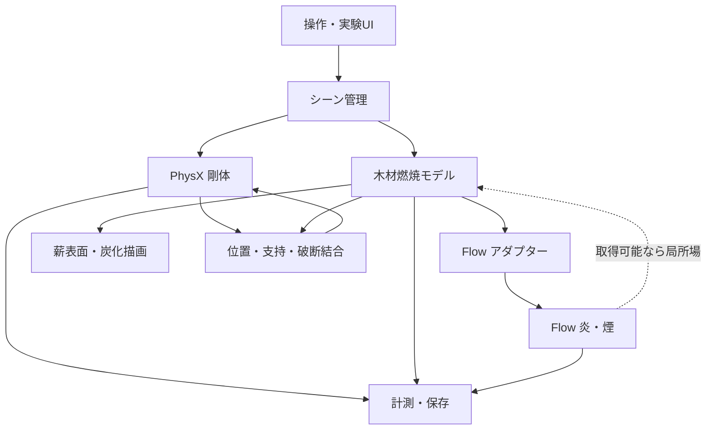

# 物理ベース・リアルタイム焚き火シミュレータ 設計文書

# Phase 6GS bounded public volume-metadata qualification

Phase 6GR remains frozen as a harness-failure safe stop. Phase 6GS fixed the
duplicate marker payload through one canonical dictionary and normalized the
optional PowerShell report properties before condition reporting. The no-Kit
child and end-to-end fixtures passed 14/14 and 13/13. A fresh one-process S93
run then completed one temperature conversion and all six predeclared public
volume accessors exactly once. Grid count/type/name/class were `1/1/Flow/2`,
the index box was `[[-96,-96,-16],[127,111,639]]`, and the world box was
approximately `[[-2.4,-2.4,-0.4],[2.4,2.4,15.6]]`.

Operation and lifecycle both passed: weak residual was zero, stage close took
5.732096 seconds, Kit exited naturally with code 0, and exact cleanup left no
process. Kit/tree peaks were 14,877,048,832 / 15,041,200,128 bytes. Temporary
NVDB, another channel, values, sampling, collectors, flux, repeated operations,
and the formal population remain blocked. See
`docs/design/phase6gs_volume_metadata_qualification.md`.

# Phase 6GK bounded artifact interface preflight

Phase 6GJ remains frozen as a nonreplaceable artifact safe stop. Phase 6GK
froze canonical property `field_body_json_npz_or_openvdb_written` and an
explicit legacy normalization boundary before runtime. Missing, null,
nonboolean, conflicting dual values, or a true write flag fail closed without
relying on a PowerShell property-not-found exception. The actual shared-runner
fixture passed 10/10, including a read-only Phase 6GJ raw-artifact round trip
and child exit-code propagation.

The fresh S93 preflight passed in one launch with no replacement. Startup was
representative, the exact seven-handle schema and state-aware alias contract
passed, canonical-only normalization passed, and all handles were released
without residual. Kit/tree peaks were 15,106,207,744 / 15,271,022,592 bytes;
stage close took 3.052436 seconds and normal OS exit/exact cleanup completed.
The versioned seven-channel schema is now public-channel-preflight-qualified
for this fixed condition. Formal comparison and production remain blocked. See
`docs/design/phase6gk_bounded_artifact_interface_preflight.md`.

# Phase 6GJ empty RGBA alias preflight safe stop

Phase 6GI remains frozen as a nonreplaceable safe stop. Phase 6GJ freezes a
new contract with state-aware alias semantics: nonempty handles require
same-object and `numpy.shares_memory == true`; the disabled zero-byte RGBA
handle requires same-object, zero elements/bytes, no copy, and no weak-reference
residual but does not require a sharing predicate that is undefined for empty
storage. Its offline alias/schema fixture must pass before one fresh S93
preflight under unchanged 16/17 GiB and lifecycle safety boundaries. Formal
S93/S100/OFF and production remain blocked. The 22/22 fixture and runtime alias
operation passed, but the shared child wrapper required a differently named
bounded-output property after Kit's normal exit. It exited 1, so the parent
correctly safe-stopped with a nonreplaceable `artifact_failure`; the candidate
schema is not formally preflight-qualified. No retry occurred. See
`docs/design/phase6gj_empty_rgba_alias_preflight.md`.

The final Release build, Phase 0 RTX, Phase 3, focused Phase 6F 212/212 and
Phase 6G 53/53, standard 78/78, and devlog validation passed. Production and
latest-demo hashes remain unchanged and final residual process count is zero.

# Phase 6GI S93 public-channel preflight safe stop

Phase 6GH remains frozen as candidate identification. Phase 6GI froze a fresh
normal-resource preflight contract (SHA-256
`5A6A943B84CA0A2D987BEA22585F287026529AB7A2600050898599DA1A467784`),
passed its 20/20 schema and 12/12 startup-policy fixtures, and launched one new
S93 process. Startup was representative from frame 1 and the frame-180 readback
returned the exact seven-handle raw schema. The six required nonempty channels
had positive pointers, same-object/shared-buffer aliases, expected metadata,
and zero weak-reference residual after ordered slot clearing.

The preflight nevertheless stopped as a nonreplaceable operation failure. The
disabled RGBA handle was the same zero-byte Python array before release, but
`numpy.shares_memory(empty, empty)` returned false; the Phase 6GI implementation
had incorrectly required true even for an empty array. Raw schema validation,
resource limits, stage close, shutdown, and exact cleanup succeeded, but exit 1
means this is not an accepted normal sample. No replacement or second launch
was allowed. Kit/tree peaks were 15,099,490,304 / 15,263,600,640 bytes, stage
close was 62.417672 seconds, and fatal/dump/upload/CDB/residual counts were zero.

Phase 6GI is frozen as a safe stop and the candidate schema is not yet formal
preflight-qualified. Formal S93/S100/OFF, flux, deep velocity, video, Point
adoption, production, defaults, V3, P4, and dynamic geometry remain unstarted.
A separately approved Phase must predefine the zero-length alias semantics and
use a new root. See `docs/design/phase6gi_s93_channel_preflight.md`.

Final regression passed the Release build, Phase 0 RTX, Phase 3 zero dry/wet
mass balance with wood-owned Flow input (active blocks final/peak 303/323),
focused Phase 6F 212/212, focused Phase 6G 46/46, and standard 78/78. Devlog
validation passed 484 references, 289 IDs, 241 JSON, 177 SVG, and two ZIPs.
Production and latest-demo hashes remained unchanged and final Kit/CDB/GPU
helper residual count was zero.

# Phase 6GH startup-gated color-slot identification

Phase 6GG remains a frozen startup safe stop and contributes no sample to this
Phase. Phase 6GH freezes a new population contract (SHA-256
`9EEA40A2A3E6A4CBE3E0B5DA08CFEDE422F41C6CE6253CB157E909A6936DFEF8`)
that permits at most two population-wide replacements, and only when all 120
fresh startup samples are exactly 24 active blocks with valid source, identity,
lifecycle, and cleanup evidence and no readback. Every operation, resource,
lifecycle, or cleanup failure remains nonreplaceable.

The fresh C0/C1/C2 population needed no replacement. All three processes were
representative from frame 1 (269 active blocks; 1,124 maximum during the frozen
startup gate), used the same 1,344/1,440 Point payload and exact float32 source
sums, performed one bounded frame-180 metadata readback, and exited normally
with exact cleanup. C1 alone enabled `rgbaEnabled` and changed only handle 6:
empty became a 179,184,672-byte public volume buffer with grid class 0 and
value type 17. C2 enabled `rgbEnabled` and changed no returned handle. Therefore
the candidate Flow 110.0.0 / Kit 110.2 schema identifies handle 6 as the RGBA
export slot; RGB neither shares that slot nor exposes a separate slot in the
seven returned handles under this fixed diagnostic condition. No value-range or
visual inference was used.

The candidate schema ID is
`flow110.0.0-kit110.2-public-readback-rgba7-v1`, SHA-256
`06BAF639E07E7585CB6ED79FFBA6229EA118F450A34BAD1F3EC1228EA59DD8B9`.
Its 12/12 offline fixtures accept only the exact seven-handle versioned schema
and reject missing, added, reordered, duplicate, mistyped, legacy-six, unknown,
and future-version inputs. This is a candidate identification, not an S93
channel-preflight qualification. Formal S93/S100/OFF, flux, deep velocity,
video, production integration, defaults, and latest demo remain unstarted and
unchanged. Diagnostic-only 20/21 GiB limits remain isolated; normal 16/17 GiB
limits are unchanged. See `docs/design/phase6ge_color_slot_diagnostic.md`.

Final regression passed the Release build, Phase 0 RTX, Phase 3, focused Phase
6F 212/212 and Phase 6G 42/42, and the standard eight-process 78/78 suite in
339.6 seconds. Phase 3 retained zero dry/wet mass-balance error, wood-owned Flow
input, active blocks final/peak 263/346, and peak fuel 1.0. Devlog validation
passed 482 references, 288 unique IDs, 240 JSON, 177 SVG, and two ZIP files.
Production app SHA-256 remained
`94162F82AF95D5ABB3798FCB5CA71F7821B7813FD8623D1387BC723288ADF02A`;
latest-demo SHA-256 remained
`1C6FB249EAE8DF09E804680C7D0459BA8631D4ECFF4903944FFA4701E94E6285`;
final Kit/CDB/GPU-helper residual count was zero.

# Phase 6GE public color-export slot diagnostic

Phase 6GDの履歴と16 GiB resource safe stopを凍結したまま、handle 6識別
だけにKit 20 GiB／unique tree 21 GiB、runner/diagnostic各512 MiB、
physical/commit floor各32 GiBを許可する診断専用contractを事前固定した。
通常のPhase 6FZ／正式比較16/17 GiB契約は不変である。C0 baseline、C1
RGBA-only、C2 RGB-onlyをfresh processで順番に実行し、frame 180の最初の
readbackを7つの未命名handleとして逐次metadata化・解放する。次条件には
functional pass、normal exit、accepted sample、exit 0、exact cleanup、
residual 0を全て要求する。詳細は
`docs/design/phase6ge_color_slot_diagnostic.md`。

最初のPhase 6GE rootはcase runnerの`ReportPhase` ValidateSetがphase6gdまで
だったためKit起動前に停止した。Kit peak 0、20/21 GiB設定、exact cleanup
残留0を保存し、C1/C2は未開始である。これを再利用・再分類せず、明示token
とreal command-line no-Kit fixtureだけを追加したPhase 6GF contract／空root
へ分離する。

Phase 6GF C0子processは7-handle metadata、normal exit、exit 0、exact
cleanup、residual 0を満たしたが、外側`Start-Process`の`ExitCode`がnullと
評価されpopulationはC1前にsafe stopした。rootは凍結し、stdout/stderrを
fileへ直接redirectした外部commandの`$LASTEXITCODE`を使うPhase 6GG契約と
新rootへ分離する。

Phase 6GG passed its exit-propagation fixture, but fresh C0 stopped at the
existing startup-liveness gate before readback: all 120 samples remained at 24
active blocks and were classified `small_field_ingestion`. Telemetry, the exact
1,344/1,440 Point payload, canonical payload SHA, and float32 source sums were
valid, but functional pass was not established. C1/C2 were therefore not
started. Release-after-close, `shutdown_complete`, and exact cleanup completed;
Kit/tree peaks were 11,609,899,008 / 11,773,349,888 bytes and CDB, fatal, dump,
upload, and residual counts were zero. Handle 6 and the candidate schema remain
unknown. The 20/21 GiB limits remain diagnostic-only and normal 16/17 GiB
limits remain unchanged. See `docs/design/phase6ge_color_slot_diagnostic.md`.

# Phase 6GD public NanoVDB channel schema discovery

Phase 6GC remains frozen at its seven-handle pre-indexing safe stop. Phase 6GD
uses one fresh S93 process to enumerate `handle[0]` through `handle[n-1]` and
record only bounded public metadata. It does not assign semantic names, convert
whole fields, or start the formal comparison. The discovery contract fixes a
256 MiB per-handle and 512 MiB total temporary-file limit and preserves every
Phase 6GC physical and Phase 6FZ/6FU/6FW safety boundary. Flow 110.0.0's bundled
OGN definition names six outputs but does not explain the seventh Python object,
so it is reference evidence rather than an inferred mapping. See
`docs/design/phase6gd_public_channel_schema.md`.

Runtime evidence kept the schema fail-closed. Baseline returned seven handles:
0--4 nonempty, 5--6 empty. Enabling only divergence uniquely populated handle 5
and completed its metadata operation and stage close, but Kit did not exit
within the frozen grace period. Bounded CDB obtained all-thread stacks, modules,
and explicit detach; although its diagnostic fingerprint contained all five NGX
tokens, the frozen final classifier remained `unknown_shutdown_failure` and is
not reclassified here. The Phase 6GD parent runner failed to propagate that
three-axis result and therefore launched the next RGBA control; the runner now
requires functional pass, lifecycle `normal_exit`, accepted normal-exit sample,
and exit code zero before any later control. Existing artifacts were not rerun.
RGBA reached the unchanged 16 GiB Kit limit at frame 100 before readback (peak
17,541,881,856 bytes); exact cleanup removed the attempt tree and RGB was not
started. Therefore handle 6 remains unknown,
no operational schema ID/fixture exists, and S93 preflight/formal 9-process
comparison/video remain unstarted. Production and Phase 6GC are unchanged.
Release build, Phase 0 RTX, Phase 3 (zero dry/wet mass-balance error), focused
Phase 6F 212/212 plus Phase 6G 22/22, standard 78/78 and devlog validation all
passed; production/latest-demo hashes were unchanged and final residuals zero.

# Phase 6GC payload-native source contract

Phase 6GB remains frozen at its exact decimal-source safe stop. Phase 6GC
replaces only that harness boundary: expected and observed values are the exact
ordered float32 payload arrays summed after float64 expansion. Point/revision,
shape/dtype/stride, finite state, array hashes and a canonical ordered payload
hash are mandatory. Decimal source times count is telemetry only. Alternate
accumulation order can use only the pre-runtime `count * max float32 ULP` bound
and only with identical payload hashes. Sixteen no-Kit fixtures and all prior
geometry/import/CDB/offline gates precede a fresh root. Physical and safety
contracts are unchanged. See
`docs/design/phase6gc_payload_native_source_contract.md`.

Runtime confirmed the correction: fixtures passed 16/16 and the S93
expected/live float32 payload hash and three sums matched exactly. The fresh
preflight then safely stopped after one public readback returned 7 handles while
the frozen channel schema expected 6. No handle was indexed or converted and
formal S93/S100/OFF remained 0/9. Stage close and exact cleanup completed with
zero residual/fatal/dump/upload. This readback-schema boundary belongs to a
future independent Phase; Phase 6GC is not retried or qualified.

# Phase 6GB explicit geometry binding and supply comparison contract

Phase 6GA remains the frozen `corrected` versus `phase6er_corrected` pre-Kit
parameter-binding safe stop. Phase 6GB separates the design concept from the
runtime token, rejects unknown and legacy misrouting before Kit, and requires a
four-case no-Kit command-line fixture before the unchanged S93/S100/OFF
population. The SHA-pinned contract preserves all Phase 6GA physics and Phase
6FZ safety thresholds. See `docs/design/phase6gb_supply_comparison.md`.

Runtime confirmed the geometry correction: the no-Kit fixture passed 4/4 and
the S93 channel preflight launched with `phase6er_corrected`. The representative
field reached 269/688 active blocks at frames 1/60, but the frozen absolute
startup sum gate rejected float32 fuel `1075.2000160217285` versus expected
`1075.2` at tolerance `1e-5`. Readback, all nine formal slots, replacement, and
video remained zero. Release-after-close and exact cleanup completed, while the
deliberate probe error made OS exit 1; Phase 6GB is a frozen pre-readback safe
stop, not a physical comparison result.

# Phase 6FZ deterministic import and memory qualification contract

Phase 6FYの20 fixture合格とattempt01 import safe stopはcommit `aa02635`の履歴として
凍結し、正式sampleへ再利用しない。次の独立Phase 6FZは、Kit `--exec`が実行中probeの
絶対ディレクトリから共有probeをfile-spec importし、解決済み`__file__`、`sys.path`、
entry pointをartifactへ確定する。app-ready Kit上のpositive／missing／wrong-path smoke、
およびCDBの20秒無進捗・80/30/10秒pass別絶対timeout（総計120秒）fixtureが全合格した
場合だけ、新rootで凍結済みM0/M1/M2×3の9 processをprocess 1から開始する。16 GiB Kit、
17 GiB tree、release-after-close、Phase 6FU/6FW、3軸分類、pre-close commit、限定replacement
は変更しない。詳細は`docs/design/phase6fz_import_and_memory_qualification.md`。

実測はapp-ready import 3/3、CDB progress fixture 7/7、正式M0/M1/M2×3の9/9が
memory-validかつnormal OS exit、replacement／timeout／CDB発動／residual 0だった。Kit peakは
`14,478,200,832..14,957,187,072 bytes`、tree最大`15,120,756,736 bytes`。旧14 GiBは
crossing 0でも最小余白`75,198,464 bytes`しかないため異常上限として廃止し、事前固定した
512 MiB余白を満たすKit 16 GiB（余白`2,222,682,112`）とtree 17 GiB（余白
`3,132,854,272`）をqualifiedとする。Phase 6FOは別root・別承認で再開可能だが未開始。

Phase 6FZ最終回帰はRelease build、Phase 0 RTX、Phase 3、focused Phase 6F
`212/212`、標準suite 8 process・`78/78`（331.9秒）、devlog静的検査に合格した。
Phase 3はdry/wet mass-balance error 0、wood-owned Flow input、active blocks
final/peak 262/316、peak fuel 1.0。production app SHA-256
`94162F82AF95D5ABB3798FCB5CA71F7821B7813FD8623D1387BC723288ADF02A`とlatest
demo manifest SHA-256 `1C6FB249EAE8DF09E804680C7D0459BA8631D4ECFF4903944FFA4701E94E6285`
は不変で、Kit/CDB/GPU helper残留は0だった。

# Phase 6FY three-axis memory qualification contract

Phase 6FT／6FV／6FXはsafe stopのまま凍結し、過去sampleを新母集団へ
流用しない。Phase 6FYはmemory validity、stage-close lifecycle、bounded
diagnostic／cleanupを独立判定する。測定完了後だけ発生した既知timeoutは
`memory_valid_lifecycle_timeout`としてメモリ分布へ残すが、normal exitや
production lifecycle合格には数えない。契約SHA、20 fixture、pre-close
streaming／fsync artifact commit、基本9＋最大2 replacement、Kit 16 GiB／
tree 17 GiB上限をruntime前に固定した。詳細は
`docs/design/phase6fy_three_axis_memory_qualification.md`。Phase 6FO、
S93/S100、production、既定値、動画、P4は開始・変更しない。

正式root `artifacts/phase6fy-three-axis-memory-1` は20/20 fixture合格後、attempt01
M0のapp-ready直後に `probe_phase6fy_three_axis_memory.py` が共有probeをimportできず
`ModuleNotFoundError` で停止した。operation／measurement markerとpre-close commitは0件で、
分類は `memory_invalid_operation_failure`、正式memory sampleは0件である。外側timeout後の
bounded CDBはpartial stack timeout、module取得・detach・Phase 6FU/6FW exact cleanupは完了し、
owned residual／unknown／fatal／dump／uploadは0だった。後続・replacementは開始せず、16/17 GiBと
Phase 6FOは未qualifiedのままとする。次回は新Phase／新contract／新rootでKit `--exec` のimport
smokeをruntime前gateへ追加する必要がある。Phase 6FYは再試行・遡及再分類しない。

# Phase 6FX memory-ceiling qualification contract

Phase 6FT/6FV remain frozen safe stops and their runtime artifacts are not part
of the new formal population. Phase 6FX freezes a fresh balanced M0/M1/M2
three-run population under contract SHA-256
`A32F9FB6CB94E733DC1B0B3A4133A1434B35CB4706B62EB2CCE7152993B0D0D6`.
It directly reuses the Phase 6FS `release-after-close` lifecycle, Phase 6FU
guard/exact cleanup, Phase 6FW final PID-reuse classifier, and Phase 6FR
stack-first CDB path. Old 14 GiB is evaluation-only; Kit 16 GiB and unique
tree 17 GiB are absolute stops, with qualification requiring a fresh normal
maximum at or below 15.5 GiB. Phase 6FO, readback, capture, video, production,
defaults, and physics are excluded. See
`docs/design/phase6fx_memory_ceiling_qualification.md`.

Runtimeはattempt01--05がnormal exitし、attempt06 M0がreadback 0・resource
上限内のまま`stage_close_request_before`から180.016801秒でtimeoutしたため
5/9 safe stopとなった。後続3 processは未起動、CDB stack/module passは
attach前にtimeoutしexplicit detachだけ成功、known NGX tokenは不一致である。
Phase 6FU/6FW cleanupはowned residual 0・unknown 0・最終残留0。正常最大
14,967,640,064 bytesは旧14 GiBまで64,745,472 bytesしかないため旧基準は
異常検出上限として近すぎるが、母集団未完了のため16/17 GiBは採用せず、
Phase 6FOもblockedのままとする。

# Phase 6FW PID reuse identity policy contract

Phase 6FVは`445a1da`のidentity safe stopとして凍結し、attempt03や旧contractを遡及合格にしない。Phase 6FUの7状態identity query・exact cleanup・停止権限は変更せず、その完了証拠を読む独立した最終policy層だけを追加する。正式contractはschema `campfire.phase6fw.pid-reuse-policy-contract.v1`、SHA-256 `4DA8B0C71F7AAF0A9BA437D0D7712674C87F80AF982F413148E317C4EF4CDBA0`である。

同一PIDの現在identityについて、creation timeまたは安全に正規化したabsolute pathが明確に異なり、少なくとも1つのtrusted queryが完全なidentityを返し、match・query競合・unknown・新identityへのstop要求・summary後再発見がなく、suppression解放・cleanup marker・他identity absenceが完備した場合だけ`protected_pid_reuse_non_residual`とする。creation timeはUTC Unix epoch秒、許容差1.0秒を固定する。path aliasを解決できない場合はfail closedとし、access denied単独をreuse証拠にしない。詳細は`docs/design/phase6fw_pid_reuse_policy.md`を参照する。

正式runtime前に15 fixture、10秒child timeout、runner/child各512 MiB、CDB/Kit 0を固定する。Phase 6FV attempt03は元artifactを変更せず、新rootへhash付きの最小証拠だけを読み出してoffline比較する。Phase 6FWでは9-process memory population、Phase 6FO、16/17 GiB採用、production、既定値、動画を開始・変更しない。

正式root 2は15/15 fixtureとPhase 6FV offline比較に合格した。証拠十分なtime/path mismatchだけをprotected reuseとし、exact match、生存original、creation/path不明、照会競合、mismatchへのstop要求、summary後再発見はすべてfail closedになった。fixture 11ではreuse PIDを保護したまま別matching childだけをstop、fixture 13ではsummary後の再発見をattempt-owned residualへ戻した。runner/child peakは9,568,256／8,208,384 bytes、fixture/CDB/helper残留は0である。Phase 6FV相当caseは39 absent＋1 protected reuse、matching residual 0、unknown 0、mismatch stop 0、suppression解放として診断分類できたが、旧Phase 6FV判定は変更していない。

Release build、Phase 0 RTX、Phase 3（dry/wet mass balance error 0、wood-owned Flow input、active blocks final/peak 289/337）、focused Phase 6F 185/185、標準suite 8 process・78/78、devlog静的検査に合格した。production app SHA-256とlatest demo manifest SHA-256、Phase 6FU/6FM/6FN/6FVの凍結hashは不変、最終Kit/CDB/GPU helper/fixture残留は0である。次は明示承認と新contract／新rootがある場合だけ、release-after-close、暫定16/17 GiB、Phase 6FU guard＋Phase 6FW policy、stack-first CDBを使う9-process memory qualificationへ進める。Phase 6FOは引き続きblockedである。

# Phase 6FV post-6FU memory-ceiling qualification contract

Phase 6FTは`146ded9`の8/9 lifecycle safe stopとして凍結し、既存sample／artifact／判定を新母集団へ流用しない。Phase 6FUのdiagnostic・7状態identity・cleanup suppression・exact attempt-tree cleanup・psutil/Win32二経路absence確認を前提に、新しいPhase 6FVを新rootでM0/M1/M2各3 process、balanced order `M0/M1/M2`、`M1/M2/M0`、`M2/M0/M1`として最初から実行する。正式contract SHA-256は`C917FE4463E3BCA600714A51EFEDF64E9E505F19F082647CCF5683269071AF0C`である。

全runはPhase 6FSのdiagnostic-only `release-after-close`、修正版4本fixture、S93、1,344/1,440 Points、同一payload、readback/capture/video 0を固定する。旧14 GiBはsoft evaluation threshold、Kit 16 GiB／unique tree 17 GiBをabsolute stop、runner/diagnostic各512 MiB、physical/commit floor各8 GiB、stage close 180秒とする。16 GiB qualificationは9/9 normal exit、正常最大15.5 GiB以下、512 MiB以上の余裕、tree 17 GiB以内、persistent unexplained accumulation 0、全lifecycle marker、Phase 6FU exact cleanupと二経路absence、残留0を要求する。Phase 6FVは上限qualificationだけを行い、Phase 6FO、S93/S100比較、production変更、動画、P4を開始しない。詳細は`docs/design/phase6fv_memory_ceiling_qualification.md`を参照する。

正式rootはattempt03 M2で`identity_mismatch_observed`として安全停止した。attempt01 M0とattempt02 M1はrepresentative pass、attempt03も688/948/1,322 blocks、resource上限内、stage close 34.468秒、`shutdown_complete`、OS exit 0まで到達したが、記録済み`conhost.exe` PID 43676がcleanup時には別creation timeの`WmiPrvSE.exe`へ再利用されていた。guardは新processを停止せず、matching残留・final unknown・killはいずれも0、二経路absenceとsuppression解放を確定した。一方、事前契約はprotected identity mismatchを非置換failureとしたため後続6条件を開始していない。2代表runのKit peakは14,899,392,512～14,945,353,728 bytes、14 GiB最小余裕は87,031,808 bytesで旧上限は依然厳しすぎるが、9/9未完了のため16/17 GiBは未qualified、Phase 6FOはblockedである。

最終回帰はRelease build 7.96秒、Phase 0 RTX、Phase 3（dry/wet mass balance 0、wood-owned Flow input、active blocks final/peak 254/342、peak fuel 1.0）、focused Phase 6F 177/177、Phase 6EA resource/static 7/7・6/6、標準suite 8 process・78/78（351.1秒）、devlog検査に合格した。production app SHA-256とlatest demo manifest SHA-256は不変で、Kit/CDB/nvidia-smi残留は0である。

# Phase 6FU hang diagnostic identity and cleanup contract

Phase 6FTは`146ded9`のsafe stopとして凍結する。attempt09は`stage_close_timeout`後にCDB artifactを確定せず、guardの二値identity queryは問い合わせ失敗と不在を区別できないままcleanup summaryを確定した。Phase 6FUはprocess stateを7分類し、PID・creation time・absolute path・parentage・role・attempt IDを保存する。psutil/Get-Processとnative Win32/CIMの独立照合がともにexitを確認した場合だけ`confirmed_exited`とし、unknownやidentity mismatchを停止対象にしない。

timeout後はdiagnostic ownership lockでouter cleanupをboundedに抑止し、stack-first CDB、補助module pass、explicit detach、完全またはpartial diagnostic JSON、exact attempt-tree cleanup、二重absence確認、summary確定の順を固定する。専用fixtureが全件合格するまで実Kit、Phase 6FO、9-process memory population、16 GiB採用を開始しない。詳細は`docs/design/phase6fu_diagnostic_identity_cleanup.md`を参照する。

最終fixture root 4はcontract SHA-256 `745522077F7481C41A121EC732188FF6BDF0706FB2CE3313AD7288E4B6328132`で合格した。stack-first CDBはnon-empty all-thread native stack、独立module pass、explicit detachを完了し、module timeout時も先に得たstackを保持してtargetを生存させた。identity/cleanup 7群、locked-log、target-exit-before-attach、outer guard suppression raceも合格し、psutilとnative Win32の双方がexact attempt identity 4件のexitを確認してからsummaryを確定した。runner peakは9,482,240 bytes、diagnostic peakは94,515,200 bytes、残留0、full dump／upload 0である。旧`phase6eg_resource_guard.py`は凍結SHA-256 `A16FA82606A4265093E88816540A0E293205AADC9A15FA11B7CA09C6B32CC45E`へ戻し、新しい挙動はPhase 6FU adapterへ隔離した。

したがってdiagnostic／process identity／exact cleanup境界は、将来の明示承認された9-process memory populationへ使用可能である。ただしPhase 6FT attempt09のnative原因は未確定のまま、16/17 GiBは未qualified、Phase 6FOはblockedである。このPhaseでは実Kit、memory population、S93/S100比較、production、動画、latest demoを開始・変更していない。

最終回帰はRelease build 6.30秒、Phase 0 RTX、Phase 3、focused Phase 6F 168/168、Phase 6FU/6FR/6EA safety 28/28、標準suite 8 process・78/78（294.3秒）、日誌静的検査に合格した。Phase 3はdry/wet mass balance error 0、既存authority SHA、wood-owned Flow input、active blocks final/peak 260/332、peak fuel 1.0を維持した。production app SHA-256は`94162F82AF95D5ABB3798FCB5CA71F7821B7813FD8623D1387BC723288ADF02A`で不変である。

# Phase 6FS B-first release-after-close qualification contract

Phase 6FTは8/9 normal exit後、attempt09 M1のreadback 0条件が`stage_close_request_before`から180.021秒でtimeoutしsafe stopした。8正常runのKit peakは14,494,695,424～14,986,518,528 bytes、16 GiB余裕は2,193,350,656 bytes、追加allocationに追従する増加はなかった。旧14 GiBまでの最小余裕は45,867,008 bytesで異常検出上限として厳しすぎるが、9/9 lifecycleとbounded CDB/exact cleanupが不成立のため16 GiB/17 GiB候補は未qualified、Phase 6FOもblockedのままとする。詳細は`docs/design/phase6ft_memory_ceiling_qualification.md`を参照する。

Phase 6FRのsafe stopは`a55b49b`で凍結し、A release-before-closeの180.0144794秒timeoutと149-thread stackを再分類しない。Phase 6FSはB release-after-closeだけを3独立processで実行し、stage／viewport／Flow／provider／Emitter／collector参照を明示ownership containerへ保持したまま`close_stage_async()`、USD detach、4 post-close updateまで完了し、その後にPython-owned slotを解放する。14 GiB Kit、16 GiB unique tree、各512 MiB runner/diagnostic、8 GiB physical/commit floorは変更しない。詳細は`docs/design/phase6fs_release_after_close_qualification.md`を参照する。

正式run前の契約は`campfire.phase6fs.release-after-close-qualification-contract.v1`としてSHA-256を固定する。Phase 6FRでqualifiedしたstack-first CDB helperは変更せず、実Kit前はwait-target 1件だけのsmokeとする。Bが3/3 normal OS exit、全marker順序、ownership解放、CDB発動0、exact cleanup／残留0を満たしてもproduction shutdown順序は変更せず、「有力候補」に限定する。Phase 6FO、S93/S100比較、14→16 GiB変更、動画、P4は開始しない。

実測ではBが3/3 normal OS exitし、stage closeは`2.2236896～21.8791366秒`、payload SHAとframe 60/96 active blockは全runで同一、startup置換・CDB・fatal・dump・upload・残留は0だった。明示ownership containerと全local slotはclose後に空となり、extension shutdownも3/3完了した。Kit peak最大は`14,941,323,264 bytes`で14 GiBまで`86.844 MiB`、tree peak最大は`15,105,253,376 bytes`だった。従ってrelease-after-closeは次の限定qualificationに用いる有力候補であり、lifecycleを次のmemory ceiling qualificationから分離して進められる。ただしproduction順序は未変更、低頻度native障害は未解決、14/16 GiB採否も未変更で、Phase 6FOは停止を維持する。

# Phase 6FR stack-first CDB and stage-close shutdown-order contract

Phase 6FQのsafe stopは`778623c`で凍結する。CDB診断はmodule-first依存を廃止し、exact identity確認後にboundedな全thread stackを先に取得し、module一覧は独立した補助pass、detachは独立cleanup passとする。fixtureが合格した場合だけ、readback/capture 0のA release-before-closeとB release-after-closeを`AB/BA/AB`で各3 runまで比較する。14/16 GiBの採否とPhase 6FO再開は行わない。詳細は`docs/design/phase6fr_stage_close_native_lifecycle.md`を参照する。

実測ではCDB fixtureが全case合格し、module timeout後もcomplete stackを保持、forced stack timeout後もtarget生存、explicit detach、CDB残留0を確認した。正式attempt01のAはrepresentative startup・readback/capture 0・8 renderer drain・release-before-close後、`close_stage_async()`が180.0144794秒timeoutした。全149 thread stackを取得し、main close pathは`omni_usd!UsdManager::destroyContext+0x160`、loader threadは`RtlAcquireSRWLockExclusive`から`loadRenderSettingsFromStage`／`closeStage`境界だった。ownerは不明、known NGX tokenは0/5、exact cleanup後の残留は0。fail-fastによりBは未実行であり、release-after-close、安全順序、低頻度監視移行、memory ceiling qualificationはいずれも未qualified。次は明示承認されたB-first限定qualificationが最小境界で、Phase 6FOは開始しない。

# Phase 6FQ stage-close lifecycle qualification contract

Phase 6FP attempt11のreadback 0／C5条件で発生した180.007436秒の`close_stage_async()` timeoutをmemory ceilingから分離するため、Phase 6FQを事前凍結した。Phase 6FOの比較条件、production、Point payload、Flow、CollisionProxy、V3、14/16 GiB safety ceilingは変更しない。既存のPhase 6FO probe/runner、resource guard、bounded CDB、exact cleanupを直接再利用し、C5 metadata、bounded manifest、active viewport alias、renderer drain、release-before/after-closeを一変数ずつ比較する。詳細は`docs/design/phase6fq_stage_close_lifecycle_qualification.md`を参照する。

Phase 6FQの全slotがnormal OS exitするまでmemory ceilingの第2段階へ進まず、第2段階が完了するまでPhase 6FOを再開しない。未知timeoutが再発した場合は自動retryせず、そのactive conditionと最後のmarkerでsafe stopする。

実測ではroot 2のattempt01～06がnormal exitし、stage closeは2.149～35.770秒だった。C5 metadata、bounded manifest、public viewport alias、drainなしはいずれも停止を再現しなかった。しかしattempt07のcapture準備なし・8-update drain・release-before-close controlが`stage_close_request_before`後に180.023808秒timeoutした。CDB module passも30.401秒timeoutし、complete stack、module/offset、owner threadは未取得。known NGX signatureは成立せず、exact observed-descendant cleanup後の残留は0だった。従ってcapture準備を直接原因から除外できる一方、安全なstage-close順序は未qualifiedである。Stage 2、14/16 GiB上限qualification、Phase 6FO再開は行わない。

# Phase 6FP pre-readback allocation calibration safe stop

Phase 6FOの15,127,232,512-byte pre-readback safe stopを凍結し、Phase 6FN相当baselineからcollector、spatial metadata、channel metadata、lazy buffer plan、capture準備、S93 identity、6FO-equivalent状態を累積追加する24-process契約を固定した。Phase 6FN baseline自体がS93の同一1,344/1,440 Point payloadであり、near-Mesh field bodyはpublic grid metadataを得るreadback後まで生成されず、capture bodyもcapture callまで生成されない。

forward 8条件とreverse C7/C6までの10 processはnormal exitした。全runでframe 60/96 active blocksは688/948、Kit peakは14,583,508,992～14,930,382,848 bytesだった。6FO-equivalent C7は14,871,994,368／14,894,997,504 bytesで旧6FO超過を再現せず、診断要素に追従する増加はなかった。最有力は4本Flow/RTX/Kit allocator/cacheのrun間高水位変動だが、各条件3 run未完了なので確定とはしない。

attempt11 C5は参照解放後の`close_stage_async()`で180.007秒timeoutした。CDB module取得とdetach recoveryは完了、all-thread stackは45秒timeout、known NGX signatureは不一致、exact cleanup後のKit/CDB/helper残留は0。非置換lifecycle failureとして10/24で停止し、6FOは再開していない。14 GiBまでの最小正常余白は102,002,688 bytesにすぎず、16 GiB候補は未採用。再開にはlifecycle境界、未完3-run分布、必要なら新しい上限qualificationの独立承認が必要。詳細は`docs/design/phase6fp_pre_readback_allocation_calibration.md`。

# Phase 6FO S93 / S100 Point supply comparison contract

最初のartifact rootはchannel readback前・formal 0件でharness safe stopとした。Flowはframe 60で688 active blocksへ到達した一方、float32 payload合計に相対許容値`1e-6`を絶対値として渡したためfuel差約`1.60e-5`とsmoke差約`2.40e-6`を誤って`no_source`とした。またrunnerの`channel_attempt*`とanalyzerの`attempt*`が不一致だった。root 1は再分類・再利用せず、contract v2でstartup serialization専用の絶対許容値`1e-4`を物理比較用の相対gateから分離し、artifact探索と欠落時fail-closedを修正した。物理gate、形状、供給、readback回数、安全上限は不変である。

新しいroot 2は修正済みstartup gateを通り、active blocksはframe 60の688からframe 96の948まで成長した。しかしframe 180のchannel readback前にKit Private Bytesが14 GiBを超え、guard値15,127,232,512 bytes（90.453 MiB超過）、同期marker最大15,130,648,576 bytesで絶対resource safe stopした。readback 0、formal S93/S100 0、fatal/dump/upload/residual 0である。上限を引き上げず、channel・field・flux・映像・採用候補は未判定、productionとlatest demoは不変、P4へは進まない。

最終回帰はRelease build 8.29秒、Phase 0 RTX、Phase 3（dry/wet mass balance error 0、Flow active blocks final/peak 223/314）、focused Phase 6 359/359、標準suite 8 process・78/78、日誌静的検査に合格した。production SHA-256は`94162F82...F02A`で不変、Kit/CDB/GPU helper残留は0である。

Phase 6FNの3回readback／fuel alias qualificationを凍結し、readback反復診断を終了してPoint Emitter–CollisionProxyロードマップP3へ戻る。修正版4本fixtureのoffset `-0.0125 m`、同一1,440 Pointに対し、他薪との仮定0.05 m support sphere交差96点を停止するS93（1,344点、93.33%）と、Point中心の他薪内部侵入だけを禁止するS100（1,440点、100%）を比較する。両方式とも他薪内部Point中心0、proxy体積交差0であり、0.05 mは公開Flow support radiusではない。

正式runtime前に全Point判断JSONL、stage blueprint、channel schema、判定閾値を凍結する。public readbackは各process frame 180/360/540の最大3回。velocity／temperature／smoke／fuelは直接返却NumPy bufferから一時NanoVDBと近傍NPZを順次生成し、channelごとにaliasを解放する。`np.asarray()`、material field copy、forced GC、4回目readbackを禁止する。実Mesh signed distanceでdeep/boundaryを分け、同一control volumeの方向付きtransport、gap／opposite／flame-rise領域、火炎高さproxyを比較する。S100のdeep scalar／opposite transport／floored velocityがS93より25%超悪化する場合をmaterial failureと事前定義し、数値合格後だけ同一cameraの15秒比較動画を生成する。

14 GiB Kit、16 GiB tree、512 MiB runner/diagnostic、8 GiB headroom、180秒stage closeを維持する。production、Flow、Point schema/order/revision、CollisionProxy、V3、既定値は変更しない。詳細は`docs/design/phase6fo_s93_s100_supply_comparison.md`。

# Phase 6FM settled post-release three-iteration qualification contract

Phase 6FKの単回qualificationとPhase 6FLの3/9 safe stopを凍結し、新しい空rootでexplicit `settling_end`だけをformal accumulation baselineにするPhase 6FMを事前定義した。`pre_operation`はFlow成長・allocator・cacheを含むtelemetryとして保存するがformal gateにしない。各iterationは`pre_operation`、`operation_completed`、`release_completed`、`settling_started`、`settling_end`を別markerで持ち、frame 620は4回目のoperationを行わないsentinelである。

material thresholdは91,184,640 bytesのまま、candidateのsettled二段増加、R0差引後の二段material増加、fuel logical-byte成長控除後の二段material増加が同一conditionで2 sequence以上再現した場合だけformal accumulation failureとする。R0 field metadataはreadback禁止のためnullとし、推測値を作らない。pointer、identity、weak、marker、settling sample、native lifecycle、absolute resource、cleanup違反は従来どおり置換不能で即停止する。contract SHA-256は`9251855314FD710B6C3D1A36FF156DD6833166A7F37B216BE3F9CC09BE2CC5F5`。詳細は`docs/design/phase6fm_settled_three_iteration.md`を参照する。

正式rootは最初の`sequence01_position01_R0_control`だけを起動し、representative startup、3回のcontrol operation、明示的な3つの`settling_end`、stage close、extension shutdown、normal OS exit、cleanupを完了した。explicit evaluatorではsettling時間15.924 / 12.133 / 5.515秒、outer resource sample 51 / 39 / 18、renderer update 240 / 180 / 80で全iterationが個別合格した。settled Private Bytesは13,666,217,984 / 13,699,375,104 / 13,701,984,256 bytesで、stepは33,157,120 / 2,609,152 bytes、total 35,766,272 bytesだった。ただしR1/R2と複数sequenceを実行していないため、paired accumulationの合否根拠にはしない。

safe stopの直接原因は、新しいexplicit evaluatorの前段で再利用したPhase 6FL互換analyzerが、iteration 3のsettling endとして旧`sample_started(frame=620)`を要求したことだった。Phase 6FM probeは凍結contractどおりframe 620を非operation sentinelとし、独立`settling_end(frame=620, settling_iteration=3)`を保存しているため、旧互換層だけが`required_iteration_marker_missing`、`settling_resource_samples`、`settling_wall_time`を生成した。これはFlow、resource、lifecycle failureではなくcontract/analyzer integration failureだが、凍結contractはdiagnostic/harness failureを置換不能と定めている。したがってattempt01を遡及合格・置換・再試行せず、formal populationは0/9 representative、1 launchでsafe stopした。次回は新しいPhaseとcontractで、Phase 6FLのoperation integrityとPhase 6FMのexplicit settling評価を分離したanalyzer integration fixtureをruntime前に通す必要がある。

attempt01のKit peakは14,475,513,856 bytes（14 GiBまで556,871,680 bytes）、tree peakは14,639,017,984 bytes、stage closeは3.339秒。normal exit、fatal / dump / upload / device lost / TDR / CDB / cleanup residual 0、production SHA-256不変を確認した。3回readback、3回fuel alias、4回以上、production統合は未qualifiedのままである。

safe stop後の回帰はRelease build 8.33秒、Phase 0 RTX、Phase 3、focused Phase 6F / 6EA / 6EB / 6EL 167/167、標準8 process 78/78（348.9秒）、日誌静的検査に合格した。Phase 3はdry / wet mass-balance error 0、authority SHA-256 `0dec57f3...e84be10` / `148585f8...fd2b20c9`、Flow active blocks final / peak 231 / 359、peak fuel 1.0。日誌は445 reference、269 ID、221 JSON、177 SVG、2 ZIPで欠落・parse・duplicate ID異常0。production app SHA-256は`94162F82AF95D5ABB3798FCB5CA71F7821B7813FD8623D1387BC723288ADF02A`のまま、最終Kit / CDB / GPU-helper残留と新規dumpは0だった。

# Phase 6FL three-iteration readback / fuel-alias pilot safe stop

Phase 6FKの単回qualificationを凍結したまま、同一process内でreadbackまたはfuel aliasを正確に3回だけ反復するPhase 6FLを独立契約化した。operation frameは120 / 360 / 540、final settling sentinelは620、各条件3 processの順序は`R0/R1/R2`、`R1/R2/R0`、`R2/R0/R1`である。material stepはPhase 6FKのfuel logical bytesと同期粒度から91,184,640 bytesに固定し、同じsequenceのR0を差し引いた2 stepとtotalで操作固有累積を判定する。contract SHA-256は`8F2BB5FD237CB162865B7FCBAB3B75AC6C54C9A86C4753BFAC7FA85D6BEFDB62`。詳細は`docs/design/phase6fl_three_iteration_readback_alias.md`を参照する。

formal rootはsequence 1のR0/R1/R2だけを実行し、各processの3 operation、settling、stage close、extension shutdown、normal OS exit、cleanupを完了した。しかしR1のR0差引pre-operation stepが210,575,360 / 111,161,344 bytes、R2が169,799,680 / 108,544,000 bytesとなり、凍結済み二段累積gateに不合格だった。settled paired値は二段累積を示さなかったが、事後的にgateを変更せず3/9でsafe stopした。したがって3回のreadback／fuel alias lifetime、4回以上、production統合は未qualifiedである。R2のpointer、same-object、shared-memory、weak residual 0、`np.asarray()`隣接CPU/GPU非増加はpartial evidenceとしてのみ保持する。

次Phase候補は、pre-operation baselineとsettled baselineの意味を分離した新しい事前凍結contractであり、Phase 6FLを遡及合格にしてはならない。production、Flow、Point payload、CollisionProxy、V3、resource ceiling、latest demoは変更しない。

最終回帰はRelease build 7.85秒、Phase 0 RTX、Phase 3、focused contracts 156/156、標準8 process 78/78（346.9秒）、日誌静的検査に合格した。Phase 3はdry/wet mass-balance error 0、authority SHA既知値一致、Flow active blocks final/peak 271/356、peak fuel 1.0。production app SHA-256は`94162F82AF95D5ABB3798FCB5CA71F7821B7813FD8623D1387BC723288ADF02A`のまま、Kit/CDB/GPU-helper残留は0だった。

# Phase 6FK pointer-complete single-readback qualification contract

Phase 6FJのsafe stopは凍結し、既存10 launchを再分類・正式母集団へ再利用しない。新Phase 6FKはpublic `__array_interface__.data[0]`によるsource／converted pointerを必須証拠とする。pointerは正のbuilt-in integerで一致し、Python identity一致、`numpy.shares_memory()` true、shape／dtype／strides／size／nbytes一致、weak residual 0を同時に要求する。identityまたはshared-memoryだけでは合格しない。欠落、0、負値、型不正、不一致は置換不能なoperation failureで、最初のC failure後に後続slotを開始しない。

正式順序は新しい空rootで`ABC / BCA / CAB`、代表A/B/C各3本の計9 process。置換できるのはoperation前のstartup prerequisiteだけで最大2件、総launch最大11。Kit 14 GiB、tree 16 GiB、runner／diagnostic 512 MiB、system floor 8 GiB、180秒stage close、bounded CDB、normal OS exit、exact cleanupを維持する。`np.asarray()`隣接Private Bytesは8 MiB以内を要求し、波形slopeはwarning telemetryのままとする。契約SHA-256は`3BEC199CC4590276575E5C6A2A7742630AFC913164FA053A41ADDE54FDE5CF84`。反復readback、他channel、field保存、production変更、動画は対象外。詳細は`docs/design/phase6fk_pointer_complete_single_readback.md`。

正式rootは置換なし9 launchでA/B/C各3本を完了した。全runが代表startup、operation、stage close、extension shutdown、normal OS exit、cleanupを合格し、CDB／fatal／dump／upload／residualは0。C 3本のsource／converted pointerは各run内で正かつ一致し、same Python object、shared memory、`uint32[10,349,504]`、41,398,016 logical bytes、`np.asarray()`隣接CPU/GPU増分0、weak residual 0だった。したがって固定条件のpublic readback 1回とfuel alias 1回のlifetimeはqualified。readback CPU即時増分は302,247,936～313,995,264 bytes、次frame残留268,759,040～280,702,976 bytes、24秒後は取得前より413,995,008～784,977,920 bytes低かった。Kit peak 14,900,314,112 bytes、14 GiBまでの最小余裕132,071,424 bytes。stage closeは2.538～140.481秒、中央値5.801秒で全件180秒以内だが、140.481秒sampleは低頻度native lifecycle riskが残る証拠である。反復readbackは未qualifiedで、次Phaseを自動開始しない。

最終回帰はRelease 6.88秒、Phase 0 RTX 17.4秒、Phase 3 25.7秒、focused Phase 6F／6EA／6EB／6EL 143/143、標準8 process 78/78（317.8秒）、日誌静的検査に合格した。Phase 3はdry/wet mass-balance error 0、authority SHA-256 `0dec57f3...e84be10`／`148585f8...fd2b20c9`、Flow active blocks final/peak 283/330、peak fuel 1.0。production app SHA-256は`94162F82AF95D5ABB3798FCB5CA71F7821B7813FD8623D1387BC723288ADF02A`のまま。

# Phase 6FJ balanced single-readback qualification contract

Phase 6FG〜6FIの履歴を凍結し、Phase 6FGのthree-layer A/B/C operation判定とPhase 6FIのstartup前提専用replacementを合成する新contractを事前定義した。順序は`ABC / BCA / CAB`、代表9 process、startup前提failure専用replacement最大2、総launch最大11。置換は同一balanced slotへ一意attemptで行い、operation／native lifecycle／absolute safety／cleanup／diagnostic failureは置換せず即時停止する。

Aはreadbackなし、Bはpublic readback 1回とalias解放、Cはreadback 1回＋`numpy.asarray(fuel)` 1回と既存順序のalias解放である。Phase 6FG contract SHA `54FD6185...2541EED`とPhase 6FI contract SHA `A0B68CFC...1A0387`を基礎としてbyte hashを固定し、fixture、Point、Flow、stage、startup、24秒観測、shutdown、14/16 GiB上限を変更しない。波形はwarning telemetryのままで、operation固有差分は隣接同期markerを主証拠とする。Phase 6FJ contract SHA-256は`4CD6006F1716367C3F092B75E04BAE99C4B24030D3665DFB92F26313B607ABDD`。繰り返しreadback、production変更、動画は対象外。詳細は`docs/design/phase6fj_balanced_single_readback.md`。

formal rootは10 launchを実行し、attempt03の24-block startup prerequisiteを1枠置換した。代表startup 9本はA/B/C各3本の操作とnormal lifecycleを完了したが、事後integrity監査でC 3本とも必須のNumPy data pointerがartifactへ保存されていないことを確認した。Python identity／`shares_memory`／weak residual 0だけではpointer契約の代替にならないため、attempt04を最初の非置換operation evidence failureとしてPhase 6FJをsafe stopとした。attempt05～10はpartial evidenceとして保持し、単回readback／fuel alias／反復readbackはいずれも未qualifiedである。probeは将来run向けにsource／converted pointerを別々に保存し、欠落・不一致をfail-closedにした。productionは変更していない。

最終回帰はRelease 6.56秒、Phase 0 RTX 18.0秒、Phase 3 25.9秒、focused Phase 6F／6EA／6EB／6EL 137/137、標準8 process 78/78（314.1秒）、日誌静的検査に合格した。Phase 3のdry/wet mass-balance errorは0、authority SHAは既知値と一致、Flow active blocks final/peakは235/327、peak fuelは1.0。production app SHA-256は`94162F82AF95D5ABB3798FCB5CA71F7821B7813FD8623D1387BC723288ADF02A`のままで、Kit／CDB／GPU helper残留は0。

# Phase 6FI bounded startup replacement lifecycle contract

Phase 6FG／6FHを凍結し、Phase 6FHのreadbackなしA controlとshutdown処理をそのまま再利用する後継contractを事前定義した。代表lifecycle sampleは6本、`startup_prerequisite_failure`専用replacement budgetは2、最大launchは8。各attemptは一意で、startup失敗も削除・上書きせず監視証拠へ残す。operation、native lifecycle、absolute safety failureは置換せず即停止する。readback、NumPy、field保存、startup原因追跡、自動recovery、production変更、Phase 6FG自動再開は対象外。詳細は`docs/design/phase6fi_lifecycle_replacement.md`。

formal rootは7 launchで代表6本を収集し`lifecycle_qualification_pass`となった。attempt01/02/04/05/06/07はframe 1/60/120が同一の269/688/1118 blocks、normal OS exit、stage close 2.027～8.551秒。attempt03だけはfresh telemetry、同一stage／payload SHA、1,440 total／1,344 active Point、revision 1、同一供給、同じGPU／driver／shader-cache countのままframe 1～120が24 blocks固定となり、startup prerequisite evidenceとして保存してreplacement 1/2を消費した。24-block発生率は1/7（14.286%）で、原因追跡やrecoveryは行っていない。

native lifecycle／operation／absolute safety failure、CDB、fatal、access violation、dump、upload、cleanup residualはいずれも0。代表stage closeはmin/median/mean/max 2.027/2.754/4.151/8.551秒で、Phase 6FGの180秒failureは6代表runではbounded non-reproductionだった。最大Kit 14,574,084,096 bytes、最大tree 14,736,871,424 bytesで上限内、production SHAは不変。Phase 6FGは新rootからの再開候補になったが自動承認せず、明示的承認を待つ。

Final Phase 6FI regression passed the Release build in 6.44 seconds, Phase 0 RTX in 19.4 seconds, Phase 3, 126/126 focused Phase 6F/6EA/6EB/6EL contracts, and the standard 8-process 78/78 suite in 315.3 seconds. Phase 3 retained dry/wet mass-balance error 0, authority SHA-256 `0dec57f3...e84be10` / `148585f8...fd2b20c9`, Flow active blocks final/peak 230/356, and peak fuel 1.0. Static devlog validation passed; production SHA-256 `94162F82AF95D5ABB3798FCB5CA71F7821B7813FD8623D1387BC723288ADF02A`, contract SHA-256 `A0B68CFC006A4B28205AACB70AB50C075CF40628C7EC29898A19D9A7001A0387`, and zero Kit/CDB/GPU-helper residuals were reverified.

# Phase 6FH readback-free lifecycle qualification safe stop

Phase 6FGの5 passとsequence 2 A lifecycle failureは凍結し、readbackなしA controlだけを6独立processで評価するPhase 6FHを事前契約した。contract SHA-256は`F5F193FD772527B261F4CF23605FB03A8E5A95DF1D1CA9654371BD20479706A9`。memory waveform契約、14 GiB Kit／16 GiB tree ceiling、4本fixture、Point payload、Flow、CollisionProxy、V3、productionは変更していない。CDBはcache-onlyのattach/module 30秒、all-thread stack 45秒、必要時detach recovery 30秒へ分割し、各出力を直接ファイルへstreamする。Phase 6EL fixtureはnormal attach/detach、locked log、target exit、timeout、abnormal exitをすべて合格し、CDB残留0だった。

formal run01はreadback前のstartup gateで`small_field_ingestion`となった。frame 1～120のactive blocksはfresh sampleのまま24固定、timeline／Kit updateは進行し、1,440 total／1,344 active Point、revision 1、fuel／temperature／smoke供給、payload SHA、stage／Flow／Emitter identityは期待どおりだったが、固定4本fixtureの代表場128 blocksへ到達しなかった。凍結契約どおり後続5 processを開始していない。stage closeは3.002983秒、extension callbackは0.002500秒で完了し、Kitはouter cleanupなしに自身で消滅したが、startup gateによりexit code 1であるためnormal OS exitではない。fatal／dump／upload／device lost／TDR／残留processは0、CDBは未発動だった。したがってnative stage-close failureはこの1件では再現していないが、有効な代表startup母集団が0件なので発生率もqualifiedとは扱わない。

operation axisとlifecycle axisは独立報告する。operationはmarker、ceiling、call count、alias identity、settling、paired order、lifecycleはstage close、extension shutdown、normal OS exit、residual、timeout／CDB／forced cleanupを持つ。production採用には両軸passが必要で、operation evidenceをlifecycle成功やmemory passへ読み替えない。次回候補は明示承認された新contract／新rootで、startup prerequisiteだけ最大2つの事前枠で置換可能とし、元runも監視母集団へ保持する。operation failureまたはnative lifecycle failureは置換せず即停止する。Phase 6FGのbalanced 9-processは自動再開しない。

回帰はRelease build 6.29秒、focused Phase 6F／6EA／6EB／6EL 117/117、Phase 0 RTX、Phase 3、標準suite 78/78（319.2秒）が合格した。Phase 3はdry/wet authority SHAを生成し、mass-balance error 0、Flow active blocks final/peak 237/362、peak fuel 1.0だった。日誌検査は435 reference、264 ID、JSON 216、SVG 177、ZIP 2で欠落なし。production app SHA-256は`94162F82AF95D5ABB3798FCB5CA71F7821B7813FD8623D1387BC723288ADF02A`、contract SHAも凍結値と一致し、Kit／CDB／GPU helper残留は0だった。

# Phase 6FG paired single-readback qualification

Phase 6FD／6FE／6FFの契約とsafe stopは凍結し、静的なメモリ波形への過剰適合を新Phaseへ持ち込まない。Phase 6FGは正式判定を3層へ分離した。hard gateは14 GiB Kit、16 GiB tree、system headroom、診断process上限、fatal／access violation／dump／upload 0、stage close／shutdown／normal OS exit、exact cleanup、代表startup、操作回数だけである。slope、rolling超過、terminal残差、high-water回復、projected drift、Working Set、GPU memory、active-block相関は全sampleをversion付きtelemetryとして保存するが、単独では不合格にしない。操作差分はprocess peakではなく隣接同期markerを主証拠とする。契約SHA-256は`54FD6185ADD41B9333506ACC55BF3472F7BBA4F0D726679071F1126572541EED`。詳細は`docs/design/phase6fg_paired_readback.md`。

formal orderは独立processの`ABC / BCA / CAB`、A=readbackなし、B=public readback 1回＋即解放、C=B＋`numpy.asarray(fuel)` 1回である。synthetic 5/5は一時増加をwarningに留め、ceiling／lifecycle／反復階段増加をrejectし、初回cache後plateauをacceptした。実機はsequence 1のA/B/Cとsequence 2のB/Cがhard gate合格。B readback同期増分は306,528,256／339,447,808 bytes、Cは302,247,936 bytes×2、fuelは41,398,016 bytes、`np.asarray`同期増分0 bytes、same-object zero-copy、weak残留0だった。settling後は全B/Cで取得前よりメモリが低かったが、partial evidenceであり正式qualifiedではない。

sequence 2 A controlは観測と参照解放後、`stage_close_request_before`から180秒でtimeoutした。CDBはattach／module／all-thread stack開始まで到達し、先頭threadは`omni_usd!UsdManager::destroyContext`からextension/plugin shutdownへ続いたが、45秒timeoutでdetach markerなし、既知NGX signature不一致である。exact identity cleanupはremaining 0、full dump／fatal／access violation／upload 0。したがって6FGはlifecycle safe stopで、sequence 3は未開始、単回readback／fuel alias／反復readbackは未qualified。Kit peak 14,907,940,864 bytes、14 GiB余裕124,444,672 bytes、tree peak 15,070,949,376 bytes。production SHA-256は不変。Release、Phase 0、Phase 3、focused 56/56、標準78/78は合格した。

# Phase 6FF multi-window memory boundedness

Phase 6FD／6FEは凍結し、6FEの`9.292 MiB/s > 8 MiB/s`を遡及合格・緩和しない。新契約は48秒、最低80 aligned sample、6等分window、8秒rolling windowを用い、14 GiB Kit／16 GiB treeの絶対安全、最大1 GiBの有限transient、64 MiB／32秒のhigh-water回復、後半・最終・floor・projected／normalized drift、readbackなしcontrolとの差分を独立判定する。8 MiB/sはlate rolling persistenceの診断値として保持するが、旧Phaseの判定は変更しない。

実行順はreadbackなしcontrol 3 run、C0 acquire/discard 3 run、C1 fuel alias 3 run。各groupが完全合格した場合だけ次へ進み、retryしない。繰り返しreadback、field保存、他channel、production統合、resource上限変更は対象外。契約SHA-256は`0D69ACADBEC942103081E8892D35866D13E4254FA4A1E15B77CEC3FD27E0612C`。詳細は`docs/design/phase6ff_memory_boundedness.md`。

正式control run01は97 sample／47.966秒、代表startup、stage close 2.347秒、normal exitだった。Kit peak 13.537 GiB（上限余裕474.570 MiB）、最大transient 673.191 MiB、high-water回収626.703 MiB／0.528秒、terminal残差+46.488 MiB、projected drift 3.209%だった。一方、後半8秒rolling slopeが`17.028／49.266／40.604 MiB/s`と3 window連続で8 MiB/sを超え、凍結上限2連続に不合格。final window slope 0.488 MiB/sでも契約を変更せずsafe stopし、control run02/03とC0/C1は未開始。単発alias lifetimeと反復readbackは未qualifiedである。

Release build、Phase 0 RTX、Phase 3、focused Phase 6E/6F 271/271、標準suite 78/78は合格。production SHA-256は不変で、fatal／dump／upload／CDB／cleanup residualは0だった。

# Phase 6FE lag-aware occupancy memory response

Phase 6FDの`active_drop_private_increase_fraction=0.809524 > 0.75`は凍結し、遡及合格にしない。Phase 6FEは約0.5秒cadenceの4 sample（最大3秒）を有限lag windowとし、16 block以上のdropをimmediate reclaim、delayed reclaim、active rebound overlap、bounded cache retention、post-drop continued growthへ分類する。event層に加えて、8 MiB/s slope、5% projected drift、normalized drift、high-water recovery／plateau、14 GiB Kit、16 GiB tree、stage close、normal exitのglobal boundednessを独立必須gateとして維持する。詳細は`docs/design/phase6fe_lagged_memory_response.md`。

historical C1の15 eventには1-sample回収2件、2／4／4-sample（0.985～2.010秒）遅延回収3件、active rebound 6件、bounded cache 2件があり、同時刻応答は不変条件ではない。synthetic contractはboundedな即時／遅延／cache／周期／constant系列を通し、線形・加速・drop後継続・readback比例・長期発散・stale・ceiling超過・shutdown未完了を拒否する。

正式rootのrun01 C0は代表startup、readback 1回、stage close 2.958秒、normal exit、lagged response合格だったが、Private Bytes slopeが`9,743,456 bytes/s`で凍結上限`8,388,608 bytes/s`を超えた。projected drift 1.654%、high-water回復ありでもhard gateを変更せずsafe stopとし、C1とrun 2/3は未開始。単発fuel alias lifetimeは未qualified、反復readback、Point Emitter＋CollisionProxy本線、production統合は引き続き保留する。productionコード、payload、Flow、CollisionProxy、authority、V3、resource ceilingは不変である。

回帰はRelease build、Phase 0 RTX、Phase 3（dry/wet mass balance error 0、Flow active block final/peak 258/328、peak fuel 1.0）、focused Phase 6E/6F 262/262、標準suite 78/78に合格した。production app SHA-256は`94162F82AF95D5ABB3798FCB5CA71F7821B7813FD8623D1387BC723288ADF02A`で不変、fatal／dump／automatic upload／CDB／cleanup residualは0だった。

# Phase 6FD one-readback fuel alias lifetime contract

Phase 6EY／6EZ／6FA／6FB／6FCを凍結し、startup反復診断を低頻度監視へ移した。Phase 6FCの0/6は問題解決とは扱わない。新しいPhase 6FDは同じstartup順序を使い、frame 60までに代表場を確認したprocessだけがframe 120の単発public readbackへ進む。未達processはreadbackせずframe 120でdelayed／small-fieldを分類して停止し、自動retry・sleep・recoveryを行わない。

正式境界は別processのC0 acquire/discardと、C0合格後だけ実行するC1 fuel `numpy.asarray()` 1回である。alias identity・共有・解放、finite memory、stage close、normal OS exitまでを判定し、反復readback、他channel、field保存、production統合は含めない。契約SHA-256は`120DCF250B39C1E30715C4387360DDECF658B7BFF69955ADB4A86D7C502AF9FC`。詳細は`docs/design/phase6fd_fuel_alias_lifetime.md`。

新rootのC0/C1はともに代表startupでframe 1/30/60/120=`269/505/688/1118`、24-block／delayed再発0、normal exitだった。C0は正式合格。C1 fuelは`numpy.ndarray uint32[10,349,504]`、39.480 MiBで、`np.asarray()`はsame identity・shared memory・0-byte同期増分のzero-copy aliasだった。weak reference残留も0。しかしC1は凍結済み`active_drop_private_increase_fraction`が`0.809524 > 0.75`となり、他のmemory gateが全て合格しても正式safe stopとした。単発alias lifetimeは未qualified、反復readbackは保留。startup問題は詳細markerを維持する低頻度監視へ移し、自動recoveryは未実装である。

# Phase 6FC Point Emitter startup reproduction

Phase 6EY／6EZ／6FA／6FBを凍結し、同じreadbackなしstartup probeを新rootで6独立process実行した。全runが`representative_ingestion`、active blocksは全履歴一致、frame 1/30/60/120=`269/505/688/1118`で、24-block再現率は0/6だった。stage接続0.428～5.436秒、前process終了から次開始6.016～8.902秒の範囲でも履歴は同一だったため、相関は算出不能で観測上の関連はない。明示的なGPU／shader cache cold/warm状態は公開されたbounded logだけでは確定できない。

baseline 6/6代表場を受け、凍結済み一変数ablationを各1 process実施した。A1（Flow interface取得を12 update後へ移動）はA0と完全一致。A2（停止中12 updateを0）は`176/402/611/1066`へ初期成長が遅れたが代表場。A3（play直前に1 update追加）は`269/517/705/1117`で代表場だった。12 updateは最初の観測時点までのFlow進行量へ影響するが、歴史的24-block固定のtriggerとは確定できない。全10 processはnormal exit、stage close 0.127～8.401秒、CDB/fatal/dump/upload/residual 0、productionとresource ceilingは不変。

将来のproduction監視候補は`startup_pending`、`representative_ready`、`small_field_detected`、`recovery_pending`、`recovery_failed`、`running`。固定4本fixtureのframe 60で128未満は異常候補にできるが、active block単独で再初期化してはならない。fresh telemetry、Point契約、Emitter有効、identity、resource、delayed ingestionを併用し、recoveryは最大1回等に制限する。失敗再現と安全なrecovery lifecycle qualificationがないため自動再初期化は未実装、反復readbackも保留する。詳細は`docs/design/phase6fc_point_emitter_startup_reproduction.md`。

# Phase 6FB Point Emitter startup ingestion probe

Phase 6EY／6EZ／6FAの結果を凍結し、readback以前のstartup境界だけを最大120 frame・最大2独立processで測定した。履歴監査では代表場D0と24-block D1のstage／payload SHA、1,440 total／1,344 active Point、供給量が一致し、最初の分岐はreadbackより前のframe 1（269対24）だった。D1のtimelineとtimestampは更新していたためstale telemetryとは整合しない。

新しい2 processは、offline完全authoring → stage接続 → viewport 60 frame → Flow interface取得 → timeline停止中12 update → PLAYという既存順序を維持し、全境界とframe 1～120をflush markerへ記録した。両runは全120 active-block履歴が一致し、frame 1/30/60/120=`269/505/688/1118`、最大1124、revision 1、fuel/temperature/smoke=`1075.200016/2688/107.519998`、stage／payload SHA一致、fresh update、normal exitだった。P1のstage接続は61.190秒とP0の5.094秒より長かったが、取り込み結果は同じだった。

したがってreadback、alias解放、`numpy.asarray(fuel)`は歴史的24-block初期場の直接原因ではないという推定を強めるが、native Flow/Point ingestionのexact triggerは未確定である。公開APIにはsource消費完了を示すpositive readiness predicateがない。今回24-blockを再現できなかったためfield readback、cooldown／authoring-order ablation、長時間D0/D1/D2、反復readbackは開始しない。stage closeは0.482／0.683秒、fatal/dump/upload/CDB/residual 0、productionとresource ceilingは不変。詳細は`docs/design/phase6fb_point_emitter_startup_ingestion.md`。

# Phase 6FA Flow liveness safe stop

Phase 6EY/6EZ through `0066ab3` remain frozen. The independent Phase 6FA D1 reproduced 24 active blocks at every fresh per-frame sample from frame 1 through frame 60, while timeline time advanced; readback followed the frame-60 sample. Together with frozen C1's frame-30 value, this excludes public readback, alias release, and `numpy.asarray(fuel)` as the direct cause of the initial small field. Identical audited stage/payload/source inputs place the strongest remaining boundary in per-process Flow/Point-emitter startup or ingestion, but semantic public-field decoding did not complete and the exact trigger remains unconfirmed.

The constant-occupancy contract is now explicit: it removes artificial increase/decrease requirements but still requires fresh telemetry, an advancing timeline, positive expected Point input, unchanged identities, a meaningful public field, representative occupancy (minimum 128 blocks for this fixed fixture), bounded memory, complete lifecycle, and normal OS exit. A constant 24-block trace is not accepted automatically. Synthetic fixtures cover bounded constant/dynamic cases and reject stale, stopped, empty-source, unrepresentative, and divergent-memory cases.

After the diagnostic helper correction, the formal population restarted from a new empty root. D0 passed functional and memory-stationarity gates but `close_stage_async()` exceeded the frozen 180-second timeout. Bounded CDB evidence reached an `omni_usd` context-destruction / extension-shutdown boundary, did not match the accepted NGX signature, and timed out before a complete detach marker. Exact-identity cleanup left zero residual. D1/D2 were not started; one fuel alias lifetime and repeated readback remain unqualified. The Phase 6EZ 74.329-second close did not reproduce exactly: root-1 closes were 2.498/2.634 seconds, while root-2 timed out at 180 seconds. Production, defaults, and resource ceilings remain unchanged. Details: `docs/design/phase6fa_flow_functional_liveness.md`.

Final regression passed the Release build, Phase 0 RTX, Phase 3, focused Phase 6FA/6EY/6EZ contracts 22/22, and the eight-process standard suite 78/78 in 349.5 seconds. Phase 3 retained authority hashes, mass-balance error 0, active blocks final/peak 256/353, and peak fuel 1.0. Production SHA-256 remained `94162F82AF95D5ABB3798FCB5CA71F7821B7813FD8623D1387BC723288ADF02A`; final diagnostic-process residual count was zero.

# Phase 6FA Flow functional-liveness contract

Phase 6EY and Phase 6EZ through `0066ab3` remain frozen. Read-only comparison shows that Phase 6EZ C1 already reported 24 active blocks at frame 30, before its frame-60 public readback and `numpy.asarray(fuel)` call. Its timeline and sample timestamps continued to advance, and its returned public buffers were substantially smaller than C0. The initial collapse therefore cannot have been caused directly by `numpy.asarray` or later alias release; a real smaller Flow allocation is more likely than a repeated stale integer, while the exact ingestion/lifecycle trigger remains unconfirmed before the new runtime diagnostic.

The new production-neutral Phase 6FA contract fixes a D0 no-readback control, D1 one readback with the C1 release order, and D2 adding exactly one `numpy.asarray(fuel)`. It records every frame's active-block value with timeline, stage, and Flow identity; D1/D2 additionally decode one public fuel buffer through the public conversion/save boundary, sample only the active emitter positions, and delete the temporary NanoVDB. No private Flow occupancy mask is claimed. Constant occupancy is evaluated separately from dynamic occupancy, but it still requires fresh telemetry, advancing timeline, positive 1,344-point source publication, revision 1, unchanged stage/Flow identity, a meaningful public field, at least 128 active blocks for this fixed four-log fixture, bounded memory, complete lifecycle, and normal OS exit. Thus the historical 24-block trace is not automatically accepted. Details are in `docs/design/phase6fa_flow_functional_liveness.md`.

# Phase 6EZ corrected restart safe stop

The corrected restart passed C0 formally, then stopped fail-closed at C1's unchanged dynamic-stationarity gate after a normal OS exit; it did not retry or reclassify C1. Final regression passed the Release build, Phase 0 RTX, Phase 3, 232/232 focused Phase 6 contracts, the eight-process 78/78 standard suite in 292.5 seconds, and static devlog validation. Phase 3 retained both authority hashes, zero dry/wet mass-balance error, active blocks final/peak 244/344, and peak fuel 1.0. The production app SHA-256 remained `94162F82AF95D5ABB3798FCB5CA71F7821B7813FD8623D1387BC723288ADF02A`; Kit/CDB/`nvidia-smi` residual counts were zero.

Phase 6EYのqualified結果と`bc7a8bf`までのPhase 6EZ safe-stop履歴を凍結し、新しい空root `artifacts/phase6ez-fuel-conversion-3`からC0/C1を開始した。過去C0 sampleは正式populationへ流用・再分類していない。C0はpublic readback 1回、変換0、weak reference残留0、49 aligned sample、dynamic-stationarity pass、stage close `74.329429秒`、normal OS exitで正式合格した。Kit peakは`14,834,958,336 bytes`（`13.816 GiB`）、14 GiB上限までの最小余裕は`197,427,200 bytes`（`188.281 MiB`）で、fatal/dump/upload/device lost/TDR/CDB/cleanup residualは0だった。

C0合格後だけ別processのC1を開始した。fuel sourceと`np.asarray(source)`の戻り値は同一Python identity、`numpy.ndarray`、shape `[814784]`、dtype `uint32`、logical `3,259,136 bytes`（`3.108 MiB`）、stride `[4]`、C/F contiguous、`owns_data=True`、`.base=None`、`shares_memory=True`だった。したがって新規data bufferを作る変換ではなく、既存readback arrayへのsame-object zero-copy alias境界である。source alias解放後も同一objectは有効で、converted解放直後とscope終了後のweak reference残留は0。`np.asarray()`前後の同期Private Bytes差は`+1,642,496 bytes`（`+1.566 MiB`）、nearest bounded GPU sample差は0 MiBだが、zero-copyなのでこのCPU差をdata copy allocationとは扱わない。source alias解放境界で`1.504 MiB`、converted解放境界で`14.027 MiB`減少し、次frame残留は`+21.340 MiB`、観測終了時は取得前より`36.891 MiB`低かった。

C1 process自体はstage close `2.049041秒`、normal OS exit、lifecycle/resource/fatal gate passだった。しかしdynamic観測のactive blocksが49 sampleすべて24で、凍結済みPhase 6EY contractの`increase_fraction`、`decrease_fraction`、`active_drop_memory_response`がfalseとなった。契約を実測後に変更せずC1をformal failとし、single fuel boundaryは未qualified、反復取得・変換へは進まない。メモリ傾き`+5,445,187 bytes/s`は8 MiB/s以内、projected drift `1.118%`、high-water recovery/plateauはtrue、Kit peak`11.222 GiB`であったが、これらを未達predicateの代替にはしない。またC1 active mean 24に対しC0は1362.122のため、process peak/terminal差はFlow規模支配であり`np.asarray()`差とは扱わない。production SHA-256は不変。詳細は`docs/design/phase6ez_single_fuel_conversion.md`。

# Phase 6EZ single fuel conversion safe stop

事前凍結contract（SHA-256 `66A559032A1795FF45D71E2657149277BDDA3DBFCE259BCB26C72C3650BC20DA`）の最初のrootはguard helper名の誤記をKit起動前に検出し、formal sample 0で停止した。helper存在検査を追加して訂正後、新しいrootでC0を開始した。C0のKit processはpublic readback 1回、49 aligned sample、`shutdown_complete`、stage close `3.091002秒`、OS exit 0まで完了した。fatal/dump/upload/device lost/TDR/cleanup residualは0で、production SHA-256も不変だった。

しかしKit終了後のanalyzerが、既にmarker名へ正規化された文字列listをmarker dictとして再解釈して`AttributeError`になった。契約どおりC1は開始せず、C0をformal passへ事後再分類せずPhase 6EZをsafe stopとする。修正後のread-only offline診断ではC0のdynamic/resource/lifecycle gateはpass相当で、readback即時増分`175,423,488 bytes`（`167.297 MiB`）、Kit peak `14,822,223,872 bytes`（`13.804 GiB`）、14 GiB上限まで`210,161,664 bytes`（`200.426 MiB`）だった。この値は次回再開設計の参考証拠だけで、正式populationはC0 `0/1`、C1 `0/1`である。fuel変換logical bytes、CPU/GPU固有増分、解放回収量は未計測。新しい空rootと明示的な再開判断なしにC0/C1を実行しない。詳細は`docs/design/phase6ez_single_fuel_conversion.md`。

回帰はRelease build、Phase 0 RTX、Phase 3、Phase 6 focused `232/232`、標準suite `78/78`（8 process、290.4秒）、日誌検査`DEVLOG_OK`が合格した。Phase 3はdry/wet mass balance error 0、active blocks final/peak `257/315`、peak fuel 1.0。production app SHA-256は`94162F82AF95D5ABB3798FCB5CA71F7821B7813FD8623D1387BC723288ADF02A`で不変である。

# Phase 6EZ single fuel-channel conversion contract

Phase 6EYのR0 `3/3`とR1 acquire/discard `1/1`をコミット`6dd497c`のqualified historyとして凍結し、新しい正式populationへ流用しない。新しい`campfire.phase6ez.single-fuel-conversion-contract.v1`は、別processのC0でpublic `get_latest_nanovdb_readback()`を1回取得・明示解放し、C0合格後だけC1でfuel handleに既存`numpy.asarray()`を1回適用する。source tuple/alias、converted object、次frame、24秒dynamic-stationarity、stage close、OS exitを順序付きmarkerで分離する。

public境界で既に返るchannel objectはPhase 6EYでは`numpy.ndarray`だったため、`np.asarray()`が別buffer copyとは仮定しない。identity、ownership、base、`shares_memory`、logical bytesをruntimeに記録し、explicit copy呼出し0とprovider内部copy未確認を区別する。14 GiB Kit、16 GiB tree、512 MiB runner/diagnostic、8 GiB headroomは不変。他channel、集計、field保存、反復取得、forced GC、private release、production統合は禁止する。詳細は`docs/design/phase6ez_single_fuel_conversion.md`。

# Phase 6EY Flow dynamic-stationarity qualification restart

Phase 6EXと最初のPhase 6EY safe stopを凍結したまま、修正済みanalyzerと同一contract（SHA-256 `58C9755FF8F3F8E67752E558F572CB1B997A14E1976E0241B586E1DE64CA4AB4`）を新しい空rootから実行した。過去sampleは再利用していない。readbackなしR0は3/3で、各49 aligned sample、active mean `1357.408–1360.347`、Kit Private Bytes slope `+2,988,120–+3,325,234 bytes/s`、stage close `2.253494–4.842660秒`、normal OS exitだった。cross-runもactive mean range `0.2162%`、peak Private Bytes range `1.1020%`、terminal range `1.0650%`で凍結gateに合格した。単純なactive-block rangeは合否に用いていない。

条件成立後にpublic `get_latest_nanovdb_readback()`を1回だけ呼び、tupleとhandle参照を`del`した。同期Private Bytesは取得直後`+144,936,960 bytes`（`138.223 MiB`）、参照破棄直後`+131,149,824 bytes`（`125.074 MiB`）、次renderer frameで`+116,998,144 bytes`（`111.578 MiB`）だった。R1 active-block meanはR0平均比`-0.084%`である一方、観測区間の平均Private BytesはR0より`+146.895 MiB`、peakはR0最大より`+110.516 MiB`だったため、単なるblock規模差では説明しにくいreadback関連cache／resource lifetime候補である。ただし傾向は有界でhigh-water recovery/plateau gateに合格し、Kit peak `14,813,691,904 bytes`は14 GiB上限より`208.563 MiB`低く、stage close `1.932446秒`、normal exit、CDB/fatal/dump/upload/device-lost/TDR/residual 0だった。1 frameまたは有限観測内にpre-acquire値へ完全回復したとは扱わない。

したがってR0 dynamic stationarityと単発R1 acquire/discardはqualified、次の独立R2「fuel変換のみ」へ進める状態とするが、R2は未開始である。反復取得で残留が累積しないこと、field変換、production統合、Phase 6EUのnative SRW-lock ownerは未確認。Release build、Phase 0 RTX、Phase 3、focused `215/215`、標準suite `78/78`（8 process、291.2秒）が合格し、Phase 3はmass balance 0、active blocks final/peak `242/373`、peak fuel 1.0だった。production SHA-256は`94162F82AF95D5ABB3798FCB5CA71F7821B7813FD8623D1387BC723288ADF02A`で不変。内部診断のため動画とlatest demoは変更しない。詳細は`docs/design/phase6ey_flow_dynamic_stationarity.md`と`docs/design/r0_flow_shutdown_lifecycle.md`。

# Phase 6EY Flow dynamic-stationarity qualification safe stop

Phase 6EXの24.382%対15% safe stopを凍結したまま、新contract `campfire.phase6ey.dynamic-stationarity-qualification-contract.v1`（SHA-256 `58C9755FF8F3F8E67752E558F572CB1B997A14E1976E0241B586E1DE64CA4AB4`）をruntime前に定義した。旧range gateを遡及緩和せず、24秒・4 window・aligned 40 sample以上でactive block傾向、window復帰、new high、増減、Kit Private Bytes、block当たりメモリ、high-water後の回復を組み合わせる。これは有限区間のengineering non-divergenceであり、物理的定常状態の証明ではない。synthetic 8条件は周期・一時低下後回復・bounded連動メモリを通し、線形／加速発散・memory-only増加・戻らないcacheを落とした。

新rootのR0 run 1はpost-frame-320観測で49 aligned sample／106 outer sample、23.981730秒、active blocks min/mean/median/p95/max `1145/1364.980/1367/1528/1560`、active slope `+2.520950 blocks/s`、Kit Private Bytes slope `+3,790,730 bytes/s`、private/block slope `-16,280.663`、final/initial window mean比`1.016594`で全動的定常性gateに合格した。stage close `2.559663秒`、normal exit、Kit/tree peak `14,683,439,104 / 14,846,590,976 bytes`、fatal/dump/upload/device-lost/TDR/residual 0だった。

ただしKit終了直後、new analyzerが旧lifecycle parserへobsolete `plateau_contract`互換viewを渡さず`KeyError`となった。契約閾値は変えず、旧parserにはpermissiveなin-memory互換viewだけを渡し、正式評価はpost-frame-320の`stability_observation_sample`へ限定する修正を行った。既存runをoffline再分類すると数値・lifecycleはpassだが、fail-closed方針に従いrun 2/3とR1を開始していない。正式R0は`0/3`、Phase 6EYは診断後処理safe stopであり、NanoVDB acquireへは未到達。回帰はRelease、Phase 0 RTX、Phase 3、focused `214/214`、標準suite `78/78`（8 process、303.6秒）が合格した。Phase 3はmass balance 0、active blocks final/peak `262/376`、peak fuel 1.0。production SHA-256は`94162F82AF95D5ABB3798FCB5CA71F7821B7813FD8623D1387BC723288ADF02A`で不変である。詳細は`docs/design/phase6ey_flow_dynamic_stationarity.md`と`docs/design/r0_flow_shutdown_lifecycle.md`。

# Phase 6EX extended running-Flow stability observation safe stop

Phase 6EWの18/20 sample safe stopを凍結したまま、新contract `campfire.phase6ex.r0-stability-qualification-contract.v1`（SHA-256 `BF2D8160267C3F108952C5A92C7DB688C34C74CE29014635945A84722D66DAB2`）で観測設計だけを変更した。frame 240から観測を開始し、frame 320後もtimeline/Flowを停止せず8秒間更新した。外側sampling 0.20秒、通常目標30、hard minimum 20とし、active-block 15%、Private Bytes +8 MiB/s、resource/lifecycle上限は緩和していない。production、Point payload/order/revision、wood authority、Flow、CollisionProxy、修正版4本配置は不変である。

非Kit sampler fixtureは34 sample、単調timestamp、PID/creation-time/path identity、有限メモリ、7桁PowerShell timestamp parser、residual 0で合格した。正式R0 run 1は48 resource sample、timeline継続、Private Bytes slope `+725,458.45 bytes/s`、non-monotonic、Kit peak `14,614,773,760 bytes`、terminal `13,760,348,160 bytes`、stage close `1.949598 s`、normal OS exit、fatal/dump/upload/device-lost/TDR/CDB/residual 0だった。しかし稼働中のactive blocksは`1121..1447`、range fraction `24.382%`で凍結済み15%を超えた。sample不足は解消したが物理plateauは不合格であり、run 2/3とR1は開始せず正式R0は`0/3`、NanoVDB lifetime分離は引き続き保留する。Phase 6EWを合格へ再分類せず、詳細は`docs/design/r0_flow_shutdown_lifecycle.md`に記録する。

回帰はRelease build、Phase 0 RTX、Phase 3、Phase 6E focused `205/205`、標準suite `78/78`（8 process、306.2秒）、日誌静的検査が合格した。Phase 3はdry/wet mass balance error 0、authority SHA維持、active blocks final/peak `256/393`、peak fuel 1.0だった。production app SHA-256は`94162F82AF95D5ABB3798FCB5CA71F7821B7813FD8623D1387BC723288ADF02A`で不変、Kit/CDB/nvidia-smi残留は0である。

# Phase 6EW corrected-marker R0 lifecycle qualification safe stop

Phase 6EU／6EVを凍結したまま、別contract `campfire.phase6ew.r0-lifecycle-qualification-contract.v1`（SHA-256 `1B549CE271C55CFA62BFB2E4021992658C03692CAE350E6832560ED048D10BB9`）でL0、R0 3 run、条件付きR1を事前固定した。stage closeはPhase 6EVの102.595644秒を収容する180秒上限、process内540秒、外側900秒とし、Kit 14 GiB、tree 16 GiB、runner/diagnostic各512 MiB、physical/commit headroom各8 GiBは変更していない。production、Point schema/order/revision、wood authority、Flow、CollisionProxy、修正版4本配置も不変である。

新rootのL0は全marker、`shutdown_complete`、extension callback、OS exit 0、残留0を確認し、stage close 2.522739秒、Kit peak `13,470,588,928 bytes`で完全合格した。最初の実行直後、PowerShellが生成する7桁小数秒ISO timestampを集計器が読めない診断不備を発見したため、parserを6桁へbounded正規化した。同じL0 processは再実行せず、contract hash・production hash・L0-only状態・後続directory不在を検証した限定resumeで既存証拠を再集計した。

R0 run 1はframe 320、全marker、normal OS exit、stage close 4.016914秒、残留0まで完了した。stability frame 240/280/320のactive blocksは`1346/1303/1356`、変動3.970%、Private Bytes傾き`-4,469,949.9 bytes/s`、non-monotonic判定は合格し、Kit peakは`14,630,817,792 bytes`、終端は`13,806,632,960 bytes`だった。しかし固定0.20秒telemetryでstability区間が18 sampleとなり、事前必須20 sampleに未達だったためformal plateauは不合格。閾値を緩和せずrun 2/3を開始せず、正式R0は`0/3`、R1未開始で安全停止した。fatal、dump、upload、device lost、TDR、CDB呼出し、cleanup residualはいずれも0である。詳細は`docs/design/r0_flow_shutdown_lifecycle.md`。

# Phase 6EV readback-free R0 lifecycle calibration safe stop

Phase 6EUの既存証拠を凍結したまま、別contract `campfire.phase6ev.r0-lifecycle-contract.v1`（SHA-256 `19FD34C5616DE4090F0EC512646F56E5069BC233C5EF35A4E9D58D28A2F26E92`）でreadbackなし4本Flowの終了順序を診断した。production、Point、wood authority、Flow、CollisionProxy、既定値とresource上限は不変である。

Phase 6EUのCDBではmain threadが`RtlAcquireSRWLockExclusive → MSVCP140!mtx_do_lock → omni_ext_plugin!carbOnPluginShutdown`、UsdContext loader threadが`RtlAcquireSRWLockExclusive → omni_usd!UsdContext::loadRenderSettingsFromStage → UsdContext::closeStage+0x360`で待っていた。残りthreadはbounded CDB timeoutで未取得のためlock ownerは未確定だが、stage close／plugin shutdown境界が最有力でありaccess violationではない。

新rootのL0はactive blocks `505/688`、Kit peak `13,597,253,632 bytes`で、Flow/Emitter/provider参照解放後の`close_stage_async()`が`102.595644秒`で復帰した。USD切断、extension shutdown callback、`shutdown_complete`、OS exit 0、残留0まで到達した。ただし`none`分岐で必須`final_sample_complete` markerが欠落する診断実装不備により凍結gateはfail。配置を共通loop後へ修正したが同条件をretryせず、R0 `0/3`、plateau未評価、R1未開始で安全停止した。詳細は`docs/design/r0_flow_shutdown_lifecycle.md`。

# Phase 6EU NanoVDB readback lifetime calibration safe stop

Phase 6ES/6ETを凍結したまま、public NanoVDB readbackのacquire、参照寿命、fuel変換、NumPy集計、bounded JSONL、最小空間samplingをR0～R6へ分離する新contract（SHA-256 `206E1051BA05327AA996E461B250C0B0D23A26BF7F89CB764E8AD30694FADA2C`）を追加した。production、Point/authority/Flow/CollisionProxy、既定値、14 GiB Kit guardは不変である。

新rootのwarm-upはnormal exitした。正式R0 run 1はreadbackを一度も呼ばずframe 320まで到達し、active blocksは`505/688/894/1118/1314/1329/1251/1346/1303/1356`、Kit peakは`14,547,746,816 bytes`（`13.548645 GiB`）だった。late 3 frameのactive-block rangeは3.970%、nearest outer-guard Private Bytesは`14,256,705,536 → 13,902,397,440 → 13,818,634,240 bytes`と減少したが、凍結済み20 sampleに対して16 sampleしかなくformal plateauではない。

probeは`measurement_complete`後、stage close／shutdownを完了せずinner absolute timeoutとなった。CDB all-thread stackは得たが既知NGX 5-token signatureは不一致で、`unknown_shutdown_failure`。Kit/conhost/telemetry transmitterをexact identityでcleanupし残留0、fatal/dump/upload/device-lost/TDR 0。1/27 attempted、accepted 0で、R0 run 2/3とR1～R6は未開始。同期Private Bytes markerのctypes宣言不備はrun後の小fixtureで修正したが、同条件をretryしていない。上限は据え置き、再開には新rootと明示承認が必要。詳細は`docs/design/nanovdb_readback_lifetime_calibration.md`。

回帰はRelease build 7.80秒、Phase 0 RTX、Phase 3、Phase 6E focused contract `181/181`、標準suite `78/78`（8 process、334.3秒）が合格した。Phase 3はdry/wet mass-balance error 0、authority SHA維持、active blocks final/peak `264/352`、peak fuel 1.0。日誌静的検査は399 reference、201 JSON、167 SVG、2 ZIPが合格し、production app SHA-256は`94162F82AF95D5ABB3798FCB5CA71F7821B7813FD8623D1387BC723288ADF02A`で不変だった。

# Phase 6ET four-log Flow memory calibration safe stop

Phase 6ESの14 GiB resource safe stopを凍結したまま、修正版4本配置のmemory境界をA～G・3 run・21 processの別contract（SHA-256 `4B14168B37442050FCA9D23B1ECAAC6DA9F57C666FB3D44FBCEE5F39C26830F6`）へ事前固定した。Point payload、Flow、CollisionProxy、production app/defaultは不変で、Kit 14 GiB、tree 16 GiB、runner/diagnostic各512 MiB、system headroom各8 GiBの上限も変更していない。

新rootのwarm-upはnormal exit、Kit peak `12,291,465,216 bytes`（`11.447319 GiB`）。正式Aの4本Flowのみ・readbackなしはnormal exitしたが、Kit peak `14,536,630,272 bytes`（`13.538292 GiB`）、active blocks `505/688/894/1118/1314/1329/1251`で、事前plateau判定を満たさなかった。続くBの最小public readbackはfuelだけを処理し、spatial collector、NPZ、transport集計、temperature/smoke処理なしでもframe 90後にKit `15,323,729,920 bytes`（`14.271336 GiB`）となり、固定guardで安全停止した。normal-exit完了は1/21、Bのactive markerは`sample_persisted`、fatal/dump/upload/device-lost/TDR/cleanup residualは0である。

Bのfuel配列は最大`32,858,112 bytes`、raw JSONは`9,511 bytes`、NPZは0。一方、public callは全channel tupleを返し、Phase 6ES frame 90でavailable bufferの理論合計は`294,940,224 bytes`だった。したがって数MBのJSON、単一selected NumPy配列、方向付きtransport、temperature/smoke collectorだけでGiB差を説明できない。現在の最狭分類は「高い4本Flow/active-block baseline＋最初のpublic NanoVDB readback取得・処理境界」であり、Flow allocatorとreadback resource lifetimeのどちらが所有するかは未確認である。

上限は引き上げず、C～G、3-run分布、93.33%対100%、動画、production推奨へ進まない。次は別contract/rootでreadbackのacquire-and-discardと`_save_and_sample()`変換・永続化を分ける。詳細は`docs/design/four_log_flow_memory_calibration.md`。

回帰はRelease build 8.25秒、Phase 0 RTX、Phase 3、Phase 6EA～6ET focused `169/169`、標準suite `78/78`（8 process、348.5秒）が合格した。Phase 3はdry/wet mass-balance error 0、authority SHA維持、active blocks final/peak `304/332`、peak fuel 1.0。production app SHA-256は`94162F82AF95D5ABB3798FCB5CA71F7821B7813FD8623D1387BC723288ADF02A`で不変だった。

# Phase 6ES directional scalar transport / full-supply resource safe stop

Phase 6ERを凍結したまま、実Meshローカル6面の`max(u dot n,0) * scalar * voxel area`方向付きtransport proxyと、仮定上のother-support交差96 Pointも有効にする1440/1440条件を別Phaseで準備した。0.05 mは引き続き公開Flow support半径ではない。offset 0も数学的表面ではなく、表面セル中心基準で約13.125 mm内側である。4条件×1,440 Pointの全判定は、immutable payload index、self/other signed distance、center/support交差、無効化理由、fuel/temperature/smokeの元値と有効化後値を含む5,760-record JSONLへ保存した。

offlineではfiltered 1344/1440、full experimental 1440/1440、offset-zero filtered 1280/1440。他薪内部Point中心は全て0で、full条件だけactive assumed other-support intersectionが96である。合成+Z fixtureはtop outward／bottom inwardの符号に合格し、EmitterなしONはscalar transport 0、Collision OFFは正の上向きtransportを2 rootで同値再現した。公開channelには独立passive source-ownership tracerがないため、proxyを物理fluxや厳密保存量とは扱わない。

最初の4本`filtered_933_on`は初期rootでKit Private Bytes `15,100,735,488`、scalar collectorを代表blocker 1本へ限定した新rootでも`15,722,414,080 bytes`となり、固定14 GiB guardに不合格となった。いずれも`timeline_playing`のframe 3でfail-closed cleanupし、fatal/dump/upload/device-lost/TDR/residualは0。上限を変更せず3回目を行わない。formal contract、100% runtime、3-run、動画、production推奨は未開始である。詳細は`docs/design/point_emitter_directional_scalar_transport.md`。

回帰はRelease build、Phase 0 RTX、Phase 3、focused contract `161/161`、標準suite `78/78`（8 process、342.5秒）が合格した。Phase 3はdry/wet mass-balance error 0、Flow active blocks final/peak `274/335`、peak fuel 1.0を維持し、production app SHA-256は不変だった。

# Phase 6ER corrected four-log geometry / scalar transport safe stop

Phase 6EQの凍結結果を変更せず、旧`production_four` fixtureの幾何を監査した。yaw 90度の上段2本を長軸Y方向へ0.22 mだけずらしていたため、0.72 mのCollisionProxy中心線が0.50 m重なり、実Mesh signed distanceは`-0.1014222118 m`、他薪内部の表面Point中心は480個だった。実production配置は平行薪を長軸に垂直な方向へ分離しており、同じ欠陥を持たない。

productionの配置パターンを診断scaleへ写した修正版は、他薪内Point中心0、体積交差pair 0、平行pair surface gap `0.23625 m`、交差layerは事前許容`1e-6 m`以内の接触となった。4本×360 Point、26頂点・36面・120 indexは不変。0.05 m support sphereはFlow公開APIから得た半径ではなく、velocity voxel 1個のengineering仮定である。代表offsetでweighted supplyはstrict 80.00%、allow-self-support 86.67%、allow-self-center 93.33%、active other-support intersectionは全て0だった。

7-process scalar calibrationは全てnormal exitし、Emitterなしblockerのtemperature/smokeはboundary/deep/centerとも0だったため、このprobeでtemperature 1.0はambientではない。別schemaのPhase 6ER contract（SHA-256 `419AF55985060000AB05FDFEB6781859499F38A465741C021BA6B629FE8DADDD`）をformal前に凍結した。fresh rootの4 processはnormal exitしたが、最初のlower/upper strict pairでdeep velocity 0、temperature/smoke deep比0.07004/0.05318は合格する一方、temperature opposite/far比1.23189/0.86660、smoke opposite比1.16482が不合格となった。小さな下流ROIは障害物を迂回したscalarも数えるため、貫通と迂回を分離できない。

同条件をretryせず、残り20 process、visual、動画を開始していない。accepted complete populationは0/24、production推奨なし、latest demo不変。次は別承認でcontrol-volumeまたはdirectional flux契約を事前定義する。詳細は`docs/design/point_emitter_four_log_scalar_requalification.md`。

# Phase 6EQ PointEmitter self-Collider tolerance safe stop

Phase 6EPの18-process数値結果とmedia safe stopをread-onlyで維持し、self support交差、self center-inside、other support交差をPointごとに分離する既定OFF probeを追加した。事前凍結contract `campfire.phase6eq.self-collider-tolerance-contract.v1`（SHA-256 `B9D3169C54ADA5EEB62B712E02C00438C4FBFCE9914CCABE0EFE2FADEC0E1DAF`）はoffset `-0.0125～+0.075 m`、strict/self-support/self-center/collision-offの4規則、lower/upperとproduction-four、3 run、other-Colliderのvelocity/temperature/smoke deep gateを固定した。

18/18 runtime sweepはnormal exit。production-fourの事前選択offsetではstrict `+0.075 m`が75.56%、self-support `+0.025 m`が55.83%、self-center `-0.0125 m`が64.72%のweighted supplyを保持した。有効Pointのother support intersectionは全て0だが、自己重なりを許しても外向きstrict基準を超えず、他薪support intersectionが支配的な無効化理由だった。

formalはCollision OFF control合格後、最初の`lower_upper/strict_all`が凍結済みscalar gateで不合格となり安全停止した。Collision ONはsupply 100%、active blocks 129、other deep velocity 0、normal OS exitだったが、other deep temperature `1.0`、smoke `1.4052734375`がhard gateを超えた。0/24 complete-population acceptance、retryなし、後続22条件とvisual populationは未開始。動画は生成せずlatest demoも不変で、自己許容のproduction推奨は出さない。production app、Point配列/layout/revision、wood authority、Flow、CollisionProxy、Phase 6EP成果物は不変。Release build 8.92秒、focused 72/72、標準suite 78/78（346.2秒）、日誌静的検査が合格した。詳細は`docs/design/point_emitter_self_collider_tolerance.md`。

# Phase 6EP PointEmitter–CollisionProxy coexistence safe stop

Phase 6EOのBox Mesh遮蔽合格後、既定OFF・production-neutralな単一PointEmitterと26頂点閉Mesh CollisionProxyの共存を調べた。公開Flow 110.0.0 schemaには正確なPoint support半径または別のPoint raster cell sizeが見つからないため、実測velocity voxel 1個=`0.05 m`の保守的support評価球を使う。Point配列の順序・長さ・revisionを保持し、全Colliderへのsupport clearanceが負のPointだけfuel/temperature/smokeを0にする。

凍結contract `campfire.phase6ep.point-collision-coexistence-contract.v1`（SHA-256 `8DAD6E540EEFAA397FEEDE2313BFA531541AC976328924EA198BA2F4CD5B09C9`）はoffset `0/0.25/0.5/1/1.5` velocity voxel、4 scenario、3 run、Phase 6ENのdeep/center `1e-4 m/s` gateを固定した。preflight root 4でfilter/offset-OFF controlへoffsetが残る不一致を検出したため正式不採用とし、両controlをoffset 0へ固定してroot 5を最初から実行した。

formal 18/18 processはnormal OS exitし数値sub-gate合格。最小候補は1.5 voxel=`0.075 m`で、supplyはsingle 100%、near-two 80.83%、lower/upper 100%、production-four 75.56%、active support交差0。candidate deep/center maximumは全sample 0、raw/unshifted OFFは7.9117 m/s、pair ratioは0だった。production-fourのplan/filter p95は297.32 ms、USD publication p95は12.07 msで、一回限りのoffline stage構築costとして記録する。

ただし映像populationの2本目（Collision ON・filter/offset OFF）は180 frameと`shutdown_complete`後にOS終了せず、CDBもtimeoutしてdetach marker・既知NGX signatureを得られなかった。`unknown_shutdown_failure`としてexact-identity cleanupし残留0、fatal/dump/upload/device-lost/TDR 0。自動retryと3本目動画を開始していないため、Phase 6EP全体はmedia/lifecycle safe stopでありproduction採用へ進まない。動画は公開せずlatest demoも不変。詳細は`docs/design/point_emitter_collision_proxy_coexistence.md`。

回帰はRelease build 8.20秒、Phase 6EA～6EP focused contract 130/130、隔離cleanup後の標準8 process 78/78（357.2秒）が合格した。日誌静的検査は384参照、196 JSON、162 SVG、2 ZIPが合格。Phase 6EPの同条件retryと後続映像条件は開始せず、Phase 0 RTXとPhase 3の専用probeも保留した。production app SHA-256は前後とも`94162F82AF95D5ABB3798FCB5CA71F7821B7813FD8623D1387BC723288ADF02A`である。

# Phase 6EO Box Mesh collision occlusion recheck

Phase 6DSで遮蔽しなかったBox動画を、Phase 6DT〜6ENで成立した閉じたMesh CollisionProxyへ置き換えて隔離再検証した。凍結contract `campfire.phase6eo.box-mesh-occlusion-contract.v1`（SHA-256 `F3A0CE0003F2BDFC6A6B59A61D517700C0961C0417B12EFADA9902EA63ABA1F8`）は、8頂点・6面の静的Box、`convexDecomposition`、velocity voxel 0.05 m、source表面clearance 0.225 m、frame 60/120/180/200、Phase 6ENの`1e-4 m/s` deep/center gateを事前固定する。

OFF/ONはともにnormal OS exit、fuel 0.8、active blocks 62/24、fatal/dump/upload/residual 0だった。OFF deep最大は全frameで7.53〜7.98 m/s、ON deep/centerは全frame 0、worst ratio 0。上方far ROIのON/OFF mean ratioはvelocity 0.00612、temperature 0、smoke 0である。180 unique frameのOFF/ON/comparison動画でもOFFだけがBox上へ抜けることを確認した。横方向の弱い迂回は不透明Box越しに目立たないため、動画の主張は上方遮蔽に限定する。production app/defaultは不変で、次は独立したPointEmitter–CollisionProxy共存Phaseへ進む。詳細は`docs/design/box_mesh_collision_occlusion_recheck.md`。

## Phase 6EN static-pose engineering tolerance qualification

Phase 6EMの`1e-5 m/s` contract不合格は履歴として確定し、旧contract SHA-256 `4BAED82160A08C061D479BCCA6B6A46866DE88F5046851D2AF140D36D8C80687`を変更しない。Phase 6ENは別schema・別SHA-256 `C6A73B07385519160488DA07C023EC5E5104BB0A8C1BDAD70D01B15327CAE1AF`の新規qualificationである。公開NanoVDB velocityがfloat32であること、OFF深部が約8.8～9.1 m/sであること、Phase 6EM P4残差がdeep `1.5913658e-5`／center `1.0030950e-5 m/s`だったことから、deep／center hard maximumを`1e-4 m/s`へ事前固定した。これは最低OFF正例`0.1 m/s`の0.1%で、別途維持する1% relative gateより厳しい。`5e-5 m/s`は警戒水準であり合否には使わない。

新rootの36独立process（P0～P5 × ON/OFF × 3 run）は全てfunctional pass、normal OS exit、4 velocity sample、active block、fuel 0.8、incremental/pair/stale gateを満たした。最悪ON deep／centerはP4の`1.5913657989585772e-5`／`1.0030949852080084e-5 m/s`で、3 run・4 frameとも同一だった。P5は`1.32856866912334e-5`／`1.17714271254954e-5 m/s`、他姿勢はそれ以下で、全姿勢の`5e-5`超過deep／center cellは0。OFF deep最小は全姿勢`7.7671523094 m/s`、OFF center最小は`5.9724068642 m/s`、worst deep ratioはP4の`2.0488407277e-6`である。Phase 6EMの11 deep＋1 center cell位置はPhase 6ENの全P4 run・全frameで再現したが、新contractの警戒水準には達していない。

runner／diagnostic／Kit／unique-tree peakは103,792,640／27,439,104／12,098,895,872／12,245,282,816 bytes。最小available physical／commit headroomは90,869,358,592／109,909,864,448 bytesだった。CDB呼出し、known NGX分類、fatal、dump、automatic upload、device lost、TDR、cleanup残留は全て0。production app SHA-256は前後とも`94162F82AF95D5ABB3798FCB5CA71F7821B7813FD8623D1387BC723288ADF02A`である。

qualified範囲はFlow 110.0.0、現行固定解像度、現行26頂点閉Mesh、事前固定したP0～P5静的姿勢、新engineering toleranceに限定する。全SO(3)、dynamic transform、RenderSurface、PhysX共用、production薪配置、20本性能は未qualified。次はPointEmitter–CollisionProxy共存試験を独立Phaseとして提案するが、このPhaseでは開始しない。

回帰はRelease build 6.48秒、Phase 0 RTX 21.5秒、Phase 3 27.8秒、Phase 6EA～6EN focused contract 114/114、標準8 process 78/78（333.8秒）が合格した。日誌静的検査は374参照、193 JSON、159 SVG、2 ZIPが合格。内部数値試験のみで映像上の差がないため動画とlatest-demo pointerは更新しない。

## Phase 6EM Phase 6EG numeric-gate safe stop

Explicit approval restarted the frozen Phase 6EG contract from process 1 in the new `phase6eg-static-pose-qualification-5` root. The production app SHA-256 remained `94162F82AF95D5ABB3798FCB5CA71F7821B7813FD8623D1387BC723288ADF02A`, and the contract SHA-256 remained `4BAED82160A08C061D479BCCA6B6A46866DE88F5046851D2AF140D36D8C80687`. No prior sample was reused and no pose, order, threshold, Mesh, emitter, Flow setting, production code, or production default changed.

Run 1 P0 through P3 ON/OFF completed as eight independent functional passes with normal OS exit, four velocity samples, active Flow blocks, fuel 0.8, and passing incremental/pair gates. The active ninth process, P4 compound rotation collision ON, also reached four samples, active blocks 42, fuel `0.8000000119`, `shutdown_complete`, normal OS exit, and clean resource/lifecycle gates. It then failed the unchanged numeric gate at every sample frame: deep-interior maximum was `1.5913657989585772e-5 m/s` and center-axis maximum was `1.0030949852080084e-5 m/s`, against the frozen `1e-5 m/s` limit. Eleven deep voxels and one center voxel exceeded the limit at each of frames 60/120/180/200. P4 OFF was not started, so the pair ratio and stale-position predicate are unavailable rather than inferred.

The safe stop is a collision-numeric result, not a renderer/resource/shutdown failure. P4 runner/diagnostic/Kit/tree peaks were 97,599,488 / 16,932,864 / 11,981,434,880 / 12,128,337,920 bytes, all below the existing fixed limits. Kit CPU averaged 0.8413% during `timeline_stopped` and 1.8223% during `shutdown_complete`; normal exit meant the Phase 6EL residual-only CDB path correctly remained unused. Fatal, dump, automatic upload, device loss, TDR, resource-limit breach, and cleanup residual counts were zero.

Phase 6EG remains unqualified at 0/36 complete-population acceptance. The eight completed passes and the P4 numeric failure are partial diagnostic evidence only. The contract is not relaxed after observing the result, P4 is not retried, and no later process is started. Before another complete-matrix attempt, a new diagnostic should examine P4's actual-Mesh depth, grid phase, and the repeatability of the 11 deep/one center above-limit cells without changing Mesh or Flow resolution in the same experiment. PointEmitter–CollisionProxy coexistence, dynamic transforms, production integration, and 20-log performance remain blocked. No new demo is generated and the latest-demo pointer is unchanged.

Post-stop regression passed the Release build in 8.28 seconds, Phase 0 RTX in 20.4 seconds, and Phase 3 in 26.8 seconds. Phase 3 retained dry/wet mass-balance error 0, authority hashes `0dec57f3...e84be10` / `148585f8...d2b20c9`, active blocks final/peak 280/340, and peak fuel 1.0. Focused Phase 6E contracts passed 107/107 and the standard eight-process suite passed 78/78 in 314.0 seconds. Devlog validation passed 372 references, 192 JSON, 158 SVG, and 2 ZIP files. Production/contract hashes remained unchanged and Kit/CDB/`nvidia-smi` residual count was zero.

## Phase 6EK Phase 6EG formal restart safe stop

Explicit approval restarted the byte-identical Phase 6EG contract in the fresh `phase6eg-static-pose-qualification-4` root. No prior sample was reused. Run 1 P0 through P3 ON/OFF—eight independent processes—each reached functional pass, normal OS exit, four velocity samples, active Flow blocks, fuel 0.8, and its incremental numeric gate. Their ON deep maxima were `0`, `8.352523e-6`, `7.300535e-6`, and `3.918524e-6 m/s`; paired OFF deep maxima were at least `8.826881 m/s`, and the worst completed ON/OFF ratio was `1.075365e-6`. These are valid partial diagnostics but do not satisfy the frozen three-run, 36-process population.

The active ninth condition, run 1 P4 compound rotation ON, completed four Flow samples, active blocks 42, fuel 0.8, `measurement_complete`, and `timeline_stopped`, but did not establish normal OS exit. During the silent interval Kit CPU averaged `0.1700%` and peaked at `2.0566%` of total logical-CPU capacity, indicating a low-CPU wait rather than a sustained spin. The isolated diagnostic then failed while opening Kit's exclusively-held log. CDB was unavailable, so no accepted NGX stack signature exists and the lifecycle remains `unknown_shutdown_failure`. The P4 samples are rejected, no numeric gate was written, the condition was not retried, and no later process started.

The log tail is now explicitly auxiliary: an exclusive-lock error is persisted as `log_capture_error`, while GPU inventory, CDB decision, bounded JSON commit, and cleanup continue. A fixture confirmed this boundary. The resource guard also retains every observed descendant identity as PID + creation time + exact executable path. After its root exits, it rejects a run if any observed descendant remains, stops only exact surviving identities, and verifies all are absent. An orphan-child fixture confirmed fail-closed classification and cleanup. The original P4 Kit residual was manually removed using the same exact identity evidence; no unrelated process was targeted.

All configured resource limits remained intact: runner 512 MiB, diagnostic 512 MiB, Kit 14 GiB, unique tree 16 GiB, and 8 GiB physical/commit floors. P4 peaks were 94.8 MiB / 79.1 MiB / 11.27 GiB / 11.39 GiB respectively. Fatal, dump, automatic-upload, device-lost, and TDR evidence remained zero. Release build completed in 7.09 seconds, 104/104 focused contracts and the eight-process standard suite with 78/78 tests passed in 310.5 seconds. Production app SHA-256 and the frozen contract SHA-256 are unchanged, and no Kit/CDB/diagnostic-helper process remained. Phase 6EG is still unqualified (`0/36` complete-population acceptance); another restart requires explicit approval and a fresh root. PointEmitter–CollisionProxy coexistence remains blocked until all 36 processes qualify. This internal diagnostic produces no new demo and does not move the latest-demo pointer.

## Phase 6EJ lightweight shutdown diagnostic isolation

Phase 6EJ isolates the complete lightweight shutdown diagnostic from the formal-runner PowerShell process. The child owns process-identity validation, the capture lock, isolated GPU inventory, bounded Kit-log and lifecycle parsing, the dump/CDB decision, atomic bounded JSON output, and cleanup. Its stdout and stderr are redirected to files; the parent reads only a report smaller than 2 MiB or a guarded failure result. A 90-second/512-MiB helper guard, single-owner lock, PID/start-time checks, and process-tree cleanup remain fail closed.

Durable JSONL markers distinguish child entry, identity validation, lock acquisition, GPU inventory, Kit-log parsing, dump/CDB decision, JSON write, cleanup, child exit, and return to the parent. Memory correlation showed the isolated fixture peaking at 85.1 MB and its forced-timeout child at 71.2 MB, with no residual helper. The original Phase 6EI 553.9 MB allocation occurred in the old parent-runspace boundary; the exact internal allocator remains unconfirmed because the new one-shot P0 probe exited normally and never invoked the real-Kit diagnostic child.

The streamed resource trace now records cumulative Kit/runner user and kernel CPU time and interval utilization normalized to all logical CPUs. The first sample and counter resets are missing by contract. High-CPU Kit thread IDs are sampled only above the configured threshold. Three short telemetry-OFF and three telemetry-ON runs changed runner peak by -0.17 MB and mean duration by +0.265 seconds, meeting the predeclared 64-MiB/1.5-second non-perturbation limits.

The one permitted P0-equivalent probe completed four velocity samples, active blocks 26, fuel 0.8, `shutdown_complete`, and normal OS exit. Kit CPU during shutdown averaged 1.84% and peaked at 3.77% of all logical CPUs; high-CPU thread samples appeared only during startup. This is consistent with low teardown activity for this successful run, not evidence about the unreproduced Phase 6EI silent interval. CDB could not be located in the installed WinDbg package, so any future residual remains `unknown_shutdown_failure` until an accepted stack signature is obtained.

Production code, the frozen Phase 6EG contract, Flow settings, Mesh, emitter, V3, Resident state, and wood authority are unchanged. Phase 6EG remains unqualified at 0/36 accepted. A restart requires explicit approval and a fresh artifact root; Phase 6EJ does not start the 36-process matrix.

## 1. 文書情報

- 文書状態: 実装中・Phase 6AJ 採用後二層再プロファイル完了
- 初版日: 2026-08-04
- 想定開発環境: Windows 11、NVIDIA RTX 3090（24 GB）、VS Code + Codex
- 開発リポジトリ（作成済み）: `C:\Users\junic\src\campfire-simulator`
- 初期開発で採用する実行基盤: NVIDIA Omniverse Kit
- 初期開発で採用する物理・描画要素: PhysX、NVIDIA Flow、RTX Renderer、OpenUSD
- 主な実装言語: Python（初期）、C++またはGPU実装（性能上必要になった箇所のみ）

この文書は、今後の調査と試作を通じて更新する「生きた設計文書」である。未確認事項を確定仕様として扱わず、`未決事項`、`仮説`、`検証済み`を区別して記録する。

---

## 2. プロジェクト概要

ユーザーがリアルタイムに薪を追加・移動でき、薪の形状、配置、温度、水分、空気の通りやすさなどに応じて燃焼状態が変化する、対話型の焚き火シミュレータを開発する。

目標は、防火工学用CFDの完全な再現でも、既製の炎パーティクルを薪に貼り付けるだけの視覚効果でもない。木材の加熱、乾燥、熱分解、気相燃焼、炭化、質量減少、支持喪失という主要な因果関係を保ちつつ、一般的なGPUで実時間動作する近似モデルを構築する。

### 2.1 中心となる体験

- ユーザーが薪をつかみ、焚き火へ追加できる。
- 薪は重力、衝突、摩擦に従って積み重なる。
- 火炎は単なる固定アニメーションではなく、燃料、温度、浮力、風、障害物に反応する。
- 細い薪は太い薪より着火しやすく、早く燃え尽きる。
- 湿った薪は着火しにくく、加熱初期に水分を失う。
- 薪を密に詰めると空気不足になり、適度な隙間があると燃えやすい。
- 新しい薪を載せると一時的に火勢が落ち、その後加熱されて着火する場合がある。
- 燃焼により薪が炭化・軽量化し、支持を失うと崩れる。
- 崩れによって通気が変わり、燃焼状態も変化する。

---

## 3. 目標と非目標

### 3.1 目標

1. RTX 3090級のGPUで、表示を原則30 fps以上に保つ。
2. 通常速度では、実時間1秒に対してシミュレーション時間も約1秒進む。
3. 薪の追加、移動、風の変更に数秒以内で火炎・煙が反応する。
4. 木材の乾燥、熱分解、炭化、残存質量を内部状態として保持する。
5. 定性的に妥当な比較ができる。
   - 乾燥薪と湿潤薪
   - 細薪と太薪
   - 井桁組み、並列配置、密集配置
   - 弱風、無風、強風
6. コード、物理モデル、パラメータ、検証シナリオを分離し、将来の差し替えを可能にする。
7. Codexがビルド、試験実行、ログ解析、画像確認を反復できる自動検証経路を用意する。

### 3.2 非目標

- 建築・消防・事故解析に使用できる工学精度の保証
- 詳細な燃焼化学、化学種ごとの反応、乱流燃焼の直接数値計算
- 木材の樹種・年輪・割れを初期版から完全に再現すること
- 任意形状の可燃物を初期版から扱うこと
- モバイル端末や非NVIDIA GPUへの初期対応
- 大規模な森林火災や室内火災のシミュレーション
- 完全な決定論的再現（GPU流体部分は実装により非決定的になり得る）
- 実木材、実火炎、実験設備を使う試験の計画・実施・承認取得
- 実験値による定量校正や、工学用途に使える妥当性保証

本シミュレータの結果は、現実の焚き火運用や火災安全判断には使用しない。

---

## 4. 成功条件

### 4.1 MVP成功条件

- アプリを起動すると、地面、初期薪、着火源が表示される。
- ユーザーが薪を追加し、PhysXによって自然に落下・積層する。
- 薪に追従する燃料・温度源からFlowの炎と煙が発生する。
- 薪表面温度が上昇し、着火条件を満たすと燃料放出が始まる。
- 着火源を除去しても、条件が整えば薪が一定時間自立燃焼する。
- 空気不足、低温、燃料枯渇のいずれかで火勢が落ちる。
- 乾燥薪と湿潤薪で、着火時間と燃焼曲線に明確な差が出る。
- 自動シナリオを実行すると、画像、CSV、ログが保存される。

### 4.2 MVP後の成功条件

- 薪の炭化領域が見た目と内部状態の両方に反映される。
- 質量・支持能力の低下により、薪が割れるか、複数セグメントへ移行する。
- 崩落後の通気変化が火勢に反映される。
- 実写実験またはFDS計算と、着火時間・質量減少・温度曲線を比較できる。

---

## 5. 基本設計方針

### 5.1 ハイブリッド物理モデル

すべてを単一の高解像度CFDで解くのではなく、現象ごとに異なる表現と更新周期を用いる。

| 現象 | 担当 | 表現 | 更新周期の初期目安 |
| --- | --- | --- | --- |
| 薪の落下・衝突・積層 | PhysX | 剛体・コライダー | 60 Hz |
| 木材内部の熱・水分・反応 | 独自燃焼モデル | 薪ローカル座標のセル | 5〜20 Hz |
| 炎・煙・浮力・風 | NVIDIA Flow | 疎3Dボクセル | 30〜60 Hzまたは性能依存 |
| 炭化・発光・表面変化 | 独自描画状態 | マテリアル属性・マスク | 10〜30 Hz |
| 統計・ログ出力 | 計測モジュール | CSV/JSON | 1〜10 Hz |

物理時間は固定タイムステップで進め、描画フレームレートの変動から可能な限り分離する。

### 5.2 権威状態の分離

- 木材の温度、水分、未燃木材、炭、灰、残存質量は独自燃焼モデルを正とする。
- 薪の位置・姿勢・速度はPhysXを正とする。
- 炎・煙・気体速度はFlowを正とする。
- USDはシーン構成と永続化の中心に使うが、高頻度・大容量のセル状態をすべてUSD属性として毎フレーム保存しない。

### 5.3 Flowへの依存を隔離する

Flowは `IFluidBackend` 相当の境界の内側に置く。木材燃焼モデルがFlow固有APIを直接呼ばない構造にする。

必要な抽象操作は次のとおり。

- 燃料・温度・煙・速度源の登録と更新
- 障害物の登録と姿勢更新
- シミュレーション開始・停止・ステップ実行
- 統計情報の取得
- 可能なら局所温度・速度・燃焼状態のサンプリング
- キャプチャまたはボリューム出力

Flowから薪への場の読み戻しが実用的でない場合、薪への熱流束は独自の近似モデルで計算する。この可能性を初期段階で必ず検証する。

---

## 6. システム構成



### 6.1 主要モジュール

#### App Shell

- Kitアプリの設定
- Extensionの読み込み
- ウィンドウ、メニュー、タイムライン
- 開発モードと利用者モードの切り替え

#### Scene Manager

- OpenUSD Stageの生成・読み込み・保存
- 薪、地面、石、着火源、風の生成
- シーン内IDと内部シミュレーションIDの対応付け

#### Log Factory

- 薪形状、寸法、密度、樹種プリセット、含水率の設定
- 表示メッシュ、PhysXコライダー、燃焼セルの同時生成
- 初期版では円柱または低ポリゴンの割薪を対象とする

#### Rigid Body Adapter

- PhysX剛体・コライダーの生成
- 摩擦、質量、重心、速度の取得
- 燃焼による質量変化の反映
- 支持喪失時のセグメント分割またはコライダー交換

#### Wood Combustion Solver

- 熱伝導
- 水分蒸発
- 熱分解ガスの生成
- 炭化
- 炭の酸化
- 質量・発熱量の更新
- Flowへ渡すEmitterサンプルの生成

#### Flow Adapter

- Flow Extensionの初期化
- Point/Sphere/Box/NanoVDB Emitterの選択
- 薪表面サンプルをFlow入力へ変換
- 動く薪への追従
- パラメータとFlowバージョン差の吸収

#### Visual State

- 温度に応じた赤熱
- 未燃、乾燥、焦げ、炭、灰のマテリアル遷移
- ノーマル、粗さ、色、発光の更新
- 初期版では形状を連続侵食せず、マスクと段階的メッシュ交換を優先する

#### Metrics and Capture

- 各薪と全体の温度、水分、各質量、発熱率
- Flowブロック数、GPU時間、描画fps
- 固定カメラからの画像・動画
- シナリオごとのCSV/JSON出力

---

## 7. 木材モデル

### 7.1 初期形状

MVPでは薪を概ね円柱または角を落とした直方体として扱う。任意メッシュ対応よりも、燃焼状態を安定して分割・計算できることを優先する。

円柱薪の初期セル構造案:

- 長さ方向: 24〜64分割
- 周方向: 12〜24分割
- 半径方向: 4〜12層
- 1本あたり: 約1,000〜10,000セル

セルは薪のローカル座標に固定し、薪が剛体として移動・回転しても内部配列を再ボクセル化しない。

### 7.2 セル状態

各セルは最低限、以下を持つ。

```text
temperature_K
moisture_mass
dry_wood_mass
volatile_potential
char_mass
ash_mass
oxygen_factor
surface_exposure
phase
```

`phase` の候補:

```text
WET_WOOD
DRY_WOOD
PYROLYZING
CHAR
ASH
DEPLETED
```

状態遷移は単一の閾値だけで決めず、反応速度と残存量から決める。ただしMVPでは、まず区分線形モデルで因果関係を成立させ、その後Arrhenius型反応速度へ置き換えられる設計にする。

### 7.3 熱収支

セル温度は概念的に次で更新する。

```text
蓄熱量の変化
  = 内部熱伝導
  + 周囲気体からの対流熱
  + 炎・高温物体からの放射熱
  + 炭酸化による発熱
  - 水分蒸発の潜熱
  - 熱分解に伴う吸熱
  - 周囲への放熱
```

初期版の熱源は次のように近似する。

- 内部熱伝導: 隣接セル間の有限差分
- 対流: 表面セル温度、周囲温度、局所風速に基づく係数モデル
- 放射: 炎領域または高温表面からの距離・遮蔽を使う近似
- 周囲温度: Flowから取得可能ならサンプリングし、不可なら独自の局所熱源モデルを使う

木材の熱伝導率は繊維方向と半径方向で異なるため、将来的に異方性を導入できる係数構造にする。

### 7.4 水分蒸発

- セル温度が沸点付近へ近づくと、水分蒸発が増える。
- 蒸発中は潜熱により温度上昇が抑制される。
- 蒸発水分は初期版では煙表示用の白色成分または追加の可視化源として扱える。
- 含水率は乾量基準または湿量基準のどちらを採用したか、データ定義で明示する。

### 7.5 熱分解と気相燃料

- 十分な温度へ達した乾燥木材は、熱分解ガスと炭へ変化する。
- 熱分解ガス量をFlowの `fuel` 入力へ変換する。
- 熱分解が起きても、酸素や温度が不足すれば周囲で完全燃焼しない。
- Flow内の気相燃焼量を直接取得できない場合、木材側の質量減少とFlow表示が乖離しないよう、Emitter投入量を木材側の放出量に厳密に従わせる。

### 7.6 炭化と炭燃焼

- 熱分解後に炭が残る。
- 炭化層は未燃木材への熱伝達を弱める。
- 炭は表面かつ酸素供給のある場所でゆっくり酸化し、発熱する。
- 炭の赤熱はFlow炎とは別に薪マテリアルの発光として描画する。
- 炭が失われると灰または空隙へ遷移する。

### 7.7 酸素供給の近似

MVPでは局所酸素濃度を厳密に解かず、次の要素から `oxygen_factor` を推定する。

- 表面が外気へ露出している割合
- 周辺薪による遮蔽
- 局所風速
- 上下方向の通気経路
- Flowから利用可能な燃焼・速度場

遮蔽判定にはPhysX Scene Queryまたは簡略レイキャストを使用する。完全密閉、薪同士の接触部、灰に埋もれた部分では値を低下させる。

---

## 8. Flowとの結合

### 8.1 Flowへ入力する値

薪表面セルから、少なくとも次を生成する。

- 位置
- 表面法線
- 燃料放出率
- 温度
- 煙生成率
- 初速度
- Emitter有効範囲

初速度は表面法線方向への弱い放出と、薪の剛体速度を組み合わせる。

### 8.2 Emitter方式の候補

1. Point Emitter
   - 表面セルと対応させやすい。
   - 動く薪や部分燃焼に向く。
   - 点数が多い場合の性能を検証する。
2. Sphere/Box Emitter
   - 初期試作が容易。
   - 細かな燃焼分布を表現しにくい。
3. NanoVDB Emitter
   - 複雑な分布をまとめて渡せる可能性がある。
   - 更新コストとAPIの複雑さを検証する。

MVPの最初はSphereまたはBoxで成立確認し、その後Point Emitterへ移行する。

### 8.3 未確認事項

以下はKit/Flowの対象バージョンで実測するまで未決とする。

- Flow場をCPUまたは独自GPUカーネルから局所サンプリングできるか。
- 読み戻しが毎フレーム可能な速度か。
- Flow障害物を移動薪へ追従させた場合のコストと安定性。
- 多数のPoint Emitterを動的更新した場合の上限。
- Flowの燃焼モデルが木材熱分解ガスの見た目に十分適合するか。
- Flow、PhysX、独自燃焼計算の時間同期方法。
- Flowを含む最終アプリの配布条件とパッケージサイズ。

### 8.4 読み戻し不可の場合

Flowを主に気相の移流・炎煙表示へ使い、薪への熱還流は独自近似にする。

- 各燃焼表面セルを放射・対流熱源として登録する。
- 周辺セルへの熱は距離、遮蔽、風向で配分する。
- Flowは同じ燃料放出量を受け取り、視覚的な炎・煙を生成する。
- 木材モデルとFlowは燃料放出量を共有するため、一方向結合でも大きな因果破綻を避ける。

---

## 9. 薪の剛体・崩壊モデル

### 9.1 初期版

- 薪1本を1剛体として扱う。
- コライダーは単純化した凸形状を用いる。
- 質量は残存木材・炭質量に応じて段階的に更新する。
- 見た目の侵食はマテリアルで表現し、コライダーは頻繁に変更しない。

### 9.2 分割版

薪を長さ方向の複数セグメントとして内部的に準備する。

- 健全時は拘束で1本の薪として動作する。
- 特定断面の残存支持率が閾値を下回ると拘束を解除する。
- 分割後は各部分が独立した剛体になる。
- 破断位置は燃焼状態に基づき、単なる乱数だけで決めない。

連続的なメッシュ侵食とコライダー再生成は高コスト・不安定になりやすいため、後期課題とする。

---

## 10. 描画設計

### 10.1 炎と煙

- Flowの温度、燃料、燃焼、煙チャンネルを利用する。
- 温度から炎色を決めるカラーマップを調整する。
- Bloom、露出、トーンマッピングを固定テスト条件として保存する。
- 画質比較時はカメラと露出を固定し、物理差と描画差を混同しない。

### 10.2 薪表面

表面状態から以下を補間する。

- 色: 木肌 → 乾燥 → 黒化 → 灰白色
- 粗さ: 木肌 → 炭化による変化
- 法線: 炭化・亀裂の細部表現
- 発光: 高温炭の赤熱
- マスク: 燃え尽きた領域の不可視化または段階的メッシュ交換

亀裂は初期版では手続きテクスチャと温度・炭化量のマスクで表現し、物理破壊との一致は分割時のみ保証する。

### 10.3 火の粉

火の粉はFlowとは別の軽量粒子系で扱う候補とする。発生率は炭燃焼率、薪の移動・崩落、局所上昇流に連動させる。

---

## 11. ユーザー操作

### 11.1 MVP操作

- 薪を追加
- 薪プリセットを選択
- 初期含水率を設定
- マウスで薪をつかんで移動・回転
- 着火源を配置・除去
- 風向・風速を変更
- 一時停止、再開、リセット
- 通常速度、低速、可能なら時間加速
- 温度・炭化・水分などのデバッグ表示切り替え

### 11.2 将来操作

- 火かき棒
- 薪割り
- 落ち葉、樹皮、着火材
- 薪の樹種と乾燥状態
- 雨、水、消火
- VR操作

---

## 12. 保存形式

### 12.1 シーン

- OpenUSD: 薪、地面、石、カメラ、照明、物理設定、ユーザー配置
- 独自属性: 薪ID、材質プリセット、初期含水率、燃焼モデルバージョン

### 12.2 高密度状態

- NPZまたは別のバイナリ形式: 木材セル配列
- JSON: メタデータ、シミュレーション時刻、乱数シード、各モジュールのバージョン
- CSV: 時系列計測結果

保存状態は完全なGPU流体場を含まない簡易チェックポイントと、必要ならFlow状態も含む完全チェックポイントを分ける。

### 12.3 再現性

保存する情報:

- アプリ・Extensionバージョン
- Kit、PhysX、Flowバージョン
- 物理・燃焼パラメータセットのハッシュ
- シナリオID
- 乱数シード
- 固定タイムステップ
- GPU、ドライバ情報

---

## 13. リポジトリ構成案

```text
campfire-simulator/
├─ AGENTS.md
├─ README.md
├─ DESIGN.md
├─ CHANGELOG.md
├─ repo.toml
├─ source/
│  ├─ apps/
│  │  └─ campfire.simulator.kit
│  └─ extensions/
│     ├─ campfire.app/
│     ├─ campfire.scene/
│     ├─ campfire.wood_model/
│     ├─ campfire.flow_adapter/
│     ├─ campfire.physx_adapter/
│     ├─ campfire.visuals/
│     ├─ campfire.metrics/
│     └─ campfire.tests/
├─ native/
│  └─ wood_solver/
├─ assets/
│  ├─ logs/
│  ├─ materials/
│  └─ scenarios/
├─ config/
│  ├─ materials/
│  ├─ rendering/
│  └─ simulation/
├─ scripts/
│  ├─ run_scenario.py
│  ├─ capture_scenario.py
│  ├─ compare_metrics.py
│  └─ export_report.py
├─ tests/
│  ├─ unit/
│  ├─ integration/
│  └─ scenarios/
└─ artifacts/
   └─ .gitkeep
```

`DESIGN.md` は本書をリポジトリ導入時に移したものとし、設計変更をコード変更と同じ履歴で管理する。

---

## 14. Codex向け開発・検証設計

### 14.1 原則

ユーザーがKitのGUIで手作業しないと検証できない機能を避ける。GUIのボタンが呼ぶ処理は、同じ引数でテストやコマンドからも呼べるサービス関数として実装する。

### 14.2 必須コマンド

実装開始時に、少なくとも次の単一コマンドを整備する。実際の名称はKit App Templateに合わせて確定する。

```powershell
# ビルド
.\repo.bat build

# 単体・Extensionテスト
.\repo.bat test

# 開発アプリ起動
.\repo.bat launch

# 固定シナリオ自動実行
.\scripts\run_scenario.ps1 dry_log_ignition

# 結果比較
.\scripts\compare_scenario.ps1 dry_log_ignition
```

`repo.bat test` が対象バージョンに存在するか、またはどのテストコマンドが正しいかは、プロジェクト生成後に確認して文書を更新する。

### 14.3 自動シナリオの出力

```text
artifacts/<scenario>/<run-id>/
├─ config.json
├─ kit.log
├─ metrics.csv
├─ summary.json
├─ frame_0000.png
├─ frame_0300.png
├─ frame_0900.png
└─ preview.mp4
```

### 14.4 Codexが判定できる条件

- プロセス終了コード
- ログ内エラー数
- NaN、発散、負質量の有無
- 平均・最大フレーム時間
- 着火までの時間
- 最大発熱率とその時刻
- 残存水分、木材、炭、灰の質量収支
- 画像差分と固定カメラの目視確認

視覚品質だけで合否を決めず、保存された物理量と不変条件を併用する。

### 14.5 AGENTS.mdへ記載する予定の要点

- GUI操作を要求する前に、ヘッドレスまたはスクリプト実行経路を探す。
- Flow・PhysX・Kitのバージョンを無断更新しない。
- 物理パラメータ変更は理由と比較結果を記録する。
- ゴールデン画像だけを物理正当性の証拠にしない。
- 単位をSIで統一し、無次元値と表示用倍率を区別する。
- 未確認APIを想像で実装せず、対象SDKのサンプルと実行結果で確認する。

---

## 15. テスト計画

### 15.1 単体テスト

- 熱伝導のみで全体エネルギーが不自然に増えない。
- 水分量、木材量、炭量、灰量が負にならない。
- 蒸発による質量減少と潜熱消費が対応する。
- 熱分解による木材減少量と、ガス・炭生成量が対応する。
- 座標変換後もEmitterが薪表面に残る。
- 薪が回転してもローカル燃焼セルが崩れない。

### 15.2 統合テスト

- 移動する薪にFlow Emitterと障害物が追従する。
- PhysXステップと燃焼ステップの時間が一致する。
- 薪を追加しても既存薪のIDと状態が保持される。
- 保存・再読込後に木材状態が許容誤差内で一致する。

### 15.3 標準シナリオ

| ID | 内容 | 主な確認項目 |
| --- | --- | --- |
| `single_dry_kindling` | 乾いた細薪1本 | 着火と燃え尽き |
| `single_wet_log` | 湿った太薪1本 | 蒸発、着火遅延 |
| `two_log_transfer` | 燃焼薪から未燃薪へ加熱 | 熱伝達と延焼 |
| `dense_stack` | 隙間の少ない積層 | 酸素不足 |
| `log_cabin_stack` | 井桁組み | 通気と安定燃焼 |
| `moving_burning_log` | 燃焼薪を移動 | 剛体・Emitter追従 |
| `collapse_reignition` | 支持喪失による崩落 | 通気変化と再燃 |
| `crosswind` | 横風 | 炎・煙の偏向、燃焼変化 |

### 15.4 不変条件

- 質量とエネルギーの生成・消失が、モデルで定義した源・吸収を除き説明可能である。
- セル温度、水分、各質量にNaNまたは無限大がない。
- シミュレーション時間が逆行しない。
- 薪IDはセグメント分割時を除き変化しない。
- 一時的な描画負荷低下が物理時間の暴走を起こさない。

---

## 16. 性能予算

初期目標値。実測後に更新する。

| 項目 | 目標 |
| --- | ---: |
| 表示 | 30 fps以上 |
| 1フレーム平均 | 33 ms以下 |
| PhysX | 2 ms以下 |
| 木材燃焼 | 4 ms以下 |
| Flow | 15 ms以下 |
| 描画 | 10 ms以下 |
| その他 | 2 ms以下 |
| 同時薪数 | MVP 20本、目標50本 |
| 木材セル総数 | MVP 100k以下、目標500k程度 |

Flow負荷は割り当てブロック数に強く依存するため、固定ボクセル解像度だけでなく、アクティブブロック数を計測する。

性能不足時の縮退順:

1. Flow更新頻度を下げ、描画で補間する。
2. Flowの解像度・最大ブロック数を下げる。
3. 木材の内部セル更新頻度を下げる。
4. 低活動セルを休眠させる。
5. 薪セルの空間解像度を適応的に下げる。
6. Python実装のホットスポットをC++またはGPUへ移す。

---

## 17. 開発フェーズと判断ゲート

### Phase 0: 環境成立確認

- `C:\Users\junic\src\campfire-simulator` をKitプロジェクト兼Gitリポジトリとして初期化
- Kit App TemplateからBase Editorを生成
- Windows上でビルド・起動
- 固定シーンを保存
- 固定カメラ画像を自動出力

完了条件: Codexがコマンドだけでビルドから画像出力まで実行できる。

### Phase 1: Flow技術スパイク

- 標準火炎を表示
- Emitterを動かす
- 剛体障害物との相互作用を確認
- Flow統計とGPU時間を記録
- 局所場の取得可否を調査・実測

判断ゲート:

- Flowを継続採用するか。
- 一方向結合か双方向結合か。
- Point Emitter、NanoVDB、単純Emitterのどれを採るか。

### Phase 2: 薪・剛体MVP

- 薪生成
- 追加、把持、落下、積層
- Emitter追従
- 基本UI

### Phase 3: 木材熱モデルMVP

- 熱伝導
- 蒸発
- 区分線形熱分解
- 炭化
- Flow燃料放出
- CSV計測

### Phase 4: 配置と通気

- 接触・遮蔽
- 酸素係数
- 風
- 標準積層シナリオ比較

### Phase 5: 崩壊

- 残存支持率
- セグメント拘束解除
- 質量・コライダー更新
- 崩落後の再燃

### Phase 6: 校正と品質向上

- FDSまたは実験データとの比較
- Arrhenius型反応モデルの検討
- マテリアル、火の粉、音響
- 性能最適化

### Phase 7: 製品化判断

- Kitのまま専用アプリ化
- Unreal等へ移植
- 独自Flowバックエンド開発
- 配布サイズ、ライセンス、対象GPU、UXを比較

---

## 18. リスク

| リスク | 影響 | 対応 |
| --- | --- | --- |
| Flow場を薪側から読めない・遅い | 双方向結合が困難 | 独自熱還流モデル、一方向結合 |
| Flow APIやExtensionの変更 | 保守負担 | Adapter隔離、バージョン固定 |
| Python木材計算が遅い | 実時間未達 | 配列化、Warp/C++/GPU移行 |
| 動的障害物がFlowを不安定化 | 薪移動時の破綻 | 簡略障害物、更新頻度制限 |
| 煙は自然だが燃焼量が不自然 | 見た目と物理の乖離 | 木材側を質量の権威状態にする |
| 連続形状侵食が高コスト | 崩壊表現が難しい | 段階メッシュ、事前セグメント |
| 物理パラメータが多すぎる | 調整不能 | 材料プリセット、感度分析、校正 |
| GPU流体の非決定性 | 回帰試験が不安定 | 数値許容範囲、統計・画像の併用 |
| Kit配布が重い | 一般向け製品化に不利 | 技術検証後に基盤を再評価 |
| 見た目調整が物理調整を汚染 | モデルの意味が失われる | 表示倍率と物理量を分離 |

---

## 19. 未決事項

### 19.1 優先度A: 実装開始前またはPhase 1で決定

- 使用するKit SDK、PhysX、Flowの固定バージョン
- Windowsネイティブ開発か、Linux開発か
- Flowの局所場読み戻しAPIと性能
- FlowとPhysXの動的障害物結合方法
- Kit App Templateの正しいテスト・ヘッドレス実行コマンド
- 最初の薪形状を円柱にするか割薪形状にするか
- シミュレーション単位系とUSD Stage単位

### 19.2 優先度B: 木材モデル実装時に決定

- 含水率の定義
- 樹種プリセットと物性値の出典
- 区分線形モデルからArrheniusモデルへ移る条件
- 放射熱の近似方法
- 酸素係数の計算法
- 炭化層の熱抵抗モデル

### 19.3 優先度C: MVP後

- 破断モデル
- 灰の物理表現
- 火の粉
- 音響
- VR
- 一般配布方法
- 非NVIDIA GPU対応

---

## 20. 参考実装・資料

### NVIDIA / Omniverse

- Omniverse Kit概要  
  https://docs.omniverse.nvidia.com/kit/docs/kit-manual/latest/guide/kit_overview.html
- Kit App Template  
  https://github.com/NVIDIA-Omniverse/kit-app-template
- Kit Editor Extensionチュートリアル  
  https://docs.omniverse.nvidia.com/kit/docs/kit-app-template/latest/docs/extending_editors.html
- NVIDIA Flow概要  
  https://nvidia-omniverse.github.io/PhysX/flow/index.html
- Flowのチャンネル  
  https://docs.omniverse.nvidia.com/extensions/latest/ext_fluid-dynamics/understanding.html
- Flow Emitter設定  
  https://docs.omniverse.nvidia.com/extensions/latest/ext_fluid-dynamics/settings.html
- PhysXリポジトリ  
  https://github.com/NVIDIA-Omniverse/PhysX

### 木材燃焼・火災シミュレーション

- Interactive Wood Combustion for Botanical Tree Models（部分実装）  
  https://github.com/art049/InteractiveWoodCombustion
- FlameForge: Combustion of Generalized Wooden Structures  
  https://arxiv.org/abs/2412.16735
- NIST Fire Dynamics Simulator  
  https://www.nist.gov/services-resources/software/fds-and-smokeview
- WebGLリアルタイム火炎の小規模実装  
  https://github.com/andrewkchan/fire-simulation

---

## 21. 設計判断ログ

設計変更時は以下の形式で追記する。

```text
### YYYY-MM-DD: 判断の題名

- 状態: 提案 / 採用 / 却下 / 保留 / 置換
- 背景:
- 選択肢:
- 判断:
- 根拠:
- 影響:
- 再検討条件:
```

### 2026-08-04: 初期開発基盤にOmniverse Kitを採用する

- 状態: 採用
- 背景: PhysX、Flow、RTX描画、OpenUSD、Python Extensionを同一環境で検証できる。
- 選択肢: Omniverse Kit、Unreal Engine、Unity、独自C++/GPU実装。
- 判断: Phase 0からMVPまではOmniverse Kitを開発・実行基盤として採用する。Flowを含む各要素の適否は、段階ごとの技術検証で個別に判断する。
- 根拠: 炎・煙のリアルタイム疎ボクセル流体と剛体を早期に組み合わせられる可能性が高い。
- 影響: 初期実装はKit Extension中心になる。ただし木材モデルはKit/Flowから分離する。
- 再検討条件: MVP後に一般配布へ進む場合、またはKit自体の性能・実装・配布上の制約でMVPを成立させられないことが判明した場合。Flowだけが要求を満たさない場合は、Kit全体を直ちに変更せず、まず流体バックエンドの差し替えを検討する。

### 2026-08-04: 木材状態を権威状態とする

- 状態: 採用
- 背景: Flowの炎表示だけを正とすると、木材質量・熱分解量との整合が保証できない。
- 判断: 木材の温度、水分、未燃物、炭、灰、質量は独自モデルを正とする。
- 影響: Flowは燃料放出量を木材モデルから受け取る。Flowからの熱帰還は利用可能性に応じて追加する。
- 再検討条件: 将来、気相と固相を一体で高速に解けるバックエンドへ移行する場合。

### 2026-08-04: Flowを一方向結合から継続採用する

- 状態: 採用
- 背景: Phase 1でFlow 110.0.0の火炎生成、移動Emitter、USD Physicsコライダー、統計取得、NanoVDB CPU読み戻しをRTX 3090上で検証した。
- 選択肢: Flowを継続して一方向結合、Flowを即座に双方向結合、別の流体バックエンドへ置換。
- 判断: MVPでは木材モデルを権威状態とし、燃料・温度・速度源をFlowへ渡す一方向結合から開始する。Sphere Emitterは成立確認用とし、薪表面の表現にはPoint Emitterを次段階で評価する。
- 根拠: 220 updateの実測で火炎描画とEmitter追従が成立し、active blockは最大154、ウォームアップ後のend-to-end更新は平均9.02 msだった。raw NanoVDBはCPUへ取得できたが、取得呼び出しだけで17.32 msを要し、世界座標の局所点へ変換するアダプターは未実装である。
- 影響: Phase 2と3はFlow場の毎フレーム読み戻しに依存しない。熱帰還は独自近似を先に用意し、NanoVDBアダプターの性能と妥当性が確認できた場合に補助入力として追加する。
- 再検討条件: Point Emitterの更新負荷が30 fps目標を超える場合、局所場アダプターが十分低遅延で成立する場合、またはFlowの配布・安定性制約がMVPを阻害する場合。

### 2026-08-04: 開発リポジトリの配置を確定する

- 状態: 採用
- 背景: ユーザーが従来から使用しているソース配置規約に合わせる。
- 判断: `C:\Users\junic\src\campfire-simulator` をKitプロジェクト兼Gitリポジトリのルートとする。
- 根拠: 十分に短いローカルパスであり、既存の開発運用とも整合する。
- 影響: このルート直下に `repo.bat`、`repo.toml`、`source/`、`DESIGN.md` などを置く。別のKit用親リポジトリやシンボリックリンクは作らない。
- 再検討条件: Kitのビルドまたはパッケージ作成で実際にパス長問題が発生した場合。その場合も、まず出力先の短縮を試し、必要な場合だけリポジトリを移動する。

---

## 22. 実装開始時にCodexへ渡す指示の骨子

実装開始時は、本書と対象リポジトリをCodexへ渡し、まずPhase 0だけを依頼する。

```text
DESIGN.mdを読み、未決事項と仮説を確定仕様として扱わないでください。
最初はPhase 0「環境成立確認」だけを実装してください。
対象ルートは C:\Users\junic\src\campfire-simulator です。このディレクトリをKitプロジェクト兼Gitリポジトリとして使用してください。

1. リポジトリと利用可能なKit SDKを調査する。
2. 対象バージョンを記録する。
3. Base Editorアプリと最小Extensionを作る。
4. コマンドラインからビルド・起動できるようにする。
5. 固定シーンを生成し、固定カメラ画像を自動保存する。
6. 再実行可能なテスト手順をREADME.mdへ記載する。
7. 実測した事実、未解決点、設計への影響をDESIGN.mdへ反映する。

GUIだけでしか実行できない手順を作らないでください。
Flowや木材燃焼モデルの本実装にはまだ着手しないでください。
既存のユーザー変更を保持し、ビルドとテスト結果を報告してください。
```

Phase 0完了後、結果を本書へ反映してからPhase 1を依頼する。

---

## 23. Phase 0 実測結果

### 2026-08-04: 環境成立確認を完了する

- 状態: 採用
- 対象環境: Windows 11 Pro 23H2、Intel Core i7-14700、約128 GB RAM、NVIDIA GeForce RTX 3090 24 GB、NVIDIA Driver 591.86。
- 基盤: NVIDIA Omniverse Kit App Template commit `483e364a4176f102f2d3c3aaf9f301a103d61d69`。
- 固定バージョン: Kit SDK `110.2.0+feature.342835.698af100.gl`、PhysX `110.1.1`、Warp `1.14.0`。FlowはPhase 0では依存関係へ追加せず、バージョンとAPIの適合確認をPhase 1へ残す。
- Stage単位: Z-up、`metersPerUnit = 1`、重力加速度 `9.81 m/s²`を採用した。
- 実装: Base Editorアプリ `campfire.simulator.kit` とPython Extension `campfire.app` を作成した。Extensionは地面、12個の石、4本の薪、着火位置マーカー、照明、固定カメラを決定的に生成する。
- 自動化: `scripts/run_phase0.bat`（本体は `run_phase0.ps1`）がウィンドウなしでアプリを起動し、`assets/scenes/phase0.usda`、1280×720 PNG、JSON要約を保存して終了する。バッチ入口によりPowerShell実行ポリシーの影響を避ける。
- 検証結果: `.\\repo.bat build` 成功、`.\\repo.bat test` で3テスト成功、ヘッドレスキャプチャ成功。SDK取得済みの実測では自動検証は約21秒で終了した。
- 非阻害警告: Intel内蔵GPUのスキップ、ローカルCache Server未接続、起動直後のmaterial library cache警告を確認した。画像キャプチャ後にFabricのinterface version警告も出るため、Phase 1で再確認する。いずれもPhase 0の終了コード、USD、画像、要約の生成は阻害しなかった。
- 判断: Phase 0の受け入れ条件を満たしたため、次はFlow単体のEmitterと固定カメラ出力を検証するPhase 1へ進める。ただし木材燃焼モデルとの結合はまだ行わない。
- 再検討条件: Phase 1でFlowの起動、局所場読み戻し、ヘッドレスキャプチャ、またはRTX 3090上の性能が成立しない場合。

---

## 24. Phase 1 実測結果

### 2026-08-04: Flow技術スパイクを完了する

- 状態: 採用
- 固定バージョン: Kit SDK `110.2.0`、Flow `110.0.0`、Flow USD schema `110.0.0`、PhysX `110.1.1`、NVIDIA Driver `591.86`。
- シーン: SI単位・Z-upのPhase 0シーンへ、半径`0.18 m`、温度`2.0`、燃料`0.8`の`FlowEmitterSphere`を追加した。Flow cell sizeは`0.025 m`。4本の薪には`PhysicsCollisionAPI`を適用し、Flow側の物理衝突を有効にした。
- 動的検証: Emitterをframe 70から140の間にx=`-0.18 m`から`0.18 m`へ移動し、frame 90と220を1280×720 PNGで保存した。両画像でFlow火炎を確認し、JSONで終点一致を検証した。
- Flow統計: 220 updateでactive blockは最終142、最大154、上限4096。ウォームアップ30 updateを除くend-to-end viewport updateは平均`9.022 ms`、p95 `11.4151 ms`、シミュレーション区間は`3.241 s`だった。
- GPU計測: `nvidia-smi`を250 ms間隔で92点記録した。アプリ起動から終了までの全GPU利用率は平均`19.49%`、最大`99%`、最大使用メモリ`7247 MiB`、利用率積分による活動時間推定`4482.5 ms`。これはFlowカーネル単体時間ではない。対象Flow APIからカーネル単体時間を取得できなかったため、値を推測しない。
- 局所場: CPU readbackを有効にすると、temperature / fuel / burn / smokeが各`1,948,592 words`、velocityが`1,432,312 words`のraw NanoVDBとして取得できた。取得呼び出しは`17.3153 ms`。divergenceは0 wordsだった。任意の世界座標一点を直接返す検証済みAPIは確認できず、NanoVDB座標変換・補間を担う専用アダプターが必要。
- 自動化: `scripts/run_phase1.bat`はウィンドウなしでFlowを220 update進め、2画像、USD、JSON、GPU CSVを生成し、active block、Emitter移動、4コライダー、画像寸法を検証する。
- 検証結果: `.\repo.bat build`成功、`.\repo.bat test`で5テスト成功、`.\scripts\run_phase1.bat -OutputDir .\artifacts\phase1\run4`成功。
- 非阻害警告: Phase 0からのFabric interface version警告が継続した。さらに`omni.flowusd`のPython node登録時に例外警告を確認したが、native Flowプリム、描画、統計、NanoVDB読み戻しは動作した。OmniGraph経路を採用する前に再確認する。
- 判断: Flowを継続採用し、MVPは木材からFlowへの一方向結合で進める。次はPhase 2「薪・剛体MVP」で、薪追加・把持・落下・積層とEmitter追従を実装する。

---

## 25. Phase 2 実測結果

### 2026-08-04: 薪・剛体MVPを完了する

- 状態: 採用
- 剛体表現: 1本の薪を半径`0.16 m`、長さ`1.8 m`の円柱1剛体として表し、`PhysicsCollisionAPI`、`PhysicsRigidBodyAPI`、`PhysicsMassAPI`を適用した。木材密度は`520 kg/m³`、算出質量は`75.2776 kg`。線形減衰`0.05 s⁻¹`、角減衰`0.20 s⁻¹`を採用した。
- 接触パラメータ: 静止摩擦`0.70`、動摩擦`0.55`、反発係数`0.10`。静止摩擦を動摩擦より高く、反発を低くすることで積層しやすい初期仮説とした。これらは対象木材の実測値ではなく、Phase 6で比較試験により校正する。
- 識別と操作: 各薪に永続IDを保存し、生成・移動・一覧取得を共通サービス化した。GUIの`Campfire Controls`は追加、追加薪の持ち上げ、リセットを提供し、ヘッドレス検証も同じサービスを呼ぶ。マウス拘束による自由把持は次の操作改善へ残した。
- 連成: Flow Emitter位置を、追跡対象薪の権威USD world transformへ毎step追従させ、z方向へ`0.12 m`オフセットした。Flowから木材状態への帰還には依存しない。
- 動的検証: 固定`1/60 s`で600 step（10秒）実行し、frame 30で5本目をz=`2.6 m`へ追加した。追加前4 ID、追加後5 IDを確認し、追加薪は`1.921298 m`落下して最終位置`(-0.449834, 0.851133, 0.678702) m`へ静止した。最終1秒の変位は`0.0 m`で、石囲い内かつ地面より上に残った。
- Emitter検証: 571 sampleの最大追従誤差は`0.0 m`。Flow active blockは最終204、最大214で、落下・積層中も火炎計算が継続した。
- 性能実測: 10秒の固定step区間は実時間`14.9405 s`。PhysX `simulate`は平均`0.1468 ms`、同期`fetch_results`とUSD transform更新は平均`15.4648 ms`、Flow・描画更新は平均`7.1089 ms`（p95 `9.0627 ms`）だった。合計の代表値は約`22.72 ms`で30 fps表示予算内だが、同期読み戻しを伴うこの検証経路では60 Hz実時間条件を満たさない。物理ソルバーではなくUSD同期が支配的であり、Phase 4の性能計測でGUI/Fabric経路と分離して再評価する。
- 自動化: `scripts/run_phase2.bat`は2枚の1280×720 PNG、USD、JSONを生成し、ID、落下量、静止、積層範囲、Emitter誤差、Flow active block、画像寸法を検査する。
- 検証結果: `.\repo.bat build`成功、`.\repo.bat test`で7テスト成功、`.\scripts\run_phase2.bat -OutputDir .\artifacts\phase2\run3`成功。既定Phaseと依存関係変更後の`.\scripts\run_phase0.bat -OutputDir .\artifacts\phase0\phase2-regression`も成功した。
- 非阻害警告: Phase 0からのFabric interface version警告とPhase 1からのFlow Python node登録警告が継続した。終了コード、剛体、Flow、USD、PNG、JSONの生成は阻害しなかった。
- 判断: Phase 2の受け入れ条件を満たした。次はPhase 3「木材熱モデル」で、温度・水分・未燃物・炭・灰・質量をFlowから独立した権威状態として実装する。

---

## 26. Phase 3 実測結果

### 2026-08-04: 木材熱モデルMVPを完了する

- 状態: 条件付き採用。因果関係と保存則は成立したが、Pythonセル更新の瞬間負荷は性能予算を超える。
- セル構造: 円柱薪ローカル座標に長さ24×周12×半径4=`1,152 cell/log`を固定した。セルは温度、水分、乾燥木材、揮発分ポテンシャル、炭、灰、酸素係数、表面露出、相を保持し、剛体移動による再ボクセル化を行わない。
- 更新: `0.2 s`（5 Hz）の陽的更新で、軸・周・半径方向の熱伝導、対流・放射放熱、水分蒸発の潜熱、区分線形熱分解、炭生成、表面炭酸化を計算する。含水率は乾量基準とした。
- 係数の扱い: 密度`520 kg/m³`、比熱`1700 J/(kg·K)`、軸方向熱伝導率`0.25 W/(m·K)`、半径方向`0.12 W/(m·K)`、蒸発開始`353.15 K`、熱分解開始`573.15 K`などはSI単位の初期仮説であり、対象樹種の校正値ではない。比較シナリオの外部熱流束`150 kW/m²`も因果確認用の強制入力である。
- 質量収支: `残存水分 + 木材 + 炭 + 灰 + 放出水蒸気 + 熱分解ガス + 炭酸化ガス`を初期質量と比較する。成功run2では乾燥・湿潤の両モデルで誤差`0.0 kg`、全セル有限、全質量非負だった。
- 永続化: version付きJSONを各薪の`campfire:combustionStateJson`へ保存し、同一セル数・時刻・質量で再読込できることをテストした。Flowは権威状態ではなく、木材側の熱分解ガス放出率を無次元fuelへ写像して受け取る。
- 乾湿比較: 乾量基準含水率12%と60%の同寸法薪を240秒加熱した。ガス放出率`1e-6 kg/s`を比較上の着火判定とすると、乾燥薪`66.2 s`、湿潤薪`166.4 s`で、湿潤薪は`100.2 s`遅れた。これは実験着火時刻の予測ではなく、モデルが水分蒸発の潜熱による遅延を生成することの確認値である。
- 最終状態: 乾燥薪は水分`4.6578 kg`、木材`43.6340 kg`、炭`6.72385 kg`、累積熱分解ガス`24.6820 kg`。湿潤薪は水分`24.3772 kg`、木材`73.2208 kg`、炭`0.447331 kg`、累積熱分解ガス`1.60426 kg`。Flow active blockは最大302で、木材由来fuel入力から火炎を描画した。
- 性能: 1,152セル×2本の木材stepは平均`24.8528 ms`、p95 `32.3393 ms`。5 Hzを60 Hzへ平均化すると約`2.07 ms/frame`だが、更新フレームのスパイクは木材予算`4 ms`を超える。Flow・描画awaitは平均`6.512 ms`だったが、成功run2全体は`253.1804 s`、runnerは`276.478 s`を要し、未計測のFlow/USD属性同期コストが大きい。配列化またはWarp化とアダプター計測を次の性能作業へ残す。
- 自動化: `scripts/run_phase3.bat`が1,200行の`wood_metrics.csv`、JSON、2枚の1280×720 PNG、最終USDを生成し、着火順、質量収支、非負・有限、ガス・炭生成、Flow稼働を判定する。
- 検証結果: `.\repo.bat build`成功、`.\repo.bat test`で12テスト成功、`.\scripts\run_phase3.bat -OutputDir .\artifacts\phase3\run2`成功、Phase 0回帰成功。可視化頻度をさらに下げたrun3は240秒のツール上限で中断し、成功結果には採用しなかった。残存KitプロセスはPIDを確認して停止した。
- 判断: Phase 3の物理的不変条件と乾湿差、状態永続化、一方向Flow入力は採用する。係数を実測予測へ使用せず、性能課題を保持したままPhase 4「配置と通気」へ進む。

---

## 27. Phase 4 実測結果

### 2026-08-04: 配置と通気MVPを完了する

- 状態: 条件付き採用。幾何近似として因果比較に使用し、局所酸素濃度の予測値とは扱わない。
- 通気近似: 円柱中心線間距離から接触を求め、接触数、薪方向の多様性、表面隙間、上方遮蔽、風速を0〜1の換気係数へ写像した。表面セルだけに酸素係数を与える。
- 熱帰還: 酸素係数から`0.55 + 0.45 × oxygen`の無次元熱帰還倍率を作る初期仮説とした。
- 比較: 6本の平行密積みは換気係数`0.494444`、酸素係数`0.419426`。4本の井桁組みは`0.744444`、`0.482422`だった。
- 燃焼差: 同一の192セル代表薪を180秒計算すると、井桁は`66.2 s`、密積みは`68.8 s`で着火した。累積熱分解ガスは井桁`3.130934 kg`、密積み`3.075903 kg`。両方の質量収支誤差は`0.0 kg`。
- 風: 3 m/s横風で密積みの酸素係数が上昇し、全係数が0〜1に収まることを単体テストした。
- 自動化: `scripts/run_phase4.bat`が比較USD、JSON、1280×720画像を生成し、酸素順、着火順、ガス放出、質量保存を判定する。run2の数値比較は`3.6068 s`で完了した。
- 判断: Phase 4の配置差は採用する。PhysX Scene Queryによる局所遮蔽、Flow速度場、係数校正は未実装のため、絶対値ではなく相対比較に限定する。次はPhase 5「崩壊」へ進む。

---

## 28. Phase 5 実測結果

### 2026-08-04: 支持喪失・崩落・再燃MVPを完了する

- 状態: 条件付き採用。木材状態から剛体崩落までの因果接続に使用し、破壊強度の予測値とは扱わない。
- 支持率: 12軸断面ごとに`(乾燥木材質量 + 0.12 × 炭質量) / 初期乾燥木材質量`を計算する。端面は有効な2分割を作らないため破断候補から除外し、内部最小値が`0.58`以下で支持喪失とした。炭強度係数と閾値は校正前の初期仮説である。
- 局所加熱: 木材熱モデルの外部熱流束を、従来の一様スカラーに加えてセル別配列でも受け取れるよう拡張した。中央2断面を優先して加熱し、240秒シナリオでは支持率`1.0`から`0.579516`へ低下して`164.2 s`で拘束を解除した。
- 分割と剛体: 1.8 mの上段薪を0.9 mの2円柱として事前準備し、健全時は`UsdPhysics.FixedJoint`で1本として拘束する。支持喪失時にJoint primを除去し、権威木材セルから各セグメントの残存質量を再集計し、`physics:mass`と円柱コライダー半径を段階更新した。
- 崩落: 固定`1/60 s`で260 step実行し、frame 30で拘束を解除した。解除後のセグメント変位は`0.515766 m`と`0.116972 m`、鉛直低下はそれぞれ`0.105026 m`と`0.106293 m`で、崩落前後を1280×720 PNGへ保存した。
- 再燃: 崩落前の酸素係数`0.30`を崩落後`0.82`へ変更し、新たな表面への熱帰還を増やした。崩落前10秒平均に対する崩落後の熱分解ガスピークは`5.233725倍`で、Flow active blockは最大`212`だった。この酸素変化はScene Query実測ではなく因果確認用の段階入力である。
- 保存則: 240秒後の残存質量は`54.194334 kg`。左右セグメント質量の和は残存質量と一致し、水蒸気・熱分解ガス・炭酸化ガスを含む質量収支誤差は`0.0 kg`だった。
- 性能: 30 stepのウォームアップ後を対象としたPhysX同期更新は平均`19.8454 ms`。数値燃焼、Flow、描画を含む全アプリ実行は約49秒だった。これは校正済み実時間性能値ではない。
- 自動化: `scripts/run_phase5.bat`が正規USD、最終USD、JSON、崩落前後2画像を生成し、支持閾値、Joint解除、剛体変位、質量・コライダー更新、再燃、質量保存、画像寸法を判定する。
- 制限: 任意位置での連続メッシュ破断、亀裂進展、破片生成、荷重応力解析は未実装。2セグメントと1拘束の段階モデルであり、係数を実木材の破断時刻・強度予測へ使用しない。
- 判断: Phase 5の因果接続を採用する。次はPhase 6「校正と品質向上」で、実験またはFDSとの比較、係数校正、見た目、性能を改善する。

---

## 29. Phase 6A 校正基盤 実測結果

### 2026-08-04: NIST合板データに対する再現可能な基準線を作る

- 状態: 校正基盤として採用。合板モデルの妥当性確認は未完了であり、Phase 6全体は継続中。
- 一次資料: NISTIR 7094「Structural Collapse Fire Tests: Single Story, Wood Frame Structures」（2004年3月）のTable 2、External 5 PLY Plywoodを使用した。公式PDFは `https://tsapps.nist.gov/publication/get_pdf.cfm?pub_id=101408`。試料は0.1 m角、水平設置、露出面以外を箔で被覆し、各熱流束3試料の平均である。
- 固定対象値: 35 kW/m²では持続着火`47.1 s`、平均質量減少速度`9.9 g/(s·m²)`、初期質量`64.7 g`、最終質量`16.8 g`。70 kW/m²では`7.7 s`、`14.4 g/(s·m²)`、`64.0 g`、`16.0 g`。
- アダプター: 権威木材グリッドが円柱形状のため、露出面積`0.01 m²`と初期湿潤質量を保つ薄い等価円柱へ写像した。含水率は乾量基準`0.08`を仮定し、片側軸端面だけへ入射熱流束を与える。これは5層構造、接着層、実厚さを直接表す試験片モデルではない。
- 着火・質量減少: 熱分解ガス放出率`1e-6 kg/s`以上を着火代理値とし、それ以降の水蒸気、熱分解ガス、炭酸化ガス放出率の平均を露出面積で除して平均質量減少速度とした。実験の火炎観測定義とは同一ではない。
- 探索: 放射吸収率`0.55, 0.70, 0.85, 1.00`、熱分解開始温度`520, 573.15, 620 K`、最大熱分解率`0.010, 0.025, 0.050 s⁻¹`の組み合わせを固定し、初期値との重複を除いた36候補を`dt=0.1 s`、600秒で評価した。目的関数は2熱流束×着火・質量減少の相対誤差RMSEである。
- 結果: 初期スコア`1.695906`から最良`1.303939`へ`23.1126%`改善した。最良候補は放射吸収率`1.0`、熱分解開始`520 K`、完全熱分解温度`720 K`、最大熱分解率`0.05 s⁻¹`だった。
- 残差: 最良候補の35 kW/m²は着火`62.0 s`、質量減少`9.2833 g/(s·m²)`、70 kW/m²は`27.4 s`、`8.7960 g/(s·m²)`。70 kW/m²の着火は観測より`19.7 s`遅く、質量減少も`5.6040 g/(s·m²)`低い。改善率を精度達成と解釈しない。
- 保存則: 最良2ケースの質量収支誤差の絶対値は最大`1.5266e-16 kg`で、全セル値は有限だった。35 kW/m²が70 kW/m²より遅く着火する順序も保持した。
- 成果物: `scripts/run_phase6.bat`が正規USD、校正反映済みUSD、1280×720 PNG、ブラウザ表示可能なSVG比較レポート、上位候補CSV、JSON要約を生成し、改善、探索数、着火順、有限値、質量保存、成果物寸法を判定する。
- 性能: 最終成功runで36候補の数値校正は`82.9284 s`。これはPythonの逐次探索時間であり、最適化済み性能値ではない。
- 検証: `.\repo.bat build`成功、`.\repo.bat test`で`24 / 24`成功、`.\scripts\run_phase6.bat`成功。生成SVGはEdgeヘッドレス描画で1200×680として目視確認した。
- 制限と次: 同じ2条件を係数探索と評価の両方に使い、独立ホールドアウトがない。次は試験片厚さ、層構造、水分、温度依存反応速度を明示し、追加熱流束または別試験をホールドアウトにしてからFDS比較、見た目、性能改善へ進む。

---

## 30. Phase 6B 外部材料ホールドアウト 実測結果

### 2026-08-04: 合板で選んだ係数をOSBへ再調整なしで適用する

- 状態: 材料外挿のストレステストとして採用。合板内の独立妥当性確認ではない。
- 一次資料: NISTIR 7094 Table 2のExternal Oriented Strandboard平均値を使用した。35 kW/m²は持続着火`39.7 s`、平均質量減少速度`12.1 g/(s·m²)`、初期質量`76.4 g`、最終質量`17.0 g`。70 kW/m²は`10.6 s`、`16.9 g/(s·m²)`、`79.5 g`、`16.9 g`。公式PDFは `https://tsapps.nist.gov/publication/get_pdf.cfm?pub_id=101408`。
- 隔離: OSB値は36候補の順位付け、目的関数、最良係数の選択に使用しない。合板で選択済みの放射吸収率`1.0`、熱分解開始`520 K`、完全熱分解`720 K`、最大熱分解率`0.05 s⁻¹`をそのまま適用した。JSON、Python、PowerShellテストの3箇所で`used_for_parameter_selection=false`を検査する。
- 初期モデル: OSB相当質量を持つ等価円柱では、35 kW/m²着火`87.5 s`・質量減少`11.4079 g/(s·m²)`、70 kW/m²着火`40.5 s`・質量減少`11.1096 g/(s·m²)`となり、相対RMSEは`1.543293`だった。
- 合板校正値の外挿: 35 kW/m²着火`71.5 s`・質量減少`11.1409 g/(s·m²)`、70 kW/m²着火`33.7 s`・質量減少`11.0133 g/(s·m²)`となり、相対RMSEは`1.174557`へ`23.8928%`改善した。
- 残差の判断: 改善後も35 kW/m²着火は観測より`31.8 s`、70 kW/m²は`23.1 s`遅い。70 kW/m²の質量減少は`5.8867 g/(s·m²)`低い。合板校正値が誤差方向を改善したことは認めるが、OSB予測へ採用できる精度ではない。
- 保存則: 合板校正値を適用したOSB 2ケースの質量収支誤差の絶対値は最大`3.6083e-16 kg`で、全状態は有限、35 kW/m²が70 kW/m²より遅く着火する順序も保持した。
- 可視化と自動化: `holdout_report.svg`へ観測・初期・合板校正値を並べ、スコア変化と適用範囲を明記した。`scripts/run_phase6.bat`はホールドアウト未使用フラグ、係数一致、2ケース、有限値、質量保存、着火順、SVG生成を検査する。スコア改善そのものは合格条件にしない。
- 検証結果: `.\repo.bat build`成功、`.\repo.bat test`で`24 / 24`成功、`.\scripts\run_phase6.bat`成功。最終runの全36候補とホールドアウト評価を含む数値処理は`82.3793 s`だった。
- 次: Appendix Aの合板反復試験を固定した訓練・検証集合へ分け、同一材料内の再現性を評価する。その後、層構造、実厚さ、水分、温度依存反応速度を追加する。

---

## 31. Phase 6C 合板反復ホールドアウト 実測結果

### 2026-08-04: 同一材料の未使用反復試料へ再調整なしで適用する

- 状態: 同一材料・同一熱流束での再現性テストとして採用。新しい曝露条件への予測検証ではない。
- 一次資料と固定分割: NISTIR 7094 Appendix AのExternal 5 PLY Plywood反復値を使用した。35 kW/m²はSAMP.1=`40.71 s, 9.555 g/(s·m²)`、SAMP.2=`46.32 s, 9.897 g/(s·m²)`、SAMP.3=`54.23 s, 10.248 g/(s·m²)`、70 kW/m²はSAMP.1=`6.73 s, 14.742 g/(s·m²)`、SAMP.2=`9.76 s, 13.859 g/(s·m²)`、SAMP.3=`6.69 s, 14.741 g/(s·m²)`。公式PDFのAppendix A、PDFページ77–79・83–85に対応する。
- 隔離: 各熱流束のSAMP.1/2平均だけを36候補の選定対象とし、SAMP.3は検証終了まで目的関数から除外した。選定対象は35 kW/m²で着火`43.515 s`・質量減少`9.726 g/(s·m²)`、70 kW/m²で`8.245 s`・`14.3005 g/(s·m²)`。検証対象はそれぞれ`54.23 s`・`10.248 g/(s·m²)`、`6.69 s`・`14.741 g/(s·m²)`である。
- 選定結果: SAMP.1/2に対する相対RMSEは初期`1.519108`から最良`1.144667`へ`24.6487%`改善した。最良係数は放射吸収率`1.0`、熱分解開始`520 K`、完全熱分解`720 K`、最大熱分解率`0.05 s⁻¹`で、Table 2を使ったPhase 6Aの最良値と一致した。
- 未使用SAMP.3: 係数を再調整せず適用すると相対RMSEは初期`2.134331`から`1.672323`へ`21.6465%`改善した。35 kW/m²は着火`77.2 → 62.6 s`、質量減少`9.6359 → 9.4075 g/(s·m²)`、70 kW/m²は着火`35.0 → 28.9 s`、質量減少`9.3994 → 9.3349 g/(s·m²)`となった。
- 残差の判断: 改善後も70 kW/m²着火は観測より`22.21 s`遅く、質量減少は`5.4061 g/(s·m²)`低い。検証試料は各熱流束1点だけで、SAMP.1/2とSAMP.3の分割に対する不確かさを推定できない。改善率を予測精度達成とは扱わない。
- 保存則と自動化: 検証2ケースの質量収支誤差の絶対値は最大`8.3267e-17 kg`で、全状態は有限、着火順を保持した。`scripts/run_phase6.bat`は選定・検証IDの非重複、係数一致、再調整なし、有限値、質量保存、着火順、`replicate_holdout_report.svg`生成を検査する。
- 検証結果: `.\repo.bat build`成功、`.\repo.bat test`で`24 / 24`成功、`.\scripts\run_phase6.bat`成功。36候補、合板反復、OSB評価を含む数値処理は`95.6136 s`だった。生成SVGはEdgeヘッドレス描画で1200×680として目視確認した。
- 次: 等価円柱クーポンを、試験片の実厚さと5層構造を明示するモデルへ置き換え、温度依存の反応速度を導入する。追加熱流束または別試験を使う外部条件検証を準備してからFDS比較へ進む。

---

## 32. Phase 6D 5層平板試験片 実測結果

### 2026-08-04: 等価円柱を公称厚さと層構造を持つ平板へ置き換える

- 状態: 形状アダプターとして採用。公称厚の適用と等厚層は推定を含み、反応速度モデルの妥当性確認は未完了。
- 厚さの根拠: NISTIR 7094は屋根材を公称`12.7 mm (1/2 in)`の5層合板と記載し、コーン試験を「屋根に使った材料」のサンプルに対して実施している。個別コーン試料の厚さ測定値は報告していないため、元の屋根パネル公称厚をコーン試料へ適用することは推定としてデータとレポートへ明記した。
- 幾何: 幅`0.1 m`、奥行`0.1 m`、厚さ`0.0127 m`を5枚の等厚`0.00254 m`層へ分けた。木目方向は`0°/90°/0°/90°/0°`と仮定して記録するが、現段階の1次元厚さ方向伝熱では方向差を使用しない。側面・裏面は箔被覆とし、第1層の`0.01 m²`だけへ入射熱流束を与える。
- 質量と物性: 固定密度から質量を作らず、各試料の観測初期湿潤質量を5層へ等分し、乾量基準含水率`0.08`と公称体積から有効乾燥密度を逆算した。Table 2合板では35 kW/m²が`471.71 kg/m³`、70 kW/m²が`466.61 kg/m³`。接着層の厚さ・物性は報告されていないため明示的なセルを作らない。
- 熱伝導: 既存の権威木材状態と質量保存反応を再利用し、隣接層のコンダクタンスを`k A / Δx`で接続した。35 kW/m²の校正値による600秒後温度は加熱面から`861.8, 778.3, 696.4, 617.4, 563.9 K`、70 kW/m²は`1074.2, 1063.0, 1053.3, 1046.1, 1042.2 K`だった。
- 再校正: SAMP.1/2選定スコアは初期`0.399200`から最良`0.317994`へ`20.3423%`改善した。Table 2平均では`0.462525 → 0.361484`（`21.8454%`改善）。最良係数は放射吸収率`1.0`、熱分解開始`520 K`、完全熱分解`720 K`、最大熱分解率`0.05 s⁻¹`でPhase 6Cと同じだった。
- 合板ホールドアウト: 未使用SAMP.3は`0.625042 → 0.465157`（`25.5798%`改善）。35 kW/m²は観測着火`54.23 s`に対し`25.7 s`、質量減少`10.248`に対し`7.9461 g/(s·m²)`。70 kW/m²は`6.69 s`に対し`10.9 s`、`14.741`に対し`9.1815 g/(s·m²)`で、形状改善後も反応速度の系統誤差が残る。
- OSBストレステスト: OSBは公称12.7 mmの1層平板として質量を保持したが、合板係数の再調整なし適用は`3.331960 → 2.750849`に留まった。着火予測は35 kW/m²で`126.5 s`、70 kW/m²で`64.0 s`となり、観測`39.7 s`、`10.6 s`より大幅に遅い。OSBを単一均質層にしただけでは固有のストランド・バインダー反応を表せない。
- 保存則と自動化: 校正・両ホールドアウトの質量収支誤差は最大`3.8858e-16 kg`。`scripts/run_phase6.bat`は公称厚、5層、未報告接着層を作らないこと、合板・OSBのモデル種別、層温度数、有限値、質量保存、成果物を検査する。`layer_profile_report.svg`で5層の最終温度と仮定を表示する。
- 検証結果: `.\repo.bat build`成功、`.\repo.bat test`で`25 / 25`成功、`.\scripts\run_phase6.bat`成功。最終runの36候補とホールドアウトを含む数値処理は`56.6587 s`。生成SVGはEdgeヘッドレス描画で1200×680として目視確認した。
- 次: 区分線形の温度ランプを、出典付きの頻度因子・活性化エネルギー・反応次数を持つArrhenius反応へ置き換える。合板単板、接着層、OSBの物性を分離し、形状変更と反応変更の寄与を別々に比較する。

---

## 33. Phase 6E Arrhenius熱分解反応 実測結果

### 2026-08-04: 区分線形温度ランプを出典付き一次反応へ置き換える

- 状態: 見かけの単一段階Arrhenius反応として採用。木材の生成物別3並列反応を同時に解くモデルではなく、その前段として公開された各係数対を独立候補にした比較である。
- 反応式と単位: FDS Technical Reference Guideの反応速度式`k = A T^n exp(-E/(R T))`を採用し、`R = 8.31446261815324 J/(mol·K)`、反応次数`n = 0`、活性化エネルギー`E`は`J/mol`、一次反応の頻度因子`A`は`s⁻¹`とした。各時間ステップの反応率は`1 - exp(-k·dryness_factor·dt)`で評価し、既存の利用可能エネルギー上限と質量保存を維持する。既定値は旧`piecewise_linear`のままとし、過去フェーズの挙動を暗黙に変更しない。
- 一次文献: Thurner and Mann, “Kinetic Investigation of Wood Pyrolysis” (1981, DOI `10.1021/i200014a015`) は`300–400 °C`（`573.15–673.15 K`）の木材熱分解をガス・タール・チャーの3並列一次反応で整理している。報告値はガス`A=8.61e5 min⁻¹, E=88.6 kJ/mol`、タール`A=2.47e8 min⁻¹, E=112.7 kJ/mol`、チャー`A=4.43e7 min⁻¹, E=106.5 kJ/mol`。実装では`A`を60で割り、それぞれ`1.435e4`、`4.1166667e6`、`7.3833333e5 s⁻¹`へ変換した。
- 探索設計: 基準は未スケールのチャー係数とし、4放射吸収率×3文献係数対×4頻度因子倍率`0.25, 1, 4, 16`の48候補を固定順序で評価した。SAMP.1/2だけを選定に使用し、SAMP.3とOSBは再調整しないホールドアウトのまま保持した。
- 選定結果: 最良は放射吸収率`1.0`、タール枝`E=112.7 kJ/mol`、`A×16 = 6.5866667e7 s⁻¹`。SAMP.1/2選定スコアは`0.437563 → 0.343405`（`21.5187%`改善）、Table 2平均は`0.499083 → 0.421845`（`15.4760%`改善）だった。Table 2の着火は35 kW/m²で観測`47.1 s`に対し`32.2 s`、70 kW/m²で観測`7.7 s`に対し`12.9 s`。質量減少速度はそれぞれ観測`9.9, 14.4`に対し`7.1593, 10.3518 g/(s·m²)`だった。
- 合板ホールドアウト: 未使用SAMP.3は`0.652186 → 0.599149`（`8.1322%`改善）。35 kW/m²は観測`54.23 s, 10.248 g/(s·m²)`に対し`32.6 s, 7.1488 g/(s·m²)`、70 kW/m²は観測`6.69 s, 14.741 g/(s·m²)`に対し`13.7 s, 10.3825 g/(s·m²)`だった。選定集合より改善が小さく、一般化達成とは扱わない。
- OSBストレステスト: 合板で選んだ係数を再調整せず適用すると`3.331424 → 3.331413`で、改善率は約`0.00033%`に過ぎない。着火予測は35 kW/m²で`149.2 s`、70 kW/m²で`74.8 s`となり、観測`39.7 s`、`10.6 s`から大きく外れた。合板の見かけ反応だけではOSBのストランド・バインダー反応を表せないことを再確認した。
- 適用限界: 最良`A`が探索上限の`×16`へ達したため、係数が十分に同定されたとはいえない。文献の係数は生成物別の並列反応であり、単一総質量損失反応への転用は明示的な簡略化である。また、モデルは文献温度範囲`573.15–673.15 K`外へ外挿される。`kinetics_report.svg`は基準と選定反応の`400–800 K`速度曲線、係数、文献範囲を対数軸で表示する。
- 保存則と自動化: Table 2最良ケースの質量収支誤差は最大`1.6653e-16 kg`で、全状態は有限。`scripts/run_phase6.bat`は文献3経路、一次反応、48候補、正の`A/E`、選定・ホールドアウト分離、成果物を検査する。CSV列はパラメーター項目から動的に生成し、新しいArrhenius列を欠落させない。
- 障害記録: 最初のPhase 6E実行は数値評価完了後、旧固定CSV列に新しいArrhenius項目を渡したため出力時に停止した。列定義を動的生成へ修正し、ビルド後に全工程を再実行した。採用した数値と成果物は最終成功runだけから取得した。
- 検証結果: `.\repo.bat build`成功、`.\repo.bat test`で`26 / 26`成功、`.\scripts\run_phase6.bat`成功。48候補と両ホールドアウトを含む最終数値処理は`80.428 s`。生成`kinetics_report.svg`はEdgeヘッドレス描画で目視確認した。
- 次: ガス・タール・チャーの3並列反応を同時に進め、各反応の質量分率と生成物収率を明示する。合板の単板・接着層とOSBのストランド・バインダーの物性を分離し、見かけ係数倍率への依存を減らしてから追加熱流束またはFDSとの外部比較へ進む。

---

## 34. Phase 6F ガス・タール・チャー3並列反応 実測結果

### 2026-08-05: 公開3経路を同じ未反応木材に対する競合反応として解く

- 状態: 反応機構と生成物質量勘定として採用。校正精度の達成とは扱わず、合板構成材と二次反応の導入前段とする。
- 一次資料の再確認: DOE公開技術報告書`DOE/ET/20041-T2`（DOI `10.2172/6809951`）は、オーク鋸屑を窒素中・大気圧・`300–400 °C`で加熱し、ガス、タール、残渣の質量分率を時間測定したと記載する。対応するThurner–Mann論文（DOI `10.1021/i200014a015`）の質量基準一次反応係数、ガス`A=1.435e4 s⁻¹, E=88.6 kJ/mol`、タール`A=4.1166667e6 s⁻¹, E=112.7 kJ/mol`、チャー`A=7.3833333e5 s⁻¹, E=106.5 kJ/mol`を使用した。
- 競合反応: 各セルの同じ未反応乾燥木材質量`m_w`に対して`dm_i/dt = k_i m_w`を同時評価する。時間刻み内の総反応率は`1 - exp(-(k_g+k_t+k_c)·dryness·dt)`、生成物分率は`k_i / (k_g+k_t+k_c)`とした。したがって固定収率を別に仮定せず、温度履歴からガス・タール・一次チャー比が決まる。各経路は質量基準のlumped productとして`1 kg/kg`で勘定し、ガスとタールは放出、一次チャーは固体へ保持する。
- 互換性と保存: 既存の`pyrolysis_gas`はガス＋タールの総可燃性放出量として維持し、その内訳`primary_gas`、`primary_tar`と累積一次チャーを追加した。旧区分線形反応とPhase 6E単一反応は選択可能なまま残す。USD JSONは新しい内訳がない旧状態も0から読み込める。生成物内訳は診断値であり、総質量勘定へ二重加算しない。
- 探索設計: 相対A/Eを一次資料へ固定し、全3経路へ同じ倍率を掛ける`0.5, 1, 2, 4`と放射吸収率`0.55, 0.70, 0.85, 1.0`の16候補だけをSAMP.1/2で選定した。基準は公開係数そのままの共通倍率`1`、吸収率`1.0`。SAMP.3とOSBは選定から除外し、再調整しない。
- 選定結果: 最良は吸収率`1.0`、共通倍率`4.0`で探索上限に達した。SAMP.1/2スコアは`0.429858 → 0.411078`（`4.3689%`改善）、Table 2平均は`0.491715 → 0.475151`（`3.3688%`改善）。Table 2の予測は35 kW/m²で着火`32.2 s`・質量減少`6.1470 g/(s·m²)`、70 kW/m²で`12.9 s`・`7.9085 g/(s·m²)`となり、観測`47.1 s, 9.9`と`7.7 s, 14.4`の系統残差が残る。
- 生成物収率: Table 2の600秒累積一次生成物は、35 kW/m²でガス`18.04%`・タール`51.78%`・チャー`30.18%`、70 kW/m²でガス`15.85%`・タール`54.10%`・チャー`30.05%`。収率合計は各ケース`1.0`である。これはコーン試験の生成物実測値ではなく、公開速度係数と本モデル温度履歴から得た予測値である。
- 合板ホールドアウト: 未使用SAMP.3は`0.646851 → 0.633100`（`2.1258%`改善）。35 kW/m²は観測`54.23 s, 10.248`に対し`32.6 s, 6.1455 g/(s·m²)`、70 kW/m²は観測`6.69 s, 14.741`に対し`13.7 s, 8.3841 g/(s·m²)`。選定集合より小さい改善であり、反復一般化の根拠にはしない。
- OSBストレステスト: `3.332767 → 3.332822`で`0.00164%`悪化した。35 kW/m²は着火`149.2 s`・質量減少`11.5616 g/(s·m²)`、70 kW/m²は`74.8 s`・`10.6042 g/(s·m²)`。合板反応の3経路化だけではOSBのストランド・バインダー挙動を改善しない。
- 適用限界: 公開係数は窒素中のオーク鋸屑、現在の対象は合板コーン試験であり、材種、粒径、接着剤、酸素、熱・物質移動条件が異なる。公開実験範囲`573–673 K`外へ外挿し、タールの二次分解も扱わない。共通倍率が上限`4`へ達したため、倍率を同定値と解釈しない。
- 自動検証: `scripts/run_phase6.bat`は3経路名、正のA/E、16候補、共通倍率、選定隔離、各ケースの生成物収率合計、有限値、着火順、5層形状、質量保存、成果物を検査する。校正・両ホールドアウトの最大質量収支誤差は`1.5266e-16 kg`。`kinetics_report.svg`は3経路、公開総速度、選定総速度と35/70 kW/m²の収率を表示する。
- 検証結果: `.\repo.bat build`成功、`.\repo.bat test`で`27 / 27`成功、`.\scripts\run_phase6.bat`成功。最終runの校正数値処理は`39.613 s`で、生成SVGとWeb開発日記は実ブラウザ描画で確認する。
- 次: 合板の単板・接着層とOSBのストランド・バインダーを別物性へ分離し、二次タール反応を追加する必要性を評価する。共通倍率の探索範囲を広げる前に、追加熱流束、生成物収率実測、またはFDS比較を外部条件として用意する。

---

## 35. Phase 6G 合板／OSB材料別熱物性 実測結果

### 2026-08-05: 材料名だけでなく、熱伝導率と比熱を分ける

- 状態: 合板とOSBの材料アダプターとして採用。NISTIR 7094のコーン試験片そのものを高温で測定した物性ではないため、反応・接着剤・バインダーまで同定したモデルとは扱わない。
- 一次資料と値: NISTIR 4916 Table 1の定数表を使用し、Exterior-grade plywoodは熱伝導率`0.115 W/(m·K)`、比熱`1214 J/(kg·K)`、基準密度`509 kg/m³`、OSBは`0.118 W/(m·K)`、`1298 J/(kg·K)`、`641 kg/m³`とした。同報告書は値をASHRAE 1989から採り、MOIST解析では一定値としたと説明している。公式PDFは `https://nvlpubs.nist.gov/nistpubs/Legacy/IR/nistir4916.pdf`。
- 密度方針: NISTIR 4916の基準密度は出典情報として記録するが、NISTIR 7094の各コーン試験片へ強制しない。既存どおり観測初期質量、含水率、公称体積から有効乾燥密度を求める。Table 2合板は35 kW/m²で`471.71 kg/m³`、70 kW/m²で`466.61 kg/m³`となり、OSBも観測質量由来の`557.01`、`579.61 kg/m³`を使った。
- 接着界面: 5層合板には4界面があることをメタデータとSVGへ記録した。ただしNISTIR 7094は接着剤種、厚さ、配置、熱抵抗を報告しないため、独立セルや追加熱抵抗は作らない。OSBもストランド・バインダーの配合や厚さ方向密度分布を仮定せず、現段階では集約材料プロファイルとする。
- 実装: `LayeredPanelSpec`へ材料種、厚さ方向熱伝導率、乾燥木材比熱、接着界面情報、物性出典を追加した。各セルは既存グローバル比熱を上書きでき、層間コンダクタンスはパネル固有の熱伝導率を使う。古い永続化状態は上書き値なしで読み込める。
- 探索設計: Phase 6Fと同じ4共通倍率×4吸収率の`16候補`、同じSAMP.1/2選定、SAMP.3・OSBの非選定を維持し、材料物性だけの寄与を比較可能にした。最良値は吸収率`1.0`、共通倍率`4.0`で探索上限のままだった。
- 校正結果: SAMP.1/2選定スコアは`0.368873 → 0.353754`（`4.0988%`改善）、Table 2平均は`0.396762 → 0.382419`（`3.6150%`改善）。Table 2予測は35 kW/m²で着火`25.3 s`・質量減少`7.0219 g/(s·m²)`、70 kW/m²で`9.9 s`・`7.8865 g/(s·m²)`となった。観測`47.1 s, 9.9`と`7.7 s, 14.4`には系統残差が残る。
- 生成物収率: Table 2の600秒累積予測は35 kW/m²でガス`18.090%`・タール`51.727%`・チャー`30.183%`、70 kW/m²で`15.680%`・`54.298%`・`30.022%`。コーン試験の生成物実測値ではない。
- 合板ホールドアウト: 未使用SAMP.3は`0.483521 → 0.471361`（`2.5149%`改善）。予測は35 kW/m²で着火`25.6 s`・質量減少`7.0368 g/(s·m²)`、70 kW/m²で`10.5 s`・`8.3583 g/(s·m²)`となり、独立条件での精度達成とはいえない。
- OSBストレステスト: Phase 6G内の基準からは`2.671838 → 2.671921`と`0.0031%`悪化した。35 kW/m²は着火`124.1 s`・質量減少`11.0081 g/(s·m²)`、70 kW/m²は`62.4 s`・`10.3958 g/(s·m²)`で、観測`39.7 s, 12.1`と`10.6 s, 16.9`から大きく外れる。
- 変更寄与: 同じ3並列反応を使うPhase 6FからPhase 6Gへの最良スコア比較では、Table 2が`0.475151 → 0.382419`（`19.52%`低下）、SAMP.3が`0.633100 → 0.471361`（`25.55%`低下）、OSBが`3.332822 → 2.671921`（`19.83%`低下）した。これは物性プロファイル変更の影響を分離した比較だが、独立妥当性確認ではない。
- 保存則と自動化: 最良・校正ケースの最大質量収支誤差は`2.6368e-16 kg`。`scripts/run_phase6.bat`は合板・OSBの正確な`k/cp`、観測質量由来密度、4接着界面、未報告形状・熱抵抗を作らないこと、ケースへのプロファイル適用を検査する。単体テストにも両材料の差と後方互換性を追加した。
- 適用限界: NISTIR 4916の値は建築材料の室温定数として扱われた値で、高温・炭化中の温度依存物性ではない。NISTIR 7094の試料固有値でもない。接着剤やOSBバインダーを明示しておらず、一次反応係数の材種外挿、二次タール反応の省略、探索上限`4`も残る。OSB残差は依然大きい。
- 検証結果: `.\repo.bat build`成功、`.\repo.bat test`で`28 / 28`成功、`.\scripts\run_phase6.bat`成功。16候補と両ホールドアウトを含む数値処理は`46.2023 s`だった。更新した5種のSVGとWeb開発日記を実ブラウザ描画で確認する。
- 次: 温度依存の熱伝導率・比熱を直接支える一次資料を調査し、二次タール反応の導入効果を分けて評価する。接着剤・バインダーの明示モデルは、厚さ・組成・温度依存物性の根拠を確保してから追加する。追加熱流束、生成物収率実測、またはFDS比較も外部条件として準備する。

---

## 36. Phase 6H 出典範囲限定の温度依存比熱 実測結果

### 2026-08-05: 低温の木材比熱式を熱分解域へ外挿しない

- 状態: 範囲限定の物性アダプターとして条件付き採用。低温加熱の根拠はPhase 6Gより強くなったが、全評価スコアは悪化した。コーン試験の予測精度改善とは扱わない。
- 一次資料: USDA Forest Products Laboratory, *Wood Handbook: Wood as an Engineering Material*, Chapter 4（2021）の式`cp0 = 0.1031 + 0.003867 T kJ/(kg·K)`を使用した。乾燥木材比熱は密度・樹種にほぼ依存しないと説明され、式の有効範囲は`280–420 K`、繊維飽和点未満と明記されている。公式PDFは `https://research.fs.usda.gov/download/treesearch/62243.pdf`。
- 正規化: 式の絶対値を合板・OSBへそのまま上書きせず、`293.15 K`でNISTIR 4916の材料別基準比熱へ一致する比率曲線として適用した。すなわち`cp_material(T) = cp_NIST × cp_USDA(clamp(T,280,420)) / cp_USDA(293.15)`。合板は`1214 J/(kg·K)`から420 K以上で`1695.52`、OSBは`1298`から`1812.84`となる。
- 範囲外方針: `280 K`未満は280 K値、`420 K`超は420 K値へ固定する。木材熱分解が始まる`573 K`より前に資料範囲が終わるため、式を高温・炭化域へ外挿しない。比熱曲線は残存乾燥木材だけに適用し、水、チャー、灰は既存の別比熱を維持する。
- 熱伝導率の保留: Wood Handbookは熱伝導率が10 ℃あたり約`2–3%`増えるとするが、合板・OSBのコーン試験へ適用できる高温範囲と複合材固有データが不足する。この段階ではNISTIR 4916の`0.115 / 0.118 W/(m·K)`を一定のまま保持した。
- 互換性: セルへ比熱モデル名を追加し、未指定・旧状態は`constant`を既定とする。一般薪とPhase 3～5は定数比熱のままで、Phase 6の層状合板・OSBだけがUSDA正規化曲線を選ぶ。保存JSONの旧フィールド欠落も既定値で読み込める。
- 探索設計: Phase 6Gと同じ4共通倍率×4吸収率の`16候補`、SAMP.1/2選定、SAMP.3・OSB非選定を維持した。最良は吸収率`1.0`、共通倍率`4.0`で、依然として探索上限である。
- Phase 6H内の校正結果: SAMP.1/2は`0.417160 → 0.397880`（`4.6218%`改善）、Table 2平均は`0.469252 → 0.451962`（`3.6845%`改善）。Table 2予測は35 kW/m²で着火`30.5 s`・質量減少`6.0960 g/(s·m²)`、70 kW/m²で`12.2 s`・`7.9012 g/(s·m²)`。観測`47.1 s, 9.9`と`7.7 s, 14.4`には大きな残差がある。
- 生成物収率: Table 2の600秒累積予測は35 kW/m²でガス`18.028%`・タール`51.798%`・チャー`30.174%`、70 kW/m²で`15.887%`・`54.067%`・`30.046%`。生成物実測との検証値ではない。
- 合板ホールドアウト: SAMP.3は`0.612299 → 0.596914`（`2.5126%`改善）。予測は35 kW/m²で着火`30.9 s`・質量減少`6.0966 g/(s·m²)`、70 kW/m²で`13.0 s`・`8.3763 g/(s·m²)`だった。
- OSBストレステスト: Phase 6H内では`3.334862 → 3.334913`と`0.00154%`悪化した。35 kW/m²は着火`149.6 s`・質量減少`11.5676 g/(s·m²)`、70 kW/m²は`74.8 s`・`10.6009 g/(s·m²)`となり、OSB予測には使用できない。
- Phase 6Gからの変更寄与: 比熱曲線だけを追加した比較で、Table 2最良スコアは`0.382419 → 0.451962`（`18.19%`悪化）、SAMP.3は`0.471361 → 0.596914`（`26.64%`悪化）、OSBは`2.671921 → 3.334913`（`24.81%`悪化）した。420 K固定値がPhase 6Gの室温値より約40%高く、加熱・着火を遅らせた影響である。
- 判断: スコア悪化を理由に出典式を隠したり再調整したりせず、範囲限定モデルと負の比較結果を保持する。一方、この結果を高温比熱の検証とは扱わない。合板／OSB複合材の高温直接測定が得られれば置換する。
- 保存則と自動化: 最良・両ホールドアウトの最大質量収支誤差は`2.3592e-16 kg`。`scripts/run_phase6.bat`はモデル名、`280–420 K`、293.15 K基準、層ごとの有効比熱数、材料別基準値、候補数、選定隔離、収率、有限値、質量保存、成果物を検査する。最初のrunはPowerShellの`280`対`280.0`文字列比較だけで停止し、数値許容差比較へ修正後に全工程を再実行した。失敗runは採用していない。
- 検証結果: `.\repo.bat build`成功、`.\repo.bat test`で`29 / 29`成功、`.\scripts\run_phase6.bat`成功。最終成功runの校正数値処理は`54.7946 s`。更新SVGとWeb開発日記を実ブラウザ描画で確認する。
- 次: 二次タール分解を独立した反応変更として評価し、比熱変更との寄与を混ぜない。追加熱流束、生成物収率実測、FDS比較の外部条件を準備し、高温熱物性・接着剤・OSBバインダーは直接根拠を得てから追加する。

---

## 37. Phase 6I 二次タール生成物分配診断 実測結果

### 2026-08-05: 気相輸送を発明せず、一次タールの変換可能量だけを追跡する

- 状態: 生成物分配の診断として採用。固体熱モデルやFlowへ結合する二次反応モデルではない。現行セルはチャー層内の気相速度、圧力、温度履歴、滞留時間を解かないため、固定シナリオを予測値や校正値として扱わない。
- 反応と係数: NIST *Thermal Decomposition of Vegetative Fuels* のModel III反応R4と補足Table SI-4に記載された`tar → gas`一次反応を使用した。`k(T)=A exp(-E/RT)`、`A=4.28e6 s⁻¹`、`E=108.0 kJ/mol`で、NISTが列挙する一次文献はC. Di Blasi, *Combustion Science and Technology* 90, 315–340 (1993), DOI `10.1080/00102209308907620`である。NISTはModel IIIが専用実験への適合ではなく文献データの再検討に基づくことも明記している。
- 滞留時間と温度範囲: `τ=1.0 s`を非選定の固定診断シナリオとし、変換率を`1-exp(-kτ)`で評価する。NBSIR 88-3767が木材タールの均一反応を論じる`400–600 °C`に合わせ、`673.15 K`未満は変換なし、`873.15 K`超は873.15 Kで固定する。これはDi Blasiの輸送モデルを再現した有効範囲ではなく、外挿を抑える保守的な実装境界である。
- 質量勘定: 一次タール生成量は従来どおり保存し、その内訳として二次ガスと未変換タールを追加する。`primary tar = secondary gas + surviving tar`、`primary gas + primary tar + primary char = post-secondary gas + surviving tar + primary char`を各ステップと累積値で満たす。既存`pyrolysis_gas`、質量損失、Flow燃料入力を変更せず、二重加算しない。
- 保存互換性: 追加した累積二次変換量はJSONへ保存する。旧状態にフィールドがなければ0から読み込み、二次反応は一般モデルでは既定無効、Phase 6参照パラメーターでのみ有効にする。固定シナリオのA/E、滞留時間、温度境界は校正候補に含めない。
- Table 2生成物: 35 kW/m²では一次ガス／タール／チャー`18.0285 / 51.7979 / 30.1736%`から、1秒診断後`18.3633 / 51.4631 / 30.1736%`となり、`0.14594 g`のタールを二次ガスへ再分類した。70 kW/m²では`15.8870 / 54.0669 / 30.0461%`から`17.8972 / 52.0567 / 30.0461%`となり、`1.19121 g`を再分類した。これは生成物実測との一致を示す値ではない。
- 非結合の確認: Table 2スコアは基準`0.4692517194`、最良`0.4519621995`、SAMP.1/2最良`0.3978796463`、SAMP.3`0.5969142879`、OSB`3.3349131974`でPhase 6Hと一致した。着火は35/70 kW/m²で`30.5 / 12.2 s`、質量減少速度は`6.09598 / 7.90117 g/(s·m²)`のままであり、二次診断が熱・質量損失経路へ混入していない。
- 可視化: `kinetics_report.svg`へ紫破線の二次タール速度と、35/70 kW/m²それぞれの一次収率・1秒後収率を併記した。USD実画面も成功runから再取得し、Web開発日記へ反映した。既存の校正、OSB、SAMP.3、層温度SVGは数値が不変なため内容差分なしだった。
- 自動検証: 単体テストは温度下限の変換なし、範囲内の単調増加、上限固定、各ステップのタール分割、一次／二次収率の閉包、質量保存、状態往復保存を検査する。`scripts/run_phase6.bat`はA/E、固定1秒、温度境界、有効化、二次反応後収率の閉包と向きを検査する。`git diff --check`とPython構文検査も成功した。
- 検証結果: `.\repo.bat test`で`30 / 30`成功、`.\scripts\run_phase6.bat`成功。校正数値処理は`53.8368 s`、最良Table 2ケースの最大質量収支誤差は`8.3267e-17 kg`だった。
- 次: 固定1秒を置換できるチャー層内の気相滞留時間または生成物収率の一次データを調査する。厚さ・透過率・圧力・気相温度を解く必要がある場合は、固体セルへ反応を押し込まず、独立した気相輸送状態として設計する。追加熱流束、生成物収率、FDS比較のいずれかを外部検証条件として確保するまでは熱・着火へ結合しない。

---

## 38. Phase 6J 二次タール滞留時間感度評価 実測結果

### 2026-08-05: 一つの仮定値を、一次実験の範囲を持つ感度へ置き換える

- 状態: Phase 6Iの固定`τ=1.0 s`だけの表示を、`0.9 / 1.0 / 2.2 s`の非選定感度評価へ置き換えた。二次反応は引き続き生成物分配の診断であり、固体熱収支、着火、質量減少、総揮発分、Flow入力へ結合しない。
- 一次実験の境界: Boroson, Howard, Longwell, and Peters, “Product Yields and Kinetics from the Vapor Phase Cracking of Wood Pyrolysis Tars,” *AIChE Journal* 35 (1989), DOI `10.1002/aic.690350113`が報告するsweet gum hardwoodの気相タール分解条件`773–1073 K`、滞留時間`0.9–2.2 s`をシナリオ範囲に採用した。同研究はタール変換率がおよそ`5–88%`へ変化すると報告する。
- 使用範囲の意味: Borosonらの原料、加熱速度、反応器、分布活性化エネルギーモデルは、現在の合板コーン試験とNIST Model III単一反応とは異なる。そのため観測変換率へ係数を適合せず、A/EはPhase 6Iの`4.28e6 s⁻¹ / 108 kJ/mol`のままとした。借用したのは温度と滞留時間の実験範囲だけであり、外部妥当性確認とは扱わない。
- 実装境界: 二次反応の下限を`773 K`、上限を`1073 K`へ更新した。下限未満は変換なし、上限超は端点へ固定する。1秒結果は感度の中央シナリオとして残すが、校正値や予測された滞留時間とは呼ばない。
- Table 2感度: 35 kW/m²の二次反応後ガス収率は`18.0351 / 18.0358 / 18.0423%`、残存タールは`51.7913 / 51.7906 / 51.7841%`だった。70 kW/m²のガスは`17.1066 / 17.1460 / 17.4616%`、残存タールは`52.8473 / 52.8079 / 52.4923%`だった。0.9から2.2秒へ延ばした差は、35 kW/m²でガス`0.0072`ポイント、70 kW/m²で`0.3550`ポイントである。
- 非選定の確認: 全3シナリオのTable 2スコアは`0.4519621995`で同一だった。各ケースでガス・残存タール・チャー収率の和は1、滞留時間増加に対するガス収率は単調非減少であり、Phase 6Hの着火・質量減少校正を変更していない。
- 可視化: `tar_residence_sensitivity_report.svg`を追加し、35/70 kW/m²のガスと残存タール収率を滞留時間ごとに表示する。`kinetics_report.svg`の温度境界とUSD実画面も成功成果物から更新し、Web開発日記には一次実験と現在モデルの相違を併記した。
- 自動検証: 参照JSONの実験範囲、3シナリオ、選定隔離、スコア不変、収率閉包、ガス収率の単調性、SVG生成をテストする。PowerShell受け入れ検査はJSONの`1.0`を文字列`1`と比較して最初に停止したため、数値許容差比較へ修正した。生成済み成果物を再計算なしで確認できる`-ValidateOnly`も追加した。
- 検証結果: 新しい下限`773 K`に対して旧テスト入力`750 K`が範囲外となり、最初の単体テストは`1 / 30`失敗した。範囲内挙動を検査する入力を`800 K`へ直し、全`30 / 30`が成功した。最初の短い実行と再実行ではアプリ終了待ちがタイムアウトしたため、そのrun自体は採用しなかった。最終エンドツーエンドrunは`51.1 s`で正常終了し、成果物の`status=ok`、校正数値処理`25.0187 s`、PowerShell受け入れ検査の成功を確認した。`run_phase6.ps1 -ValidateOnly`も成功した。
- 次: 固体セルへ便宜的な滞留時間を埋め込まず、チャー層厚さ、透過率、圧力、気相速度、気相温度履歴を持つ独立した気相輸送状態を設計する。生成物収率、追加熱流束、またはFDS比較の外部条件で検証できるまでは二次反応を熱・着火へ結合しない。

---

## 39. Phase 6K 独立気相輸送入力ゲート 実測結果

### 2026-08-05: 計算式を実装し、欠測値がある限り結果を出さない

- 状態: 一次元の定常Darcy気相輸送を、木材熱状態と二次タール反応から独立した純粋計算モジュールとして追加した。必要なSI入力が一つでも欠ける現行合板では滞留時間を計算せず、`predicted_residence_time_s = null`、`ready_for_secondary_tar_coupling = false`を機械判定する。
- 一次資料: Pozzobon et al., “Radiative pyrolysis of wet wood under intermediate heat flux: experiments and modelling,” *Fuel Processing Technology* 128, 319–330 (2014), DOI `10.1016/j.fuproc.2014.07.007`を使用した。同研究はブナ球の熱分解について質量・運動量・熱を結合し、低い細孔Reynolds数からDarcy則の使用を支持している。
- 計算契約: 層厚`L [m]`、空隙率`ε [-]`、固有透過率`K [m²]`、動粘度ではなく動的粘度`μ [Pa·s]`、層間圧力差`ΔP [Pa]`を全て必須とする。表面速度`q=KΔP/(μL)`、細孔内速度`u=q/ε`、滞留時間`τ=L/u=εμL²/(KΔP)`を返す。非有限値、非正値、`0 < ε ≤ 1`外を拒否する。
- 文献値の隔離: PozzobonらのTable 2にある木材／チャー空隙率`0.51 / 0.85`、透過率`7.52e-13 / 1.0e-11 m²`、参考圧力差`30 kPa`、試料径`10 mm`を参照JSONへ記録した。ただし対象はブナ球であり、5層合板の厚さ方向入力へ代入しない。係数探索にも使用しない。
- 現在の入力充足: 既知なのは公称試験片全厚`12.7 mm`だけである。欠測は`char_layer_thickness_m`、`through_thickness_porosity_fraction`、`through_thickness_permeability_m2`、`gas_dynamic_viscosity_pa_s`、`char_layer_pressure_drop_pa`の5項目。全厚をチャー層厚さとみなす近道も採用しない。
- 単体計算: 合成入力`L=0.01 m, ε=0.5, K=1e-11 m², μ=4e-5 Pa·s, ΔP=1000 Pa`では圧力勾配`100000 Pa/m`、表面速度`0.025 m/s`、細孔内速度`0.05 m/s`、滞留時間`0.2 s`となることを確認した。圧力差を2倍にすると滞留時間が短くなり、空隙率0を拒否する。
- 可視化: `gas_transport_readiness_report.svg`にDarcy式、既知の全厚、ブナ球の文献文脈、合板で欠ける5入力、閉じた結合ゲートを表示した。Web開発日記へ掲載し、Edgeの1200×680描画で文字・レイアウトを確認した。
- 自動検証: `scripts/run_phase6.bat`は欠測入力集合、非選定、`τ=null`、結合無効、文献文脈値、SVG生成を検査する。既存の着火・質量減少・生成物感度スコアは変更しない。
- 検証結果: `.\repo.bat test`で`31 / 31`成功し、最終`.\scripts\run_phase6.bat`は`76.1 s`で正常終了した。校正数値処理は`55.1816 s`、成果物は`status=ok`だった。RTX 3090は画面生成に使用し、Darcy計算と校正探索はCPU側である。
- 次: 5層セルから幾何的なチャー層厚さを求めるには、現状の質量状態だけでなく熱分解前線と体積収縮の定義が必要である。まずチャー層厚さを独立状態として追加し、その後に合板の厚さ方向空隙率・透過率、高温混合気粘度、圧力差の直接根拠を追加する。5入力が揃うまでは二次反応を熱・着火・Flowへ結合しない。

---

## 40. Phase 6L 固定格子反応深さと物理炭化層厚さの分離

### 2026-08-05: 計算できる反応進行を、未観測の収縮後厚さと呼ばない

- 状態: 5層セルの反応進行診断として採用。各層の初期乾燥木材質量に対する消費率を元の層厚へ掛け、`L_equivalent = Σ Δx_i (1 - m_dry_i / m_dry_i,initial)`を返す。これは未収縮の質量等価熱分解深さであり、連続前線の位置や物理炭化層厚さではない。
- 一次資料: Pozzobon et al. (2014), DOI `10.1016/j.fuproc.2014.07.007`は、120 kW/m²で加熱した含水率9%・直径10 mmのブナ球について、26秒の熱分解前線をモデル`1.3 mm`、観測`1.0 mm`とし、実測収縮率で予測長を補正すると`0.95 mm`になると報告する。同モデルは粒子収縮を解かない。この差を固定格子反応進行と物理厚さを分ける根拠に使うが、ブナ球の収縮率は合板へ転用しない。
- 実装: `PanelCharGeometryDiagnostic`に5層の乾燥木材変換率、初期乾燥質量基準の残存チャー率、未収縮相当深さを追加した。`physical_char_layer_thickness_m`と`shrinkage_factor`は`null`、`ready_for_darcy_layer_thickness`は`false`を維持する。校正探索とスコア選定には使わない。
- Table 2最良ケース: 600秒の35 kW/m²は層別変換率`100.0 / 100.0 / 99.9 / 47.2 / 16.7%`、未収縮相当深さ`9.2396 mm`。70 kW/m²は全5層`100%`で`12.7000 mm`。後者は全初期乾燥木材が反応したことを表すだけで、12.7 mmの物理炭化層を主張しない。
- 結合ゲート: Darcy入力の`char_layer_thickness_m`は引き続き欠測である。気相輸送レポートには固定格子反応進行を併記するが、滞留時間は`null`、二次タール反応への結合は無効のままとした。
- 可視化: `char_geometry_report.svg`は35/70 kW/m²の5層変換率、初期乾燥質量基準チャー率、未収縮相当深さ、物理厚さの保留、ブナ球の収縮補正文脈を同じ図に示す。Web開発日記へ掲載する。
- 検証結果: `\.\repo.bat test`で`32 / 32`成功。`\.\scripts\run_phase6.ps1`は`80.4 s`で正常終了し、校正数値処理は`57.9934 s`、PowerShell受け入れ検査も成功した。RTX 3090は画面生成に使用し、5層反応・校正探索・診断値はCPU側で計算した。
- 次: 合板または積層単板の厚さ方向収縮と炭化前線について、温度・転化率依存を含む直接根拠を調査する。収縮関係と前線定義を確定できるまで物理厚さは保留し、その後も空隙率、厚さ方向透過率、混合気粘度、圧力差が揃うまではDarcy結合を開かない。

---

## 41. Phase 6M 外部合板炭化深さの比較可能性ゲート

### 2026-08-05: 近い熱流束だけでは、異なる合板を校正値にしない

- 状態: 外部物理炭化深さを非選定・非採点の文脈ベンチマークとして採用した。現在の未収縮質量等価深さと並べるが、`comparison_error_metric = null`、`ready_for_physical_thickness_transfer = false`とし、収縮率・物理厚さ・Darcy流路長へ転用しない。
- 一次資料: Kasymov et al., “Experimental Investigation of the Effect of Heat Flux on the Fire Behavior of Engineered Wood Samples,” *Fire* 3(4), 61 (2020), DOI `10.3390/fire3040061`。未処理広葉樹カバ合板を1100 °C黒体放射源で加熱し、端面の狭帯域IR画像を5 Hzで取得した。初期端面を基準に炭化境界を100秒ごとに追跡し、600秒・3反復の34.7 kW/m²条件で炭化深さ`13.77 ± 0.60 mm`、炭化速度`1.38 ± 0.06 mm/min`を報告する。
- 外部試験片: 100 × 100 × 21 mm、密度`705–725 kg/m³`、含水率`4.2%`（基準未報告）、尿素接着剤のカバ合板。表面温度結果は無炎くん焼と記述され、NISTのコーンカロリメータ持続火炎条件とは異なる。炭化境界の温度閾値も報告されていない。
- 現在値: NISTモデルの35 kW/m²・600秒は未収縮質量等価深さ`9.2396 mm`、推定公称厚`12.7 mm`、有効乾燥密度`471.7 kg/m³`。これは端面IRで測った物理炭化深さではないため、外部値との差を予測誤差と呼ばない。
- 比較行列: 一致するのは熱流束（`35.0 / 34.7 kW/m²`、許容差0.5）、時間（600秒）、露出面（100 × 100 mm）の`3 / 10`条件。不一致は厚さ、乾燥密度、樹種、接着剤、含水条件、加熱環境、深さ定義の7条件である。一つでも不一致なら物理厚さ転用ゲートを閉じる。
- 可視化: `char_depth_benchmark_report.svg`へ9.24 mmと13.77 ± 0.60 mmを21 mmスケールで並べ、10条件のMATCH/MISMATCH、非採点、転用禁止を表示した。Edgeの1200 × 680描画で文字・誤差棒・条件一覧を確認した。
- 検証結果: `\.\repo.bat test`で`33 / 33`成功。`\.\scripts\run_phase6.ps1`は`78.1 s`で正常終了し、校正数値処理は`56.3343 s`、Table 2最良スコアはPhase 6Lと同じ`0.4519621995`だった。PowerShellは出典値、3/10条件、非選定、非採点、誤差`null`、物理厚さ`null`、SVG生成を検査する。
- 次: NIST外装5層合板に近い樹種・接着剤・密度・含水条件・厚さで、同じ加熱環境と明示的な炭化前線定義を持つ断面計測を探す。見つからない場合は、厚さ方向変位と断面炭化境界を同時計測する専用試験の入力・出力仕様を定義する。

## 42. Phase 6N 一致条件炭化深さ測定契約

### 2026-08-05: 見つからない実測値を補間せず、実験の完了条件をコードにする

- 状態: NIST試験片と一致する公開炭化深さ・厚さ変位履歴を確認できなかったため、物理厚さを校正する前提となる専用試験を機械可読な入力契約として定義した。空欄を0と解釈せず、現在は`24 scheduled / 0 complete`、`ready_for_physical_char_thickness_calibration = false`である。
- 一次資料の境界: [NISTIR 7094](https://tsapps.nist.gov/publication/get_pdf.cfm?pub_id=101408) Table 2とAppendix Aは100 mm角・水平・側面被覆・35/70 kW/m²・3反復のコーン試験と質量履歴を与えるが、炭化深さ、厚さ変位、前線温度履歴は与えない。[Kasymov et al. (2020)](https://doi.org/10.3390/fire3040061)の端面IR観測方法は参照するが異なる試験片と黒体加熱の値は移植しない。[Rinta-Paavola and Hostikka (2023)](https://doi.org/10.1007/s10694-023-01458-9)を根拠に300 °C等温線を独立した熱的前線として記録し、亀裂による巨視的膨張の可能性を残すが、針葉樹の収縮値は合板へ移植しない。
- 試験行列: `35 / 70 kW/m² × 60 / 180 / 300 / 600 s × replicate 1 / 2 / 3 = 24`個の別試験片を使う。各時刻で直ちに消火・断面化し、同じ試験片を繰り返し切断しない。
- 必須観測: 初期厚さ、消火後全厚、初期露出面からの符号付き変位、現在露出面からの光学炭化境界、独立した300 °C等温線深さ、厚さ・前線の正の不確かさをSI単位で記録する。光学前線と等温線は差が定量化されるまで別出力とし、膨張を収縮へ丸めない。
- 試験片同一性: 各行で5層それぞれの樹種、接着剤、5つの層厚、炉乾密度、乾量基準含水率、5層の木目方向、同期した質量履歴ファイルを必須にする。層厚合計は初期厚さの2%以内、深さは現在全厚以内、全数値は有限、不確かさは正でなければゲートを開かない。
- 実装: `char_depth_measurement_template.csv`を実験入力票とし、ローダーは列を厳密照合する。readiness評価は欠落・未完・無効・重複・予定外スロットを別々に返し、24件すべてが一意かつ妥当な場合だけ物理厚さ校正を許可する。これはDarcy結合を許可せず、空隙率・透過率・粘度・圧力差は引き続き別ゲートである。
- 可視化: `char_depth_measurement_protocol_report.svg`へ2熱流束×4時刻×3反復、2つの前線定義、試験片同一性、不確かさ、閉じたデータゲートを表示した。
- 検証結果: `\.\repo.bat test`で`34 / 34`成功。完成した24行を合成したテストではゲートが開き、配布テンプレートでは24行すべてを未完として閉じる。`\.\scripts\run_phase6.ps1`は`75.6 s`で正常終了し、数値校正は`54.5990 s`、最良スコアはPhase 6Mと同じ`0.4519621995`だった。
- 次: 実験実施者が同じ座標原点と時刻で断面画像、熱電対、表面変位、コーン質量履歴を同期できるよう、治具・センサー配置・画像校正・消火後処理・ファイル命名を含む実施手順へ落とし込む。

## 43. Phase 6O 同期実験実施計画

### 2026-08-05: 測る量だけでなく、原点・時計・生データ・実施権限を固定する

- 状態: Phase 6Nの24測定スロットを、`CF6O-F035-T0060-R01`から`CF6O-F070-T0600-R03`までの一意なRun IDと実施ファイル契約へ展開した。24スロット、6テンプレート、座標・時刻・取得規則の技術計画は完成している。一方、`authorized_to_execute = false`とし、リポジトリだけで火災試験の実施を許可しない。
- 一次資料: [NISTIR 7094 / NIST SP 1021](https://tsapps.nist.gov/publication/get_pdf.cfm?pub_id=101408)のコーン試験は100 mm角、水平、非露出面の箔被覆、表面–コーン筐体25 mm、35/70 kW/m²、スパーク点火、3試験、質量履歴を与える。[ISO 5660-1:2015](https://www.iso.org/standard/57957.html)は制御放射、水平配置、外部点火、持続火炎時刻、熱・煙記録の規格文脈とした。[Kasymov et al.](https://doi.org/10.3390/fire3040061)の5 fps観測を画像取得の設計根拠にし、[Rinta-Paavola et al.](https://doi.org/10.1007/s10694-023-01458-9)に従って300 °C等温線を独立した熱的前線として保持する。異なる材の値は移植しない。
- 座標: 初期露出面中心を原点、表層木目を`+x`、面内直交方向を`+y`、初期露出面から非露出面へ`+z`とした。`current_surface_z_m`は後退が正、外向き膨張が負である。熱電対深さは初期面から実測し、光学厚さは現在面からも別に報告する。
- 時計とイベント: コーンDAQをmaster clock、シャッターが試験片を開放した`exposure_start`を`t=0`とする。カメラは同期イベントと時計offsetを記録する。ready、露出開始、spark on、持続火炎、spark off、露出終了、消火開始・完了、断面撮影開始を同じelapsed secondsで保存する。
- センサーと取得: 質量と温度は最低1 Hz、表面画像は最低5 Hz。熱電対の目標深さは初期面から`1 / 3 / 5 / 7 / 9 / 11 / 12 mm`だが、解析には設置後に測量した実深さを使う。300 °C前線は有効な二点が300 °Cを挟む場合だけ内挿し、外挿は`null`とする。生値、校正不確かさ、raw record ID、画像、処理スクリプト版を保持し、欠測を0で埋めない。
- 中断と断面: 各スロットは別試験片を使い、予定時刻に装置シャッターを挿入して実`exposure_end`を記録する。消火法は責任研究室のパイロット承認後に一つへ固定し、媒体・囲い・接触・開始完了時刻を保存する。承認済み安定化条件の後で断面化し、切断面、鋸幅、材料損失、露出終了からの遅延を残す。
- ファイル: 24-run scheduleに加え、event log、mass history、temperature history、surface history、最終measurementの6テンプレートを配布した。各`runs/{run_id}`はmanifest、4時系列、section JSON、raw images、processed tracesを持つ契約である。
- 二重ゲート: `technical_plan_complete = true`だが、laboratory fire safety SOP、cone calorimeter owner、quench-method pilotの3承認が欠けるため`authorized_to_execute = false`である。この設計はデータ受け入れを定義するだけで、ISO規格、装置マニュアル、安全手順を置換しない。
- 可視化: `char_depth_experiment_plan_report.svg`に初期面座標、DAQタイムライン、4取得トラック、24 runs・6 templates、技術完成と実行未承認を同時表示する。
- 検証結果: `\.\repo.bat test`で`35 / 35`成功。Run ID・スロット一意性・テンプレート存在・座標規約・二重ゲートを検査した。`\.\scripts\run_phase6.ps1`は`75.6 s`で正常終了し、数値校正は`55.0107 s`、最良スコアは`0.4519621995`でPhase 6Nから不変だった。
- 次: 承認済み設備で本番24試験へ入る前に、一つの非本番dry runで時刻同期、熱電対実深さ、炎・煙による表面視野、シャッター後の温度継続、消火法による形状変化、ファイル命名を検証する。承認と設備情報は外部入力であり、このリポジトリから推測しない。

## 44. Phase 6P オフラインrun-package dry run

### 2026-08-05: 火災試験を行わず、最初のrunの入れ物だけを通す

- 状態: スケジュール先頭の`CF6O-F035-T0060-R01`について、実設備や計測値を使わないファイルシステム・スキーマのdry runを実装した。これは実験手順のリハーサルではなく、発行済みRun IDから受け入れ可能な入れ物を決定的に作れることの確認である。
- パッケージ契約: `run_manifest.json`、`events.csv`、`mass_history.csv`、`temperature_history.csv`、`surface_history.csv`、`section_measurement.json`の6ファイルと、`raw_images/`、`processed_traces/`の2ディレクトリを生成する。4 CSVのヘッダーはPhase 6Oの配布テンプレートと完全一致させ、断面JSONも同じRun IDを保持する。
- 空値と安全境界: operator、apparatus、熱流束校正記録、実熱流束、カメラ時計offset、熱電対構成、消火法・安全SOP・装置責任者承認の9項目は`null`のまま保持する。CSV行、断面測定、画像、処理済みtraceは追加しない。したがって`contains_measurements = false`、`authorized_to_execute = false`、`eligible_for_measurement_import = false`である。
- 上書き防止: 同じ場所に構造が完全な空dry-runパッケージがあれば再利用する。それ以外の既存runは変更・完成・破損の別を問わず上書きせず、明示的な`FileExistsError`で停止する。計測の痕跡をテンプレートで消す経路を作らない。
- 可視化: `char_depth_dry_run_report.svg`に生成ツリー、6+2の構造合格、9実行時項目の意図的な空値、計測値なし、実行未承認、取込み不可を同時表示した。Edgeの1200×680描画で文字切れがないことを確認した。
- 検証結果: `\.\repo.bat test`で`36 / 36`成功。空パッケージの構造、厳密なCSVヘッダー、空値、安全な再利用、変更済みrunの上書き拒否、実行・取込みゲートを検査した。`\.\scripts\run_phase6.ps1`は`78.3 s`で正常終了し、数値校正は`55.9 s`、最良スコアは`0.4519621995`でPhase 6Oから不変だった。
- 次: 責任研究室から安全SOP、装置使用、消火法の承認と、operator・apparatus・校正・センサー構成を受け取った後に限り、この空パッケージを実設備の非本番dry runへ渡す。時計同期、熱電対実深さ、表面視野、シャッター後温度、消火後形状を確認するまで本番24試験とモデルへのデータ取込みは開始しない。

## 45. Phase 6Q 責任研究室ハンドオフ契約

### 2026-08-05: 入力の完全性と、試験を許可する権限を分離する

- 状態: `char_depth_lab_handoff_template.json`を、最初のRun IDを責任研究室へ引き渡すための機械可読な空票として追加した。これは安全審査や装置使用許可そのものではなく、外部から受け取る識別子と証拠参照の欠測を可視化する契約である。
- 実行情報: operator、apparatus、熱流束校正記録、実熱流束、カメラ時計offset、熱電対構成、消火法承認、安全SOP承認、装置責任者承認の9項目を必須にした。空欄は0やfalseへ変換しない。実熱流束は有限な正値、時計offsetは有限値として検査する。
- 外部証拠とレビュー: 実験プロトコルが要求する安全SOP、コーンカロリメータ責任者、消火法パイロットの3承認について、記録参照、責任組織、承認者、UTC承認時刻を要求する。さらに研究室名、作成者、レビュー者、UTCレビュー時刻の4項目を分けて保持する。
- 権限境界: 空票は`0 / 9`、`0 / 3`、`0 / 4`で、外部承認レビュー準備はfalseである。合成値で全16入力を埋めるテストでは入力完全性だけがtrueになるが、`repository_can_authorize = false`と`authorized_to_execute = false`は変化しない。リポジトリはSOP、訓練、装置マニュアル、責任研究室の審査を置換しない。
- 可視化: `char_depth_lab_handoff_report.svg`に9つの実行情報、3つの外部証拠、4つの研究室レビュー、リポジトリ権限なし、閉じた実行ゲートを同時表示した。Edgeの1200×680描画で文字切れがないことを確認した。
- 検証結果: `\.\repo.bat test`で`37 / 37`成功。空票、全項目を埋めた合成票、正の熱流束、有限offset、UTC時刻、権限分離を検査した。`\.\scripts\run_phase6.ps1`は`79.9 s`で正常終了し、数値校正は`56.8848 s`、最良スコアは`0.4519621995`でPhase 6Pから不変だった。
- 次: 責任研究室がこの票のコピーへ実在する記録参照を入力し、自身の手続きで許可を判断する。レビュー済み票を受領するまでは実設備dry runを開始せず、受領後も時計同期・センサー実深さ・表面視野・消火後形状を一条件で確認してから本番24試験へ進む。

## 46. Phase 6R CPU木材ホットパス最適化

### 2026-08-05: 実験を保留し、同じ物理条件の計算重複を先に除く

- 状態: 責任研究室による実環境検証は保留した。次の内部作業として、GPUへ移植する前にPython／CPU木材モデルの再現可能な基準測定を作り、不要な割当てと集計重複を除いた。物理式、入力、セル格子、`dt`、Flow燃料写像は変更していない。
- 単体ベンチ: `scripts/benchmark_wood_model.py`はKit、Flow、USD、描画を読み込まず、1本`1,152`セルの乾燥薪・湿潤薪2本を`dt=0.2 s`、熱流束`150 kW/m²`、400 step（モデル時間80秒、warmup 20 step除外）で測る。比較器は構成一致、発火結果一致、質量収支`≤ 1e-9 kg`を合格条件にし、JSONと1200×680 SVGを生成する。
- 変更: スカラー熱流束を各stepで1,152要素へ展開しない。質量epsilonをモデル生成時にキャッシュする。伝導計算は温度配列を一度だけスナップショットする。`metrics()`は複数の全セル走査を一走査へ統合し、同じstepで得た表面温度・メトリクスをFlow入力とUSD表示へ再利用する。セルごとの加算順と方程式は維持した。
- 単体結果: 2本step平均は`6.9345 → 5.9323 ms`（`14.5%`短縮）、p95は`10.2683 → 8.8049 ms`（`14.3%`短縮）、メトリクス平均は`1.7509 → 0.7185 ms`（`59.0%`短縮）、80秒モデルwall timeは`3.4668 → 2.6647 s`（`23.1%`短縮）だった。これはCPU単体測定でありGPU性能の主張ではない。
- 不変条件: 乾燥薪の発火は前後とも`66.2 s`、湿潤薪は80秒時点で未発火。乾燥／湿潤薪の質量収支誤差はそれぞれ`8.24e-13 / 4.26e-14 kg`以下で、比較器の上限を満たした。スカラー熱流束と全セル同値配列が20 step後に同じ状態・メトリクスになる回帰テストも追加した。
- 実アプリ結果: Phase 3の240秒・1,200 step検証は正常終了し、RTX 3090をアクティブGPUとして認識した。木材step平均は`43.8198 → 35.3858 ms`（`19.2%`短縮）、p95は`55.5027 → 45.5061 ms`（`18.0%`短縮）、Flow入力変換平均は`65.1539 → 8.3263 ms`（`87.2%`短縮）だった。乾燥／湿潤薪の発火`66.2 / 166.4 s`と最終質量収支誤差`0 kg`は前後一致した。
- 全体時間の扱い: シナリオwall timeは診断ベースライン`276.602 s`から最適化後`50.1253 s`へ変化したが、最適化後runではRTX readyまで約216秒を起動側で待ち、初回runとはシェーダー／RTXキャッシュ状態が異なる。この大幅差はコード変更だけへ帰属せず、木材stepとアダプターの区間計測を採用値とする。
- 可視化と検証: `wood_cpu_performance_report.svg`へ単体ベンチのbefore／after、CPU限定、同一物理条件、合格した不変条件を表示した。Edgeの1200×680描画とPhase 3最終キャプチャを目視確認した。`.\repo.bat test`は`38 / 38`成功した。
- 次: Flow／USD属性同期、キャプチャ、RTX warmupを区間分離し、同一キャッシュ条件で複数回測定する。CPU単体で残る約`5.9 ms`の更新をプロファイルし、配列化またはWarp化は転送・同期コストを含めて有利な処理だけへ適用する。実設備dry runは外部レビュー受領まで保留する。

## 47. Phase 6S Phase 3時間内訳計測

### 2026-08-05: CPU、USD、Flow、キャプチャ、起動待機を同じ時計で分ける

- 状態: Phase 3の既存互換タイミングを残し、排他的な詳細区間を追加した。1,200 model stepに対し、warmup後のstep系`1,180`サンプル、Flow系`236`サンプル、薪表示USD`118`サンプル、viewport capture`2`サンプルを記録する。各区間はsample count、合計、平均、p95、最大値を持ち、PowerShell受け入れ検査が数と有限・非負値を確認する。
- 起動区間: 拡張起動からシナリオ開始、シーン生成・export、viewport取得、capture resolution待機を別々に測る。2 runの拡張起動からシナリオ開始は`199.9751 / 205.4824 s`、capture resolution待機は`196.7716 / 201.5615 s`だった。Kitログの`RTX ready`は起動後`204.012 / 209.614 s`で待機終了付近に現れたため関連を示唆するが、APIイベントとして直接計測していない。
- シナリオ区間: wall timeは`49.7459 / 46.7094 s`、中央値`48.2277 s`。warmup後のCPU木材step合計は`41.2187 / 38.5699 s`、中央値`39.8943 s`でシナリオの`82.7%`を占めた。木材step平均は`34.9311 / 32.6864 ms`、p95は`45.3931 / 41.1262 ms`だった。
- 周辺区間: 中央値で木材メトリクス`2.3746 s`、薪表示USD`1.6370 s`、Kit／Flow／render更新待機`1.9328 s`、2画像capture`1.2729 s`、Flow Emitter USD`0.3168 s`だった。Flow source写像、CSV行生成、active block照会はそれぞれ`0.024 / 0.014 / 0.003 s`未満で支配要因ではない。
- runner全体: wall timeは`255.457 / 258.010 s`、中央値`256.7335 s`。capture resolution待機の中央値`199.1666 s`はrunnerの`77.6%`である。RTX 3090は両runでアクティブGPUとして認識され、Flow peak active blocksは両run`302`だった。ただしGPU利用率・カーネル時間・占有率は採取していないため、この結果はGPU稼働率の測定ではない。
- 不変条件: 乾燥／湿潤薪の発火は両runとも`66.2 / 166.4 s`、最終質量収支誤差は`0 kg`。Flowは両runでactive。`.\repo.bat test`はタイミング集計器のwarmup・合計・p95・最大値テストを含む`39 / 39`成功、Phase 3 PowerShell受け入れも2回成功した。
- 可視化: `phase3_timing_breakdown_report.svg`にrunner中央値のcapture／RTX readiness、シナリオ、その他と、シナリオ内のCPU木材、メトリクス、USD、Kit／Flow、captureを表示した。Edgeの1200×680描画で文字切れがないことを確認した。JSONは2 runの入力値、中央値、最小、最大、sample countを保持する。
- 判断: 現在のシナリオ最優先対象はFlow APIや画像保存ではなくCPU木材stepである。Warp化を即断せず、まずstep内部の伝導ペア走査、熱収支、相変化・反応を区間分離する。約199秒の起動待機は別問題として、capture resolution待機とRTX readyの対応、サンドボックスで読取り専用になったOptiX cacheを調査する。
- 次: CPU木材step内部の排他的プロファイルを追加し、データ転送なしの配列化候補を先に評価する。GPU側はFlowがモデル時間1秒ごとの疎な更新であることを維持し、利用率を論じる場合はGPU engine別の時系列またはKit profilerを別途採取する。実設備dry runは外部レビュー受領まで保留する。

## 48. Phase 6T CPU木材step内部プロファイル

### 2026-08-05: GPU移植前に、Pythonセル走査の支配区間を確定する

- 状態: `WoodThermalModel.step()`へ任意の`timing_ms`辞書を渡した場合だけ、入力検査、伝導、顕熱、蒸発、熱分解、炭酸化、状態確定、結果集計の8区間を記録する。通常呼出しは時刻採取を行わない。ベンチマークは乾燥／湿潤薪を合わせた各stepの区間時間をwarmup後380サンプルで集計する。
- 診断結果: 最適化前プロファイル3回の中央値は、顕熱`2.259 ms`、状態clamp・相判定`2.099 ms`、伝導`0.750 ms`、蒸発`0.350 ms`、熱分解`0.248 ms`で、内部合計`5.778 ms`だった。顕熱と状態確定だけで約`75.4%`を占め、炭酸化、入力検査、結果集計は合わせても支配要因ではなかった。
- 変更: 全セルの相判定で`_update_phase()`を呼び出す代わりに、既存と同じ優先順の判定を状態確定走査へ統合した。定数比熱モデルは、従来と同じ有限・正値検査を保ったまま汎用温度依存関数の呼出しを避ける。反応順序、浮動小数点加算順、物理式、格子、`dt`、Flow写像は変更しない。
- 性能: 最適化後プロファイル3回の内部合計中央値は`5.231 ms`で`9.5%`短縮した。非計測の本番経路は変更前1回の`5.652 ms`に対し、最適化後3回中央値`5.292 ms`で`6.4%`短縮、p95は`8.492 → 8.027 ms`で`5.5%`短縮、80秒wallは`2.522 → 2.406 s`で`4.6%`短縮した。単体CPU測定でありGPU性能の主張ではない。
- 不変条件: 400 step後の権威JSONをcanonical化したSHA-256は、乾燥薪`fc74e76a…466a4ac`、湿潤薪`8524b1b7…e8b8975`で変更前後一致した。乾燥薪発火`66.2 s`、湿潤薪80秒時点未発火、質量収支誤差`8.24e-13 / 4.26e-14 kg`も一致する。計測あり／なしの1 step結果と全状態一致を回帰テストにした。
- 可視化と検証: `wood_step_internal_report.json/.svg`は前後各3 profile、通常経路の基準1 runと最適化後3 run、区間別中央値と比率、CPU限定境界を保持する。Edgeの1200×680描画で文字切れを確認した。`python -m py_compile`と`git diff --check`は成功し、`\.\repo.bat test`は`40 / 40`成功した。呼出し側タイムアウト後に2組のKitが並行したため完了ログは`645.781 s`であり、これは性能値として採用しない。
- 判断: 現状の最大候補は顕熱更新`40.2%`と状態確定`33.2%`である。ただし1本1,152セルの状態を毎step CPU–GPU往復させる移植は、約5 msの全CPU計算より転送・同期が支配する可能性がある。次はPython配列、NumPy、Warpの小規模比較を、変換・転送込みで測定し、常駐状態を設計できない場合はCPU経路を維持する。
- 次: 顕熱と状態確定を対象に、同一SHA-256を合格条件とする転送込みプロトタイプを作る。約199秒のviewport準備待機は別課題として扱い、GPU利用率を論じる場合はengine別時系列またはKit profilerを採取する。実設備dry runは責任研究室の外部レビュー受領まで保留する。

## 49. Phase 6U 配列バックエンド転送境界評価

### 2026-08-05: GPUカーネルだけでなく、状態の往復を時間へ含める

- 状態: Phase 6Tで合計約73%を占めた顕熱更新と状態確定だけを独立し、2,304セル、`dt=0.2 s`、`150 kW/m²`、400 stepを3 run測定した。Pythonの`WoodCellState`走査を基準に、NumPyの毎step AoS変換と配列常駐、Warp CUDAの毎step AoS/H2D/kernel/D2H往復とGPU常駐を同じfloat64式で比較する。伝導、蒸発、熱分解、炭酸化、メトリクス、Flow／USDは明示的に除外した。
- 実行環境: Kit同梱Python 3.12、NumPy`2.3.1`、Warp`1.14.0`、CUDA Toolkit`12.9`、Driver API`13.1`、RTX 3090 `cuda:0`を使用した。Warpコンパイルはwarmupで除外し、カーネルキャッシュはリポジトリのignored成果物領域へ置いた。GPUカーネルの実行は確認したが、GPU利用率や占有率は採取していない。
- 変換込み結果: 再現入口からのPython AoS中央値は`3.9524 ms/step`。NumPy AoS変換＋演算＋書戻しは`3.0668 ms/step`で`22.4%`短縮した。Warp AoS変換＋H2D＋kernel＋D2H＋書戻しは`4.1594 ms/step`でPythonより`5.2%`遅く、毎step CPU–GPU往復案を棄却する。
- 常駐下限: 400 stepの前後だけ境界を越えるNumPyは`0.06417 ms/step`、Warp最終syncは`0.07060 ms/step`、Warp各step syncは`0.08639 ms/step`、5 stepごとのsyncは`0.07061 ms/step`だった。2,304セルの二つの局所区間ではGPU常駐でもNumPyを明確に上回らず、常駐値は他の物理とアダプターを除くアーキテクチャ下限である。
- 数値同一性: 全6候補は400 step後の温度最大誤差`0 K`、質量最大誤差`0 kg`、相不一致`0`で、Python基準の状態SHA-256`4411b4dd…2fbdd`と完全一致した。これは隔離した二区間の一致であり、全`WoodThermalModel.step()`の同一性をまだ保証しない。
- 可視化と再現: `wood_array_backend_report.json/.svg`へ3 runのmin／median／max、各境界、採否判断を保存した。Edgeの1200×680描画で文字切れがないことを確認した。`scripts/run_phase6u_benchmark.ps1`がKit Python、CUDAベンチ、JSON検査、SVG生成を一括実行する。
- 検証: 全40テストはcoverageなしで`31.281 s`、NIST校正単体は`23.719 s`で成功した。標準`\.\repo.bat test`はcoverage付き同テストがランナー内蔵`300 s`上限へ達して停止した。これはPhase 6Uの独立スクリプトによる数値失敗ではないが、標準検証経路が完走しない既知問題として残し、次の本番変更前にcoverage対象・重い校正テストの分離を設計する。
- 判断: 次の本番候補は、既存AoSを維持して顕熱・状態確定だけを毎step NumPyへ往復する限定試作である。効果の上限は隔離区間で約`0.89 ms/step`であり、全stepで状態SHA-256と性能が改善した場合だけ採用する。Warpは毎step往復では採用せず、伝導・反応・メトリクス・Flow境界までGPU常駐へ再設計できる将来案として保留する。
- 次: NumPy限定試作を`WoodThermalModel.step()`の選択可能な経路として実装し、既存Python経路との400 step SHA-256一致、全40テスト、Phase 3 end-to-endを測る。約199秒のviewport準備待機は別課題のまま維持し、実設備dry runは責任研究室の外部レビュー受領まで保留する。

## 50. Phase 6V 標準テスト分割とcoverage経路復旧

### 2026-08-05: 数値校正を削らず、プロセス境界で計測負荷を隔離する

- 原因: 40件を一つのcoverageプロセスで実行すると、候補グリッドを決定論的に全探索する`test_nist_grid_search_improves_baseline_without_hiding_error`がPython coverage計測下でKitの既定`300 s`プロセス上限へ達した。同テスト単体はcoverageなしで`23.719 s`、全40件もcoverageなしで`31.281 s`に成功しており、数値不一致ではなく計測オーバーヘッドによる標準経路の失敗だった。
- 分離: 既定テスト構成は重い校正1件だけを除外し、残る通常テストとKit Template生成のExtensionActions API文書整合性検査をcoverage付きで実行する。`calibration`構成はその校正1件だけを明示し、`pyCoverageEnabled = false`とした。タイムアウト値、候補数、物理式、期待値は変更していない。
- 自動検査の維持: 主テスト構成を`unit`と命名すると、既定test idにだけ注入される`TestExtensionActionsAPI.test_extensions_api_md_is_uptodate`が消えることをプレイリスト差分で検出した。主構成を意図的に無名の既定test idへ戻し、通常38件と生成API検査1件の計39件になることを受け入れ条件にした。
- 最終実測: 標準`.\repo.bat test`はstartup`3.8 s`、coverage付き既定構成39件`217.7 s`、coverageなし校正1件`24.5 s`、全体`246.9 s`で成功した。全40件が実行され、各プロセスは既定`300 s`上限内だった。
- 可視化: Web開発日記に`test_partition_report.svg`を追加し、旧単一プロセスの300秒停止と、39＋1件へ分けた最終時間、coverage境界、合格件数を並べた。
- 判断: 標準検証経路は復旧した。coverageを外すのは候補全探索1件だけに限定し、その数値テスト自体は標準コマンドから外さない。今後テスト構成を命名する場合は、生成API検査を別の実テストへ置換するか、プレイリスト40件を明示的に保証してから行う。
- 次: Phase 6Uで選んだNumPy限定経路を`WoodThermalModel.step()`へ選択可能に試作し、Python経路との400 step SHA-256一致、復旧した標準40テスト、Phase 3 end-to-end性能を採用ゲートにする。実設備dry runは責任研究室の外部レビュー受領まで保留する。

## 51. Phase 6W 全step NumPy限定試作

### 2026-08-05: 完全同値を保つ任意選択経路として境界を確定する

- 実装: `WoodThermalModel.step(..., array_backend="python" | "numpy")`を追加し、既定値は従来どおり`python`とした。NumPy経路は既存AoSセルからfloat64配列へ毎step往復し、顕熱更新と最終clamp・相判定だけを配列化する。伝導、蒸発、一次／並列熱分解、炭酸化、集計、Flow／USD境界は従来のPython処理を維持する。
- 制御測定: Kit同梱Pythonで2モデル×1,152セル、400 step、3 run、20 warmupを交互順序で測定した。完全な木材stepの中央値はPython`3.13135 ms/model-step`、NumPy`2.82280 ms/model-step`で、NumPyは`9.85%`短縮した。変換と書戻しを含み、隔離した配列カーネル値ではない。
- 同値性: 400 stepの毎step `CombustionStepResult`履歴、最終状態SHA-256、`metrics()`は完全一致した。定数比熱経路だけでなく、USDA温度依存比熱と並列Arrhenius経路を含む別条件もテストで完全一致させた。不明なbackend名は明示的に拒否する。
- Phase 3: `-ArrayBackend python|numpy`をrunnerへ追加し、summaryへ選択backendと乾燥／湿潤薪の権威状態SHA-256を保存した。各1,200 stepの試行では両backendの状態、`wood_metrics.csv`、着火時刻`66.2 / 166.4 s`、Flow active block peak`302`が一致した。
- 性能判断: Phase 3試行では`omni.kit.debug.python`が有効なままで、木材step絶対時間が制御測定より一桁以上大きかった。このため試行間の見かけの差は相対診断に限定し、本番性能値にも既定backend変更の根拠にも使わない。NumPyは明示選択可能とするが、既定はPythonを維持する。
- テスト構成: 新しい400 step同値試験はNIST全探索と同じcoverageなし`numerical`プロセスへ置き、coverage付き通常39件の300秒上限を守った。標準`.\repo.bat test`はstartup`3.6 s`、通常39件`294.7 s`、数値2件`28.3 s`、全体`327.4 s`で41/41件成功した。
- 可視化: 制御時間、9.9%短縮、同値ゲート、Phase 3時間除外、既定値維持を`wood_numpy_prototype_report.svg`へまとめ、JSON根拠とともにWeb開発日記から閲覧可能にした。
- 次: 開発用デバッガーを読み込まない最小のPhase 3実行構成を作り、同じアプリ境界でPython／NumPyを再測定する。絶対時間が制御測定と整合し、出力ハッシュを維持したままend-to-end改善が再現した場合だけ、既定backendの変更を再検討する。実設備dry runは責任研究室の外部レビュー受領まで保留する。

## 52. Phase 6X debugger-free Phase 3 end-to-end比較

### 2026-08-05: 開発用依存をversion lockから分離し、既定backendを実測で確定する

- 原因確認: 既存アプリは`omni.kit.developer.bundle`を直接依存と生成`app.exts.enabled`の両方に持つため、CLIの`--disable`ではbundle配下の`omni.kit.debug.vscode`と`omni.kit.debug.python`を抑止できなかった。ゲート試行はdebug拡張4種を検出して失敗し、性能根拠から除外した。
- 測定専用アプリ: UI／Flow／RTX／viewport／PhysXの既存依存は維持し、developer bundleだけを依存とversion lockから除いた`campfire.simulator.benchmark.kit`を追加した。Phase 3 summaryには4拡張の有効状態と`debugger_free`を保存し、runnerは一つでも有効なら失敗する。
- 成果物隔離: Phase 3の初期scene export先を設定可能にし、測定runnerでは各runの成果物ディレクトリへ`phase3_thermal.usda`を出力する。従来の追跡対象`assets/scenes/phase3_thermal.usda`をベンチマークが変更しないことをGit差分で確認した。
- 測定方法: 1,200 step、Flow更新、2画像captureを維持し、Python→NumPyとNumPy→Pythonの交互順序で2組、計4 runを実行した。全runでdebug拡張4種は無効だった。runner全体は4 runで`143.8 s`だった。
- 同値性: 乾燥／湿潤の権威状態SHA-256、`wood_metrics.csv` SHA-256`01aaf0c…7759`、着火時刻`66.2 / 166.4 s`、Flow active block peak`294`は4 runで完全一致した。
- 性能結果: warmup除外後の二本の木材step平均はPython中央値`11.21845 ms`、NumPy中央値`11.47180 ms`で、NumPyは`2.26%`遅かった。p95だけは`15.50025 → 15.18060 ms`（`2.06%`改善）だが、シナリオ中央値は`17.5317 → 17.8578 s`（`1.86%`遅い）、runner中央値も`35.4130 → 35.9085 s`（`1.40%`遅い）だった。
- 判断: 制御マイクロベンチの`9.9%`短縮はアプリ境界で再現しなかった。平均とend-to-endの両採用条件を満たさないため既定backendはPythonに確定し、NumPyは明示選択可能な同値検証経路として残す。毎step Warp往復の棄却も維持する。
- 可視化と再現: `run_phase6x_backend_benchmark.ps1`が交互順序2組を実行し、`compare_phase3_backends.py`がdebugger-free、同値性、時間を検査して`phase3_backend_report.json/.svg`を生成する。SVGはEdgeの1200×680描画で文字切れがないことを確認した。
- 標準テスト: 変更後の初回はcoverage付き39件がKitの`300 s`上限へ再到達した。数値失敗ではなく最後のテスト開始後のプロセス打切りだったため、coverageを外さず、通常35件と多step熱モデル4件の二つのcoverageプロセスへ分割した。最終`.\repo.bat test`はstartup`3.9 s`、通常35件`186.0 s`、熱モデル4件`135.3 s`、coverageなし数値2件`27.6 s`、全体`353.5 s`で41/41件成功した。
- 次: debugger-freeの既定Python経路を基準に内部区間を再プロファイルし、AoS配列往復を増やさないホットパス改善を選ぶ。実設備dry runは責任研究室の外部レビュー受領まで保留する。

## 53. Phase 6Y debugger-free Python内部プロファイル

### 2026-08-05: 実アプリの既定経路で、次に変更する一つの区間を選ぶ

- 計測境界: `woodInternalTiming`を明示した場合だけ、既存`WoodThermalModel.step()`の8区間タイマーをPhase 3へ接続する。乾燥・湿潤二本の各区間をstepごとに合算し、先頭20 stepを除く各`1,180`サンプルをsummaryへ保存する。既定値は無効で、通常経路に辞書生成とタイマー呼出しを追加しない。
- 実測方法: Phase 6Xの`campfire.simulator.benchmark.kit`を使い、Python backend、1,200 step、Flow更新、2画像captureを維持して3 runを実行した。debug拡張4種は全runで無効、全体は`114.6 s`で完走した。
- 内部結果: 二本の木材step内部合計は3 run中央値`11.6346 ms`、step全体中央値は`11.7160 ms`だった。顕熱更新`4.5321 ms`（`38.95%`）、状態clamp・相判定`3.7012 ms`（`31.81%`）、熱分解`1.2511 ms`（`10.75%`）、伝導`1.0293 ms`（`8.85%`）の順で、上位二区間が内部時間の`70.8%`を占めた。
- アプリ時間: プロファイル付きシナリオ中央値は`18.2749 s`、runner中央値は`36.834 s`だった。計測で実行形状が変わるためPhase 6Xの非計測値と速度比較せず、区間比率と候補選定にだけ使う。
- 同値性: 3 runの乾燥状態SHA-256`0dec57f…be10`、湿潤状態SHA-256`148585…20c9`、CSV SHA-256`01aaf0…7759`、着火`66.2 / 166.4 s`は完全一致した。Flow active block peakは3回とも`293`だったが、GPUスケジューリング診断でありCPU権威状態の完全一致とは分けて記録する。
- 可視化と再現: `run_phase6y_python_profile.ps1`が3 runを実行し、`summarize_phase3_python_profiles.py`がdebugger-free、backend、サンプル数、同値性を検査して`phase3_python_internal_report.json/.svg`を生成する。SVGはEdgeの1200×680描画で文字切れがないことを確認した。
- 既定経路と標準テスト: 計測指定なしのPhase 3を別runで完走させ、内部区間が空、内部合計が0であることを確認した。標準`.\repo.bat test`はstartup`3.9 s`、coverage通常35件`180.2 s`、coverage熱モデル4件`129.6 s`、coverageなし数値2件`25.3 s`、全41件をrunner`339.9 s`で成功させた。
- 判断: 次の改善対象は顕熱更新とする。物理式、格子、`dt`、セル順序を維持し、新しいAoS–配列往復を追加せず、一時値・属性参照・分岐の削減を先に試す。状態・CSV・着火の完全一致と非計測3 runのend-to-end改善が揃った場合だけ採用する。
- 次: 顕熱更新ループのPython実装を局所試作し、内部プロファイルと非計測Phase 3を前後比較する。実設備dry runは責任研究室の外部レビュー受領まで保留する。

## 54. Phase 6Z 顕熱ループ局所試作の採否

### 2026-08-05: 内部区間が速くても、実アプリが速くなければ戻す

- 試作: Python顕熱更新について、スカラー熱流束とセル別熱流束の分岐をループ外へ分け、`ambient**4`、放射・対流係数、吸収率、熱容量メソッド参照をセル走査の外で一度だけ求めた。物理式、演算順序、格子、`dt`、セル順序、既定backendは変更しなかった。
- 測定方法: Phase 6Yのprofile 3 runを変更前群とし、試作後にprofile 3 runを追加した。非計測は変更前3 run、試作後3 runを別に実行した。すべて`campfire.simulator.benchmark.kit`、Python backend、1,200 step、Flow更新、2画像capture、debug拡張なしである。
- 内部結果: profile付き顕熱区間の3 run中央値は`4.5321 → 4.2853 ms`で`5.45%`短縮した。一方、profile付き木材step全体は`11.7160 → 11.8573 ms`で`1.21%`悪化した。
- 非計測結果: 木材step平均中央値は`12.0693 → 12.1800 ms`（`0.92%`悪化）、p95は`16.4493 → 16.4749 ms`（`0.16%`悪化）、シナリオは`18.7336 → 19.0102 s`（`1.48%`悪化）、runnerは`37.576 → 38.272 s`（`1.85%`悪化）だった。
- 同値性: profile・非計測の全12 runで乾燥／湿潤状態SHA-256、CSV SHA-256、着火`66.2 / 166.4 s`は完全一致した。Flow active block peakは変更前非計測群`293`、変更後群`294`で、GPU側の非権威診断として同値ゲートから分離した。
- 測定限界: 前後群は交互順序ではなく別cohortなので、観測された悪化を試作だけへ帰属しない。ただし非計測end-to-end改善が観測されなかったため、保守的な棄却には十分である。
- 判断: 試作を不採用とし、`combustion.py`をPhase 6Yの元のPythonループへ戻した。内部区間の短縮だけで既定コードを変更せず、木材stepとシナリオの非計測中央値がともに改善する条件を維持する。
- 可視化と再現: `compare_phase3_sensible_heat_trial.py`が4群のdebugger-free、profile mode、各区間サンプル数、権威出力を検査し、棄却を`phase3_sensible_heat_trial_report.json/.svg`へ保存する。SVGはEdgeの1200×680描画で文字切れがないことを確認した。
- 最終ビルドとテスト: 試作を戻した後に再ビルドし、sourceとrelease成果物の`combustion.py` SHA-256一致を確認した。標準`.\repo.bat test`はstartup`3.6 s`、coverage通常35件`272.2 s`、coverage熱モデル4件`126.6 s`、coverageなし数値2件`26.6 s`、全41件をrunner`429.8 s`で成功させた。通常区分は前回より遅いが、各プロセスは既定`300 s`上限内である。
- 次: 外部面積が0の内部セルでは放射4乗と対流を計算せず、伝導だけを適用する等価な早期分岐を試す。次回は前後を交互順序で測定し、同じ権威出力・非計測end-to-endゲートを使う。実設備dry runは責任研究室の外部レビュー受領まで保留する。

## 55. Phase 6AA 面積ゼロ内部セルの境界計算省略

### 2026-08-05: 境界条件を境界セルだけで計算し、実アプリの既定経路へ採用する

- 実装: Python顕熱更新で`external_area_m2 * surface_exposure == 0.0`のセルを早期分岐し、外部熱流束、対流、放射の計算を省略する。熱容量は従来どおり求め、隣接セルからの伝導エネルギーだけで温度を更新する。近似閾値は使わず、外部面積が厳密に0のセルだけを対象とする。
- 対象範囲: Phase 3の薪は1本1,152セルで、そのうち792セル（68.75%）が外部面積0である。物理式、格子、`dt=0.2 s`、セル順序、演算順序は境界セルで変更しない。元経路は比較用に明示選択可能なまま残す。
- 単体同値性: 小型円柱モデルでスカラー熱流束60 stepとセル別熱流束60 stepを連続実行し、元経路と早期分岐経路の毎step結果、最終状態辞書、metricsを完全一致させる。既定値を採用経路へ変えた後も、テストでは元経路を明示して比較境界を固定する。
- profile診断: 同一ビルドのprofile 1組で顕熱区間は`4.2070 → 3.8890 ms`、`7.56%`短縮した。profile付きstep全体とシナリオは採用根拠にせず、内部候補が意図した区間へ作用した確認だけに使う。
- 正式測定: `campfire.simulator.benchmark.kit`、Python backend、1,200 step、Flow更新、2画像capture、内部timer無効、debug拡張なしで3組を測定した。順序はoriginal→fast、fast→original、original→fastとし、同一ビルド内の時間ドリフトを片側へ偏らせない。
- 同値性: 全6 runで乾燥／湿潤の権威状態SHA-256、`wood_metrics.csv` SHA-256`01aaf0c…7759`、着火`66.2 / 166.4 s`が完全一致した。Flow active block peakはoriginal`293 / 294`、fast`294`で、GPUスケジューリングの非権威診断として採用ゲートから分離した。
- 性能結果: 木材step平均中央値は`11.3241 → 10.4262 ms`（`7.93%`短縮）、p95は`15.5417 → 13.8339 ms`（`10.99%`短縮）、シナリオ中央値は`17.6416 → 16.5991 s`（`5.91%`短縮）、runner中央値は`35.912 → 34.381 s`（`4.26%`短縮）だった。3/3組でstepとシナリオの両方が改善し、要求した2/3組を上回った。
- 判断: 権威出力の完全一致、非計測step・シナリオ中央値の改善、反復ゲートをすべて満たしたため採用する。`WoodThermalModel.step()`と通常／benchmarkアプリの既定値を早期分岐有効へ変更し、`run_phase3.ps1`は既定`fast`、比較用`-PythonSurfaceBoundaryPath original`を提供する。
- 最終検証: 採用後にreleaseを再ビルドし、無指定の通常`run_phase3.ps1`が新経路を選んで全検査に成功することを確認した。標準`.\repo.bat test`はstartup`3.7 s`、coverage通常35件`174.9 s`、coverage熱モデル4件`135.5 s`、coverageなし数値2件`26.6 s`、全41件をrunner`342.0 s`で成功させた。
- 可視化と再現: `run_phase6aa_surface_boundary_benchmark.ps1`がprofile 2本と交互順序6本を取得し、`compare_phase3_surface_boundary.py`が環境、同値性、時間、組別改善を検査して`phase3_surface_boundary_report.json/.svg`を生成する。実設備dry runは責任研究室の外部レビュー受領まで保留する。
- 次: 次点の状態clamp・相判定区間を、セル状態の遷移頻度と分岐分布から診断する。変更を加える場合も完全同値、交互順序、非計測end-to-endの同じ採用ゲートを使う。

## 56. Phase 6AB 状態確定区間の分岐診断

### 2026-08-05: 変更する前に、clampと相遷移が実際に起きる頻度を測る

- 診断境界: `WoodThermalModel.step(..., state_diagnostics=dict)`をPython backendだけの任意診断として追加した。温度の上下限、4つの質量下限、6相の割当、変更された相の遷移元／先を数える。未指定時はカウンター作成も追加分岐も行わない。
- アプリ接続: `woodStateDiagnostics`は通常／benchmarkアプリとも既定`false`とする。明示時だけ乾燥薪と湿潤薪に別の累積辞書を渡し、Phase 3 summaryへ保存する。`run_phase3.ps1`は各薪`1,382,400`セル更新を検査し、無指定時に診断値が出た場合も失敗させる。
- 測定条件: debugger-free benchmarkアプリ、採用済みPython surface-boundary経路、1,200 step、`dt=0.2 s`、Flow更新、2画像captureで1 runを実行した。内部timerは無効で、診断が加える分岐と集計を含む時間値は性能比較・採用根拠に使わない。
- clamp結果: 2本合計`2,764,800`セル更新で、温度下限／上限と水分・乾燥木材・炭・灰の負質量clampはすべて0回だった。このシナリオでは5つの`max`と温度の`min`は状態を一度も変更していないが、一般入力に対する安全境界なので削除はしない。
- 乾燥薪の相分布: `WET_WOOD 77.082%`、`DRY_WOOD 6.781%`、`PYROLYZING 10.972%`、`CHAR 5.165%`、`ASH / DEPLETED 0%`だった。相変更は1,008回で、wet→dry 360、dry→pyrolyzing 360、pyrolyzing→char 288である。
- 湿潤薪の相分布: `WET_WOOD 95.582%`、`DRY_WOOD 3.778%`、`PYROLYZING 0.641%`、残り3相は0%だった。相変更は312回で、wet→dry 288、dry→pyrolyzing 24である。
- 遷移頻度: 実変更は合計1,320回、全相割当の`0.0477%`だった。低頻度だから相判定を削除できるわけではないが、毎stepの再代入に対して状態変化が極めて疎であることを記録した。
- 同値性: 診断runの乾燥／湿潤状態SHA-256、CSV SHA-256`01aaf0c…7759`、着火`66.2 / 166.4 s`はPhase 6AA権威出力と完全一致した。単体テストでも診断あり／なしのstep結果と最終状態を完全一致させ、相割当数がセル数を覆うことを検査する。
- 判断: Phase 6ABでは本番物理更新を変更しない。次の局所試作は、正常範囲で呼ばれている組込み`min/max`を同値な比較分岐へ変えることに限定する。clamp自体は維持し、内部区間と交互順序の非計測end-to-endゲートをともに満たす場合だけ採用する。
- 最終検証: release再ビルド後の標準`.\repo.bat test`はstartup`3.9 s`、coverage通常35件`220.7 s`、coverage熱モデル4件`165.3 s`、coverageなし数値2件`25.3 s`、全41件をrunner`416.0 s`で成功させた。診断無指定の通常Phase 3も再実行し、診断辞書が空で権威出力検査に成功することを確認した。最初の確認ではPowerShellが空JSONオブジェクトのプロパティ数を誤判定したため、列挙を配列化するrunner検査へ修正した。アプリrun自体は成功していた。
- 可視化と再現: `run_phase6ab_state_diagnostics.ps1`が診断runを実行し、`analyze_phase3_state_diagnostics.py`が環境、セル数、分布、遷移、権威出力を検査して`phase3_state_diagnostics_report.json/.svg`を生成する。実設備dry runは責任研究室の外部レビュー受領まで保留する。

## 57. Phase 6AC 条件付き状態clampの採否

### 2026-08-05: 安全境界を残し、正常範囲の組込み関数呼出しだけを避ける

- 試作: Python状態確定ループの温度`min(max())`と4質量`max()`を条件比較へ置き換える任意経路を追加した。温度のambient／上限、各質量の0下限は削除しない。Phase 6ABで0回だった正常範囲では代入を避ける。
- 同値条件: 温度は`not temperature > ambient`でambientへ戻し、それ以外で上限を超えた場合だけ最大温度へ戻す。質量は`not mass > 0.0`で0へ戻す。これにより単純な`<`比較では失われるNaN回復と、`max(0.0, -0.0)`が正のゼロを返す挙動を維持する。
- 単体検査: 元経路と試作経路を120 step比較し、毎step結果、最終状態、metricsを完全一致させた。負のゼロが正のゼロへ正規化されることも符号ビットで検査する。非有限温度は状態確定より前の比熱入力検査で拒否されるため、clamp到達を仮定したNaN注入テストはAPI契約に反し、標準テスト初回で検出して削除した。
- profile診断: 同一ビルドのprofile 1組で状態確定区間は`3.6813 → 0.8582 ms`、`76.69%`短縮した。profile付き時間は実行形状を変えるため、試作が意図した区間へ作用した確認だけに使う。
- 正式測定: 採用済みsurface-boundary経路、Python backend、1,200 step、Flow更新、2画像capture、内部timer／状態診断無効、debug拡張なしで3組を測定した。順序はoriginal→fast、fast→original、original→fastである。
- 同値性: profile 2本と非計測6本の全runで乾燥／湿潤状態SHA-256、CSV SHA-256`01aaf0c…7759`、着火`66.2 / 166.4 s`が完全一致した。Flow active block peakも全run`294`だったが、従来どおり非権威GPU診断として扱う。
- 性能結果: 木材step平均中央値は`10.3717 → 8.2559 ms`（`20.40%`短縮）、p95は`14.3180 → 11.7346 ms`（`18.04%`短縮）、シナリオ中央値は`16.4571 → 14.1304 s`（`14.14%`短縮）、runner中央値は`34.571 → 32.564 s`（`5.81%`短縮）だった。3/3組でstepとシナリオがともに改善した。
- 判断: 完全同値、非計測中央値、反復ゲートをすべて満たしたため採用する。`WoodThermalModel.step()`、通常／benchmarkアプリ、通常Phase 3 runnerの既定を条件付きclampへ変更し、元の組込み`min/max`経路は比較用に明示選択可能なまま残す。
- 最終検証: 採用後にreleaseを再ビルドし、無指定の通常Phase 3がsurface-boundaryと条件付きclampの両既定経路を選んで全検査に成功することを確認した。標準`.\repo.bat test`はstartup`3.5 s`、coverage通常35件`217.2 s`、coverage熱モデル4件`163.2 s`、coverageなし数値2件`22.4 s`、全41件をrunner`407.0 s`で成功させた。
- 可視化と再現: `run_phase6ac_state_clamp_benchmark.ps1`がprofile 2本と交互順序6本を取得し、`compare_phase3_state_clamp.py`が設定、同値性、時間、組別改善を検査して`phase3_state_clamp_report.json/.svg`を生成する。実設備dry runは責任研究室の外部レビュー受領まで保留する。
- 次: 状態確定区間の残りは相分類である。Phase 6ABで相変更が0.0477%と疎だった事実を使うが、分類結果は毎stepの権威状態なので、更新契機を変える前に相依存の下流利用箇所と永続化境界を監査する。

## 58. Phase 6AD 相状態の下流依存監査と遅延更新

### 2026-08-05: 値が必要な境界で分類し、最終状態の意味は変えない

- 依存監査: Phase 3の各step後に動くFlow入力変換、`wood_metrics.csv`行生成、薪の表示更新、着火判定、熱・反応の次stepは`cell.phase`を参照しない。相を読むのは、相割当・遷移を数える任意診断と、最終モデル辞書をUSDへ保存して状態SHA-256を作る境界だけだった。崩落判定を含む他Phaseにも直接参照はなかった。
- API境界: `WoodThermalModel.step(..., update_cell_phases=True)`を追加し、公開APIの既定は従来の逐次分類を維持した。`False`は数値clampを毎step維持したまま文字列相分類だけを遅らせる。`refresh_cell_phases()`は現在の温度・4質量から全セルを同じ優先順位で再分類する。
- 安全条件: 状態診断は前step相との遷移を必要とするため、遅延更新との併用を明示的に拒否する。Phase 6AB再現runnerはeagerを固定する。Phase 6AC比較runnerも過去条件を維持するためeagerを明示する。通常のPython／NumPy stepは指定なしなら従来どおり相を更新する。
- Phase 3接続: 通常シナリオだけ`update_cell_phases=False`で1,200 stepを進め、ループ終了直後かつ`simulation_wall_seconds`停止前に乾燥薪・湿潤薪を一度ずつ再分類する。保存、最終USD、状態ハッシュより前なので、必要な一回分の処理は時間にも成果物にも含まれる。
- 単体同値性: 小型円柱モデルをPythonで120 step進め、eager／deferredの毎step結果とmetricsを一致させた。遅延中は相文字列が初期値のままであることを確認し、最終refresh後の`to_dict()`を完全一致させた。NumPy経路も追加20 stepと最終refreshで完全一致させ、診断と遅延を同時指定した場合の拒否も検査する。
- profile診断: 同一ビルドのprofile 1組で二本の状態確定区間は`0.8502 → 0.4137 ms`、`51.34%`短縮した。遅延側の最終二本refreshは`0.564 ms`だった。profile時間は作用区間の確認だけに使い、採否は非計測runで決める。
- 正式測定: 採用済みsurface-boundary／条件付きclamp、Python backend、1,200 step、Flow更新、2画像capture、内部timer／診断無効、debug拡張なしで3組を交互順序に測定した。eager→deferred、deferred→eager、eager→deferredの順である。
- 同値性: profile 2本と非計測6本の全runで乾燥／湿潤状態SHA-256、CSV SHA-256`01aaf0c…7759`、着火`66.2 / 166.4 s`が完全一致した。Flow active block peakも両群`299`だったが、非権威GPU診断として採用条件から分離した。
- 性能結果: 木材step平均中央値は`7.6849 → 7.2286 ms`（`5.94%`短縮）、p95は`11.2551 → 10.2417 ms`（`9.00%`短縮）、シナリオ中央値は`13.8153 → 13.2939 s`（`3.77%`短縮）だった。3/3組でstepとシナリオがともに改善した。viewport解像度準備が各run約3分へ伸びたためrunner中央値は`189.680 → 204.956 s`と逆方向だが、これはモデル開始前の待機であり採否から除外した。
- 判断: 完全同値、非計測step・シナリオ中央値、反復ゲートを満たしたためPhase 3の既定に採用する。通常／benchmarkアプリと`run_phase3.ps1`はdeferredを既定とし、比較・診断用の`-CellPhaseUpdates eager`を残す。
- 最終検証: 採用既定値でreleaseを再ビルドした。標準`repo.bat test`はstartup`3.2 s`、coverage通常35件`216.7 s`、coverage熱モデル4件`158.8 s`、coverageなし数値2件`19.4 s`、全41件をrunner`403.3 s`で成功させた。無指定の通常Phase 3も成功し、surface-boundary fast／条件付きclamp／deferred phaseの3既定値、最終refresh`0.524 ms`、状態SHA-256、着火`66.2 / 166.4 s`を確認した。シナリオは`11.8883 s`、RTX ready待機を含むrunnerは`187.442 s`だった。
- 可視化と再現: `run_phase6ad_deferred_phase_benchmark.ps1`がprofile 2本と交互順序6本を取得し、`compare_phase3_deferred_phases.py`が依存境界、設定、同値性、時間、組別改善を検査して`phase3_deferred_phase_report.json/.svg`を生成する。SVGはEdgeの1200×680描画で文字切れがないことを確認した。実設備dry runは責任研究室の外部レビュー受領まで保留する。
- 次: Phase 3は毎step二本の完全な`metrics()`を作るが、Flow／CSV／表示が使う値はその一部である。Phase 6AEではmetricsの下流フィールド依存と走査回数を監査し、最終専用集計とhot-loop投影を分けても出力が完全一致するか評価する。

## 59. Phase 6AE metrics下流依存監査とhot-loop投影

### 2026-08-06: 最終専用の集計を毎stepから外し、公開APIは完全なまま保つ

- 依存監査: Phase 3の毎stepで`metrics()`から読む値は`surface_mean_temperature_k`、`moisture_mass_kg`、`dry_wood_mass_kg`、`char_mass_kg`、`ash_mass_kg`の5つだけだった。Flow入力は表面温度、CSVは5値、10 stepごとの薪表示は表面温度・炭・灰を使う。質量加重平均温度、最高温度、累積放出量、生成物収率、初期／計上質量、質量収支は最終summaryだけが使う。
- API境界: `WoodThermalModel.runtime_metrics()`を追加し、同じセル順序、同じ表面判定、同じ加算順序で5値だけを返す。既存`metrics()`の返却項目と計算は変更しない。Phase 3は設定でfull／compactを切替え、ループ終了後のモデルsummaryでは従来どおり完全な`metrics()`を呼ぶ。
- 単体同値性: 120 step後の小型円柱モデルで、compactの5値辞書をfull辞書の同名5項目と完全一致させた。これは近似、丸め、キャッシュではなく、不要な同時集計と最終専用辞書構築を外した投影である。
- 正式測定: 採用済みsurface-boundary／条件付きclamp／deferred phase、Python backend、1,200 step、Flow更新、2画像capture、内部timer／診断無効、debug拡張なしで3組を交互順序に測定した。full→compact、compact→full、full→compactの順で、`wood_metrics`と`step_loop`は両経路共通の外側タイマーで測った。
- 同値性: 非計測6本すべてで乾燥／湿潤状態SHA-256、CSV SHA-256`01aaf0c…7759`、着火`66.2 / 166.4 s`が完全一致した。Flow active block peakはfull`299`、compact`299 / 352`で、GPU側の非権威診断として採用ゲートから分離した。
- 計測境界の修正: 最初の比較スクリプトは誤ってmetrics呼出し前に停止する`two_log_model_step`を採用ゲートへ使い、局所集計`66.80%`短縮とシナリオ`5.72%`短縮にもかかわらず不採用を返した。コード位置を照合し、同じ6本に既に記録済みの、metrics・Flow変換・CSV行生成を含む`step_loop`へゲートを修正した。再測定や都合のよいrun選別は行っていない。影響を受けない木材モデル区間の中央値`6.2655 → 6.4970 ms`は制御値の揺らぎとしてレポートに残す。
- 性能結果: metrics平均中央値は`0.9889 → 0.3283 ms`（`66.80%`短縮）、p95は`1.1888 → 0.3917 ms`（`67.05%`短縮）した。step loop平均は`9.9631 → 9.3976 ms`（`5.68%`短縮）、p95は`16.3838 → 15.4466 ms`（`5.72%`短縮）、シナリオは`11.9105 → 11.2295 s`（`5.72%`短縮）だった。3/3組でstep loopとシナリオがともに改善した。
- runner境界: viewport／RTX準備待機が各run約3分を占め、runner中央値は`187.607 → 193.817 s`と逆方向だった。変更対象より前の非決定的待機なので採否から分離し、モデル開始後のシナリオと内部step loopをend-to-end境界とする。
- 判断: 完全同値、metrics・step loop・シナリオ中央値、3/3反復ゲートを満たしたため採用する。通常／benchmarkアプリと`run_phase3.ps1`はcompactを既定とし、`-RuntimeMetrics full`を比較用に残す。Phase 6AD以前の再現runnerは当時の条件を保つためfullを明示する。
- 最終検証: 採用既定値でreleaseを再ビルドした。標準`repo.bat test`はstartup`3.3 s`、coverage通常35件`232.8 s`、coverage熱モデル4件`179.3 s`、coverageなし数値2件`22.2 s`、全41件をrunner`442.6 s`で成功させた。無指定の通常Phase 3も成功し、surface fast／条件付きclamp／deferred phase／compact metricsの4既定値、完全な最終収率・質量収支、着火`66.2 / 166.4 s`を確認した。metricsは`0.3311 ms`、step loopは`9.5884 ms`、シナリオは`11.4625 s`、RTX ready待機を含むrunnerは`201.135 s`だった。
- 可視化と再現: `run_phase6ae_runtime_metrics_benchmark.ps1`が交互順序6本を取得し、`compare_phase3_runtime_metrics.py`が設定、依存フィールド、同値性、時間、組別改善を検査して`phase3_runtime_metrics_report.json/.svg`を生成する。SVGはEdgeの1200×680描画で文字切れがないことを確認した。実設備dry runは責任研究室の外部レビュー受領まで保留する。
- 次: compact集計にも毎セルの表面判定が残り、薪表示は10 stepごとに初期乾燥質量を再走査する。Phase 6AFでは表面セル集合、表面セル数、表示用基準質量がモデル寿命中に不変かを監査し、ロード／編集契約を壊さず静的トポロジー情報として保持できるか評価する。

## 60. Phase 6AF 静的トポロジー監査と不採用ゲート

### 2026-08-06: 局所短縮だけでは既定化しない

- 可変性監査: `WoodCellState`と`WoodThermalModel.cells`は公開可変であり、NIST等価coupon生成はモデル構築後に`external_area_m2`、`surface_exposure`、`oxygen_factor`を書き換える。したがってコンストラクタ時の無条件キャッシュは既存の編集契約を壊すため棄却した。
- 試作境界: `capture_runtime_topology()`を明示的なスナップショットとして追加した。取得時点の順序付き全セル参照、順序付き表面セル参照、表示用初期乾燥質量を保持する。引数なし`runtime_metrics()`と`apply_model_visual_state()`は従来どおり動的に読むため、公開APIの可変挙動は維持する。Phase 3だけがUSDからモデルを読み終えた後、設定で明示された場合にスナップショットを使う。
- 同値性: dynamic／precomputedの予備2 runと正式6 runすべてで、乾燥薪・湿潤薪の権威状態SHA-256、CSV SHA-256`01aaf0c…7759`、着火`66.2 / 166.4 s`が完全一致した。表面温度の加算順序と4質量の加算順序は変えていない。
- 正式測定: debugger-free benchmarkアプリ、Python backend、採用済みsurface fast・clamp fast・deferred phase・compact metrics、1,200 step、Flow・CSV・表示・2 captureを維持し、dynamic→precomputed、precomputed→dynamic、dynamic→precomputedの3組を測った。
- 局所結果: metrics中央値は`0.3320 → 0.2902 ms`（`12.59%`短縮）、薪表示USD中央値は`0.8605 → 0.5588 ms`（`35.06%`短縮）した。
- 全体結果: step loop中央値は`9.1705 → 9.2754 ms`（`1.14%`悪化）、p95は`13.6982 → 13.7738 ms`（`0.55%`悪化）、シナリオは`10.9577 → 11.0834 s`（`1.15%`悪化）した。3/3組すべてでstep loopとシナリオがともに悪化したため、採用条件を満たさない。
- 判断: `precomputedRuntimeTopology`と`run_phase3.ps1 -RuntimeTopology`の既定は`dynamic`とする。試験経路は再現と契約検査のため任意選択で残すが、本番既定にはしない。runner中央値の`28.755 → 28.431 s`はモデル開始前の待機を含むため採否に使わない。
- 最終検証: release build成功後、標準テストの初回は通常35件を`250.1 s`で成功し、熱モデル4件中3件成功後、既存wet-kindlingテスト中に180秒上限へ達した。タイムアウトや分割を変更せず同じコマンドを再実行し、startup`3.9 s`、通常35件`271.5 s`、熱モデル4件`189.4 s`、数値2件`23.5 s`、全41件をrunner`489.2 s`で成功させた。既定Phase 3は`precomputed_runtime_topology=false`、metrics`0.3213 ms`、step loop`8.7620 ms`、シナリオ`10.4715 s`で成功し、状態・CSV・着火を維持した。
- 次: Phase 6AA〜6AEの採用後構成を内部タイマー付きで再プロファイルし、累積変更後の支配区間を更新する。候補選定と採否測定は分離し、局所短縮だけを根拠にしない。

## 61. Phase 6AG 採用後Python内部再プロファイル

### 2026-08-06: 累積改善後の支配区間を測り直す

- 測定境界: debugger-free benchmarkアプリ、Python backend、採用済みsurface fast・条件付きclamp・deferred phase・compact metrics、不採用のruntime topologyはdynamic、1,200 step、Flow・CSV・表示・2 captureを維持した。内部タイマーを明示した3 runで、乾燥・湿潤二本を合算した8区間を各`1,180`サンプル測定した。
- 同値性: 3 runすべてで乾燥薪・湿潤薪の権威状態SHA-256、CSV SHA-256`01aaf0c…7759`、着火`66.2 / 166.4 s`が完全一致した。Flow active block peakは`294 / 347`で変動したため、従来どおりGPU側の非権威診断として候補選定から除外した。
- 累積結果: Phase 6Yの内部合計中央値`11.6346 ms`に対し、現在は`6.1429 ms`で`47.20%`短縮した。profile付き二本step中央値は`6.1928 ms`、シナリオ中央値は`10.3185 s`だった。profile計測値は現在の構成比を選ぶための値であり、個別変更の採用効果や非計測性能値には使わない。
- 現在の順位: 顕熱`3.0032 ms`（`48.89%`）、熱分解`1.0256 ms`（`16.70%`）、伝導`0.8524 ms`（`13.88%`）、蒸発`0.5351 ms`（`8.71%`）、炭酸化`0.3579 ms`（`5.83%`）、状態確定`0.3448 ms`（`5.61%`）の順だった。状態確定はPhase 6Yの`3.7012 ms`から`90.68%`短縮し、支配区間ではなくなった。
- 判断: 次の調査対象は顕熱更新だが、Phase 6Zで棄却したスカラー分岐・周囲温度4乗・係数参照の単純なループ外移動を繰り返さない。`_heat_capacity_j_k()`評価、792内部セルの伝導のみ更新、360表面セルの放射・対流・外部加熱を分けて寄与を測る。試作前の候補選定と、試作後の交互順序・非計測end-to-end採否を分離する。
- 可視化と再現: `run_phase6ag_adopted_profile.ps1`が3 runを取得し、`compare_phase3_adopted_profile.py`が採用設定、1,180サンプル、同値性、Phase 6Yからの変化、現在順位を検査して`phase3_adopted_internal_report.json/.svg`を生成する。実設備dry runは責任研究室の外部レビュー受領まで保留する。
- 次: 顕熱区間を熱容量評価、内部セル更新、表面境界更新へ分解して測定する。局所短縮案を作る場合も、物理式・演算順序・公開可変契約を維持し、状態・CSV・着火の完全一致と交互順序の非計測step-loop／シナリオ改善が揃った場合だけ採用する。

## 62. 開発日誌用Phase 3実行動画

### 2026-08-06: 標準テストへ負荷を加えず、実画面の時間変化を残す

- 目的: 固定画像だけでは確認しにくい薪組みとFlow火炎の時間変化を、人間が閲覧できる開発日誌へ添付する。動画は説明用証拠であり、成功判定は従来どおり木材状態SHA-256、CSV SHA-256、着火、質量収支、Flow稼働と固定PNGを組み合わせる。
- 実装境界: `captureVideoFrames=false`を通常／benchmarkアプリの既定とし、`run_phase3.ps1 -CaptureVideo`で明示した場合だけ固定カメラ1280×720画像を保存する。既存の確認済み`capture_viewport_to_file`を再利用し、未確認のKit録画APIは導入しない。
- サンプリング: 1,200 step・240モデル秒を20 step間隔、すなわち4モデル秒ごとに60フレーム採取する。連番PNGをローカルffmpegのH.264、10 fps、6秒、`yuv420p`、fast-start MP4へ変換する。フレーム間引きは表示専用で、木材とFlowの更新間隔は変えない。
- 実測: RTX 3090のdebugger-free Phase 3でrunner`58.802 s`、シナリオ`43.1824 s`、60枚の追加capture合計`33.173 s`、encode`0.379 s`、MP4`115,191 bytes`だった。追加費用は明示動画run一回だけに限定され、標準run・回帰・性能測定は0である。
- 同値性: 乾燥／湿潤薪の着火`66.2 / 166.4 s`、CSV SHA-256`01aaf0c…7759`、乾燥状態`0dec57f3…be10`、湿潤状態`148585f8…20c9`は既存の既定Phase 3と完全一致した。Flow active block peak`347`はGPU側の非権威診断として扱う。
- 最終検証: release buildに成功し、標準`repo.bat test`はstartup`3.4 s`、coverage通常35件`221.8 s`、coverage熱モデル4件`160.7 s`、coverageなし数値2件`20.3 s`、全41件をrunner`407.1 s`で成功させた。動画を無効にした既定設定と従来のテスト分割・上限は変更していない。
- 掲載UI: 実画面MP4を`docs/devlog/assets/phase3/phase3_burn.mp4`へ保存し、Phase 3見出し下の小型`.video-trigger`からページ共通の`#video-modal`を開く。モーダルはposter、標準controls、ユーザー操作起点の再生、Esc／背景／閉じるボタン、再生停止、元ボタンへのfocus復帰、MP4直リンクを持つ。生成元の60 PNGは`artifacts/`だけに置き、リポジトリへ登録しない。
- 継続ルール: 以後の開発日誌更新には同じ小型アイコンを添える。対応する視覚出力が変わった場合は固定カメラ動画を新規生成し、変わらず権威状態SHAと表示が同一なら既存MP4を再参照してバイナリ重複を避ける。動画を持たない進捗を作らず、必要なcaptureは標準テストから分離する。
- リスク管理: 現在のMP4は`115,191 bytes`と小さいが、動画数に比例してGit容量は増える。各動画は短時間・720p・H.264を基本とし、フレーム列を登録しない。ブラウザの自動再生拒否時はcontrolsへフォールバックし、Flowの非決定的な見た目は回帰合否に使わない。
- 次: 動画経路は必要時だけ再生成する。実装作業の次候補はPhase 6AGで選んだ顕熱区間の分解計測であり、動画capture時間を性能採否へ混ぜない。

## 63. 実木材実験のスコープ除外

### 2026-08-06: 外部実験を未完了ゲートから外す

- 判断: 実木材、実火炎、責任研究室、実験設備を必要とする検証は本プロジェクトのスコープ外とする。Phase 6N〜6Qで作成した測定契約、実施計画、空run-package、ハンドオフ票は、安全な境界を示す履歴資料として保持するが、24 runの完遂、外部承認の取得、設備dry run、実測値の取込みを今後の完成条件や作業予定に含めない。
- 校正境界: 既存のNIST等の公開データ比較は、モデルの挙動を理解するための文脈・診断として継続できる。ただし、材料・形状・環境・測定定義が一致しない値で係数を再調整せず、現実の木材に対する予測精度や工学的妥当性を主張しない。
- 保持物: Phase 6N〜6Qのテンプレート、検証コード、SVG、判断ログは削除しない。これらは実験を開始する許可ではなく、実験を行わない現在のスコープではアーカイブ済み設計資料である。
- 進行への影響: 責任研究室の記録や設備情報は、以後のソフトウェア開発を阻害する外部依存ではない。残作業は、決定的なシナリオ、数値不変条件、公開データによる限定比較、実画面、CPU/GPU実測を使って進める。

## 64. Phase 6AH 顕熱更新の操作別プロファイル

### 2026-08-06: 熱容量評価を次の試作候補へ選ぶ

- 測定境界: debugger-free benchmarkアプリ、既定Python backend、採用済みsurface fast・条件付きclamp・deferred phase・compact metrics・dynamic topology、1,200 stepを維持した。既存の木材内部タイマーに加え、明示指定時だけ顕熱ループを熱容量評価、内部セルの伝導のみ更新、表面セルの境界更新、ループ／タイマー負荷へ分解した。各区間はwarmup後`1,180`サンプルである。
- 実装境界: 通常経路にはセル単位タイマー分岐を入れず、詳細計測用ループをオプトインで分離した。詳細計測はPython backendと面積ゼロ早期分岐を要求し、通常／benchmarkアプリの既定は無効である。`run_phase3.ps1 -ProfileWoodInternals -ProfileSensibleHeat`でだけ有効になる。
- 結果: 3 run中央値で詳細顕熱合計は`4.2752 ms`だった。熱容量評価`2.6504 ms`（全体の`61.99%`、計測対象3操作の`78.51%`）、内部セル更新`0.2847 ms`（`6.66%`）、表面境界更新`0.4408 ms`（`10.31%`）、ループ／タイマー負荷`0.8993 ms`（`21.04%`）だった。セル単位タイマーが絶対時間を増やすため、この値は候補順位にのみ使う。
- 同値性: 3 runすべてで乾燥／湿潤薪の権威状態SHA-256、CSV SHA-256`01aaf0c…7759`、着火`66.2 / 166.4 s`が完全一致した。Flow active block peakは3回とも`294`だったが、非権威診断として採否に使わない。単体テストでも計測あり／なしのstep結果と全モデル状態を完全一致させる。
- 判断: 次の局所試作候補は熱容量評価である。乾燥木材の定数比熱経路を監査し、物理境界、材料API、演算順序、可変なセル状態を壊さず特殊化できる場合だけ試す。詳細タイマー付き結果を採用根拠にはせず、権威出力の完全一致と交互順序の非計測step-loop／シナリオ改善を採用条件にする。
- 可視化と再現: `run_phase6ah_sensible_heat_profile.ps1`が3 runを取得し、`analyze_phase3_sensible_heat.py`が実行設定、1,180サンプル、区間和、同値性、候補順位を検査して`phase3_sensible_heat_profile_report.json/.svg`を生成する。視覚出力は既存Phase 3と同一なので、開発日誌の動画ボタンは検証済みMP4を再参照する。
- 標準テスト: release buildは`10.16 s`で成功した。分割前の標準テストは2回とも、個別失敗なしで通常35件が内蔵`300 s`上限へ達した。ログでは崩落シナリオ約`111 s`、通気比較約`142 s`、固定NIST参照約`42 s`の3件だけで約`295 s`を占めた。3件をcoverage付きの2専用プロセスへ移し、通常32件`17.4 s`、熱モデル4件`255.2 s`、崩落／参照2件`156.5 s`、通気1件`142.0 s`、coverageなし数値2件`19.7 s`、全41件をrunner`595.0 s`で成功させた。検査内容、総件数、coverage有無、各プロセスの300秒上限は維持した。
- 既定経路: 詳細タイマーを指定しないdebugger-free Phase 3も別に実行し、`wood_internal_timing_enabled=false`、`wood_sensible_heat_timing_enabled=false`、詳細区間0件、シナリオ`10.2087 s`で成功した。乾燥／湿潤状態、CSV、着火`66.2 / 166.4 s`を維持し、Flow peakは非権威診断の`294`だった。
- 次: `_dry_wood_specific_heat_j_kg_k()`と`_heat_capacity_j_k()`の呼出し・検査契約を監査し、定数乾燥木材比熱の重複評価を減らす限定試作を作る。その後、変更前後を交互順序の非計測runで比較する。実木材実験はスコープ外であり、この作業の前提条件ではない。

## 65. Phase 6AI 定数モデル熱容量専用経路

### 2026-08-06: 可変状態をキャッシュせず共通経路を特殊化する

- 監査結果: `WoodCellState`の比熱上書き、比熱モデル、温度は公開された可変状態である。`WoodModelParameters`自体はimmutableだが、モデルのparameter参照は別のimmutableオブジェクトへ差し替え可能である。初期化時キャッシュはこれらの以後の変更を見落とす。熱容量は顕熱だけでなく、質量更新後の熱分解と炭酸化でも再評価される。このため値のキャッシュとstep間の固定化は行わない。
- 実装境界: Python backendに限り、定数乾燥木材比熱モデルを直接評価する`_constant_dry_wood_heat_capacity_j_k()`を追加した。セル上書き、モデル既定値、温度、各質量は呼出しごとに読み直し、有限・正値検査、加算順、`1e-9 J/K`下限を従来経路と同じに保つ。温度依存モデルは既存`_heat_capacity_j_k()`へフォールバックする。NumPy backendとの同時指定は明示的に拒否する。
- 公開操作: `WoodThermalModel.step(..., python_constant_heat_capacity_fast_path=False)`を末尾のopt-in引数として追加し、既存の位置引数契約を維持した。Kit設定`pythonConstantHeatCapacityFastPath`、`run_phase3.ps1 -ConstantHeatCapacityPath original|fast`、summaryの使用経路記録を追加した。採用後の通常／benchmarkアプリと標準Phase 3ランナーは`fast`、Phase 6X〜6AHを含む過去比較ランナーは再現性のため`original`を明示する。
- profile結果: debugger-free Phase 3の詳細計測各1回で、熱容量評価は従来`2.5936 ms`から専用経路`2.4013 ms`へ`7.41%`短縮した。このprofileは対象区間の確認だけに使い、採用判断は内部タイマーを無効にしたend-to-end比較で行った。
- 正式比較: 採用済みsurface fast・条件付きclamp・deferred phase・compact metrics・dynamic topologyを固定し、従来／専用を3組、奇数組`original→fast`・偶数組`fast→original`で実行した。木材2本step中央値は`6.0815→5.6559 ms`（`7.00%`短縮）、p95は`7.5188→7.0960 ms`（`5.62%`短縮）、シナリオは`10.1569→9.6215 s`（`5.27%`短縮）、runnerは`25.646→24.869 s`（`3.03%`短縮）だった。3/3組でstepとシナリオの両方が改善した。
- 同値性: profile 2 runと正式6 runの全てで乾燥／湿潤薪の権威状態SHA-256、CSV SHA-256`01aaf0c…7759`、着火`66.2 / 166.4 s`が完全一致した。単体テストには通常／専用の全step一致、セル比熱上書きの途中変更、モデル既定比熱の途中変更、温度依存モデルのフォールバック、不正比熱・温度の同じ例外、NumPy非互換ゲートを追加した。Flow active block peakは変動する非権威GPU診断で採否に使わない。
- 判断: 専用経路は物理式・SI係数・格子・時間刻み・セル順序・公開変更意味を変えず、中央値と3/3組の反復ゲートを満たしたため採用する。値のキャッシュは採用しない。
- 可視化と再現: `run_phase6ai_heat_capacity_benchmark.ps1`がprofile 2回と交互比較6回を取得し、`compare_phase3_heat_capacity.py`が設定、同値性、中央値、組別改善を検査して`phase3_heat_capacity_report.json/.svg`を生成する。描画結果は完全同一なので、開発日誌のPhase 6AI動画ボタンは検証済みPhase 3 MP4を再参照する。
- 回帰確認: 最終release buildは`10.22 s`で成功し、Phase 0固定キャプチャも成功した。高速経路を既定にしたdebugger-free Phase 3は内部タイマーなしでシナリオ`10.2281 s`、step平均`6.0436 ms`、着火`66.2 / 166.4 s`、権威状態SHAとCSV SHAの一致を確認した。標準テストは一度、追加テストがimmutableな係数オブジェクトを直接変更したため失敗したが、`dataclasses.replace`による正しい参照差替えへ修正した。再実行は通常32件`18.7 s`、熱モデル4件`280.1 s`、崩落／参照2件`171.8 s`、通気1件`157.0 s`、数値2件`20.0 s`の全41件をrunner`651.7 s`で成功した。
- 次: 採用済み専用経路を含む通常設定を再プロファイルし、残る最大区間を改めて選ぶ。詳細タイマーの絶対値だけで次の変更を決めず、局所試作ごとに同じ非計測end-to-end採否ゲートを使う。実木材実験は引き続きスコープ外である。

## 66. Phase 6AJ 採用後の二層再プロファイル

### 2026-08-06: 広域順位とセル単位内訳を別runで測る

- 測定境界: debugger-free benchmarkアプリ、Python backend、採用済みsurface fast・条件付きclamp・deferred phase・compact metrics・constant-model heat-capacity fast、不採用のruntime topologyはdynamic、1,200 step、Flow・CSV・表示・2 captureを維持した。広域8区間を内部タイマーだけで測る3 runと、顕熱4区間をセル単位タイマーで分解する別の3 runを実行した。両方ともwarmup後`1,180`サンプルである。
- 分離理由: セルごとの`perf_counter()`を含む詳細顕熱profileは顕熱区間自体を膨らませるため、8区間の順位へ混ぜない。広域候補は内部タイマーだけのrun、顕熱内の候補は詳細runから選び、絶対値と採用効果を主張しない。
- 広域結果: 3 run中央値の内部合計は`6.3598 ms`、profile付き木材2本stepは`6.4204 ms`、シナリオは`10.7972 s`だった。順位は顕熱`2.9514 ms`（`46.41%`）、熱分解`1.1067 ms`（`17.40%`）、伝導`0.9388 ms`（`14.76%`）、蒸発`0.5877 ms`（`9.24%`）、状態確定`0.3789 ms`（`5.96%`）、炭酸化`0.3690 ms`（`5.80%`）だった。
- 顕熱内訳: 詳細runの顕熱親区間と4区間和はともに`4.3687 ms`だった。熱容量評価`2.5565 ms`（`58.52%`）、表面境界更新`0.5077 ms`（`11.62%`）、内部セル更新`0.3128 ms`（`7.16%`）、ループ／タイマー負荷`0.9917 ms`（`22.70%`）だった。操作だけでは熱容量評価が引き続き最大である。
- 過去profileとの扱い: Phase 6AGの内部合計`6.1429 ms`に対する今回の`+3.53%`や、Phase 6AHの熱容量`2.6504 ms`に対する今回の`-3.54%`は、別起動・詳細計測の絶対値比較でありPhase 6AIの因果効果ではない。Phase 6AIの採用効果は同じ測定バッチで交互実行した非計測3組の`7.00%` step短縮と`5.27%`シナリオ短縮を正とする。
- 同値性: 6 runすべてで乾燥／湿潤薪の権威状態SHA-256、CSV SHA-256`01aaf0c…7759`、着火`66.2 / 166.4 s`が完全一致した。Flow active block peak`294 / 347`はGPU側の非権威診断として候補順位に使わない。
- 判断: 広域候補は顕熱、具体的な次の監査対象は熱容量評価である。Phase 6AIと同じ補助関数の微修正を繰り返さず、全セルがstep開始時に均質な定数比熱契約を満たす場合だけ使えるper-step境界を監査する。stepをまたぐ値キャッシュ、セル上書きの無視、温度依存モデルの近似は禁止する。
- 可視化と再現: `run_phase6aj_adopted_reprofile.ps1`が内部3 runと顕熱詳細3 runを取得し、`analyze_phase3_adopted_reprofile.py`が採用設定、二つの計測深度、サンプル数、区間和、完全同値を検査して`phase3_adopted_reprofile_report.json/.svg`を生成する。描画出力はPhase 6AIと同一なので、開発日誌の動画ボタンは検証済みPhase 3 MP4を再参照する。
- 回帰確認: 標準テストの初回はcoverage付き熱モデル4件のうち湿潤焚き付け試験が固定`300 s`上限に達した。試験を専用coverageプロセスへ分離し、現在の採用経路`python_constant_heat_capacity_fast_path=True`を明示し、乾燥・湿潤の両着火確認後は不要な240秒末尾までの計算を続けないようにした。着火順序、蒸発量、質量収支`≤ 1e-9 kg`、全セル有限・質量非負の判定は維持した。単独coverage試験は`62.4 s`、最終`repo.bat test`は通常32件`23.0 s`、熱モデル3件`3.8 s`、湿潤1件`63.6 s`、崩落／参照2件`180.8 s`、通気1件`213.4 s`、数値2件`23.0 s`の全41件をrunner`512.2 s`で成功させた。全coverage設定と各プロセスの`300 s`上限は維持した。
- 次: 木材モデルの構築、USDロード、公開セル編集、step中の同期性を監査し、per-step均質定数モデル経路が公開契約を壊さず成立するかを判断する。成立する場合だけ限定試作を作り、非計測の交互順序3組で採否を決める。成立しなければ熱分解または伝導へ候補を移す。

## 67. Phase 6AK step内均質定数比熱経路

### 2026-08-06: 公開状態を毎step再検査して共通係数を限定利用する

- 契約監査: `WoodCellState`の比熱上書きと比熱モデル、`WoodThermalModel.parameters`はstep間に公開変更でき、USDロードもセルごとの値をそのまま復元する。一方、`step()`は同期関数で外部コールバックや`await`を含まず、比熱モデルと上書きを内部更新しない。したがって初期化時またはstep間のキャッシュは禁止し、step開始時に全セルを再検査した結果だけを同じstep内で使う境界は成立する。
- 実装境界: `python_homogeneous_heat_capacity_fast_path`をPhase 6AI経路に従属するopt-inとして追加した。全セルが定数モデルかつ実効乾燥木材比熱が完全一致する場合だけ共通係数のstep-local evaluatorを作る。異なるセル上書き、温度依存モデル、空セルモデルでは既存のセル別専用経路へ戻る。温度は評価ごとに有限・正値を検査し、水分・木材・炭・灰の質量は評価ごとに読み直す。加算順と`1e-9 J/K`下限は変更しない。
- 公開操作: Kit設定`pythonHomogeneousHeatCapacityFastPath`、`run_phase3.ps1 -HomogeneousHeatCapacityPath auto|original|fast`、summaryの使用経路記録を追加した。`auto`は定数モデル専用経路が有効な場合だけ同時に有効となる。採用後の通常／benchmarkアプリは有効、Phase 6AI・6AJの再現ランナーは明示的に無効、Phase 6AK比較ランナーは両経路を明示する。
- 予備比較: 同一ビルドの1組では木材2本stepが`7.0774 → 6.3641 ms`（`10.08%`短縮）、シナリオが`12.2653 → 11.4182 s`（`6.91%`短縮）し、状態・CSV・着火が一致した。sandbox内ではRTX ready待機が約210秒へ伸びたためrunner全体時間は採否から除外した。
- 正式比較: 内部タイマーを無効にし、奇数組`original→homogeneous`、偶数組を逆順とする3組を通常権限のdebugger-free Kitで実行した。木材2本step中央値は`7.0297 → 6.1056 ms`（`13.15%`短縮）、p95は`10.0266 → 8.6693 ms`（`13.54%`短縮）、シナリオは`11.6170 → 10.4611 s`（`9.95%`短縮）だった。3/3組でstepとシナリオの両方が改善した。
- 同値性: 正式6 runすべてで乾燥／湿潤状態SHA-256、CSV SHA-256`01aaf0c…7759`、着火`66.2 / 166.4 s`が完全一致した。単体テストはセル上書きの追加・解除、モデル既定比熱の差替え、温度依存モデルへの変更、不正比熱・温度、従属フラグ検査を含み、従来経路とstep結果・最終状態・metricsを完全一致させる。Flow active block peak`294 / 347`は非権威GPU診断として採否に使わない。
- 判断: 物理式、SI係数、格子、時間刻み、セル順序、公開編集意味を変えず、中央値と3/3組の反復ゲートを満たしたため採用する。共通係数はstepを越えて保持しない。
- 可視化と再現: `run_phase6ak_homogeneous_heat_capacity_benchmark.ps1`が交互3組を取得し、`compare_phase3_homogeneous_heat_capacity.py`が採用設定、完全同値、中央値、組別改善を検査して`phase3_homogeneous_heat_capacity_report.json/.svg`を生成する。描画出力は完全同一なので、開発日誌の動画ボタンは検証済みPhase 3 MP4を再参照する。
- 最終検証: 採用後release buildは`11.23 s`、Phase 0固定キャプチャは`22.6 s`で成功した。無指定の標準Phase 3はstep-local経路を選び、木材step平均`6.0900 ms`、p95`8.6746 ms`、シナリオ`10.4678 s`で完走し、状態SHA、CSV SHA、着火`66.2 / 166.4 s`を維持した。標準`repo.bat test`は通常32件`29.1 s`、熱モデル3件`4.2 s`、湿潤1件`91.3 s`、崩落／参照2件`275.7 s`、通気1件`221.4 s`、数値2件`22.8 s`の全41件をrunner`649.4 s`で成功させた。各coverageプロセスは固定`300 s`上限内である。
- 次: 採用済みstep-local経路を含む通常設定を広域再プロファイルし、熱容量評価がなお最大かを確認する。絶対profile値だけで変更せず、次候補も完全同値と非計測交互比較で採否を決める。

## 68. Phase 6AL Phase 6AK採用後の二層再プロファイル

### 2026-08-06: step-local特殊化後の順位を同じ二層構成で測り直す

- 測定境界: debugger-free benchmarkアプリ、Python backend、採用済みsurface fast・条件付きclamp・deferred phase・compact metrics・constant-model heat-capacity fast・step-local homogeneous heat-capacity fast、dynamic runtime topology、1,200 step、Flow・CSV・表示・2 captureを維持した。広域8区間を内部タイマーだけで測る3 runと、顕熱4区間をセル単位タイマーで測る別の3 runを実行し、各区間はwarmup後`1,180`サンプルとした。
- 広域結果: 3 run中央値の内部合計は`5.7968 ms`、profile付き木材2本stepは`5.8623 ms`、シナリオは`10.1781 s`だった。Phase 6AJの別起動profileに対して内部合計は`8.85%`低下した。順位は顕熱`2.4203 ms`（`41.75%`）、熱分解`1.0612 ms`（`18.31%`）、伝導`0.9661 ms`（`16.67%`）、蒸発`0.6016 ms`（`10.38%`）、状態確定`0.3884 ms`（`6.70%`）、炭酸化`0.3300 ms`（`5.69%`）だった。
- 顕熱内訳: 詳細runの4区間中央値和は`3.8335 ms`、親区間中央値は`3.8330 ms`で、runごとの許容差内一致を検査した。熱容量評価`1.7829 ms`（`46.51%`）、表面境界更新`0.5308 ms`（`13.85%`）、内部セル更新`0.3156 ms`（`8.23%`）、ループ／タイマー負荷`1.2042 ms`（`31.41%`）だった。Phase 6AJの別起動詳細値に対し熱容量評価は`30.26%`低下したが、実処理3項目ではなお最大である。
- 解釈境界: Phase 6AJとの絶対値差はstep-local特殊化と別起動差を分離しないため、Phase 6AKの因果的採用効果として再主張しない。Phase 6AKの効果は同じバッチで交互実行した非計測3組のstep`13.15%`・シナリオ`9.95%`短縮を正とする。詳細runのloop／timer負荷には全セル均質性走査とセル単位`perf_counter()`が含まれ、採用対象にはしない。
- 同値性: 6 runすべてで乾燥／湿潤薪の権威状態SHA-256、CSV SHA-256`01aaf0c…7759`、着火`66.2 / 166.4 s`が完全一致した。Flow active block peak`294 / 347`は非権威GPU診断として候補順位に使わない。
- 判断: 広域最大は引き続き顕熱であり、具体的な次の監査対象は熱容量評価ループの構造と、セルごとに繰り返す公開質量読取りである。公開セルの途中編集意味、演算順、例外、`1e-9 J/K`下限を変える集約やstep間キャッシュは禁止する。限定試作を作る場合も、profile値では採用せず、完全同値と非計測交互比較で決める。
- 可視化と再現: `run_phase6al_phase6ak_reprofile.ps1`が広域3 runと顕熱詳細3 runを取得し、`analyze_phase3_phase6ak_reprofile.py`がPhase 6AK設定、二つの計測深度、サンプル数、区間和、完全同値、候補順位を検査して`phase3_phase6ak_reprofile_report.json/.svg`を生成する。描画出力は完全同一なので、開発日誌のPhase 6AL動画ボタンは検証済みPhase 3 MP4を再参照する。
- 回帰確認: Python解析器追加後の標準`repo.bat test`は通常32件`29.0 s`、熱モデル3件`3.8 s`、湿潤1件`87.9 s`、崩落／参照2件`258.6 s`、通気1件`200.3 s`、数値2件`21.1 s`の全41件をrunner`605.1 s`で成功させた。各coverageプロセスは固定`300 s`上限内である。
- 次: 熱容量評価ループから、step-local共通係数を保ったまま関数呼出しまたは属性解決を減らせる限定境界を監査する。成立する場合だけ試作し、変更前後を非計測の交互順序3組で比較する。

## 69. Phase 6AM 均質顕熱容量のインライン評価

### 2026-08-06: 公開状態を毎セル読みながら、顕熱ループの関数呼出しだけを外す

- 契約監査: 熱容量評価器は顕熱、熱分解、炭化物酸化から呼ばれる。今回の変更対象は全セルで必ず実行する顕熱だけとし、反応が成立したセルだけで使う熱分解・炭化物酸化は既存のstep-local評価器を維持する。公開セル状態とモデル係数は可変なので、質量・温度・係数をstep間キャッシュしない。
- 限定試作: Phase 6AKのstep-local均質性走査が成立し、明示設定が有効な場合だけ、顕熱ループ内で乾燥木材・水分・炭・灰の4項を従来と同じ順序で加算する。温度の有限正値検査、`1e-9 J/K`下限、セル順序、境界熱計算、SI係数を維持する。不均質性を検出したstepは従来経路へ戻る。
- 公開操作: Kit設定`pythonInlineHomogeneousSensibleHeatCapacityFastPath`、`run_phase3.ps1 -InlineHomogeneousSensibleHeatCapacityPath auto|original|fast`、summaryの使用経路記録を追加した。`auto`は均質比熱経路が有効な場合だけ同時に有効となり、従属条件違反は明示的に拒否する。Phase 6AK・6ALの履歴runnerは旧条件を再現するため`original`を固定する。
- 単体同値性: 元経路、定数モデル専用経路、step-local均質経路、インライン顕熱経路を同じモデルから分岐し、セル固有比熱の追加・解除、モデル既定比熱の変更、温度依存モデルへの変更を含む80 stepについて、毎step結果、最終辞書、metricsを完全一致させる。不正比熱・温度と従属フラグの例外も検査する。
- 正式比較: debugger-free benchmarkアプリ、Python backend、採用済みsurface fast・条件付きclamp・deferred phase・compact metrics・constant／homogeneous heat-capacity fast、dynamic topology、1,200 step、Flow・CSV・表示・2 capture、内部タイマー無効を維持した。奇数組はbaseline→inline、偶数組は逆順とする3組を測定した。
- 同値性: 正式6 runすべてで乾燥／湿潤状態SHA-256、CSV SHA-256`01aaf0c…7759`、着火`66.2 / 166.4 s`が完全一致した。Flow active block peakはbaseline`294 / 347`、inline`347`で変動したため、従来どおり非権威GPU診断として採否から除外する。
- 性能結果: 木材2本step平均中央値は`5.8857 → 5.5237 ms`（`6.15%`短縮）、p95は`8.5294 → 7.7034 ms`（`9.68%`短縮）、シナリオ中央値は`10.1667 → 9.7310 s`（`4.29%`短縮）だった。3/3組でstepとシナリオがともに改善し、必要な2/3組を上回った。
- 判断: 完全同値、非計測中央値、反復ゲートをすべて満たしたため採用する。通常／benchmarkアプリと標準Phase 3 runnerの既定を有効化し、比較用の元経路を残す。これは物理モデル、Flow入力、木材の見た目を変える変更ではない。
- 採用後確認: release再ビルドとPhase 0に成功した。無指定の標準Phase 3はinline／homogeneousの両経路を選び、木材step平均`5.3303 ms`、乾燥／湿潤状態SHA-256、CSV SHA-256、着火時刻を正式比較と一致させた。開発日誌用動画captureを有効にしたため、そのrunのシナリオ`43.0503 s`は採用性能値に使わない。
- 回帰分割: 採用後の標準テストを同じ7分割で2回実行したところ、通常32件・熱3件・湿潤1件・数値2件は毎回成功した一方、崩落／固定参照2件と通気統合1件のcoverageプロセスが各回とも固定`300 s`上限へ達した。単独coverageなしでは固定参照`4.0 s`、通気`4.7 s`で成功したため、数値失敗ではなくcoverage膨張と判定した。崩落統合はcoverageありの単独区画へ残し、固定参照と180秒通気統合だけをcoverageなしの独立区画へ移した。短い層熱・通気・酸素・熱帰還テストはcoverageありのままで、件数とアサーションは削除していない。
- 最終回帰: 8分割後の標準`repo.bat test`は通常32件`38.7 s`、熱3件`3.8 s`、湿潤1件`108.8 s`、coverage付き崩落1件`262.0 s`、固定参照1件`4.8 s`、通気統合1件`5.2 s`、数値2件`25.4 s`の全41件をrunner`453.0 s`で成功させた。固定上限は変更していない。
- 可視化と再現: `run_phase6am_inline_heat_capacity_benchmark.ps1`が交互3組を取得し、`compare_phase3_inline_heat_capacity.py`が設定、完全同値、中央値、組別改善を検査して`phase3_inline_heat_capacity_report.json/.svg`を生成する。採用後の固定カメラ実画面60枚から6秒MP4を生成し、開発日誌のPhase 6AMカードから小型ボタンとmodalで再生する。描画出力は完全同一であり、動画は新しい燃焼変形を示すものではない。
- 次: 採用済みインライン経路を含む構成を広域再プロファイルし、顕熱・熱分解・伝導の順位を更新する。詳細計測が必要な場合は別runへ分離し、次の変更も完全同値と非計測end-to-end比較で採否を決める。

## 70. Phase 6AN インライン経路採用後の二層再プロファイル

### 2026-08-06: 採用後の残存コストを広域と顕熱詳細で測り直す

- 測定境界: debugger-free benchmarkアプリ、Python backend、採用済みsurface fast・条件付きclamp・deferred phase・compact metrics・constant-model・step-local homogeneous・inline homogeneous sensible heat-capacity fast、dynamic runtime topology、1,200 step、Flow・CSV・表示・2 captureを維持した。広域8区間を内部タイマーだけで測る3 runと、顕熱4区間をセル単位タイマーで測る別の3 runを実行し、計測深度を混ぜない。
- 広域結果: 3 run中央値の内部合計は`5.5109 ms`、profile付き木材2本stepは`5.5788 ms`、シナリオは`9.8718 s`だった。順位は顕熱`2.0857 ms`（`37.85%`）、熱分解`1.0723 ms`（`19.46%`）、伝導`0.9845 ms`（`17.86%`）、蒸発`0.6080 ms`（`11.03%`）、状態確定`0.3974 ms`（`7.21%`）、炭酸化`0.3329 ms`（`6.04%`）だった。
- 顕熱内訳: 詳細runの4区間中央値和と親区間中央値はともに`3.7013 ms`だった。熱容量評価`1.5234 ms`（`41.16%`）、表面境界更新`0.5619 ms`（`15.18%`）、内部セル更新`0.3426 ms`（`9.26%`）、ループ／タイマー負荷`1.2734 ms`（`34.40%`）で、熱容量評価が実処理3項目の最大だった。
- 解釈境界: Phase 6ALの別起動profileに対して内部合計は`4.93%`、顕熱は`13.82%`、熱容量評価は`14.55%`低い。ただし別起動差を分離できないためPhase 6AMの因果的効果として扱わず、採用効果はPhase 6AMの非計測交互3組で得たstep`6.15%`・シナリオ`4.29%`短縮を正とする。詳細runのloop／timer負荷は全セル走査とセル単位`perf_counter()`を含み、採用候補にしない。
- 同値性: 6 runすべてで乾燥／湿潤薪の権威状態SHA-256、CSV SHA-256`01aaf0c…7759`、着火`66.2 / 166.4 s`が完全一致した。Flow active block peak`294 / 347`は非権威GPU診断として候補順位に使わない。
- 判断: 広域最大は引き続き顕熱、詳細の最大実処理は熱容量評価である。次の監査対象を、step-local共通係数を保ったまま残るセルごとの質量読取りと算術に限定する。公開セルの途中編集意味、加算順、例外、`1e-9 J/K`下限を変える集約やstep間キャッシュは禁止する。profileは候補選定だけに使い、試作の採否は完全同値と非計測交互比較で決める。
- 可視化と再現: `run_phase6an_inline_reprofile.ps1`が広域3 runと顕熱詳細3 runを取得し、`analyze_phase3_inline_reprofile.py`が採用設定、debugger-free、二つの計測深度、区間和、完全同値、候補順位を検査して`phase3_inline_reprofile_report.json/.svg`を生成する。物理・描画出力は完全同一なので、開発日誌のPhase 6AN動画ボタンはPhase 6AMで取得した同じ実画面MP4を再参照する。
- 検証: runnerは既知のFabric警告だけで6 runと解析を完了した。解析器のPython構文、PowerShell runnerの構文、JSON schema/status、SVG寸法、HTML表示と動画modalを個別に検査する。このPhaseではアプリコードと物理式を変更していないため標準41テストは再実行せず、直前のPhase 6AM採用後`41 / 41`を現在の回帰基準とする。
- 次: 熱容量評価の残る4質量読取りと同一順序の積和について、公開編集意味を保てる限定境界が存在するかを監査する。成立する場合だけ試作し、元経路を残した非計測交互3組で木材stepとシナリオを比較する。

## 71. Phase 6AO 権威木材セルのスロット格納

### 2026-08-06: 物理式を変えず、宣言済み属性の辞書参照を外す

- 監査: インライン熱容量式は温度検査、乾燥木材・水分・炭・灰の4属性読取り、4乗算、3加算、`1e-9 J/K`下限であり、加算順とNaN伝播を守る限り算術を安全に削れない。一方、`WoodCellState`は通常dataclassで、熱容量だけでなく全区間の属性参照がインスタンス辞書を経由していた。ソース内に`cell.__dict__`、任意属性追加、動的削除への依存はなく、`dataclasses.asdict`によるversion 1 JSONが永続境界である。
- 限定試作: 同じ13フィールドと`current_mass_kg`を持つ`slots=True` dataclassへ、USD JSON読込み直後の状態を完全コピーする明示経路を追加した。温度・4質量・係数・相など宣言済み公開属性は引き続き直接更新できる。物理式、SI係数、格子、step、セル順序、質量読取り回数、加算順、下限、JSON field名と値は変更しない。step間キャッシュは作らない。
- 公開操作: Kit設定`pythonSlottedWoodCellStorage`と`run_phase3.ps1 -CellStateStorage dict|slots`、summaryの使用格納記録を追加した。通常／benchmarkアプリと標準Phase 3 runnerは`slots`を既定とし、Phase 6X〜6ANの過去性能runnerは当時の辞書格納を`dict`で明示固定した。比較用の辞書経路は残す。
- 単体同値性: 辞書格納からスロット格納へ変換した直後の`to_dict()`完全一致、`__dict__`不在、公開比熱属性の追加・解除、モデル既定比熱の差替え、温度依存モデルへの変更を含む120 stepについて、元経路と毎step結果、最終辞書、metricsを完全一致させる。任意の契約外属性を後付けできない点は意図した格納制約である。
- 正式比較: debugger-free benchmarkアプリ、Python backend、採用済みsurface・clamp・deferred phase・compact metrics・constant／homogeneous／inline heat-capacity、dynamic topology、1,200 step、Flow・CSV・表示・2 capture、内部タイマー無効を維持した。奇数組はdictionary→slotted、偶数組は逆順とする3組を測定した。
- 性能結果: 木材2本step平均中央値は`5.7105 → 5.2442 ms`（`8.17%`短縮）、p95は`8.2874 → 7.4776 ms`（`9.77%`短縮）、シナリオ中央値は`9.9799 → 9.3705 s`（`6.11%`短縮）だった。3/3組でstepとシナリオがともに改善し、必要な2/3組を上回った。
- 同値性: 正式6 runすべてで乾燥／湿潤状態SHA-256、CSV SHA-256`01aaf0c…7759`、着火`66.2 / 166.4 s`が完全一致した。Flow active block peakはdictionary`294 / 347`、slotted`305 / 347`で変動したため、非権威GPU診断として採否から除外した。
- 判断: 完全同値、非計測中央値、反復ゲートをすべて満たしたため採用する。これは権威状態の値や公開フィールドを変えず、フィールド格納だけを固定する変更である。契約外の任意属性追加を許さない点を既知の制約として記録する。
- 採用後確認: release buildは`10.34 s`、Phase 0固定キャプチャは`20.2 s`で成功した。無指定の標準Phase 3はスロット格納を選び、木材step平均`5.5738 ms`、p95`8.2464 ms`、シナリオ`9.8761 s`で完走し、状態SHA、CSV SHA、着火を正式比較と一致させた。
- 最終回帰: 標準`repo.bat test`は通常32件`39.7 s`、熱3件`3.9 s`、湿潤1件`106.0 s`、coverage付き崩落1件`261.3 s`、固定参照1件`4.3 s`、通気統合1件`4.9 s`、数値2件`27.4 s`の全41件をrunner`452.4 s`で成功させた。8プロセス、coverage境界、固定`300 s`上限は変更していない。
- 可視化と再現: `run_phase6ao_slotted_cell_benchmark.ps1`が交互3組を取得し、`compare_phase3_slotted_cells.py`が設定、完全同値、中央値、組別改善を検査して`phase3_slotted_cell_report.json/.svg`を生成する。物理・描画出力は完全同一なので、開発日誌のPhase 6AO動画ボタンはPhase 6AMで取得した同じ実画面MP4を再参照する。
- 次: スロット格納は複数区間の属性参照へ影響するため、採用済み構成を広域再プロファイルして顕熱・熱分解・伝導などの順位を更新する。次候補もprofile値だけで変更せず、完全同値と非計測交互比較で採否を決める。

## 72. Phase 6AP スロット格納採用後の二層再プロファイル

### 2026-08-06: 採用済み格納で残存コストと次候補を測り直す

- 測定境界: debugger-free benchmarkアプリ、Python backend、採用済みslotted cell storage・surface fast・条件付きclamp・deferred phase・compact metrics・constant／homogeneous／inline heat-capacity fast、dynamic topology、1,200 step、Flow・CSV・表示・2 captureを維持した。広域8区間だけを測る3 runと、顕熱4区間をセル単位タイマーで測る別の3 runを実行し、各区間はwarmup後`1,180`サンプルとした。
- 広域結果: 3 run中央値の内部合計は`5.4518 ms`、profile付き木材2本stepは`5.5179 ms`、シナリオは`10.2559 s`だった。順位は顕熱`2.0221 ms`（`37.09%`）、熱分解`1.0917 ms`（`20.02%`）、伝導`0.9991 ms`（`18.33%`）、蒸発`0.6037 ms`（`11.07%`）、状態確定`0.3709 ms`（`6.80%`）、炭酸化`0.3347 ms`（`6.14%`）だった。
- 顕熱内訳: 詳細runの4区間中央値和は`3.7190 ms`、親区間中央値は`3.7189 ms`で一致した。熱容量評価`1.5547 ms`（`41.80%`）、表面境界更新`0.5788 ms`（`15.56%`）、内部セル更新`0.3498 ms`（`9.41%`）、ループ／タイマー負荷`1.2357 ms`（`33.23%`）で、熱容量評価が実処理3項目の最大だった。
- 解釈境界: Phase 6ANの別起動profileに対して内部合計は`1.07%`、顕熱は`3.05%`低く、詳細の熱容量評価は`2.05%`高い。これらは計測揺れとslotted格納の効果を分離しないため因果値に使わない。slotted格納の正式な採用効果はPhase 6AOの非計測交互3組で得たstep`8.17%`・シナリオ`6.11%`短縮を正とする。詳細runのloop／timer負荷は採用対象にしない。
- 同値性: 6 runすべてでslotted設定が有効で、乾燥／湿潤薪の権威状態SHA-256、CSV SHA-256`01aaf0c…7759`、着火`66.2 / 166.4 s`が完全一致した。Flow active block peak`299 / 352`は非権威GPU診断として候補順位に使わない。
- 判断: slotted格納後も広域最大は顕熱、詳細の最大実処理は熱容量評価であり、局所最適化の順位は変わらなかった。ただし2本木材stepは4 ms目標を上回るため、次は局所変更を続ける前に2・5・10・20本の同時更新スケーリングを測定し、MVP 20本で必要な更新間引き、休眠セル、ネイティブ化の規模を定量化する。
- 可視化と再現: `run_phase6ap_slotted_reprofile.ps1`が広域3 runと顕熱詳細3 runを取得し、`analyze_phase3_slotted_reprofile.py`が採用設定、二つの計測深度、区間和、完全同値、候補順位を検査して`phase3_slotted_reprofile_report.json/.svg`を生成する。物理・描画出力は完全同一なので、開発日誌のPhase 6AP動画ボタンはPhase 6AMで取得した同じ実画面MP4を再参照する。
- 検証: runnerは既知のFabric警告だけで6 runと解析を完了した。解析器のPython構文、PowerShell runnerの構文、JSON schema/status、SVG寸法、HTML表示と動画modalを個別に検査する。このPhaseではアプリコードと物理式を変更していないため標準41テストは再実行せず、直前のPhase 6AO採用後`41 / 41`を現在の回帰基準とする。
- 次: 物理式を変えない専用スケーリングシナリオを追加し、2・5・10・20本について内部タイマーなしの木材更新時間、総セル数、1本当たり時間、4 ms予算超過を同一プロセス内で測る。結果から次のアーキテクチャ判断を行う。

## 73. Phase 6AQ 2〜20本の権威木材更新スケーリング

### 2026-08-06: MVP 20本の4 ms差を、移行方式を選ぶ前に実測する

- 測定境界: release build同梱のKit Python 3.12.13で、権威CPU木材`step()`だけを測定した。Flow、USD、描画、runtime metrics、内部区間タイマーを除外し、Python backend、slotted cell storage、surface fast、条件付きclamp、deferred phase、constant／homogeneous／inline heat-capacity fastの採用済み設定を維持した。各薪はPhase 3と同じ半径`0.16 m`、長さ`1.80 m`、`24 × 12 × 4 = 1,152`セルである。
- 燃焼状態: 乾量基準含水率`0.12 / 0.60`の乾燥・湿潤テンプレートを熱流束`150 kW/m²`、`dt = 0.2 s`で180モデル秒まで事前更新し、着火`66.2 / 166.4 s`を確認した。その同一状態から薪を交互複製し、180〜220モデル秒の燃焼中区間を各200 step、先頭20 stepをwarmupとして測った。2・5・10・20本を3 run、runごとに昇順／降順／昇順で実行した。
- 実測結果: 3 run中央値の同時更新平均／p95は、2本`4.9458 / 6.2515 ms`、5本`13.1593 / 15.6859 ms`、10本`25.1985 / 31.1727 ms`、20本`51.8895 / 59.2504 ms`だった。1本平均は`2.47〜2.63 ms`、線形近似は傾き`2.5967 ms/本`、切片`-0.2209 ms`、`R² = 0.9996`で、MVP範囲の計画値としてほぼ線形と判断する。
- 4 ms差: 20本を同一frameで更新するには平均で`12.97倍`、`92.29%`の削減が必要で、30 fpsの全frame予算`33.33 ms`にも収まらない。60 fps上で全20本を均等分散すると、10 Hzは平均`8.6483 ms/frame`でさらに`53.75%`削減、5 Hzは`4.3241 ms/frame`で`7.50%`削減が必要である。平均4 msに収める単純分散は13 frame、約`4.62 Hz`となり、設計上の5〜10 Hz下限をわずかに下回る。
- 同値性: 全12測定で同じ含水区分の複製薪はrun順序と本数に依存せず最終状態SHA-256が完全一致した。全セルがslotted格納で、最大質量収支誤差は`5.83 × 10⁻13 kg`、全温度・質量は有限かつ非負だった。5本だけ乾燥3／湿潤2の構成だが、1本当たり時間の範囲と高い線形性を併記し、配置・Flow・描画を含む実アプリ値とは扱わない。
- 判断: 20本同時更新をPython局所最適化だけで4 msへ入れる方針は採らない。ただし5 Hz分散後の差は`7.50%`なので、次に固定決定順の薪グループ更新と、温度・反応・熱入力に基づく非活動薪／休眠セルの安全な判定境界を試作・測定する。C++または常駐GPU化は、活動率と分散更新を測った後の代替案として保留し、現時点では確定しない。
- 可視化と再現: `run_phase6aq_wood_scaling.ps1`がKit Pythonでraw JSONを生成し、`analyze_wood_scaling.py`が測定境界、採用設定、run数、順序、同値性、線形近似、4 ms差を検査して`wood_scaling_report.json/.svg`を生成する。物理・描画出力を変更していないため、開発日誌のPhase 6AQ動画ボタンは検証済みPhase 3実画面MP4を再参照する。
- 検証: 正式runnerはraw測定と解析を`64.1 s`で完了した。Python構文、PowerShell構文、JSON schema/status、SVG寸法、HTML表示と動画modalを個別に検査する。このPhaseはアプリコード、物理式、USD、起動設定を変更しないため標準41テストとrelease buildは再実行せず、Phase 6AOの`41 / 41`とbuild／Phase 0を現在の回帰基準とする。
- 次: 20本を固定順の12グループへ分散する5 Hz候補と、非活動薪／セルを判定する入力・状態条件を設計する。最初に時間刻みの蓄積方法と数値安定性を単体比較し、完全同値または明示した許容誤差、質量保存、着火順、非計測app境界を満たす場合だけ採用する。

## 74. Phase 6AR 固定12 frame分散と厳密平衡薪の休眠試作

### 2026-08-06: 離散stepを変えず、活動率で4 msに届く境界を測る

- 契約監査: 現在の権威木材モデルは薪ごとに独立し、薪間の直接伝導や共有反応状態を持たない。同じ論理tickの熱流束・酸素などを先にsnapshotし、各薪へ同じ`dt = 0.2 s`を同じ回数渡す限り、20本の計算を固定順で後続描画frameへ分散しても薪ごとの離散演算順は変わらない。一方、セル単位の休眠は隣接セル伝導を欠落させるため安全な一般境界がなく、今回の対象から除外した。
- 厳密休眠条件: 外部熱流束が厳密に0、全1,152セルの温度が周囲温度と厳密一致、区分線形熱分解、周囲温度が蒸発・熱分解・炭酸化の全閾値未満、相更新が最終一回へ遅延される場合だけ、完全な`step()`の代わりに`elapsed_seconds += 0.2`を行う。各scheduled tickで公開セル温度を再走査し、正の熱入力、`1e-9 K`の公開温度編集、Arrheniusモデル、非一様な燃焼状態のいずれでも即座に起床することを検査した。
- 試作構成: 総数20本を`index % 12`で固定12 slotへ割当て、60 fpsの12 frameで1論理tick、各薪5 Hzとした。slot 0〜7は2本、8〜11は1本を持つ。入力は各論理tickのtimed区間前に全薪分をsnapshotし、120〜150 kW/m²で周期変化させた。活動薪2・5・10・12・20本、残りを厳密平衡休眠薪として、180〜220モデル秒の200 cycleを各3 run、昇順／降順／昇順で測定した。
- frame結果: 3 run中央値のmean／p95／4 ms超過率は、活動2本`0.5114 / 2.8849 ms / 0.37%`、5本`1.2268 / 3.7903 ms / 1.94%`、10本`2.2432 / 3.9156 ms / 3.75%`、12本`2.7000 / 3.9522 ms / 4.12%`、20本`4.5366 / 7.6627 ms / 56.62%`だった。p95基準では活動12本・休眠8本、すなわち活動率60%まで4 ms予算を満たした。稀なmaxは12本でも`5.0888 ms`であり、hard maximum保証ではない。
- 同値性: 全15 run、各run 2,160測定frameについて、snapshot入力を同期順で与えた参照計算と20本すべての最終状態SHA-256が完全一致した。各薪の論理step数と`dt`も同一で、最大質量収支誤差は`6.82 × 10⁻13 kg`だった。分散は計算完了時刻だけを0〜11描画frame遅らせ、今回の隔離境界では数値状態を変えていない。
- 判断: 固定入力の隔離試作は成立したが、production既定には採用しない。実アプリではFlow／配置からの入力snapshot時点、更新済み木材出力をEmitter・表示・崩壊へ反映する遅延、実際の活動薪比率を定義・測定する必要がある。全20本が同時に活動し続ける要件なら、現行の薪単位境界ではC++／常駐GPU化またはセル結合を保つ細粒度ネイティブschedulerが必要である。
- 可視化と再現: `run_phase6ar_distributed_wood_updates.ps1`がKit Pythonで15 runのraw JSONを生成し、`analyze_distributed_wood_updates.py`が測定境界、休眠契約、run順、同期参照完全一致、活動率別mean／p95／超過率を検査して`distributed_wood_update_report.json/.svg`を生成する。描画経路は変更していないため、開発日誌のPhase 6AR動画ボタンは検証済みPhase 3実画面MP4を再参照する。
- 検証: 正式runnerは参照生成、15 run、解析を`106.1 s`で完了した。Python構文、PowerShell構文、JSON schema/status、SVG寸法、HTML表示と動画modalを個別に検査する。このPhaseはproductionアプリコード、物理式、USD、起動設定を変更しないため、標準41テストとrelease buildは再実行しない。
- 次: production変更の前に、実アプリ相当の20本入力／出力契約をヘッドレスに構成する。論理tick先頭の熱・酸素snapshot、最大11 frameの木材出力遅延、Emitter／表示／支持判定の読取り時点、活動率を計測し、着火順・質量保存・崩壊イベント・frame p95を同時に評価する。

## 75. Phase 6AS アプリ相当の木材入出力契約

### 2026-08-06: 入出力時刻を固定し、移動熱源で厳密休眠の実効活動率を測る

- 契約境界: 20本、`dt = 0.2 s`、60 fps、固定12 slotを維持し、論理tick先頭で各薪の熱流束`0〜150 kW/m²`と酸素係数`0.45〜0.75`をimmutable snapshotにする。入力snapshotの構築はslot 0 frame時間に含める。各薪は`index % 12`のframeでだけ権威状態を更新し、更新後にrevision付きimmutable出力をcommitする。最大出力遅延は11 frame、60 fps換算`183.33 ms`である。
- 出力利用: commit出力はFlow emitter用fuel／temperature／smoke、表示用表面温度／残存質量、支持判定用最弱断面支持率を一つのrevisionに束ねる。各render frameでEmitter・表示・支持判定の3 consumerが20本を読み、同じ`log index / revision / output tick`だけを観測すること、未来出力を読まないこと、tick遅れが最大1であることを検査する。厳密休眠中は数値payloadを再計算せず、経過時刻と入力revisionだけを更新する。
- 入力パターン: `fixed5`、`fixed12`、`rotating5`を各180 tick、先頭20 tickをwarmupとして3 runずつ測った。固定条件は同じ薪へ連続加熱する。`rotating5`は5本の正熱入力を毎tick別の組へ移し、要求活動率を常に25%に保つ。酸素は30 tickごとに変え、入力適用、権威step、runtime metrics、Flow写像、支持率集約、3 consumer読取りをframe時間へ含めた。USD、Flow solver、描画、PhysXは境界外である。
- 契約結果: 全9 run、各1,920測定frameで、全20本の最終権威状態SHA-256と全20 commit出力SHA-256が同期参照と完全一致した。最大質量収支誤差は`1.59 × 10⁻12 kg`、最大遅延11 frame、最大consumer遅れ1 tickであった。入力snapshot p95中央値は各パターン`0.0436 / 0.0473 / 0.0447 ms`で、主要負荷ではない。
- 性能結果: 3 run中央値のframe mean／p95は、`fixed5`が`1.0952 / 2.9549 ms`、`fixed12`が`2.4180 / 3.1147 ms`、`rotating5`が`3.7136 / 5.4947 ms`だった。4 ms超過率はそれぞれ`0.10% / 0.16% / 47.55%`である。この36モデル秒の契約試験は着火前を主に扱うため、燃焼中20本の上限根拠はPhase 6ARのp95`7.6627 ms`を維持する。
- 活動率結果: `fixed5 / fixed12`のsolver活動数は`5 / 12`を維持した。一方`rotating5`は正熱入力が常に5本でも、加熱済み薪の温度が周囲温度へ厳密一致しないため起床数が`5 → 10 → 15 → 20`と累積し、4 tick、`0.8`モデル秒で20本へ達した。その後は熱入力0の薪も伝導・放熱を解くため再休眠しない。
- 判断: snapshot、固定slot、immutable commit、3 consumer整合性の入出力契約は成立した。しかし厳密平衡休眠は「一度も加熱されていない薪」を除外する安全ゲートであり、移動する炎を持つ焚き火の安定した容量制御にはならない。production既定への採用は見送る。セル単位休眠も隣接伝導を欠落させるため採用しない。
- 可視化と再現: `run_phase6as_app_scheduler_contract.ps1`がKit Pythonで9 runのraw JSONを生成し、`analyze_app_scheduler_contract.py`が計測境界、反復順、状態／出力同値性、遅延、consumer整合性、活動率、frame予算を検査して`app_scheduler_contract_report.json/.svg`を生成する。描画経路は変えていないため、開発日誌の動画ボタンはPhase 6AMで取得した同じ実画面MP4を再参照する。
- 検証: Python構文、PowerShell構文、JSON schema/status、SVG寸法、HTML表示と動画modalを個別に検査する。このPhaseではproductionアプリコード、物理式、USD、起動設定を変更していないため標準41テストとbuildは再実行せず、Phase 6AO採用後`41 / 41`とrelease build／Phase 0を現在の回帰基準とする。
- 次: 完全同値を維持する限り厳密休眠から追加容量は得られない。次は、許容温度差・反応率・伝導残差と最大休眠時間を明示する近似休眠を誤差予算付きで試作するか、全起床20本を対象にC++／常駐GPUへ移すかを比較する。近似を試す場合は着火時刻、質量、温度場、Flow入力、支持喪失時刻の許容誤差を先に固定し、同期参照との差を測ってから採否を決める。

## 76. Phase 6AT 誤差予算付き全薪近似休眠

### 2026-08-06: 誤差が小さくても容量を回復しない近似を棄却する

- 誤差予算: 近似休眠の採否条件を実装前に、最大セル温度差`1 K`、表面平均温度差`0.25 K`、総質量差`1 × 10⁻6 kg`、Flow fuel／temperature／smoke差`0.002`、最弱支持率差`1 × 10⁻4`、着火時刻差`0.2 s`、候補自身の質量収支誤差`1 × 10⁻9 kg`、20本移動熱源frame p95`4 ms`以下と固定した。これらは物性値や実験校正値ではなく、ソフトウェア近似を棄却するための保守的な許容差である。
- 候補: 全薪単位だけを対象に、`strict = 周囲温度差0.25 K／内部span 0.10 K／最大1 s`、`balanced = 1.0 K／0.50 K／2 s`、`aggressive = 5.0 K／2.0 K／5 s`の3候補を定義した。熱入力が正、Arrheniusモデル、非有限温度、最初の反応閾値から10 K以内、温度差・span・連続休眠上限のいずれかを超える場合は必ずfull stepへ戻る。厳密平衡は従来どおり無期限skipでき、セル単位休眠は伝導欠落のため試さない。
- 精度履歴: 乾燥／湿潤2本について、`2 kW/m²`を1 tick加えて3 tick休む弱加熱180 tick、`150 kW/m²`の同じ周期を使う炎加熱180 tick、`150 kW/m²`連続加熱360 tickの3履歴を、全tickを解く同期参照とlockstep比較した。酸素係数`0.45〜0.75`を30 tickごとに変え、毎tickで全セル温度、runtime metrics、Flow写像、支持率、着火を比較した。
- 精度結果: 最大セル温度差はstrict`0.000145 K`、balanced`0.003432 K`、aggressive`0.005956 K`、最大表面平均差は`0.000064 / 0.001512 / 0.002626 K`だった。総質量差、支持率差、着火時刻差は全候補`0`、最大Flow component差はaggressiveでも`5.25 × 10⁻6`で、3候補とも事前誤差予算を満たした。
- 性能測定: Phase 6ASと同じ20本、固定12 slot、5 Hz、移動5本の120〜150 kW/m²入力、app出力生成と3 consumer読取りを含む180 tickを各3 run、正順／逆順／回転順で測った。先頭20 tickをwarmupから除外し、各run 1,920 frameとした。USD、Flow solver、描画、PhysXは含めない。
- 性能結果: warmup後は3候補すべてで近似休眠率`0%`、full step率`100%`、各tick最終20本full stepだった。frame mean／p95はstrict`4.1829 / 6.5427 ms`、balanced`4.3204 / 6.3836 ms`、aggressive`4.3968 / 6.5432 ms`で、4 ms超過率は`53.39% / 58.80% / 59.69%`だった。Phase 6ASの近似判定なし移動5本p95`5.4947 ms`より悪く、全セル判定走査の追加費用だけが残った。
- 判断: 誤差予算を満たす候補は存在するが、燃焼負荷で休眠対象を作れず、4 ms p95を回復する候補は存在しない。全薪近似休眠をproduction既定にも容量策にも採用しない。閾値をさらに広げると反応前後の温度・質量・着火を近似対象に含めるため、今回の設計目標に対して探索を続けない。
- 可視化と再現: `run_phase6at_approximate_sleep.ps1`がKit Pythonで3精度履歴と9 performance runのraw JSONを生成し、`analyze_approximate_sleep.py`が候補固定、誤差budget、反復順、近似休眠率、frame p95、Phase 6AS／6AR文脈を検査して`approximate_sleep_report.json/.svg`を生成する。描画経路は変えていないため、開発日誌の動画ボタンはPhase 6AMの実画面MP4を再参照する。
- 検証: 正式runnerは精度比較、9 performance run、解析を`110.3 s`で完了した。Python構文、PowerShell構文、JSON schema/status、SVG寸法、HTML表示と動画modalを個別に検査する。productionアプリ、物理式、USD、起動設定は変更していないため標準41テストとbuildは再実行せず、Phase 6AO採用後`41 / 41`を現在の回帰基準とする。
- 次: 全起床20本を前提に、権威JSON schemaとSI方程式を変えないnative contiguous-state wood kernelの最小試作へ進む。最初にPython stateとの変換境界、CPU native候補の構築可否、Kit同梱toolchain、完全同値または浮動小数誤差budgetを監査し、GPU化はその後に同じ境界で比較する。

## 77. Phase 6AU native連続状態境界

### 2026-08-06: native演算を候補化し、毎stepオブジェクト往復を棄却する

- 目的と境界: Phase 6UでCPU／GPU実行形状を比較したセル局所の顕熱更新、負質量clamp、温度clamp、相分類だけをC++へ同じ演算順で移した。伝導、蒸発、一次／二次熱分解、炭酸化、runtime metrics、Flow、USD、描画、PhysXは含めず、完全な木材solverやproduction性能の合格試験とは扱わない。権威JSON schema、SI式、格子、セル順序、production既定は変更していない。
- toolchain監査: release build同梱の64-bit Kit Python `3.12.13`とNumPy `2.3.1`からC ABI DLLを`ctypes`で呼び出した。ローカルのVisual Studio 2022 Community、MSVC `_MSC_VER = 1939`、`_MSC_FULL_VER = 193933523`を使用し、CMakeのNMake generator、C++17、`/O2 /fp:strict /W4`で構築した。PATH上のCMakeはVS2022 generatorを持たないため更新せず、`VsDevCmd.bat`で監査済み環境をrunnerへ取り込んだ。
- 状態境界: 温度、含水質量、乾燥木材質量、char質量、ash質量、外部面積、露出率、乾燥木材比熱を`float64` SoA、相を`int32`配列とした。比較対象はPython AoS、毎step `AoS → SoA → native → AoS`、一度だけimportして全stepをnative SoAへ常駐させ最後にexportする3方式である。常駐配列は将来の権威状態候補であり、このPhaseではproductionの権威木材状態を置き換えない。
- 誤差予算: 最大セル温度差`1 × 10⁻9 K`、4質量の最大差`1 × 10⁻12 kg`、相不一致`0`を事前ゲートとした。これらは物性・校正の許容値ではなく、同じdouble演算を別実行境界へ移す試作の棄却条件である。最終状態SHA-256の完全一致も別に記録した。
- 測定方法: Phase 3と同じ半径`0.16 m`、長さ`1.80 m`、`24 × 12 × 4 = 1,152`セルの乾燥／湿潤薪を交互に20本、計`23,040`セルとした。`dt = 0.2 s`、熱流束`150 kW/m²`、各方式180 step、先頭20 step除外、3 runで方式順を回転した。Kit Pythonからの関数呼出しを含み、常駐方式の初回import／最終exportはsteady-state kernel p95から分離して測った。
- 同値結果: 全3 runの毎step往復／常駐方式で、Python参照に対する最大温度差`0 K`、最大質量差`0 kg`、相不一致`0`、最終状態SHA-256完全一致だった。DLLとC++ sourceのSHA-256、ABI version、MSVC versionをraw JSONへ保存した。
- 性能結果: 3 run中央値のmean／p95はPython AoS`47.0804 / 55.6387 ms`、毎step往復`44.9000 / 58.9454 ms`、native常駐SoA`0.1826 / 0.2749 ms`だった。一度だけ行うimport／export中央値は`17.4588 / 23.6625 ms`、合計`41.1213 ms`である。常駐する孤立segmentは4 ms p95ゲートを満たすが、毎step往復はPython処理と同程度でゲートを大幅に超える。
- 判断: native CPUで連続状態を処理する境界は、完全同値と必要な局所性能を両立できるため次の全面試作候補とする。Pythonオブジェクトを毎step権威状態として往復する案は棄却する。これにより完全なnative solverの4 ms達成、アプリ統合、GPUよりCPUが優れることが確定したわけではなく、GPU比較は同じ完全step境界が成立するまで保留する。
- 可視化と再現: `run_phase6au_native_boundary.ps1`がVS2022環境の読込み、CMake/NMake build、Kit Pythonによる3方式の正式測定、JSON検査、SVG生成を一括実行する。正式runnerは`64.9 s`で完了した。`native_wood_boundary_report.json/.svg`に方式別mean／p95、4 ms gate、境界費用、同値性、未移植範囲を保存した。描画経路は変えていないため、開発日誌の動画ボタンはPhase 6AMの実画面MP4を再参照する。
- 検証: Python構文、PowerShell構文、MSVC build、C ABI load、raw/report JSON schema、SVG寸法、HTML表示と動画modalを個別に検査する。標準suiteは40件が合格し、既存collapse coverage processだけがアサーション失敗ではなく固定`300 s`上限で終了した。同じ`test_collapse_scenario_releases_and_reignites_with_mass_balance`をKitの`-f`経路、coverageなしで単独再実行すると`5.3 s`で合格した。production Python／USD生成ロジック、依存関係、起動設定、描画は変更しておらず、Phase 6AO採用後のcoverage付き`41 / 41`と現行release buildを回帰基準として維持する。
- 次: 連続状態をstep間で維持したまま、隣接伝導、蒸発、一次／二次熱分解、炭酸化、runtime metricsをnativeへ移す完全step試作へ進む。serializationとapp出力を明示的な同期境界とし、全セル履歴、質量収支、着火時刻、Flow入力、支持率、20本の5 Hz app契約p95を同期Python参照と比較してからproduction採否を判断する。

## 78. Phase 6AV native常駐伝導トポロジー

### 2026-08-06: 隣接辺を常駐させ、陽的伝導順序と保存則を維持する

- 移植単位: 完全stepで最初にセル間依存を持つ伝導をPhase 6AUのC ABIへ追加した。各薪のimmutableな`(first cell, second cell, conductance W/K)`を`uint32 / uint32 / float64`の連続配列とし、20本分をcell offset付きで連結する。step scratchはセルごとの伝導エネルギー`J`を保持し、配列とともにnative側へ常駐する。権威JSON schemaとproduction木材状態は変更しない。
- 数値順序: step先頭の全セル温度snapshotに相当する未更新温度配列から、既存`_conduction_pairs`と同じ薪順・辺順で`Q = G × (T₂ − T₁) × dt`を求め、firstへ加算、secondから減算する。全辺処理後にセル順で伝導、表面顕熱、clamp、相分類を適用し、Pythonの陽解法で温度更新途中の値を次の辺へ混入させない。`G`は`W/K`、温度は`K`、`dt = 0.2 s`、scratchは`J`である。
- 同値・保存gate: Phase 6AUと同じ最大温度差`1 × 10⁻9 K`、最大質量差`1 × 10⁻12 kg`、相不一致`0`に加え、各方式の最終stepで全セル伝導scratch和の絶対値`1 × 10⁻9 J`以下を固定した。これは熱損失モデルの検証値ではなく、pairwise内部伝導が系内で等量加減されるソフトウェア不変条件である。
- 測定方法: 半径`0.16 m`、長さ`1.80 m`、1本`1,152`セル・`3,120`伝導辺の乾燥／湿潤薪を交互に20本、計`23,040`セル・`62,400`辺とした。`150 kW/m²`、180 step、先頭20 step除外、3 runでPython AoS、毎step往復、native常駐の順序を回転した。蒸発、熱分解、炭酸化、runtime metrics、Flow、USD、描画、PhysXは含めない。
- 同値結果: 全3 runの両native方式はPython参照に対して最大温度差`0 K`、最大質量差`0 kg`、相不一致`0`、最終状態SHA-256完全一致だった。全方式を含む最大伝導scratch和誤差は`1.65 × 10⁻13 J`で事前gateを満たした。
- 性能結果: 3 run中央値のmean／p95はPython AoS＋伝導`61.3230 / 70.7815 ms`、毎step往復`47.1534 / 66.7908 ms`、native常駐＋伝導`0.3484 / 0.5426 ms`だった。常駐経路はPython比p95`130.45倍`で4 ms gate内を維持した。Phase 6AUの伝導なし常駐p95`0.2749 ms`との差は`+0.2677 ms`で、隣接トポロジー追加後も次の反応処理へ`3.4574 ms`の局所予算が残る。ただし完全app frame予算とは扱わない。
- 判断: immutableな隣接トポロジーとstep scratchを連続状態の隣へ常駐させる設計を、完全native step試作の次段階へ採用する。毎step Pythonオブジェクトへ往復する案は引き続き棄却する。production既定、Flow、描画は未変更であり、完全solver採用判断は保留する。
- 可視化と再現: `run_phase6av_native_conduction.ps1`がVS2022環境、CMake/NMake build、Kit Pythonの3方式×3 run、解析を`69.9 s`で完了した。`native_conduction_boundary_report.json/.svg`へ辺数、方式別mean／p95、Phase 6AUとの差、状態同値、伝導保存誤差、未移植区間を保存する。描画は変えていないため動画はPhase 6AMの実画面MP4を再参照する。
- 検証: Python／PowerShell構文、MSVC build、C ABI、raw/report JSON、SVG寸法を個別に検査した。標準Kit suiteはcoverage付き`41 / 41`が合格し、wet-kindling`114.4 s`、collapse`283.7 s`を含む全体を`476.5 s`で完了した。production appへnative経路は未接続である。
- 次: `volatile_potential_kg`、`oxygen_factor`とstep／累積生成物をABIへ追加し、蒸発、一次または並列Arrhenius熱分解、二次tar変換、炭酸化を既存順序で移す。まず定数比熱・区分線形経路の完全stepを全セル履歴、step result、質量収支、着火時刻でlockstep比較し、その後Arrheniusと公開mutable stateのfallbackを別gateにする。

## 79. Phase 6AW native常駐・区分線形完全step候補

### 2026-08-07: 反応、相確定、step出力、累積生成物まで同じ常駐境界で一致させる

- 対象境界: Phase 6AVの顕熱・伝導に、蒸発、区分線形一次熱分解、炭酸化、温度／質量clamp、相分類を既存Pythonと同じ順序で追加した。権威セル状態へ`volatile_potential_kg`と`oxygen_factor`を加え、薪ごとの経過時間、7累積生成物、9 step出力を連続配列としてnative側へ常駐させる。Python production backend、権威JSON schema、Flow、USD、描画、PhysXは変更しない。
- 数値契約: 水分蒸発は顕熱後の余剰エネルギーと最大蒸発率で制限し、区分線形熱分解は温度係数・残存volatile potential・反応熱・char yield、炭酸化は温度係数・酸素係数・ash yield・反応熱を既存のセル順で適用する。step出力は蒸発水、熱分解ガス、charガス、外部熱、一次ガス／tar／char、二次変換量、未変換tar、累積は既存7項目の順序を固定する。区分線形モデルでは一次tarと二次変換は0である。
- 測定方法: Phase 6AVと同じ乾燥／湿潤薪を交互に20本、計`23,040`セル・`62,400`伝導辺、`dt = 0.2 s`、`150 kW/m²`とした。乾燥薪を60秒、湿潤薪を160秒まで事前進行させた後、180 step、先頭20 step除外、3 runでPython完全step、毎step往復、native常駐の順序を回転した。これにより乾燥／湿潤の両着火と反応生成物を同じ36モデル秒窓で比較した。
- 同値・保存gate: 最大温度差`1 × 10⁻8 K`、各セル質量差`1 × 10⁻12 kg`、相不一致`0`、各step出力差`1 × 10⁻8`、着火時刻差`0.2 s`、候補の質量収支誤差`1 × 10⁻9 kg`、伝導scratch和`1 × 10⁻9 J`以下を事前固定した。全3 runの両native方式は温度、全質量、相、累積生成物、全step出力、最終状態SHA-256、step履歴SHA-256までPython参照と完全一致した。乾燥／湿潤着火は`66.2 / 166.4 s`で一致し、最大質量収支誤差は`6.54 × 10⁻13 kg`、伝導保存誤差は`4.21 × 10⁻13 J`だった。
- 性能結果: 3 run中央値のmean／p95はPython完全step`42.3200 / 52.8123 ms`、毎step往復`34.5211 / 42.5784 ms`、native常駐完全step`0.6649 / 0.9767 ms`だった。常駐候補はPython比p95`54.07倍`で4 ms局所gate内にあり、Phase 6AVの伝導までのp95`0.5426 ms`に対する反応・出力増分は`+0.4341 ms`だった。毎step Pythonオブジェクト往復は引き続き棄却する。
- 判断: 定数比熱・区分線形モデルについて、状態、隣接トポロジー、反応、相、step／累積出力をnative常駐させる完全step境界を次段階へ採用する。ただしproduction backend採用ではない。並列Arrhenius一次熱分解、二次tar変換、runtime metrics、公開mutable stateのfallback、5 Hz app入出力契約をまだ含まないため、0.9767 msを完成solverや完成frameの性能値として扱わない。
- 可視化と再現: `run_phase6aw_native_piecewise_complete.ps1`がVS2022環境、CMake/NMake build、Kit Pythonの3方式×3 run、解析を`61.2 s`で完了した。`native_piecewise_complete_step_report.json/.svg`へ方式別mean／p95、Phase 6AVとの差、着火時刻、状態・履歴同値、質量／伝導保存誤差、未実装gateを保存する。描画経路は変えていないため動画はPhase 6AMの実画面MP4を再参照する。
- 検証: Python／PowerShell構文、MSVC build、C ABI load、raw/report JSON、SVG寸法を個別に検査した。標準Kit suiteはcoverage付き`41 / 41`が合格し、通常32件`35.0 s`、熱3件`4.3 s`、湿潤着火1件`108.0 s`、崩落1件`262.9 s`、固定参照1件`4.5 s`、通気1件`5.7 s`、数値2件`27.2 s`、runner全体`455.3 s`だった。production appへnative経路は未接続である。
- 次: 並列Arrhenius一次経路と二次tar変換を既存順序・既存係数で同じABIへ追加し、区分線形経路を退行させずに状態、step出力、累積生成物、着火、質量収支をlockstep比較する。その後、runtime metricsと公開mutable state fallbackを含む5 Hz app契約を測定してproduction採否を判断する。

## 80. Phase 6AX native常駐・並列Arrhenius完全step候補

### 2026-08-07: gas・tar・char競合経路と診断的二次tar分割を常駐境界へ加える

- 対象境界: Phase 6AWとは別のC ABIとして、既存Thurner–Mannのgas・tar・char 3経路を`kᵢ(T) = scale × Aᵢ exp(−Eᵢ / RT)`で評価し、合計速度で一次反応量、速度比で生成物を分配する並列一次Arrhenius経路を追加した。Di Blasi Model III由来の二次tar分割は既存どおり総揮発量、固体熱、固体質量を変えず、一次tarを二次gasと未変換tarへ分ける診断出力である。production Python、権威JSON schema、Flow、USD、描画、PhysXは変更しない。
- 係数と順序: 気体定数`8.31446261815324 J/(mol·K)`、common scale`1.0`、既存gas／tar／charのA・E組、二次tar滞留時間`1.0 s`、適用温度`773–1073 K`を固定した。各セルでgas、tar、charの順に速度を計算し、合計速度、乾燥係数、`dt = 0.2 s`から反応率を得る。熱量制限、固体更新、一次生成物集計、二次tar分割、char酸化、clamp、相分類、累積出力の順序はPython参照と同じである。
- 二次tar分岐の励起: `150 kW/m²`の固体加熱履歴だけでは測定窓内の反応温度が二次tar適用下限`773 K`へ届かず、二次変換量は0だった。未実行分岐を合格扱いにせず、各薪の外部表面セル1個だけを測定開始時`800 K`へ上げる診断seedを固定した。これはソフトウェア分岐coverage専用であり、物理的初期条件、実験校正、着火予測には使わない。seedにより乾燥薪の出力着火判定は`60.2 s`、湿潤薪は`166.4 s`となる。
- 測定方法: Phase 6AWと同じ乾燥／湿潤薪を交互に20本、計`23,040`セル・`62,400`伝導辺、乾燥60秒／湿潤160秒まで事前進行、180 step、先頭20 step除外、3 runでPython完全step、毎step往復、native常駐の順序を回転した。1本の追加Python product probeでgas、tar、char、二次変換tar、未変換tarの全5出力が正量であることを解析前提にした。
- 同値・保存結果: 全3 runの両native方式は事前gate内で、最大温度差`0 K`、セル質量差`1.39 × 10⁻17 kg`、累積出力差`2.22 × 10⁻16`、step出力差`1.04 × 10⁻15`、相不一致`0`、着火時刻差`0 s`だった。候補の最大質量収支誤差は`7.96 × 10⁻13 kg`、伝導scratch和は`1.81 × 10⁻13 J`である。MSVC `std::exp`とPython `math.exp`の最下位差により状態／履歴SHAは一致しないため、Phase 6AWの「完全一致」は再主張せず固定許容差による合格とする。
- 反応出力: dry product probeの180 step累積は一次gas`0.126326 kg`、一次tar`0.527661 kg`、一次char`0.280138 kg`、二次変換tar`0.000267632 kg`、未変換tar`0.527393 kg`だった。一次tarは二次変換tarと未変換tarの和に一致し、二次分割は総揮発量を増減しない。
- 性能結果: 3 run中央値のmean／p95はPython完全step`168.1158 / 210.6321 ms`、毎step往復`39.6066 / 48.2842 ms`、native常駐完全step`1.8990 / 2.2923 ms`だった。常駐候補はPython比p95`91.89倍`で4 ms局所gate内にあり、Phase 6AWの区分線形p95`0.9767 ms`に対するArrhenius・二次tar増分は`+1.3156 ms`だった。毎step Pythonオブジェクト往復は引き続き棄却する。
- 判断: 3経路並列Arrheniusと有界二次tar出力を含むnative常駐完全step境界を次段階へ採用する。ただしproduction backend採用ではない。runtime metrics、公開mutable stateのfallback、5 Hz app入出力契約を含まず、診断seedも物理シナリオではないため、2.2923 msを完成solverや完成frameの性能値として扱わない。
- 可視化と再現: `run_phase6ax_native_arrhenius_complete.ps1`がVS2022環境、CMake/NMake build、Kit Pythonの3方式×3 run、product probe、解析を`139.6 s`で完了した。`native_arrhenius_complete_step_report.json/.svg`へ方式別mean／p95、Phase 6AWとの差、同値誤差、着火時刻、5生成物、診断seed、未実装gateを保存する。描画経路は変えていないため動画はPhase 6AMの実画面MP4を再参照する。
- 検証: Python／PowerShell構文、MSVC build、C ABI load、raw/report JSON、SVG寸法を個別に検査した。標準Kit suiteは40件が合格し、既存collapse coverage processだけがアサーション失敗ではなく固定`300 s`上限で未完了になった。同じ崩落試験をKitの`-f`経路、coverageなしで単独再実行すると`5.5 s`で合格した。直前Phase 6AWのcoverage付き`41 / 41`・`455.3 s`をクリーンな回帰基準として維持し、Phase 6AXでは「40 coverage + 1 isolated pass」と記録する。production appへnative経路は未接続である。
- 次: native stepから既存runtime metricsとFlow／表示／支持判定用immutable出力を構成し、公開mutable cell操作を検出した場合のPython fallbackを明示する。その後、20本・5 Hz・固定12 slotのアプリ入出力契約へ常駐native候補を接続し、同期Python参照との状態／出力誤差、consumer revision、frame p95を測ってproduction採否を判断する。

## 81. Phase 6AY native常駐・アプリ出力発行境界

### 2026-08-07: 権威SoAから表示・Flow・支持判定のimmutable値を直接構成する

- 対象境界: Phase 6AXの常駐配列を読み、薪ごとに表面平均温度、水分・乾燥木材・char・ash質量、残存質量率、最弱支持率、Flow fuel／temperature／smoke、熱分解ガス率の`11`値を連続出力へ発行するC ABIを追加した。Flow写像は既存どおり基準燃料率`0.02 kg/s`、温度基準`ambient`、温度幅`500 K`、fuel係数`0.25`、char gas係数`5 s/kg`を使う。支持率は24軸断面の端部を除き、`dry + 0.12 × char`を初期断面乾燥質量で割る既存Phase 5契約を維持する。
- immutable契約: native出力はPythonオブジェクトへ書き戻す権威状態ではなく、5 Hz tick終了時に一度だけコピーして複数consumerへ渡す読み取り専用snapshotの候補である。production Python、公開セルAPI、JSON schema、Flow、USD、描画、PhysXは変更していない。Phase 6AXの`800 K`診断seedを持つ乾燥／湿潤テンプレートを使うが、本測定は物理性能や可視状態を主張せず、集約境界だけを評価する。
- 測定方法: 乾燥／湿潤薪を交互に20本、計`23,040`セルとし、各モデルを一度Pythonで進行した静止状態から、Python object集約、native常駐集約、数値・相名・材料上書きを含む公開状態13項目の全セルguard走査を各`300`回、方式順を回転した3 runで測定した。11値すべてをPython `runtime_metrics`、`flow_source_from_model`、Phase 5支持率計算と比較し、許容差を`1 × 10⁻12`に固定した。
- 同値・変更検出: 最大絶対差は残存率／支持率の浮動小数点末尾`1.11 × 10⁻16`で合格し、他9項目は差`0`だった。公開セル0の温度へ`+1 K`を注入する試験は`temperature_k`、期待値、実値を特定して検出し、測定前に復元した。これは検出可能性の証拠であり、自動fallback実装ではない。
- 性能結果: 3 run中央値のmean／p95はPython object発行`6.0188 / 7.4777 ms`、native常駐発行`0.06424 / 0.09830 ms`、公開状態13項目の全走査`29.8408 / 34.8302 ms`だった。native発行はPython比p95`76.07倍`で4 ms局所gate内にある。一方、毎tick無条件の全走査は予算を約8.7倍超えるため、透過的な変更検出とPython fallbackの前置きとしては棄却する。
- 判断: native常駐状態からimmutableアプリ出力を作る境界は次段階へ採用する。公開mutable cell互換性は、全セル比較ではなく明示的なrevision／dirty所有権で境界を作り、そのrevisionが変化したときだけPython状態を再取込みする設計を次に試す。この所有権契約と5 Hz scheduler、consumer revision、frame p95が未検証なので、production backend採用は引き続き保留する。
- 可視化と再現: `run_phase6ay_native_publish.ps1`がVS2022環境、CMake/NMake build、Kit Pythonの3方式×3 run、同値／変更注入gate、解析を`45.1 s`で完了した。`native_publish_boundary_report.json/.svg`へ11出力、方式別mean／p95、最大差、変更検出、採否を保存する。描画経路は変えていないため動画はPhase 6AMの実画面MP4を再参照し、captionで再利用を明示する。
- 検証: Python構文、MSVC build、C ABI load、正式raw/report JSON生成とSVG生成を確認した。標準Kit suiteは40件が合格し、既存collapse coverage processだけがアサーション失敗ではなく固定`300 s`上限で未完了となり、runner全体は`581.9 s`だった。同じ崩落試験をKitの`-f`経路、coverageなしで単独再実行するとprocess `5.8 s`で合格した。ブラウザではPhase 6AYカード、36個のPhase見出し、横overflowなし、再利用caption、MP4 `readyState = 4`・`duration = 6 s`、Escape終了後のfocus復帰を確認した。production appへnative経路は未接続である。
- 次: 公開セル書込みにrevisionを付ける明示的dirty boundaryをAPI互換性試験付きで設計し、常駐状態の再取込み条件を固定する。その後、20本・5 Hz・固定12 slotのschedulerへ完全native stepとimmutable発行を接続し、同期Python参照との状態／出力、consumer revision、更新frame p95を測る。

## 82. Phase 6AZ 明示的revision／dirty所有権境界

### 2026-08-07: 全セル比較をやめ、変更された薪だけを再取込みする

- 目的と契約: Phase 6AYで`34.8302 ms p95`だった公開13項目の全セル走査を、薪ごとの整数revisionとimport済みrevisionの比較へ置き換えるheadless試作を追加した。管理下のセル編集は対象薪のrevisionを進め、温度・5質量・酸素・露出・外部面積・比熱上書き・相の11項目はその薪だけをResident SoAへ再取込みする。体積または比熱モデル名の変更は伝導／材料契約へ影響するため、軽量同期せずresident backend再構築を要求する。
- 公開API境界: 既存Pythonモードの公開セル代入とJSON schemaは変更しない。Nativeモードでは管理編集APIまたは明示的`mark_dirty`を必須とし、印のない直接代入を自動検出できるとは主張しない。温度へ`+1 K`を直接代入してdirty印を付けないprobeはrevision確認で検出されなかった。この制約を隠して透過互換と扱わず、production backend有効化前に編集経路の所有権を閉じる必要がある。
- 正しさprobe: 薪7・セル42の温度を管理APIで`+1 K`変更するとrevision `1`となり、dirty分類は薪7だけを返した。1本再取込み後の温度、全質量、酸素、面積、比熱、相を20本全抽出参照と比較し、最大浮動小数点差`0`、相不一致`0`だった。同じセルの体積を`1.001倍`にするprobeはrevision `2`となり、薪7をrebuild-requiredへ分類した後に復元した。
- 測定方法: Phase 6AYと同じ乾燥／湿潤Arrhenius薪を交互に20本、計`23,040`セルとし、20薪のclean revision確認、1薪の温度を`±0.001 K`交互に変更してdirty再取込み、20薪全取込みを各`300`回、方式順を回転した3 runでKit Pythonから測定した。これは同期境界の費用であり、native完全step、出力発行、Flow、描画は含まない。
- 性能結果: 3 run中央値のmean／p95はclean revision確認`0.002168 / 0.002200 ms`、1薪dirty再取込み`1.39898 / 1.73990 ms`、20薪全取込み`17.3716 / 21.4179 ms`だった。前2方式は4 ms局所gate内、全取込みはgate外で、dirty 1本に対してp95`12.31倍`遅い。したがってrevision確認と局所再取込みを次段階へ採用し、毎tick全取込みは棄却する。
- 判断: 明示的所有権境界は全セルguardを置き換える性能を持つが、production採用ではない。未管理の直接書込み、同一tick内の編集競合、rebuild時のconsumer停止、native step後のPython view鮮度、serialization時の強制exportをまだ閉じていない。次段階では5 Hz／固定12 slot schedulerに接続し、tick入力snapshot、dirty import、native step、immutable output、consumer revisionの順序を固定する。
- 可視化と再現: `run_phase6az_revision_boundary.ps1`がKit Pythonの3方式×3 run、状態／構造／未管理書込みprobe、解析を`35.0 s`で完了した。`resident_revision_boundary_report.json/.svg`へ方式別mean／p95、完全一致、rebuild分類、未管理書込み制約を保存する。描画経路は変えていないため開発日誌動画はPhase 6AM実画面を「再利用」と明記して参照する。
- 検証: Python／PowerShell構文、正式raw/report JSON生成、SVG XMLを確認した。標準Kit suiteは40件が合格し、既存collapse coverage processだけがアサーション失敗ではなく固定`300 s`上限で未完了となり、runner全体は`557.4 s`だった。同じ崩落試験をKitの`-f`経路、coverageなしで単独再実行するとprocess `5.5 s`で合格した。ブラウザではPhase 6AZカード、37個のPhase見出し、横overflowなし、再利用caption、MP4 `readyState = 4`・`duration = 6 s`、Escape終了後のfocus復帰を確認した。productionコード、公開セル、JSON schema、Flow、USD、描画、PhysXは変更していない。
- 次: 20本・5 Hz・固定12 slotのheadless schedulerへ、入力snapshot → revision分類 → 必要なdirty import → native完全step → 11値immutable発行 → 3 consumer同一revision読取りを接続する。同期Python参照との状態／出力誤差、更新frame p95、consumer revision不一致、構造dirty時の安全停止を測ってproduction採否を判断する。

## 83. Phase 6BA native 5 Hz／12-frame scheduler契約

### 2026-08-07: 完全stepと11値snapshotを一つのrevisionで3 consumerへ渡す

- 対象境界: 20本・`23,040`セル・`62,400`伝導辺を一つのResident SoAに保持し、5 Hzの各tick先頭frameでimmutable入力snapshot、revision分類、酸素入力、並列Arrhenius完全step、11値／薪のnative発行、Python immutable tuple化を順に行うheadless schedulerを追加した。残る11描画frameでは同じsnapshot objectをFlow emitter、visual state、structural supportの3 consumerへ渡す。Flow、USD、描画、PhysXそのものは実行せず、consumerが読む契約だけを測る。
- 入力と時間契約: `dt = 0.2 s`、論理`5 Hz`、描画`60 Hz`、1 tick `12 frame`、全薪`150 kW/m²`、酸素係数`0.75`を固定した。入力はtick／熱流束／酸素／capture frameを持つfrozen recordとして先に確定する。更新結果はrevision `tick + 1`、tick、published frame、20×11値を持つfrozen recordへ一度だけcommitし、3 consumerは同一object identityとrevisionを確認してから読む。
- dirty境界: Resident開始前のPython viewとSoAが一致する時点で薪7・セル42へ管理された`+1 K`編集を入れ、revision分類と1薪importを通してから測定を開始した。3 run中央値は`1.0274 ms`で4 ms内だった。体積変更を模したstructural dirtyは薪3をrebuild-requiredへ分類し、native stepを呼ばず安全停止した。ただしNative進行後に古くなったPython viewを再同期して編集する費用・競合は本Phaseに含まないため、runtime中の任意編集が解決したとは扱わない。
- 参照と同値gate: 同じ事前状態、管理編集、入力で20本のPython Arrheniusモデルを60 tick同期実行し、Native 3 runの最終連続状態、経過時間、累積生成物、11値出力を比較した。最大温度差`0 K`、セル質量差`8.67 × 10⁻18 kg`、相不一致`0`、累積差`3.47 × 10⁻18`、発行出力差`1.94 × 10⁻16`、候補の最大質量収支誤差`6.11 × 10⁻13 kg`で固定許容差内だった。最終伝導scratch和は各run`4.45 × 10⁻15 J`だった。
- consumer gate: 各runで60 revision×12 frame×3 consumer＝`2,160`読取りを行い、object／revision／tick不一致`0`、未来値・tick staleness`0`、revision `1–60`の単調増加を確認した。これはFlow・表示・支持が同じcommitを読むソフトウェア契約であり、各consumerの実際のUSD属性更新や描画成功を意味しない。
- 性能結果: 60 tick、先頭10 tick除外、3 run中央値のmean／p95はNative更新frame`1.6030 / 2.3534 ms`、全60 Hz frame`0.13746 / 1.2352 ms`、consumer-only frame`0.003896 / 0.004700 ms`だった。更新frameの全run最大は`2.4042 ms`で、4 ms局所gate内にある。管理dirty preflightと更新frameは別区間で測っており、単純和だけでruntime dirty frameの合格を主張しない。
- 判断: clean steady-stateの5 Hz scheduler、Native完全step、11値immutable commit、3 consumer revision契約を次段階へ採用する。ただしproduction backendは未合格である。未管理直接書込み、Resident進行後のPython view鮮度、serialization前のexport、backend生成／破棄、Kit main-threadと例外時rollback、実Flow／USD／描画をまだ検証していない。
- 可視化と再現: `run_phase6ba_native_scheduler.ps1`がVS2022環境、CMake/NMake build、Python同期参照、Native 3 run、dirty／構造probe、解析を`26.7 s`で完了した。`native_scheduler_contract_report.json/.svg`へ4区間のmean／p95、状態・出力誤差、consumer revision、構造dirty停止、未解決gateを保存する。描画は変えていないため動画はPhase 6AM実画面を「再利用」と明記して参照する。
- 検証: Python／PowerShell構文、MSVC build、C ABI load、正式raw/report JSON生成、SVG XMLを確認した。標準Kit suiteは全8 process・`41 / 41`が合格し、runnerは`395.6 s`、最長のcollapse coverageは`220.0 s`で完了した。ブラウザではPhase 6BAカード、38個のPhase見出し、横overflowなし、1200 px SVG表示、再利用caption、MP4 `readyState = 4`・`duration = 6 s`、Escape終了後のfocus復帰を確認した。productionコード、公開schema、Flow、USD、描画、PhysXは変更していない。
- 次: Resident進行後の単一薪をserialization／編集用Python viewへ安全にexportする境界、edit中のrevision競合、構造dirty時のbackend再構築、例外rollback、shutdown時の全状態exportをheadless lifecycle試験で閉じる。その後、明示opt-inのKit application adapterへ接続して実Flow／USD属性と更新frame p95を測る。

## 84. Phase 6BB Resident backend lifecycle契約

### 2026-08-07: exportしてから編集し、候補を検証してから入れ替える

- 対象境界: Phase 6BAで外部所有したResident SoAと既存`WoodThermalModel.to_dict()/from_dict()`をつなぎ、backend生成後の単一薪export、serialization、revision token付き編集、構造変更のcandidate再構築、例外rollback、shutdown全exportをheadlessで試作した。新しい未確認native APIは追加せず、既存のC ABI、連続配列、Python権威schemaを再利用した。production app、Flow、USD、描画、PhysXは変更していない。
- export契約: Resident進行後に編集またはserializeする薪は、対象sliceの温度、5質量、酸素、面積、露出率、比熱、相、経過時間、累積7値をPython modelへ明示exportしてから扱う。3独立run×25回の単一薪exportは中央値mean／p95 `0.8716 / 1.1643 ms`で4 ms局所gate内だった。serializationは既存JSON schemaを`allow_nan = false`で生成し、`from_dict()`後の正規payloadと完全一致した。
- 編集競合とrollback: 編集開始時にResident revisionを捕捉し、開始後にnative stepが進んだstale sessionはimport前に拒否した。管理温度編集は対象薪だけをResident配列へ完全一致で戻した。編集途中の注入例外とnative kernel実行後・publish前の注入例外では、配列、経過時間、累積値、step／publish buffer、revisionのSHA-256が開始前と一致するまで復元した。
- 構造変更: 体積変更は軽量importへ流さず、全薪をfresh Python viewへexportした後に別candidate model／配列／伝導topologyを構築し、セル数、分類、全薪の伝導pair同一性を検証してから参照をswapした。今回は同一セル数・共通grid/topologyの構造編集だけを扱い、薪ごとの異種topologyはswap前に拒否する。セル数変更、実行中consumerの停止、Kit main-thread上のswapは未検証である。
- shutdown: 20本すべてをPython modelへexportして既存schemaへserializeしてからclosed状態へ移し、二重shutdownは副作用なし、close後stepは拒否した。一括export中央値は`17.7040 ms`だが、これは明示shutdown境界であり4 ms描画frame gateへ課さない。自動保存を毎frame行えるという主張ではない。
- 判断: fresh export、revision競合拒否、commit-or-restore、candidate-before-swap、export-before-closeのheadless lifecycle契約を次段階へ採用する。全9 gateは3 runすべてで合格した。ただしこれは試験用Python wrapperでありproduction backend採用ではない。次は明示opt-inのKit adapterで生成／破棄とmain-thread所有権を閉じ、実Flow／USD属性発行と更新frame p95を測る。
- 可視化と再現: `run_phase6bb_native_lifecycle.ps1`がMSVC native build、3 lifecycle run、解析を`30.3 s`で完了した。`native_backend_lifecycle_report.json/.svg`へexport p95、shutdown境界、9 gate、次のproduction gateを保存する。描画は変えていないため開発日誌動画はPhase 6AM実画面を「再利用」と明記して参照する。
- 検証: Python／PowerShell構文、MSVC build、正式raw/report JSON生成、SVG XMLを確認した。最終状態の標準Kit suiteは全8 process・`41 / 41`が合格し、runnerは`481.5 s`、最長のcollapse coverageは固定300秒上限内の`294.6 s`で完了した。ブラウザではPhase 6BBカード、39個のPhase見出し、横overflowなし、1200 px SVG表示、再利用caption、MP4 `readyState = 4`・`duration = 6 s`、Escape終了後のfocus復帰を確認した。
- 次: production既定を変えないopt-in Kit application adapterを追加し、timeline開始／停止、extension shutdown、例外時のmain-thread rollback、既存Flow emitter／表示／支持属性への同一revision発行を実機で測る。

## 85. Phase 6BC opt-in Kit resident snapshot adapter

### 2026-08-07: 実Flow／USD consumerへ同一revisionをtransactionalに発行する

- 対象境界: `ResidentPublishedSnapshot`は薪ID順と、表面温度、4質量、残存質量率、最弱支持率、Flow fuel／temperature／smoke、熱分解ガス速度の11値をimmutableに束ねる。Phase 3では既存Python権威モデルから明示bridgeでこのschemaを作り、`UsdResidentSnapshotAdapter`がFlow sphere emitter、乾燥／湿潤薪の表示・診断属性へ同じrevisionを発行する。native producerはまだ接続せず、両Kit appの既定値は`false`のままとした。
- lifecycleと安全境界: adapter生成threadをownerとし、timeline start前、stop後、close後、別thread、非単調revisionを拒否する。各USD属性は既存propertyの有無、authored value、旧値を記録し、途中例外時は逆順で全変更を復元する。extension shutdownはidempotent closeを通り、Phase 3 runnerは1 start、240 publish、1 stop、停止後inactiveを検査する。
- consumer契約: 最終revision `1200`をEmitter、`Log_00`、`Log_01`が同時に保持した。Flow属性に加え、表示色、既存`charFraction`、表面温度、残存質量率、最弱支持率を発行した。最終summaryへ各consumerのrevisionと数値を保存し、3者のrevision一致をrunnerで必須にした。
- 同値性: 現行既定経路とopt-in経路を同じPhase 3 dry／wet 1,200 stepで実行し、乾燥・湿潤の権威状態SHA-256、`wood_metrics.csv` SHA-256、着火`66.2 / 166.4 s`を完全一致させた。両runともFlow active block peakは非権威診断値`294`で、Flowが実際に活動した。
- 実機性能: RTX 3090／D3D12で4 warmup updateを除く236 updateを測り、transactional統合USD発行はmean／p95／max `3.2964 / 5.2825 / 6.3241 ms`だった。旧経路は異なるcadenceでEmitter p95 `1.4954 ms`、表示 p95 `2.1139 ms`。Kit Flow/render update p95はopt-in `7.4114 ms`、baseline `7.4593 ms`、runner wallは`29.590 / 29.954 s`だった。単一比較だけからend-to-end高速化は主張しない。
- 判断: lifecycle、rollback、main-thread所有、実Flow／USD発行、同一revision、権威出力同値性は次段階へ採用する。一方、統合発行p95は木材側で使ってきた局所4 ms目安を超え、native producerも未接続なのでproduction backendと既定有効化は不合格とする。次はtransactional属性保存・発行頻度・USD書込み集合を監査して4 ms未満を目指し、その後にResident native producerを同じschemaへ接続する。
- 再現と回帰: `run_phase6bc_resident_snapshot_adapter.ps1`がbaselineとopt-inを連続実行し、`analyze_resident_snapshot_adapter.py`がlifecycle、revision、同値性、Flow活動、timingを検査して`resident_snapshot_adapter_report.json/.svg`を生成する。release build、Phase 0固定キャプチャ、標準Kit suite全8 process・`43 / 43`が合格し、runnerは`423.1 s`、最長のcollapse coverageは固定300秒上限内の`218.9 s`だった。描画の意味は変えていないため、開発日誌動画はPhase 6AM実画面を「再利用」と明記して参照する。

## 86. Phase 6BC-S 共有SoA／Python proxy将来研究

### 2026-08-07: 実装可能性は確認し、production採用は本線完了後まで保留する

- 位置付け: Phase 6BCで残ったtransactional USD発行p95 `5.2825 ms`の計測・4 ms未満化と、その後のResident native producer接続を中断しない将来研究スパイクである。`scripts/benchmark_shared_soa_proxy.py`だけにNumPy所有のprivate連続SoA、Python cell proxy、edit lease、generation、排他状態機械を実装し、production app、`UsdResidentSnapshotAdapter`、`ResidentPublishedSnapshot`、Flow、USD、描画、PhysXは変更していない。
- 共有とABI: 20本・`23,040`セルのNumPy `float64`／`int32`配列を既存Phase 6AU MSVC C++カーネルへ`ctypes.CDLL`で同期貸出しした。C++ step前後で`temperature_k`のデータポインタは同一、Python参照との最大温度差は`0 K`だった。dtype、1次元、C-contiguous、alignment、writeable、要素数を呼出し前に検査し、`float32`と非連続viewを拒否した。
- proxy互換性: `model.cells[42].temperature_k`の読書き、質量、酸素、露出、相、比熱上書き、`current_mass_kg`を共有配列へ写像した。numeric proxy書込みは同じ配列へ直接commitするためdirty importは`0`回だった。ただしproxyはdataclassではなく、`asdict`、`replace`、stable identity、直接の構造変更は完全互換でない。`volume_m3`と比熱モデル名はcandidate rebuildを要求する。
- revisionと排他: revisionはPython値との同期検出ではなく、完了edit／tick／immutable snapshotの整合性へ使う。配列交換は別の`structure_generation`を進め、古いproxyを拒否した。`IDLE / EDITING / STEPPING / SERIALIZING`を同じlockで管理し、C++ step中の別thread書込みは待機させず`BackendBusy`で拒否した。edit途中例外とnative実行後例外は、配列、revision、tick、generationのSHA-256が開始前と一致するまで復元した。
- 構造・保存・寿命: 構造変更はcandidate配列を別構築・検証してからswapし、注入失敗では旧proxyを有効なまま保持、成功後はstaleとして拒否した。既存`WoodThermalModel` JSONは初期状態とC++ step後の両方でcanonical payloadが完全一致し、`from_dict()`往復にも成功した。一方、公開したread-only `memoryview`はbackend close後も読み出せた。buffer protocolは寿命を取り消せないため、採用時は外部viewを原則渡さず、必要なら明示release付きの限定leaseとしなければならない。
- 3 run性能: 各runでscalar 2,000回、境界25回を測り、run別p95の中央値を採用した。proxy scalar read／writeは`0.0012 / 0.0014 ms`で、dataclassの`0.0001 / 0.0002 ms`より約12倍／7倍遅かった。32フィールドを一つのedit leaseで変更するp95は`0.1127 ms`、比較用の単一薪export→edit→importは`1.3748 ms`だった。既存Phase 6AU軽量C++ stepに全変更配列のrollback copyを加えた試作境界はp95 `2.2572 ms`だが、完全Arrhenius Resident stepやUSD発行の性能値ではない。
- serialization結果: Pythonで各NumPy要素をscalar boxingする素朴な直接JSONはp95 `16.0286 ms`で、既存dataclass `to_dict()`の`12.2039 ms`より遅かった。共有SoAを採用しても、proxy巡回やPython scalar indexingをhot pathへ置けば逆効果になる。serializationにはnative／vectorizedなbulk変換か、既存schemaへ直接書く専用境界が必要である。
- 判断: 技術的実現性は条件付きで確認した。未管理直接書込みは「writeableなraw ndarrayをprivateにし、全書込みをproxyまたはedit leaseへ限定する」場合だけ解決する。numeric dirty importは除去できる一方、API互換、locking、stale proxy、ABI、buffer寿命、専用serializerの複雑性が増える。何よりUSD属性探索・旧値取得・rollback保存・`Set()`を行うtransactional発行p95 `5.2825 ms`には作用しない。したがってproduction採用は保留し、優先順位を「USD内訳計測→不要処理監査→p95 4 ms未満→native producerを既存snapshot schemaへ接続→本案の再判断」のまま維持する。
- 再現と回帰: `run_shared_soa_proxy.ps1`が固定MSVC native build、3独立run、16 lifecycle／ABI／同値gate、JSON解析、`shared_soa_proxy_report.json/.svg`生成を行う。標準Kit suiteは7／8 process・42／43件が完了し、既存collapse coverageだけがアサーション失敗ではなく固定`300 s`上限で未完了、runnerは`574.7 s`だった。同じ崩落試験をcoverageなしの`-f`単独経路で再実行するとprocess `5.8 s`、全体`37.5 s`で合格した。ブラウザではPhase 6BC-S見出し、1200×680 SVG、横overflowなし、動画modal、MP4 `readyState = 4`・`duration = 6 s`、閉じた後の非表示、console error 0を確認した。視覚出力は変更していないため、動画はPhase 6AMの検証済み実画面を再利用する。

## 87. Phase 6BD transactional USD発行内訳

### 2026-08-07: snapshot構築とadapter transactionを分離し、支配コストを特定する

- 計測境界: Phase 6BCの`resident_snapshot_usd`は、湿潤薪のFlow source計算、immutable `ResidentPublishedSnapshot`構築、`UsdResidentSnapshotAdapter.publish()`をまとめて測っていた。互換用の統合値は残し、新たに`resident_snapshot_build`と`resident_snapshot_transaction`を分離した。adapter内部の詳細計測は`residentSnapshotTimingEnabled=false`を既定とする明示opt-inで、validation、prim lookup、payload preparation、attribute lookup、旧値取得、rollback journal追加、`UsdAttribute.Set()`、observer、commit、rollback、未帰属時間を記録する。
- 契約維持: 通常経路の属性処理は変更せず、詳細計測時にも既存property／authored value／旧値を全19属性で保存し、例外時に逆順復元する。単体試験は成功時19書込み・commit、4回目の注入失敗時rollback・revision非更新を検査した。実Kitの全6 runは各1 start／240 commit／1 stop、最終revision `1200`をEmitter・乾燥薪・湿潤薪で共有し、rollback `0`、乾燥／湿潤の権威SHA、metrics CSV、着火`66.2 / 166.4 s`が完全一致した。native producerは未接続、adapterと詳細計測は既定OFFのままである。
- 実機計測: RTX 3090／D3D12で通常3 runと詳細3 runを交互に実行し、各runの4 warmupを除く236 update、合計708 sampleずつを測った。通常runのrun別p95中央値は、従来統合境界`5.3326 ms`、snapshot構築`0.9094 ms`、純adapter transaction `4.5441 ms`だった。従来の`5.2825 ms`をすべてtransactionとみなすのは不正確だったが、分離後も4 ms未満の局所目標には`0.5441 ms`届かない。
- 支配コスト: 詳細runのadapter内部totalはmean／p95 `3.0014 / 4.8912 ms`で、外側の詳細transaction p95は`4.9371 ms`、通常runとの差は`+0.3930 ms`だった。操作別meanは`UsdAttribute.Set()`が`2.0738 ms`（全体の`69.09%`）で最大、attribute lookup `0.2769 ms`、旧値取得`0.2576 ms`、未帰属`0.1808 ms`、prim lookup `0.1018 ms`が続いた。group別meanは診断8属性`0.9659 ms`、Emitter 6属性`0.9272 ms`、revision 3属性`0.4990 ms`、表示色2属性`0.2791 ms`だった。単純なprim／attributeキャッシュだけでは平均削減余地が約`0.38 ms`で、p95目標達成を保証しない。
- 判断: Phase 6BDは計測採用のみで、production最適化はまだ採用しない。最大費用は19回の`Set()`なので、次は値が不変な属性と必要な発行頻度・属性集合を監査し、consumer契約上省略可能な書込みを優先して試す。attribute handleキャッシュは小さく安全な補助候補、旧値shadow化はexclusive writerと外部USD edit検知を証明できる場合だけの候補とする。rollback、immutable snapshot、単調revision、全consumer同一revision、timeline lifecycleは弱めない。4 ms未満を実測で満たした後にのみResident native producerを既存schemaへ接続する。
- 再現と回帰: `run_phase6bd_resident_snapshot_profile.ps1`が通常／詳細を順序反転した3 pairで実行し、`analyze_resident_snapshot_profile.py`がlifecycle、revision、19書込み、同値性、Flow活動、計測完全性を検査して`resident_snapshot_transaction_profile_report.json/.svg`を生成する。release buildとPhase 0は成功し、adapter／計測とも既定OFFのPhase 3も別runで成功した。標準Kit suiteは対象`campfire.app` 34件を含む7／8 process・42／43件が完了し、既存collapse coverageだけがassertion失敗ではなく固定`300 s`上限で未完了となった。同じfilterをcoverageなしで再実行するとcollapse `4.6 s`を含む全8 processが`66.6 s`で合格し、43件の機能回帰がないことを確認した。ブラウザではPhase 6BD見出し、1200×680 SVG、横overflowなし、動画modal、MP4 `readyState = 4`・`duration = 6 s`、focus復帰、console error 0を確認した。視覚出力は変更していないため、動画はPhase 6AMの検証済み実画面を再利用する。

## 88. Phase 6BE 同値USD Set監査

### 2026-08-07: 値が変わらない19属性書込みの頻度と実費を分離する

- 監査方法: Phase 6BDの既定OFF詳細計測だけを拡張し、各`UsdAttribute.Set()`前のauthored旧値とSet後にUSDへ保存された型変換済み値を比較した。scalar、Gf vector、Vt arrayを再帰的に完全比較し、属性／groupごとのchanged／unchanged回数、Set単体時間を記録する。Set後の追加`Get()`を含むため、このrunのtransaction総時間は性能比較へ使わず、分類とSet区間だけを採用する。production既定経路、19属性集合、rollback journal、snapshot schemaは変更していない。
- 実機結果: RTX 3090／D3D12、3 run、各236 measured transaction、合計708 transaction・13,452書込みを監査した。changed `7,917`、unchanged `5,535`で、同値は`41.1463%`、1 transactionあたり`7.8178 / 19`書込みだった。全runで240 commit／0 rollback、最終revision `1200`、乾燥／湿潤の権威SHA、metrics CSV、着火`66.2 / 166.4 s`が完全一致し、Flowも活動した。
- 属性別: 湿潤薪`weakestSupportRatio`と`coupleRateTemperature`は708／708回同値、`coupleRateFuel`と`coupleRateSmoke`は705／708回、Emitter fuelは663／708回同値だった。湿潤薪の表示色／charFractionは486／708回同値だった。一方、Emitter temperature、乾燥薪surface temperature、3 consumerのrevisionは708／708回すべて変更され、revision書込みを省略する余地はない。group別同値率はEmitter payload `70.0565%`、visual `47.4576%`、diagnostic `33.3157%`、revision `0%`だった。
- 費用評価: 同値書込みが多くても、USD側の同値`Set()`は変更時よりすでに軽かった。同値Setに実際に費やした時間の合計は1 transaction平均`0.1366 ms`で、Phase 6BDの4 ms目標との差`0.5441 ms p95`を単独で埋める根拠にならない。journal追加の一部を含めても余裕は小さく、changed Setの支配コストには作用しない。
- 判断: no-op省略だけのproduction採用は保留する。将来併用する場合も、実USD authored旧値を読んだ後、USD型で完全同値の場合だけjournalとSetを省略し、3 revisionは必ず発行する。値変更通知に依存するconsumerがないことも別途確認する。次はPhase 6BDでmean `0.3787 ms`を占めたprim／attribute lookupを、実旧値取得とrollbackを残したopt-in handle cacheで試作し、通常経路との交互3 pairでp95 4 ms未満を判定する。
- 再現と回帰: `run_phase6be_resident_write_audit.ps1`が詳細監査を3 run実行し、`analyze_resident_write_audit.py`が全書込み分類、lifecycle、revision、権威同値、Flow活動を検査して`resident_write_audit_report.json/.svg`を生成する。release buildは成功し、標準Kit suiteはcoverage込み全8 process・`43 / 43`件が`469.6 s`で合格、collapse coverageは`269.4 s`だった。視覚出力を変更していないため、開発日誌動画はPhase 6AM実画面を再利用する。

## 89. Phase 6BF USD Prim／Attribute handle cache試作

### 2026-08-07: 探索だけを再利用し、transaction契約を維持したまま4 msを再判定する

- 試作境界: `UsdResidentSnapshotAdapter`へ既定OFFの`residentSnapshotHandleCacheEnabled`を追加し、Emitter／薪Primと19属性のUSDハンドルだけを再利用する。各publishでは引き続き実際の`HasAuthoredValueOpinion()`と`Get()`を実行し、実USD旧値をrollback journalへ保存してから`Set()`する。immutable snapshot、単調revision、3 consumer同一revision、owner thread、timeline start／stop、例外rollbackは変更しない。
- 寿命と無効化: cacheはadapter instanceと同じ寿命に限定し、close時に破棄する。キャッシュ済みpropertyが外部で削除され無効になった場合は再探索・再作成する。単体試験では削除した`surfaceTemperatureK`を次publishで復元し、注入失敗前に外部変更したfuel値`0.125`を、古いshadowではなくその場で取得した旧値へrollbackできることを確認した。
- 実機比較: RTX 3090／D3D12でbaselineと候補を順序反転した3 pair、各236 measured transactionで測定した。baseline run別p95は`4.4762 / 4.1883 / 4.4998 ms`、候補は`4.1492 / 4.1751 / 4.4883 ms`で、pair改善幅は`0.3270 / 0.0132 / 0.0115 ms`だった。run別p95中央値は`4.4762 → 4.1751 ms`、mean中央値は`2.7128 → 2.4074 ms`で、3 pairすべて改善した。
- 契約結果: 全6 runで240 commit、0 rollback、最終revision `1200`、Emitter／乾燥薪／湿潤薪のconsumer revision、権威状態SHA、metrics CSV、着火`66.2 / 166.4 s`が完全一致し、Flowも活動した。候補runはPrim cache miss／hit `1 / 239`、Attribute cache miss／hit `19 / 4541`で、期待した再利用経路を通った。native producerはまだ接続していない。
- 判断: 改善は再現したが、候補3 runはいずれも4 ms未満ではなく、最大は`4.4883 ms`だった。「全pair改善かつ全候補run p95 4 ms未満」の採用gateに不合格なので、production既定はOFFのまま、native producer接続もまだ進めない。handle cache単独を完成策とはせずopt-in候補として保持し、次は実旧値取得、rollback保存、発行頻度、書込み属性集合のうち契約を弱めず削減できる次の計測済み境界を試す。
- 再現と回帰: `run_phase6bf_resident_handle_cache.ps1`が交互3 pairを実行し、`analyze_resident_handle_cache.py`がlifecycle、revision、同値性、Flow活動、cache hit／miss、pair別p95を検査して`resident_handle_cache_report.json/.svg`を生成する。release build、Phase 0、対象Kit adapter試験、標準suite全8 process・`43 / 43`件が合格し、標準runnerは`439.2 s`、最長collapse coverageは`261.3 s`だった。ブラウザではPhase 6BF見出し、1200×680 SVG、横overflowなし、動画modal、MP4 `readyState = 4`・`duration = 6 s`、focus復帰、console error 0を確認した。描画と発行内容は変えていないため、動画はPhase 6AMの検証済み実画面を「再利用」と明記する。

## 90. Phase 6BG lightweight USD commit試作

### 2026-08-07: 定常時の旧値rollbackを、失敗時だけのsnapshot replayへ置き換える

- 位置付け: 木材状態とimmutable `ResidentPublishedSnapshot`を権威状態とし、USD 19属性は再生成可能な派生状態として扱う既定OFF候補である。現在の強いtransaction modeはreferenceとして残し、`residentSnapshotLightweightCommitEnabled`はadapterとhandle cacheの明示有効化を必須にした。production既定、native producer接続、snapshot schema、timeline lifecycle、owner threadは変更していない。
- commit手順: 最初のpublishだけは従来どおり実USD旧値とproperty存在をjournalへ保存してtransactionalに確立する。2回目以降は`HasAuthoredValueOpinion()`、旧値`Get()`、rollback journalを省き、Emitter payload、薪の表示・診断payload、薪2本のrevision、Emitter revisionの順に書く。Emitter revisionを最後のcommit markerとし、3 consumer revision一致で完全発行を判定する。
- 失敗処理: 定常publish途中の例外では、直前にcommit済みのimmutable snapshotをobserverなしで全19属性へ即時再発行する。障害注入試験は2回目の4書込み目で失敗させ、Flow 6値、薪2本の表示・診断値、3 revisionが失敗前signatureへ完全復旧し、次のrevisionを正常commitできることを確認した。復旧中にもEmitter Primを失わせた試験ではadapterを`faulted`にし、明示的な再構築なしの後続publishを拒否した。
- 実機結果: RTX 3090／D3D12、handle-cache transactionとlightweight commitを順序反転した3 pair、各236 measured updateで測った。transaction run別p95は`4.2841 / 4.4220 / 4.7347 ms`、lightweightは`4.0404 / 4.0690 / 4.6054 ms`、pair改善幅は`0.2437 / 0.3530 / 0.1293 ms`だった。run別p95中央値は`4.4220 → 4.0690 ms`、mean中央値は`2.6611 → 2.3131 ms`で3 pairすべて改善した。
- 同値性: 全6 runで240 commit、0 failure、最終revision `1200`、Emitter／乾燥薪／湿潤薪のrevision一致、乾燥／湿潤の権威SHA、metrics CSV、着火`66.2 / 166.4 s`が完全一致し、Flowも活動した。候補runは初回transactionの後に239 lightweight commitを行い、実測区間はすべて軽量経路だった。
- 判断: 強いtransactionを定常hot pathから外す方向は再現性のある改善になった。しかし候補3 runはいずれも4 ms未満ではなく、最大`4.6054 ms`だったため、「全pair改善かつ全候補run p95 4 ms未満」の採用gateには不合格である。候補は既定OFFのまま保持し、native producer接続もまだ進めない。次は残る19回の`Set()`支配境界について、exclusive-owned派生属性の前回snapshot比較による安全な同値省略、発行頻度、属性集合を改めて監査する。
- 再現と回帰: `run_phase6bg_resident_lightweight_commit.ps1`が交互3 pairを実行し、`analyze_resident_lightweight_commit.py`がlifecycle、revision、権威同値、Flow活動、軽量commit count、pair別p95を検査して`resident_lightweight_commit_report.json/.svg`を生成する。release build、Phase 0、Resident snapshot対象Kit試験は成功した。coverage付き標準suiteは7／8 process・`43 / 44`件が合格し、既存collapse coverageだけがassertion失敗ではなく固定`300 s`上限で未完了だった。同一buildをcoverageなしで再実行すると全8 process・`44 / 44`件が`54.4 s`で合格し、collapseは`4.2 s`だった。ブラウザではPhase 6BG見出し、1200×680 SVG、横overflowなし、動画modal、MP4 `readyState = 4`・`duration = 6 s`、focus復帰、console error 0を確認した。視覚出力は変えていないため、動画はPhase 6AMの検証済み実画面を「再利用」と明記する。

## 91. Phase 6BH immutable shadowによる同値USD Set省略

### 2026-08-07: adapter専有の派生payloadだけを省略し、全runで4 ms未満を満たす

- 所有権境界: Phase 6BGのlightweight commitへ既定OFFの`residentSnapshotSkipUnchangedEnabled`を追加した。このmodeではEmitter 6値、薪2本の表示色と診断4値、合計16 payloadをadapter専有の派生USD属性とし、外部直接編集はサポートしない。権威状態は木材状態とimmutable `ResidentPublishedSnapshot`のままで、初回transactional bootstrap、owner thread、timeline lifecycle、失敗時の直前snapshot全再発行、復旧不能時fault停止を維持する。
- 省略契約: 定常publishでは直前にcommit済みのimmutable snapshotから同じ16 payloadを再計算し、Python／Gf値が完全一致する属性はUSD handle解決と`Set()`を行わない。薪2本とEmitterの3 revisionは値が必ず変わるcommit markerなので一度も省略しない。障害復旧はshadow比較を使わず、直前snapshotの全19属性を必ず再発行する。省略数＋実書込み数が毎run `239 × 19 = 4,541`であることをrunnerと解析器の両方で検査する。
- 単体試験: 初回transaction後、同じpayloadの次revisionでは16 payloadを省略し3 revisionだけを書いた。乾燥薪表面温度を`600 → 601 K`へ変えた次publishでは、表面温度、そこから求める表示色、3 revisionの5属性だけを書き、14属性を省略した。最終3 consumer revisionはすべて`3`で一致した。shadow省略だけをlightweight commitなしで有効化する構成は拒否する。
- 実機結果: RTX 3090／D3D12、Phase 6BG lightweight commitとshadow-skipを順序反転した3 pair、各236 measured updateで測った。baseline p95は`3.9703 / 3.9938 / 4.0283 ms`、候補は`3.8539 / 3.5587 / 3.7954 ms`、pair改善幅は`0.1164 / 0.4351 / 0.2329 ms`だった。p95中央値は`3.9938 → 3.7954 ms`、mean中央値は`2.2823 → 2.1750 ms`で、3 pairすべて改善した。
- 書込み量と同値性: 候補各runは定常4,541属性のうち`1,884`件を省略し、`2,657`件を書いた。省略率は`41.4887%`、1 commitあたり`7.8828`件である。全6 runで240 commit、0 failure、最終revision `1200`、3 consumer revision、乾燥／湿潤の権威SHA、metrics CSV、着火`66.2 / 166.4 s`が完全一致し、Flowも活動した。
- 判断: 「3 pairすべて改善かつ候補3 runすべてp95 4 ms未満」を満たしたため、shadow-skipをResident adapterの性能候補としてqualifiedとする。ただしproduction全体の既定値はまだ変更しない。外部直接USD編集を許容しない所有権契約と、保存前のcommitted revision一致をnative producer接続時にも維持する。これで優先順位の次段階であるResident native producerから既存`ResidentPublishedSnapshot` schemaへの接続を開始できる。
- 再現と回帰: `run_phase6bh_resident_shadow_skip.ps1`が交互3 pairを実行し、`analyze_resident_shadow_skip.py`が4,541属性の完全分類、revision、lifecycle、権威同値、Flow活動、pair別p95を検査して`resident_shadow_skip_report.json/.svg`を生成する。release build、Phase 0、Resident snapshot対象Kit試験は成功した。coverage付き標準suiteは7／8 process・`44 / 45`件が合格し、既存collapse coverageだけがassertion失敗ではなく固定`300 s`上限で未完了だった。同一buildをcoverageなしで再実行すると全8 process・`45 / 45`件が`55.4 s`で合格し、collapseは`4.0 s`だった。ブラウザではPhase 6BH見出し、PASS表示、1200×680 SVG、横overflowなし、動画modal、MP4 `readyState = 4`・`duration = 6 s`、focus復帰、console error 0を確認した。描画は変えていないため、動画はPhase 6AMの検証済み実画面を「再利用」と明記する。

## 92. Phase 6BI Resident native producerから既存snapshot schemaへの接続

### 2026-08-07: C++公開bufferをPython木材objectへ戻さずimmutable snapshotへ凍結する

- 接続境界: `ResidentPublishedRow`、`ResidentPublishedSnapshot`、現行Python bridgeをUSD依存のadapter moduleから純Pythonの`resident_snapshot.py`へ移し、公開型と既存import名は維持した。同moduleへ`ResidentNativeSnapshotProducer`を追加し、既存native kernelが生成する20本×11値の連続`double` bufferを直接`ResidentPublishedSnapshot`へ変換した。これは公開11値の接続であり、production extensionの木材stepをnative backendへ切り替えるものではない。
- buffer／ABI契約: 入力はbuffer protocol、C-contiguous、64-bit item、`log_count × 11`要素を必須とする。field順はPhase 6AYのnative C ABIと既存schemaの`surface_mean_temperature_k`から`pyrolysis_gas_rate_kg_s`まで完全一致させた。境界でPython `float`とfrozen dataclassへ一度copyするため、次のnative stepがbufferを上書きしても公開snapshotは変化しない。非連続、32-bit、要素数違い、NaN／無限、schema範囲外はcommit前に拒否する。
- revision／lifecycle／rollback: producerはrevisionやcommit状態を所有しない。Resident schedulerがrevisionとtickを割り当て、既存`UsdResidentSnapshotAdapter`がowner thread、timeline、単調revision、USD commit／rollbackの権威であり続ける。変換失敗を注入しても直前immutable snapshot、resident配列、resident revisionのdigestは変わらなかった。shutdownは従来どおり全薪export／serializeを行い、3 runすべて20本を保存した。
- 同値性: 各native step後の220値とsnapshot rowを全要素比較し、3 runの最大copy誤差は`0`だった。既存Python referenceに対して最大温度誤差`0 K`、最大cell質量誤差`8.67e-18 kg`、相不一致`0`、公開値最大誤差`1.94e-16`である。field順、log ID、row／snapshot型、revision `1..60`、tick `0..59`、buffer上書き後の不変性、失敗隔離を含む全connection gateが合格した。
- 実測: RTX 3090環境のKit Python、MSVC `/fp:strict`、20本・23,040セル、60 cycle、10 warmup除外、3 runで測った。native step＋11値集計＋schema凍結p95は`1.9620 / 1.7420 / 1.7902 ms`、schema凍結単体は`0.1421 / 0.1456 / 0.1375 ms`で、全runがそれぞれ4 ms／1 ms gate未満だった。最初の測定ではnative側の一時的なrun p95 `5.9343 ms`を検出したため合格にせず再測定し、再測定3 runで再現しなかった。最終reportは後者を保存する。
- 判断と限界: Resident native producerから既存immutable schemaへの直接接続をqualifiedとする。Python木材objectのmetrics／support／Flow再走査はこのproducer経路では不要になった。一方、production既定はOFFで、Phase 3 extensionはまだPython bridgeを使う。共有SoA案の採否も未変更である。また、この接続はPhase 6BHで4 ms未満にしたUSD発行コストをさらに下げるものではなく、USDボトルネックとnative計算境界は別である。
- 再現と回帰: `run_phase6bi_native_snapshot_connection.ps1`がMSVC DLL build、3 native run、schema解析、`native_snapshot_connection_report.json/.svg`生成を行い、最終実測は`19.2 s`で完了した。標準Kit suiteは全8 process・`46 / 46`件が`327.8 s`で合格し、collapse coverageも`191.3 s`で完了した。描画と燃焼条件は変えていないため、開発日誌動画はPhase 6AMの検証済み実画面を再利用する。
- 次: qualified producerをproduction既定OFFのResident backend lifecycle switchの内側へ接続する。まずPhase 3 opt-in runでnative step、immutable snapshot、既存USD adapterの順に通し、timeline停止、例外rollback、最終serialization、3 consumer revision、権威出力同値性を再検証する。既存Python bridgeは比較用に残し、結果が揃うまで既定値は変えない。

## 93. Phase 6BJ production既定OFF Resident native lifecycle統合

### 2026-08-07: 1,200 native stepを既存snapshot／USD／serialization契約へ通す

- production境界: benchmark scriptへ依存しない`resident_native_backend.py`をextensionへ追加し、Phase 6AW／6AYで監査済みのMSVC C ABIだけを`ctypes.CDLL`でloadする。`residentNativeBackendEnabled=false`と空の`residentNativeLibraryPath`を両Kit appの既定値とし、明示opt-in時だけDLL存在、ABI version、同一grid／parameter／伝導topology、piecewise-linear反応、NumPy連続配列を検査する。通常起動ではDLLを探索もloadもしない。
- 実行契約: Phase 3の乾燥／湿潤2本、各1,152セルをResident SoAへ一度importし、各stepで伝導、顕熱、蒸発、piecewise熱分解、char酸化、相更新、step／累積出力、11公開値をnativeで完結する。`ResidentNativeSnapshotProducer`がrevision／tickごとのimmutable snapshotを作り、5 stepごとに既存`UsdResidentSnapshotAdapter`へ渡す。Flow、表示、支持、3 consumer revision、shadow-skip、revision-last commitは変更しない。
- lifecycle: native呼出し前に配列、経過時間、累積値、step／publish buffer、revisionをcheckpointし、nativeまたはsnapshot生成例外では全復元する。正常終了時はrevision `1200`、tick `1200`、step `1200`のresident stateをPython modelへ1回だけexportし、backendをcloseしてから既存`save_model_to_prim()`、USDA export、CSV、authoritative SHAを生成する。3正式runのshutdown exportは`2.6097 / 2.4902 / 3.1082 ms`だった。実行中の未管理Python直接編集はサポートせず、編集／構造変更／restartとdownstream USD失敗注入は次のlifecycle gateに残す。
- 同値性: Python shadow-skip経路とnative経路を順序反転3 pair、各1,200 step・240 USD commitで比較した。乾燥／湿潤のauthoritative state SHA-256、metrics CSV SHA-256、着火`66.2 / 166.4 s`は全3 pairで完全一致した。最終Emitter／2薪revisionはすべて`1200`。派生USD値の最大差は最弱支持率の集計順序による`2.22e-16`で、Phase 6AYからの公開値tolerance `1e-12`内だった。全runでFlow active block peakは正、shadow-skipの実書込み`2,657`・省略`1,884`、failure `0`である。
- 木材性能: Python 2本step p95は`7.4450 / 5.8492 / 7.3995 ms`、nativeは`0.4267 / 0.4875 / 0.6442 ms`だった。中央値は`7.3995 → 0.4875 ms`で、native 3 runすべて4 ms未満である。snapshotはnative step中に既に生成済みなのでadapter直前build p95は`0.0004 / 0.0005 / 0.0007 ms`だった。これはCPU resident木材境界の改善でありGPU Flow計算の高速化ではない。
- USD tail: 同じshadow-skip adapterのnative run別transaction p95は`2.9818 / 3.5052 / 5.4819 ms`、統合発行は`2.9844 / 3.5087 / 5.4856 ms`だった。run 3だけ4 ms gateを超え、Flow/render update p95も`12.6112 ms`へ同時上昇した。直後の単独確認runは木材`0.4719 ms`、USD`3.1797 ms`、Flow/render`7.7206 ms`へ戻り、書込み量も同一だったため、native producer固有の値／書込み退行は検出していない。ただし「正式候補3 runすべて4 ms未満」は満たさないので、再測定で置き換えず性能採用を保留する。
- 判断: Resident native→immutable snapshot→既存USD adapter→shutdown export／serializationの機能契約はqualifiedとする。production既定、Python比較bridge、lifecycle、rollback、revision、schemaは維持する。一方、production backend全体の採用はUSD tailの不安定性によりnot qualifiedである。Phase 6BHで到達したUSD発行ボトルネックはnative木材高速化だけでは解決も安定化もしないことを再確認した。
- 再現と回帰: `run_phase6bj_resident_native_integration.ps1`がMSVC native build、順序反転3 pairを実行し、`analyze_resident_native_integration.py`がauthority、lifecycle、revision、Flow、USD tolerance、p95を`resident_native_integration_report.json/.svg`へ保存する。release build、Phase 0、標準Kit suite全8 process・`46 / 46`件が合格し、runnerは`327.7 s`、collapse coverageは`191.2 s`だった。描画条件は変えていないため動画はPhase 6AMの検証済み実画面を再利用する。
- 次: lightweight／shadow-skip経路へ低負荷のtail分類を追加し、USD transaction悪化とFlow/render update、属性group、通知処理の相関を測る。必要ならUSD change notificationのまとめ方または発行時点を既定OFFで試すが、実API挙動、rollback、revision-last、外部編集非対応の所有権契約を先に検証し、単なる再測定成功では採用しない。

## 94. Phase 6BK lightweight USD tail相関計測

### 2026-08-07: 旧値取得を戻さず`UsdAttribute.Set`内部のtailを分離する

- 計測境界: Phase 6BHのlightweight／handle cache／shadow-skip経路へ、既定OFFの`residentSnapshotLightweightTailTimingEnabled`を追加した。初回transactional bootstrapは計測せず、後続239 lightweight commitについてvalidation、prim lookup、payload preparation、attribute lookup、`Set`、observer、revision commit、recovery、4属性group、書込み／skip数を記録する。追加のUSD `Get()`、値監査、旧値journalは行わず、rollback、owner thread、immutable snapshot、revision-last、直前snapshot再発行、fault停止を変更しない。
- 相関形式: Phase 3の同じtickへ外側USD transaction、直後のFlow/render update、active block数を結合し、最初の4 publish相当をwarmupとして除外した236 sampleをrunごとに保存する。内部profileは外側transactionの中央値`98.33–98.46%`を覆い、相関`r=0.99984–0.99990`だったため、tail分類の観測範囲は十分と判断した。
- 実機比較: RTX 3090／D3D12、native producer、同一shadow-skip条件でprofiler OFF／ONを順序反転3 pair、計6 run測定した。OFFのUSD transaction p95は`2.3737 / 2.5446 / 2.5358 ms`、ONは`2.7332 / 2.7538 / 2.3843 ms`で全run 4 ms未満、profilerのp95中央値差は`+0.1974 ms`だった。全pairで乾燥／湿潤state SHA、metrics CSV、着火時刻、最終USD consumer値が完全一致し、239 commitはすべて成功、recovery／faultは0だった。
- 内訳: `Set`合計p95はprofile総p95の`79.6 / 83.0 / 83.0%`を占め、外側tailとのrun別相関は`0.9880 / 0.9910 / 0.9833`、中央値`0.9880`だった。書込み数だけの相関中央値は`0.4532`、`Set`時間／書込みの相関中央値は`0.6136`で、属性数だけでなく1回の`Set`遅延も揺れている。group相関中央値はdiagnostic `0.8352`、visual `0.6798`、emitter `0.6616`、常に3回書くrevisionも`0.6112`で、特定値変換よりUSD書込み全体に共通する遅延を示す。observerは未設定で時間0だった。
- Flowとの関係: 同tickのFlow/render update対USD transaction相関は全run負で、中央値`-0.4309`だった。active block数は`0.2878–0.4719`、中央値`0.3731`に留まり、Phase 6BJ run 3の同時悪化を一般的な因果として再現しなかった。したがって現時点の主因はnative producerでもFlowの同frame負荷でもなく、`UsdAttribute.Set`内部のauthoring／通知境界と評価する。ただし通知処理そのものの直接計測ではないため、推論として扱う。
- 判断と次: production既定、lifecycle、rollback、revision、snapshot schemaは変更しない。次はローカルKit SDKで`Sdf.ChangeBlock`等の通知集約APIと`Usd.Notice.ObjectsChanged`の実挙動を小さなin-memory stageで確認し、payload-first／revision-lastの可視性、例外時rollback、外部consumer通知数を満たす場合だけ、実Phase 3の既定OFF候補を作る。属性groupを省略する案はconsumer契約を変えるため先に採らない。
- 再現と回帰: `run_phase6bk_usd_tail_correlation.ps1`がMSVC native buildと順序反転3 pairを実行し、`analyze_usd_tail_correlation.py`が同値性、観測オーバーヘッド、操作／group／Flow相関、slowest sampleを`usd_tail_correlation_report.json/.svg`へ保存する。release buildは`6.8 s`、Phase 0は`22 s`、標準Kit suite全8 process・`46 / 46`件は`336.3 s`、collapse coverageは`197.3 s`で合格した。描画条件は変えていないため動画はPhase 6AMの検証済み実画面を再利用する。

## 95. Phase 6BL USD通知集約APIの実挙動

### 2026-08-07: `Sdf.ChangeBlock`の通知、revision-last、例外rollback契約をローカルKitで確認する

- API確認: build済み`omni.usd.libs-1.0.3`を使い、`Usd.Stage.CreateInMemory()`上に現行adapterと同じ16 payload属性、薪2本＋Emitterの3 revision、合計19既存属性を作った。`Tf.Notice.Register(Usd.Notice.ObjectsChanged, ..., stage)`で通知を直接観測し、property作成やxform op作成はblock外のbootstrapで完了させた。production extensionとadapterは変更していない。
- 通常発行: payload-first、薪revision、Emitter revision-lastの19 `Set`を通常実行すると19通知が同期発火し、そのうち18通知では3 consumer revisionがまだ新revisionに揃っていなかった。既存のrevision gateで途中通知を拒否できるが、各`Set`の通知費用は発生する。同じ19 `Set`を`Sdf.ChangeBlock`で囲むと終了時の1通知へ集約され、callbackは19 changed pathと3 consumerすべての新revisionを同時に観測した。
- 例外意味論: `ChangeBlock`内から例外を外へ出すだけではrollbackされず、block終了時に1通知が発火して新payload／revisionが残った。したがってPython context managerをtransactionそのものとして扱ってはならない。安全な候補構造は、block内で発行例外を捕捉し、事前に保持したimmutable previous snapshotを同じblock内で全再発行し、block終了後に元例外を再送出する方式である。
- rollback確認: revision-lastまで新snapshotを書いた後に失敗を注入し、同じblock内で旧19値を再発行した。終了時通知は1回、changed pathは19、callbackが見た3 revisionはすべて旧値`4`、最終payload／revisionは事前snapshotと完全一致し、元例外も再送出用に保持できた。通知は発生するがconsumerは旧revisionの一貫した状態だけを見る。回復自体が失敗した場合は現行同様fault停止が必要である。
- 反復試作: revision-gated Python `ObjectsChanged` consumer付き、各mode 20 warmup＋400 commit、順序反転5 runで測った。通常p95は`0.3457 / 0.3335 / 0.4269 / 0.3697 / 0.4087 ms`、ChangeBlockは`0.1087 / 0.1249 / 0.1111 / 0.1143 / 0.1105 ms`、中央値は`0.3697 → 0.1111 ms`、差は`0.2586 ms`だった。各runで通常通知`7,980`、block通知`420`、受理revisionは両方`420`である。これはin-memory stageとPython listenerの試作値であり、実Flow／Hydra／USD stageの性能資格には使わない。
- 判断: 9契約gateを満たしたため、既存属性だけを更新するlightweight経路での通知集約試作はqualifiedとする。production採用は未資格、既定OFF、rollback、revision-last、snapshot schema、外部直接編集非対応は維持する。次は現行Phase 3 adapterへ既定OFFの候補を追加し、実`ObjectsChanged`通知数、payload失敗／revision後失敗のsame-block replay、3 consumer revision、Flow活動、権威出力、USD p95 4 ms gateを順序反転runで検証する。
- 再現: `run_phase6bl_usd_change_block.ps1`がKit Pythonで`analyze_usd_change_block.py`を実行し、契約9 gate、通知数、5 run timingを`usd_change_block_report.json/.svg`へ保存する。描画・燃焼条件は変えていないため開発日誌動画はPhase 6AMの検証済み実画面を再利用する。
- 回帰確認: `repo.bat test`は全8プロセス、46 / 46件に成功した。内訳は通常37、thermal coverage 3、wet-kindling coverage 1、collapse coverage 1、fixed-reference 1、air-feedback 1、numerical 2であり、productionコードを変更していない本試作が既存挙動を変えていないことを確認した。

## 96. Phase 6BM 実Flow resident発行の通知集約候補

### 2026-08-07: 既存lightweight rollbackを同一`Sdf.ChangeBlock`へ収め、実Flowで4 ms gateを再判定する

- 実装境界: `UsdResidentSnapshotAdapter`へ既定OFFの`coalesce_lightweight_notices`を追加した。初回の完全transactionは変更せず、2回目以降の既存lightweight発行だけを`Sdf.ChangeBlock`で囲む。`_publish_lightweight`内のimmutable previous snapshot replay、revision-last、単調revision、owner thread、recovery失敗時fault停止、`ResidentPublishedSnapshot` schemaは変更していない。`ChangeBlock`をtransactionとは見なさず、既存replayがblock内で完了してから元例外が外へ出る構造である。
- 観測経路: 追加USD readをproductionへ戻さないため、revision-gated `ObjectsChanged`追跡は別の既定OFF設定とした。handle cache済みの薪2本＋Emitter revision属性だけをcallbackで読み、前回受理revisionより新しい3 consumer一致値だけを受理する。controlと候補の両方で同じlistenerを有効にし、追跡負荷込みの公平な比較にした。
- 失敗契約: Kit testで初回snapshotをcommit後、通常の候補commitが1通知だけで新revision`2`を見せることを確認した。続いて19番目のrevision-last書込み直後に失敗を注入し、同じblock内で旧19値を再発行した。callbackは旧revision`2`の1通知だけを観測し、USD signatureは失敗前と完全一致、adapter revision／publish countは進まず、元例外は保持された。trackingにはこのrollback通知を拒否させ、recovery countだけを1増やした。
- 実測条件: RTX 3090実機、release Kit、Resident native producer、1,200 native step、240 snapshot revision、lightweight＋handle cache＋unchanged skipを維持した。controlと`ChangeBlock`を順序反転3 pairで実行し、各runの239 lightweight publicationをrevision-gated listener付きで測った。Flow active block peakはcontrol`171 / 168 / 174`、候補`174 / 167 / 175`で全run活動した。
- 通知結果: controlは各run`2,657`通知で、受理239・拒否2,418だった。通知数は実USD write数と一致した。候補は各run`239`通知、受理239・拒否0、publication当たり最小／最大とも1だった。したがってpayload途中状態をconsumerへ見せず、1 revisionを1通知として配送する契約を実Flow stageで満たした。
- 性能結果: resident USD発行p95はcontrol`3.4279 / 3.0567 / 3.8562 ms`、候補`1.3492 / 1.5542 / 1.8859 ms`、中央値`3.4279 → 1.5542 ms`、差`1.8737 ms`だった。候補3 runすべてが4 ms未満である。木材権威状態SHA-256、metrics CSV SHA-256、乾燥／湿潤着火時刻、最終USDは全pair完全一致した。
- 判断: Phase 6BM候補は通知、rollback、revision、同値性、Flow活動、4 ms性能gateを満たしたためqualifiedとする。ただし全Resident経路と本候補のproduction既定値は引き続きOFFとし、明示設定なしの既存動作は変えない。次は追跡listenerを外した本来のconsumer構成でもtailを再確認し、既存lightweight使用時に通知集約を標準化するかを判断する。共有SoA案はこのUSD発行改善とは独立した将来候補のままである。
- 再現と回帰: `run_phase6bm_resident_change_block.ps1`がnative DLLをbuildし、6回のPhase 3と`analyze_resident_change_block.py`を実行して`resident_change_block_report.json/.svg`を生成する。release buildは`6.3 s`、最終Phase 0固定確認は`19.9 s`、標準Kit suiteは全8 process・`47 / 47`件を`305.8 s`で合格した。描画・燃焼条件は変えていないため開発日誌動画はPhase 6AMの検証済み実画面を再利用する。

## 97. Phase 6BN 通知追跡なしの採用監査

### 2026-08-07: 計測listenerを外して再測定し、lightweight経路だけへ標準化する

- 監査目的: Phase 6BMの大幅な差にrevision-gated Python listenerの`Get`負荷が含まれるため、通知追跡を完全にOFFにした実運用相当構成で`Sdf.ChangeBlock`自身の効果を再測定した。Phase 6BMで確認済みの1 revision／1通知、revision-last失敗時の旧snapshot replay、旧revisionだけの通知契約を採用前提として参照し、同じ契約試験を性能runへ重複させていない。
- 実測条件: release Kit、RTX 3090、Resident native producer、1,200 step、240 snapshot revision、handle cache、lightweight、unchanged skipを維持した。controlと`ChangeBlock`を順序反転3 pairで実行し、両方でnotice telemetryがOFF、記録notice countが0であることをゲートした。Flow active block peakはcontrol`175 / 183 / 185`、候補`169 / 184 / 172`で全run活動した。
- 性能結果: resident USD発行p95はcontrol`2.6382 / 3.2660 / 4.0405 ms`、候補`1.5008 / 1.7418 / 1.2580 ms`だった。pair差は`1.1374 / 1.5242 / 2.7825 ms`で全pair改善し、中央値は`3.2660 → 1.5008 ms`、差`1.7652 ms`、候補は全run 4 ms未満だった。計測listenerを外しても改善は消えず、controlの1 runだけが4 msを超えた一方、候補最大は`1.7418 ms`に収まった。
- 同値性: 3 pairすべてで乾燥／湿潤木材の権威状態SHA-256、metrics CSV SHA-256、着火時刻、最終USD、3 consumer revisionが完全一致した。Flow活動も全runで維持し、tracking無効時にadapterのnotice telemetryが発行経路へUSD readを追加していないことを確認した。
- 採用境界: アプリ全体のResident snapshot adapter、handle cache、lightweight publication、Resident native producerは引き続き既定OFFである。利用者がlightweight publicationを明示的に有効化した場合だけ、`residentSnapshotLightweightNoticeCoalescingEnabled`の既定要求値を有効として`ChangeBlock`を標準適用する。lightweightがOFFなら要求値は休眠し、完全transaction経路へ影響しない。runnerには`-ResidentSnapshotDisableLightweightNoticeCoalescing`を残し、安全な明示OFFとA/B比較を可能にした。
- 過去再現: Phase 6BG／6BH／6BJ／6BKのrunnerには明示OFFを追加し、当時の非集約lightweight測定を再現できるようにした。Phase 6BM／6BNのcontrolも明示OFF、候補は明示ONとし、標準値変更後も比較条件が変わらない。採用後smokeではlightweight指定だけで集約`True`、tracking`False`、revision`1200`、Flow peak`176`、USD p95`1.4760 ms`を確認した。明示OFF smokeも集約`False`、tracking`False`、revision`1200`、Flow peak`175`、USD p95`2.4384 ms`で完走し、escape hatchが実際に非集約経路を選ぶことを確認した。
- 判断: Phase 6BMの通知／失敗契約とPhase 6BNのtrackless性能／同値性を合わせ、Resident lightweight経路内での通知集約標準化を採用する。rollback、revision-last、immutable snapshot、lifecycle、fault停止、snapshot schemaは変更しない。共有SoA案はUSDボトルネックの解決策ではないが、未管理Python直接書込みとimport削減という独立目的について、次に採用価値を再評価できる段階へ進んだ。
- 再現と回帰: `run_phase6bn_change_block_adoption.ps1`がnative DLLをbuildし、trackless 6 runと`analyze_change_block_adoption.py`から`change_block_adoption_report.json/.svg`を生成する。採用設定後のrelease buildは`6.2 s`、Phase 0固定確認は`20.8 s`、標準Kit suiteは全8 process・`47 / 47`件を`333.5 s`で合格した。描画条件は変えていないため開発日誌動画はPhase 6AMの検証済み実画面を再利用する。

## 98. Phase 6BO 将来Emitter転送の容量監査

### 2026-08-07: Set回数と配列payload量を分離し、実Flow比較の前提を固定する

- 設計懸念: 現在のSphere Emitter 1個と19属性snapshot最適化は継続するが、Point／NanoVDBでは通知数を減らしても大配列生成、Python/C++変換、USD authoring、`omni.flowusd`取込み、Flowラスタライズが残る。表面点ごとのEmitter Primは不採用とし、Pointは全薪1 Primまたは薪ごと最大20 Primへ配列を集約する。
- 固定SDK確認: Flow 110.0.0の`FlowEmitterPoint`に`pointPositions`、`pointFuels`、`pointTemperatures`、`pointSmokes`、`FlowEmitterNanoVdb`にチャンネル別`uint[]`を確認した。同梱C++ `OgnFlowVoxelizePoints`は`IFlowUsd::voxelizePoints`後のreadbackを4つのOmniGraph配列へ要素コピーする。公開Python APIはcommand登録まで、C++ headerとFabric直接境界はbuild成果物で確認できず、採用可能とは扱わない。
- 規模: 24×12×4 = 1,152セルのうち表面候補は1本360点、20本7,200点である。360 / 1,800 / 3,600 / 7,200点を、全4配列更新と位置固定後の動的3配列更新に分けた。後者は12 bytes/点、前者は24 bytes/点である。
- USD-only実測: 7,200点・動的3配列のp95は、Point 1 Primでsource`0.0079 ms`、NumPy→Vt`0.0385 ms`、USD Set`0.0277 ms`、block exit/notice`0.0178 ms`、発行`0.0474 ms`、全体`0.1079 ms`だった。Point 20 Primではそれぞれ`0.0100 / 0.0859 / 0.3346 / 0.0920 / 0.4408 / 0.5471 ms`だった。1 PrimはSet数4のままでもNumPy→Vt p95が360点`0.0051 ms`から7,200点`0.0385 ms`へ増えた。NumPy→Vtは元配列変更が反映されずzero-copyではなかった。
- 契約: 全構成でChangeBlockは1更新1通知、全Emitter revision一致、fuel・temperature・smokeの点数／合計値一致を確認した。productionコード、物理式、JSON schema、既定値、rollback、revision、immutable snapshotは変更していない。in-memory USD値はFlow込み性能ではなく転送下限としてのみ扱う。
- 判断: Point／NanoVDBのproduction採用は保留する。次は既定OFFの実Flow matrixでSphere、Point 1 Prim、Point最大20 Prim、NanoVDB 1／少数を比較し、source生成、境界copy、USD、notice、flowusd取込み、raster、solver/render、bytes、CPU/GPU memory、出力同値性、consumer revisionを可能な公開境界ごとに測る。公開timerがない区間は推定せず未計測と明記する。詳細は`docs/design/emitter_transport_scalability.md`と`emitter_transport_scalability_report.json`に残す。
- 再現と回帰: `run_phase6bo_emitter_transport_scalability.ps1`はKit同梱Python／NumPy／USDを使い、production appを起動せず120計測＋20 warmupのJSON／SVGを生成する。標準Kit suiteは全8 process・`47 / 47`件を`320.0 s`で合格した。開発日誌はローカルHTTPとEdge描画で見出し、全4点、7,200点ラベル、SVG、video trigger、共通modalを確認した。

## 99. Phase 6BP/BQ 固定Flow Point／NanoVDB runtime境界

### 2026-08-07: 安全なPoint経路を限定し、native NanoVDB producerの実コストを測る

- Point安全性: 同梱Native PointCloudをKitへ接続後、内部Emitterを削除・再定義しcore simulationを有効化した試行は`omni.flowusd.plugin.dll`でnative crashした。固定Flow版ではlive stageの構造変更を比較方法から除外する。既存Emitterへの配列Setと、接続前overlayに`pointsPrim` relationshipを完成させる試行はクラッシュしなかった。
- Point取込み結果: 360点のUSD `pointFuels`／`pointTemperatures`／`pointSmokes`は点数・合計値・revisionが完全一致し、関連`ObjectsChanged`は1 publication 1回だった。しかしFabricは動的point property未登録を警告し、public active-block／NanoVDB readbackは0だった。Native presetはcore simulationを既定無効にするためqueryの適用範囲も不明であり、Flow取込み・raster・出力同値性は未確認とする。
- native API確認: 固定extensionのbundled testとcommandが使う`voxelize_points_and_sync_v2`、および引数なしのpersistent context初期化／解放をruntime docstringで確認した。非persistent反復は360点・256 blocksでもprivate memory 8 GB超で完了せず中止した。persistent contextをrun単位で再利用すると120計測＋20 warmupを安定完了した。
- 実測: RTX 3090、cell size`0.025 m`、max blocks`256`で、360 / 1,800 / 3,600 / 7,200点のnative voxelize＋5 NanoVDB buffer生成＋同期p95は`4.0099 / 4.2650 / 5.5074 / 5.7224 ms`、meanは`3.0708 / 3.2976 / 4.1380 / 4.3039 ms`だった。7,200点のsource生成meanは`0.0563 ms`、contiguous準備meanは`0.0046 ms`、入力`172,800 bytes/update`、出力`10,896,000 bytes/update`である。
- 判断: native NanoVDB producerは固定版で実在するがproduction採用しない。20本ではproducer単体で4 msを超え、USD発行、Flow取込み、consumer、solver、描画をまだ含まない。`Sdf.ChangeBlock`、Set回数削減、共有SoA＋Python proxyはいずれもこの生成・転送コスト自体を消さない。次は公開範囲で5 bufferを`FlowEmitterNanoVdb`へ安全に接続できるかを調べ、接続前に採用やsolver/render値を仮定しない。
- 契約: production経路、物理式、JSON schema、既定値、rollback、revision、immutable snapshotは変更していない。詳細と失敗条件は`docs/design/emitter_transport_scalability.md`、再現runnerは`run_phase6bq_flow_native_voxelize.ps1`、binding metadata probeは`probe_flow_native_interface.py`に残した。標準Kit suiteは全8 process・`47 / 47`件を`317.4 s`で合格し、collapse coverageも`186.8 s`で完了した。描画条件は変えていないため開発日誌動画はPhase 6AMの検証済み実画面を再利用する。

## 100. Phase 6BR–6BT 固定Flow NanoVDB consumer境界

### 2026-08-07: 5 bufferを識別し、公開USD経路を完成stageで試す

- buffer意味論: `voxelize_points_and_sync_v2`へR-only／G-only／B-only／RGBの4入力を与え、5 buffer全てを`buffer_to_volume()`で検査した。index 0 / 1 / 2はR / G / Bに対応するfloat grid、index 3は色に依存しないalpha占有float grid、index 4は全RGBを含むpacked RGBA8 gridである。全て1 grid、短縮名`Flow`、同じindex/world境界だった。schemaとOmniGraph定義を合わせ、temperature / fuel / burn / smokeの4 float配列または単一`nanoVdbRgba8s`として扱えることまで確認した。
- 安全性: Phase 6BPで失敗したlive構造変更を避け、Sphere削除、NanoVDB Emitter定義、全payload、revisionをoffline stageで完了してからKit contextへ接続した。直接4 float配列、直接packed RGBA8、`FlowPointCloud`内packed RGBA8、`.nvdb`を`volumePrim`／UsdVolで参照、`.nvdb`をschema assetPathで参照する5候補は全てクラッシュせずstageを開き、USD payloadとconsumer revision `1`を保持した。
- consumer結果: 5候補すべてFlow active block peakは`0`、NanoVDB readbackは全channel空だった。UsdVol候補ではFabric `attribute proxy not found`警告も出た。したがって固定版の公開consumer接続は未qualifiedであり、成功したUSD authoring、`.nvdb`保存、revisionをFlow取込み／raster／solver／描画／出力同値性の成功として扱わない。
- 静的境界: 4 float配列はUSDA`4,634,548 B`、単一RGBA8配列は`1,168,567 B`、asset属性stageは`13,458 B`、保存`.nvdb`は`11,560 B`だった。各process初回producerはFlow/CUDA初期化込み`36.8–41.1 s`なのでsteady-state性能値ではない。asset保存`1.5098 ms`、UsdVol用保存`2.5808 ms`もディスク経由の静的診断でありproduction候補ではない。
- 判断: production Sphere Emitter、物理式、JSON schema、既定値、lifecycle、rollback、revision、immutable snapshotを維持し、Point／NanoVDBを採用しない。固定版の正式サンプルまたは公開APIで追加条件を確認できるまで、NanoVDBのingest、raster、solver/render、同値性を推定値で埋めない。共有SoA案はこのconsumer未接続やUSD発行ボトルネックを解決しない。
- 再現と回帰: `run_phase6bs_flow_nanovdb_buffer_probe.ps1`が5 bufferの型／hash／grid metadataを記録し、`run_phase6bt_flow_nanovdb_consumer.ps1`がencoding、container、sourceを切り替える。いずれも既定OFFでproductionコードと正規sceneを変更しない。標準Kit suiteは全8 process・`47 / 47`件を`328.1 s`で合格し、collapse coverageも`189.3 s`で完了した。開発日誌動画は描画変更がないためPhase 6AMの検証済み実画面を再利用する。

## 101. Phase 6BU 固定Flow公開native consumer API監査

### 2026-08-07: producer／readback／保存APIとconsumer注入APIを区別する

- 実行時列挙: build済みFlow 110.0.0から`omni.flowusd._flowusd.IFlowUsd`を取得し、underscoreで始まらない公開メンバー19個を列挙した。point／velocity point voxelize、persistent context、active／max block照会、grid値照会、NanoVDB readback、`buffer_to_volume`、`save_nanovdb`は存在した。一方、attach／consume／emitter／import／ingest／inject／set／submit／uploadに該当する公開メンバーは0個だった。
- API意味: runtime docstring上、`buffer_to_volume(uint32[])`はserialized NanoVDBから`omni.volume.GridData`を返す変換、`save_nanovdb(uint32[], str)`はファイル保存である。どちらも外部bufferを実行中のFlow Emitter consumerへ渡す関数ではない。`get_latest_nanovdb_readback()`もFlowから外へのreadbackであり逆方向である。
- 判断: Phase 6BTの5つの完成stage試行に加えて公開native interfaceにも注入境界がないため、固定版NanoVDB consumerは「性能未達」ではなく「公開接続資格なし」と判定する。private ABI、未確認Fabric操作、既知のnative crashを伴うlive stage再定義は採用可否確認の範囲外とする。NanoVDB比較ではproducer生成、payload、静的USD保存までを実測値として残し、取込み、raster、solver／render、出力同値性を推定しない。
- 継続方針: production Sphere Emitter、物理式、JSON schema、既定値、lifecycle、rollback、revision-last、immutable snapshotを変更しない。公開サンプルまたは固定版で検証可能なconsumer境界が追加で見つかった場合だけNanoVDB下流比較を再開する。共有SoA案もこの接続不足やUSD発行コストを解決しない。
- 再現: `run_phase6bu_flow_native_consumer_api_audit.ps1`がheadless Kitで公開メンバーと主要docstringをJSONへ保存し、consumer-write候補が現れた場合は明示的に失敗して判断の再監査を要求する。Phase 6BT benchmarkは結果JSON確定後にpersistent contextを解放してから終了し、runnerは未qualifiedを試験失敗と混同せず、安全完走、revision一致、資格状態を報告する。20 frame／warmup 1の最小否定smokeは`46.3 s`で正常終了し、revision `1`一致、active block peak `0`だった。標準Kit suiteは全8 process・`47 / 47`件を`323.4 s`で合格し、collapse coverageも`188.6 s`で完了した。productionコードと正規sceneは変更していない。

## 102. Phase 6BV Emitter転送可用性マトリクス

### 2026-08-07: 4構成を同じ成功値へ丸めず、測定境界と接続資格を分離する

- 安全構造: Phase 6BPのreal-Flow spikeを、Sphere／PointともEmitter、Points source、payload、revisionをoffline stageで完成してからKitへ接続する構造へ揃えた。Point 20個は表面点ごとのPrimではなく薪ごと360点を1 Emitter配列にまとめ、live stageでPrimを追加・削除しなかった。benchmarkはlistenerとnative interfaceを解放後にquitし、runnerはPointの安全な未qualified結果を実行失敗と混同しない。
- target実測: RTX 3090、20本×1,152セル、表面候補360点/本、合計7,200点、120測定＋30 warmupで測った。単一Pointは4更新、86,408 B/publication、source mean/p95 `0.0730 / 0.1453 ms`、NumPy→Vt `0.1248 / 0.2135 ms`、Set `0.1799 / 0.3035 ms`、ChangeBlock exit `0.6405 / 1.0603 ms`だった。薪ごと20 Pointは80更新、86,560 B、同じ順に`0.0624 / 0.1085`、`0.2652 / 0.4476`、`0.8685 / 1.5954`、`1.5406 / 2.5769 ms`だった。
- 契約: 両Point構成は1 publication 1 `ObjectsChanged`、fuel／temperature／smokeの点数・合計一致、全consumer revision `150`一致で完走した。一方、Native PointCloud presetのcore simulationはOFFのままでactive block peakは両方0だった。Kit update p95 `18.8142 / 19.9260 ms`とwhole-process RSS peak delta `1.662 / 1.704 GB`はinactive構成全体の値であり、Flow取込み／raster／solver／renderやEmitter固有memoryへ帰属させない。
- NanoVDB対照: 20本native producerは入力172,800 Bから5 buffer・10,896,000 B/updateを生成し、source mean/p95 `0.0563 / 0.0825 ms`、contiguous準備`0.0046 / 0.0062 ms`、Python/C++/GPU voxelize/NanoVDB/sync複合`4.3039 / 5.7224 ms`だった。Phase 6BT/BUによりUSD完成stage 5候補と公開native API 19個の双方でconsumer注入境界がqualifiedしていないため、動的USD発行、取込み、raster、solver/render、consumer revision、出力同値性は未計測である。
- Sphere対照: 実Flow活動までqualifiedした現行production参照はPhase 6BNの2本・1 Sphere・19属性で、USD p95中央値`1.5008 ms`、active block peak`169–184`である。Phase 6BVの20本ラベルSphere spikeは7属性のsynthetic publicationかつviewport非駆動でactive block 0だったため、20本等payloadまたはproduction性能として採用しない。
- 判断: end-to-end順位は付けず、production Sphereと全契約を維持する。Point consumerが将来qualifiedした場合は、同じpayloadでSet p95が20個構成の約1/5.26だった単一または少数Pointから再開する。固定版で正式なPoint core-simulation presetまたはNanoVDB injection境界を確認するまで、inactive frameの追加測定、private ABI、未確認Fabric操作は行わない。`Sdf.ChangeBlock`は通知集約には有効だが、大配列copy、Set回数、NanoVDB生成、Flow取込みを解決しない。標準Kit suiteは全8 process・`47 / 47`件を`337.5 s`で合格し、collapse coverageも`200.3 s`で完了した。詳細は`emitter_transport_availability_report.json/.svg`に残す。

## 103. Phase 6BW 共有SoA／Python proxy採用再評価

### 2026-08-07: 現行Resident hot pathに再取込みがないため採用を保留する

- 再評価条件: transactional USD発行はPhase 6BNでp95中央値`1.5008 ms`、全run 4 ms未満となり、Resident native producerも既存`ResidentPublishedSnapshot`とPhase 3 lifecycleへ接続済みである。当初固定した優先順位の最終項目として、Phase 6BC-Sの20本・`23,040`セル共有SoA／Python proxy試作を同じ3 run・16 gateで再実行した。productionコード、物理式、JSON schema、USD、Flow、rollback、revision、既定値は変更していない。
- 現行lifecycle: Resident native経路はPython objectからprivate連続SoAへ開始時1回importし、1,200 native stepと240 immutable snapshot発行の間は再取込み`0`回、終了時に既存serializer用のexportを1回だけ行う。Phase 6BJの2本shutdown exportは`2.6097 / 2.4902 / 3.1082 ms`、中央値`2.6097 ms`でhot path外である。したがって共有SoA化によって削減できる現在の定常dirty importは存在しない。
- 再実測: pointer安定、numeric dirty import `0`、C++ step排他、編集／step rollback、stale proxy、dtype／contiguous／buffer寿命、serialization同値性を含む16 / 16 gateが再合格した。proxy scalar read／write p95は`0.0014 / 0.0011 ms`、dataclassは`0.0001 / 0.0002 ms`、32-field edit leaseは`0.0895 ms`だった。素朴なSoA JSON p95は`12.3924 ms`でdataclass `8.0176 ms`より遅く、専用bulk serializerなしの採用は逆効果である。
- 採否: 技術的実現性は維持するがproduction採用は保留する。proxyの主価値は現状未対応の実行中Python cell編集を新機能として安全に提供することであり、既存シナリオの性能改善ではない。`cell.temperature_k`構文を保ててもdataclass完全互換、locking、stale reference、revocation不能なbuffer寿命、構造swap、専用serializerの保守負担が増える。またUSD発行、Flow取込み、raster、solver／描画コストには作用しない。
- 再開条件と次: 実行中cell編集が製品要件となり、app workloadでimport／編集費が有意、raw writable配列をprivateにしたfail-fast edit lease、現行以上のbulk serialization、native／downstream失敗・shutdown・restart・snapshot／consumer revision gateが揃った場合だけ再検討する。次は現行既定OFF Resident native lifecycleについて、native失敗、downstream USD失敗、shutdown、restart recoveryを一つの実機gateへまとめる。
- 再現と回帰: `run_phase6bw_shared_soa_adoption.ps1`がPhase 6BC-S試作を再測定し、Phase 6BJ／6BNの確定reportと結合して`shared_soa_adoption_report.json/.svg`を生成する。歴史的なPhase 6BC-S SVGは上書きせず、最新試作SVGを`artifacts/`へ分離する。PowerShell、Python、JSON、SVG、HTML構文は合格し、標準Kit suiteは全8 process・`47 / 47`件を`317.7 s`で合格、collapse coverageも`186.6 s`で完了した。判断詳細は`docs/design/shared_soa_adoption_decision.md`に残す。

## 104. Phase 6BX Resident失敗・shutdown・restart recovery

### 2026-08-07: 同一stage再開時のrevision後退を明示seedとconsumer gateで防ぐ

- 発見した境界: native step後例外の配列rollbackと、lightweight USD失敗時の直前immutable snapshot replayは個別に存在したが、backend／adapterを同じUSD stage上で再構築すると内部revisionが既定`0`へ戻るため、既存consumer revisionより小さい値を再発行できる未定義境界があった。新規runの既定は変えず、`ResidentNativeBackend(initial_revision=0, initial_tick=-1)`と`UsdResidentSnapshotAdapter(initial_revision=0)`へ明示resume seedを追加した。
- 再開条件: resume時はbackend revisionとtickを同時に指定し、片方だけの指定、負値、boolを拒否する。adapterは初期revisionが正の場合、Emitterと全薪の既存`campfire:residentRevision`が同じ値でauthored済みであることをconstructor内で確認する。不一致、欠落、consumer Prim欠落は最初の書込み前に拒否する。resume後の最初のpublishは直前snapshotをmemoryに持たないため、従来どおり完全transaction bootstrapを通る。
- 実機sequence: MSVC native DLLとKit in-memory USDで、revision 1 commit、tick 2 native失敗、exact rollback、revision 2 retry、revision 3のEmitter revision-last後USD失敗、revision 2 snapshot replay、同じimmutable revision 3 retry、shutdown export、同一stage／export済みmodelからrevision/tick 3 resume、revision 4 commitを一続きで実行した。
- 結果: native失敗はResident配列、elapsed、累積値、step／publish buffer、revision、tick、step countのSHAを完全復元し、USD値もrevision 1のままだった。downstream失敗時はbackendがcommit済みrevision 3を保持する一方、adapterと全19 USD値はrevision 2へ復旧し、同じsnapshotの再送で3 consumerがrevision 3へ揃った。shutdownは2本export `2.1001 ms`、adapter／backend closeはidempotent、resume import payloadは一致し、次snapshotと3 consumerはrevision 4へ連続した。不一致consumerを使う負試験も開始前に拒否され、14 / 14 gateが合格した。
- 範囲: resumeは明示APIであり、Phase 3 applicationへ自動再開やcheckpoint UIを追加していない。Resident native backend、snapshot adapter、ChangeBlockを含む全production既定値はOFFのまま、物理式、JSON schema、immutable snapshot、revision-last、rollback契約は変更しない。本gateはlifecycle correctnessでありFlow性能値ではない。
- 再現と回帰: `run_phase6bx_resident_lifecycle_recovery.ps1`がnative DLLをbuildし、benchmark Kit appでsequenceを実行して`resident_lifecycle_recovery_report.json/.svg`を生成する。初回標準suiteは新規単体試験の`Sdf` import漏れ1件だけが失敗し、既存47件は合格した。試験import修正後に全体を再実行し、全8 process・`48 / 48`件が`288.8 s`で合格、collapse coverageも`170.2 s`で完了した。次はこの明示resume seedをPhase 3の保存／再読込入口へ接続する価値を検討し、checkpointの永続形式とユーザー操作を定義するまでは自動resumeを採用しない。

## 105. Phase 6BY Resident checkpoint package形式

### 2026-08-08: version付き2-entry packageで最後のcommit境界だけをatomicに保存する

- 形式: 拡張子`.campfire-checkpoint`のZIPに、canonical UTF-8 `manifest.json`とUTF-8 `stage.usda`をこの順で1件ずつ格納する。USDAは既存のversion付き`WoodThermalModel.to_dict()` JSONを各log Primに保存済みの唯一のmodel payloadであり、manifestはmodel JSONを複製せずcanonical stateのSHA-256だけを持つ。manifestにはkind/schema version、stage byte数/hash、revision/tick、log順序、model hash、2 log + Flow Emitterのconsumer revision、初期乾燥質量、scheduler `dt`/heat flux、native ABIを記録する。
- atomicityと検証: sibling temporary fileを閉じてflush/`fsync`した後に`os.replace`し、replace前の例外ではcandidateを削除して以前の正常checkpointをbyte単位で維持する。readerはentry数・順序・64 MiB上限、kind/version、有限値、log集合、hash形式、全consumer revision、stage byte数/SHA-256をfail-closedで検査し、model load後にもcanonical state hashを照合する。単一writerだけを対象とし、SHA-256は事故破損検出であって悪意ある改変に対する署名ではない。
- 実Kit/MSVC sequence: 2 logの実Resident native backendをrevision/tick 3まで進め、shutdown export後のin-memory USDAを保存した。replace直前の注入例外は既存checkpoint SHAを維持し、stage末尾追加はbyte-count不一致で拒否した。内部整合するmanifest revision 4を持つ別packageも、stage上の3 consumerがrevision 3のためadapter構築前に拒否された。正常packageは2 model hashとconsumer `(3, 3, 3)`を復元し、明示seed 3から次のsnapshot/全consumer revision 4へ連続した。全`9 / 9` gateが合格した。
- 容量と判断: packageは`12,230 B`、非圧縮USDAは`939,401 B`で、entryは`manifest.json`と`stage.usda`の2件だった。形式の実現可能性はqualifiedとするが、productのsave所有者、ユーザー操作、保持数、互換性/migration、同時writer、cross-machine policyが未定義なのでproduction採用と自動resumeは保留する。physics、既存Wood JSON schema、immutable snapshot、revision-last USD発行、rollback、Flow、既定値は変更しない。詳細契約は`docs/design/resident_checkpoint_format.md`、再現は`run_phase6by_resident_checkpoint.ps1`、結果は`resident_checkpoint_report.json/.svg`に固定する。標準suiteは全8 process・`48 / 48`件が`302.0 s`で合格し、collapse coverageは`178.5 s`で完了した。

## 106. Phase 6BZ explicit Resident save barrier

### 2026-08-08: live stageを保存scratchpadにせず、同じsessionを継続できる境界を作る

- 所有監査: 現在の`ResidentNativeBackend`は有限なPhase 3 validation scenario内のlocal objectであり、extensionがshutdown用に保持するのはadapterだけである。対話アプリにはbackend・models・scheduler・stage・保存先を一括所有するpersistent Resident sessionが存在しないため、現段階でSave UIをproductionへ追加すると未定義lifecycleを隠してしまう。そこでproductionを変更せず、owner-thread controllerをscripts内に隔離試作した。
- save barrier: backend revision、adapter revision、2 log + Emitter consumer revisionが一致するcommitted boundaryだけでsaveを許可する。adapter発行を停止し、閉じずに`export_all()`、live stageをanonymous clone、cloneだけへ既存version付きWood JSONを書込み、Phase 6BY packageをatomic replaceし、成功・失敗とも`finally`でadapterを再開する。saveはrevision/tickを進めず、live stageをmodel persistenceの途中状態にしない。owner thread外、close後、不一致境界は処理前に拒否する。
- 実Kit/MSVC結果: revision 1と2で2回saveし、別のreplace直前注入失敗を1回実行した。pause/resumeは`3 / 3`、SoA exportは`2.0541 / 2.1952 ms`、live stage SHAは両saveで不変だった。失敗candidateは以前のpackageをbyte単位で維持し、同じsessionはrevision 2でrunningへ戻ってrevision 3をcommitした。revision 2 packageから別sessionを構築した場合も、次のstep resultとimmutable snapshotは連続実行側revision 3に完全一致し、全consumer revisionも`(3, 3, 3)`へ揃った。owner-thread拒否、close idempotency、close後save拒否を含む`12 / 12` gateが合格した。
- 判断: 非終端saveの技術境界はqualifiedだがproduction採用は保留する。先にdefault-offのpersistent application session owner、保存先選択、上書き確認、保持数、互換性エラー、新規run/resume選択、disk-full/cancel UXを定義する。自動保存・自動resumeは有効化せず、physics、Wood JSON schema、immutable snapshot、revision-last USD発行、rollback、Flow、既定値を変更しない。詳細は`docs/design/resident_checkpoint_session_policy.md`、再現は`run_phase6bz_resident_checkpoint_session.ps1`、結果は`resident_checkpoint_session_report.json/.svg`に固定する。標準suiteは全8 process・`48 / 48`件が`308.5 s`で合格し、collapse coverageは`184.2 s`で完了した。

## 107. Phase 6CA persistent Resident application session owner

### 2026-08-08: downstream未発行snapshotをsessionが所有し、次のtickで追い越さない

- production境界: `ResidentApplicationSession`をapp moduleとして追加し、既に構築済みの`ResidentNativeBackend`と`UsdResidentSnapshotAdapter`を1 owner threadで所有する。状態は`ready / running / stopped / closed`、責務はstart/stop、native step + immutable snapshot publish、pending retry、close、状態/counter公開に限定する。stage生成、log選択、native library探索、frame scheduler、checkpoint、UIは含めない。公開APIには追加したがactivation設定は追加せず、既存Phase 3 validation内のlocal backend/adapter経路も測定同値性を守るため置換していない。
- pending契約: native step成功後にUSD publishが失敗した場合、完全な`ResidentNativeStep`を`pending_revision`として保持する。pending中は新しいstepと通常closeを拒否し、stop/start後も同じimmutable snapshotだけを`retry_pending()`で再送できる。retry再失敗ではpendingを保持し、成功後だけclearして次tickを許可する。通常closeはpendingを黙って失わず、緊急cleanup用`discard_pending=True`だけが明示破棄し、結果へ`pending_discarded`を記録する。
- 実Kit/MSVC結果: lightweight revision-last failureをrevision 2で注入し、backend revision 2、adapter/3 consumer revision 1、pending revision 2を確認した。revision 3 stepと通常closeは拒否され、stopはidempotent、restart後のretryで3 consumerがrevision 2へ揃い、次stepはrevision 3へ連続した。step/publish/failure/retry/start/stop counter、owner-thread拒否、clean close idempotency、別sessionの明示forced closeを含む`15 / 15` gateが合格した。純粋lifecycle単体試験も同じstate/pending契約を固定する。
- 判断: owner contractはqualifiedだがinteractive activationは保留する。次はdefault-off frame schedulerからtickを配送し、stage replacement時にsessionを安全に停止・再構築し、UI commandを同じowner threadへqueueする境界を技術spikeで確認する。physics、Wood JSON、immutable snapshot、revision-last USD、rollback、Flow、checkpoint format、既定値は変更しない。詳細は`docs/design/resident_application_session.md`、再現は`run_phase6ca_resident_application_session.ps1`、結果は`resident_application_session_report.json/.svg`に固定する。標準suiteは全8 process・`49 / 49`件が`300.5 s`で合格し、collapse coverageは`177.9 s`で完了した。

## 108. Phase 6CB preset-independent Point Emitter core qualification

### 2026-08-08: Flow 110の公開USD経路で16点から7,200点までcore simulationと描画を成立させる

- stage境界: 同梱`PointCloud/Native.usda`をreference、sublayer、copy、改造せず、fresh USDAへ`FlowSimulate`、`FlowOffscreen`、`FlowRender`、`FlowEmitterPoint`、`UsdGeomPoints`を全てauthorしてからKit contextへ接続した。接続後は既存`pointPositions`、`pointFuels`、`pointTemperatures`、`pointSmokes`、`campfire:residentRevision`だけを1 `Sdf.ChangeBlock`で更新し、Prim delete/define、relationship/material/layer/scalar変更を行わない。関連resyncは全run 0だった。
- 項目別gate: layer 0一致、`pointsPrim`のexact target、PointsのUSD Preview Surface binding、timeline PLAY + terminal event、camera/resolution/capture、active block、NanoVDB temperature/fuel/burn/smoke/velocity、4配列点数、fuel/temperature/smoke合計、consumer revision、1 publication 1 noticeを別々に検査した。Emitter schemaにはmaterial relationshipがなく、Points materialはsource composition、Flow volume appearanceはOffscreen colormap + Renderとして分離した。headless timelineはPLAY後にtime code 0でSTOPを通知するが、`forceSimulate`の明示update-loopでplaying区間のblock peakがstopped warm-upを上回ることを確認した。
- 実機結果: 16点・1 Emitter、7,200点・1 Emitter、7,200点・4 Emitterの3構成が各`17 / 17` gateに合格した。active block peakは`56 / 901 / 923`、smoke readbackは全て非空、pre-simulationと最終1280×720 captureのSHAは異なり、炎・煙の実画面を確認した。7,200点はPhase 6BVと同じ20本×360表面候補で、表面点ごとのPrimは作っていない。
- 性能分離: 7,200点単一Emitterのp95はsource生成`22.2409 ms`、Python→Vt`1.3261 ms`、USD Set`0.3317 ms`、ChangeBlock exit`0.9859 ms`、total`23.8944 ms`、Flow/render update`7.5267 ms`だった。4分割は`27.4073 / 1.6168 / 0.4227 / 0.9640 / 29.6119 / 7.4977 ms`で、分割の利点はなかった。payloadは`172,808 / 172,832 B`、両方150 publication/150 notice、出力合計とrevisionは一致した。tailはUSD Setではなく診断scriptのPython `Gf.Vec3f`再生成である。
- 判断: Flow 110.0.0の公開Point Emitter経路をUSD ingest、raster、core、field readback、viewport fire/smokeまでqualifiedとするため、新しいFlow版の隔離調査条件は成立しない。production Sphere、dependency lock、正規scene、Wood authority、JSON、Resident snapshot/lifecycle/rollback/revision、既定値は変更しない。単一Emitterを第一候補、少数分割を第二候補のまま維持し、次はdefault-offのResident native surface-array producerと境界copyを測ってからproduction採否を再判断する。詳細は`docs/design/point_emitter_core_qualification.md`、再現は`run_phase6cb_point_emitter_core.ps1`、集約結果は`point_emitter_core_report.json/.svg`へ固定する。標準suiteは全8 process・`49 / 49`件が`313.3 s`で合格し、collapse coverageは`184.6 s`で完了した。

## 109. Phase 6CC Resident native surface-array producer

### 2026-08-08: Resident SoAから7,200点を直接構成し、単一Point Emitterへ発行する

- 境界: 既存native DLLへ既定OFFの加算的C ABIを追加し、`ResidentNativeBackend`が所有するprivate連続SoAから事前確保したNumPy `float32` bufferへ直接書き込む。静的layoutと動的channelを分離し、位置は24×12×4 topology、20本の配置、`surface_exposure`から7,200点を一度構成する。tickごとはper-cell温度を既存Flow正規化へ写し、既存native publishのper-log `flow_fuel`／`flow_smoke`を各360表面点へ複製する。Python `WoodCellState` scanと`Gf.Vec3f`再構築は行わない。
- 所有権: native出力bufferのpointer、dtype、contiguous性は150 publication後も不変だった。USD境界はzero-copyと主張せず、`Vt.*Array.FromNumpy`によるowned copyを明示し、元NumPy値の一時変更が変換済みVt値へ波及しないことをgateした。位置は初回だけ、以後は既存fuel/temperature/smoke配列とrevisionだけを1 `Sdf.ChangeBlock`で更新し、live Prim define/delete、relationship/material/layer変更、関連resyncは0だった。
- revision/lifecycle: surface producerはrevisionを生成せず、既存immutable `ResidentPublishedSnapshot`のrevision 1–150をそのままPoint consumerへ渡した。150 publication/150 notice、最終revision 150、配列点数、layout/channel Python参照差0を確認した。既存Resident rollback、pending/retry、shutdown export、revision-last USD契約は変更していない。
- 実測: RTX 3090、Flow 110.0.0、20本×1,152セル、30 warm-up + 120測定で、static native layout p95`0.1469 ms`、native dynamic channel`0.1395 ms`、NumPy→Vt`0.1260 ms`、USD Set`0.2257 ms`、ChangeBlock exit`0.6946 ms`、dynamic publication total`1.0581 ms`だった。比較用Phase 6CB型Python/Gf再構築は`21.4433 ms`で、native dynamic生成との比は`153.7×`だが、これは静的位置の毎tick再生成を除いた効果を含み、frame全体の高速化率ではない。steady payloadは`172,808 → 86,408 B`、更新属性は`5 → 4`となる。
- Flow結果と判断: `13 / 13` gate、active block peak`845`、temperature/fuel/burn/smoke/velocity readback非空、実RTX before/final画像差を確認した。単一Emitterを維持するがproduction採用は保留する。現試作はprivate配列へ診断accessし、固定配置を使い、per-cell温度＋per-log fuel/smoke複製も未採用候補である。次はdefault-off session ownerへread-only surface viewを持たせ、PhysX移動・配置編集・stage replacement・構造rebuild時のlayout revisionと、Point発行失敗時のsnapshot一体retryを定義する。production Sphere、physics、JSON、dependency、既定値、正規sceneは変更しない。詳細は`docs/design/resident_surface_point_producer.md`、再現は`run_phase6cc_resident_surface_point.ps1`、結果は`resident_surface_point_report.json/.svg`へ固定する。標準suiteは全8 process・`49 / 49`件が`303.7 s`で合格し、collapse coverageは`180.3 s`で完了した。

## 110. Phase 6CD Resident session-owned Point sidecar

### 2026-08-08: primary snapshotとPoint配列を同じpending revisionとしてretryする

- lifecycle境界: production-but-unactivatedの`ResidentApplicationSession`へoptional sidecarを追加し、既存constructorの互換性を維持した。native step後にrevision一致済みのowned `ImmutableSurfacePayload`を作り、Point sidecar、既存primary snapshot adapterの順に発行する。Point失敗時はprimaryを呼ばずPoint旧値を復元し、primary失敗時は先に発行したPointを直前revisionへrollbackする。いずれも同じnative step、payload object、digestをpendingとして保持し、次tickと通常closeを拒否する既存方針を維持する。
- failure実測: Point注入失敗revision 2ではbackend/primary/Pointが`2 / 1 / 1`に留まり、stop/start後のretryでexact payloadを再利用して`2 / 2 / 2`へ揃った。primary注入失敗revision 3ではPointを`3 → 2`へ戻し、retry後に全consumerがrevision 3となった。unit testでも同じ順序、rollback、identity reuseを固定した。
- layout/stage境界: layout変更はowner thread、`ready / stopped`、pendingなしに限定し、同一shapeを保ってmonotonic layout revisionを更新する。停止中にlayout revision 2へ替え、先頭薪を0.03 m移動し、次revisionで位置変更を確認した。sidecarが保持するstage identityと異なるstageはPoint書込み前にfail closedした。実stage replacement時に両consumerを再構築し、pendingを通常retryする経路は次Phaseで検証し、今回は明示的forced closeだけを使った。
- Flow/画面結果: 20本×1,152セル、各360表面点、単一Point Emitter 7,200点で`14 / 14` gateに合格し、live structural resyncは0、Flow 110.0.0はactive block peak`1,695`、temperature/fuel/burn/smoke/velocity readback非空だった。開発日誌動画は90 publication warm-up後の実RTX capture 60枚を10 fps・6秒へ符号化し、60枚すべてのSHA-256が異なる。これは視覚補助であり性能測定には含めない。
- 判断: session一体pending/retry/rollbackとlayout所有権はdefault-off境界としてqualifiedだがproduction採用は保留する。Sphere Emitter、物理式、JSON schema、dependency、既定値、正規scene、immutable snapshot/revision-last契約は変更しない。次はreplacement stageへprimary adapterとPoint sidecarを再bindし、保持中revisionをforced discardなしでretryできることを証明する。詳細は`docs/design/resident_surface_session.md`、再現は`run_phase6cd_resident_surface_session.ps1`、結果は`resident_surface_session_report.json/.svg`へ固定する。標準suiteは全8 process・`50 / 50`件が`313.3 s`で合格し、collapse coverageは`184.8 s`で完了した。

## 111. Phase 6CE Resident replacement-stage consumer rebind

### 2026-08-08: stage差し替え後もpending immutable payloadを捨てずにconsumerを再構築する

- session境界: `ResidentApplicationSession.replace_consumers()`をproduction-but-unactivated APIへ追加した。owner threadかつ`stopped`だけを許可し、replacement adapterがinactive/open、primary revisionが旧commitと一致、sidecar有無が不変、Point revisionが旧commitと一致することを全て確認してから旧consumerをcloseして所有権を移す。sessionが保持するpending `ResidentNativeStep`と`ImmutableSurfacePayload`は交換せず、次tickと通常closeを拒否する既存契約を維持する。
- Kit stage境界: ローカルSDKで公開・同梱test済みの`UsdContext.close_stage_async()`と`attach_stage_async()`を使用した。Flow/Hydra付き旧stageへ直接attachする一段置換はKit 110の`UsdContext::unregisterViewOverrideToHydraEngines`でnative crashしたため、timeline/session停止、明示close、4 update drain、attachの二段階をqualified経路とする。closing/closed/opening/opened eventを全て観測し、close後の無効な`Usd.Stage` wrapperは保持・検査しない。
- recovery実測: 旧commitはbackend/primary/Point=`2 / 2 / 2`、layout revision 2。attach後のstepでbackendだけrevision 3となり、旧sidecarがPoint書込み前にstage差を拒否してpending 3を保持した。revision不一致seedを拒否後、新consumerを2で構築してstopped handoffし、同一payload object・SHA digestのretryで`3 / 3 / 3`へ整合、次tick 4もcommitした。旧consumerはhandoff時にcloseされ、終了時のforced discardは0だった。
- Flow/画面結果: `18 / 18` gate、最終revision 124、post-attach live structural resync 0、active block peak`1,269`、temperature/fuel/burn/smoke/velocity readback非空だった。開発日誌はreplacement recovery後の実RTX 60 frameを10 fps・6秒へ符号化し、60枚全てのSHA-256が異なる。captureは性能測定に含めない。
- 判断: explicit replacement recoveryはdefault-off境界としてqualifiedとするが、production Point採用は保留する。次はschedulerがstage eventを受けてstop・consumer構築・rebind・retryを同じ検証条件で自動化する境界を試す。Sphere Emitter、物理式、JSON schema、Flow 110/dependency、既定値、正規sceneは変更しない。詳細は`docs/design/resident_stage_rebind.md`、再現は`run_phase6ce_resident_stage_rebind.ps1`、結果は`resident_stage_rebind_report.json/.svg`へ固定する。標準suiteは全8 process・`50 / 50`件が`291.6 s`で合格し、collapse coverageは`172.2 s`で完了した。

## 112. Phase 6CF scheduler-driven Resident stage recovery

### 2026-08-08: 実Kit lifecycle eventからclose・attach・consumer再構築・pending retryを一括制御する

- orchestration境界: production-but-unactivatedの`ResidentStageRecoveryOrchestrator`を追加した。session、USD context、timeline、consumer factory、next-updateを注入し、construction owner threadだけで`idle → closing → opening → rebuilding → running/stopped`を進める。session停止、timeline停止、`close_stage_async()`、4 update drain、`attach_stage_async()`、4 update drainを固定し、`closing / closed / opening / opened`の順序とreplacement stageのobject identityを確認してから既存`replace_consumers()`へ渡す。pending値、rollback、revisionの権威状態は既存sessionから移さない。
- failure/retry契約: replacement stage attach後のconsumer factoryを意図的に失敗させ、orchestratorは`faulted`、sessionは`stopped`、pending revision 3保持、consumer replacement 0、旧consumer openのままにした。`retry_recovery()`はclose/attachを繰り返さず、同じattached stageとcommitted seed revision 2でfactoryだけを再試行する。validated handoff成功時だけ旧consumerをcloseし、sessionが保持していた同じ`ResidentNativeStep`と`ImmutableSurfacePayload`のobject identity・SHA-256をretryしてbackend/primary/Pointを`3 / 3 / 3`へ揃え、次tick 4をcommitした。cancel/process例外は通常faultへ変換しない。
- Flow/画面結果: Flow 110.0.0、20本×1,152セル、各360表面点、単一Point Emitter 7,200点で`19 / 19` gateに合格した。最終revision 124、active block peak`1,258`、temperature/fuel/burn/smoke/velocity readback非空、recovery後のlive structural resync 0、clean closeのpending discard 0だった。実RTX 60 frameを1280×720、10 fps、6秒に符号化し、56枚のSHA-256が異なる。captureは性能測定に含めない。
- 判断: scheduler-driven recoveryをdefault-offの再利用可能境界としてqualifiedとする。Point consumer自体のproduction採用判断までは有効化せず、Sphere Emitter、物理式、JSON schema、Flow 110/dependency、既定値、正規sceneを変更しない。Pointを採用する場合はlive Prim削除・再定義や別のpending/revision権威を増やさず、この境界を統合する。詳細は`docs/design/resident_stage_orchestrator.md`、再現は`run_phase6cf_resident_stage_orchestrator.ps1`、結果は`resident_stage_orchestrator_report.json/.svg`へ固定する。標準suiteは全8 process・`51 / 51`件が`308.4 s`で合格し、collapse coverageは`181.9 s`で完了した。

## 113. Phase 6CG Resident Point production module extraction

### 2026-08-08: Point producer・immutable payload・transactional sidecarをbenchmark所有から分離する

- production module境界: `ResidentNativeSurfaceProducer`、`ImmutableSurfacePayload`、`ResidentPointSidecar`を`campfire.app`へ追加し、既存benchmark内実装をproduction classの薄い固定layout wrapperへ置換した。producerはbackendからlog数、cell数、published field数、露出点数を導出し、全logのcell geometry・ambient temperature一致、origin shape/有限値、axis 0/1、永続NumPy pointer不変を検査する。payloadはnon-bool整数metadataとexact immutable `bytes`だけを許可し、retained retry値の外部変更を防ぐ。
- USD/lifecycle境界: sidecarは接続済みstage上の既存`FlowEmitterPoint`、非空`pointsPrim` relationship、4 array属性、Resident revision属性を要求し、live Primを削除・再定義しない。既存sessionのPoint-first/primary-second発行、primary失敗時rollback、pending identity retry、stopped layout replacementと、既存orchestratorのclose/drain/attach/rebuildをそのまま利用し、別のrevision・rollback・scheduler権威を作らない。
- 同値性とFlow実測: Flow 110.0.0、20本×1,152セル、各360表面点、単一Emitter 7,200点で旧benchmark producerとproduction producerのpositions/fuels/temperatures/smokesが全byte一致した。production 3 classを実際に使用し、factory失敗を含むstage recovery後もexact pending payloadをretry、次revision 4から最終124へ継続した。`21 / 21` gate、live structural resync 0、active block peak`1,309`、全必須field readback非空、pending discard 0だった。実RTX動画60 frame中59枚のSHA-256が異なり、captureは性能測定に含めない。
- 採用判断: benchmark所有の欠落は解消したため、default-off application統合へ進める。ただし通常app sceneはPoint schemaをpre-authorせず、単一settingからbackend/session/sidecar/orchestratorを構成するruntime ownerも未接続なのでproduction default化はまだ行わない。次はstage接続前に完全なPoint/UsdGeomPoints/Flow graphを作るdefault-off application sceneと、startup/timeline/clean shutdown/Sphere fallbackを検証する。Sphere既定、物理式、JSON schema、Flow 110/dependency、正規sceneは変更しない。詳細は`docs/design/resident_point_module.md`、再現は`run_phase6cg_resident_point_module.ps1`、結果は`resident_point_module_report.json/.svg`へ固定する。標準suiteは全8 process・`52 / 52`件が`294.3 s`で合格し、collapse coverageは`174.2 s`で完了した。

## 114. Phase 6CH default-off Resident Point application scene

### 2026-08-08: stage connection前に単一Point Emitterを完全構成する

- scene境界: `resident_point_scene.py`を追加し、`/exts/campfire.app/residentPointApplicationEnabled`を両app設定で既定`false`にした。明示ONの隔離sceneだけ、既存Sphereを削除せずFlow出力を無効化し、`UsdGeomPoints`、単一`FlowEmitterPoint`、layer 0、`pointsPrim` relationship、material、全配列属性、revisionをstage接続前にauthorする。既定OFFでは従来どおりSphereが有効でPoint Primは存在しない。正規Phase 3 sceneは変更しない。
- 実行境界: 接続後は既存の`pointPositions`、`pointFuels`、`pointTemperatures`、`pointSmokes`、revisionだけを`ResidentPointSidecar`が更新した。2本×1,152セル、各360表面セルの720点を710 revision実行し、backend/primary/Pointは`710 / 710 / 710`で一致した。Point live structural resyncは0、pendingなしでnative export・adapter・sidecarをclean closeした。
- Flow/画面結果: Flow 110.0.0でactive block peak`382`、temperature/fuel/burn/smoke readbackは各`3,412,752` words、velocityは`2,225,240` words。timeline eventは`PLAY → STOP`で、長い実画面capture中にstage終端へ到達したためSTOPを正しい終端として扱う。1280×720の実RTX 60 frameは60枚すべてSHA-256が異なり、薪表面からの炎と煙を確認した。初回RTX shader待ちは約174秒だがcapture証跡コストであり性能測定ではない。
- 判断: 14 gateを満たす結果としてpre-authored application scene境界をqualifiedとするが、通常app ownerへのruntime compositionとproduction既定化はまだ行わない。Sphere既定、物理式、JSON schema、Flow 110/dependency、revision/rollback/immutable snapshot契約は維持する。Flow Fabricの初期cache時に`pointTemperatures not found`警告が1回出る一方、USD属性、active block、field readback、炎・煙描画は成立したため認識失敗とは判定しないが、次のowner統合でも回帰監視する。詳細は`docs/design/resident_point_application.md`、再現は`run_phase6ch_resident_point_application.ps1`、結果は`resident_point_application_report.json/.svg/.mp4`へ固定する。標準suiteは全8 process・`54 / 54`件が`291.4 s`で合格し、collapse coverageは`171.6 s`で完了した。

## 115. Phase 6CI normal-application Resident Point owner

### 2026-08-08: 通常extensionへ既定OFFのResident compositionを接続する

- owner境界: `ResidentPointApplicationOwner`を追加し、既存`ResidentNativeBackend`、`UsdResidentSnapshotAdapter`、`ResidentPointSidecar`、`ResidentApplicationSession`、`ResidentStageRecoveryOrchestrator`を1つの通常application所有単位へcomposeした。ownerは次tickを割り当てるだけで、pending、rollback、revision、immutable snapshotの権威状態を追加しない。start/stop/step/closeはowner threadへ限定し、timeline PLAY/PAUSE/STOPと5 Hz updateを通常extensionへ接続した。
- stage境界: 明示`residentPointApplicationEnabled=true`かつPhase 3の場合だけ、隔離USDAへ既存Phase 3 scene、単一Point Emitter、UsdGeomPoints、relationship、material、全Point配列、primary consumer全19属性をoffline authorして保存し、Kitの初期空stage transaction完了後にcontextへ接続する。接続後は既存Point配列とrevisionだけを更新し、live Prim削除・再定義は行わない。設定OFFでは従来のSphere経路、正規`phase3_thermal.usda`、有限Phase 3 runnerを変更しない。
- lifecycle/実機結果: 通常`campfire.simulator.kit`のextension ownerを直接使い、2本×1,152 cell、各360表面点、単一720点Emitterを710 tick動かした。backend/primary/Point revisionは`710 / 710 / 710`、710 publishの失敗・retry・rollbackは0、Point resyncは0で、変更pathは既存fuel/temperature/smoke/revisionだけだった。終了時はpendingなしでnative export、adapter close、sidecar closeが成功した。stage recovery orchestratorと実stage event subscriptionは同じownerにcompose済みだが、このPhaseではreplacement recoveryを再実行せず既存Phase 6CFの契約を再利用する。
- Flow/画面結果: `10 / 10` gate、active block peak`383`、temperature/fuel/burn/smoke readback各`3,584,160` words、velocity`2,301,480` words、実RTX 60 frameは全SHA-256が異なった。動画は1280×720・10 fps・6秒の視覚証跡で、性能測定ではない。Flow 110 Fabricの初期`pointTemperatures not found`警告はPhase 6CH同様1回観測したが、全配列author、active block、readback、炎・煙描画が成立したためactivation failureではない。
- 判断: 通常application owner compositionを既定OFF境界としてqualifiedとする。production defaultはSphereのまま維持し、Pointの既定化、物理式、JSON schema、Flow 110/dependency、正規scene、revision/rollback/immutable snapshot契約は変更しない。次はinteractive停止中の薪配置変更をmonotonic layout revisionへ反映し、通常owner経由でstage recoveryを1回演習してから採用判断へ進む。詳細は`docs/design/resident_point_application.md`、再現は`run_phase6ci_resident_point_owner.ps1`、結果は`resident_point_owner_report.json/.svg/.mp4`へ固定する。release buildと既定OFF Phase 0は成功し、標準suiteは全8 process・`56 / 56`件が`310.5 s`で合格、collapse coverageは`183.2 s`で完了した。

## 116. Phase 6CJ normal-owner layout and stage recovery

### 2026-08-08: 停止中layout revisionをconsumer再構築後も維持する

- layout所有権: `ResidentPointApplicationOwner`へ`refresh_layout(stage)`を追加し、通常timelineのPLAY前にowner threadで現在のcardinal XY薪配置を読む。未変更ならrevisionを増やさず、変更時だけ`ready / stopped`かつpendingなしの既存session契約を通してmonotonic layout revisionを進める。ownerとrecovery consumer factoryは同じlayout mapping objectを共有し、`replace_layout()`はobject identityを維持したまま内容を更新するため、stage recovery後のsidecarが初期layoutへ戻らない。
- 通常app実測: 既定OFFの`residentPointRecoveryQualificationEnabled`を両app設定へ追加し、明示ONのPhase 6CJだけ通常`campfire.simulator.kit`でlayout/recoveryを演習した。revision 300でtimeline/sessionを停止し、乾燥薪をY方向へ0.04 m移動してlayout revisionを`1 → 2`へ更新した。PhysX settleで両薪のworld originが変化していたため、Point位置差は薪単位2本分の720点となった。gateは360点単位だけを許し、部分的なcell layout更新を拒否する。
- recovery境界: layout revision 2をrevision 301で発行した後、接続済みstageを別USDAへexport/openし、通常ownerの既存orchestratorで`closing → closed → opening → opened`を観測してclose・4 update drain・attach・4 update drain・consumer再構築を実行した。replacement primary/Point consumerはcommitted revision 301と最新layout revision 2でseedされ、pending/retryなし、consumer replacement 1回でsessionを再開した。以後revision 710まで継続し、backend/primary/Point=`710 / 710 / 710`、publish failure 0、Point resync 0、pending discard 0だった。
- Flow/画面結果: `13 / 13` gate、active block peak`427`、temperature/fuel/burn/smoke readback各`3,806,912` words、velocity`2,410,056` words、実RTX 60 frameは全SHA-256が異なった。動画は1280×720・10 fps・6秒の視覚証跡で、性能測定には含めない。Flow 110 Fabricの初期`pointTemperatures not found`警告は継続観測するが、layout更新、再接続、field readback、炎・煙描画は成立した。
- 判断: 停止中layout refreshと通常owner stage recoveryを既定OFF境界としてqualifiedとする。Point production既定化はまだ行わず、Sphere既定、物理式、JSON schema、Flow 110/dependency、正規scene、rollback、immutable snapshot、revision契約を維持する。現layout ABIは水平cardinal X/Yだけを許すため、次はunsupported rotationを黙って近似せず、owner-thread command queueとUI/headless共通のfail-closed通知を設計する。詳細は`docs/design/resident_point_application.md`、再現は`run_phase6cj_resident_point_recovery.ps1`、結果は`resident_point_recovery_report.json/.svg/.mp4`へ固定する。release buildと既定OFF Phase 0は成功し、標準suiteは全8 process・`56 / 56`件が`301.4 s`で合格、collapse coverageは`177.9 s`で完了した。

## 117. Phase 6CK owner-thread command queue

### 2026-08-08: 未対応layoutをPoint値へ近似せずUI/headless共通結果で拒否する

- command境界: `ResidentPointCommandQueue`をproduction-but-default-off applicationへ追加した。投入側はUSDを読まず、小さなimmutable commandをlock付きbounded FIFOへ積むだけなので別threadからも呼べる。drainはqueue/owner構築threadだけを許し、現在stageの取得と既存`ResidentPointApplicationOwner.refresh_layout()`の実行を一箇所に限定する。queueは木材値、Point配列、pending、rollback、snapshot、revisionの権威状態を持たない。
- UI/lifecycle境界: 通常Point opt-in時だけ小型`ResidentPointControlWindow`を表示し、UI button、timeline PLAY、headless qualificationが同じqueueと`ResidentPointCommandResult` schemaを使う。accepted/rejected、安定code、message、layout revision/changeを共通表示し、未対応PLAYはtimelineをpauseしてsessionを開始しない。shutdown時の未処理commandは実行せず明示rejectする。
- fail-closed実測: revision 300で停止し、乾燥薪を45度へ回してheadlessからcommand 1を投入した。owner threadで`unsupported_layout`となり、Point positions/fuels/temperatures/smokes/revision、layout revision、replace count、stopped状態は全て不変だった。0度へ戻してYへ0.04 m移動したcommand 2だけがacceptedとなりlayout revisionを`1 → 2`へ進め、revision 710まで再開した。backend/primary/Point=`710 / 710 / 710`、Point resync 0、active block peak`427`、必須readback非空、実RTX 60 frameは全て異なり、`13 / 13` gateが合格した。
- 判断: 水平cardinal X/Y ABIの範囲外は近似せず停止するcommand/通知境界をqualifiedとする。任意回転対応、Pointのproduction既定化、Sphere既定、物理式、JSON schema、Flow 110/dependency、正規scene、rollback、immutable snapshot、revision契約は変更しない。次はinteractive transform編集をどのeventでqueueへ載せるかと、連続編集時のbackpressure/coalescingを、revisionを飛ばさない条件で検証する。詳細は`docs/design/resident_point_application.md`、再現は`run_phase6ck_resident_point_commands.ps1`、結果は`resident_point_command_report.json/.svg/.mp4`へ固定する。release buildと既定OFF Phase 0は成功し、最終suiteは全8 process・`56 / 56`件が`290.9 s`で合格、collapse coverageは`171.0 s`で完了した。

## 118. Phase 6CL stopped transform observation and coalescing

### 2026-08-08: 連続USD transform編集を最終stage値への1 commandへまとめる

- observation境界: `ResidentPointTransformObserver`を追加し、対象2薪の`xformOp:*`と`xformOpOrder`だけを`Usd.Notice.ObjectsChanged`から抽出する。observerはtransform値やPoint値を読まず、sessionが`ready / stopped`のときだけ既存queueへ要求する。running中のPhysX由来更新と非transform変更は記録して無視する。listenerはstage closing前にrevokeし、opened後の現在stageへ再登録するため、無効stage wrapperを保持しない。
- coalescing契約: 自動notice要求だけ`coalesce=True`とし、同種refreshがpendingなら同じcommand sequenceを返す。request countとsubmitted/coalesced countを分離し、drain時にowner threadが最終stage transformを1回だけ読む。UI、timeline、headlessの明示要求は従来どおり独立commandであり、queueは値・pending snapshot・rollback・revision権威を持たない。
- 実Kit結果: 全1,507 notice中、対象transformは31件、running中無視18件、停止中要求13件だった。45度へ至る6要求は1 commandへまとまり`unsupported_layout`で拒否され、Point 4配列、consumer/layout revision、replace count、stopped状態は不変だった。cardinalへ戻る7要求は次の1 commandへまとまり、layout revisionを`1 → 2`へ1回だけ進めた。queueはrequest 13、submitted 2、coalesced 11、executed 2、rejected 1、pending 0だった。
- 判断: 実USD notice filteringとburst coalescingを既定OFF境界としてqualifiedとする。`14 / 14` gate、backend/primary/Point=`710 / 710 / 710`、Point resync 0、active block peak`454`、必須readback非空、実RTX 60 frameは全て異なった。動画区間はrevision 651〜710で連続し、炎の脈動はstate restartではない。Point既定、Sphere、物理式、JSON schema、Flow 110/dependency、正規sceneは変更しない。次は実GUI manipulator操作、実stage recovery後のobserver rebind、notice callback費用を独立に測る。再現は`run_phase6cl_resident_transform_observer.ps1`、結果は`resident_transform_observer_report.json/.svg/.mp4`へ固定する。release build、既定OFF Phase 0、全8 process・`56 / 56`回帰は合格した。
- 訂正: 上記の「炎の脈動はstate restartではない」という判断を撤回する。Phase 6CJ〜6CL動画の隣接フレームで、薪姿勢のジャンプと炎の消失・再生成が確認された。consumer/revision/command/observer gateは有効だが、動的PhysX薪と静的Point layoutの追従、USD/PhysX/Flow/RTX同期、Flow NanoVDB場のcheckpoint/recoveryは未実装であり、映像連続性は未合格とする。

## 119. Phase 6CM Resident Point continuity defect audit

### 2026-08-08: revision連続性と映像連続性を分離して未達を計測する

- 分類: Phase 6CJ〜6CLの現象は意図した仕様ではなく`unresolved_defect`とする。CJはResident consumer/revisionだけを復旧しFlow solver場を保存しない。CK/CLは停止中layout更新後、PhysX薪world pose、Point配列、Flow取込み、RTX描画が同一frameで整合したことを確認していない。
- 診断境界: 既定OFFの`residentPointContinuityQualificationEnabled`を追加し、各薪world origin、360点単位のPoint群重心、SI距離誤差、Resident tick/revision、timeline状態、active blockを描画frame単位で記録する。初回実測でlayout command後・最初のPoint publish前に40.0 mmの不一致を検出し、最初のpublish後は約2 nmへ一致した。layout確定とUSD Point発行の間に異なる状態が露出する。また再開後sampleのtimelineは停止しており連続PLAY証跡ではなかった。診断合格は不具合の再現・記録だけを意味し、`seamless_visual_continuity_qualified=false`を維持する。
- 非変更: production既定Sphere、Point既定OFF、木材権威状態、物理式、JSON schema、Flow 110、revision/rollback/immutable snapshot契約は変更しない。次は姿勢同期とFlow場復元を別問題として切り分け、未確認PhysX APIを推測実装せずローカルSDKで検証する。
- 実測: 実Kit/Flow 110で130 sampleを採取し、発行前最大誤差`0.040000000099 m`、revision 301発行後`1.8577e-9 m`、timeline PLAY sample`0 / 130`を記録した。backend/primary/Pointは`710 / 710 / 710`、active block peak`459`、実RTX動画は60/60固有frame、診断gateは`14 / 14`だった。ただしseamless visual continuityとtimeline continuityは明示的にfalseである。release build、既定OFF Phase 0、全8 process・`57 / 57`回帰は合格した。

## 120. Phase 6CN atomic stopped-layout publication

### 2026-08-08: layout値を次の木材tickまで待たずPoint USDへ原子的に公開する

- 修正境界: Point Emitterへ事前定義済み`campfire:layoutRevision`を追加し、停止中のlayout変更ではnative producerの配置と既存`pointPositions`を同じ`Sdf.ChangeBlock`内で更新する。`layoutRevision`を最後に書き、途中失敗時はnative配置、Point配列、layout revisionを旧値へ戻す。構造的Prim/属性作成はlive stage上で行わない。
- revision契約: layout-only transactionは木材tick/snapshotの`campfire:residentRevision`を進めない。実測ではlayout変更中もResident revisionは`300`、layout revisionだけが`1 → 2`となり、次の木材発行は従来どおりrevision 301から続いた。rollback、immutable snapshot、consumer revision契約は維持する。
- 実測: Phase 6CMで40.000 mmだった最初の木材発行前gapは`1.8577e-9 m`（`0.0000019 mm`）となり、130 sampleすべてが2 mm許容内だった。backend/primary/Pointは`710 / 710 / 710`、active block peak`439`、実RTX動画は60/60固有frame、限定した`16 / 16` gateが合格した。release build、既定OFF Phase 0、全8 process・`58 / 58`回帰も合格した。
- 未達: headless Flow/PhysX境界はPLAY直後にSTOPを発行し、timelineは`0 / 130` PLAYのままである。Flow NanoVDB solver場の移動・checkpoint・stage recoveryも未実装であり、`seamless_visual_continuity_qualified=false`と`timeline_continuity_qualified=false`を維持する。Phase 6CNが合格させるのは停止中layoutのPoint公開だけで、映像連続性ではない。
- 非変更: production既定Sphere、Point既定OFF、木材権威状態、物理式、JSON schema、Flow 110/dependency、正規sceneを変更しない。次はPLAY→STOPを発行するC++購読境界と、Point移動時のFlow field resetを独立に調べる。

## 121. Phase 6CO Point / Flow timeline boundary audit

### 2026-08-08: transport設定を原因候補から除外し、編集境界を動画へ含める

- 証拠訂正: Phase 6CMと6CNの既存動画はどちらもrevision 651〜710の境界後安定区間で、layout editとrevision 300→301を含まない。CMの40 mm露出とCNの約1.9 nmへの改善はtelemetryで成立するが、旧動画から直接読み取れる結果ではない。開発日誌のbutton title、metadata、captionをこの証明範囲へ訂正し、映像連続性の根拠に使わない。
- transport監査: 同一Point USDAをbenchmark appで単独openする隔離probeでは、暗黙commit、明示commit、auto-update明示の3方式がいずれも6 update中PLAY状態を維持し、最初の0.2秒tickを観測した。一方、通常`ResidentPointApplicationOwner`統合ではglobal range 0〜240秒、session timeCode 0〜1200、auto-update ON、looping ON、`clear_zoom()`、明示`Timeline.commit()`を設定しても、初回とlayout再開の両方でPLAY直後にSTOPし、180 sampleすべてがtime 0.0秒・stoppedだった。よってrange、zoom、auto-update、looping、commit不足をroot cause候補から除外し、Point/Flow stage-update統合境界の未解決問題として扱う。
- 境界動画: 編集をrevision 350まで遅らせて炎が存在することを確認し、revision 341〜350の変更前10 frameと、Y方向40 mm layout edit直後のrevision 351〜400の50 frameを連続取得した。動画の1.0秒地点が実際の編集境界で、後半安定区間だけを切り出していない。backend/primary/Pointは最終`760 / 760 / 760`、Point/log重心誤差は最大`1.8577e-9 m`、active block peak`475`、60 frameは60 SHAすべて固有、監査`23 / 23` gateが合格した。
- 判断: Phase 6COが合格させるのはSTOPの再現、transport原因除外、Point姿勢整合、境界証拠の取得であり、timeline連続性やFlow NanoVDB solver場の移動・再配置ではない。`timeline_continuity_qualified=false`、`seamless_visual_continuity_qualified=false`、`flow_solver_state_checkpointed=false`を維持する。production既定Sphere、Point既定OFF、木材権威状態、物理式、JSON schema、Flow 110/dependency、正規scene、rollback、immutable snapshot、revision契約は変更しない。次はnormal appのstage-update subscriberを一つずつ無効化した隔離probeでSTOP要求元を特定する。

## 122. Phase 6CP StageUpdate boundary isolation

### 2026-08-08: 再現baselineを分解し、STOPをRTX capture qualification側へ限定する

- 公開graph inventory: Flow 110.0.0のローカルSDKで`omni.stageupdate.get_stage_update_interface()`、`get_stage_update_nodes()`、`set_stage_update_node_enabled()`を確認した。同一の保存済みPoint USDAをnormal appとbenchmark appで開くと、両者とも`PhysX(10)`、`OmniGraph(100)`、`OmniGraphAttach(101)`、`PhysXFabric(102)`、`FlowUsd(1000)`の5 nodeが有効で、12 updateを通じPLAYを維持して0.2秒へ進んだ。app差分や追加nodeはなかった。
- owner境界: productionの`ResidentNativeBackend`、`UsdResidentSnapshotAdapter`、`ResidentPointSidecar`、`ResidentApplicationSession`、`ResidentPointApplicationOwner`を同じstageへ合成し、ownerを開始したが、全5 node有効のままPLAYを維持しSTOP eventは0だった。stepとUSD publicationを発行しない構成なので、owner合成そのものもSTOPの十分条件ではない。
- 対話lifecycle: capture harnessを使わず、extensionの通常offline build→stage接続→interactive timeline subscription経路をrenderer無効で動かした。timelineは0.8秒までPLAYを維持し、Point revisionは`0 → 4`へ進み、production interactive updateが実際にowner stepとpublicationを発行した。STOP eventは0だった。
- 判断: 全node有効baselineが再現しない状態で1 nodeずつ無効化しても要求元を同定できないため、disable matrixは開始しない。Phase 6COのPLAY→STOPは現時点ではrenderer有効のRTX capture qualification pathに限定する。ただしrenderer有効のproduction interactive playbackはまだ未計測なので、production連続性を合格とはしない。次はrenderer有効interactive playback、viewport frame wait、capture callbackを段階的に足し、STOPが再現する最小境界を作ってから同じ5 nodeのdisable matrixを行う。
- 検証: inventory 2 app、owner合成、interactive lifecycle、report/SVG生成を個別実行し、Phase 6CP reportの`9 / 9` gateが合格した。Python compile、SVG XML、開発日誌参照、`git diff --check`を確認し、標準Kit testは全8 process・`58 / 58`が`351.6 s`で合格した。rendererを無効化した診断は2 appで`13.3 s`、owner probeは`5.9 s`、interactive probeは`9.7 s`で終了し、RTX async ready待ちを診断時間から除外した。
- 非変更: production既定Sphere、Point既定OFF、物理式、JSON schema、Flow 110/dependency、正規scene、rollback、immutable snapshot、revision契約を変更しない。`timeline_continuity_qualified=false`、`seamless_visual_continuity_qualified=false`、`flow_solver_state_checkpointed=false`を維持する。

## 123. Phase 6CQ renderer / Hydra timeline boundary isolation

### 2026-08-08: 最初のviewport frame完了をPLAY→STOPの最小観測境界として特定する

- 段階比較: capture harnessを使わない通常extension対話lifecycleをrenderer有効で起動した。最初の`next_viewport_frame_async()`完了前はtimelineが0.8秒までPLAYを維持し、Point revisionは`0 → 3`、STOP eventは0だった。同じstageで最初の1280×720 viewport frameが183.415秒で完了した後は、capture callbackを呼ぶ前からPLAY直後にSTOPし、time 0.0秒・revision 3のままだった。したがってcapture callback自体は最小条件ではない。
- 公開StageUpdate matrix: `PhysX`、`OmniGraph`、`OmniGraphAttach`、`PhysXFabric`、`FlowUsd`を1つずつ無効化した5ケースと、5つすべてを同時無効化したケースを同一renderer-ready processで測った。各ケースは無効化状態を確認したが、すべてPLAY直後に1 STOPを発行した。公開nodeのenable制御だけではSTOPを除去できない。ただしnode再有効化時にPhysX/Flowの既接続警告が出たため、初回viewport frameで成立済みのattachment副作用まで除外したとは判断しない。
- viewport更新gate: ローカルSDKで公開・使用実績を確認した`ViewportAPI.updates_enabled`を最初のframe完了後にFalseへ切り替えたが、PLAYは0.0秒でSTOPしrevision 3のままだった。Trueへ戻したケースも同じだった。継続的なviewport更新がSTOPの必要条件ではなく、最初のframe完了時に成立したattachment状態または別subscriberが残る。
- 判断: 現在の最小観測境界は最初のcompleted viewport frameであり、残る候補はHydra/render-product stage attachment、その時点ですでに成立したattachment副作用、または公開StageUpdate graph外のviewport/render subscriberである。未確認のdetach APIは推測実装しない。
- 検証と非変更: 実Kit/Flow 110のdefault-off probe、capture callback 1回、viewport updates OFF/ON、単独5 node＋全node matrixを実行し、Phase 6CQ reportは`10 / 10` gateに合格した。production既定Sphere、Point既定OFF、木材権威状態、物理式、JSON schema、Flow 110/dependency、正規scene、rollback、immutable snapshot、revision契約は変更しない。`timeline_continuity_qualified=false`、`seamless_visual_continuity_qualified=false`、`flow_solver_state_checkpointed=false`を維持する。

## 124. Phase 6CR plain-stage renderer boundary

### 2026-08-08: Resident ownerをSTOPの必要条件から除外する

- fresh process比較: Phase 6CQが保存した同一のPoint/Flow/PhysX USDAを通常appで開き、`ResidentNativeBackend`、`UsdResidentSnapshotAdapter`、`ResidentPointSidecar`、`ResidentApplicationSession`、`ResidentPointApplicationOwner`をcomposeしないplain-stage probeを実行した。入力layerは変更せず、5つのStageUpdate nodeはすべて有効とした。
- 実測: 最初のviewport frame完了前は0.8秒までPLAYを維持しSTOP eventは0だった。201.89秒後に最初の1280×720 frameが完了すると、その後のPLAYは直ちに0.0秒でSTOPし、STOP eventは1だった。Phase 6CQと同じ前後差がResident ownerなしで再現した。
- 判断: Resident backend、USD snapshot adapter、Point sidecar、session、owner、interactive publicationはSTOPの必要条件ではない。保存済みPoint/Flow/PhysX stageと最初のcompleted viewport frameだけで再現する。次はlive stageでPrimを削除・再定義せず、Flow、PhysX、render product、relationshipをstage接続前に除外または無効化したfresh offline scene variantsで十分条件を分解する。
- 検証と非変更: Phase 6CR reportは`7 / 7` gateに合格し、Python compile、JSON/SVG、開発日誌参照、`git diff --check`を確認した。標準suiteは全8 process・`58 / 58`件が`352.9 s`で合格した。production既定Sphere、Point既定OFF、物理式、JSON schema、Flow 110/dependency、正規scene、rollback、immutable snapshot、revision契約を変更しない。timeline、Flow solver場、映像連続性は未合格のままである。

## 125. Phase 6CS offline scene / application boundary matrix

### 2026-08-08: scene内容を必要条件から除外し、Campfire app複合条件まで境界を縮小する

- stage接続前variant: fresh processで複製したsceneから`/World/Flow`だけ、Physics Prim/schema/propertyだけ、または両方をoffline除去した。さらに正規Phase 0と、新規作成した`/World`、Camera、Cube、0–100 frameだけの最小USDを測った。live stage上のPrim削除・再定義は0回である。全variantが最初のviewport frame後にPLAY直後のSTOPを再現したため、Flow、PhysX、Point/Phase 3内容は必要条件ではない。
- window境界: Camera＋Cubeだけの最小USDは`--no-window`と通常windowの両方でSTOPした。12 update＋0.5秒のsettle後もSTOPし、直後の再PLAYも0.0秒で再度STOPした。headless modeや一回限りの遅延eventではない。
- application matrix: 固定SDK同梱`omni.app.editor.base.kit`ではafter/retryともPLAYを維持した。editor baseへFlowUsd、`autoCreateScene=false`の`campfire.app`、`renderer.asyncInit=true`、固定1280×720 viewportを個別に追加してもPLAYを維持した。したがって各要素単独は十分条件ではない。Campfire appへeditorのpresent順序/tick設定だけを足してもSTOPは残った。
- 回避策と不採用判断: Campfire appを`fillViewport=true`で起動するとafter/retryともSTOP 0でPLAYを維持した。ただし実描画寸法は固定1280×720からUI寸法へ変わり、再現可能な固定解像度capture契約を壊す。このためproduction既定値には採用しない。残る境界はCampfire application構成と固定viewport modeの複合相互作用であり、次はapp dependency/settings差分をさらに縮小してから変更可否を判断する。
- 検証と非変更: Phase 6CS reportは`16 / 16` gateに合格し、標準suiteは全8 process・`58 / 58`件が`340.5 s`で合格した。production既定Sphere、Point既定OFF、物理式、JSON schema、Flow 110/dependency、正規scene、rollback、immutable snapshot、revision契約、固定capture既定値は変更しない。`timeline_continuity_qualified=false`、`seamless_visual_continuity_qualified=false`、`flow_solver_state_checkpointed=false`を維持する。

## 126. Phase 6CT application settings / initialization boundary

### 2026-08-08: extension集合とallowlist settings値を十分条件から除外する

- extension集合比較: Campfire側だけで起動していたdeveloper bundle、menu common、UI actionsをFlowUsdと`autoCreateScene=false`の`campfire.app`とともにeditor baseへ追加した。起動ログ上の実extension集合を揃え、固定1280×720 viewportでafter/retryともPLAY・STOP 0を維持した。extension集合だけではSTOPを再現できない。
- 非機密settings差分: `/app/player`、`/app/runLoops`、`/app/viewport`、renderer core、persistent viewport、renderer、RTX eco/hydra、timelineに限定したruntime snapshotをrenderer非依存probeで取得した。Campfire 225 scalar、matched editor 229 scalarの間に15差分を得た。認証、network、user data rootは取得対象外とした。
- 差分matrix: editorのrun-loop群、`autoFrame.mode`、GPU/ImGui defaults、persistent解像度、present/tickを個別にCampfireへ適用しても各afterはSTOPした。`fillViewport=false`と実1280×720を維持したまま15差分すべてを同時に合わせても、after/retryは各1 STOP・time 0.0秒だった。したがってallowlist上の単純なscalar設定値およびその合成は十分条件ではない。
- 判断: editor baseでPLAY、CampfireでSTOP、Campfireの`fillViewport=true`だけがPLAY回避という差は残る。次の候補は`.kit` application構成の初期化順序、viewport生成時点、またはallowlist外の内部状態である。production appを変更する前に、固定SDK内でderived diagnostic `.kit`を作り、設定宣言の順序とviewport window compositionを二分探索する。
- 検証と非変更: Phase 6CT reportは`13 / 13` gateに合格し、標準suiteは全8 process・`58 / 58`件が`343.2 s`で合格した。production `.kit`、固定1280×720 capture、Flow 110、Sphere既定、Point既定OFF、木材権威状態、物理式、JSON schema、rollback、immutable snapshot、revision契約は変更しない。`timeline_continuity_qualified=false`、`seamless_visual_continuity_qualified=false`を維持する。

## 127. Phase 6CU derived root-app initialization boundary

### 2026-08-08: 直接dependency集合と宣言位置をSTOPの十分条件から除外する

- 隔離方法: production `.kit`を編集せず、固定SDK同梱Editor appをroot lifecycleとして維持したderived diagnostic appを4個生成した。`campfire.app`と`omni.flowusd`をdependency先頭または末尾へ置く2構成、Campfireの直接dependency集合をEditor順へ並べる構成、さらに`omni.kit.window.extensions`を加える構成である。派生manifestはbase/output/production SHA-256を記録し、production変更なしを検査する。
- 実測: Phase 6CTと同じCamera＋Cube stage、Flow 110.0.0、固定1280×720、全5 StageUpdate node有効でfresh processを測った。4構成すべてが最初のviewport frame前、frame後、retry後にtimeを進め、STOP event 0でPLAYを維持した。同条件のCampfire root baselineはframe後とretry後に各1 STOP・time 0.0秒を再現する。
- 判断: 直接dependencyの集合、宣言の先頭/末尾、Editor型の宣言順、Extensions Managerの有無はいずれもSTOPの十分条件ではない。残る境界はproduction root app固有の静的宣言適用順、生成済みversion lock、package metadata、またはroot lifecycleである。次はEditor rootを固定したままsettings sectionとgenerated lockを独立に移植する二分探索を行い、production変更前に再現する最小derived appを得る。
- 検証と非変更: reportは`10 / 10` gateに合格した。標準suiteは全8 process・`58 / 58`件が`309.6 s`で合格し、collapse coverageは`183.2 s`で完了した。production既定Sphere、Point既定OFF、固定capture、木材権威状態、物理式、JSON schema、Flow/dependency version、rollback、immutable snapshot、revision契約は変更しない。`timeline_continuity_qualified=false`、`seamless_visual_continuity_qualified=false`、`flow_solver_state_checkpointed=false`を維持する。

## 128. Phase 6CV serialized root configuration boundary

### 2026-08-08: serialized `.kit` 宣言全体をSTOPの十分条件から除外する

- 隔離方法: Phase 6CUで確認したEditor root lifecycleを固定し、production Campfire appから静的settingsとその宣言順、generated version lock、package/template metadata、extension search pathsを単独または組合せで移植した。派生配置で`${app}`相対探索が変わるため、検索パスは同じreleaseの`exts`と`extscache`を指す絶対パスへ等価変換した。production appは生成前後SHA-256で非変更を検査した。
- 実測: `all_static`、`lock_only`、`static_and_lock`、`package_only`、`static_lock_package`、`full_config_absolute_paths`の6構成を、Phase 6CTと同じCamera＋Cube stage、Flow 110.0.0、固定1280×720、全5 StageUpdate node有効で測定した。6構成すべてがviewport frame前・後・retry後にPLAYを維持し、STOP eventは0だった。同条件のCampfire root baselineだけがafter/retryともSTOPした。reportは`11 / 11` gateに合格した。
- 判断: 静的settings、generated lock、package/template metadata、検索パス、およびそれらの全併用はSTOPの十分条件ではない。残る境界はserialized `.kit`宣言の外側にあるproduction root-app identityまたはroot lifecycleである。次はproductionを変更せず、実行時app identity、root configロード元、app生成物の起動引数・config stackを記録し、Editor-root派生との最小差を調べる。
- 検証と非変更: 標準suiteは全8 process・`58 / 58`件が`311.4 s`で合格し、collapse coverageは`184.7 s`で完了した。ブラウザ実レンダリングはlocal file URL policyで実行できなかったため、HTML参照、SVG XML、JSON、動画・poster実在を機械検査した。production既定Sphere、Point既定OFF、固定capture、木材権威状態、物理式、JSON schema、Flow/dependency version、rollback、immutable snapshot、revision契約は変更しない。`timeline_continuity_qualified=false`、`seamless_visual_continuity_qualified=false`、`flow_solver_state_checkpointed=false`を維持し、`fillViewport=true`回避策も不採用のままとする。

## 129. Phase 6CW public root application identity boundary

### 2026-08-08: app filename/nameをSTOPの十分条件から除外する

- 公開API: 固定SDKの`omni.kit.app.IApp`型定義で確認した`get_app_filename()`、`get_app_name()`、`get_app_environment()`、version/build/kernel/Kit/platform APIだけを使い、機密値を除外した起動option名集合と主要extension IDを採取した。推測APIや内部detach APIは使っていない。
- 同名派生: Phase 6CVの完全root設定派生appを隔離artifact内で`campfire.simulator.kit`と命名した。production rootと同名派生rootは、公開identity 11項目、選択settings、`campfire.app`・`omni.flowusd`・viewport・Extensions Managerの有効ID、非機密option名集合が一致した。
- 実測: 同名派生rootはCamera＋Cube stage、Flow 110.0.0、全5 StageUpdate node、固定1280×720でviewport frame前・後・retry後にPLAYを維持し、STOP eventは0だった。production Campfire root baselineだけがafter/retryともSTOPした。Phase 6CW reportは`10 / 10` gateに合格した。
- 検証: 標準suiteは8 process・58/58件合格（313.5秒、collapse coverage 185.6秒）。開発日誌はJSON/SVG/動画/posterの参照とSVG XMLを機械検査した。in-app Browserはローカル`file:` URL policyにより実レンダリングを開けなかったため、ブラウザ表示は未確認として静的検査と分離して記録する。
- 判断と非変更: app filename/nameおよび公開app identityはSTOPの十分条件ではない。残る境界は、同一identityと最終有効extension集合に現れないroot appロード元、config stack、またはstartup lifecycleである。production既定Sphere、Point既定OFF、固定capture、木材権威状態、物理式、JSON schema、Flow/dependency version、rollback、immutable snapshot、revision契約は変更しない。`timeline_continuity_qualified=false`、`seamless_visual_continuity_qualified=false`、`flow_solver_state_checkpointed=false`を維持する。

## 130. Phase 6CX renderer diagnostic quit-limit boundary

### 2026-08-08: 900 frame上限によるSTOP偽陽性を棄却する

- 発見: renderer診断で使っていた`--/app/quitAfter=900`は秒ではなくapplication update frame数だった。warm production再測定では約14.7秒で900 frame auto-quitへ到達し、`probe_plain_renderer_timeline.py`がJSONを発行する前に終了した。Phase 6CTの193.3988秒cold記録は同じ上限下でafter/retryにSTOP eventを1件ずつ記録しており、root app固有STOPのqualified baselineとして扱えない。
- 安全上限: safety capを30,000 frameへ広げると、同一production app・同一scene bytes・固定1280×720・全5 StageUpdate nodeでviewport readiness 9.8123秒、after/retryともPLAY、STOP event 0だった。既存cacheを削除せず新規`${omni_cache}`へapplication shader cacheを隔離した条件でもreadiness 26.9770秒、after/retryともPLAY、STOP event 0だった。隔離条件はdriver全体の完全cold再現ではない。
- 判定: Phase 6CXは12/12 gateに合格し、production app SHA-256の前後一致を確認した。Phase 6CTのSTOP baselineと、それを対照にしたPhase 6CU〜6CWの因果結論はsupersededとする。各derived appがPLAYした実測自体は有効だが、production rootとの差を示す証拠には使わない。このplain-stage probeからproduction root app修正は要求しない。
- 回帰: 標準suiteは8 process・58/58件合格（repo suite 372.8秒、collapse coverage 217.2秒）。Python構文、PowerShell 7 scriptの構文、JSON 12/12 gate、SVG XML、HTMLのSVG・動画・poster参照、Phase見出し順、`git diff --check`も合格した。
- harness修正: `run_phase6cq_resident_renderer_timeline.ps1`、`run_phase6cr_plain_renderer_timeline.ps1`、`run_phase6cs_renderer_scene_variant.ps1`、`run_phase6cu_app_variant.ps1`、`run_phase6cv_settings_variant.ps1`、`run_phase6cw_root_identity.ps1`のrenderer safety capを30,000 frameへ変更する。probe自身が正常終了するため、通常は上限へ到達しない。
- 非変更と次: production既定Sphere、Point既定OFF、Flow 110.0.0、固定capture、木材権威状態、物理式、JSON schema、rollback、immutable snapshot、revision契約は変更しない。plain-stage STOP偽陽性の棄却はResident/Flow映像の薪配置ジャンプを解決しない。Phase 6CO動画では炎の完全消失・ゼロからの再着火は視認できないが、Flow solver stateを境界前後で比較していないため、`timeline_continuity_qualified=false`、`seamless_visual_continuity_qualified=false`、`flow_solver_state_checkpointed=false`を維持する。次は安全上限下でResident/Flow continuityを独立に再qualificationする。

## 131. Phase 6CY uninterrupted Resident renderer qualification

### 2026-08-08: probeのpause/resetを除外し、1回のPLAYでrenderer境界を再測定する

- 試験契約: production Campfire app、Flow 110.0.0、既存Resident native library、既定OFFのResident Point application、固定1280×720を使い、production設定とscene schemaは変更しない。viewport updatesを無効にした状態で一度だけ`PLAY`し、そのままupdatesを有効化して1 viewport frameを待ち、capture callbackを完了する。測定終了までprobeから`pause`、`stop`、0秒へのresetを行わない。
- 多case試験の再評価: Phase 6CQを安全上限とobservation modeで再実行すると、旧900-frame由来のSTOP eventは消えた。一方、caseごとのteardown `pause`と0秒resetによりCampfireがstopped log layoutを再コミットし、同じrun内で`Stage already attached!`と`Attaching FlowUsd to a new stage without detaching`が発生した。このため、その逐次matrixは連続再生の合否証拠には使わない。historical `expect_stop`既定は再現用に保持し、観測専用modeだけを追加する。
- 連続実測: 72 sampleを1回のPLAYで取得した。最終再現runのviewport updates無効区間はtime 0.2→0.4秒、revision 0→2、viewport frame待ち後は9.4→9.8秒、revision 47→49、capture後は10.8→11.2秒、revision 55→57だった。全sampleでPLAY、STOP/PAUSE event 0、root layer 1個、revision単調増加、Flow active block peak 24、capture成功である。この独立runではPhysX/Flow stage再接続errorも0で、production app SHA-256は実行前後で一致した。
- 判定と限界: この固定条件・有限区間について`timeline_continuity_qualified=true`へ更新する。runner全体の再実行、Python/PowerShell/JSON/SVG/HTML静的検査、in-app BrowserでのSVG・動画modal実表示、標準suite全8 process・`58 / 58`件（`354.2 s`、collapse coverage `209.5 s`）も合格した。これはPhase 6CO動画で確認された薪配置ジャンプを解決した証拠ではない。CO動画では炎の完全消失・ゼロからの再着火は視認できないが、Flow sparse fieldの値を境界前後でcheckpoint比較してもいない。したがって`seamless_visual_continuity_qualified=false`と`flow_solver_state_checkpointed=false`は維持する。次は境界前後の連続動画、log transform、Point centroid、Flow field readbackを同時刻へ揃え、既知の映像seamを再qualificationする。
- 非変更: production既定Sphere、Point既定OFF、木材権威状態、物理式、JSON schema、snapshot lifecycle、rollback、revision、immutable snapshot契約、Flow/Kit dependency versionは変更しない。

## 132. Phase 6CZ sampled Resident / Flow field boundary

### 2026-08-08: 薪配置ジャンプ前後で公開NanoVDB readbackがゼロ化していないかを測る

- 診断境界: productionコードを変更せず、既定OFFのPhase 6CO Resident Pointシナリオを30,000 application-frame安全上限で実行し、外部`--exec` probeからrevision 350と、layout再発行後の最初のrevision 351を観測した。各sampleでdry-log transform、360点group centroid、Resident revision、timeline、Flow active block数、`get_latest_nanovdb_readback()`のtemperature/fuel/burn/smoke/velocity/divergence word数・byte数・SHA-256を同時取得した。公開readbackがprocess-global Flow interfaceを返す実装のため、observerはownerより先にinterfaceをreleaseしない。production app SHA-256は実行前後で一致した。
- 実測: Phase 6CZ固有gateは`7 / 7`合格した。revision 350→351でdry-log Point centroidはY `+40.130292 mm`、Z `-19.997235 mm`、合計`44.836701 mm`移動した。Y成分は要求した40 mm layout editで、Z成分は再生中にPhysX logが落下した一方、動的log-to-Point追従が未実装だった約20 mmの差をlayout rebuildが同時に補正したものである。log transform自体の2 sample間移動は`36.341071 mm`、revision 351後の最大log/Point誤差は`3.658931 mm`で、2 mm toleranceには未達である。
- Flow場: active block数は`44 → 48`で、temperature/fuel/burn/smoke/velocityのserialized NanoVDB bufferは両sampleとも非空だった。temperatureは`986,304 → 1,020,608` words、velocityは`1,336,776 → 1,349,320` wordsである。divergenceは既存Flow 110 readback契約どおり両方0 wordsで、非空gateの対象外とした。したがってrevision 350と351の各観測時点でFlow場全体がゼロだった可能性は否定できるが、その間の未観測区間までは含まない。
- 限界: readbackはKit update間の2 sampleであり、同一update内で一度resetしてから再構成された可能性は除外できない。NanoVDB hashの不一致は場が発展したことを示すだけで、solverのhidden state、allocation history、advection historyのcheckpoint同値性を証明しない。添付した直接動画の自動炎segmentationも行っていない。従来Phase 6CO動画に対する人間の観察では完全な炎消失・ゼロからの再着火は見えなかったが、今回の独立runの人間レビューは保留する。よって`no_sampled_zero_field_transition=true`だけをqualifiedとし、`seamless_visual_continuity_qualified=false`、`flow_solver_state_checkpointed=false`、`dynamic_log_point_tracking_implemented=false`を維持する。
- superseded gate: 安全上限下ではtimelineがPLAYを維持するため、Phase 6COの旧negative expectationである`stopped_layout_published_atomically`、`point_pose_alignment_remained_within_tolerance`、`point_flow_timeline_stop_reproduced`、`timeline_held_at_zero_despite_explicit_transport`はPhase 6CZの成功条件から除外した。それ以外のPhase 6CO gateは合格した。これは旧4 gateをproduction仕様へ戻す変更ではなく、Phase 6CXで確定したdiagnostic correctionの適用である。
- 次: 同じ単一PLAY renderer harnessへ、pause/owner stopを伴わないlayout追従方式を設計し、動画・log transform・Point centroid・Flow fieldを同期取得する。まずdynamic log-to-Point trackingと、1 update内resetを観測できるFlow側境界の有無を調べる。production既定Sphere、Point既定OFF、Flow 110.0.0、木材権威状態、物理式、JSON schema、rollback、immutable snapshot、revision、固定capture契約は変更しない。

## 133. Phase 6DA running Point translation snapshot boundary

### 2026-08-08: 実行中の薪平行移動を同じimmutable snapshotでPoint配列へ確定する

- 設計: 既存の停止中`refresh_layout`、command queue、transform observerは変更しない。既定OFFの`residentPointDynamicTranslationQualificationEnabled`だけが、owner thread上で各snapshotの薪world originを読む。候補位置はResident producerの確定済み連続配列を変更せず一時配列へ生成し、`ImmutableSurfacePayload`へorigin、axis、positions、layout revisionとともに封入する。USD側は`pointPositions`、fuel、temperature、smoke、`campfire:layoutRevision`、`campfire:residentRevision`を同じ`Sdf.ChangeBlock`で発行し、成功後だけproducerと共有layout stateを進める。後段のprimary snapshot発行が失敗した場合はUSD値、producer origin/axis/positions、layout revision、共有layout stateを同時に戻す。retryは同じpayload identity/digestを再利用する既存session契約を維持する。
- 実測: 単一PLAY中のrevision `344 → 345`でdry logをY方向へ`20.000000 mm`移動した。Point centroidは`19.999996 mm`移動し、logとの差は`0.000003676 mm`、発行後の最大log/Point誤差は`0.000005284 mm`だった。layout revisionは`9 → 10`へsnapshot revisionと同時に進んだ。両sampleでtimelineはPLAY、active blocksは`24 → 24`、temperature/fuel/burn/smoke/velocity readbackは非空、root layerは1個で、Phase 6DA固有gateは`8 / 8`合格した。
- harness上の既知差: 60-frame動画を得るため既存Phase 6CO renderer harnessを使ったが、動的layout revisionが先行するため、静的layout revision `2`を仮定する旧`phase6co` gateは失敗する。これはPhase 6DA固有gateの失敗ではなく、旧stopped-layoutシナリオを動的追従ONのまま併用した結果である。動画冒頭付近の実行中20 mm editがPhase 6DA境界で、後半には既存harnessの停止中40 mm editも含まれる。
- 検証: 新しいsnapshot/rollback試験と既存停止中layout rollback試験は個別Kit実行で合格した。buildとPhase 0実機回帰も合格した。最初の標準suiteは全59件中、`__new__`で作る旧test doubleに新しい任意layout-state属性がない互換性だけで1件失敗し、`getattr`で任意属性として扱う修正後に該当試験を再実行して合格した。最終標準suiteは全8 process・`59 / 59`件、`433.5 s`で合格し、collapse coverageは`259.3 s`だった。in-app BrowserでもPhase 6DAカード、1200×680 SVG、動画modal、6秒MP4（readyState 4、errorなし）を実表示確認した。
- 限界と次: frame 3→4の目視では実行中20 mm境界に薪配置の急なジャンプは見えなかった。ただしこの冒頭境界では可視炎がほぼなく、炎は後半に成長するため、編集時の炎連続性を示す証拠には使わない。この段階は平行移動だけを追従し、回転軸は確定済みcardinal axisを維持する。rotation tracking、Point位置配列を毎step authoringするコスト、同一Kit update内のFlow reset、solver hidden stateは未評価である。したがって`dynamic_log_point_translation_implemented=true`だけをqualifiedとし、`rotation_tracking_implemented=false`、`seamless_visual_continuity_qualified=false`、`flow_solver_state_checkpointed=false`を維持する。次は繰返しPhysX移動で追従誤差と位置配列authoring時間を測り、必要なら回転表現を構造変更なしで扱えるABIを別設計する。production既定Sphere、Point既定OFF、Flow 110.0.0、物理式、JSON schema、serialization、USD保存、rollback、revision、immutable snapshot契約は変更しない。

## 134. Phase 6DB repeated translation authoring cost

### 2026-08-08: 変更のないtickではnative Point候補配列を生成しない

- 計測境界: Phase 6DAの既定OFF動的平行移動経路に限り、薪world-origin provider、native layout candidate生成、`Vt.Vec3fArray`変換、`pointPositions.Set()`、位置変更を含むpublication transaction全体を`perf_counter_ns`で独立計測する。通常production経路では時計を呼ばない。比較用の`residentPointSkipUnchangedTranslationLayoutQualificationEnabled`も既定OFFであり、動的追跡自体がOFFなら動作へ影響しない。
- 最適化: providerから得た2本分の連続originを確定済みproducer originとNumPy上で比較し、差が`1e-9 m`以下なら候補配列のallocate、native layout kernel、immutable bytes化を行わない。差があるtickは従来どおり一時候補を作り、positions、channels、layout revision、consumer revisionを同じ`Sdf.ChangeBlock`で発行し、成功後だけproducer/shared layout stateへcommitする。失敗時rollbackとsessionの同一payload retry契約は変更しない。
- 実測: Flow 110.0.0、RTX 3090、720点、同じ60-frame renderer harnessでbaselineとprecheckを各1 run実行した。両runともResident revision 760、prepare/publish 760/760、sidecar failure 0である。baselineは全760 tickでcandidateを生成し、うち55回だけが変更だった。precheck runは56変更tickだけを生成し、704静止tickをskipした。candidate総時間は`322.8345 → 16.6326 ms`で、run間差として`306.2019 ms`を除去した。変更回数55/56の差は独立PhysX runの収束差で、合否は各run内のprepare・changed・timing sample整合で判定した。
- 残る費用: optimized runの変更tickではcandidate生成p95 `0.5046 ms`、position Vt変換p95 `0.0335 ms`、`pointPositions.Set()` p95 `0.1205 ms`、channels・layout/revision authoringを含むtransaction全体p95 `1.7951 ms`だった。precheckは静止tickのResident側候補生成だけを除去する。変更tickの配列変換、USD authoring、`omni.flowusd`取込み、Flow rasterization、solver/render費用を解決するものではない。
- 判定: Phase 6DB固有gateは`8 / 8`合格した。production app SHA-256は実行前後一致し、release build、Phase 0 RTX回帰、該当rollback/precheck単独試験、最終標準suite全8 process・`59 / 59`件（全体`406.2 s`、collapse coverage `239.9 s`）も合格した。production既定Sphere、Point既定OFF、物理式、JSON schema、serialization、USD保存、rollback、revision、immutable snapshot、Flow 110.0.0を維持する。optimized動画のframe 4と30を目視し、後半の炎描画を確認したが、実行中edit付近は可視炎がほぼないため炎連続性の証拠にはしない。rotation tracking、同一update内Flow reset除外、solver hidden-state checkpoint、`seamless_visual_continuity_qualified`は未達のままである。
- 次: 変更tickのtransaction p95を構成するchannel Set、layout/revision Set、ChangeBlock exit、Flow取込みの境界をさらに分離する。その後、平行移動だけでなく回転を固定点数配列へ反映する表現を、production schemaを変えない技術スパイクとして設計する。

## 135. Phase 6DC changed-tick USD transaction breakdown

### 2026-08-08: USD発行内部とFlowを含むKit update全体を混同せずに測る

- 計測境界: Phase 6DBの既定OFF動的平行移動＋未変更precheck経路だけに、fuel／temperature／smoke／positionの4個のVt変換、旧値snapshot、`Sdf.ChangeBlock` enter、4個の配列`Set()`、layout／resident revisionの2個の`Set()`、`ChangeBlock` exit、transaction全体、成功後producer commitを`perf_counter_ns`で個別計測する。変更のないtickは従来どおりcandidateと位置発行をskipし、通常production経路ではこの詳細計測を実行しない。rollback用旧値取得、revision-last、同一block発行、成功後だけのproducer/shared-layout commitは変更しない。
- 公開境界の監査: 固定Flow 110.0.0の同梱Python、公開`IFlowUsd`、StageUpdate node surfaceを調べたが、USD Point Emitterの取込み時間だけを返す独立timerは確認できなかった。`IFlowUsd::voxelizePoints`とNanoVDB readbackは公開されている一方、既存USD Emitterのingest計測APIではない。StageUpdateはnode名・順序・有効状態を公開するがnode別実行時間は公開しない。このため、ownerが5 stepを発行した直後の`next_update_async()` wall timeも変更あり／なしで記録するが、これはFlow USD取込み、StageUpdate、PhysX、Flow solver、renderを含む上限境界であり、Flow取込み単体値とは呼ばない。
- 実測: RTX 3090、Flow 110.0.0、720点、760 snapshotの独立runで、変更発行56回、未変更skip 704回、prepare/publish `760 / 760`、failure 0だった。変更tickのp95は、4 Vt変換の各p95合計`0.0961 ms`、旧値snapshot `0.1183 ms`、4配列Setの各p95合計`0.2221 ms`、2 revision Setの各p95合計`0.0471 ms`、`ChangeBlock` exit `1.3539 ms`、transaction全体`1.8616 ms`、producer commit `0.4642 ms`である。各p95の合計は内訳の記述値であり、合計処理のp95ではない。transaction p95の最大観測区間は`ChangeBlock` exitで、個々の配列変換やSetより大きい。
- update全体: 5 stepごとのKit updateは、変更を含む8 sampleでmean `70.8924 ms`、p95／max `98.2902 ms`、変更なし62 sampleでmean `63.5516 ms`、p95 `75.8272 ms`、max `83.7385 ms`だった。変更ありp95が大きいことはUSD変更を含むupdate全体の追加負荷と整合するが、sample数が少なく、Flow ingest以外も含むため差分をFlow単体の因果量とはしない。Point数増加やPoint／NanoVDB方式の上限評価では、引き続きsource生成、境界copy、USD authoring、notice、Flow ingest/rasterization、solver/renderを可能な範囲で分離する。
- 判定と限界: Phase 6DC固有gateは`9 / 9`合格し、production app SHA-256は実行前後一致した。release build、Phase 0 RTX回帰、対象transaction試験、標準suite全8 process・`59 / 59`件（全体`396.3 s`、collapse coverage `232.2 s`）も合格した。直接6秒動画とposterを生成し、frame 30で薪・炎描画を目視確認したが、動画はtiming合否や炎連続性の証拠にはしない。既存Phase 6CO harnessの静的／STOP期待gateは動的追従ONと両立しないため、独立translation probeとPhase 6DC gateを合否根拠とする。production既定Sphere、Point既定OFF、Flow 110.0.0、物理式、JSON schema、serialization、USD保存、rollback、revision、immutable snapshot契約は変更しない。rotation tracking、同一update内Flow reset除外、solver checkpoint、`seamless_visual_continuity_qualified`は未達のままである。
- 次: transaction内部では`ChangeBlock` exitが支配的だったため、notice dispatch／change processingの公開観測境界を調べ、同一payload・同一revision契約で通知先と更新属性集合の寄与を分離する。直接Flow ingest timerがない限り、enclosing update値を採用判断の単独根拠にはしない。その後、固定点数の回転追従をproduction schema非変更の既定OFF技術スパイクとして設計する。

## 136. Phase 6DD USD notice / change-processing boundary

### 2026-08-08: Set呼出し数、notice path数、observer自身、全subscriber処理を分ける

- 設計: Phase 6DCの既定OFF動的平行移動経路を維持し、layout変更snapshotでは従来どおりpositions、fuel、temperature、smoke、layout revision、resident revisionの6 Set、layout非変更snapshotでは3 channelとresident revisionの4 Setを同じ`Sdf.ChangeBlock`で行う。新しい計測は両群のblock exitとtransaction全体を分け、既存`Usd.Notice.ObjectsChanged`診断observerにはpath列挙callback自身の時間とchanged-path集合を記録させる。observerの登録先、transaction、rollback、revision-last、成功後commit順は変更しない。
- isolated基準: Flow、Hydra、PhysX、production stage subscriberを持たない`Usd.Stage.CreateInMemory()`へ720点の同じ型の属性を作り、revisionのみ1 Set、layoutのみ2 Set、channels＋revision 4 Set、full layout 6 Setを各300 sample・30 warmup・交互順序5 runで測った。6 Setの`ChangeBlock` exit median p95はlistenerなし`0.0071 ms`、changed pathを列挙するlistener 1個あり`0.0112 ms`、callback自身`0.0019 ms`だった。これはUSD core＋このlistenerの局所基準であり、liveとの差をFlow ingestとみなさない。
- live notice: RTX 3090、Flow 110.0.0、720点、760 snapshotの最終runで、layout snapshot 60回、channel-only snapshot 700回、snapshot noticeも`60 + 700 = 760`回だった。追加でstopped-layout refresh由来のnon-snapshot noticeが1回あり、Point resyncと許可外property changeは0だった。Set呼出し数とchanged path数は一致せず、layout群は4 pathが6回・6 pathが54回、channel群は2 pathが342回・3 pathが340回・4 pathが18回だった。resident revisionは全snapshot noticeに含まれ、layout群はpositionsとlayout revisionも必ず含んだ。fuel／smoke等の値が同一のtickでは、Setを呼んでもそのpropertyはchanged path集合から省かれる。
- live timing: layout 6-Set群のblock exit p95は`1.4380 ms`、transaction p95は`1.8093 ms`、既存診断callback自身は`0.1508 ms`だった。channel 4-Set群は順に`0.9623 ms`、`1.3051 ms`、`0.0996 ms`だった。callback p95は各block exitより小さく、既存observerのpath列挙だけではlive exit全体を説明しない。一方、block exitにはUSD change processingと同期subscriber全体が含まれ、公開境界では各subscriber時間を取得できていないため、残差を`omni.flowusd`取込み時間とは分類しない。
- 判定と非変更: Phase 6DDは`12 / 12` gate合格、prepare/publish `760 / 760`、sidecar failure 0、独立translation probe合格、production app SHA-256前後一致だった。release build、対象transaction試験、Phase 0 RTX回帰、標準suite全8 process・59/59件（408.3秒、collapse coverage 240.5秒）も合格した。production既定Sphere、Point既定OFF、Flow 110.0.0、物理式、JSON schema、serialization、USD保存、rollback、revision、immutable snapshot契約を維持する。Phase 6DCと同じ決定的scenarioのため動画は複製せず同じ6秒MP4を参照し、性能・連続性の合否には使わない。
- 次: ローカルSDKと実行時profilerでsubscriber登録と公開zoneを監査する。subscriber別timerが得られない場合は、productionを変えずderived sceneでconsumerを一つずつ無効化した対照runを先に設計し、Flow、Hydra、PhysX等を一括して残差へ割り当てない。属性skipをproduction採用する判断も、値同値性、consumer revision、Flow出力同値性を確認するまで行わない。その後に固定点数の回転追従スパイクへ進む。

## 137. Phase 6DE public profiler / subscriber surface boundary

### 2026-08-08: named zoneを取得できることと、Flow取込み時間を取得できることを分ける

- 公開surface: 固定Kit `110.2.0+feature.342835.698af100.gl`／Flow 110.0.0の実行時objectを列挙した。`carb.profiler.IProfileMonitor`は`mark_frame_end()`と`get_last_profile_events()`を公開し、完了frameのevent名・thread・durationを返せる。`omni.activity.profiler`はcapture mask制御だけを公開する。公開`omni.flowusd`と内部`IFlowUsd`にはEmitter ingestのtimer／zone列挙APIがなく、`Tf.Notice`にも登録済みsubscriberを列挙するAPIは確認できなかった。StageUpdateでは`PhysX` order 10、`OmniGraph` 100、`OmniGraphAttach` 101、`PhysXFabric` 102、`FlowUsd` 1000の有効nodeを確認した。
- 可逆校正: stageを開かない独立runでcapture maskを`0 → 1 → 0`とし、約0.5 msの明示custom zoneとapplication-update直前のcustom zoneをevent snapshotから再取得した。これはgeneric profiler surfaceが実際に動くことの校正であり、約0.5 ms値自体をproduction性能値には使わない。production app SHA-256は全run前後で一致した。
- live観測: 既定OFFの720点Resident Point動的平行移動scenarioで、revision 320–348の一意な13 updateをmarkerと対応付けた。20 mm edit後のlayout変更recordと非変更recordをともに取得し、Flow active blocksは`24–32`で非0だった。named zoneには`UsdNotice::ObjectsChanged`、pending USD update、Fabric、Hydra、PhysX、StageUpdateを含むものがあった。一方、`FlowUsd`または`omni.flowusd`を明示するzoneはなく、`Workflow*`に含まれる文字列`flow`をFlow zoneと誤認しない判定へ固定した。
- 限界: capture mask有効時はevent量により1 updateが約4秒へ膨張した。snapshot内のzoneは親子にnestedしており、durationの加算は二重計上になる。このためPhase 6DEは利用可能surfaceとzone名の有無だけを合格対象とし、変更／非変更recordのduration差、nested zone合計、Phase 6DD live-minus-isolated差をFlow ingest性能値として採用しない。generic profilerが使えることは分かったが、直接Flow timerとsubscriber登録列挙がないという境界は残る。
- 判定と次: Phase固有`19 / 19` gate、prepare/publish `760 / 760`、failure 0、Point resync 0、production app SHA-256前後一致を確認した。標準suiteは全8 process・`59 / 59`件合格（全体`385.9 s`、collapse coverage `233.4 s`）だった。production既定Sphere、Point既定OFF、Flow 110.0.0、物理式、JSON schema、serialization、USD保存、rollback、revision、immutable snapshot契約は変更しない。Phase 6DDの残差は引き続き単一consumerへ帰属させない。次はproductionを変えないderived runでconsumer enablementを一項目ずつ変え、性能値はprofiler capture無効で測り、profilerは境界が実行されたことの確認だけに使う。FlowUsd StageUpdate nodeの有効／無効比較を第一候補とするが、Flow active block・出力同値性・consumer revisionを同時に記録し、無効runをproduction候補とは扱わない。

## 138. Phase 6DF FlowUsd StageUpdate enablement boundary

### 2026-08-08: StageUpdate node無効化を直接Flow ingest timerや最適化候補と混同しない

- derived構成: production extensionの自動sceneを使わず、既存の公開構成要素で完全なResident Point stageをoffline作成した。各独立Kit processで初期stageをFlowUsd有効のまま正常closeし、その後にFlowUsd StageUpdate nodeをtarget stage接続前に有効または無効へ設定した。終了時はtarget stageをcloseし、nodeをenabledへ復元した。固定1280×720 viewport、Flow 110.0.0、720点、500 revision、5 step／update、profiler capture mask 0を共通条件とした。順序はON→OFF、OFF→ON、ON→OFFの3組6 runである。
- 値とlifecycle: 全6 runでnative state SHA-256、Point positions／fuel／temperature／smoke SHA-256が完全一致した。backend／primary adapter／Point sidecar revisionはすべて`500 / 500 / 500`、prepare/publish `500 / 500`、failure／rollback／Point resync／許可外changeは0だった。動的平行移動のlayout publicationも各runで発生し、木材権威状態とsource publicationはFlowUsd StageUpdate enablementから独立していることを確認した。
- Flow出力: ON 3 runはactive block最大値がすべて`32`で、temperature／fuel／burn／smoke／velocity NanoVDB readbackが非空だった。OFF 3 runはactive block最大値`0`、全readback `0` wordsだった。したがってsource値同値性はqualifiedだがFlow出力同値性は明確に不合格であり、OFFをproduction採用候補にしない。
- profiler OFF timing: runごとのp95中央値は、5 Resident step後の外側updateがON `14.2288 ms`、OFF `13.7408 ms`（ON−OFF `+3.5515%`）、layout変更updateが`6.5346 / 6.1943 ms`、layout `ChangeBlock` exitが`1.1046 / 1.0046 ms`、channel exitが`0.9748 / 0.8597 ms`だった。外側updateのON範囲`13.9836–14.2612 ms`とOFF範囲`13.6022–14.7470 ms`は重なり、layout／channel exitもrun間変動がある。単純差をFlow ingest単体の因果量にはしない。
- 解釈: StageUpdate OFFでもUSD Set、ChangeBlock、notice dispatch、同期subscriberの可能性は残り、block exitは0にならなかった。StageUpdate node無効化はFlow simulation／rasterization／solver／renderをまとめて失わせる対照であり、notice subscriberを登録解除した証拠ではない。よってPhase 6DD残差の全量をFlowUsd StageUpdateへ割り当てず、Phase 6DEの「直接timerなし」という結論を維持する。
- 判定と次: Phase固有`13 / 13` gate、全caseのnode復元、profiler mask 0、production app SHA-256前後一致を確認した。標準suiteは全8 process・`59 / 59`件合格（全体`351.7 s`、collapse coverage `207.9 s`）だった。production既定Sphere、Point既定OFF、Flow 110.0.0、物理式、JSON schema、serialization、USD保存、rollback、revision、immutable snapshot契約は変更しない。次はderived環境で`omni.flowusd` extension自体をtarget stage接続前に無効化できるか、USD schemaとdependencyを壊さずsubscriber登録境界だけを変えられるかをAPI実測する。成立確認前に採用せず、Flow出力を失うcaseを性能改善とは呼ばない。

## 139. Phase 6DG FlowUsd extension lifecycle boundary

### 2026-08-08: extension解除はFlowUsd subscriberだけでなくResident producerも停止する

- 静的契約: production rootは`omni.flowusd`と`campfire.app`を直接依存に持ち、`campfire.app`も`omni.flowusd`を必須依存に持つ。固定`omni.flowusd 110.0.0`は`omni.usd.schema.flow`へ依存する。ローカルKitの公開`ExtensionManager` stubと同梱snippetから、`set_extension_enabled_immediate(extension_id, enabled) -> bool`を確認してから実測した。未確認APIは使っていない。
- 隔離実測: production自動sceneを無効にし、USD stageを一度も開かない独立Kit processで、初期有効ID、Python module、StageUpdate nodeを記録した。`omni.flowusd-110.0.0`への即時disable要求は成功し、moduleはunload、StageUpdate nodeは`5 → 4`、`FlowUsd` nodeは`1 → 0`になった。これはextension停止時にsubscriber登録境界が実際に消えることを公開surfaceで確認した結果である。
- dependency cascade: 同じ操作で`campfire.app`もenabledからdisabledへ遷移した。一方、`omni.usd.schema.flow`はenabledのままだった。したがってschemaを残してFlowUsdを外すこと自体は可能だが、現行依存グラフではResident producer／owner lifecycleまで同時に失われる。これはPhase 6DDの同期subscriber残差だけを比較する狭い対照ではない。
- 可逆性と判定: probeは`omni.flowusd`、続いて`campfire.app`を即時復帰し、3 extensionのenabled状態、`FlowUsd` node 1個、node総数5を初期値へ戻した。production app SHA-256も前後一致し、Phase固有`16 / 16` gateに合格した。最終標準suiteも全8 process・`59 / 59`件合格（全体`351.6 s`、collapse coverage `210.4 s`）だった。ただしこのcaseを性能測定またはproduction最適化候補として採用しない。producerなしのChangeBlock／revision／Flow出力比較は契約同値ではなく、extension unload/reload自体も通常frame lifecycleではないためである。
- 非変更と次: production既定Sphere、Point既定OFF、Flow 110.0.0、物理式、JSON schema、serialization、USD保存、rollback、revision、immutable snapshot契約は不変である。Phase 6DFのStageUpdate OFFと同様、Flow出力を失うcaseを高速化とは呼ばず、Phase 6DD残差をFlowUsdへ帰属しない。次は固定Flow native pluginにUSD notice attachmentだけを独立制御・計測する公開境界があるかをローカルbinary metadata／同梱surfaceで限定監査する。存在しなければconsumer subtractionを打ち切り、値同値性を保てる発行属性／頻度最適化と固定点数回転追従スパイクへ戻る。

## 140. Phase 6DH public native attachment surface audit

### 2026-08-09: 未公開hookを仮定せずconsumer減算調査を終了する

- 監査範囲: production自動sceneとrendererを無効にしたstage未接続Kit processで、既存の`probe_flow_native_interface.py`を再利用して固定`IFlowUsd` surfaceを取得した。加えて同梱`config/python_api.md`、`omni.flowusd.plugin.dll`、`_flowusd.cp312-win_amd64.pyd`のexport tableを検査した。新しいnative関数は推測で呼ばず、extension unload、StageUpdate disable、USD stage作成、source publicationは行っていない。
- runtime surface: `IFlowUsd`の公開memberは19個で、NanoVDB buffer変換、active/max block query、field query/readback、persistent voxelize context、NanoVDB保存、point／velocity voxelizeから構成される。名前にattach、detach、notice、subscribe、listener、stage、update、timer、profile、ingestを含むmemberは0、既存probeのconsumer-write candidateも0だった。`voxelize_points_and_sync*`は公開native生成境界だが、既存USD Emitterのnotice attachment制御またはingest timerではない。
- packaged APIとbinary metadata: 同梱の公開Python API一覧は`PublicExtension` classと`register_all_flow_commands()`だけで、attachment／timer語は0だった。plugin DLLのexportはCarbonite lifecycle 8個、Python bindingは`PyInit__flowusd` 1個だけだった。export tableの結果は「private実装にattachment処理が存在しない」証明には使わず、「固定版がsupported public controlとして公開していない」という範囲に限定する。
- 判定: Phase固有`12 / 12` gateに合格し、production app SHA-256は前後一致した。公開notice attachment controlと直接FlowUsd ingest timerはともに`false`と確定し、Phase 6DDの残差をFlowへ帰属させない。private symbol、binary patch、未文書化interface取得を前提にしたconsumer subtractionは保守性・ABI安全性・再現性を満たさないため、ここで打ち切る。
- 次: production既定Sphere、Point既定OFF、Flow 110.0.0、物理式、JSON schema、serialization、USD保存、rollback、revision、immutable snapshot契約を維持する。次は値同値性を保てるPoint発行作業へ戻り、固定点数の回転表現、candidate値が変わった属性だけを更新する集合、revision／rollback整合を既定OFFスパイクとして設計する。NanoVDB／公開native direct transportは既存の将来比較候補として残すが、USD発行ボトルネックを自動的に解決するとは扱わない。

## 141. Phase 6DI arbitrary-rotation and selective-publication design

### 2026-08-09: 任意回転と変更属性発行を、既存契約を維持した既定OFF試作として分離する

- 回転表現: 現行の`campfire_native_surface_layout`とcardinal X/Y axis codeは変更しない。別のadditive native entry pointへ、薪ごとのoriginと右手系orthonormal frameを渡す。`world = origin + axial * axis_x + cross_a * axis_y + cross_b * axis_z`とし、quaternionの成分順・符号同値性をC++/ctypes/NumPy境界へ持ち込まない。非有限値、scale、shear、reflectionは状態を変えずfail closedにする。
- transform authority: owner threadで各薪のlocal-to-world matrixを一度だけ取得し、originと3本のbasisを同じsampleから作る。Prim数、point数、relationship、material、USD schemaは固定し、live stageでは既存配列属性だけを更新する。frame変更時はpositionsを再生成し、成功したSetの後でのみlayout revisionを進める。
- immutable / rollback: layout metadataにframe表現を追加するが、legacy axes表現との同時使用は禁止する。origin、表現種別、frameまたはaxis、全数値bytesをdigestへ含める。commit、retry、rollback、stopped layout replacement、shared layout state、stage recoveryは同じframeを運び、失敗時はUSD値、revision、native positions、layout metadataを完全に旧値へ戻す。
- 変更属性集合: float32 candidate bytesをVt変換前に直前のcommitted payloadと比較し、process内だけのchanged-field maskを作る。未変更のpositions/fuels/temperatures/smokesは変換も`Set()`もしない。`campfire:layoutRevision`はpositions変更時だけ、`campfire:residentRevision`は各wood snapshotの最終書込みとして残す。revisionは値同期の代用品ではなく、tick、snapshot、retry、recovery、consumer整合性の契約である。
- 性能境界: Set回数とPython/Vt変換を減らせても、変更された大配列の全量copy、USD authoring、`Sdf.ChangeBlock` exit、notice、`omni.flowusd`取込み、Flow rasterization、solver、renderは残る。したがってこの設計はUSD発行ボトルネックの解決とは扱わず、各costを分離して720点、その後20本×360点=7,200点で測る。
- 採用条件: cardinal同値、45度Z回転、任意3D rigid rotation、invalid transform拒否、field別Set集合、全書込み位置へのfailure injection、retry digest同一性、最新frameでのstage recoveryを既定OFF試作で確認する。静止transform noiseを先に測り、rotation change toleranceは実測なしにproduction定数へしない。
- 非変更: production既定Sphere、Point既定OFF、Flow 110.0.0、物理式、JSON schema、serialization、USD保存、rollback、revision、immutable snapshot、既知のtimeline/visual/solver continuity未達は変更しない。詳細契約は`docs/design/resident_point_rotation_spike.md`に記録した。Phase 6DIは設計だけで、runtime qualificationではない。

## 142. Phase 6DJ isolated rigid-frame surface kernel

### 2026-08-09: 正しい回転と旧Y配置のreflection互換性を分離する

- 隔離実装: productionの`native/phase6au`を変更せず、`native/phase6di`に別MSVC `/O2 /fp:strict` DLLを作った。入力はsurface exposure、固定geometry、薪ごとのorigin、右手系orthonormal frameで、`world = origin + axial * axis_x + cross_a * axis_y + cross_b * axis_z`を計算する。production DLLと隔離DLLを同じrunnerでbuildし、Phase 6AU sourceの前後SHA集合一致をgateにした。
- 数値結果: 2本×360表面セル=720点でPhase固有`10 / 10` gateに合格した。identity-Xは旧kernelとbyte一致し、45度Z回転と任意3D rigid rotationは独立float32 referenceに最大誤差`0.0 m`で一致した。frame許容差は隔離定数`1e-6`であり、production定数にはまだ採用しない。
- handedness発見: 現行Y経路はworld X/Yを交換しZを維持するためdeterminant `-1`のreflectionであり、rigid rotationではない。正しい右手系90度frameとは、同一indexの最大位置差が`0.1774888635 m`だった。一方、点座標をsortした集合差は`0.0 m`で、幾何形状だけは一致する。fuel／temperature／smokeはsurface-cell順に対応するため、点集合同値をchannel同値とは扱わない。
- fail closed: scale、shear、reflection、NaN frameはreturn code 3、容量719に対する720点要求はcode 2で拒否した。全caseでoutput sentinel bytesとpoint count sentinelが完全に不変だった。これは隔離関数のatomic failureであり、USD rollback qualificationではない。
- 局所時間: 各300 sampleの720点kernel p95はlegacy `0.0240 ms`、frame `0.0266 ms`だった。USD stageを開かず、Vt変換、USD Set、`Sdf.ChangeBlock`、notice、`omni.flowusd`取込み、Flow rasterization／solver／renderを含まないため、USD発行性能またはend-to-end改善値には使わない。
- 判定と次: isolated frame kernel correctnessはqualified、production integrationはunqualifiedとする。標準suiteは全8 process・`59 / 59`件合格（全体`379.2 s`、collapse coverage `225.9 s`）だった。次は実USD transformからowner threadでframeを一回sampleし、各point positionと同じstable surface-cell identityのfuel／temperature／smokeが対応することを検証する。互換性を隠すindex並べ替えは行わず、このmappingが成立するまでResident payload、production native library、schema、既定設定を変更しない。
- 非変更: production既定Sphere、Point既定OFF、Flow 110.0.0、物理式、JSON schema、serialization、USD保存、rollback、revision、immutable snapshot、timeline／visual／solver continuity未達は不変である。

## 143. Phase 6DK USD transform / surface-channel identity

### 2026-08-09: 実USD frameがstable surface-cell順を保つことと、旧Y reflectionの値不一致を確定する

- 実行境界: fixed Kit/Flow appをrenderer無効、production自動scene無効で起動し、Kit contextへ接続しないanonymous in-memory USD stageを作った。productionの`create_log()`でidentity、Z 90度、Z 45度、任意軸37度の4本をauthoringし、各`ComputeLocalToWorldTransform()`を一度sampleした。4本とも`xformOp:translate`→`xformOp:orient`で、basis norm 1、相互dotほぼ0、determinant 1の右手系frameだった。
- cell identity: productionの24×12×4木材modelを使い、surface-cellごとにstable `log_id:local_index`と固有温度を与えた。cardinal 2本×360点と45度＋3D 2本×360点を独立scenarioとし、native frame出力の各indexを、そのcellのlocal位置へUSD world transformを適用したfloat32参照と比較した。両scenarioとも最大位置誤差`0.0 m`で、fuel／temperature／smokeを含むrecord digestを固定した。
- 旧Y値境界: production cardinal resolverはidentity／90度をaxes `(0, 1)`として受理し、45度／3Dは従来どおりfail closedにした。旧Y native出力と正しい90度frame出力は360座標すべて共通だったが、cell-varying temperatureは`360 / 360`座標で別値になった。fuel mismatchとsmoke mismatchは各0で、これは現行両channelが薪単位一定だからであり、reflectionが値同値である証拠ではない。
- 判定: Phase固有`14 / 14` gateに合格し、production appとPhase 6AU native sourceの前後SHAは一致した。USD frame extractionとframe内position/channel identityはqualified、legacy-axisからのmigrationとproduction integrationはunqualifiedである。Flow、renderer、USD Point publication、payload、revision、rollbackはこのprobeで動かしていない。
- 回帰: 標準suiteは全8 process・`59 / 59`件が`344.9 s`で合格し、collapse coverageは`204.3 s`で完了した。
- migration契約: layout表現はsession生成時に固定し、同じsessionのretry／rollback／stage recoveryで維持する。committed legacy-axis payloadをframe payloadとして再解釈せず、live layout transaction中に表現を切り替えない。将来のframe modeは追加の既定OFF opt-inで新規sessionだけに適用し、legacy sessionはstop＋rebuildなしに移行させない。この契約を最小prototypeで確認するまで既存sidecar／payloadを変更しない。
- 次: immutable payloadへ排他的なlayout representationを持たせる隔離prototypeを作り、legacyとframeのretry digest、failure rollback、shared layout state、replacement-stage recoveryを検査する。その後に変更属性maskを追加し、USD Set集合とFlow出力を別々に測る。
- 非変更: production既定Sphere、Point既定OFF、Flow 110.0.0、物理式、JSON schema、serialization、USD保存、rollback、revision、immutable snapshot、timeline／visual／solver continuity未達は不変である。

## 144. Phase 6DL immutable layout representation lifecycle

### 2026-08-09: legacy/frame表現をpayload identityへ含め、session中の再解釈を拒否する

- 隔離構成: productionの`ResidentApplicationSession`をfile pathからそのまま読み込み、prototype-onlyのimmutable layout descriptor、surface payload、consumer、representation guardを外側へ置いた。production extension sourceは変更もmonkey-patchもせず、USD、Flow、renderer、native DLLは動かしていない。
- 表現契約: `legacy_cardinal_axes_v1`はorigin＋cardinal axisだけを、`rigid_frame_v1`はorigin＋右手系orthonormal basisだけを保持し、両方のmetadataを同時に持つdescriptorを拒否する。representationとdescriptor全体をpayload digestへ含め、同じ17,280 Bのposition／fuel／temperature／smoke配列でもlayout modeが異なればdigestを分離した。720点payloadのSHA-256計算500 sampleはp95 `0.0141 ms`だったが、隔離Python値でありUSD／Flow性能値ではない。
- failure／retry: 両表現を別sessionでrevision 1 commit、revision 2 primary発行失敗、Point側をrevision 1へexact rollback、次tick拒否、stopped consumer replacement、保持中の同一payload object／digestでrevision 2 retry、revision 3 commitまで実行した。backend／primary／sidecar revisionはretry後2、継続後3で一致した。
- recovery境界: 反対表現のreplacement sidecarは旧consumerを閉じる前に拒否した。同じdescriptor値を新しいobjectとして再構築したreplacementは受理し、object identityではなくcanonical value/digestでstage recovery可能な形にした。live legacy↔frame migrationは引き続き未qualifiedであり、既存sessionをその場で切り替えない。
- 判定: Phase固有`20 / 20` gateに合格した。session-lifetime representation guardの設計は隔離条件でqualifiedだが、既存`ImmutableSurfacePayload`、`ResidentPointSidecar`、`replace_consumers()`へのproduction integrationは未qualifiedである。詳細は`docs/design/resident_layout_representation.md`、再現は`run_phase6dl_layout_representation.ps1`、結果は`resident_layout_representation_report.json/.svg`へ固定する。
- 回帰: 標準suiteは全8 process・`59 / 59`件が`342.6 s`で合格し、collapse coverageは`200.9 s`で完了した。
- 次: production変更前に、既存payload／sidecar／sessionへ必要な最小fieldと検査点を差分設計し、legacy既定値のserialization／checkpoint互換、stage上の表現識別子をUSDへauthoringすべきか、frame producer接続前のrollback保存集合を決める。selective field maskとFlow実測はその後に分離する。
- 非変更: production既定Sphere、Point既定OFF、Flow 110.0.0、物理式、JSON schema、serialization、USD保存、rollback、revision、immutable snapshot、timeline／visual／solver continuity未達は不変である。

## 145. Phase 6DM layout representation compatibility audit

### 2026-08-09: production実装前に変更点と永続化境界を機械監査する

- 現行surface: AST/source監査で`ImmutableSurfacePayload`は10 field、constructorはproduction 1箇所とunit test 1箇所、public export済みであることを確認した。digestは既存layout origin／axisと4数値配列を含み、sessionはpending sidecar payloadを作り直さずretryへ渡す。`replace_consumers()`はrevisionとclosed/active状態を検証してから旧consumerを閉じるため、表現比較を同じpre-close区間へ追加できる。
- 確認したgap: payload、sidecar `publish()`／`status()`、session consumer rebind、Point stage、owner shared layout stateの5境界にrepresentationが存在しない。Point stageは`campfire:layoutRevision`と`campfire:residentRevision`を接続前にauthoringするが、固定表現tokenを持たない。
- 最小差分: payload末尾へ既定`legacy_cardinal_axes_v1`のfieldを追加して既存positional／keyword callerを維持し、digestへ含める。sidecarは一つのimmutable representationを保持し、attempt計上・変換・USD write前にpayloadを拒否してstatusへ公開する。sceneは`Sdf.ValueTypeNames.Token`の`campfire:layoutRepresentation`を接続前に1回だけauthoringし、live Setしない。sessionは旧／新sidecarの表現を旧consumer close前に比較し、ownerはshared layout stateへ同じ値を保持してrefresh／replace中のmode switchを拒否する。定数exportと互換／失敗／recovery unit testを含め、変更領域は5組に限定する。
- 永続化判断: wood JSONと`ResidentPublishedSnapshot`は木材権威状態でありlayoutを含めない。現行checkpoint v1はconsumer数`len(log_ids)+1`でSphere revisionだけを扱い、Point sidecarをresumeしないため変更しない。将来Point checkpointを保存する場合だけschema versionを上げ、representationを必須にする。stage exportはpre-authored tokenを保持するが、tokenのない旧Point stageをframe-aware sessionへ暗黙変換せずoffline再生成／upgradeさせる。
- 判定: Phase固有`19 / 19` audit gateに合格し、production extension source SHAは不変だった。最小差分設計はqualified、production implementationは未qualifiedである。詳細は`docs/design/resident_layout_compatibility.md`、再現は`run_phase6dm_layout_compatibility.ps1`、結果は`resident_layout_compatibility_report.json/.svg`へ固定する。
- 回帰: 標準suiteは全8 process・`59 / 59`件が`369.3 s`で合格し、collapse coverageは`213.4 s`で完了した。
- 次: この最小差分を既定legacy・Point既定OFFのままproductionへ実装し、既存caller同値、missing/mismatched USD token fail-closed、payload mismatch zero-write、replacement-stage retry、rollback、revision、既存checkpoint v1読込をunit／Kitで検証する。frame native producerの接続はその合格後の別Phaseとする。
- 非変更: production既定Sphere、Point既定OFF、Flow 110.0.0、物理式、wood JSON、Resident snapshot schema、checkpoint v1、native ABI、rollback、revision、immutable snapshot、timeline／visual／solver continuity未達は不変である。

## Phase V0 薪単位の簡易マテリアル

### 2026-08-09: 既存Resident snapshotだけから薪単位の状態を表示する

- 安全な開始点: Resident／layout representation作業はPhase 6DMの設計監査、`19 / 19` gate、標準`59 / 59`回帰、設計・開発日誌記録をcommit `57fe3bc`へ固定してから中断した。V0はそのpayload、sidecar、session、Point stageへfieldを加えず、既存`ResidentPublishedSnapshot`を読む独立observerなので、Phase 6DMの未実装production deltaと変更領域が重ならない。
- 入力と写像: snapshot既存値の`surface_mean_temperature_k`、moisture／dry wood／char／ash massだけから、薪単位のbase color、roughness、emissionを決める。組成優先順位はash > char > wet/dry wood、650 K未満は無発光、650–800 Kは暗赤、800–1000 Kは赤～橙、1000–1300 Kは橙～黄白へclampする。NaN、無限、負質量はSet前に拒否し、未modeled薪はneutral woodのままにする。
- Kit 110 material gate: 同一Camera／light／1280×720の実機probeで、既存`displayColor`はbase colorだけでroughnessとemissionを表せないことを確認した。採用経路はstage接続前に各Cylinderへall-purposeの`UsdPreviewSurface`をbindし、既存`material:binding:physics`を保持する。live stageではcached済みdiffuseColor、roughness、emissiveColorとrootの`campfire:committedRevision`だけを更新し、Primを追加・削除・再定義しない。
- lifecycle: owner thread、active timeline、log order、単調revisionを検証し、同じrevisionは完全no-op、同値fieldはSetをskipする。全uniformを先に生成してから`Sdf.ChangeBlock`で更新し、revisionを最後にcommitする。失敗時はvisual入力だけを前回値へ戻し、visual faultとして記録する。木材step、Resident snapshot、Flow publicationは巻き戻さない。機能は`/exts/campfire.app/woodVisualV0Enabled=false`がproduction既定で、Resident snapshot adapterなし、またはResident Point applicationとの同時指定はfail closedとする。
- 4本probe: dry、wet、char＋hot、ash＋hotの固定snapshotで`13 / 13` gateに合格した。全値は有限、4 base colorは相互に異なり、physics binding維持、同一revisionのSet 0、live Prim path集合不変、OFF/ON画像差を確認した。全4本の値を毎回変える75 post-warmup sampleはpublication mean `3.2426 ms`、p95 `4.4895 ms`、USD Set区間p95 `2.2510 ms`だった。この値は将来20本向け参考予算`1.0 ms`を満たさず、V0 uniform方式のスケーラビリティ制限である。
- production経路実測: 既存native producer、2本×1,152 cell、1,200 step／240 publicationをOFF/ON各1回実行した。両runでdry／wetのauthoritative state SHA-256が完全一致し、mass balance error 0、両薪着火、wet delay 100.2 s、Flow peak fuel 1.0、active blocks peakはOFF 133／ON 135、Resident revision 1200だった。ONはvisual revision 1200、240 commit、failure 0、1,255 Sets、425 skips、240 noticesで、post-warmup publication mean `0.4340 ms`、p95 `0.7652 ms`だった。update-frame p95はOFF `8.7928 ms`、ON `8.5964 ms`だが逐次1 runずつで分布も重なるため、ONによる高速化とは解釈せず「この測定では観測可能な退行なし」とだけ判定する。既存`resident_snapshot_usd`包絡時間はvisual observerを含む実装位置なので、ON/OFFの純visual差には使わない。
- 合格と制限: mapping、failure、revision、OFF既定、Flow／collision／Resident回帰、4本識別、OFF/ON実測をV0範囲でqualifiedとする。表示は薪全体一様で、surface平均温度しか使わず、局所赤熱、亀裂、木目、形状変化は表さない。専用4本動画は固定snapshot表示診断であり、燃焼時間発展ではない。標準suiteは3件追加後に全8 process・`62 / 62`件が`368.8 s`で合格し、collapse coverageは`210.7 s`で完了した。開発日誌のin-app Browser確認は`file://` URL policyで拒否されたため、417個のローカル参照実在、HTMLのV0／modal属性、PNG寸法、MP4 codec・寸法・fps・duration、JSON gateを機械検査し、ON画像を直接目視した。
- 停止点: V0で薪単位の状態差はデモ動画から読み取れるため、ここで停止する。V1の8 band、V2のsurface-cell visual payload、V3のdynamic textureは実装しない。次はPhase 6のResident／layout representation作業へ戻り、V1以降はUSD Set数と20本性能を満たす具体案を提示し、承認を得た場合だけ別Phaseで開始する。
- 非変更: 木材権威状態、物理式、wood JSON、Resident snapshot schema、Point payload、layout representation、Flow 110.0.0、Sphere／Point Emitter、collision、Cylinder形状、checkpoint、serialization、rollback、revision、immutable snapshot、production既定は不変である。

## Phase V1 軸方向8 band表示probe

### 2026-08-09: 局所状態の視認性とUSD更新方式の採用可否を分離する

- 境界: Phase V0 commit `49599d7`のclean stateから開始し、Phase 6DMのproduction integrationはcommit `57fe3bc`で保留したままにした。V1は既定OFFの独立visual diagnosticであり、V0、wood authority／式／JSON、Resident snapshot、Point payload／sidecar、layout representation、Flow 110.0.0、Emitter、checkpoint、revision／rollback／retry／owner lifecycle、production既定を変更しない。
- stable aggregation: 24×12×4 cellのlocal index順を`axial → circumferential → radial`として保持し、3 axial sectionずつ8 bandへ固定した。各bandは露出cellだけを使い、温度はexternal surface area加重、moisture／dry wood／char／ashはband表面cell質量の和とする。同一modelは同じ8 `ResidentPublishedRow`を生成し、V0のdry／wet／char／ash／emission写像を再利用する。
- render-only stage: production物理Cylinderは分割せず、専用diagnostic stageでだけ元Cylinderのlocal transformを行列としてコピーした8個のrender-only Cylinderを事前作成する。bandにはcollision、RigidBody、Flow relationを付けない。元Cylinderの不可視化もこの専用stage限定であり、live Prim追加／削除／再定義はしない。
- lifecycle: visual専用`WoodVisualBandSnapshot`はrevision、固定log順、log-major／band-minorのrow順を検証する。consumerはowner threadとactive timelineを要求し、全uniform生成後に`Sdf.ChangeBlock`で既存shader inputだけを更新し、revisionを最後にcommitする。同一revisionはUSD Set 0、失敗時はvisual値とvisual revisionだけを戻し、木材step／Resident／Flowを巻き戻さない。
- 実機視認性: 同じCamera、light、1280×720、同じ4本の固定snapshotをV0とV1で描画した。V0では薪全体が一様だったが、V1では局所赤熱、湿り勾配、char／ashの軸方向差を識別でき、8 / 8 gateに合格した。比較MP4はV0静止状態2秒とV1静止状態2秒を連結した表示診断で、燃焼trajectoryではない。
- 性能境界: 20本では160 render Prim、480 shader input＋1 revisionの最大481 Set／revisionとなる。85 sampleからwarmup 5を除いたpublicationはmean `44.6918 ms`、p95 `52.4202 ms`、max `145.3226 ms`、USD Set区間p95 `4.8859 ms`で、観測最大Setは411だった。同一revisionはSet 0だが、更新コストとPrim数は薪数に比例し、1.0 ms参考予算を大幅に超える。したがってV1は視認性probe／fallbackとしてqualified、20本production transportとしてrejectedとする。
- 回帰と次: release buildに成功し、V1 test 2件を加えた標準suiteは全8 process・`64 / 64`件が`350.1 s`で合格した。次はV1を拡張せず、Point payload／session consumer数から独立したV2 immutable visual surface payloadをnative SoAから一括packし、2本720セルと20本7,200セルの全要素順序・digest・native pack／boundary copy／digest／total性能を検証する。

## Phase V2 表示専用immutable surface payload

### 2026-08-09: Point transportと分離したnative bulk境界を固定する

- schema: `ImmutableWoodVisualSurfacePayload`はrevision、tick、固定log id順、360 points/log、local surface index、temperature／moisture／char／ashのfloat32 immutable bytesを保持する。identityは`log_id + local_surface_index`、配列順はlog-major／native local-cell ascendingで、world position、layout origin／axis／rigid frameには依存しない。metadataと5配列すべてをSHA-256 digestへ含める。
- 検証: 構築時に整数metadata、unique log id、byte length／dtype、有限値、正温度、非負質量、各log blockのlocal surface index `0..359`をNumPy bulk演算で検査する。セルごとのPython objectとPython texture-pack loopは作らない。revisionはcallerが渡すcommit済みResident revisionと一致し、producer自体はsession consumer／commit authorityにならない。
- native pack: audited MSVC Phase 6AU libraryへvisual-only exportを追加した。既存Resident SoAのsurface exposureをlog-major／local-cell順に走査し、4状態channelとlocal surface ordinalを事前確保した連続bufferへ一括出力する。出力容量不足、非有限／非正温度、負質量はerror codeで拒否する。既存step／publish／Point entry pointとABI versionは変更しない。
- 完全照合: 2本720点と20本7,200点へlog／cell固有値をseedし、SoA boolean maskから作った独立float32参照とtemperature、moisture、char、ash、identityを全要素比較した。すべてbyte順で一致した。2点を交換したpermutationは同じ値multisetを保つが参照との要素順比較に失敗し、平均値で順序不具合を隠さないgateを固定した。
- 性能: 各105 sampleからwarmup 5を除いた。2本p95はnative pack `0.1638 ms`、boundary copy `0.0656 ms`、validation `0.3539 ms`、digest `0.0316 ms`、total `0.6450 ms`。20本p95は順に`0.4738 ms`、`0.1132 ms`、`0.6203 ms`、`0.1406 ms`、total `1.3646 ms`、payloadは144,000 bytesだった。V2はtexture upload、USD revision Set／notice、RTX frameを含まないため、V3 publication予算合格とは扱わない。totalは1.0 ms参考値を超えるのでvalidationとtransportをV3で分離測定する。
- 判定と非変更: Phase固有`8 / 8` gate、標準suite全8 process・`66 / 66`件合格（`350.2 s`）を確認した。V2 payloadはqualified、dynamic texture transportはunqualifiedである。`ImmutableSurfacePayload`、Resident Point sidecar／session consumer数、Point position／fuel／temperature／smoke、wood authority／式／JSON、Resident snapshot、layout representation、Flow 110.0.0、Emitter、collision、physical Cylinder、checkpoint、rollback／retry／revision／owner lifecycle、production既定は不変である。次は固定Kit／RTXでdynamic textureとanalytic Cylinder UVを最小probeし、UVまたはresource lifetime gateが不成立ならintegrationせず停止する。

## Phase V3 dynamic surface texture feasibility

### 2026-08-09: dynamic transportとanalytic Cylinder UVを独立判定する

- 公開API: 固定Kit 110.2のruntime introspectionで`omni.ui.DynamicTextureProvider`を確認した。provider名は安定URI `dynamic://<texture_name>`としてrenderer resource managerへ公開され、CPU `set_bytes_data`、raw pointer／GPU pointer uploadを持つ。利用可能formatにはRGBA8_UNORMとRGBA16_SFLOATがある。推測APIは使わず、runtime docstring、enum、実際のuploadで確認した。
- transport probe: 同じUsdPreviewSurface／UsdUVTextureを、authored face-varying `st`を持つ診断quadと既存analytic Cylinderへbindした。CPU RGBA8の12×24 checkerを固定URIへuploadし、asset pathを変えず赤青から緑紫へ置換した。quadはupload後2 frameで変化し、Prim path集合、asset pathはtransform、timeline stop/start、stage reload前後で不変だった。CPU RGBA16F uploadはAPIに受理されたが、別materialでの画質・値同値は未qualifiedである。
- GPU境界: `set_bytes_data_from_gpu`は公開されるが、V2 CPU immutable bytesを安全に所有・同期する公開GPU pointer sourceはこのprobeにない。未所有host pointerをGPU pointerとして渡すことはせず、GPU uploadはavailable／unqualifiedと記録する。extension closeではproviderをdestroyしてからKitを終了し、production resource ownerは追加していない。
- Cylinder UV失敗: analytic `UsdGeom.Cylinder`のauthored primvarはdisplayColor／displayOpacityだけで、`st`はない。`UsdPrimvarReader_float2(st)`はfallback `(0,0)`となり、checker quadが正しく変化する同じmaterialでもCylinder全体は一様白のままだった。したがって側面24×12、両end cap、corner重複を含む360 stable surface identityをatlasへ割り当てられず、seam、上下反転、object-local transform追従をqualifiedにできない。
- 停止判断: 必須`analytic_cylinder_uv_maps_360_cells` gateが不成立なので、20本atlas、state＋shader／beauty／split atlas比較、upload／revision commit／notice／frame性能、V3 observer／feature flag、failure injection integrationは実装しない。物理CylinderのMesh置換、render shape追加、V4、専用procedural shaderへの拡大も行わない。dynamic transportはqualified、V3 production integrationはnot qualifiedとする。
- fallbackと非変更: V0とV1は削除せず既定OFFの比較／fallbackとして保持し、V2 payloadもPoint／sessionから独立したままにする。wood authority／式／JSON、Resident snapshot、`ImmutableSurfacePayload`、Point arrays／sidecar／consumer数、layout representation、Flow 110.0.0、Emitter、collision、physical Cylinder、checkpoint、revision／rollback／retry／owner lifecycle、production既定、Phase 6DM保留状態は不変である。次の候補は承認を要するrender-only UV mesh、procedural local-coordinate shader、またはV1 fallback維持であり、このPhaseでは提案だけに留める。
- 最終回帰: V3最終レポートは、必須失敗境界を含む12 / 12 gateを満たした。release build、Phase 0 RTX、8 processの標準suite 66 / 66（350.2 s）、Resident-native Phase 3のV0 OFF / ONを通し、dry／wet authoritative SHA-256は各組で完全一致、mass balance errorは0、双方revision 1200、Flow active blocksとfuel入力を維持し、V0表示errorは0だった。これはV3採用判定ではなく、「transport成立・Cylinder UV不成立・production統合なし」を退行なく確定した判定である。

## Phase V3M-A render hierarchy audit and isolated UV Mesh

### 2026-08-09: 物理Cylinderと描画Meshを分離できる境界をproduction外で確認する

- 開始条件: HEAD `c9d127b`、clean worktree、Phase 6DMは`57fe3bc`で保留、V0／V1は既定OFF、V2は未接続producer、V3はprobe-onlyでproduction observer／flagなし、を確認した。V3M-Aはproduction module、app設定、canonical stageを変更しない。
- compatibility audit: `wood.py`、`scene.py`、`support.py`、`resident_point_scene.py`、V0／V1、Flow、Resident snapshot、checkpoint／recovery、probe／test、保存済みstageを走査し、1,034 evidence line、Cylinder-rootを持つ5 canonical stage、14 checkpoint／recovery fileを固定した。主要な直接依存はroot Cylinder authoring、Pointの`IsA(Cylinder)`、V0 root binding、V1 Cylinder source、supportのroot radius更新、Flowのdirect-child Collision適用である。
- helper設計: stable root、Collider、RenderSurface、dimensions、physics transform、material targetを解決する6 helperへ型差を閉じ込める。rootはidentity／transform／RigidBody／Mass／revision属性を維持し、ColliderだけがCollision／physics material、RenderSurfaceだけがrender materialを持つ。checkpoint v1とcanonical legacy stageは変更しない。
- isolated probe: `/World/Logs/ProbeLog` Xformの下へinvisible analytic X-axis Cylinder `Collider`とface-varying `primvars:st`付きMesh `RenderSurface`をoffline authoringした。Meshは117 points、72 side quad＋両cap各12 triangle、96 faces、360 face vertex／UVで、384×128 RGBA8の固定dynamic atlasを参照する。右端、180°回転した左端、移動／回転、reloadを実画面captureした。
- 実測判定: isolated probe 14 / 14、統合report 6 / 6 gateに合格した。root／Collider／RenderSurfaceのworld matrix最大誤差は0、Mesh Physics APIは0、ColliderはRTX invisible、Prim path集合とtopology SHA-256 `2037a5c0e8e0d94cc22bdbe13f50d6fa0fae5ffe27b38fc8698f2fe1f32bd632`はtransform／reload前後で一致し、固定dynamic URIも維持した。
- 回帰: 標準suiteは全8 process・66 / 66件が349.9 sで合格し、collapse coverageは207.5 sだった。V3M-A追加物は隔離script／report／capture／設計記録だけで、production moduleのhashは監査baselineから不変である。
- 判定と停止境界: hierarchy／UV feasibilityだけをqualifiedとし、production integrationと物理同値性は未qualifiedである。次の独立Phase V3M-Bで24×12 side＋両端4×12のstable 360 identity、default-off hierarchy、OFF/ON物理・Flow・Resident同値性を検証する。不成立ならV3M-Cへ進まない。Mesh collider、points変形、収縮、亀裂、欠損、V4、Phase 6DM再開は引き続き禁止範囲である。

## Phase V3M-B stable render Mesh and default-off scene integration

### 2026-08-09: 360 surface identityを固定UVへ対応させ、物理Cylinderを維持する

- 構造と既定値: `/exts/campfire.app/woodRenderHierarchyEnabled=false`を追加した。OFFは従来のroot Cylinderを維持する。ONはstable root Xformへidentity／transform／RigidBody／Mass／velocity／damping／revision属性を置き、invisibleなanalytic X-axis Cylinder子だけへCollisionとphysics material、UV付きMesh子だけへrender属性を置く。V0／V1との同時指定はfail closedで、Phase 2／3以外も拒否する。
- topology: 24×12の側面288 quad、両端の4×12×2=96 faceをauthoringする。端面内周はtriangle、外側3 ringはquadで、合計384 face／431 pointsである。端面外周24 faceは側面端部と同じnative cellなのでstateを重複させず、V2のascending local-cell順と一致する360 unique `surfaceIndex`を参照する。face-varying `st`は各faceの対応texel中心で一定にし、geometry vertex identityとsurface identityを分離した。
- atlas: 20本×360 stateを1枚の480×240 RGBA atlasへ固定した。5×4 log tile、各tile 24×15 state、各state 4×4 pixel、1 pixel gutter＋2×2 interiorである。log slot、topology、indices、UV、asset pathは接続前に固定し、live stageでPrimを削除／再定義しない。V3M-Bのcheckerは表示／mapping診断だけで、V2 payloadはまだ接続しない。
- helper境界: root、collider、render surface、dimensions、physics transform、material targetを共通helperで解決する。Resident snapshot adapterはdisplayColorだけをrender targetへ書き、diagnostic値とrevisionはrootに維持する。Resident Point layoutはanalytic collider寸法とroot transformを読むためOFF／ON descriptorが完全一致した。checkpoint v1、wood JSON、Flow／Point payload、rollback、revision、immutable snapshotは変更しない。
- Mesh実機probe: Kit／RTXで4本のsurface-ID checkerを表示し、側面全cell、両端全cell、seam、corner overlap、log tile差、移動／回転、stage reloadを確認した。20本7,200 UV sampleはすべてuniqueで、Prim path集合と各log topology SHA-256はtransform／reload前後で一致した。authored mass、density、friction、restitution、collider dimensions／axis、rigid／kinematic、damping、initial transform、Resident Point layoutもOFF／ON完全一致し、10 / 10 gateに合格した。
- 物理許容値: final comparison前にposition 0.02 m、orientation 0.05 rad、contact event／contact point／Flow active-block count差10%を固定した。Phase 2 OFF／ONは最終位置差0.010646 m、姿勢差0.042244 rad、contact event 1,063／1,018、contact point 1,061／1,017、Flow peak block 224／215で合格した。両方が1 m以上落下し、石組み内で静止し、Emitter follow最大誤差は0だった。
- 木材／Resident同値性: Resident-native Phase 3 OFF／ONでdry／wet authoritative SHA-256が完全一致し、mass balance error 0、着火66.2 s／166.4 s、revision 1200、peak fuel 1.0、Flow peak block 134、support ratioも一致した。木材権威状態、Flow publication、Resident lifecycleはMesh表示の成否から独立したままである。統合reportは13 / 13 gateに合格した。
- 未変更と次: production既定はOFF、Colliderはanalytic Cylinderだけ、Mesh pointsは固定である。Mesh collider、燃焼によるpoints更新、収縮、亀裂、欠損、質量依存collision、V4、Phase 6DM再開は実装しない。次の独立Phase V3M-Cでは、この合格済みMeshへV2 immutable surface payloadをdynamic textureとしてbest-effort接続し、failure／revision／reload／close／性能／実燃焼trajectoryを検証する。

## Phase V3M-C V2 payloadからstable Mesh dynamic textureへの接続

### 2026-08-09: 機能境界をqualified、1 ms性能ゲート未達で既定OFFを維持

- transport: `ImmutableWoodVisualSurfacePayload`の20本×360 surface stateをNumPy bulk viewで検証・変換し、固定480×240 RGBA8 atlas 2枚へpackする。base atlasはRGB=color／A=roughness、emission atlasはRGB=emissionで、各revisionはraw CPU upload 2回と`campfire:committedRevision` USD Set 1回だけを行う。dynamic URI、material binding、Prim、topology、UV、log slotはstage接続前に固定する。
- shader判断: 単一RGBA state atlasはUsdPreviewSurfaceだけではmoisture／char／ash／temperatureの非線形beauty写像を表せず、単一beauty atlasはbase／roughnessとemissionを独立に渡せない。未確認MDLを導入せず、Kit 110で実測した2 atlas構成を採用した。RGBA16FとGPU uploadには進まず、V2 CPU bytesから安全に所有できる公開GPU pointer sourceがないことを未qualified境界として残した。
- lifecycle: owner threadとactive timelineを要求し、log順／360 state／revisionをupload前に検証する。同一revisionはupload 0／Set 0、古いrevisionは拒否、revisionは2 atlas成功後にcommitする。途中失敗は最後の正常atlasとvisual revisionへ戻し、木材step／Flow／Pointをrollbackしない。reloadはproviderを再取得して最新payloadを完全再発行し、closeはnoticeとproviderを解放する。
- 実機gate: 20本sceneで17 / 17 gateに合格した。固定状態ではwet、neutral、char、ash、局所650／800／1000 K境界を識別でき、最初の変化はprobe frame 2で観測した。管理対象`/World/Logs`と`/World/Looks/WoodVisualV3`にlive Prim追加／削除はなく、全Mesh topology digestはreload後も一致した。Camera配下へviewportが追加した非管理helper 2 Primは構造判定から分離して記録した。
- isolated性能: 20本7,200 state、100 post-warmup sampleでV2 native extraction total p95 `0.7880 ms`、beauty pack `2.7769 ms`、boundary prepare `0.0598 ms`、CPU upload `2.4774 ms`、revision commit `1.0142 ms`、visual publication total `5.4135 ms`だった。転送は`921,600 bytes/revision`。参考目標`1.0 ms`は未達なので機能合格後も既定OFFを維持する。whole-GPU memory samplingは2,970–5,725 MiBだがprovider単体allocationとは扱わない。
- production trajectory: Resident-native Phase 3で0.2 s刻み／5 Hz、1,200 revision、2,400 upload、1,200 revision Set、転送合計`1,105,920,000 bytes`、failure 0を確認し、60-frame／6-secondの実燃焼MP4を生成した。capture／Flow同時実行時のpublication p95はCPU upload stallにより`59.6170 ms`で、isolated probeより厳しい制約として残す。固定状態診断と実燃焼trajectoryは明示的に区別する。
- OFF／ON回帰: 現在コードのpaired runでdry SHA `0dec57f3…be10`、wet SHA `148585f8…20c9`が完全一致し、着火dry `66.2 s`／wet `166.4 s`、mass balance error `0.0 kg`、peak fuel `1.0`、Resident revision `1200`を維持した。Flow active blocksはOFF peak 148／ON peak 394で双方nonzeroだが、texture CPU stallがwall-frame pacingを変えるためfield完全同値は主張しない。
- 回帰と停止: V3 mapping／material／lifecycle test 3件を含む標準suiteは全8 process・`73 / 73`件が`368.9 s`で合格した。production既定ON、旧Cylinder-only／V0／V1削除、Mesh collider、points変形、収縮／ひび／崩落／欠損、V4、Phase 6DM再開には進まない。次は承認後にbeauty packとCPU uploadの削減案を独立Phaseで評価する。

## Phase V3T-A compact one-texel atlas

### 2026-08-09: gutterを除き、face全頂点を1 texel中心へ固定する

- descriptor: stage接続前のrender log数からsession固定atlasを作る。4本は4×1 tile／`96×15`、20本は5×4 tile／`120×60`で、1 tileは24×15 texel、1 texelは1つの`log_id + local_surface_index`を表す。dynamic resize、runtime UV／topology変更は行わない。modeled logとrender logを分け、未モデル化のrender logはneutral woodとする。
- RTX比較: 同一checkerを1×1、2×2、4×4で描画し、1×1対2×2の1280×720画像差はmean `0.1008`、p95 `1 / 255`、max `9 / 255`だった。4本／20本、side、両cap、seam、overlap、移動、回転、reloadを含む`12 / 12` gateに合格し、nearest samplingと全face vertex同一texel中心でpadding不要と判断した。
- transport: 20本2×RGBA8は`921,600 → 57,600 B/revision`で16分の1になった。100 post-warmup sampleのisolated publication p95は`5.4135 → 4.8254 ms`、beauty packは`2.7769 → 1.8627 ms`、CPU uploadは`2.4774 → 2.2883 ms`だった。参考目標`1.0 ms`は未達で、compact化だけで実アプリstall解消とは判定しない。
- 回帰と境界: release build、Phase 0 RTX、V3M-B `10 / 10`、V3M-C `17 / 17`、標準suite全8 process・`73 / 73`件（`365.0 s`）に合格した。V3は既定OFF、物理Cylinder、wood authority、Flow、Point、revision／rollback／reload／owner lifecycleを維持する。Mesh collider、変形、V4、Phase 6DMへ進まず、次はV3T-Bのnative beauty packとchange-aware publicationだけを評価する。

## Phase V3T-B native beauty pack and change-aware publication

### 2026-08-09: 最終RGBA8をnativeでpackし、同一外観のUSD発行を省く

- native boundary: V2 immutable payloadは維持し、float32のtemperature／moisture／char／ashとstable render slotをadditive C ABIへ渡す。C++はcompact atlasの最終RGBA8へ直接書き、pointerを保持しない。session所有work buffer 2枚とslot配列の3 allocationを105 packで再利用し、4本／20本の全base・emission texelがNumPy参照と完全一致した。
- revision semantics: `campfire:committedRevision`は最後に表示が変化したpayloadを示し、`processed_revision`はconsumerが正常処理した最新payloadを示す。量子化後に両atlasが同じなら0 upload／0 Set、片方だけ変わればその1 channelだけを転送する。reloadは最新processed payloadを完全再発行し、failureは両revisionを進めずvisualだけを復旧する。
- scheduling: sourceは5 Hzを維持し、最初・reload・force・25 K以上の急熱・emission境界横断は5 Hz、通常小変化は0.4 s間隔とした。5 Hz離散tickで500 ms上限を守るため実効2.5 Hzであり、probeは26 update／13 publish／最大0.4 s、急熱0.2 sを確認した。
- 実測: Kit/RTX `17 / 17`、V3M-C `17 / 17`、release build、Phase 0 RTX、標準8 process・`74 / 74`件（`359.8 s`）に合格した。20本native pack p95 `2.7026 ms`はNumPy参照`2.3398 ms`より遅く、changing publication p95 `4.7540 ms`も1 ms未達だった。一方105 unchanged revisionはupload 0／Set 0で、base-only／emission-onlyは各28,800 B転送になった。要求されたcamera capture直前は同一revisionでも両atlasを強制再発行し、間引きによる古い表示を撮影しない。
- 判断: 機能とlifecycleはqualifiedだが、native化単独の性能改善は主張しない。V3既定OFFと全production契約を維持し、V3T-CのOFF／ON交互3組、frame stall、RTX反映遅延で利用presetと採否を決める。Mesh collider、変形、V4、Phase 6DM、Point／Flow変更には進まない。

## Phase V3T-C integrated adoption boundary

### 2026-08-09: authorityとframe pacingは合格、CPU-source publication制約により明示presetのみ

- 計測構成: Resident adapter、handle cache、lightweight commit、unchanged skip、Resident native backend、render hierarchy、Flow、RTX、camera、warmup、2固定captureを同一にし、pair 1 OFF→ON、pair 2 ON→OFF、pair 3 OFF→ONの6独立processを実行した。各runはPhase 3の240秒・1,200 stepである。
- 正しさ: dry/wet authoritative SHA-256とmetrics CSV SHA-256は6 run完全一致、mass balance errorは0、ignitionは`66.2 / 166.4 s`、Resident revisionは`1200`、Flow peak fuelは`1.0`で一致し、全runでactive blockを観測した。V3はwood authority、Flow source、collision、Point payloadを変更しない。
- frame pacing: update-frame p50/p95/max中央値はOFF `6.4895 / 7.9833 / 9.2552 ms`、ON `4.9647 / 6.5593 / 9.4021 ms`で、16.67/33.33/50 ms超過は双方0だった。ON p95差は`-1.4240 ms`で統合frame gateは合格した。
- 残存cost: ON visual publication p50/p95/max中央値は`2.5241 / 36.1233 / 79.2889 ms`、歴史的フィールド名`cpu_upload_ms`は`1.7373 / 35.4457 / 78.6662 ms`だった。これはraw memcpy帯域ではなく`DynamicTextureProvider.set_raw_bytes_data()`のCPU-source publication call時間として読む。update-frame timerはpublication直後の`next_update_async`だけなので、後者の同期stallを隠さず別指標として残す。GPU utilization mean中央値はOFF/ON `19.870 / 35.750%`、max memory中央値は`7,731 / 7,793 MiB`である。
- RTX反映: provider upload完了から次のKit/RTX updateまではp95中央値`44.8087 ms`、最大1 render update、pending 0だった。60-frame・6-second actual trajectoryはcapture直前の完全再発行を使い、性能runから分離した。
- 最終回帰: release build、Phase 0 RTX、Phase 2、Phase 3 V0 OFF/ON、V0 probe `13 / 13`、V1 `8 / 8`、V2 `8 / 8`、V3 Cylinder-only既知境界`6 / 9`、V3M-A `6 / 6`、V3M-B `10 / 10`、V3M-C `17 / 17`に合格または期待どおりの境界を確認した。標準suiteは8 process・`74 / 74`件、`365.7 s`で合格した。
- 採否: 機能・authority・統合frame・200 ms反映gateは合格したが、20本isolated publication p95 `4.7540 ms`は参照目標`1.0 ms`未達である。通常`campfire.simulator.kit`とbenchmark appはV3既定OFFを維持する。単一commandの`.\scripts\run_visual_v3_demo.ps1`だけをopt-in presetとして提供し、必要な7設定とnative buildを一括化する。Point/V0/V1競合はfail closed、Cylinder-only fallbackは維持する。
- 停止境界: V3T-CをV3追加最適化の安全な停止点とする。Mesh collider、deformation、shrink、crack、loss、V4、Point payload、wood authority、Flowは変更しない。残存transport bottleneckは公開DynamicTextureProvider CPU-source publication境界として記録し、公開GPU直接更新APIの成立、Kit/Flow更新を伴う再評価、または実際の操作上の支障が確認された場合にだけV3最適化を再開する。未所有GPU pointerやprivate APIは採用しない。今後の開発日誌動画と薪状態の目視確認は、原則として明示preset `run_visual_v3_demo.ps1`を使用する。

## Phase V3T-D DynamicTextureProvider publication boundary

### 2026-08-09: Flow実行中のCPU-source同期を原因境界として分離

- 独立性: HEAD `656812f`を安全な区切りとし、production V3 moduleをimportしないprobeだけを追加した。V3T-C、Phase 6DQ、wood authority、物理式、Flow 110.0.0、Resident snapshot/checkpoint/revision/rollback、Mesh/UV/collision、Sphere既定、Point/rigid/V3既定OFFは変更していない。
- matrix: 96×15と120×60のRGBA8 base/emissionを使い、未接続固定、未接続変更、Mesh接続・RTX描画なし、RTX Flow OFF/ON、同期済みprobe所有Warp GPU-source Flow OFF/ONを42別processで測った。各caseはwarmup 20、120 sample、3 runで、合計25,920 sample。測定中のPrim/material/URI/revision変更は0で、Prim path不変42/42、Flow active block 12/12だった。
- 主要観測: 20本・2枚変更のCPU setter p95は未接続`1.8164 ms`、Mesh接続・RTXなし`1.8089 ms`、RTX Flow OFF`2.1147 ms`、RTX＋Flow`28.8968 ms`。GPU-sourceはsetter`0.2021 ms`、明示staging`1.4223 ms`だが、次requested RTX frameは`31.4113 ms`残った。V3T-Cの`cpu_upload_ms`約35 msはraw memcpyではなく、Flow負荷中のCPU-source publication call同期として再現した。
- timer分離: 同じ20本・2枚変更のsource準備p95はCPU `0.2708 ms`、GPU `0.2868 ms`。GPU staging `1.4223 ms`は`warp.copy`と明示device同期を含み、setterと次requested RTX frameから分離した。したがって28.8968 msをsource生成時間や単純copy帯域とは扱わない。
- 反証: 固定/変更は同等、11,520 Bと57,600 Bもほぼ同等、16.67 ms整数倍は4/360であった。未接続、Mesh接続だけ、RTX Flow OFFでは大tailがない。したがって画像変換量、帯域、provider固定費、通常のRTX resource使用単独は主因として支持されない。
- API安全性: `set_bytes_data_from_gpu()`のruntime存在とdocstringを記録し、Warp 1.14.0の所有device array、公開`ptr`、`warp.copy`、`warp.synchronize_device`だけを使った。source bufferは次render update後まで保持した。一方docstringはdevice/stream/fence/multi-GPU契約を規定しないためproduction ABIは未qualifiedで、二重/三重bufferは試していない。`get_managed_resource()`は寿命契約不足により呼び出しもcacheもしていない。
- 判定: 観測事実はFlow中CPU-source setter tailとGPU-sourceでの消失である。Flow GPU競合、scheduler、interop/fence同期は強い候補だが、正確な内部主体はprofiler/公開資料がなく未確認。次requested viewport frameは反映proxyで、全sample pixel readbackはしていない。詳細と結論表は`docs/design/wood_visual_v3_dynamic_texture_boundary.md`に固定する。
- 回帰: release build `9.02 s`、Phase 0（cold RTX ready `162.1 s`）、標準8 process・`77 / 77`（`417.4 s`）に合格した。隔離V3T-Cは6/6 runとauthority/Flow/reflection 7/7 gate、隔離Phase 6DQは11/11 gate、revision 710、active blocks 384、58/60 unique frameを再確認した。既存V3T-C/6DQ成果物は上書きしていない。
- 停止: 結果が良好でもproduction V3へ統合せず、V3T-Cを置換せず、既定値を変えない。GPU-sourceは将来の独立Phase候補として提案だけを残し、公開device/stream/fence/lifetime契約または実操作上の支障が確認されるまで追加最適化を再開しない。

## Phase V3T-E GPU-source ring qualification

### 2026-08-09: source-ready待ちは削減したがpixel/lifetime gate未達でproduction非採用

- 独立性: HEAD `e8bd9f2`を基準に、production V3 moduleをimportしないprobeとtest-only extensionだけを追加した。V3T-C consumer、Phase 6DQ、wood authority、物理式、Flow 110.0.0、Resident snapshot/checkpoint/revision/rollback、Mesh/UV/collision、Sphere既定、Point/rigid/V3既定OFFは変更していない。
- 構成: Kit 110.2、RTX 3090、Flow ON、96×15／120×60 RGBA8 base＋emissionで、CPU reference、単一Warp GPU buffer＋毎回device同期、2重ring、3重ringを比較した。Provider 2個、dynamic URI、USD Prim、UV Mesh、material binding、asset pathは測定中固定し、USD revision Setとcaptureを性能区間から除外した。
- 性能: 2 atlas×3独立run、各mode warmup 20＋120 sample、合計`2,880` sample。120×60でsingle／ring2／ring3の明示同期p95は`0.7911 / 0.0599 / 0.0689 ms`、setter p95は`0.2152 / 0.2008 / 0.2193 ms`だった。CPU setter p95は`27.5362 ms`、GPU次requested RTX frame p95は`30.7357–31.6607 ms`であり、ringはowner-thread source-ready待ちを減らすがFlow＋RTX frame latencyを解決しない。
- 画素: revision識別macroblockを公開RTX viewport PNGで24明示frame後にreadbackした。全240件は最新完全206、複数revision混在34、invalid 0。CPU／single／ring2／ring3の混在は`8 / 9 / 9 / 8`件でring固有悪化は観測しないが、原因推定でpixel gate合格へ読み替えない。即時再利用stressはproduction候補外とした。
- lifecycle: timeline STOP／再開、stage reload／replacement、Provider再生成、GPU生成失敗のCPU fallback、1,200連続更新、実extension manager disable、Provider→allocation close順、fatal pointer warning 0は合格した。startup readbackとpartial-publication例外後fallback readbackが混在し、全体`10 / 12` gateである。
- API/lifetime: probe所有Warp arrayはsession中永続、source生成は公開Warp Eventでsetter前に完了させた。一方`set_bytes_data_from_gpu()`はProvider source消費完了event/fence、使用stream、device identity、再利用可能時点を公開しない。ring spacingはbest effortでありproduction ABI/lifetime保証ではない。WarpはRTX 3090 `cuda:0`を報告したがrenderer device identityの公開照合は未確認である。
- 回帰: release build `8.34 s`、Phase 0 RTX ready `16.423 s`、標準suite全8 process・`77 / 77`件（`385.0 s`、collapse `227.4 s`）に合格した。隔離V3T-Cは6/6 run、authority／Flow／RTX `7 / 7` gate、OFF/ON update-frame p95中央値`8.9032 / 7.4781 ms`を再確認した。隔離Phase 6DQも`11 / 11` gate、revision `710`、active blocks peak `397`、`59 / 60` unique frameで合格した。既存V3T-C／Phase 6DQ成果物は上書きしていない。
- 採否: pixel correctness、lifecycle、安全な公開reuse lifetimeの全条件を満たさないためproduction統合は行わない。CPU reference/fallback、production既定値、V3T-Cを維持し、GPU ringを安全なprobe停止点とする。詳細は`docs/design/wood_visual_v3_gpu_ring_qualification.md`、再現は`run_phasev3te_gpu_ring.ps1`、成果物は`docs/devlog/assets/phasev3te/gpu_ring_*`に固定する。

## Phase 6DN immutable layout representation production contract

### 2026-08-09: Phase 6DMの最小差分をlegacy既定・Point既定OFFで接続する

- payload identity: `ImmutableSurfacePayload`末尾へ既定値付き`layout_representation`を追加し、`legacy_cardinal_axes_v1`と予約済み`rigid_frame_v1`をstable constantとして公開した。representationはdigestへ含め、同じ数値配列でも異なるrepresentationを同一pending payloadとして扱わない。既存constructorの位置引数／keyword互換は維持する。
- fail-closed publication: `ResidentPointSidecar`はsession中に1つのrepresentationだけを所有する。Point stageには接続前にToken `campfire:layoutRepresentation`をauthorし、sidecar constructionでmissing／mismatchを拒否する。payload mismatchはattempt ID／digest記録、変換、USD書込みより前に拒否し、publicationはTokenを書き換えない。
- lifecycle/recovery: owner shared layout state、refresh、layout replacement、stage recovery consumer factoryへ同じrepresentationを伝播した。live session中のrepresentation変更は禁止する。`ResidentApplicationSession.replace_consumers()`はreplacement sidecarのrevisionに加えてrepresentationを比較し、不一致なら旧adapter／sidecarをcloseする前に拒否する。revision、pending exact retry、rollback、immutable snapshotの既存所有規則は変更しない。
- compatibility: wood JSON、`ResidentPublishedSnapshot`、checkpoint schema v1、native ABI、Flow 110.0.0、物理式、Point配列形状、V3、production既定値は変更しない。tokenのない旧Point stageは実行中に推測・修復せずfail closedとし、offline再生成を要求する。`rigid_frame_v1`はidentifierだけを予約し、producerへは未接続である。
- qualification: source／contract監査`14 / 14`、real-Kit anonymous-USD runtime probe `13 / 13`に合格した。legacy Tokenの型／値、matching publish、zero-attempt mismatch、missing/mismatch stage、pre-close replacement guard、matching replacement、clean closeを確認した。release buildは合格し、標準suiteは全8 process・`75 / 75`件を`460.9 s`で合格した。
- 実機回帰の注意: portable test suiteは全合格した。一方、portable runnerを外して直接起動した追加Phase 6CJ診断はRTX cold path後のstage再接続でFabricが`pointTemperatures`を一時的に見失いsummary未生成となったため、Phase 6DNの合格根拠には含めない。これは既知のFlow場／映像seam未合格境界を更新せず、representation guardの成功をもってseamless continuityを主張しない。
- 次: 次の独立gateは既定OFFのrigid-frame producerを同じPoint schemaへ接続し、legacy cardinal時のbyte／revision同値、任意rigid rotation、failure/retry/recoveryを検証する。V3T-Cは再開せず、薪状態の目視確認には明示V3 presetを使用する。

## Phase 6DO default-off rigid-frame producer

### 2026-08-09: 任意rigid rotationを既存snapshot schemaへ接続

- production差分: 既存`campfire_native_surface_layout`を変更せず、有限・右手系・正規直交frameを受け取るadditive export `campfire_native_surface_layout_frames`を追加した。`ResidentNativeSurfaceProducer`はsession生成時に固定したrepresentationで旧axisまたは新frame kernelを選ぶ。legacy pathは新symbolを解決しないため、既存legacy-only DLLとの境界も維持する。
- authority/lifecycle: `ImmutableSurfacePayload`へ末尾既定値の`layout_frames`を追加し、legacyはorigins+axesのみ、rigidはorigins+framesのみを許す。representationとframeはdigestへ含める。candidateはscratch arrayで生成し、USD transaction成功後だけnative positionとlayout metadataをcommitする。live representation switchは禁止し、変更にはsession／consumerの停止・再構築を要する。
- USD transform接続: log physics transformを1 sampleで読み、originとlocal X/Y/Z world directionから右手系frameを作る。非unit scale、reflection、非有限値はpublication前にfail closedとする。Point stage Tokenは接続前authoringのまま静的であり、セル単位Prim、Point payload schema、Emitter属性集合は変えない。
- 実測: production native DLLとreal Kitを使うPhase固有probeは`15 / 15` gate合格。identity-Xのlegacy/rigid positions SHA-256は一致し、fuel/temperature/smokeもbyte一致した。37度回転・720点は独立float32参照との最大誤差`0.0 m`、pointerは安定した。reflectionはcommitted stateを変えず拒否した。
- 回帰: release build、focused Kit `3 / 3`、標準suite全8 process・`76 / 76`件を`328.8 s`で合格した。初回suiteで新規frame tolerance、旧fake producer返却値、意図的mismatch payloadの3件を検出し、production契約を緩めずtest互換を調整して再実行した。
- revision/recovery: rigid snapshot revision 1、layout revision 2の失敗注入、USD/native復元、同一payload retry、明示rollback、同一payload再publish、export/open復元、cross-representation recovery拒否を確認した。最終attempt/publish/rollback countは`4 / 3 / 1`である。
- 互換境界: legacy-Yはcross-sectionを反転する歴史的mappingなので、右手系rigid frameとのbyte同値を主張しない。identity-Xだけを旧経路byte-equivalence gateとする。この差は許容誤差ではなくreflection契約である。
- 非変更: wood authority、物理式、wood JSON、`ResidentPublishedSnapshot`、checkpoint v1、Flow 110.0.0、Sphere/Point Emitter schema、collision、revision-last、rollback/retry、V3T-C safe stop、production既定は不変。Point/V3は既定OFFでSphereがproduction既定である。
- 次: 新規生成したrigid sessionを既存application ownerへ既定OFFで接続し、transform refresh、stage replacement、shutdownを検証する。live migrationは実装しない。V3動画は引き続き明示presetを外観参照に使い、Phase 6DOの合格根拠は機械reportとtestとする。

## Phase 6DP rigid-frame application-owner lifecycle

### 2026-08-09: production owner compositionをreal Kit stage lifecycleで検証

- 構成: productionの`ResidentPointApplicationOwner.compose()`からnative backend、snapshot adapter、Point sidecar、session、stage recovery orchestratorを生成した。test専用ownerや別revision authorityは追加していない。offline stageは37度の`rigid_frame_v1`として接続前に完全authoringし、normal appの選択settingはまだ追加しない。
- refresh: revision 1を既存snapshot schemaへpublish後にownerを停止し、対象薪を37度から53度、新originへ変更した。`refresh_layout()`はlayout revision 2をatomic commitし、同じtransformの再refreshはlayout replacement 0でskipした。running中のlayout replacementとrigidからlegacyへのlive migrationはstateを進めず拒否した。
- recovery: revision 2をpublishして停止し、現在stageをexport/openしたreplacementへreal Kit contextでclose／attachした。4 lifecycle eventと4 update drain後、matching rigid consumerをcommitted revision 2で再構築し、post-recovery stepはadapter／sidecarともrevision 3へ進んだ。
- shutdown: native backend、adapter、sidecarを1回目closeで解放し、2回目closeをidempotentに処理した。Phase固有probeは`11 / 11` gate合格である。
- 回帰: Python／PowerShell／JSON／SVG／HTML参照検査とブラウザ実描画・動画modalを確認し、標準suite全8 process・`76 / 76`件を`382.6 s`で合格した。
- 非変更: Point/V3既定OFF、Sphere production既定、wood authority、物理式、wood JSON、`ResidentPublishedSnapshot`、checkpoint v1、Flow 110.0.0、Emitter schema、collision、rollback／revision、V3T-C safe stopは不変。Flow場と映像seamの既知未達を更新しない。
- 次: normal extensionのoffline stage authoring前にだけ選べる明示的な既定OFF rigid settingを追加し、legacy fallbackと矛盾setting拒否を含めて通常初期化経路を検証する。live sessionのrepresentation切替は実装しない。

## Phase 6DQ normal-app rigid layout selection

### 2026-08-09: 明示settingをoffline authoring境界へ接続

- 選択: `/exts/campfire.app/residentPointRigidLayoutEnabled`をproduction appとbenchmark appへ追加し、既定値を`false`とした。Point application自体も既定OFFのままで、setting未指定時は既存`legacy_cardinal_axes_v1`を選ぶ。
- fail closed: rigid settingだけを単独で有効化する構成、Point applicationなしのqualification、複数primary qualification、timeline continuityなしのdynamic translation、dynamic translationなしのunchanged skip、rigidと旧qualificationの混在をstage authoring前に拒否する。既存のlegacy timeline＋dynamic＋skip構成は許可する。
- offline boundary: normal extensionはsettingを一度解決し、`resident_point_frame_layout_for_logs()`、native frame producer、Point schemaの`layoutRepresentation`、application ownerへ同じ`rigid_frame_v1`を渡してからstageをKit contextへ接続する。runtime中のrepresentation変更は追加しない。
- 実測: Flow 110.0.0のnormal extension captureで`11 / 11` gate、720点、owner／stage／settingのrepresentation一致、revision `710`、consumer revision 3者一致、Point resync `0`、layout replacement `0`、active block peak `391`、60 frame中58 unique、clean shutdownを確認した。
- 回帰: release buildは`9.28 s`で成功し、Phase 0実機起動も成功した。標準suite全8 process・`77 / 77`件を`379.5 s`で合格した。
- 非変更: wood authority、物理式、wood JSON、`ResidentPublishedSnapshot`、checkpoint v1、Flow 110.0.0、Point/Sphere schema、collision、rollback／revision、V3T-C safe stopは不変。Pointとrigid layoutは既定OFF、Sphereはproduction既定である。
- 次: normal app専用の既定OFF scenarioで、offline authoring前に1本を任意角へ配置し、通常transform observerから停止中refresh、revision継続、stage replacementを検証する。live representation migrationは引き続き実装しない。

## Phase V3T-F GPU-source production candidate rejection

### 2026-08-09: setter性能条件は合格したがshutdown crashにより統合撤回

- 開始境界: HEAD／master／origin/master `c5cbb4a`とclean treeを確認して開始した。Phase V3T-Eの結果を根拠に、V3表示だけをeventually consistent best-effort observerとし、各base／emission Providerへ3個の永続Warp GPU source bufferを循環させる候補を一時的に実装した。wood authority、Flow入力、物理、checkpoint、serialization、Resident revision／rollbackへ表示revisionを混入させていない。
- performance: 20本・120×60 RGBA8・base＋emission・Flow＋RTXで3独立run、各mode warmup 20＋測定120、合計720 sampleを取得した。全run Provider setter p95はCPU `29.8788 ms`、GPU ring3 `0.2531 ms`、GPU source-ready待ち`0.6105 ms`。GPU setterの5 ms超は0で、CPU-sourceの約28～35 ms tailは再発しなかった。
- end-to-end: 次requested RTX frame p95はCPU `72.3302 ms`、GPU `56.8542 ms`、Kit update p95はCPU `21.5407 ms`、GPU `23.4482 ms`。owner-thread publication stallの改善とFlow＋RTX frame latencyを分離し、GPU transportが後者を解決したとは扱わない。
- pre-crash lifecycle: 初期化失敗からCPU fallback、途中publication例外から次の完全なCPU pair、timeline STOP／再開、stage replacement、Provider再生成、1,200連続更新、bounded convergenceを個別に観測した。一方、RTX exposure／temporal rendering後の色をrevisionへ逆分類するclassifierは探索run間で安定せず、pixel safetyのproduction gateとは扱わない。
- stopping failure: 最終隔離lifecycle processはKit shutdown中にexit `3221225477`（`0xC0000005`）で停止した。logは`UsdGeomCylinder_1::ComputeExtent`→`UsdContext::unregisterViewOverrideToHydraEngines`→event dispatcher→timeline→Kit shutdownを示す。CUDA illegal address／device lostの明示logはないが、low-confidence frameを含み、根本原因は未確認である。
- lifetime判断: 公開`set_bytes_data_from_gpu()`にはProvider source消費完了fence、消費stream、GPU pointer再利用可能時点の契約がない。三重ringと低頻度更新はbest effortであり、API保証ではない。shutdown crashとの因果は断定も反証もできないため、ユーザー指定のcrash停止条件を適用した。
- 採否: 候補production差分、`woodVisualV3GpuTransportEnabled`相当の設定、V3 demo preset変更、テスト追加をすべて撤回した。最終productionはV3既定OFF＋CPU-sourceのままで、Point／rigid既定OFF、Sphere production既定、Flow 110.0.0も不変。GPU経路を「安全」「原子的」「tearing-free」とは表現しない。
- 成果物: 最終不採用report／720 raw sample／crash前探索report／shutdown抜粋／SVGを`docs/devlog/assets/phasev3tf/`へ固定した。runtime runnerは安全基準点でfail closedし、`-AnalyzeRetainedEvidence`だけが候補を再実行せずreportを再生成する。詳細は`docs/design/wood_visual_v3_gpu_transport_production_candidate.md`。
- 再開条件: 公開source-consumed fenceまたはdocumented lifetime契約、隔離Kit／renderer更新での反復crash-free lifecycle、または実操作上の明確な支障のいずれかが成立したときだけ独立Phaseで再評価する。
- 最終回帰: production候補を撤回した状態でrelease build `8.89 s`、Phase 0 RTX exit 0（`21.6 s`）、標準8 process・`77 / 77`（`406.8 s`、collapse `249.2 s`）に合格した。隔離V3T-Cは6/6 run・機能10/10 gate、OFF/ON update-frame p95中央値`8.1824 / 7.1067 ms`、RTX反映最大1 update。隔離Phase 6DQは`11 / 11` gate、revision `710`、consumer 3者一致、active block peak `402`、60/60 unique frame、clean shutdownだった。

## Phase V3T-G DynamicTextureProvider shutdown isolation

### 2026-08-10: 78 processで単発access violationを再現できず、原因未確認のまま停止

- 固定条件: Kit 110.2、Flow 110.0.0、RTX 3090、20本、1280×720、120×60 RGBA8 base＋emission、warmup 20、120 publication、同一stage/camera/Flow/RTX設定を各独立processで再構築した。production moduleと既定値は変更していない。
- 再現対照: CPU-source/AとGPU ring3/Aを順序回転し各10回実行した。両方とも`10 / 10` normal exit、`0xC0000005`は0だった。Provider-only、Warp-only、single GPU＋完全同期、allocation保持、Provider保持、stage-firstは各3回すべてnormal exitだった。
- shutdown比較: AはGPU対照10回、B～Eは各10回実行し、全50回がnormal exitだった。全78 processでtimeout、CUDA illegal address、device lost、invalid pointerを観測せず、fsync済みboundary markerとexplicit extension disableの`on_shutdown begin/end`を回収した。
- 判定: Phase V3T-Fの単発crashは本matrixで再現しなかった。したがってProvider／Warp／USD-Hydra／Flowのどれにも原因を分類できず、root causeとGPU lifetime安全性は未確認のままである。0 crashを安全証明や修正完了へ読み替えない。
- 採否: 公開Provider source-consumed fenceは引き続き存在しない。stage replacement、Provider再生成、extension disable、通常Kit quitを含む選択済み最終sequence 20回という再採用gateも未実施なので、GPU production候補は復元しない。V3は既定OFF＋CPU-source、Point／rigidは既定OFF、Sphereはproduction既定のままである。
- 成果物: 再現runner、全process summary＋marker JSON、集計JSON、SVG、空のcrash index、設計メモを追加した。詳細は`docs/design/wood_visual_v3_shutdown_isolation.md`。次のV3T-Hでは安全gate未達のためGPU条件をskipし、通常連続render FPSのCPU条件1～3だけを測る。

## Phase V3T-H visible-viewport average render FPS

### 2026-08-10: 追加render経路を撤回し、既存visible viewportだけで平均FPSを測る

- invalid経路: active viewportのRenderProductをsession layerへcopyし、専用HydraTextureへ接続した最初の方式は、正式9 logすべてで`IRenderSettings::getRenderSettings failed getting a stage-id`を発生させた。停止までに14,067行へ達したため全結果をinvalid隔離し、process exit 0をrender経路合格とは扱わない。runnerは同文字列をlive追尾して1件で停止し、終了後にも再検査する。
- API audit: 公開`omni.stats`の13 scope／274 nested nodeを全列挙したが、visible HUD FPSまたは`1000/FPS`へ一致するstatは0だった。同梱`omni.kit.viewport.window` 110.0.0を監査し、HUDが公開`ViewportAPI.fps`を直接読み、frame timeをその逆数として表示することを確認した。公開`frame_info.frame_number`を既存visible viewportの平均throughputに用いる。
- metric境界: 平均visible render FPSは60秒間の`frame_number` endpoint差／wall時間である。HUD FPSは平滑化されたoverlay sourceの平均として別記する。公開raw visible-frame completion timestampはないため、render frame p50／p95／p99／max、1% low、threshold超過、publication／非publication frame interval、display-present FPSは未計測とし、Kit updateのtimestampから捏造しない。
- 事前gate: 追加RenderProductなしの1条件smokeはvisible frame 159→370／10.002 s、平均21.10 FPS、stage-ID error 0、fatal log 0、exit 0だった。この合格後だけ新しい正式母集団を開始した。
- 正式実測: 20本、1280×720、30 s warmup＋60 s測定、3条件×3 rotated run、read ON/OFF 3 pairの15独立processを完走した。全15 processでstage-ID error 0、fatal log 0、追加HydraTexture／RenderProduct 0。平均FPSはFlow OFF/V3 OFF `33.0106`、Flow ON/V3 OFF `22.3432`、Flow ON/V3 CPU-source `23.1000`、HUD平均は`32.8655 / 22.2761 / 23.1252`だった。
- V3 publication: CPU-source V3は903 publicationでProvider setter p95のrun平均`76.905 ms`、publication total p95 `79.024 ms`、Kit update `23.932 /s`、timeline sim/wall `0.399`だった。Flow ON/V3 OFFより平均render FPSが3.4%高いが、3 runのばらつき内なので改善とは判定しない。owner-thread stallとraw render-frame pacingを分離する。
- observer overhead: FPS read ON−OFFのKit update差は`+0.477 / -0.132 / +0.265 updates/s`、平均`+0.203`で、測定可能なread slowdownはなかった。ただし3 pairでzero overheadを保証しない。
- 非変更: production module、V3T-C、Phase 6DQ、Point／rigid、Sphere既定、Flow 110.0.0、wood authority、physics、checkpoint、serialization、revision／rollbackを変更していない。V3とGPU transportは既定OFF、GPU production候補は不在のままである。詳細は`docs/design/wood_visual_v3_normal_render_fps.md`。

## Phase V3T-I visible viewport FPS isolation

### 2026-08-10: 60% Power Limitを維持し、解像度とFlow境界を隔離

- 測定境界: `a014058`をclean baselineとし、V3T-Hで確立した既存visible viewportの公開`ViewportAPI.frame_info`／`fps`だけを使用した。追加RenderProduct、HydraTexture、capture、encode、per-frame file writeは0である。`IRenderSettings::getRenderSettings failed getting a stage-id`はlive／終了後の双方で1件でもrunを拒否する。
- limit監査: main／rendering loopは120 Hz、present loopは59 Hz、3 loopとも`syncToPresent=true`、app／renderer VSyncはfalse、viewport tick rateは120 Hz、simulation minimumは30 Hzだった。RTX 3090はenforced 210 W／default 350 W＝60%で、電力設定は変更していない。
- Flow gate: 起動引数のFlow OFFがextension startup後に既定値へ戻ることを検出したため、公開`/rtx/flow/enabled`をstage接続前とwarmup後に再適用し、測定前後の実効値一致を必須化した。棄却runは正式母集団へ含めない。
- 正式実測: 固定camera、20本、30 s warmup＋30 s測定、6条件×3 rotated runの18独立processを完走した。平均visible FPSはempty RTX `71.969`、Flow OFF/V3 OFFの640×360 `59.978`、1280×720 `31.807`、1920×1080 `27.150`、Flow simulation-only `24.080`、Flow＋volume `24.101`。全18 processでstage-ID error 0だった。
- 補助preflight: 厳密なFlow OFFでreflection OFF `32.499`、indirect diffuse OFF `32.536`、realtime OptiX denoiser ON `32.465`、UI hidden `32.637 FPS`。各1 runのscreening値であり、formal estimateとは扱わない。
- 判定: 640×360で59 Hz present境界まで改善し、1920×1080とFlow条件でGPU utilization 100%かつ約209 Wとなるため、変更しない60% power limit下ではpixel／GPU負荷が支配的である。empty RTXは約72 FPSなので全体30 FPS capではない。Flow simulation-onlyとvolumeの差は`0.021 FPS`で、volume表示追加は支配要因ではない。ただしsolver、Flow scheduler、個別GPU passの内訳は未確認である。
- metric制約: visible平均counter FPS、平滑HUD FPS、Kit updates/s、timeline sim/wall、nvidia-smi telemetryだけを実測した。公開raw visible-frame completion timestampがないためdisplay-present FPS、raw render latency、p95／p99、1% lowを推定していない。profilerは通常母集団へ混ぜず、本Phaseでは未実行とした。
- 非変更: production defaults、wood authority、Flow input、Point／Sphere Emitter、collision、rigid layout、checkpoint、serialization、V3 CPU/GPU transportを変更していない。詳細は`docs/design/wood_visual_v3_fps_isolation.md`。次はproduction-neutralなtargeted full-dump collectorを先に実証し、その後だけGPU transport隔離再検証へ進む。

## Phase V3T-J GPU transport crash-evidence isolation

### 2026-08-10: target-local full dumpを実証し、GPU ring3はprobe-onlyのまま停止

- dump境界: ProcDump／WinDbg／cdb／dumpchkがない固定環境で、machine-wide WER／registry設定を変更せず、隔離probeがtarget Kit内だけへ`SetUnhandledExceptionFilter` DLLを設置する。unhandled `0xC0000005`時だけ外部helperを起動し、remote exception pointers付き`MiniDumpWriteDump`でfull memory／handle／unloaded module／memory info／thread／token streamを保存する。通常update中はhandler処理を行わない。
- collector実証: 専用fixtureの実null writeはexit `0xC0000005`となり、`11,374,239 bytes`、SHA-256 `f86026adcc5749a298f4cf418ac7a6bb37fe9a461ffc00e9d77d1e902156d07b`、`MDMP` signature、`Memory64ListStream`ありのdumpを生成した。dump本体はignored `artifacts/phasev3tj-dump-smoke-handler2/`だけに置き、Gitへ含めない。
- 撤回経路: 最初の`DEBUG_ONLY_THIS_PROCESS`外部launcherはfixture dumpに成功したが、KitではRTX RtPso asynchronous compilation waitが200秒を超え、240秒でtimeoutした。通常挙動への影響が小さい条件を満たさないため正式母集団前に撤回し、そのrunを再利用しない。
- 正式matrix: Kit 110.2、Flow 110.0.0、RTX 3090、20本、1280×720、120×60 base＋emission、GPU ring3をprobe内だけで構築した。CPU normal、GPU normal、timeline restart、stage replacement、Provider regeneration、extension disable、GPU initialization failure→CPU fallback、pre-setter publication failure→次の完全なCPU pairを各3 process、合計24 process実行した。
- lifecycle: 全24 processでcrash handler installed、publication gate closed、teardown publication rejected、timeline stop、source sync、stage close、Provider destroy、GPU allocation release、extension disable、normal quitをdurable markerで順序確認した。24/24 normal exit、formal dump 0、stage-ID error 0、CUDA illegal address／device lost／invalid pointer 0。fallback注入6 processは各1回だけCPUへ移行した。
- 判定: Phase V3T-G 78 processと合計して選択済み102 processでaccess violation未再現だが、安全証明でもV3T-F crashの反証でもない。実Kit dumpがないためfault module／offset／thread／native stackは未確認であり、WinDbg未導入のまま広い環境変更を行っていない。top-level filterが後続componentに置換される可能性も未確認である。
- 採否: DynamicTextureProviderの公開source-consumed fence／pointer reuse lifetimeは依然不在である。GPU transportをproductionへ採用せず、設定／preset／consumerを追加しない。V3は既定OFF＋CPU-source、Point／rigid既定OFF、Sphere production既定を維持する。再開条件は実Kit dumpの取得・解析、または公開lifetime契約である。詳細は`docs/design/wood_visual_v3_gpu_transport_crash_evidence.md`。
- 最終回帰: Release build、Phase 0 RTX、標準suite 8/8 process・77/77 test、V3T-C 6/6 process、V3T-J shutdown log gate 24/24が合格した。V3T-Cは全runでdry／wet authority SHA-256一致、両mass balance error `0.0 kg`、Flow active block peak `136..318`、stage-ID error 0。機械可読値は`docs/devlog/assets/phasev3tj/regression_report.json`に固定した。
- fixture自動化修正: 意図的access violationだけを起こすfixture process内でprocess/thread error modeの`SEM_NOGPFAULTERRORBOX`と公開WER `WER_FAULT_REPORTING_NO_UI`を設定し、runnerをhidden process＋60秒上限待ちへ変更した。最終実測は入力なし`0.381 s`でexit `0xC0000005`、full-memory `10,734,307 bytes`、`Memory64ListStream`あり。`kit.exe`、handlerのKit経路、registry、machine-wide Windows設定、dump種別、`0xC0000005`判定は変更しない。

## Phase V3T-K RTX stage／AA cost isolation

### 2026-08-10: 約32 FPSをstage、timeline、Flow、AAへ分解

- 測定境界: Phase V3T-J fixture UI suppression後の`88136a2`をclean baselineとし、Kit 110.2、Flow 110.0.0、RTX 3090、1280×720、Power Limit 210 W（350 Wの60%）を固定した。既存visible viewportの公開`ViewportAPI.frame_info`／`fps`だけを読み、追加RenderProduct、HydraTexture、capture、encode、測定中のPrim／Material／asset変更は行っていない。静止stageの継続throughput用に隔離process内だけEco ModeをOFFにし、production／persistent設定へ保存していない。
- 正式population: 13 stage条件×3 run＝39 process、代表sceneのPerformance／Auto／DLAA×3 run＝9 process。全48 processがexit 0、stage-ID error 0、Traceback／CUDA illegal address／device lost／invalid pointer 0、Power Limit 210 Wだった。Flow extensionがwarmup後に実効設定を上書きした1 runはgateで拒否し、再利用していない。
- stage結果: DLSS Autoでempty RTX `101.523 FPS`、地面＋石＋ライト`54.939`、Cylinder 20本`46.017`、V3 Mesh 20本`46.136`、固定texture`45.536`、Providerなしdynamic URI`44.781`、RigidBody STOP`44.775`、timeline PLAY`36.229`。Flow subtreeをauthorしたうえでSimulate／Render／Offscreenをinactive、Emitterとlayer Flow renderSettingsとruntime global FlowをOFFにした厳密条件は`44.247 FPS`、global Flow／EmitterだけOFFでsubtree／layer settingsがactiveな従来相当条件は`31.483 FPS`、simulation-only`24.524`、volume`24.517 FPS`だった。
- 境界判定: 固定textureから未接続dynamic URIは`-0.755 FPS`でwarning/error 0。ただし内部lookup 0とは断定しない。Rigid STOPからPLAYは`-8.546 FPS`（`-19.09%`）。同じFlow構築sceneで明示all-OFFからglobal-OFF／active-subtreeへ変えると`-12.764 FPS`（`-28.85%`）だった。Flowなしtimeline PLAYよりall-OFF Flow sceneが速い理由は未確認で、個別passの因果量とは扱わない。active-subtreeからsimulation ONは`-6.959 FPS`、volume追加は`-0.007 FPS`だった。
- AA結果: global-OFF／active-subtree sceneでPerformance `59.812 FPS`、Auto `31.156`、DLAA `31.130 FPS`。Performanceも3 runすべて60未満で、厳密な60 FPS gateを満たすmodeはない。Balanced `52.623`、Quality `51.062 FPS`は1-run preflightに留めた。AAなしは固定Kit UIの正式選択肢でないため実行していない。
- API制約: `/rtx/post/aa/op=3`と`/rtx/post/dlss/execMode`は実効値を再読取した。`/rtx/pathtracing/dlss/enabled`とReal-Time post-AAを混同しない。公開内部render resolutionとRay Reconstruction runtime値は取得できず、AutoがDLAAそのものだとは断定しない。display-present FPS、raw frame p95／p99、1% lowも未計測である。
- 設計判断: 約32 FPSはV3 MeshやProvider不在ではなく、Flow OFF時にもSimulate／Render Primとlayer Flow renderSettingsがactiveな境界で再現した。productionのFlow OFF semanticsを将来の代表scene profiler／stage-authoring audit候補とするが、本Phaseではproduction code、設定、wood authority、Flow入力、Emitter、collision、rigid layout、checkpoint、serialization、V3既定OFFを変更しない。詳細は`docs/design/wood_visual_v3_rtx_stage_cost.md`。
- 回帰: 最終状態の標準suiteは8/8 process、77/77 testが合格した。static gateを含む最終commandのwall timeは`352.9 s`。production moduleを変更していないためrelease build／Phase 0の再生成は本Phaseの必須対象外とした。

## Phase V3T-L lightweight RTX preset

### 2026-08-10: DLSSとRT2 bounceを候補化し、AO native crashで停止境界を追加

- Kit 110.2同梱UI sourceからRT2設定pathを確認し、8連続visible frame ready、warmup、設定再適用、実効値一致後だけ`ViewportAPI.frame_info`を測定した。追加RenderProduct／HydraTexture／性能区間captureはない。
- 個別preflightではDLSS Balanced、Performance、`/rtx/rtpt/maxBounces=2`だけが明確に改善した。cache、sample低減、translucency／SSS OFF、specular最小は寄与未確認なので複合候補へ入れていない。
- AO OFFはscene acceleration structure生成直後にnative crashした。dumpは`0xC0000005` read、`omni.fabric.plugin.dll+0xD6960`。正式unwindと原因は未確認で、AO変更を保留した。runnerはKit crash行、Crash Reporter／dump、native nonzero exitを明示分類する。
- 5 scene×2候補×3 run＝30 processは全件normal exit／fatal 0／210 Wだった。Flow＋volumeはBalanced `45.412 FPS / 22.02 ms`、Performance `47.858 / 20.90 ms`で58 FPS gate未達。RTX Minimalは実V3のFlow active-block gateに失敗した。
- visual-only固定camera／orbit＋薪崩落captureでは両候補ともshadow、V3 emission、炎煙を維持した。Performanceは時間的細部がやや平滑化されるためfallback-only候補とする。
- production既定、wood authority、Flow入力、Emitter、collision、rigid layout、checkpoint、serialization、V3既定OFF、Power Limit 210 Wを変更しない。詳細は`docs/design/wood_visual_v3_lightweight_rtx_preset.md`。

## Phase V3T-MA isolated Kit crash-reporting safety

### 2026-08-10: dump自動送信を無効化し、local preserveとfail-fastを先行gateにする

- V3T-M以降の隔離runnerはproduction appを直接変更せず、同じbuild directoryへ生成するderived `.kit`とrepo-local privacy opt-outを使う。`uploadDumpsOnStartup=false`、`skipOldDumpUpload=true`、`preserveDump=true`、`compressDumpFiles=true`、空upload URL、performance consent falseを起動時に固定し、Kit内から実効値を再読取する。
- 通常起動、意図的`0xC0000005`、その次の起動を実測した。Crash Reporter GUI 0、upload試行0、410,922-byteの圧縮dump保存、dump SHA-256不変、関連WER／AeDebug registry snapshot前後一致を確認した。dump、Kit log、raw解析JSONは機密情報を含み得るGit外artifactとする。
- native crash、Crash Reporter dump、native nonzero exitを正常終了と区別し、同条件をretryせずmatrixを停止する。run固有dump directoryを次起動前に保全する。過去のV3T-G〜V3T-L隔離runnerにも同じ送信無効境界を適用する。
- AO OFFと`flow_layer_translucency_only`はいずれも`0xC0000005` read `0x20`、`omni.fabric.plugin.dll+0xD6960`である。AO固有と断定せず、設定適用時期、stage接続、Fabric/Hydra初期化、renderer初期化raceを未確認候補として保持する。両条件は単独の安全な初期化順probeが成立するまで正式matrixへ戻さない。
- production既定、wood authority、Flow入力、Emitter、collision、rigid layout、checkpoint、serialization、V3既定OFFは不変。詳細は`docs/design/isolated_kit_crash_safety.md`。
- 最終標準suiteは8/8 process、77/77 test、371.6秒で合格した。

## Phase V3T-MB Candidate Performance temporary standard

### 2026-08-10: Performanceを通常起動と今後の計測の暫定標準にする

- normal／benchmark appのstage接続前設定をRTX Real-Time 2.0、`/rtx/post/aa/op=3`、DLSS `execMode=0`、`/rtx/rtpt/maxBounces=2`へ固定した。AOは変更せずON、V3は既定OFF、Power Limitは210 Wのまま。`AutoBaseline`と`CandidateBalanced`は明示比較preset、RTX MinimalとAO OFFは非production候補とする。
- 両appを別processで起動し、8連続visible frame後の実効値一致を確認した。1280×720、VSync OFF、main／render 120 Hz、present 59 Hz。内部render resolutionは公開境界から取得できず推定しない。
- 明示V3デモの`Inherit`が新標準を継承し、dry／wet mass-balance error 0、Resident revision 1200、Flow active blocks final 278／peak 305、V3 processed revision 1200、visual commit 505、texture upload 868、failure 0だった。実画面でも炎煙volume、影、V3 surface texture、高温emissionを確認した。
- Phase V3T-Lのproduction相当Flow＋volume `47.858 FPS / 20.90 ms`は既知基準であり、58 FPS gate合格ではない。visible render counterとdisplay-present FPSを混同しない。Performanceの炎時間方向ディテール平滑化は既知の許容事項である。
- wood authority、Flow入力、Emitter、collision、rigid layout、checkpoint、serializationは不変。以後の主要測定はPerformance、各Phaseの代表条件1つはAutoBaselineを別processで測る。詳細は`docs/design/candidate_performance_standard.md`。
- 最終回帰はRelease build 8.21秒、Phase 0 RTX exit 0、標準suite 8/8 process・77/77 test（354.5秒）が合格した。

## Phase V3T-M PhysX / Flow cost decomposition safe stop

### 2026-08-10: PhysX正式値を確定し、Flow stage接続raceで未完了停止

- Candidate Performance、1280×720、210 W、既存visible viewportだけを使い、PhysX 8条件×3 run、Flowなし2条件×3 run、AutoBaseline代表1条件×3 runの合計33 processを正常母集団として確定した。追加RenderProduct、HydraTexture、capture、encode、測定中のstage変更はない。
- timeline STOPのmean visible FPSは`116.390`、timeline PLAYだけで`59.973`となった。PhysX scene、kinematic、sleep候補、moving、collision、collapseは`59.940..59.998 FPS`に集中し、約60 FPSのupdate/present同期境界より細かい追加コストは本metricでは分離できなかった。
- Flow PrimなしはPerformance `59.960 FPS`、空`/World/Flow` Xformは`59.977`、同じFlowなしsceneのAutoBaselineは`46.933 FPS`だった。空XformはFlow schema Prim存在コストではない。
- Flow schemaを含むstageでは、全inactive、全active＋Emitter OFF、active-block-only、Offscreen-only、full volumeなどがstage接続中に非決定的native crashを起こした。関連8 dumpはすべて`0xC0000005` read `0x20`、`omni.fabric.plugin.dll+0xD6960`で、最終markerは`stage_connection_begin`、upload試行0だった。
- Flow processに残っていたPhysX/Fabric live設定を除去するとfull volume単独probeは一度正常化したが、formal runで再発した。設定順序だけを原因とは断定せず、Fabric/Hydra stage接続・renderer初期化raceを強い候補、private-symbol unwindなしを未確認事項とする。
- V3T-Mは`partial_safe_stop_not_complete`であり完成扱いにしない。Flow partial topologyとV3T-M Flow volumeの自動再実行を保留し、Phase V3T-Lの正常production相当3 runとV3T-MB実燃焼回帰を既存基準として維持する。production code、既定値、wood/Flow authority、Emitter、collision、rigid layout、checkpoint、serialization、V3既定OFFは不変。詳細は`docs/design/phasev3tm_physx_flow_cost.md`。
- 最終回帰はRelease build 8.38秒、Phase 0 RTX、Phase 2 collision、標準suite 8/8 process・77/77 test（355.6秒）が合格した。Candidate Performance V3実燃焼は両mass error 0、revision 1200整合、Flow active block final/peak `231 / 303`、V3 failure 0、native backend closeを確認した。既存Phase V3T-J ordered teardown 24/24はproduction teardown非変更のためshutdown log gateとして維持する。

## Phase V3T-N rendering frame-budget policy

### 2026-08-10: FPSではなくframe timeで将来の外観機能へ予算を残す

- Candidate Performanceを暫定標準として維持し、今後の通常目標を`45 FPS / 22.222 ms`、最低ラインを`30 FPS / 33.333 ms`とする。`60 FPS / 16.667 ms`は軽量sceneの理想値で、全sceneの絶対条件にはしない。過去の58/60 FPS gateは当時の判定として保持し、遡及変更しない。
- production相当Flow＋volumeの既知基準`47.858 FPS / 20.90 ms`から、45 FPS枠まで`1.322 ms`、30 FPS枠まで`12.433 ms`の推定余裕がある。平均visible render counterの差であり、display-present FPS、raw frame latency、p95/p99の余裕ではない。
- 薪状態texture 30～60 Hz／revision変化時、炎照明15～30 Hz＋補間、形状変形は数Hz／閾値超過時、Mesh／RTX acceleration structureは形状変化時だけ、炎voxelは少数代表lightへ圧縮、を将来の実測候補とする。固定仕様にはしない。
- 通常体感測定と、main／render上限だけを240 Hzへ上げる別processの最適化診断を分離する。Power Limit 210 W、1280×720、camera、stage、presetを固定し、追加RenderProductを作らない。Phase V3T-MのFlow partial topology safe stopは維持する。詳細は`docs/design/frame_budget_policy.md`。

## Phase V3T-O capped / 240 Hz frame-budget diagnostic

### 2026-08-10: production rate ceilingと実描画負荷を分離する

- cappedはPhase V3T-LのCandidate Performance正式3-runを再利用し、新規240 Hz診断は4代表scene×3 runを順序回転した。正式12 processはnormal exit、fatal 0、dump 0、automatic upload attempt 0。cold／preflightは除外した。
- floor＋stones、Cylinder 20、V3 Mesh 20はproductionの`116.708 / 116.697 / 116.764 FPS`から240 Hz診断の`169.892 / 168.931 / 166.377`へ上がった。診断時GPUは`97.632..98.982%`、powerは約`209.4 W`で、productionの120 Hz rendering ceilingが静的headroomを隠していた。
- production相当Flow＋volumeは`47.858 FPS / 20.895 ms`から`50.696 / 19.725 ms`への約5.9%改善に留まった。Flowはmainを60 Hzへ再設定し、rendering／viewport tickは240 Hz、presentは59 Hz。liveに押し戻さず実効値を記録した。
- GPU render time、display-present FPS、raw frame p95/p99は取得不可で推定しない。通常余裕はproduction-cappedの20.90 msを基準に45 FPSへ1.322 ms、30 FPSへ12.433 msのまま維持する。
- production app／rate／既定値、wood／Flow authority、Emitter、collision、checkpoint、serializationは不変。V3T-Mのpartial Flow topologyは実行していない。次はPhase 6DQの既存ロードマップへ戻る。詳細は`docs/design/uncapped_frame_budget_diagnostic.md`。

## Phase 6DR normal-app rigid lifecycle

### 2026-08-10: 任意角のoffline frameから停止中refreshとstage recoveryまで接続

- 構成: 新しい`/exts/campfire.app/residentPointRigidLifecycleQualificationEnabled`はnormal／benchmarkとも既定`false`で、Point＋rigidの明示opt-in時だけ許可する。legacy qualificationとの混在、rigidなし、Pointなしはstage authoring前にfail closedする。
- offline boundary: 通常extensionが1本目を37度へ配置してから`rigid_frame_v1`、native 720点layout、Point schema、application ownerを構築し、その後にstageをKit contextへ接続した。live representation migrationは追加していない。
- lifecycle: 300 step後にtimelineとownerを停止し、1本目を53度＋新originへ移動した。既存`refresh_layout()`はlayout revision 2を1回commitし、同一transformの再refreshは`changed=false`でskipした。既存recovery orchestratorはclosing→closed→opening→openedの順でreplacement stageを接続し、committed revision 301、pendingなしで復旧した。
- 実測: Flow 110.0.0の隔離normal-app runで`15 / 15` gate、最終Resident revision `710`の3 consumer一致、layout／consumer replacement各1、Point resync 0、active block peak 291、60/60 unique frame、fuel／temperature／smoke／burn readback、clean shutdownを確認した。crash／dump／自動uploadは0だった。
- 回帰: release build `8.20 s`、Phase 0 RTX `22.3 s`、標準suite 8 process・`77 / 77`（`354.7 s`）、Phase 2 collision `34.6 s`、Phase 6DQ `11 / 11`・revision 710に合格した。Candidate Performance V3＋Flowもrevision 1200、両薪mass error 0、active block final/peak `259 / 355`、V3 failure 0で、実frameに炎煙、影、surface texture、高温emissionを確認した。
- 非変更: Point／rigid／qualification／V3は既定OFF、Sphereはproduction既定である。wood authority、物理式、JSON、`ResidentPublishedSnapshot`、checkpoint、serialization、revision／rollback、collision、Emitter schema、Flow 110.0.0は不変。V3T-Mの保留条件は再試行していない。詳細は`docs/design/resident_rigid_lifecycle.md`。

## Latest change demo workflow

### 2026-08-10: Phase固有scenarioと共通encode／promotion境界を分離

- 運用: 画面で確認可能な変更は、固定の万能sceneではなく変更点を最も説明しやすい小さなPhase scenarioを選ぶ。内部契約だけで映像差がない場合は新規動画を要求しない。この規則を`AGENTS.md`へ追加した。
- 共通境界: scenario runnerはordered frame segment、実効Candidate Performance、feature flag、Kit log、dump directory、qualificationをmanifestへ出す。共通runnerは1280×720、frame数／unique hash、fatal／native crash／dump／upload、10～30秒H.264、軽量event overlayを検査する。動画は性能母集団ではない。
- promotion: encode成功直後のPhase manifestは`encoded_unverified`であり、latest pointerを変更できない。実再生後だけ別scriptがvideo hashを再確認し、Phase manifestと`docs/devlog/assets/latest_demo.json`をverifiedへ更新する。失敗・不明・cold初期化中の動画は既存latestを置換しない。
- 最初のscenario: Phase 6DRは既存60枚のpost-recovery frameを維持しつつ、default-off qualification内だけで変更前30枚をGit外artifactへ追加する。37度frameから停止中53度refresh、resume、stage recoveryの境界を短いデモにする。Point／rigidはrunner内だけON、V3T-M保留条件は実行しない。詳細は`docs/design/latest_change_demo_workflow.md`。
- 実測: 最初のverified動画はH.264、1280×720、30 fps、11.5秒で、source 90枚中89枚が固有だった。Phase 6DRは15/15 gate、Resident revision 710、fatal／crash dump／automatic upload attempt 0。ブラウザで末尾まで実再生し、37度から停止中53度refresh、resume、stage recovery、およびFlow継続を確認した後にだけlatest manifestを切り替えた。
- 回帰: Release build 8.49秒、Phase 0 RTX exit 0、標準8 process／77/77 testを355.5秒で完走。latest／Phase別／既存動画の各modal、日本語置換文字0、console warning/error 0、開発日誌のlocal参照309件中missing 0を確認した。

## Phase V3T-P Wood Visual V3 production default

### 2026-08-10: CPU-source V3を通常appとproduction benchmarkの既定ONへ昇格

- 通常appとbenchmark appはPhase 3、Candidate Performance、Resident native producer、render Mesh hierarchy、CPU-source Wood Visual V3を既定ONとする。V0、Point、rigid layoutは既定OFFのままで、過去比較・隔離runnerはV3とhierarchyを明示OFFにする。
- OFF/ONのauthority SHA-256とmetrics CSV SHA-256は全runで一致し、両薪mass-balance error 0、Resident/V3 revision 1200、Flow fuel/temperature/smokeとactive block、analytic collisionを維持した。実Kit lifecycleは17/17、全V3 runのfailure/native crash/dump/uploadは0だった。
- 20本visible viewportはOFF `47.054 FPS / 21.329 ms`、ON `45.784 FPS / 21.904 ms`。通常app default pathは`30.528 FPS`で最低30 FPSを維持するが余裕は小さい。CPU publication totalはp50 `2.4329 ms`、p95 `10.1752 ms`、p99 `11.7879 ms`、max `13.9464 ms`、30 ms超過0だった。
- 1 runあたりtexture upload 868、quantized unchanged skip 99、visual commit 504。effective publishは2.5125 Hz、実commitは2.1 Hz。display-present FPS、GPU render time、raw render interval、1% lowは公開安全経路で未取得のため推定しない。
- qualified transportは`DynamicTextureProvider.set_raw_bytes_data()`のCPU-sourceだけである。GPU ring、V3T-M保留Flow topology、物理式、authority schema、Flow入力、Emitter、collision、checkpoint/rollback/serialization、形状変化、炎照明は変更していない。詳細は`docs/design/wood_visual_v3_production_default.md`。

## Phase V3T-Q normal / benchmark FPS boundary

### 2026-08-10: normal固有差ではなくdeveloper debug listen境界と確定

- production `.kit`を変更せず、normal baseline／normal no-developer／benchmark +developer／benchmark baselineをderived appで各3独立process、条件順回転、Candidate Performance、1280×720、210 W、CPU-source V3 ON、no-windowで比較した。平均visible counterは`32.211 / 55.427 / 31.998 / 56.241 FPS`で、差はapp rootではなくdeveloper bundleへ追従した。
- bundle除外後のnormal／benchmark残差は`-0.814 FPS`、bundle追加時は`+0.213 FPS`である。bundleは両appへ同じ9 extensionを追加し、no-developer両appの実効extension集合は派生app自己ID以外一致した。
- focused probeはno-developer `55.126 FPS`、Python debug extension＋listen無効`56.010`、既定`debugpy.listen()`有効`30.832`、VS Code path`31.551`、debug settings`53.544`、developer window群`56.048`、dev utilities bundle`31.444`だった。最小再現境界はdebug extensionのloadではなくlisten開始である。debugger tracing/instrumentationをCPU側主因と強く推定するが、公開extension managerからcallback別時間は取得できず内部hookは未確認である。
- main／render／present／viewport tick／VSyncを起動後、PLAY前後、5 flow-update warmup後、pause前にread-only取得した。条件固有の30 Hz設定はなく、共通のsimulation minimum 30 Hzは低速classを判別しない。debugpy listen条件ではwarmup時のtimeline/main-rate lifecycle差も観測したが、内部因果は断定しない。
- visible-window補助確認もnormal baseline`31.182`、no-developer`55.458 FPS`で同じ分離を示した。正式FPSは`ViewportAPI.frame_info` counterであり、HUD FPS、display-present FPS、GPU render time、raw renderer intervalは未取得・未推定である。
- このPhaseではdeveloper dependencyをproductionから削除しない。次Phase候補はnormal本体からdeveloper bundleを外し、明示opt-inのdeveloper/debug presetへ分離してinteractive debuggingと全回帰を再検証することである。V3既定ON、CPU-source transport、Flow/wood authority、Emitter、collision、checkpoint、rollback、serializationは不変。詳細は`docs/design/normal_benchmark_fps_boundary.md`。
- 最終回帰はRelease build、Phase 0 RTX、production normal／benchmarkのPhase 3が合格した。両appのdry／wet authority SHA-256は一致、mass balance errorは0、fatal token／dumpは0で、標準suiteは8 process・78/78件（334.3秒、collapse coverage 192.3秒）合格した。

## Phase V3T-R production / Python debug split candidate

### 2026-08-11: 性能分離は成立、shutdown crash gateでproduction昇格は保留

- production-neutralなderived appでnormal／developer／benchmarkを各3独立process測定し、平均visible counterは`50.231 / 30.525 / 50.488 FPS`だった。normal候補はV3T-Q比`+18.021 FPS`、benchmark差`-0.257 FPS`で、debugpy listenerを明示developer起動に限定する設計の性能効果は成立した。
- normal／benchmarkはdeveloper由来9 extensionとdebugpy listenが0、developerは9 extensionと`127.0.0.1:3000`の1 listenerを確認した。V3、Flow active block、authority SHA-256、mass balance 0は9/9で維持した。別のvisible-window 2 processも`49.185 / 31.457 FPS`で起動と終了を確認したが、実カメラ入力は自動化環境の制約で未qualified。
- 最終の明示V3 OFF回帰試行がKit quick shutdown中に`0xC0000005`、write target `0xD0`、`usd_usdGeom.dll+0x7A171`でnative crashした。dumpは`artifacts/`に保全、SHA-256は`E0734E2F...E78701DC`、自動upload 0。同一条件を自動再試行せず、正式母集団から除外した。
- crash/dump 0 gateが不成立のため、`campfire.simulator.kit`からdeveloper bundleを除外するcandidateは昇格せず、production appと既定値は変更しない。GPU transportは使用しておらず、debug分離／V3 OFF／Hydra teardownのどれが原因かは未確認。詳細は`docs/design/production_debug_split_candidate.md`。
- production変更撤回後のRelease buildは`8.34 s`、Phase 0 RTXは`22.8 s`、標準suiteは8 process・`78 / 78`件（`324.2 s`、collapse `189.3 s`）合格した。

## Phase 6DS Flow collision occlusion probe

### 2026-08-11: 静的BoxでもFlow場の遮蔽を確認できず、Cylinderへ進まない

- production-neutral・既定OFFの独立probeとして、Flow 110.0.0の完全な既知正常graph、Z-up PhysicsScene、静的UsdPhysics CollisionAPI Box、Sphere Emitter、front/side cameraをstage接続前に構築した。wood model、V3、Point、Phase V3T-R候補、V3T-M partial topologyは使用していない。
- density cellは`0.025 m`、公開velocity NanoVDBから得た実効cellは`0.0500000007 m`。Boxは`2.0 × 2.0 × 0.25 m`で約5 velocity cell厚、Emitterとの最小距離は`0.225 m`・約4.5 cellであり、解析的にBox外部である。
- Collision OFF、ON aligned、ON +0.5 cell、ON +1 cellを各3独立process、frame 60/90/120/150/180で測定した。公開`get_latest_nanovdb_readback()`、`buffer_to_volume()`、`omni.volume`、同梱`nanovdb` accessorだけでbelow／inside／inside_core／above／above_far ROIのtemperature、fuel、burn、smoke、velocity、divergenceを集計した。private APIは使用していない。
- aligned ONのinside_core／above_farのOFF比はtemperature `1.008 / 1.001`、smoke `1.001 / 1.011`、burn `1.004 / 0.996`、velocity magnitude `0.996 / 1.000`で、明確な抑制はない。0.5-cellと1-cellの全aggregate値は一致し、位置ずれに対する段階応答もない。
- 同一camera・同一4時点のOFF／ON frameでも、不透明Box内部から上方へvolumeが連続して見えた。したがって分類は「Collision ONでもOFFと同程度に上側へ到達する」であり、数値上は遮蔽されるが映像だけ貫通するケースではない。Phase 6DR疑惑の現時点の最有力説明は、現在の公開PhysX/Flow integrationでFlow場がColliderに拘束されていないこと。ただし未取込schema、stage順序、lifecycle、Flow constraint境界のどこが欠けるかは未確認である。
- Boxで遮蔽が成立しなかったためCylinder、斜め配置、dynamic Transform、Phase 6DR実配置へ進んでいない。Flow内部がconvexを保持する、明示voxel maskを持つ、とは断定しない。詳細は`docs/design/flow_collision_occlusion_probe.md`。
- 12/12 processはfatal／native crash／dump／automatic upload attempt各0、全run `shutdown_complete`、production app SHA-256前後一致だった。診断動画は開発日誌へ追加したがlatest demo pointerはV3T-Pのまま変更していない。productionコード、既定値、wood authority、物理式、Emitter schema、V3、checkpoint、rollback、serialization、Phase V3T-R safe stopは不変である。

## Phase 6DT NVIDIA Flow collision reference audit

### 2026-08-11: PhysX自動連携CollisionをMesh境界で再現

- Flow 110.0.0同梱`data/tests/PhysicsCollision.usda`（SHA-256 `EA91AD...C9A9`）はCollision用Emitterではなく、静的MeshへPhysics/PhysX collision schemaを適用する自動連携参照だった。同じKit 110.2環境で、ON/OFF temperature比はinside core `0.167659`、above `0.003147`、above far `0`。正規Editor appとCampfire隔離appの結果は全ROIで一致した。
- Phase 6DSのCubeへ公式schema一式を追加しても全channel・全ROIがbaselineと完全一致した。同寸法Meshへ`PhysicsCollisionAPI + PhysicsMeshCollisionAPI + convexHull/convexDecomposition`を適用すると、inside/above/farのtemperature・smoke・burnが0となった。convexDecomposition最小候補は3独立runで一致し、Flow側Collision OFFとschemaなしMeshのnegative controlは非遮蔽場へ戻った。
- `PhysxCollisionAPI`、Flow layer 2、`forceSimulate=false`、空`physicsCollisionPrim` relationship、公式の追加PhysX schema 3種は静的Box成立に不要だった。`approximation=none`はEmitter側までfield 0になる退化条件で採用しない。Collider側`physics:collisionEnabled=false`はFlow遮蔽を止めなかったが、内部の取り込み実装は断定しない。
- 不完全な`Mesh + PhysicsCollisionAPI` ablationはstage open前にnative `0xC0000005`となったため再試行せず、正式母集団から除外した。dumpはGit外に保全しupload attempt 0。正式19 processはfatal/crash/dump/upload 0、全run safe shutdown、production hash不変だった。
- Phase 6DRのCylinderはprimitive + `PhysicsCollisionAPI`だけであり、Phase 6DS Cubeと同じ非取込クラスである可能性が最有力となった。次は独立Phaseで静的Cylinder相当Mesh proxyを測り、成立後にrotation・dynamic transform・20本costへ進む。productionは未変更。詳細は`docs/design/nvidia_flow_collision_reference_audit.md`。
- Release buildは`7.25 s`で合格し、Flow scene collider契約のtargeted Kit testは`1 / 1`件、`0.078 s`で合格した。共有productionコードとapp構成を変更していないため、Phase 0 RTXと標準suite全体はこのPhaseでは再実行していない。

## Phase 6DU static cylindrical Flow collision proxy qualification

### 2026-08-11: offline形状gate合格後、stage-open native crashで安全停止

- 半径`0.16 m`、長さ`1.8 m`、local X軸、12分割の閉じたCylinder Meshをstage接続前に構築した。`26 vertices / 36 faces / 120 indices`、finite、degenerate face 0、全edge 2面共有、outward winding、extent一致を確認した。
- `AnalyticCollider`、`RenderSurface`、不可視`FlowCollisionProxy`は同じworld transformを共有した。Emitterとの解析的surface gapは`0.190 m`で、既知のvelocity cell `0.050 m`に対して3.8 cellだった。local Cylinder ROIもbelow／inside／core／side／end／above／far／outsideまで準備した。
- 最初の完全schema `convexHull` preflightは`opening_prebuilt_stage`でnative `0xC0000005`となった。低confidence stackは`omni.fabric.plugin.dll+0xCE5B0`からHydra／RTXへ続く。dumpはGit外へ保全し、upload attempt 0、registry不変、production app SHA-256前後一致。同条件は再試行していない。
- Flow sampleと有効なrender frameの前に停止したため、静的遮蔽、`convexDecomposition`比較、0／37／53度回転、共存、PhysX filtering、stage reload、RenderSurface再利用は未判定である。これは「Cylinder Meshでも遮蔽しない」という結果ではない。
- production、既定値、Flow／Kit／PhysX version、Phase V3T-R／V3T-M safe stop、latest demoは不変。dynamic Transform、Phase 6DR実配置、20本性能、production統合へは進まない。詳細は`docs/design/static_cylindrical_flow_collision_proxy.md`。
- Release buildは`6.78 s`、Flow scene collider targeted Kit testは`1 / 1`件・`0.093 s`で合格した。productionコードとapp compositionは不変のため、Phase 0 RTXと標準suite全体は再実行していない。

## Phase 6DV stage-open crash classification

### 2026-08-11: 同一Fabric faultを確認し、known-good harness異常で安全停止

- Phase 6DT除外dumpとPhase 6DU dumpを公開MINIDUMP ExceptionStream／ModuleListStreamでread-only解析した。両者は`0xC0000005`、`omni.fabric.plugin.dll+0xD6960`、read target `0x20`で一致し、`opening_prebuilt_stage`の低信頼Fabric→UsdRT→RTX Hydra stack prefixも一致した。WinDbg/CDBとmatching symbolは環境に存在せず、関数・native objectは未確認である。
- Phase 6DTのknown-good Box stageをPhase 6DU相当のisolated app／launcherでpure OpenUSDに読み込み、stage監査は合格した。一方、renderer plugin shutdown後もKit OS processが長時間残留し、renderer readinessを8 frame先行させても正常exitを得られなかった。既知正常条件の異常としてHydra接続とBox→Cylinder差分matrixを開始せず安全停止した。
- したがって円筒topologyまたは`convexHull`を原因とは確定しない。構造の異なる2 stageで同じsignatureが出た事実はFabric/Hydra engine追加またはrenderer初期化・寿命境界を強く示すが、harness control未成立のため根本条件は未確定である。
- Phase 6DUは再開不可。same-launcher known-good BoxがHydra接続から正常OS exitまで通った後に限り、Box hull、Cylinder decomposition、Cylinder hull、hierarchy、RenderSurface、analytic siblingを別processで一項目ずつ評価する。production、Flow 110.0.0、V3既定、Resident session、collision契約、latest demoは不変。詳細は`docs/design/stage_open_crash_classification.md`。

## Phase 6DW GPU configuration / renderer lifecycle baseline

### 2026-08-11: RTX 3090 + RTX 2070環境で正常終了基準を再確立

- PnP上のRTX 2070初回導入は2026-08-11 08:17:20 JST、再起動は08:19:33。Phase 6DT／6DU／6DVの保存artifactはいずれもその後であり、3 PhaseをGPU変更前のrunとして扱えない。
- 現在のNVIDIA列挙はRTX 3090=`index 0`, PCI `01:00.0`, device `0x2204`、RTX 2070=`index 1`, PCI `08:00.0`, device `0x1F02`。Kit RTXはRTX 3090／CUDA 0、Hydraはdevice mask 1・viewport device 0、Flow processはgraph CUDA ordinal 0を報告し、primary present targetも3090側DISPLAY2だった。Flow単独の公開device selector logはないため独立保証とは扱わない。
- Kitのみ、空OpenUSD、空RTX、Phase 6DT Box OpenUSD、同Box RTX、Flow load、Flow simulationの7条件を、通常cacheと新規空isolated cacheで別process実行した。14/14がexit 0、timeout／fatal／dump／upload 0。Box RTXはfirst viewport frame、stage close、renderer drain、plugin shutdown、正常OS exitまで到達した。
- isolated cacheはRTX/Flow cold startを長くしたが正常化の有無は変えず、旧cache起因の必須故障は否定した。公開設定`/renderer/activeGpu=0`の隔離controlも自動選択と同じ3090で正常終了したが、production既定は変更していない。
- Phase 6DVの終了不能は、現在の2-GPU構成一般より同runnerのapp composition／teardown順に固有である可能性が高い。ただし過去crashへのmulti-GPU寄与、Fabric関数内部、物理ケーブル実配置は未確定。
- Phase 6DUは次の独立Phaseで段階的ablationを再開可能。既知正常Boxを起点に一差分ずつCylinderへ近づけ、失敗済み`mesh_hull`を直接再実行しない。詳細は`docs/design/gpu_renderer_lifecycle_baseline.md`。
- Release build 6.25 s、標準suite 8 process・78/78件（310.6 s）、Phase 0 RTX、normal／benchmark Candidate Performance、最小Flow probeが合格。production app SHA-256は`94162F82AF95D5ABB3798FCB5CA71F7821B7813FD8623D1387BC723288ADF02A`で前後一致。映像差がないためlatest demoは変更していない。

## Phase 6DX stage-open safe preflight

### 2026-08-11: known-good controlのpre-stage frame待ちで安全停止

- 失敗済みCylinder Hull条件を実行対象から外し、Phase 6DT known-good Box、Box approximationだけの変更、Cylinder topologyだけの変更という3条件に限定した。各条件は独立process、420秒timeout、dump保全、crash upload無効、fatal／hash gate、no retryとした。
- 最初のknown-good Box controlは`renderer_readiness_warmup_started`から進まず420.474秒でtimeoutした。stage prepare、pure OpenUSD、USD context、Hydra、first renderer update、first viewport frameのいずれにも到達していない。後続2条件は開始していない。
- Phase 6DWはstage接続前にactive viewportの存在だけを確認し、stage接続後にviewport frameを待って合格していた。Phase 6DXで追加したno-window／pre-stageの8 frame待ちはcontrolとして不成立であり、この結果からBox、Cylinder、topology、`physics:approximation`、collision schemaを評価しない。
- fatal／native crash／dump／automatic upload attemptは0。RTX 3090／CUDA 0が選択され、production app SHA-256は`94162F82AF95D5ABB3798FCB5CA71F7821B7813FD8623D1387BC723288ADF02A`で前後一致した。
- Phase 6DUは再開しない。次の独立harnessはPhase 6DWで合格したreadiness順をそのまま使い、known-good Boxの正常OS exitを得てから一差分ablationへ進む。失敗済みCylinder Hullは引き続き自動再試行しない。詳細は`docs/design/stage_open_safe_preflight.md`。映像差がないためlatest demoは変更していない。
- Release buildは`6.79 s`、標準suiteは8 process・`78 / 78`件・`304.5 s`、JSON／SVG／HTML静的検査は合格した。browser connectionがないため実ブラウザ描画は未確認。productionコードとapp compositionは不変で、runtime matrixはcontrolで安全停止済みのためPhase 0 RTXは再実行していない。

## Phase 6DY calibrated Box-to-Cylinder stage-open ablation

### 2026-08-11: Phase 6DW lifecycleでBox HullとCylinder decompositionを正常終了まで分類

- Phase 6DWの既存runner／probeを変更せず直接呼び、A Box decomposition、B Box hull、C control、D Cylinder decomposition、E exit controlを各独立processで実行した。static testはpure OpenUSD→USD context→renderer update→stage接続後viewport frame→stage close→renderer drainのmarker順、pre-stage frame wait 0、fail-fast、no retryを6/6で確認した。
- A/C/Eは同一SHA-256／同一audit。A→Bは`physics:approximation`だけ、A→Dは閉じた12分割円筒のtopology／extentだけを変更した。Dは26 vertices／36 faces／120 indices、outward、degenerate 0、extent一致、static・axis-aligned・Flow-only・単一proxyで、RenderSurface／analytic sibling／RigidBody／rotationはない。
- A〜Eは`14.304〜15.735 s`で全てpure OpenUSD、USD context、Hydra、first renderer update、first viewport frame、stage close、renderer drain、plugin shutdown、正常OS exitへ到達した。Box Hullはstage-open可能。Cylinder decompositionもstage-open可能。失敗済みCylinder Hullは実行しておらず未qualifiedのままである。
- A→D→Eの公開NanoVDB readbackも3/3正常終了した。density cell `0.025 m`、velocity cell `0.0500000007 m`、frame 60/120/180/200で、円筒半径内の共通core ROIはtemperature／fuel／burn／smoke／velocityが全sample 0。広いBox用ROIの非zero値は円筒外側を含み、側方回り込みと整合する。frame 200の円筒直上temperature meanは`1.0891e-5`であるため完全なglobal occlusionとは呼ばない。
- 8/8 processでfatal／dump／upload／timeout 0、Box前後時系列一致、RTX 3090／CUDA 0、production app SHA-256 `94162F82...F02A`前後一致。productionコード／app composition／既定値は不変。Phase 0 RTXは不要。詳細は`docs/design/calibrated_stage_open_ablation.md`。
- Phase 6DUは次の独立Phaseでstatic Cylinder decompositionを起点に再開可能。Cylinder Hull、rotation、PhysX共用、dynamic transform、Phase 6DR統合、20本性能はまだ行わない。映像上のproduction変更がないため新動画とlatest demo更新は行わない。
- Release build `6.80 s`、lifecycle contract `6 / 6`、Flow collider targeted test `1 / 1`・`0.073 s`、標準suite 8 process・`78 / 78`件・`305.9 s`（collapse `179.5 s`）が合格した。

## Phase 6EA Kit shutdown residual process diagnosis

### 2026-08-11: exact Phase 6DY stageでもGPU foundation shutdown境界に残留

- Phase 6DY qualified stage `BC6572...D894D5F9`とPhase 6DZ regenerated axis `45CABF...CE26848`をread-only正規化し、差が生成元を追加したdocumentation 2表現だけであることを確認した。Geometry、topology、schema、approximation、transform、relationship、Prim順序、custom layer dataは一致する。
- exact Phase 6DY stageを同じPhase 6DW runner/probe/app/cacheで1回実行した。OpenUSD、USD context、Hydra、first viewport frame、stage close、renderer drain、`shutdown_requested`まで到達したが、正常OS exitへ進まなかった。Fatal、Crash Reporter dump、upload attempt、device lost、TDRは0で、production app SHA-256は前後一致した。
- 成功logとの最後の共通終了行は`Shutting down plugin gpu.foundation.plugin`で、成功runだけが次の`PerfMonitorManager::stop`以降へ進む。5,949,208,019-byte full hang dump（SHA-256 `5D91062D...20520`）は133 threads、438 modules、ExceptionStreamなしで、captured instruction pointerは`ntdll.dll` 132、`win32u.dll` 1だった。
- これはstage geometry/Python probeではなくGPU/graphics teardown waitの強い候補である。ただしWCTのdurable result、symbolized unwind、wait object、owner threadは未取得で、D3D12、NGX、NVIDIA telemetry、Kit plugin lifetimeのどれかは断定しない。過去の`omni.fabric.plugin.dll+0xD6960` crashと同じ原因を示す証拠もない。
- 条件Aで停止条件に達したため、6DZ outer経由のB、regenerated axisのC、3-run stability、rotation再開は未実行である。Phase 6DU/rotationは引き続き保留する。Production code/default/latest demoは不変。詳細は`docs/design/kit_shutdown_residual_process.md`。
- Release build `9.41 s`、Phase 6DY lifecycle `6 / 6`、Phase 6DZ rotation/ROI `5 / 5`、Phase 6EA診断 `5 / 5`、標準suite 8 process・`78 / 78`件・`380.1 s`、日誌333 local referenceの静的検査が合格した。Flow collider対象testは標準suite内で合格した。Production code/app composition不変のためPhase 0 RTXとPhase 3は未実行である。
- 保存済みdumpを条件Aの再実行なしでWinDbg/CDB解析した。Main threadは`gpu.foundation.plugin`→Direct3D plugin→`NVSDK_NGX_D3D12_Shutdown1`→`NvTelemetryAPI64!UninitializeTelemetry`へ入り、Thread handle `0x1D4C`でtelemetry worker `0x1A60`の終了を待っていた。対象workerは`NvTelemetryBridge64`内の`WaitNamedPipeW`でGUID名local pipeを待つ。
- D3D12Core公開PDBでは4本のD3D background threadはいずれもidleだった。全thread stackにGPU fence completion、`LdrUnloadDll`、`FreeLibrary`、保持critical-section chainはなく、このsnapshotの最小wait境界はNGX shutdown中のNVIDIA telemetry worker joinである。Pipe不応答の上流triggerと再現率は未確認のため、Phase 6DU／rotationは再開しない。必要なら別承認のbounded WPR/ETWを実施する。

## Phase 6EB known NGX shutdown residual policy

### 2026-08-11: 機能完了とOS終了を分離し、回転検証の再開条件を固定

- Phase 6EAで特定した`gpu.foundation`→NGX D3D12 shutdown→NVIDIA telemetry uninitialize→telemetry worker `WaitNamedPipeW`を既知signatureとして登録した。`shutdown_requested`後のgraceは最大60秒、反復時は非侵襲CDB thread stackだけをGit外へ保存し、同signatureのfull dumpは反復生成しない。
- 機能passにはprobe／public result保存、timeline stop、stage close、renderer drain、production hash不変、fatal／dump／Windows exception／access violation／device lost／TDR／CUDA illegal／upload 0、PID/path/start-time確認、完全な軽量診断、既知signature、外側runner停止、PID消滅をすべて要求する。表現は`functional_status=pass`、`lifecycle_status=known_ngx_shutdown_residual`、`performance_sample_accepted=false`で、normal exit率と性能母集団から除外する。
- 不一致・証拠不足は`unknown_shutdown_failure`としてfail closed。新signature、close前hang、既知residual 2連続、20件以上で5%超、fatal/Fabric AV/TDR/device lost、安全な停止不能、interactive反復、driver/Kit更新後悪化を再調査triggerとする。それまではWPR/ETWを保留する。
- CDBはPhase 6EAのatomic lockとguarded helperを直接再利用し、45秒timeout、512 MiB上限、process-tree cleanup、stdout/stderrの直接ファイル出力を適用する。stackは`Select-String`で逐次照合し、PowerShell変数へ全量保持しない。helper timeout／memory超過／CDB errorでは既知判定を行わず、対象Kitも停止しない。入力欠落・破損、未知module／offset、Windows exception、dump、functional gate failure、残留停止失敗はすべてunknownである。
- 歴史baselineは24 process中normal exit 22、signature確認済みresidual 1、導入前の未分類residual 1。既知率4.17%は新schemaのrateではない。distribution前soakは別途必要。Production app SHA-256は`94162F82...F02A`で前後一致し、productionコード／既定値／latest demoは不変。
- Phase 6EB固有contractは24/24、Phase 6DW `kit_only`の最終normal-exit smokeは1.423秒で合格した。既知hang自体は再実行しておらず、positive fixtureは保存済みWinDbg summaryのsignature contractを検証したもの。Phase 6EA resource safety 7/7、静的契約6/6、標準suite 8 process・78/78件・302.2秒も再合格した。日誌は338 local reference、JSON 180、SVG 146、欠落／parse failure／replacement character 0だった。

## Phase 6EC static rotated Cylinder Flow-collision safe stop

### 2026-08-11: Y40準備は合格、exact axis controlのfail-closed分類で停止

- Phase 6DY qualified stage `BC6572...D894D5F9`をbyte-identicalなA controlとし、center-preserving Y40 transformだけを追加したstageを準備した。26 vertices／36 faces／120 indices、local geometry SHA-256 `662163A7...76FF0`、collision schema、`convexDecomposition`は同一で、offline gateは14/14。Emitter表面間隔は`0.111532 m`=`2.2306` velocity cellである。
- 正式順序はA axis ON、B Y40 ON、C Y40 OFF。Aのpublic probeは`status=ok`、`shutdown_complete`、active blocks 26、fuel 0.8、exit 0、residual/fatal/dump/upload 0だった。Cylinder core velocityは4 sampleとも0 m/s。Scalarは非ゼロだったため、回転qualificationはB/Cの同一姿勢ON/OFF比で判定する設計とした。
- Phase 6EBの既存Windows exception matcherがKit GPU inventoryの`Sub System Id : 0xC75C1462`だけに一致した。Outcomeは規則どおり`functional_status=fail`／`unknown_shutdown_failure`であり、Phase 6ECでnormalへ読み替えず、Aを再実行せず、B/Cと映像processを開始しなかった。
- 再開条件は独立したPhase 6EB policy correctionで、明示的exception文脈と16進hardware identifierを分離し、この実log行をnegative fixtureに追加すること。6EA/6EB safety code、production app/default、Flow、V3、Resident、wood authority、latest demoは今回不変。Production app SHA-256は前後`94162F82...F02A`。詳細は`docs/design/static_rotated_cylinder_flow_collision.md`。
- Phase 6EC 7/7、Phase 6EA 7/7・6/6、Phase 6EB 24/24、Release build 6.94秒、Phase 0 RTX、Phase 3 dry/wet mass balance 0・authority hash確定・active blocks final 252、標準suite 8 process・78/78件・303.1秒に合格した。日誌は341 reference／JSON 181／SVG 147、欠落・parse・replacement character・duplicate ID 0。Kit/CDB残留は0。Browser接続がなかったため日誌の実レンダリング確認は静的検査で代替した。

## Phase 6ED Phase 6EB Windows exception policy correction

### 2026-08-11: explicit exception contextへ限定し、保存済みAをoffline再分類

- 旧`(?i)(exception code|0xC[0-9A-F]{7}|access violation)`は文脈なしの16進値を拾い、RTX 2070 PCI subsystem identifier `Sub System Id : 0xC75C1462`を例外と誤認した。新検出器はUTF-8 logを`File.ReadLines()`で行単位に走査し、exception code／exception_code、Unhandled exception、process exit code、access violationをpositive contextとする。
- `0xC0000005`はaccess-violation codeとして検出するが、Sub System／Device／Vendor／Bus ID、UUID、driver／firmware／PCI、address、hash、color、bitmaskの値文脈ではnegative。その他の`0xC........`は裸の値では検出しない。Missing/read不能logはevidence unavailableとして`no_windows_exception=false`となりfail closedする。
- Positive例外だけが`windows_exception_present=true`を設定し、module/offsetを解析できなければ`unparsed`にする。False positive、空log、missing/read不能だけを理由に架空のfault module/offsetを設定しない。NGX signature、60秒grace、CDB guard、PID identity、dump抑制、Phase 6EA safety、3軸分類は不変。
- 既存24件と追加7件の31/31 contractが合格。保存済みPhase 6EC Aをread-only再分類し、source 3ファイルSHA不変、`windows_exception_present=false`、`no_windows_exception=true`、fault fields null、functional pass、normal exit、performance acceptedの13/13 gateを確認した。offline再分類ではKit／Flowを起動せず、Phase 6EC scenarioは未実行。指定済み標準suiteの隔離headless Kit testだけを実行した。Phase 6EA 7/7・6/6、標準suite 8 process・78/78件（308.5秒）、日誌369 reference／JSON 182／SVG 148も合格し、Kit／CDB／fixture helper残留は0、production app SHA-256は不変だった。詳細は`docs/design/windows_exception_policy_correction.md`。

## Phase 6EC restart resource safe stop

### 2026-08-11: A完了後のinline case-runnerをresource境界で停止

- 新root `phase6ec-static-rotation-2`のoffline準備は合格し、Aはpublic NanoVDB 4 sample、active blocks 26、`shutdown_complete`、Kit OS process消滅まで到達した。一方、runner evidence確定前のinline case-runner PowerShell PID 45864がPrivate Bytes 7,193,456,640まで増加した。Kit／CDBは既に不在であり、PID pathと開始時刻を再確認して当該PowerShellだけを停止した。B/Cは開始せず、dumpは作らず、root 2は正式母集団外として保持する。
- WinDbg path探索、GPU inventory、保存rawのlifecycle marker反復読取を各々10～30秒・256 MiB以下の短命helperで切り分け、単独ではpeak約68～92 MiBで終了した。したがって個々の関数を原因と断定せず、長時間inline case-runner hostの無制限resource境界を確定事実とする。
- Phase 6EC runnerだけを変更し、各formal／visual case runnerをPhase 6EA `Invoke-Phase6EaGuardedHelper`の別processへ隔離した。stdout/stderrはファイルへ直接redirectし、timeout 720秒、Private Bytes 512 MiB、process-tree cleanupを適用する。Phase 6ED exception evidence、Phase 6EA helper実装、production app／Flow／wood／V3は変更しない。targeted contractは8/8合格。次はroot 2を再利用せず、新rootでAから開始する。
- 次の新root 3ではcase-runner peak 95,330,304 bytes、A probe `ok`、`shutdown_complete`、OS exit 0まで正常だったが、exit直後の`kit.log`が一時的にread不能で、Phase 6EDは意図どおりevidence unavailableへfail closedした。保存logは直後のoffline probeでavailable／例外なしとなった。Phase 6ED matcherを緩めず、shared diagnostic case runner側へ100 ms間隔のbounded readiness待機を追加し、attempt数・待機時間・最後のerrorをevidenceへ残す。上限後は従来どおりunknownであり、root 3は再利用しない。
- 新root 4ではAが4.33秒でlog readyとなって正式gateを通過し、Bもprobe `ok`、4 readback sample、OS exit 0、fatal／dump 0だったが、初期5秒上限ではlog readyに至らずfail closedした。直後のread-only offline probeはavailable／例外なしである。root 4を正式母集団外に保ち、matcher／classifierは変更せずreadiness上限だけを15秒へ拡張する。これは例外証拠を省略する緩和ではなく、遅延した同じ証拠をboundedに待つlifecycle補正である。
- 新root 5でA axis ON、B Y40 ON、C Y40 OFFを各独立processで完了した。全条件がpublic NanoVDB 4 sample、functional pass、normal exit、performance accepted、fatal／dump／upload／residual 0で、active blocks finalは26／24／58、source fuelは全て0.8だった。軸平行core velocityは4 sampleとも0 m/sだが、Y40 ONは0.479487～0.718810 m/s、Y40 OFFは7.767152～9.093519 m/sだった。Y40 ON/OFF core最大値比はtemperature 0.644043、fuel 0.0000321、burn 0.236379、smoke 0.250386、velocity 0.0790464で、scalar抑制は成立した一方、事前固定したrotated-core velocity `<=1e-5 m/s` gateだけが不合格となった。
- 観測上、回転proxyはOFFより流れを大きく弱めるが、変換後core内の速度拘束は軸平行controlと同等ではない。したがって「回転後world transformへ完全追従して貫通を防ぐ」とはqualifiedにせず、任意軸回転、RenderSurface、PhysX共用、dynamic transform、Phase 6DR統合、20本性能へ進まない。数値gate不合格なのでvisual processとlatest demo更新も開始しない。原因はFlow 110.0.0の回転Mesh取り込み、convex decomposition、ROI境界、格子サンプリングのいずれかに未確定で、production変更は行わない。
- 回帰はRelease build 7.09秒、Phase 0 RTX 19.4秒、Phase 3 dry/wet mass balance error 0、authority SHA-256 `0dec57...be10`／`148585...20c9`、Flow active blocks final 227／peak 321、peak fuel input 1.0、Phase 6EC 9/9、Phase 6EA 7/7・6/6、Phase 6EB/6ED 31/31、標準suite 8 process・78/78件・309.8秒に合格した。日誌は513 reference（312 unique）、JSON 183、SVG 149、欠落・parse failure・replacement character・duplicate ID 0。Production app SHA-256は前後`94162F82...F02A`である。

## Phase 6EE rotated CollisionProxy velocity distribution

### 2026-08-11: 実低ポリMesh境界からの深さでPhase 6EC残存速度を再分類

- Flow 110.0.0の公開`IFlowUsd` 19 memberと同梱stubを監査したが、Flow自身のcollision occupancy maskを取得する公開APIはなかった。Phase 6EEの内外・距離・深さは、実際に渡した26頂点・36面の閉じたMeshから計算した幾何ラベルであり、Flow内部maskとは扱わない。private APIは未使用。
- Phase 6ECと同じA axis ON、B Y40 ON、C Y40 OFFを新rootで各別process実行した。各条件はframe 60/120/180/200、functional pass、normal exit、active blocks final 26/24/58、fuel 0.8、fatal/dump/upload/residual 0。Phase 6EA guarded helperとPhase 6EB/6ED分類を直接再利用した。
- Velocity voxel sizeは0.05 m。Bの実Mesh内0.5～1 cell帯はmax `0.675930 m/s`だが、1～2 cell、2+ cell、中心軸近傍はいずれもmax `8.35253e-6 m/s`で、既存Phase 6EC gate `1e-5 m/s`以下だった。Aは1 cell以深が0、Cは2+ cell max `8.92828 m/s`／中心軸max `8.35711 m/s`。既存gateに対して残存は実Mesh表面約1 cell以内に限定された。
- `1e-12`／`1e-6`感度ではBの微小速度が外側haloから6近傍で最大約3.05 cellまで連結する。数学的な完全ゼロやFlow内部占有を主張しない。実Mesh外／理想Cylinder内のB recordは352件、うち`>1e-5`が160件、max `2.97754 m/s`で、旧analytic Cylinder ROIが低ポリ表面外部を内部扱いした説明を支持する。
- 回転後Meshの1 cell深部は強く抑制され、元のaxis位置だけに属する領域は抑制されないため、stale axis transformよりY40 transform追従と整合する。Phase 6EC gateは変更せず、回転collisionも未qualifiedのまま。次は実Mesh距離ROIを使う独立qualificationを定義し、その後必要ならMesh分割数またはvelocity cell sizeを一変数比較する。詳細は`docs/design/rotated_collision_velocity_distribution.md`。
- A/B/C各24 NPZを17,373,364 bytesのstream-built archiveへ保存し、SHA-256は`7E198D02...5A369458`。最初のoffline analyzer停止は追加divergenceを含む24ファイルを「必須5 channel×4 frameのちょうど20」と誤判定しただけで、raw runは再実行せず必須channel各4件のgateへ直してoffline再集計した。Production app SHA-256は前後`94162F82...F02A`で一致。
- 回帰はRelease build 6.38秒、Phase 0 RTX、Phase 3 dry/wet mass-balance error 0・authority SHA従来値・active blocks final/peak 258/349・fuel peak 1.0、Phase 6EC～6EE targeted 60/60、標準suite 8 process・78/78件・310.8秒に合格。日誌521 reference（318 unique）、JSON 184、SVG 151、ZIP 73 entryで欠落・parse・CRC・文字化け・duplicate ID異常0。接続可能なBrowserがなく実レンダリングは未確認、Kit/CDB残留0。

## Phase 6EF static Y40 Mesh CollisionProxy qualification

### 2026-08-11: 実Meshの1-cell boundaryを分離して静的Y40°を限定qualification

- 正式run前に`scripts/phase6ef_static_y40_qualification_contract.json`へgateを固定した。主距離はFlowへ渡す26頂点・36面・120 indexの閉じたMesh、deep interiorはvelocity NanoVDB固有voxelで実Mesh表面から1 cellより深い領域、boundary bandは0～1 cellである。Flow 110.0.0の公開APIには内部occupancy maskがないため、幾何ラベルをFlow内部maskとは扱わない。Phase 6ECの旧gateと不合格履歴は変更しない。
- A axis ON、B Y40 ON、C Y40 OFFを`ABC / BCA / CAB`順の3 run・9別processで実測した。全processがfunctional pass、`normal_exit`、exit 0、fatal/dump/upload/residual 0で、frame 60/120/180/200の36 velocity sampleが事前gateに合格した。active blocksはA/B/Cで26/24/58、fuelは全条件0.8だった。
- 最悪値はA deep/center `0 / 0 m/s`、B deep/center `8.352523e-6 / 8.352523e-6 m/s`、C positive-control最小deep/center `7.767152 / 7.767152 m/s`、B/C deep比`1.075365e-6`である。C axis-only最小maximumは`0.650298 m/s`、B/C axis-only比の最小は`4.03873`で、元のaxis位置へ遮蔽が残るstale-transform像とは整合しない。
- boundary bandは報告から除外せず、Bの全sample中maximumは`3.162397 m/s`、最大p95は`0.104128 m/s`だった。したがって完全ゼロやFlow内部maskを主張せず、固定環境で意味のある速度が実Mesh表面1 cell以内に限定されることをqualification根拠とする。velocity-only保存は36 NPZ・4,236,585 bytes、Kit内collector最大RSS増分は703,864,832 bytesだった。
- qualified範囲は`Flow 110.0.0、現行固定解像度、26頂点閉Mesh、static Y40°`のみである。任意軸回転へは次の一変数Phaseとして進めるが、dynamic transform、RenderSurface、PhysX共用、20本production性能は未qualifiedのままとする。production app SHA-256は`94162F82...F02A`で前後一致し、productionコード・既定値・latest demoは変更しない。詳細は`docs/design/static_y40_collision_qualification.md`。
- 回帰はRelease build 5.97秒、Phase 0 RTX、Phase 3 mass balance 0・authority SHA維持・active blocks final/peak 281/312、targeted 67/67、標準suite 8 process・78/78件・303.2秒に合格した。Kit/CDB残留とPhase 6EFのfatal/dump/uploadは0だった。

## Phase 6EG representative static-pose qualification safe stop

- Phase 6EFの実Mesh距離・velocity gate・公開API境界を変更せず、P0 identity、P1 Y40°、P2 long-axis X17° roll、P3 Z33°、P4 Y24°→Z31°、P5 axis `(1,1,1)` 53°の行列と3 run・36 process順序をformal結果前に固定した。offline監査は全姿勢でorthonormal、determinant `+1`、center保存、26頂点・36面・120 index不変、Emitter clearance 0.111532～0.230156 m、deep/center sample期待値ありに合格した。
- formalは6/36 processで安全停止した。P0/P1/P2のON/OFF各1 runはfunctional pass、normal exit、fuel 0.8、fatal/dump/upload/residual 0で、deep ON worstは0、`8.352523e-6`、`7.300535e-6 m/s`、OFF minimumは各`7.767152 m/s`だった。ただし3 run契約を満たさずdiagnostic-onlyである。
- P3 Z33 ONは`opening_prebuilt_stage`でPhase 6EA guarded helperが512 MiB上限を超え、peak Private Bytes 552,259,584でprocess treeを停止した。Flow sampleとactive blockへ未到達なのでcollision不成立とは分類しない。同条件を自動再実行せずP4/P5にも進んでいない。Phase 6EGはunqualifiedで、正式SVG/ZIPとlatest demoを生成・更新しない。
- production app SHA-256は`94162F82...ADF02A`で前後一致し、production、Flow既定、V3、Resident、wood authority、Emitter schema、Mesh、解像度は不変。再開前にP3 stage-open中のhelperメモリ超過を分類し、上限を便宜的に緩和せず新artifact rootを使う。詳細は`docs/design/static_pose_set_collision_qualification.md`を参照する。
- 回帰はRelease build 6.69秒、Phase 0 RTX exit 0、Phase 3 mass balance 0・authority SHA維持・active blocks final/peak 265/316・peak fuel 1.0、targeted 88/88、標準suite 8 process・78/78件・311.9秒に合格した。Phase 6EG由来のKit/CDB残留は0だった。

## Phase 6DZ rotated Cylinder Flow-collision safe stop

### 2026-08-11: 回転前のaxis controlが正常OS exitへ到達せず停止

- Phase 6DYの合格済みCylinder decompositionを唯一のsourceとし、axis control前後、X 17°、Y 12°、実4本配置相当Z 90°、Phase 6DR Log_00相当Z 37°、XYZ 17°/12°/37°の7 stageをoffline生成した。全条件でlocal geometry SHA-256 `662163A7...76FF0`、26 vertices／36 faces／120 indices、collision schema、`convexDecomposition`は同一。回転は中心を保つ単一`xformOp:transform`だけで、unit scale／right-handed、control byte一致、Cylinder Hull不在を確認した。
- runtimeはPhase 6DW runner／probeを変更せず直接再利用した。最初の未回転controlはpure OpenUSD、USD context、Hydra、first renderer update／viewport frame、stage close、renderer drain、`shutdown_requested`まで到達したが、420.092秒で正常OS exit未達となった。残留した隔離`kit.exe`はpath確認後に停止した。
- fatal／dump／automatic upload attempt／device lost／TDRは0、RTX 3090／CUDA 0、production app SHA-256 `94162F82...F02A`前後一致。これはrotationやFlow遮蔽の不成立ではなく、未変更controlの終了lifecycle不成立である。回転5条件、exit control、全Flow readback、Phase B〜Gは開始していない。
- Phase 6DZはsafe stop。再開条件は、byte-identicalなPhase 6DY axis controlが校正済みPhase 6DW lifecycleで正常OS exitへ戻ること。同じ失敗runを自動再実行せず、`shutdown_requested`後のprocess残留境界を先に分類する。productionコード／app composition／既定値／latest demoは不変。詳細は`docs/design/rotated_cylinder_flow_collision.md`。
- Release build `6.86 s`、Phase 6DY lifecycle `6 / 6`、Phase 6DZ rotation contract `5 / 5`、Flow collider targeted `1 / 1`、標準suite 8 process・`78 / 78`件・`293.4 s`（collapse `171.6 s`）、日誌332参照の静的検査が合格した。production app composition不変かつcontrol safe stopのためPhase 0 RTXは実行していない。
- Phase 6EHはPhase 6EGの512 MiB停止をproduction-neutralに再分類した。旧guardはKitやtree合計ではなく直接runner PowerShell PIDだけを監視しており、旧552,259,584 bytesは330秒hang後の軽量shutdown診断中に発生した。P0/P3 stage-open校正はrunner 95.5/96.0 MB、Kit Private 11.27/11.42 GB、PID＋開始時刻で重複排除したtree 11.41/11.72 GBで正常終了し、P3姿勢固有の無制限増加とcollector起因を否定した。
- formal guardはrunner 512 MiBを維持し、Kit 14 GiB、unique tree 16 GiB、診断child 512 MiB、available physical／commit headroom各8 GiB floorへ分離した。各PIDのpath、parent、Private Bytes、working set、peak working set、commitをJSONLへ逐次保存し、PowerShellへprocess objectやlogを蓄積しない。
- 新rootのrun 1 P0～P5 ON/OFF 12 processはnormal exitした。run 2 P2 OFFはFlow samplingと`timeline_stopped`まで到達したがstage close前で停止し、330秒後のGPU inventory開始直後にrunnerが約100 MBから558,338,048 bytesへ増加した。Kitはbounded、CDB未起動であり、`nvidia-smi`のin-process native呼出し境界を強い原因候補とした。内部allocation機構は未確認である。
- GPU inventoryは15秒／128 MiBの短命helperへ隔離し、stdout/stderrを直接fileへ出し`File.ReadLines`で解析する。fixtureはrunner 74.6 MB、`nvidia-smi` 16.1 MB、unique tree 100.4 MBで合格した。ただしresource guard発生条件は自動再試行せず、Phase 6EGは12/36のsafe stop・未qualifiedのままである。production app SHA-256、Flow、V3、Resident、wood authority、Emitter schema、CollisionProxy geometryは不変。
- Phase 6EG全36 processのqualification完了後の次作業としてPointEmitter–CollisionProxy共存Phaseをpendingに置く。Emitter中心だけでなく影響半径と実Mesh距離を評価し、自身／他薪Collider内部のEmitterを除外または無効化する。表面、0.25、0.5、1.0、1.5 Flow cell offsetを比較し、fuel／temperature供給効率、active blocks、deep侵入、上部遮蔽物貫通、炎の浮きを測る。Phase 6EHでは実装しない。
- 回帰はRelease build 6.95秒、Phase 0 RTX 19.9秒、Phase 3 dry/wet mass balance error 0・authority SHA維持・active blocks final/peak 299/328・peak fuel 1.0、focused contract 81/81、標準suite 8 process・78/78件・311.9秒に合格した。新artifactのfatal／dump／automatic upload attempt、Kit／CDB残留は0、production app SHA-256は`94162F82AF95D5ABB3798FCB5CA71F7821B7813FD8623D1387BC723288ADF02A`で前後一致した。

## Phase 6EI approved Phase 6EG restart safe stop

- 明示承認後、GPU inventory隔離fixtureを新rootで再実行し、runner 74.9 MB、`nvidia-smi` 16.0 MB、unique tree 100.4 MB、helper timeout／128 MiB超過／残留0を確認した。runner 512 MiB、Kit 14 GiB、tree 16 GiB、available physical／commit headroom各8 GiB floor、PID＋creation time、JSONL逐次traceは維持した。
- 凍結済みcontract SHA-256 `4BAED821...C80687`を変更せず、新artifact rootでprocess 1から開始した。過去sampleは再利用していない。各process直後に既存Phase 6EF解析を用いるincremental numeric gateを追加し、GPU inventory失敗もknown shutdownへ受理しないfail-closed契約へ補強した。
- active条件`run_1/P0_identity_on`は4 velocity sample、active blocks 26、fuel 0.8、`shutdown_complete`まで到達したがnormal OS exit未確定だった。shutdown capture lockと210-byte GPU inventory stdout確定後、lightweight diagnostic JSON生成前にparent runnerが146.9 MBから553,889,792 bytesへ増え、512 MiB guardで停止した。Kit peak 12,518,674,432 bytes、unique tree peak 12,617,981,952 bytes、available physical／commit headroom minimum 90.23／109.24 GBで他budgetは正常だった。
- 自動retryと後続条件を開始せず、0/36 accepted、Phase 6EG unqualifiedとした。fatal／dump／automatic upload／device lost／TDR、cleanup後のKit／CDB／helper残留は0、production app SHA-256は前後一致。観測事実は「隔離child完了後、親診断の戻り／後処理境界で増加」であり、内部PowerShell/native allocation機構とlightweight診断全体を別process化した場合の効果は未確認である。
- PointEmitter–CollisionProxy共存PhaseはPhase 6EG全36 process合格後のpendingのまま維持し、配置、Emitter schema、CollisionProxy geometry、production、Flow、V3、Resident、wood authorityを変更しない。詳細は`docs/design/static_pose_set_collision_qualification.md`。
- 最終回帰はRelease build 8.13秒、Phase 0 RTX 164.4秒、Phase 3 194.1秒（authority・mass balance・Flow入力合格）、focused contract 84/84、標準suite 8 process・78/78件（313.8秒wall）に合格した。production app SHA-256は`94162F82AF95D5ABB3798FCB5CA71F7821B7813FD8623D1387BC723288ADF02A`で前後一致し、Kit／CDB／GPU inventory helper残留は0だった。

## Phase 6EL bounded CDB diagnostic path

- Windows Kits x64 CDB `10.0.28000.2526`を正式な診断候補として自動検出する。path、file/product version、size、SHA-256をartifactへ残し、`cdb -iae`、AeDebug／WERの書換え、system-wide postmortem debugger登録は行わない。
- CDBは`shutdown_complete`後の終了残留が確定した診断childだけから起動する。attach前にPID＋開始時刻＋完全な実行pathを照合し、`-pv`非侵襲attach、Microsoft symbol server用artifact内cache、明示timeout、512 MiB、stdout 16 MiB、stderr 2 MiBの上限を適用する。loaded moduleと`~* kPn 64`を直接fileへ保存し、`qd` detach後にCDB不在を確認する。
- wait、排他log、正常終了済みtarget、強制CDB timeout、CDB異常終了の5 fixtureは全合格。正常attachでは37.4～37.8 KiBの全thread stackを保存し、targetはdetach後も生存、CDBは消滅した。排他logは`log_capture_error`を記録してJSON確定まで継続し、timeoutはCDBだけを停止した。runner／診断child／CDBは512 MiB以内、残留process 0、system-wide debugger設定hash前後一致である。
- CDBの利用可能性だけで既知NGXとは判定しない。受理済み5-token stack signatureが実際のKit stackに揃う場合だけknown候補とし、未知module／offset、symbol不足、曖昧stack、marker欠落、timeoutはfail closedを維持する。Phase 6EGの36条件は再開せず、production appと凍結contractのSHA-256は不変である。
- 回帰はRelease build 6.57秒、Phase 6EA/6EB/6ED/6EJ/6ELとPhase 6EG静的契約79/79、標準suite 8 process・78/78件（310.2秒）に合格した。CDB／fixture target／診断helper残留は0である。

## Phase 6FN routed settled-baseline qualification

- Phase 6FL/6FMの履歴、contract、artifact、safe-stopを凍結し、Phase 6FM attempt01を正式母集団へ再利用しない。Phase 6FNはschema routing、startup、operation、explicit settling、pointer/alias、paired accumulation、absolute safety、lifecycle、cleanupを独立判定し、Phase 6FL legacy evaluatorをformal decisionから除外する。
- iteration 3の正式終端は`settling_end(frame=620, settling_iteration=3)`である。frame 620は非operation sentinelであり、`sample_started`を要求せず、control/readback/NumPy markerがあれば4回目operationとして不合格にする。settlingは各iterationで4秒、8 resource sample、60 renderer updateを要求する。
- contract SHA-256 `33D7A1751EE8CF474A34D8104B59A0CC8D7749E48108D5BE8A3F263771BC0247`とruntime実装hashをKit起動前に固定した。実artifact directory、raw JSON、JSONL、runner evidence、guard、resource traceを通すE2E preflightは19/19合格した。未知schema、raw欠落/parse、diagnostic harness failureは置換せずfail closedとする。
- formal populationは新rootの9 representative process、balanced `R0/R1/R2`、`R1/R2/R0`、`R2/R0/R1`である。startup prerequisiteだけ最大2 replacement、総launch最大11。paired threshold 91,184,640 bytesと14/16 GiB等の安全上限はPhase 6FMから変更しない。3回を超えるreadback、他channel、field永続化、production統合は対象外である。詳細は`docs/design/phase6fn_routed_settled_qualification.md`。
- E2E preflightは実artifact形状19/19、formal populationは9/9 representative・replacement 0で合格した。27/27 explicit settling、R2 pointer/identity/zero-copy/weak 9/9、paired field-adjusted comparison 6/6、normal OS exit 9/9。`np.asarray()`隣接CPU増分0～1,052,672 bytes、GPU 0 MiB、Kit peak 14,918,832,128 bytes（14 GiB余裕113,553,408 bytes）、stage close 2.501～34.329秒、CDB/fatal/dump/upload/residual 0である。
- 固定4本fixtureの同一process内3回readback／3回fuel alias lifetimeだけをqualifiedとする。4回以上、他channel、field永続化、長時間、production統合は未qualifiedで、次Phaseは自動開始しない。production app SHA-256は`94162F82...F02A`で不変、内部診断のため動画とlatest demoは変更しない。
## Phase 6GA: S93/S100 comparison harness safe stop (2026-08-14)

- Phase 6FZ remains qualified and unchanged. Phase 6GA froze a new balanced 9-process S93/S100/S100 Collision-OFF contract (SHA-256 `F0733DFA...6B5AD42`) with authored-Mesh spatial regions, directional transport, 16 GiB Kit / 17 GiB tree limits, release-after-close, durable pre-close commit, progress-aware CDB, and Phase 6FU/6FW cleanup.
- The first evidence-only channel preflight stopped before Kit creation because `GeometryVariant=corrected` is not a valid shared-runner runtime token; the runner accepts `phase6er_corrected`. This is a nonreplaceable harness operation failure. Formal launches, readbacks, captures, scalar/flux comparison, CDB, and video are all zero.
- Exact cleanup qualified with residual zero. Production app/defaults/Point payload/Flow/V3/latest demo are unchanged. Phase 6GA is not a physical result and is not retried or reclassified.
- Pending work: an independent harness-only correction must freeze the exact runtime geometry token and prove the full parameter set with a no-Kit binding fixture before a fresh-root population may be approved. S93/S100 adoption, Point Emitter–CollisionProxy continuation, production integration, and P4 remain blocked.
# Phase 6GL formal S93/S100/OFF comparison (frozen before runtime)

Phase 6GK remains a qualified one-readback public-channel preflight and is not
reused as a formal sample. Phase 6GL starts a fresh nine-process population in
the frozen balanced order `S93/S100/OFF`, `S100/OFF/S93`, `OFF/S93/S100`.
Only startup-prerequisite failure is replaceable, with a population-wide budget
of two and eleven launches maximum. All operation, schema, pointer, artifact,
resource, native lifecycle, identity, and cleanup failures stop the population.

The frozen contract is
`scripts/phase6gl_supply_comparison_contract.json` with SHA-256
`21BC3156D77CCB758514EB58D8B8BE7B83DE43B05705DDA934DEE3014A7ACF9C`.
It inherits Phase 6GC geometry, Point payload, sampling frames, transport proxy,
and numerical thresholds without reinterpretation. Each of the three public
readbacks must first match the Phase 6GK-qualified schema
`flow110.0.0-kit110.2-public-readback-rgba7-v1`; semantic indexing happens only
after raw schema validation. The four required direct buffers are then passed
to the existing authored-Mesh collector. The other handles are still validated
and released. Runtime artifacts emit only the canonical
`field_body_json_npz_or_openvdb_written` property.

Numerical qualification is required before comparison video creation. Even a
numeric and visual pass can identify only a production *candidate*; this Phase
does not change production code, defaults, Point policy, V3, P4, PhysX sharing,
dynamic transforms, geometry, 20-log performance, or fire lighting.
# Phase 6GL formal supply comparison safe stop

The frozen Phase 6GL population started from a fresh artifact root and stopped
after its first S93 process. No sample from Phase 6FO or 6GA--6GK was reused.
Startup was representative from frame 1, the Point payload-native validation
matched exactly, and the corrected geometry retained 1,344/1,440 Points with no
other-log center inside. At the first scheduled readback (frame 180), raw schema
validation failed before semantic indexing or spatial collection.

The confirmed harness mismatch is that the Phase 6GK qualification stage
explicitly authored `divergenceEnabled = true`, while the Phase 6GL wrapper
reused the Phase 6GC stage builder without authoring that export switch. The
generated Phase 6GL USD contains temperature, fuel, burn, smoke, velocity, and
statistics enables but no divergence enable. Consequently the required
divergence slot was empty and raw validation reported required-empty, grid
count/name/class, and value-type mismatches. This is a channel-operation safe
stop, not a Flow collision or S93/S100 numeric result. The frozen contract makes
channel failures nonreplaceable, so no attempt 2 and no video were started.

Release-after-close nevertheless completed: stage close took 139.028518 s,
`shutdown_complete` was durable, exact cleanup confirmed every observed
attempt identity absent, and residual/fatal/dump/upload/device-lost/TDR counts
were zero. The nonzero process exit is retained and is not a normal accepted
sample. A future Phase must explicitly align the divergence export state with
the qualified schema in a new contract/root; Phase 6GL is not retried or
reclassified.

# Phase 6GM export-aligned formal comparison (frozen before runtime)

Phase 6GL remains a frozen channel-operation safe stop. Phase 6GM uses a fresh
contract/root and no prior process sample. The diagnostic-only immutable export
descriptor `scripts/phase6gm_flow_export_state_descriptor.json` is derived from
the Phase 6GK-qualified seven-handle schema and explicitly authors temperature,
fuel, burn, smoke, velocity, and divergence ON; RGBA and RGB OFF. Its semantic
digest is
`53CDE38FD5B1A5F48AB2E7B896F6EF391DDA4D5F6621B21FDB1B435F34BDA8CE`.
The runtime formal stage and pre-Kit saved/reloaded-USD fixture use the same
helper. Production stage construction is untouched.

The offline fixture must pass S93/S100/OFF root-layer path/type/value checks,
cross-condition export and corrected-geometry equality, expected payload and
Collision-only differences, plus missing/wrong-Prim/wrong-type/duplicate/
inherited-only negatives before Kit starts. The formal nine-process population,
frames, numerical gates, replacement budget, 16/17 GiB limits, lifecycle order,
CDB, and cleanup remain identical to Phase 6GL. Numerical 9/9 qualification is
required before any comparison video; production integration remains excluded.

# Phase 6GM export-aligned comparison safe stop

Phase 6GMのpre-Kit gateはすべて合格した。float32 source 16/16、geometry
binding 4/4、schema／bounded artifact、app-ready import smoke 3/3、CDB
progress 7/7に加え、S93／S100／OFFの保存・再読込USDは共通descriptor
digest `53CDE38F...A8CE`と一致し、divergence ON、RGBA／RGB OFFを明示した。
したがってPhase 6GLのexport authoring乖離は診断stage境界で解消された。

しかし正式attempt01 S93はstage authoring前のKit `--exec` importで停止した。
Phase 6GM wrapperがexact-module loaderへcallable `_qualified_spatial_boundary`
とmodule object `shared`を同じrequired-entrypoint集合として渡したため、
`ImportError: required entry points missing: ['shared']`となった。これは
確認済みharness import-contract不具合で、Flow／Collision／readback／数値の
結果ではない。nonreplaceable operation failureのためlaunch 1、accepted
0/9、replacement 0で後続を開始していない。

import failure後のKit normal OS exitは成立せず、900秒outer timeoutで
stack-first CDBを起動した。all-thread stackはno-progress timeoutのpartial
evidenceだがnative frameを保存し、module passとexplicit detachは完了、既知
NGX signatureは不一致だった。exact cleanup residualは0、Kit/tree peakは
`9,797,578,752 / 10,024,439,808 bytes`で安全上限内、fatal／dump／upload／
device-lost／TDRは0である。Phase 6GMは凍結し、別承認の新Phaseでwrapper
import宣言とexact-wrapper app-ready smokeを直した後、新rootのprocess 1から
再開する。production、既定値、schema、Point policy、動画は変更しない。
Release build、Phase 0 RTX、Phase 3（dry／wet mass balance error 0、Flow input
ownerはwood thermal model）、focused Phase 6G 66/66、標準suite 78/78、
devlog静的検査は合格し、production／latest-demo SHA-256は不変である。

# Phase 6GN exact-wrapper import contract (frozen before runtime)

Phase 6GM remains a nonreplaceable 0/9 import safe stop. Phase 6GN uses a new
contract and empty artifact root and changes only the diagnostic wrapper import
boundary. The generic exact loader continues to validate callable entry points;
`shared` is no longer declared through that interface. It is validated
separately as `types.ModuleType`, with its exact absolute file path and the
actual callable/module attributes consumed by the wrapper. The Phase 6GN
wrapper also verifies its `_build_stage` patch target, original function, and
the frozen Phase 6GK-derived export descriptor digest.

Before formal process 1, a real Kit app-ready smoke must import the exact wrapper
and complete `import_started`, `import_complete`, `wrapper_wiring_complete`, and
`smoke_complete` without stage, timeline, Flow, readback, or formal-slot work.
Wrong path, the old shared-as-callable declaration, missing attributes, and
exit-code propagation are explicit fixtures. All inherited source, geometry,
schema, bounded-artifact, USD export, import, and CDB fixtures remain required.

Only a fully passing preflight authorizes the unchanged fresh balanced 9-process
S93/S100/OFF population. Phase 6GM evidence is never reused. Production,
defaults, Point policy, V3, P4, PhysX sharing, dynamic transform, geometry,
20-log performance, fire lighting, and video before numeric qualification remain
out of scope.

# Phase 6GN exact-wrapper comparison safe stop

Phase 6GNのexact-wrapper smokeはstandalone／formal rootとも5/5合格し、
`shared`はmoduleとして正しいpath・型・使用属性を満たした。wrapper patchと
Phase 6GK-derived export descriptorも一致したため、Phase 6GMのimport不具合は
この新Phaseの境界では解消した。

正式attempt01 S93はframe 180でactive blocks 1,329、1,344/1,440 Point、
payload-native source一致、public handle 7件まで確認した。しかし最後のdurable
marker `phase6gl_readback_after`の後、spatial resultやpre-close artifactを保存する
前にKitがaccess violation `0xC0000005`で終了した。fatal 1、bounded dump 1、
automatic upload 0である。crash reporterの低信頼frameは
`omni.kit.app.plugin!carbOnPluginQuickShutdown`境界を示すが、根本原因やownerを
確定する証拠ではない。

Kit/tree peakは`15,326,326,784 / 15,478,104,064 bytes`で16/17 GiB内、exact
cleanupは観測37 identityの消滅とresidual 0を確認した。processはstage close前に
crashしておりCDB timeout経路は未発動である。このfailureは置換不可なのでlaunch
1、accepted 0/9、replacement 0で停止し、後続、pair、flux、deep/boundary、動画、
candidate選択、production変更を開始しない。Phase 6GNは凍結し、再開にはnative
access violationを隔離する別承認Phase、新contract、新rootが必要である。
# Phase 6GO post-readback isolation contract (frozen before runtime)

Phase 6GNの`0xC0000005` safe stopは変更しない。新しいPhase 6GOはS93、
frame 180、qualified 7-channel schema/export、16/17 GiB、release-after-closeを
固定し、R0～R7を各1 independent processで実行する。最初の失敗で後続を止め、
retry/replacementおよび正式9-process再開を行わない。詳細は
`docs/design/phase6go_post_readback_isolation.md`とSHA固定済みmachine contractを
権威記録とする。

R0はpublic readback 1回、list count/type、順次参照解放まで正常で、operation
markerは`phase6go_release_sequence_after`まで到達した。stage closeと
`shutdown_complete`も完了したが正常OS exitを確認できずlifecycle safe stopとした。
exact cleanup後のresidualは0、R1およびR2以降は未起動である。新しい限定指示に
従い、既存dumpは保存だけとし低レベル解析を継続しない。

# Phase 6GP metadata-only R1 qualification

Phase 6GNとPhase 6GO R0の判定は凍結したまま、新しいrootでR1を1 processだけ
実行した。operationとlifecycleを別軸にし、slot、Python型、ndim、shape、dtype、
size、nbytes、empty以外のfield内容を読まない契約をSHA-256
`8019F720DF4E32B797EAF546BE39B7AEE91247CEBBD5E55558BC9CA76C735111`で
runtime前に固定した。

7 slotのmetadataと順次解放は完了し、最終operation markerは
`phase6gp_reference_release_after`、weak residualは0だった。stage closeは
125.816074秒、`shutdown_complete`後にKitはexit code 0で自然終了したため、
`operation=pass`／`lifecycle=normal_exit`としてmetadata boundaryをqualifiedとする。
Kit/tree peakは14,940,184,576／15,103,287,296 bytesで16/17 GiB以内、cleanup
residualは0である。R2、正式9条件、production、既定値、V3、P4は未開始であり、
volume変換には別承認・新contract・新rootを要する。

# Phase 6GQ slot-0 temperature volume conversion qualification

Phase 6GN／6GO／6GPを凍結したまま、qualified schemaのslot 0=
`temperature`をoffline fixtureで確認し、新rootの1 processでpublic
`buffer_to_volume()`を正確に1回だけ実行した。contract SHA-256は
`871B86214EBDDE5E4C9C8C64F2CC7BD20635892F4B62D813001CFB1365C92A25`である。

sourceは`numpy.ndarray`、shape `[11910336]`、dtype `uint32`、logical bytes
47,641,344だった。slot 1～6を先に解放し、変換は復帰して型名
`omni.volume._volume.GridData`を記録した。volume、slot 0 sourceの順に解放し、
weak residualは0、最終operation markerは`phase6gq_slot0_release_after`だった。
stage closeは3.678707秒、`shutdown_complete`後にKitはexit code 0で自然終了した。
Kit/tree peakは14,914,543,616／15,078,756,352 bytesで16/17 GiB以内、残留0で
あるため、`operation=pass`／`lifecycle=normal_exit`としてslot 0 temperature
conversion boundaryをqualifiedとする。volume metadata、他channel、sampling、
反復、正式9条件、production、既定値、V3、P4は未開始である。

# Phase 6GR bounded public volume-metadata safe stop

Phase 6GN～6GQを凍結し、slot 0 temperatureの変換後に指定6 public accessorだけを
各1回読むcontractをSHA-256
`829E79FB293070B56C73E4733AEDE68AA3366A26F2EA6281A6ECEC7A3CE01DA7`で
runtime前に固定した。新rootの単一processはframe 180、active blocks 1,329で
public readback 1回と7-slot返却、slot 0 source metadata保存まで完了した。

しかしslot選択markerへ`channel`を明示値とsource dictの両方から渡したためPython
`TypeError`となり、`buffer_to_volume()`は0回、全metadata accessorも0回のまま
safe stopした。これは診断harness failureでありvolume APIの失敗証拠ではない。
stage closeは2.311588秒で完了し`shutdown_complete`へ到達したが、Kitはexceptionに
よりexit code 1であり、operation／lifecycleともqualifiedではない。Kit/tree peakは
15,006,769,152／15,171,534,848 bytes、cleanup residualは0だった。親summary後にも
欠落optional propertyのStrictMode参照が発生し、incremental stateは`running`のまま
残ったが、既存証拠を再分類しない。詳細は
`docs/design/phase6gr_volume_metadata_safe_stop.md`。temporary NVDB、他channel、sampling、
collector、flux、正式9条件はblockedであり、新Phaseのharness-only修正とfixtureに
別承認を要する。
